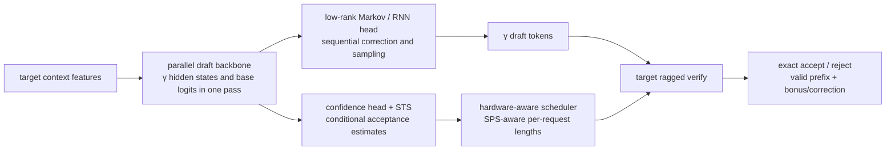
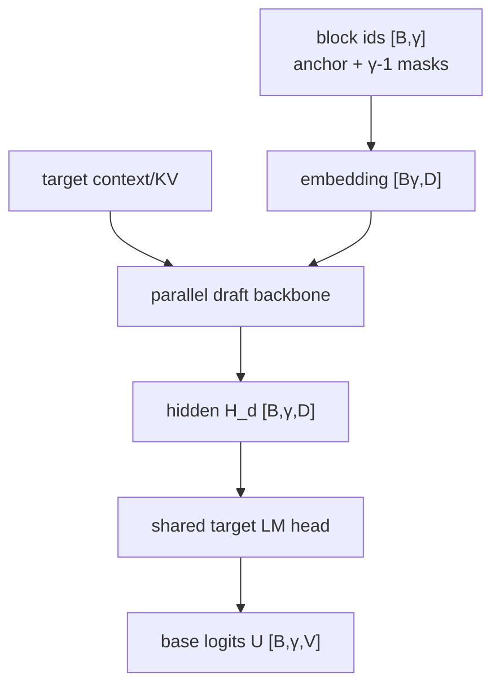
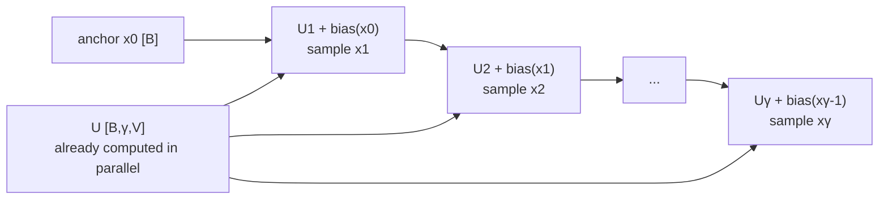
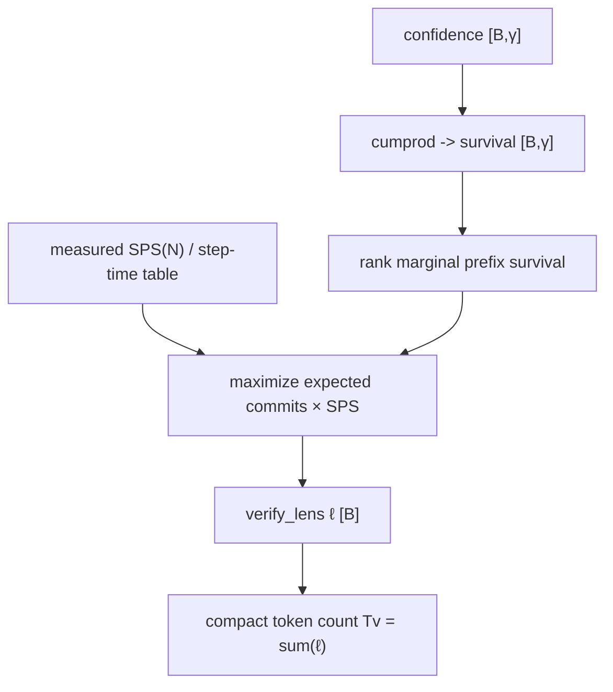
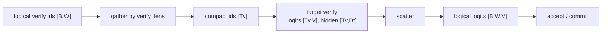

# 05. DSpark: Semi-Autoregressive Drafting and Confidence-Scheduled Verification

[简体中文](../../../zh/ai-infra-basic/Speculative_Decoding/05-dspark-principles.md) | **English**

> This chapter explains the algorithm and system principles without binding them to one SGLang revision. For a function-by-function trace through the implementation, continue with the [SGLang DSpark end-to-end code walkthrough](../../sglang-source-reading/06-advanced-features/09-dspark-code-walkthrough.md).

DSpark does more than make a draft model predict several tokens at once. It addresses three bottlenecks together:

1. an autoregressive drafter runs `γ` serial decoding steps and can become expensive itself;
2. a fully parallel block drafter is fast, but a future position does not know which earlier tokens were actually sampled;
3. always verifying a fixed block wastes target compute on a low-confidence tail that is unlikely to survive.

Its design can be summarized as **parallel heavy compute, sequential lightweight dependency modeling, and dynamic verification length**.



## 1. Notation and accounting boundaries

| Symbol | Meaning |
|---|---|
| `B` | Number of requests in the current decode batch |
| `γ` | Maximum number of proposed draft tokens per request, or block size |
| `W=γ+1` | Logical target-verification width; the extra row is the anchor/current token |
| `S_r` | Committed sequence length of request `r` before this round |
| `D` | Draft-backbone hidden width |
| `D_t` | Target hidden/context feature width |
| `V` | Vocabulary size |
| `r` | Markov low-rank width; the paper commonly uses `r=256` |
| `h_{r,k}` | Draft hidden state for request `r`, proposal position `k`, shape `[D]` |
| `U_{r,k}` | Parallel backbone's base logits, shape `[V]` |
| `x_{r,k}` | Token sampled at proposal position `k` |
| `c_{r,k}` | Conditional probability that proposal `k` is accepted given that its prefix survived |
| `a_{r,k}` | Estimated probability that the accepted draft prefix reaches position `k` |
| `ℓ_r` | Target verification length selected for request `r`, including the anchor |
| `T_v=Σ_r ℓ_r` | Actual token rows sent through compact/ragged target verification |

The most important counting distinction is:

```text
draft proposal:  x_1, x_2, ..., x_γ                 γ tokens
target rows:     anchor, x_1, x_2, ..., x_γ         γ+1 rows
```

The target's anchor row produces the distribution for `x_1`; the `x_1` row produces the distribution for `x_2`; and the last computed row can produce a bonus or correction token. In code, “number of draft tokens” may therefore mean either `γ` or target verify width `γ+1`. Always inspect the variable's contract.

## 2. Begin with the speculative-decoding cost model

A classic linear speculative round performs:

```text
draft γ candidates -> target verifies once -> accept longest prefix -> append bonus/correction
```

If a round costs `T_draft + T_verify` and commits `τ` output tokens on average, latency per output token is approximately

$$
L \approx \frac{T_{draft}+T_{verify}}{\tau}.
$$

There are only three optimization levers:

- reduce `T_draft`;
- improve proposal quality and therefore `τ`;
- avoid verifying a hopeless tail and reduce effective `T_verify`.

An autoregressive small model runs `γ` decode steps:

$$
T_{draft}^{AR}(\gamma)\approx\sum_{k=1}^{\gamma}T_d(k).
$$

Even a small model can lose the gain to `γ` kernel launches, KV reads, and synchronization points. A fully parallel block drafter needs one forward pass but approximates

$$
q(x_{1:\gamma}\mid x_0)\approx\prod_{k=1}^{\gamma}q_k(x_k\mid x_0),
$$

so position `k` does not know the sampled `x_{<k}`. This missing conditioning becomes more harmful farther into the block.

DSpark splits the work:

$$
\underbrace{h_{1:\gamma},U_{1:\gamma}=F_{parallel}(x_0,\text{MASK}_{1:\gamma-1},H_{ctx})}_{\text{one heavy parallel forward}},
$$

then restores token dependency with a small sequential head:

$$
q(x_{1:\gamma}\mid x_0)=\prod_{k=1}^{\gamma}q_k(x_k\mid x_0,x_{<k}).
$$

## 3. Parallel backbone: produce the whole base-logit block once

DSpark reuses a DFlash-style block drafter. Given the current anchor token `x_0`, the common logical input is

```text
[x_0, MASK, MASK, ..., MASK]
```

with shape `[B,γ]`. Some checkpoints use a “do not sample from anchor” layout that retains an extra query row and removes the anchor hidden state before sampling. Do not infer `γ` from a single intermediate tensor without checking this mode.

The block positions interact, while target context features are injected into draft attention. If features are taken from selected target layers,

$$
H_{ctx}=\operatorname{RMSNorm}\left(W_c[H^{(l_1)};H^{(l_2)};\ldots;H^{(l_m)}]\right).
$$

For draft layer `i`, context K/V can be concatenated with the block's K/V:

$$
K_i=[W_i^K H_{ctx};W_i^K H_d],\qquad
V_i=[W_i^V H_{ctx};W_i^V H_d].
$$

The lightweight drafter therefore does not have to re-encode the complete target history. Core shapes for one parallel forward are:

| Stage | Tensor | Shape |
|---|---|---|
| block token ids | `draft_block_ids` | `[B,γ]` |
| flattened ids | `input_ids` | `[B·γ]` |
| embeddings | `E` | `[B·γ,D]` |
| draft hidden | `H_d` | `[B,γ,D]` |
| shared target LM-head weight | `W_lm` | `[V,D]`, vocabulary-sharded under TP |
| base logits | `U=H_d W_lm^T` | `[B,γ,V]` |



Sharing the target embedding and LM head aligns vocabulary semantics and places base logits in the target output coordinate system. It does not make the draft distribution equal to the target distribution; verification remains mandatory.

## 4. The semi-autoregressive core: a low-rank Markov head

The parallel backbone has already produced all `U_k`. Position `k` now only needs a cheap dependency on the previously sampled token `x_{k-1}`.

A direct transition bias would require

$$
B\in\mathbb{R}^{V\times V},\qquad B[x_{k-1},:]\in\mathbb{R}^{V},
$$

which is prohibitive for a vocabulary in the hundred-thousand range. DSpark factorizes it:

$$
B\approx W_1W_2,
\quad W_1\in\mathbb{R}^{V\times r},
\quad W_2\in\mathbb{R}^{r\times V},
\quad r\ll V.
$$

Each step performs

$$
e_{k-1}=W_1[x_{k-1}]\in\mathbb{R}^{r},
$$

$$
b_k=e_{k-1}W_2\in\mathbb{R}^{V},
$$

$$
z_k=U_k+b_k,\qquad x_k\sim\operatorname{softmax}(z_k/T).
$$

### 4.1 Per-step and whole-block shapes

| Object | One request, one step | Batch, one step | Whole block |
|---|---:|---:|---:|
| previous token id | `[]` | `[B]` | `[B,γ]` |
| Markov embedding | `[r]` | `[B,r]` | produced step by step |
| base logits | `[V]` | `[B,V]` | `[B,γ,V]` |
| transition bias | `[V]` | `[B,V]` | need not be persisted |
| corrected logits | `[V]` | `[B,V]` | sampling may retain `[B,γ,V]` |
| sampled token | `[]` | `[B]` | `[B,γ]` |

The dependency is serial, but only a lookup, low-rank projection, and sampling are serial. The expensive Transformer runs once:



That is the meaning of “semi-autoregressive”: the probability factorization is autoregressive, while heavy feature computation is not.

### 4.2 Gated and RNN variants

Vanilla Markov sees only `x_{k-1}`. A gated variant lets the current hidden state control how much transition information to use:

$$
g_k=\sigma(W_g[h_k;e_{k-1}]),\qquad
b_k=W_2(g_k\odot e_{k-1}).
$$

The RNN variant maintains a state `s_k` of width `r`. One equivalent formulation is

$$
u_k=[s_{k-1};e_{k-1};h_k]\in\mathbb{R}^{2r+D},
$$

$$
g_k=\sigma(W_g u_k),\qquad \tilde{s}_k=\tanh(W_c u_k),
$$

$$
s_k=g_k\odot s_{k-1}+(1-g_k)\odot\tilde{s}_k,
$$

$$
b_k=W_2^T\tanh(W_o u_k).
$$

It can compress more of `x_{<k}` than a first-order transition, at higher per-step cost. None of the three heads replaces target verification; they only change draft cost and quality.

## 5. Confidence means conditional acceptance probability

Verifying all `γ` proposals is wasteful: if proposal 2 is rejected, proposals 3 through `γ` cannot be committed along that chain even if their target logits were computed.

The confidence head predicts

$$
c_k\approx P(A_k=1\mid A_1=\cdots=A_{k-1}=1,\text{draft state}),
$$

where `A_k=1` means candidate `k` passes verification. A typical head consumes the draft hidden and previous-token Markov embedding:

$$
c_k=\sigma\left(w^T[h_k;W_1[x_{k-1}]]\right).
$$

Shape flow:

```text
draft hidden                  [B,γ,D]
previous-token embeddings     [B,γ,r]
concatenation                 [B,γ,D+r]
linear raw confidence         [B,γ,1]
squeeze + sigmoid/STS         [B,γ]
```

A soft training target can be built from total variation distance between draft and target distributions:

$$
c_k^*=1-\frac12\lVert q_k-p_k\rVert_1.
$$

Because `\frac12\|q-p\|_1∈[0,1]`, closer distributions produce labels closer to one. This is not the maximum softmax probability and not a hard guarantee of acceptance.

### 5.1 From conditional confidence to prefix survival

Candidate `j` is useful only if candidates 1 through `j` all pass:

$$
a_j=P(A_1=\cdots=A_j=1)\approx\prod_{i=1}^{j}c_i.
$$

For example:

```text
c = [0.90, 0.80, 0.50, 0.20]
a = [0.90, 0.72, 0.36, 0.072]
```

Sorting raw `c_k` is incorrect because a later token cannot skip an earlier token. Scheduling must operate on prefix survival and preserve prefix closure.

### 5.2 STS calibrates a complete prefix, not isolated classifications

Raw confidence can be overconfident or conservative. Sequential Temperature Scaling learns a temperature per position:

$$
\hat c_k=\sigma(z_k/T_k),\qquad
\hat a_j=\prod_{k=1}^{j}\hat c_k.
$$

Calibration aims to match predicted prefix survival to the observed accepted-length distribution. Because the scheduler consumes a product, small tail errors accumulate even when per-position classification accuracy looks good.

## 6. Hardware-aware scheduling is not thresholding confidence

Every request first verifies its anchor row. Initial total target rows and expected commits are therefore

$$
N=B,\qquad E=B.
$$

Adding candidate `j` for request `r` increments both compute and expected output:

$$
N\leftarrow N+1,\qquad E\leftarrow E+a_{r,j}.
$$

The system cares about output per wall-clock time:

$$
\Theta(N)=E(N)\cdot SPS(N),
$$

where `SPS(N)` is measured target steps per second at `N` verification rows. It captures graph tiers, padding, attention kernels, and TP/DP synchronization and is often jagged rather than smooth.

The scheduler considers candidate prefix extensions `(request,position)` by marginal survival, evaluates the throughput objective, and produces a prefix length `ℓ_r` for each request. A result with a hole in the middle is invalid.

### 6.1 Worked example: `B=3, γ=4`

Suppose conditional confidence is

```text
R0: [0.95, 0.80, 0.50, 0.20]
R1: [0.70, 0.60, 0.50, 0.40]
R2: [0.99, 0.95, 0.90, 0.80]
```

Then prefix survival is

```text
R0: [0.950, 0.760, 0.380, 0.076]
R1: [0.700, 0.420, 0.210, 0.084]
R2: [0.990, 0.941, 0.847, 0.678]
```

The anchor-only state is `ℓ=[1,1,1]`, `N=3`, `E=3`. If the hardware curve says a budget of nine rows maximizes throughput, six candidates might be allocated as all four R2 candidates plus the first two R0 candidates:

```text
ℓ = [3, 1, 5]        # lengths include anchors
N = 3 + 1 + 5 = 9
```

The implementation cannot select R0 position 2 while dropping position 1; it must enforce prefix closure.



### 6.2 Why production scheduling is lagged

Current-round confidence exists only after the draft forward. Copying it to the CPU and deciding that same round's graph shape creates a device-host synchronization and breaks overlap. An overlap scheduler must also not use information that is only produced after work was logically scheduled.

SGLang's production path can keep confidence and request-generation rings and use confidence from an earlier round for the same live request. This:

- removes synchronization from the hot path;
- prevents future-information leakage;
- uses generation ids so a new request reusing a slot cannot inherit stale confidence.

Lag trades scheduling accuracy for pipeline efficiency; it does not alter the target acceptance rule.

## 7. Ragged verification packs different lengths into one batch

For `ℓ=[3,1,5]`, fixed-width work is `B·W=3·5=15` rows, while compact work contains only `T_v=9` rows:

```text
fixed-stride:
R0 [anchor d1 d2 -- --]
R1 [anchor -- -- -- --]
R2 [anchor d1 d2 d3 d4]

front-packed compact:
[R0:a R0:d1 R0:d2 | R1:a | R2:a R2:d1 R2:d2 R2:d3 R2:d4]
```

The runtime constructs:

| Metadata | Shape | Purpose |
|---|---:|---|
| `verify_lens` | `[B]` | Valid rows per request |
| `cu_seqlens` / offsets | `[B+1]` | Request boundaries in the packed buffer |
| compact token ids | `[T_v]` | Actual target inputs |
| positions | `[T_v]` | Absolute position of every row |
| cache locations | `[T_v]` | Temporary target KV slots |
| scatter index | `[T_v]` | Mapping back to logical `[B,W]` |

After target forward, logits and hidden states are commonly scattered back to fixed-stride `[B,W,...]`. Greedy/rejection sampling, logprob, grammar, and other shared logic can then retain one logical interface.



Graph replay normally rounds `T_v` up to a captured tier. Nine valid rows may replay a 12- or 16-row graph, with metadata marking the nine useful rows. Under DP attention, ranks coordinate the largest required tier so collective shapes remain consistent.

## 8. Three verification modes

| Mode | Target work | Maximum commit | Purpose |
|---|---|---|---|
| `static` | all `B·W` rows | full window | baseline, debugging, checkpoints without confidence |
| `compact` | `Σℓ_r` valid rows, rounded to graph tier | within `ℓ_r` | recommended production path |
| `cap-accept` | all `B·W` rows | truncated to `ℓ_r` | experiment that separates commit capping from compute reduction |

`cap-accept` cannot save the target FLOPs that compact mode saves. It answers a different question: with the same acceptance cap, how much would the full block have accepted?

## 9. Exactness: acceleration must preserve the target distribution

For greedy decoding, candidates are truncated at the first mismatch with the target argmax, and the target token at that position becomes the bonus/correction.

For sampling, candidate `x_k` is accepted with probability

$$
\alpha_k=\min\left(1,\frac{p_k(x_k)}{q_k(x_k)}\right).
$$

On rejection, sample from the residual distribution

$$
p'_k(x)=\frac{\max(p_k(x)-q_k(x),0)}
{\sum_v\max(p_k(v)-q_k(v),0)}.
$$

Dynamic length preserves the target distribution when target logits and proposal probabilities are correct, verification follows the longest-prefix rule, and scheduling only removes an unverified tail. The scheduler decides how much to compute; the acceptor decides what may be committed.

For request `r`:

```text
correct_len_r = number of accepted draft tokens
commit_len_r  = correct_len_r + one bonus/correction token
new_seq_len_r = S_r + commit_len_r
```

When the budget caps the window at `ℓ_r`, the implementation must gate commit to computed rows and commit only the matching KV/hidden state.

## 10. Training objectives

Training usually freezes the target, shares and freezes its embedding and LM head, and trains the draft backbone, Markov/RNN head, and confidence head.

A position-decay weight can be

$$
w_k=\exp\left(-\frac{k-1}{\gamma}\right).
$$

Token cross-entropy:

$$
\mathcal L_{CE}=-\sum_{k=1}^{\gamma}w_k\log q_k(x_k^*).
$$

Target-distribution total variation:

$$
\mathcal L_{TV}=\sum_{k=1}^{\gamma}w_k\lVert q_k-p_k\rVert_1.
$$

Confidence BCE with soft targets:

$$
\mathcal L_{conf}=-\sum_k[c_k^*\log c_k+(1-c_k^*)\log(1-c_k)].
$$

The paper's combined objective is

$$
\mathcal L=0.1\mathcal L_{CE}+0.9\mathcal L_{TV}+1.0\mathcal L_{conf}.
$$

The high TV weight reflects the real goal: not merely predict the training label, but make the complete proposal distribution close to the target so exact rejection sampling accepts more often.

## 11. One-round shape ledger

This table uses the common `sample_from_anchor=True` semantics. A special checkpoint may produce an extra anchor hidden row and slice it before sampling.

| Order | Stage | Input shape | Output shape |
|---:|---|---|---|
| 1 | build block | bonus/anchor `[B]` | ids `[B,γ]` |
| 2 | draft backbone | ids `[B,γ]`, context cache | hidden `[B,γ,D]` |
| 3 | shared LM head | hidden `[B,γ,D]` | base logits `[B,γ,V]` |
| 4 | Markov sampling | base logits + previous ids | tokens `[B,γ]`; sampling may retain corrected logits `[B,γ,V]` |
| 5 | confidence | hidden + previous embeddings | confidence `[B,γ]` |
| 6 | schedule | confidence `[B,γ]` + SPS table | verify lengths `[B]` |
| 7 | logical verify | anchor `[B,1]` + tokens `[B,γ]` | ids `[B,γ+1]` |
| 8 | compact | ids + lengths | compact ids `[T_v]` |
| 9 | target verify | compact ids `[T_v]` | logits `[T_v,V]`, hidden `[T_v,D_t]` |
| 10 | scatter/accept | logical logits `[B,γ+1,V]` | commit lengths `[B]`, bonus `[B]`, output tokens |
| 11 | state commit | accepted-prefix metadata | new sequence lengths `[B]`, persistent target/draft KV |

## 12. Performance limits and common misconceptions

### 12.1 DSpark is not faster for every batch

The gain depends on

$$
\text{speedup}\approx
\frac{\text{baseline target step time}\times\text{baseline steps}}
{T_{parallel\ draft}+T_{sequential\ head}+T_{ragged\ verify}+T_{bookkeeping}}.
$$

Low acceptance, tiny batches, excessive graph-tier padding, or expensive draft/target communication can remove the gain. The paper's small sequential-head overhead is measured under specific models and hardware and is not a universal constant.

### 12.2 Confidence is not the correctness judge

Confidence allocates target compute. Final tokens are selected by target verification and exact acceptance. A badly calibrated confidence model should hurt performance, not change the output distribution.

### 12.3 Larger `γ` is not automatically better

A larger block raises the theoretical accepted-length ceiling but also increases draft hidden/base-logit storage, sampling work, confidence work, and maximum graph shape. When tail survival is tiny, a larger block only expands memory and capture tiers.

### 12.4 Dynamic length does not mean arbitrary graph shapes

CUDA/NPU graphs still use discrete capture tiers. Ragged layout reduces valid tokens, while replay may round up. Tune using valid `T_v`, capture tier, padding ratio, accepted length, and SPS together—not average `ℓ` alone.

## 13. Relationship to DFlash and EAGLE

| Dimension | DFlash | DSpark | EAGLE family |
|---|---|---|---|
| heavy draft compute | parallel block | parallel block | feature autoregression/tree expansion, depending on version |
| token dependency | weaker or block-modeled | explicit low-rank Markov/Gated/RNN | draft feature chain and candidate tree |
| verify geometry | primarily fixed block | confidence-driven ragged prefix | primarily dynamic tree |
| target hidden use | context/KV injection | reuses DFlash injection | predicts target features |
| scheduling focus | draft/verify pipeline | prefix survival × hardware SPS | width, depth, and node budget |

DSpark is not “DFlash plus a threshold.” It closes the loop across semi-autoregressive sampling, calibrated confidence, a hardware cost table, ragged verification, and safe state commit.

## 14. Exercises

1. Why does `γ=7` imply a logical target window of eight rows?
2. Why is a serial low-rank Markov head still cheaper than an autoregressive small model?
3. For `c=[0.8,0.7,0.5]`, compute all three prefix-survival probabilities.
4. Why optimize `expected commits × SPS` instead of using `c_k>0.5`?
5. What is the fundamental target-compute difference between `compact` and `cap-accept`?
6. Why should confidence errors not change the final token distribution? Which implementation bugs could violate that property?
7. Why scatter ragged results back to `[B,W,...]`?

## 15. References and next step

- [DSpark paper: Confidence-Scheduled Speculative Decoding with Semi-Autoregressive Generation](https://arxiv.org/abs/2607.05147)
- [Official SGLang DSpark introduction](https://www.lmsys.org/blog/2026-07-06-dspark-sglang/)
- [SGLang DSpark source directory](https://github.com/sgl-project/sglang/tree/main/python/sglang/srt/speculative/dspark_components)
- [This topic: rejection-sampling mathematics](./02-rejection-sampling-math.md)
- [Next: SGLang DSpark end-to-end code walkthrough](../../sglang-source-reading/06-advanced-features/09-dspark-code-walkthrough.md)
