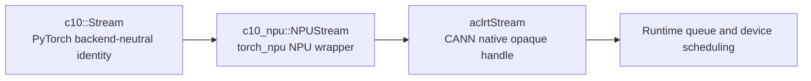
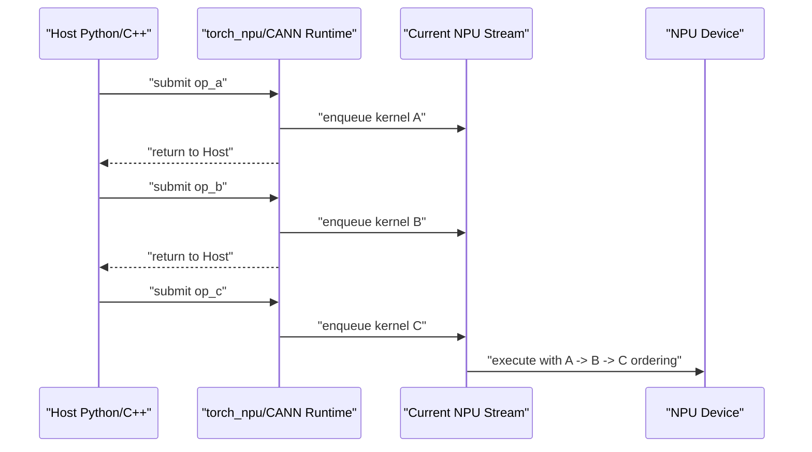
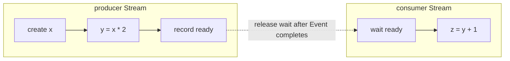
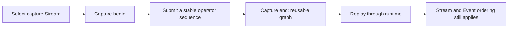

# torch_npu 02: Streams, Events, Asynchronous Lifetimes, and Graph Capture

> This chapter explains a mechanism shared by PyTorch, `torch_npu`, CANN, and `sgl-kernel-npu`: how Host code queues NPU work, preserves dependencies, keeps tensor memory alive, and why none of this is the same as building a computation graph.

## 0. Learning Goals

After this chapter, you should be able to explain:

1. what a Stream is and is not;
2. why asynchronous Host submission and ordered execution can coexist;
3. the roles of `c10::Stream`, `c10_npu::NPUStream`, and `aclrtStream`;
4. why Host wrappers call `getCurrentNPUStream()`;
5. the distinct jobs of `record_stream`, `wait_stream`, Events, and synchronization;
6. how to use multiple Streams safely;
7. how Streams relate to eager execution, autograd graphs, and NPU graph capture;
8. how these ideas appear in real `sgl-kernel-npu` source.

Recommended prerequisites:

- [Foundation 03: Memory, Pipeline, and Synchronization](../foundations/03-memory-pipeline-and-sync.md)
- [torch_npu 01: Dispatcher, ACLNN, and Custom Op Boundaries](./01-dispatch-aclnn-and-custom-op-boundaries.md)
- [sgl-kernel-npu 01: Repository Structure and Operator Lifecycle](../sgl-kernel-npu/01-repository-and-op-lifecycle.md)

---

## 1. A Precise Definition

A **Stream** is an ordered sequence through which Host/runtime code submits asynchronous tasks to a device.

The terms in that definition mean:

- **Host**: the CPU process running Python, PyTorch, and C++ wrappers;
- **runtime**: software connecting Host code to the NPU, mainly `torch_npu` and CANN Runtime here;
- **device**: the Ascend NPU that executes kernels;
- **task**: a kernel launch, asynchronous copy, Event record/wait, or operator-library call;
- **asynchronous**: the Host can usually continue after submission without waiting for the NPU;
- **ordered**: tasks in one Stream obey their submission dependencies, also called in-order or FIFO semantics.

These statements are therefore compatible:

```text
From the Host's view: submit A and continue quickly, so submission is asynchronous.
Within one Stream: B cannot violate the A -> B dependency, so execution is ordered.
```

A useful first analogy is a task lane:

- the Host places work onto the lane;
- work in one lane does not overtake earlier work;
- separate lanes may overlap, but hardware contention can still serialize them;
- an Event acts as a signal between lanes;
- synchronization makes the Host stop and wait for progress.

This is only an ordering analogy. A Stream is not a physical lane and is not bound one-to-one to an AI Core.

### 1.1 Software View: A Layered Logical Execution Sequence

A logical Stream is represented by related runtime state across several layers:

```text
Python torch_npu.npu.Stream object
  -> C10/torch_npu Stream ID, device ID, and current-Stream state
  -> optional torch_npu Host Task Queue
  -> CANN aclrtStream handle and runtime task queue
  -> ordered tasks observed by driver/device scheduling
```

The **Host Task Queue** is an optional torch_npu software submission layer. With task-queue mode enabled, the calling thread can enqueue a callback that will later invoke a CANN launch. It is not the same object as the CANN Stream:

- a Host Task Queue item may mean “invoke this CANN launch callback”;
- the CANN Stream carries Device tasks such as kernels, copies, and Event waits;
- both layers can be asynchronous;
- both must preserve the same logical Stream order.

`sgl-kernel-npu` passes its launch lambda through `OpCommand::RunOpApi`. With task-queue mode enabled, torch_npu packages the callback as `QueueParas` and calls `enCurrentNPUStream`; otherwise it invokes the callback directly. Either path eventually submits work to an `aclrtStream`.

### 1.2 Hardware View: There Is No Compute Unit Named “Stream”

A Stream is not an AI Core, Vector Core, MTE, register file, or tensor-memory region. Conceptually:

1. Host runtime encodes kernels, asynchronous copies, and Event operations as device-recognizable tasks;
2. runtime/driver submits the tasks with Stream identity and ordering metadata;
3. device control and scheduling mechanisms select ready tasks;
4. a kernel is dispatched to AI Core/Vector Core resources according to its type, `blockDim`, and tiling;
5. movement tasks use the corresponding data-movement engines.

For hardware, the Stream identifies an ordered timeline, not a particular core. One kernel may occupy many cores, and later kernels in the same Stream can use different resources. Multiple Streams permit independent tasks to be considered concurrently; actual overlap still depends on resource availability.

Official documentation's “task queue” description is the externally guaranteed semantic model. Product versions and fast-launch configurations can change internal queue, notification, and scheduling resources, so do not model a Stream as one physical FIFO permanently attached to an AI Core.

---

## 2. What a Stream Is Not

| Object | Layer | Purpose | A Stream? |
|---|---|---|---|
| CPU thread | Host OS | Executes Python/C++ | No; it may submit to a Stream |
| Process | Host OS | Owns address space and threads | No |
| AI Core / Vector Core | NPU hardware | Executes matrix, vector, and movement instructions | No |
| Kernel | Device program | Performs one parallel computation | No; its launch is a Stream task |
| Ascend C `TPipe` / `TQue` | Inside one Device kernel | Coordinates on-chip movement/compute stages | No |
| Computation graph | Framework/graph layer | Describes operators and data dependencies | No |
| Event | Runtime synchronization object | Marks progress in a Stream | No |

Two different kinds of “queue” are especially easy to confuse:

```text
Host/runtime Stream
  kernel A -> memcpy B -> kernel C
  spans multiple launches

Ascend C Device TQue
  CopyIn tile 0 -> Compute tile 0 -> CopyOut tile 0
  exists inside one kernel execution
```

See [Foundation 03](../foundations/03-memory-pipeline-and-sync.md) for Device-side queues and pipelines.

---

## 3. Three Representations of One Logical Stream

### 3.1 `c10::Stream`: PyTorch's Backend-Neutral Identity

`c10::Stream` is a C++ value type in PyTorch's C10 layer. Conceptually, it carries:

```text
device type + device index + Stream identity
```

Generic PyTorch code must not depend directly on CUDA or NPU native handles. A `c10::Stream` therefore identifies a Stream across backends; it is not the runtime queue itself and is not an NPU address.

### 3.2 `c10_npu::NPUStream`: torch_npu's Backend Wrapper

Real Host source commonly contains:

```cpp
auto npuStream = c10_npu::getCurrentNPUStream();
```

Here:

- `auto` deduces `c10_npu::NPUStream`;
- the value is a lightweight Host-side C++ wrapper;
- `getCurrentNPUStream()` queries an existing current Stream rather than creating one;
- querying it does not launch a kernel.

### 3.3 `aclrtStream`: CANN's Native Opaque Handle

Code that calls a CANN launch interface often needs:

```cpp
aclrtStream stream = c10_npu::getCurrentNPUStream().stream(false);
```

An **opaque handle** is an identifier whose internal representation callers must not depend on. `.stream(false)` extracts the CANN-native `aclrtStream` from the `NPUStream` wrapper so a launch API knows which ordered sequence receives the work.



These are normally representations of the same logical Stream at different abstraction layers, not three unrelated Streams.

---

## 4. Default Stream and Current Stream

The **default Stream** is a fixed execution sequence made available for a device/context. The **current Stream** is the sequence currently selected by the framework for a device and Host execution context.

Most PyTorch NPU operators do not expose a `stream` argument. They implicitly use the current Stream:

```python
import torch_npu

current = torch_npu.npu.current_stream()
default = torch_npu.npu.default_stream()
```

A context manager temporarily changes the current Stream and restores it on exit:

```python
import torch
import torch_npu

side = torch_npu.npu.Stream()
with torch_npu.npu.stream(side):
    y = torch.ones(1024, device="npu") * 2
```

Leaving the `with` block restores the prior current Stream. It does **not** prove that NPU work in `side` has finished.

### Why a Custom Op Must Respect the Current Stream

Suppose PyTorch has established:

```text
producer(x) -> custom_op(x) -> consumer(y)
```

If the custom wrapper silently launches into another Stream without Events, it may read `x` before the producer finishes, and the consumer may read `y` before the custom kernel finishes. Using `getCurrentNPUStream()` preserves the caller's existing same-Stream ordering.

---

## 5. How Asynchronous Execution Works

For:

```python
a = op_a(x)
b = op_b(a)
c = op_c(b)
```

eager execution is approximately:



Python may reach the next statement while Device execution of A is still in progress. Correctness comes from same-Stream ordering and tensor storage lifetime, not from synchronizing after every Python line.

A Python/C++ function returning usually means the launch was submitted, not that every output element is already computed.

---

## 6. Multiple Streams and Events

Different Streams have no implicit mutual order:

```text
Stream A: A1 -> A2
Stream B: B1 -> B2
```

A1 precedes A2 and B1 precedes B2. Submission order alone does not establish an A2-versus-B1 dependency.

An **Event** is a runtime progress marker. When recorded in Stream A, it becomes complete only after earlier A work completes:

```text
Stream A: producer(x) -> record E
Stream B: wait E -> consumer(x)
```

The wait is normally enqueued asynchronously; the Host need not block.

`wait_stream(other)` expresses that future work in this Stream must wait for work already submitted to `other`. Conceptually, it records an Event in `other` and queues a wait in this Stream.

```python
import torch
import torch_npu

main = torch_npu.npu.current_stream()
side = torch_npu.npu.Stream()
x = torch.ones(1024, device="npu")

side.wait_stream(main)
with torch_npu.npu.stream(side):
    x.record_stream(side)
    y = x * 2

main.wait_stream(side)
z = y + 1
```

The two `wait_stream` calls establish **execution dependencies**. `x.record_stream(side)` establishes **memory-lifetime bookkeeping**. Neither substitutes for the other.

Multiple Streams merely create an opportunity for concurrency. Actual overlap depends on kernel resource use, Cube/Vector/MTE occupancy, memory bandwidth, hardware/runtime support, and Event dependencies.

### 6.1 Practice: Establish a Two-Stream Dependency With an Event

This minimum runnable example requires an Ascend NPU, PyTorch, and `torch_npu`:

```python
import torch
import torch_npu

device = torch.device("npu:0")
producer = torch_npu.npu.Stream(device=device)
consumer = torch_npu.npu.Stream(device=device)
ready = torch_npu.npu.Event()

with torch_npu.npu.stream(producer):
    x = torch.arange(1024, device=device, dtype=torch.float32)
    y = x * 2
    ready.record()

with torch_npu.npu.stream(consumer):
    consumer.wait_event(ready)
    y.record_stream(consumer)
    z = y + 1

consumer.synchronize()
torch.testing.assert_close(
    z.cpu(),
    torch.arange(1024, dtype=torch.float32) * 2 + 1,
)
```



The Event affects scheduling as follows:

1. `ready.record()` inserts a progress marker in producer;
2. the marker completes only after earlier producer work;
3. `consumer.wait_event(ready)` inserts a wait task in consumer;
4. subsequent consumer work cannot become executable until the Event completes;
5. the Device runtime releases that dependency after completion;
6. the Host does not block while enqueuing the wait.

Deleting `consumer.wait_event(ready)` removes the data-readiness dependency. A correct result in one run would only be a scheduling accident.

### 6.2 Practice: Distinguish Event Query, Wait, and Synchronize

```python
import torch
import torch_npu

stream = torch_npu.npu.current_stream()
done = torch_npu.npu.Event()

x = torch.randn((4096, 4096), device="npu")
y = x @ x
done.record(stream)

print("Event complete now?", done.query())
done.synchronize()
print("Event complete after synchronize?", done.query())
```

`query()` checks without waiting and may return either value on the first call. `synchronize()` blocks the Host until the Event completes.

---

## 7. `record_stream`: Storage Lifetime, Not Execution Order

### 7.1 Object Lifetime Is Not Storage Reuse Time

PyTorch's caching allocator reuses NPU memory blocks. A Python/C++ Tensor is a Host handle; **storage** is the Device allocation holding its elements. Losing the last Tensor reference only sends a free request to the allocator. Device work may still be using the address.

The real question is:

> When the allocator reissues an address, has every Stream passed the old storage's last-use point?

### 7.2 What torch_npu Actually Records

`tensor.record_stream(S)` inserts `S` into the allocation block's `stream_uses`. The important branches in [`NPUCachingAllocator.cpp`](https://gitee.com/ascend/pytorch/blob/e04f000ce9e11177d193a398644d8fcb67a90cef/torch_npu/csrc/core/npu/NPUCachingAllocator.cpp), with locks and logging omitted, are:

```cpp
void recordStream(Block* block, c10_npu::NPUStream stream) {
    block->stream_uses.insert(stream);
}

void free(Block* block) {
    if (!block->stream_uses.empty()) {
        insert_events(block);
    } else {
        free_block(block);
    }
}

void insert_events(Block* block) {
    for (auto& stream : block->stream_uses) {
        auto event = create_event_internal(stream.device_index());
        event->record(stream);
        block->event_count++;
        npu_events[stream].emplace_back(std::move(event), block);
    }
}
```

The block becomes reusable only after the recorded Stream Events complete. This does not launch a kernel, copy data, establish producer/consumer order, block Host, or capture a graph.

The shown NPU allocator path does not filter out “recorded Stream equals allocation Stream” at entry. Such a call normally adds no correctness fact, but it is not necessarily a zero-cost no-op: freeing the block may take the Event-delayed path.

### 7.3 Same-Stream Safety Versus Cross-Stream Risk

Same Stream:

```text
S: allocate p -> old kernel uses p -> reissue p -> new kernel uses p
```

The new Device use remains after the old use in S. No extra Event is normally required.

Cross Stream:

```text
S0 allocation: allocate p ----------------------> reuse p?
S1 use:                         kernel uses p
```

Correct lifetime choices are:

1. `p.record_stream(S1)`; or
2. record completion in S1, make S0 wait for that Event, then allow the final reference to disappear.

Data readiness is separate:

```text
wait_event:    data is ready before consumer reads
record_stream: address remains alive while consumer may read
```

### 7.4 Why Is `apply_token_bitmask` the Only Explicit Call Site?

#### Conclusion

Static analysis of current `sgl-kernel-npu@fcb5489d` supports a stronger conclusion:

> `apply_token_bitmask` has no algorithmic cross-Stream requirement. Its ATen preparation, custom launch, and result copy/scatter all use the same current NPU Stream. For normal callers that obey the PyTorch Stream contract, both `record_stream(current)` calls are correctness-redundant; token-bitmask semantics do not require them.

They provide limited defensive protection when a working tensor aliases storage allocated on another Stream and the caller is about to drop the final reference. This is not a complete arbitrary-cross-Stream contract, and removal still requires NPU/task-queue/graph stress tests.

#### There Is Only One Runtime Stream in This Wrapper

The real [`EXEC_KERNEL_CMD`](https://github.com/sgl-project/sgl-kernel-npu/blob/fcb5489d66702a5bc3d09fa3854231e943d6abe8/csrc/utils/torch_helper.h#L120-L134) always obtains the current Stream:

```cpp
auto acl_stream = c10_npu::getCurrentNPUStream().stream(false);
auto converted_params = TorchNpuHelper::ConvertTypes(__VA_ARGS__);
auto acl_call = [acl_stream, blockdim, converted_params]() -> int {
    // launch kernel on acl_stream
    return 0;
};
at_npu::native::OpCommand::RunOpApi(kernel_name, acl_call);
```

`ConvertTypes` produces raw `data_ptr()` values, and `RunOpApi` may queue the callback in the Host task queue, but neither fact creates a second Device Stream. Raw pointers, local variables, and asynchronous callbacks are not sufficient reasons to record; a cross-Stream last use is the deciding condition.

#### Audit Every Working-Tensor Branch

See the real [`apply_token_bitmask.cpp`](https://github.com/sgl-project/sgl-kernel-npu/blob/fcb5489d66702a5bc3d09fa3854231e943d6abe8/csrc/apply_token_bitmask/op_host/apply_token_bitmask.cpp).

| Branch | `workingLogits` | `workingBitmask` | Leaves current Stream? |
|---|---|---|---|
| No indices, no padding | aliases `logits` | aliases `bitmask` | No |
| No indices, padding | current-Stream `zeros + copy_` | alias or current-Stream `zeros + copy_` | No |
| With indices | current-Stream index/contiguous/padding result | current-Stream index/contiguous/padding result | No |

The later `narrow`, `index_put_`, and `copy_` also use current Stream.

- An internally allocated working block is created and consumed on current Stream.
- An aliased `workingLogits` is normally the returned `logits`, so the result keeps its storage referenced.
- An aliased `workingBitmask` allocated on current Stream is protected by same-Stream ordering.
- Only the case “bitmask allocated on S0, operator invoked on S1, last reference dropped early” gains real lifetime protection from the internal S1 record.

The defense is also incomplete for arbitrary cross-Stream inputs: `rowIndices` may alias `indices` but is not recorded, and no record makes the data ready. The accurate label is **local, asymmetric defensive bookkeeping**, not an operator-semantic necessity.

`workingLogits.record_stream(current)` is especially redundant: either it aliases the returned output or it is a current-Stream temporary consumed by current-Stream copy/scatter. `workingBitmask.record_stream(current)` can matter only for the cross-Stream alias edge case above.

### 7.5 Do Other Operators Use a Hidden Equivalent?

Mostly no—they avoid the cross-Stream condition, so there is nothing to replace.

`EXEC_KERNEL_CMD` does not automatically record Tensor arguments. Other wrappers submit local raw-pointer temporaries without explicit records:

Current [`causal_conv1d.cpp#L307-L321`](https://github.com/sgl-project/sgl-kernel-npu/blob/fcb5489d66702a5bc3d09fa3854231e943d6abe8/csrc/causal_conv1d/op_host/causal_conv1d.cpp#L307-L321) and [`#L396-L403`](https://github.com/sgl-project/sgl-kernel-npu/blob/fcb5489d66702a5bc3d09fa3854231e943d6abe8/csrc/causal_conv1d/op_host/causal_conv1d.cpp#L396-L403):

```cpp
at::Tensor y = at::empty_like(x);
at::Tensor bias_tensor = hasBias ? bias : at::empty({0}, x.options());
at::Tensor cache_indices_tensor =
    hasCacheIndices
        ? cache_indices.to(at::kLong)
        : at::empty({0}, x.options().dtype(at::kLong));

auto workspaceTensor =
    at::empty(
        {totalWorkspace},
        at::TensorOptions().dtype(at::kByte).device(x.options().device()));

EXEC_KERNEL_CMD(
    causal_conv1d,
    blockDim,
    x,
    weight,
    conv_states,
    bias_tensor,
    query_start_loc_tensor,
    cache_indices_tensor,
    has_initial_state_tensor,
    num_accepted_tokens_tensor,
    y,
    workspaceTensor,
    tilingTensor);
return y;
```

[`catlass_matmul_basic.cpp#L85-L89`](https://github.com/sgl-project/sgl-kernel-npu/blob/fcb5489d66702a5bc3d09fa3854231e943d6abe8/csrc/catlass/op_host/catlass_matmul_basic.cpp#L85-L89):

```cpp
auto tiling_tensor = get_tiling(
    m, n, k, formatMode, dTypeMap[aType], blockDim);
auto workspace_tensor = at::empty(
    {1},
    at::TensorOptions().dtype(at::kByte).device(input_a.options().device()));
EXEC_KERNEL_CMD(catlass_matmul_basic, blockDim, input_a, input_b,
                output_c, workspace_tensor, tiling_tensor);
```

These rely on current-Stream allocation and use, not another hidden lifetime API. A module that genuinely selects a side/communication Stream must instead combine:

1. producer Event plus consumer wait for readiness;
2. `record_stream(consumer)` for allocator lifetime; or
3. a strong-reference keepalive until a completion Event, optionally with the allocation Stream waiting on that Event.

SGLang's [`deepseek_v4.py#L2005-L2029`](https://github.com/sgl-project/sglang/blob/ddaf430e6c59a88da0a6cca4c71033cedf102a88/python/sglang/srt/models/deepseek_v4.py#L2005-L2029) contains a real Event-plus-keepalive alternative: it stores an asynchronous communication input in `state.combine_keepalive`, waits for `combine_event`, and only then drops the reference. That code uses CUDA APIs, but the ownership pattern maps directly to `torch.npu.Stream/Event`.

### 7.6 Two Experiments

For a same-Stream A/B test, build one version with the two records and one without them, then loop over default-Stream calls under allocator pressure:

```python
import torch
import torch_npu

for _ in range(10_000):
    logits = torch.randn((8, 32000), device="npu", dtype=torch.float16)
    bitmask = torch.full((8, 1000), -1, device="npu", dtype=torch.int32)
    out = torch.ops.npu.apply_token_bitmask(logits, bitmask)
    pressure = torch.empty_like(bitmask)
torch.npu.synchronize()
```

Cover task queue, graph capture, padding, indices, and all supported dtypes. Equal correctness plus fewer allocator Events supports the same-Stream redundancy conclusion.

For a genuine cross-Stream test:

```python
producer = torch.npu.Stream()
consumer = torch.npu.Stream()

with torch.npu.stream(producer):
    logits = torch.randn((8, 32000), device="npu", dtype=torch.float16)
    bitmask = torch.full((8, 1000), -1, device="npu", dtype=torch.int32)
    ready = producer.record_event()

with torch.npu.stream(consumer):
    consumer.wait_event(ready)       # readiness
    out = torch.ops.npu.apply_token_bitmask(logits, bitmask)
    bitmask.record_stream(consumer)  # lifetime
```

Removing the wait tests a data race. Removing the record, dropping `bitmask`, and applying allocation pressure on producer tests early reuse. They are different failures.

### 7.7 Audit Checklist

1. Which Stream allocated the storage?
2. Which Stream performs its final asynchronous use?
3. If they differ, where is producer-to-consumer readiness established?
4. Is lifetime covered by `record_stream(consumer)`, a keepalive, or a completion Event waited by the allocation Stream?
5. Are every alias and temporary covered?

Do not use “asynchronous operator,” “raw pointer,” or “local variable” as standalone criteria. The decisive relationship is allocation Stream versus last-use Stream versus reuse Stream.

---

## 8. Keep the Synchronization Mechanisms Separate

| Mechanism | Wait relationship | Blocks Host? | Purpose |
|---|---|---:|---|
| Same-Stream order | Later task waits for earlier task | No | Ordinary operator dependencies |
| `wait_event` / `wait_stream` | One Stream waits for another's progress | No | Cross-Stream dependency |
| `stream.synchronize()` | Host waits for one Stream | Yes | Debugging, Host reads, timing |
| `torch_npu.npu.synchronize()` | Host waits for submitted device work | Yes | Coarse device boundary |
| `query()` | No wait; completion check only | No | Polling |
| `record_stream()` | No execution wait | No | Allocator lifetime tracking |

Synchronizing after every operator destroys Host/device overlap and asynchronous scheduling. Prefer same-Stream ordering and precise Events, and block the Host only at a real asynchronous boundary such as a CPU read, debugging boundary, or measured interval.

---

## 9. Source Walkthrough in `sgl-kernel-npu`

### 9.1 `apply_token_bitmask`

Source:

- [`apply_token_bitmask.cpp#L133-L153`](https://github.com/sgl-project/sgl-kernel-npu/blob/d5630dff41c8108216f835597e63f6d3a7445908/csrc/apply_token_bitmask/op_host/apply_token_bitmask.cpp#L133-L153)

Fixed-commit source excerpt:

```cpp
// Prevent NPU storage from being reclaimed before async kernel completes
auto npuStream = c10_npu::getCurrentNPUStream();
workingLogits.record_stream(npuStream);
workingBitmask.record_stream(npuStream);

// ...
if (dtype == at::kFloat) {
    EXEC_KERNEL_CMD(apply_token_bitmask_fp32, blockDim, workingLogits,
                    workingBitmask, numRowsU32, vocabSizeU32,
                    logitsStrideU32, bitmaskStrideU32, baseRows,
                    extraCores, tileLength, blockDim, dtypeSizeU32);
}
```

The types and responsibilities are:

1. `workingLogits` and `workingBitmask` are Host-side `at::Tensor` handles whose storage resides in NPU GM;
2. `npuStream` is a `c10_npu::NPUStream`;
3. each `record_stream` inserts current Stream into that storage block's allocator `stream_uses`;
4. `EXEC_KERNEL_CMD` is a Host launch wrapper, not CPU execution of the kernel's mathematics;
5. the launch joins the current Stream's existing order;
6. the wrapper may return before Device completion, but allocation, kernel, and writeback never leave current Stream.

The source-audit conclusion is that both calls are correctness-redundant for normal same-Stream execution; they are not required by token-bitmask semantics. They add limited protection only when working storage aliases an input allocated on another Stream and the caller may release it early. `causal_conv1d` and `catlass_matmul_basic` submit local workspace/tiling through the same asynchronous macro without recording because their use remains on current Stream. See [Section 7.4](#74-why-is-apply_token_bitmask-the-only-explicit-call-site).

See the full algorithm in [the `apply_token_bitmask` walkthrough](../sgl-kernel-npu/03-ascend-c-apply-token-bitmask.md).

### 9.2 Extracting the Native `aclrtStream`

CATLASS Host code contains:

```cpp
aclrtStream stream = c10_npu::getCurrentNPUStream().stream(false);
```

Source:

- [`catlass_matmul_fp8.cpp#L56-L65`](https://github.com/sgl-project/sgl-kernel-npu/blob/d5630dff41c8108216f835597e63f6d3a7445908/csrc/catlass/op_host/catlass_matmul_fp8.cpp#L56-L65)

This bridges:

```text
PyTorch current Stream
  -> torch_npu NPUStream wrapper
  -> CANN aclrtStream handle
  -> CATLASS/CANN launch API
```

There is no required process literally named “Host.” The C++ wrapper runs on a Host thread inside the Python serving process. Host is a location and responsibility, not a separately named daemon.

ACLNN follows the same ordering principle: the executor and workspace are submitted with the current Stream. See [torch_npu 01](./01-dispatch-aclnn-and-custom-op-boundaries.md).

---

## 10. The CANN Runtime View

This is a structural illustration with error handling omitted; it is not production-ready code:

```cpp
aclrtStream stream = nullptr;
aclrtCreateStream(&stream);

aclrtMemcpyAsync(dst, dstBytes, src, srcBytes,
                 ACL_MEMCPY_HOST_TO_DEVICE, stream);

// A generated/declared kernel-launch entry would also receive stream.

aclrtSynchronizeStream(stream);
aclrtDestroyStream(stream);
```

The lifecycle is:

1. Host creates or obtains a Stream;
2. asynchronous copies and launches receive the same `aclrtStream`;
3. runtime preserves their same-Stream order;
4. Host synchronization is used only when completion must be observed;
5. framework extensions should normally reuse `torch_npu`'s current Stream rather than bypassing device, dependency, allocator, and lifetime management.

---

## 11. Is a Stream the Same as a Computation Graph?

No.

| Term | What it represents | Relationship to Streams |
|---|---|---|
| Eager execution | Submit an operator as Python reaches it | Uses Streams without pre-building a graph |
| Autograd graph | A training DAG of values/operations needed for gradients | Backward kernels still execute through Streams |
| NPU graph capture / NPUGraph | Capture a stable launch sequence for replay | Capture and replay use Streams; the graph is not a Stream |

A **DAG**, or directed acyclic graph, represents directed dependencies without dependency cycles.

The two concepts answer different questions:

```text
Graph:  What computations exist, and what are their data dependencies?
Stream: Which ordered device-submission sequence carries each task?
```

`torch_npu` graph capture selects a capture Stream, enters its Stream context, and records work between capture begin/end. Replay still submits runtime work and remains subject to Stream/Event ordering.



Thus:

- Streams work without graph capture;
- graph capture uses a Stream to identify the recorded submission sequence;
- replayed work still follows Stream dependencies;
- capture generally imposes constraints on addresses, shapes, control flow, and resource behavior.

This chapter covers the generic torch_npu/runtime mechanism. For SGLang's per-`ShapeKey` graph family, live-`ForwardBatch` copies into static buffers, attention sequence-length update, and replay source path, read [Computation Graphs, torch.compile, and the SGLang NPU Graph](../../sglang-ascend-npu/source-code-walkthrough/05-npu-graph-and-compilation.md).

---

## 12. End-to-End Host-to-Device Timeline

```mermaid
sequenceDiagram
  participant P as "Python/SGLang"
  participant D as "PyTorch Dispatcher"
  participant W as "C++ Host Wrapper"
  participant S as "Current NPU Stream"
  participant R as "CANN Runtime"
  participant N as "NPU Device"
  P->>D: "torch.ops.npu.custom_op(x)"
  D->>W: "invoke PrivateUse1 implementation"
  W->>W: "validate, tile, allocate output/workspace"
  W->>S: "getCurrentNPUStream"
  W->>W: "record_stream for storage lifetime"
  W->>R: "launch(kernel, stream, pointers, tiling)"
  R->>S: "enqueue task"
  R-->>W: "submission returns"
  W-->>P: "return output tensor handle"
  Note over P,W: This returns metadata and a Device storage address, not element values
  S->>N: "execute after earlier dependencies"
  N-->>S: "complete; Event/allocator can observe progress"
```

The final Device actions may occur after Python has already continued.

### 12.1 Why Returning an Unfinished Tensor Is Correct

The wrapper returns a **tensor handle plus already allocated Device storage**, not unfinished element values copied to the CPU.

An NPU tensor has:

```text
Host-visible metadata:
  shape, stride, dtype, device, storage/data_ptr, requires_grad

Device-produced contents:
  the final element values written into that storage
```

Before return, output storage exists and the producer launch has entered the current Stream. Its final contents may still be pending.

If Python submits another NPU operation:

```python
y = custom_npu_op(x)
z = torch.relu(y)
```

the timeline is:

```text
Host:   submit producer -> receive y handle -> submit relu(y) -> continue
Stream: producer writes y --------------------> relu reads y
```

The consumer receives the same address, but its kernel is ordered after the producer in the same Stream. It reads only when the data is ready. `y` can be viewed as a Device value whose storage and producer are known, but it is not a Python `Future`; ordering is implemented below the Tensor API.

Operations that truly request Host values cross a synchronization boundary:

```python
scalar = y.item()
cpu_y = y.cpu()
print(y)
```

The framework must wait for the required Device work/copy before returning the CPU value. Metadata access usually needs no wait:

```python
print(y.shape, y.dtype, y.device)
```

### 12.2 When This Can Actually Read Incorrect Data

Correctness is lost when:

1. producer and consumer use different Streams without Event/wait;
2. a custom wrapper launches into the wrong Stream;
3. external code reuses or reads a Device address outside the CANN synchronization contract;
4. cross-Stream storage lifetime is covered by neither `record_stream` nor manual Events;
5. a third-party library uses a private Stream without exposing dependencies.

The implicit contract after returning the handle is:

> Consumers must preserve same-Stream order or establish cross-Stream Events, and a real Host read must wait for Device completion.

### 12.3 Observe “Handle Returned, Device Still Working”

```python
import torch
import torch_npu

stream = torch_npu.npu.current_stream()
finished = torch_npu.npu.Event()

x = torch.randn((4096, 4096), device="npu")
y = x @ x
finished.record(stream)

print(y.shape, y.dtype, y.device)
print("finished immediately:", finished.query())

z = torch.relu(y)
cpu_z = z.cpu()
print(cpu_z.shape)
```

The first `query()` result is intentionally not asserted. The experiment demonstrates that “the Host owns a `y` object” and “the Device Event has completed” are separate states.

---

## 13. Common Failures

1. **Treating Host return as Device completion.** Timing captures launch cost, or an error appears only at a later synchronization point.
2. **Launching a custom kernel into the wrong Stream.** Isolated tests pass, integrated execution races, and a global synchronize appears to “fix” it.
3. **Treating `record_stream` as synchronization.** The address remains valid, but data is consumed before it is ready.
4. **Ignoring side-Stream storage lifetime.** Failures appear under allocator pressure or short Python object lifetimes.
5. **Synchronizing the whole device everywhere.** Correctness survives, but overlap and throughput collapse.
6. **Creating multiple Streams and assuming overlap.** Resource contention may still serialize execution.

When reading a wrapper, mark the current device, Stream type, producer/consumer Streams, Event dependencies, allocator tracking, true Host-blocking points, and the raw handle passed to launch.

---

## 14. Chapter Checkpoints and Detailed Answers

### 1. If Stream submission is asynchronous, why can B safely consume A in the same Stream?

“Asynchronous” means the Host does not wait. “Ordered” means Device tasks in one Stream preserve dependencies. The Host can submit A and B quickly while runtime/device execution still enforces A before B.

### 2. Why should a custom wrapper use the current rather than always the default Stream?

The caller may have selected a side Stream with a context/guard. Producers and consumers then belong to that current Stream. Forcing the custom launch onto default breaks the established chain unless explicit Events are added.

### 3. What is the essential difference between `record_stream` and `wait_stream`?

`record_stream` informs the allocator that storage is still in asynchronous use; `wait_stream` establishes an execution dependency. The former keeps memory alive, while the latter makes data ready before consumption.

### 4. What does `c10_npu::getCurrentNPUStream().stream(false)` produce?

`getCurrentNPUStream()` returns a Host-side `c10_npu::NPUStream` wrapper. `.stream(false)` extracts the CANN-native opaque `aclrtStream` handle required by low-level launch APIs.

### 5. Are two Streams necessarily faster than one?

No. They only expose possible concurrency. Full kernel occupancy, shared memory bandwidth, Event dependencies, hardware limits, and scheduling overhead may prevent overlap. Measure the real workload with a profiler.

### 6. What is the shortest distinction between a Stream and a graph?

A graph describes computations and data dependencies. A Stream describes the ordered runtime submission sequence carrying device tasks. Eager mode uses Streams without graph capture, and graph replay still executes through Streams.

### 7. Why can `stream.synchronize()` hide a bug without being the right fix?

It forces Host execution to wait and thereby removes concurrency that exposed a missing dependency or lifetime record. The proper repair is usually the correct current Stream, precise Event/wait dependencies, and allocator tracking.

### 8. Is a Stream bound to one AI Core?

No. A Stream is a logical runtime sequence. Kernel type, `blockDim`, tiling, resource requirements, and device scheduling determine which AI Core/Vector Core resources execute each task.

### 9. Does the single `apply_token_bitmask` call site prove that every other operator is missing it?

No. Branch-by-branch analysis shows that `apply_token_bitmask` creates no side Stream: index/zeros/contiguous preparation, its custom kernel, and copy/scatter all use current Stream. `workingLogits` either aliases the returned `logits` or is a current-Stream temporary; `workingBitmask` is likewise normally current-Stream storage. Both records are therefore correctness-redundant for normal PyTorch Stream usage, not an operator requirement. They only add limited protection when a working alias was allocated on another Stream and may lose its last reference early; they neither make data ready nor cover every possible alias. Other `EXEC_KERNEL_CMD` wrappers have no hidden equivalent—`causal_conv1d` and `catlass_matmul_basic` rely on same allocation/current-Stream ordering. A true side-Stream handoff instead needs `record_stream(consumer)` or an Event-plus-keepalive/reverse-wait lifetime scheme.

### 10. Why does Python not read a partially written tensor after the Host wrapper returns?

The return value is a Host handle to allocated Device storage, not element values copied early to CPU. A same-Stream NPU consumer is ordered after the producer, while `.item()` or `.cpu()` must wait at the actual Host-read boundary. Incorrect reads require a broken contract such as cross-Stream use without an Event, a launch into the wrong Stream, or unsynchronized external pointer access.

### 11. How exactly does an Event affect a Stream?

Event Record is a progress-marker task that completes after earlier work in its Stream. Event Wait is a dependency task in another Stream; subsequent work there cannot execute until the Event completes. The runtime then releases the dependency. This normally constrains Device timelines without blocking Host; Event/Stream synchronize is used when the CPU itself must wait.

---

## 15. Primary References and Fixed Source

- [PyTorch C++: C10 Streams](https://docs.pytorch.org/cppdocs/api/c10/streams.html)
- [PyTorch: `Tensor.record_stream`](https://docs.pytorch.org/docs/stable/generated/torch.Tensor.record_stream.html)
- [`torch_npu` Python Stream implementation, fixed commit](https://github.com/Ascend/pytorch/blob/86986b9711ef597e83edc41da1f02c34a03fea7b/torch_npu/npu/streams.py)
- [`torch_npu` current/default Stream utilities, fixed commit](https://github.com/Ascend/pytorch/blob/86986b9711ef597e83edc41da1f02c34a03fea7b/torch_npu/npu/utils.py)
- [`torch_npu` graph capture implementation, fixed commit](https://github.com/Ascend/pytorch/blob/86986b9711ef597e83edc41da1f02c34a03fea7b/torch_npu/npu/graphs.py)
- [`torch_npu` C++ `NPUStream`, fixed commit](https://github.com/Ascend/pytorch/blob/86986b9711ef597e83edc41da1f02c34a03fea7b/torch_npu/csrc/core/npu/NPUStream.h)
- [`torch_npu` `OpCommand::RunOpApi` and Host task queue, fixed commit](https://github.com/Ascend/pytorch/blob/86986b9711ef597e83edc41da1f02c34a03fea7b/torch_npu/csrc/framework/OpCommand.cpp)
- [`torch_npu` NPU caching allocator allocation-Stream and `recordStream` logic](https://gitee.com/ascend/pytorch/blob/e04f000ce9e11177d193a398644d8fcb67a90cef/torch_npu/csrc/core/npu/NPUCachingAllocator.cpp)
- [`sgl-kernel-npu` `EXEC_KERNEL_CMD` and raw-address conversion, fixed commit](https://github.com/sgl-project/sgl-kernel-npu/blob/d5630dff41c8108216f835597e63f6d3a7445908/csrc/utils/torch_helper.h#L120-L134)
- [CANN: `aclrtRecordEvent` captures already submitted Stream work and cooperates with `aclrtStreamWaitEvent`](https://www.hiascend.com/document/detail/zh/canncommercial/850/API/appdevgapi/aclcppdevg_03_0083.html)
- [CANN: Synchronization](https://www.hiascend.com/document/detail/en/canncommercial/850/appdevg/acldevg/aclcppdevg_000013.html)
- [CANN: Stream management and single/multiple-Stream semantics](https://www.hiascend.com/document/detail/en/canncommercial/800/appdevg/aclcppdevg/aclcppdevg_000011.html)
- [CANN: `aclrtCreateStream`](https://www.hiascend.com/document/detail/en/CANNCommunityEdition/900/API/runtimeapi/aclcppdevg_03_0066.html)
