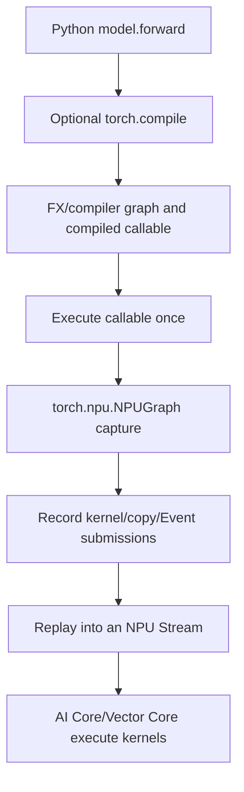
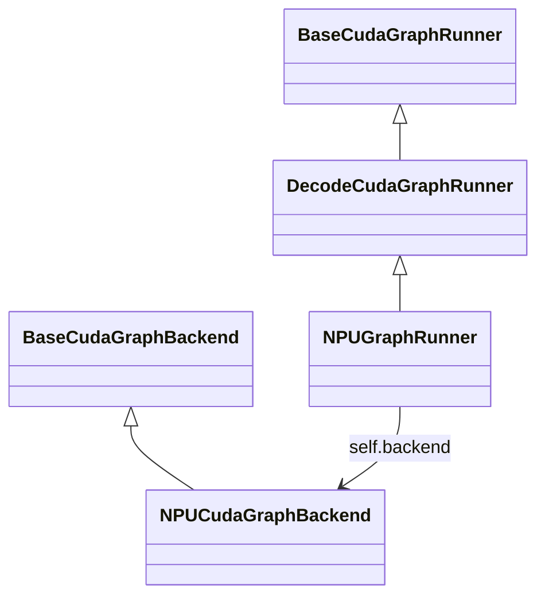

# 05: Computation Graphs, torch.compile, and the SGLang NPU Graph Source Path

> Source baseline: `SGLang@9a03bebf13996b628f8335628a691dcb3aa8400b`. This chapter distinguishes four meanings of “graph,” separates warmup from capture, and traces the complete in-process path from `Scheduler` to `torch.npu.NPUGraph` replay.

## 0. Four Different Graphs

| Name | Nodes/edges represent | Created when |
|---|---|---|
| Conceptual model graph | Mathematical tensor operations and dependencies | Describing model architecture |
| Autograd graph | Operations and gradient dependencies | Dynamically during training forward |
| FX/compiler graph | IR extracted by `torch.compile` | Compilation and guard matching |
| NPUGraph launch graph | Device kernel/copy/Event submission sequence | Runtime capture |

An **IR**, or intermediate representation, is the compiler's internal program form. A **guard** checks assumptions such as dtype, shape, or object state.



`torch.compile` optimizes a program/operator graph. NPUGraph reuses a runtime launch sequence. They can be stacked but are not the same abstraction.

---

## 1. Does Each Model Have One Graph?

The capture facility is generic: `torch.npu.NPUGraph()` does not inherently know GLM, DeepSeek, or Qwen. SGLang's runner invokes the concrete model's `forward`.

The captured artifact is nevertheless specialized to:

- the actual model forward branch;
- TP/PP rank and communication sequence;
- NPU device/context and Device addresses;
- batch/token capture size;
- forward mode and attention metadata;
- Stream index and LoRA variant when included in `ShapeKey`;
- torch, torch_npu, CANN, and kernel versions.

Therefore:

> A model checkpoint does not normally ship with one permanent NPUGraph. A serving process uses a generic mechanism to build a family of environment-specific graph instances.

The runner stores:

```python
self._graphs: Dict[Any, Any] = {}
self._outputs: Dict[Any, Any] = {}
```

and constructs:

```python
ShapeKey(size=size, stream_idx=stream_idx, variant_label=variant_label)
```

One model/rank can therefore own graphs for sizes 1, 2, 4, 8 and additional variants. Each rank normally captures its own objects because weights, context, and storage addresses differ.

---

## 2. Why Use a Launch Graph for Inference?

Decode performs small, frequent steps. Repeating Python dispatch, wrappers, tiling, and many runtime launches can become a significant fraction of latency.

NPUGraph changes:

```text
Every step: Python/runtime submits the entire sequence
```

into:

```text
Once: warm up and capture a stable sequence
Later: update static inputs and replay the sequence
```

It does not change model mathematics, fuse everything into a mega kernel, remove all GM movement, or replace Streams and Events.

---

## 3. Stable Addresses Are the Core Contract

Real API structure:

```python
static_x = torch.empty_like(example_x)
graph = torch.npu.NPUGraph()

with torch.npu.graph(graph):
    static_y = model(static_x)

def run(live_x):
    static_x.copy_(live_x)
    graph.replay()
    return static_y
```

This omits production warmup, capture Stream, pool, and compatibility checks, but shows the address rule:

- `static_x` keeps one address while its contents change;
- `static_y` keeps one output address;
- replay asynchronously rewrites `static_y`;
- returning `static_y` returns a handle, not an early CPU read;
- preserving one replay's output across the next replay requires a correctly ordered clone/copy.

Changing a Python variable to reference a new tensor does not rewrite addresses embedded in a captured launch sequence.

---

## 4. Where SGLang Selects the Graph Path

[`ModelRunner.init_cuda_graphs`](https://github.com/sgl-project/sglang/blob/9a03bebf13996b628f8335628a691dcb3aa8400b/python/sglang/srt/model_executor/model_runner.py#L909-L916) installs eager, prefill-graph, and decode-graph runners. The historical `cuda_graph` name is cross-platform and does not imply CUDA on NPU.

At runtime, [`model_runner.py#L1479-L1516`](https://github.com/sgl-project/sglang/blob/9a03bebf13996b628f8335628a691dcb3aa8400b/python/sglang/srt/model_executor/model_runner.py#L1479-L1516) checks:

```python
can_run_graph = bool(
    mode_check()
    and self.decode_cuda_graph_runner
    and self.decode_cuda_graph_runner.can_run_graph(forward_batch)
)

if can_run_graph:
    ret = self.decode_cuda_graph_runner.execute(forward_batch, ...)
    return ModelRunnerOutput(logits_output=ret, can_run_graph=True)
```

Failure to match uses eager or another path. Graph replay is an optimization fast path, not the only correct model implementation.

---

## 5. Runner and Backend Responsibilities



- `DecodeCudaGraphRunner`: shape buckets, static buffers, `ForwardBatch`, capture/replay orchestration.
- `NPUGraphRunner`: NPU-specific sequence-length updates, dtype, profiling, output slicing.
- `NPUCudaGraphBackend`: creates, stores, updates, and replays real `torch.npu.NPUGraph` objects.

[`resolve_decode_backend`](https://github.com/sgl-project/sglang/blob/9a03bebf13996b628f8335628a691dcb3aa8400b/python/sglang/srt/model_executor/runner_backend/utils.py#L52-L73) returns `NPUCudaGraphBackend` for an NPU device.

---

## 6. Capture From Source

### 6.1 Buckets and Static Buffers

Keep **batch size** and **bucket** distinct:

- **Batch size** is the number of requests/sequences in one forward; source code abbreviates it as `bs`.
- A **batch-size bucket** is a preselected reusable execution specification keyed by one discrete batch size.
- `capture_bs` is the list of batch sizes to capture, such as `[1, 2, 4, 8]`.

Therefore, `bs` expands to **batch size**, not “bucket size.” In `for bs in capture_bs`, the same integer has two related roles:

```text
bs = 8
  role 1: execute this graph at batch size 8
  role 2: select the batch-size=8 bucket/ShapeKey
```

For a live batch:

```text
raw_bs = 5
capture_bs = [1, 2, 4, 8]

selected bs = 8
graph_key = ShapeKey(size=8)
```

The five real requests are padded to captured batch size 8 and use the graph keyed by 8. A bucket is not a container holding eight batches; the value 8 is the batch size supported by that graph.

`DecodeInputBuffers` owns stable maximum-size buffers including input IDs, positions, request-pool indices, sequence lengths, cache locations, and attention/speculative metadata. Smaller captures use prefix views of these buffers.

More buckets reduce fallback but increase capture time and graph/static-memory use.

### 6.2 Warmup

#### 6.2.1 Precise Definitions

**Warmup** means executing a real forward pass before measurement, capture, or serving so that first-use work happens early. Such work can include:

- lazy Python/module initialization;
- first invocation of Dynamo, `torch.compile`, or the compiler backend;
- kernel/operator binary loading;
- operator selection, autotuning, and workspace allocation;
- allocator cache creation;
- communicator and attention-metadata initialization.

**Capture** means executing a forward pass inside `torch.npu.graph(...)`. The runtime records the submitted Device work, dependencies, and memory contract and produces a replayable `NPUGraph`.

| Property | Warmup | Capture |
|---|---|---|
| Executes a real forward | Yes | Yes |
| Produces a replayable graph | No | Yes |
| Saves its output as the captured output handle | No | Yes, in `_outputs[shape_key]` |
| Primary goal | Remove first-run effects and reach steady state | Record the steady-state launch sequence |
| Inside `torch.npu.graph(...)` | No | Yes |

The exact sequence is:

```text
ordinary forward warmup #1
  -> ordinary forward warmup #2
    -> capture forward inside graph context
      -> future requests replay only
```

Warmup does not record a temporary graph, and the second warmup is not reused as the captured execution. Two warmups are an SGLang NPU backend engineering choice, not a universal hardware rule. First-use compilation, allocation, or communication inside capture can make capture unexpectedly slow, record unwanted one-time work, or invoke operations the runtime cannot capture.

#### 6.2.2 Three Different Warmup Contexts in This Source Tree

First, [`DecodeCudaGraphRunner.capture()`](https://github.com/sgl-project/sglang/blob/9a03bebf13996b628f8335628a691dcb3aa8400b/python/sglang/srt/model_executor/runner/decode_cuda_graph_runner.py#L825-L857) calls the common runner method:

```python
self.warmup()
```

However, [`BaseRunner.warmup()`](https://github.com/sgl-project/sglang/blob/9a03bebf13996b628f8335628a691dcb3aa8400b/python/sglang/srt/model_executor/runner/base_runner.py#L210-L240) contains:

```python
if getattr(mr, "_kernel_warmed_up", False):
    return
mr._kernel_warmed_up = True

if mr.device != "cuda":
    return
```

On the current NPU path it sets the run-once flag and immediately returns. The later FlashInfer workspace, autotune, and DeepGEMM logic is CUDA-specific. This call therefore is **not** the two-forward NPU warmup.

Second, the real per-shape NPU warmup is in [`NPUCudaGraphBackend.capture_one()`](https://github.com/sgl-project/sglang/blob/9a03bebf13996b628f8335628a691dcb3aa8400b/python/sglang/srt/hardware_backend/npu/graph_runner/npu_cudagraph_backend.py#L78-L127):

```python
for _ in range(2):
    self._device_module.synchronize()
    self._tp_group.barrier()
    forward_fn()
    if post_warmup_hook is not None:
        post_warmup_hook()
```

- `synchronize()` waits for earlier NPU work. At the start of the second iteration it also guarantees that the first warmup has completed.
- `barrier()` aligns all Tensor Parallel ranks before each attempt, avoiding mismatched collective progress.
- `forward_fn` is a zero-argument Python closure over the static `ForwardBatch`, static buffer views, attention backend, and selected model callable.
- `post_warmup_hook` lets the attention backend reset state mutated by warmup. The caller obtains it from `attn_backend.on_after_cuda_graph_warmup`.

The warmup return value is discarded. The first pass usually triggers lazy setup; the second more closely resembles steady-state repetition and exposes paths that differ between first and subsequent invocations.

Third, some captured buckets use a `torch.compile` callable. This does not mean “compile the Python file into one binary.” PyTorch first extracts an **operator-semantic graph** from a concrete `forward` invocation, then sends that graph to the Ascend TorchAir backend to prepare an NPU execution path.

Start with `compile_bs`.

##### Step 1: Which Buckets Enable Compilation?

[`get_batch_sizes_to_capture()`](https://github.com/sgl-project/sglang/blob/9a03bebf13996b628f8335628a691dcb3aa8400b/python/sglang/srt/model_executor/runner/base_cuda_graph_runner.py#L58-L103) returns two lists:

```python
capture_bs = ...  # every batch-size bucket that needs an NPUGraph
compile_bs = (
    [bs for bs in capture_bs if bs <= server_args.torch_compile_max_bs]
    if get_flags().capture.enable_torch_compile
    else []
)
```

For example:

```text
capture_bs = [1, 2, 4, 8, 16]
torch_compile_max_bs = 8
enable_torch_compile = True

compile_bs = [1, 2, 4, 8]
```

Buckets 1/2/4/8 therefore pass through `torch.compile`; bucket 16 calls raw `model.forward`. All five can still be captured by the outer NPUGraph. **`compile_bs` selects compiler use, while `capture_bs` selects launch-graph creation.**

##### Step 2: The NPU Runner Replaces the Common Patch Function

Before entering parent capture initialization, [`NPUGraphRunner.__init__()`](https://github.com/sgl-project/sglang/blob/9a03bebf13996b628f8335628a691dcb3aa8400b/python/sglang/srt/hardware_backend/npu/graph_runner/npu_graph_runner.py#L87-L108) runs:

```python
from sglang.srt.compilation import torch_compile_decoration

torch_compile_decoration.patch_model = patch_model_npu
super().__init__(model_runner, ...)
```

This is a Python **monkey patch**: a module attribute is redirected at runtime. The common decode runner still calls `torch_compile_decoration.patch_model`, but NPU execution enters `patch_model_npu`.

##### Step 3: Each Bucket Receives One of Two Callables

[`_capture_one_stream()`](https://github.com/sgl-project/sglang/blob/9a03bebf13996b628f8335628a691dcb3aa8400b/python/sglang/srt/model_executor/runner/decode_cuda_graph_runner.py#L875-L912) does:

```python
for bs in reversed(self.capture_bs):
    with torch_compile_decoration.patch_model(
        self.model_runner.model,
        bs in self.compile_bs,
        num_tokens=bs * self.captured_req_width,
        tp_group=self.model_runner.tp_group,
    ) as forward:
        self.capture_one_shape(bs, forward, ...)
```

| Variable | Type | Meaning |
|---|---|---|
| `bs` | Python `int` | Captured batch size of this graph; also its batch-size-bucket key |
| `self.compile_bs` | `list[int]` | Buckets allowed to use `torch.compile` |
| `bs in self.compile_bs` | Python `bool` | The `enable_compile` argument |
| `self.model_runner.model` | `torch.nn.Module` | Loaded SGLang model |
| `forward` | Python callable | Raw bound method or `torch.compile` wrapper |

`patch_model_npu` is a `@contextmanager`. Its `yield` exposes a temporary callable to `with ... as forward`; it is not a model output:

```python
@contextmanager
def patch_model_npu(model, enable_compile, num_tokens, tp_group):
    if enable_compile:
        backend = get_compiler_backend("npugraph_ex")
        yield torch.compile(
            torch.no_grad()(model.forward),
            fullgraph=True,
            dynamic=False,
            backend=backend,
        )
    else:
        yield model.forward
```

- `model.forward` is a Python **bound method** tied to the current model instance.
- `torch.no_grad()` disables autograd backward-graph recording for inference.
- `torch.compile(...)` returns a callable wrapper; reaching this line does not mean compilation with real inputs has completed.
- `fullgraph=True` asks Dynamo for one complete compiler graph rather than silently tolerating arbitrary graph breaks.
- `dynamic=False` specializes to static input specifications, matching bucket capture.
- `num_tokens` and `tp_group` remain in the common patch interface but are not used by the current `patch_model_npu` body.

When `enable_compile=False`, the context yields raw `model.forward`. Two NPU warmups and one NPUGraph capture still happen; only the compiler-graph layer is absent.

##### Step 4: What Is the `npugraph_ex` Backend?

On NPU, [`get_compiler_backend("npugraph_ex")`](https://github.com/sgl-project/sglang/blob/9a03bebf13996b628f8335628a691dcb3aa8400b/python/sglang/srt/utils/common.py#L969-L995) returns a TorchAir backend callable, not the literal string:

```python
compiler_config = CompilerConfig()
compiler_config.mode = "reduce-overhead"
compiler_config.debug.run_eagerly = True
npu_backend = torchair.get_npu_backend(compiler_config=compiler_config)
return npu_backend
```

**TorchAir** is the compiler-adaptation layer between PyTorch compiler graphs and the Ascend graph/operator stack. `torchair.get_npu_backend(...)` returns a function conforming to the `torch.compile` backend protocol. It receives:

```text
gm: torch.fx.GraphModule
example_inputs: example values from this invocation
```

An **FX GraphModule** combines graph nodes with module attributes. Its nodes describe operators such as linear, attention, and reshape plus their data dependencies; it is not an NPU Stream task queue. TorchAir applies decomposition/AOT processing and converts the FX graph into an NPU concrete graph/executable callable. The upstream [`npu_fx_compiler.py`](https://gitee.com/ascend/torchair/blob/2640db9816afa31fa933cd32e8e51ba94cdeaf87/python/torchair/npu_fx_compiler.py#L831-L928) shows the `GraphModule + example_inputs -> NpuGraphConverter -> inference callable` path.

Configuration meanings:

- `mode="reduce-overhead"` favors reduced repeated Host/launch overhead for graph-style execution.
- `debug.run_eagerly=True` is described upstream as executing the FX graph eagerly before graph-compiler execution. This is a TorchAir FX pre-execution/debug path, **not** SGLang's `EagerRunner` fallback and not a switch that disables `torch.compile`.

##### Step 5: Why Compilation Happens During the First Warmup Call

`capture_one_shape()` eventually invokes:

```python
out = forward(
    forward_batch.input_ids,
    forward_batch.positions,
    forward_batch,
)
```

When `forward` is compiled:

```text
Create the compiled callable
  torch.compile(model.forward, ...)
  # no invocation with the real static ForwardBatch yet

warmup #1: first forward(...) call
  -> TorchDynamo observes Python bytecode and tensor operations
  -> builds an FX GraphModule for these inputs
  -> creates guards
  -> calls TorchAir backend(gm, example_inputs)
  -> TorchAir converts/prepares the NPU callable
  -> executes and returns this warmup output

warmup #2: call the same forward(...) again
  -> inputs satisfy the guards
  -> normally reuse the compiler artifact
  -> pay residual kernel-load, allocator, or workspace first-use cost

capture forward: third call
  -> execute the near-steady-state compiled callable inside torch.npu.graph(...)
  -> NPUGraph records its Device submissions
```

A **guard** is a validity condition for a compiler artifact, such as tensor type, dimensions/shape, or relevant module state. A failed guard can invalidate the artifact or trigger recompilation. Fixed buckets, static views, and `dynamic=False` help capture reuse the same artifact.

Therefore, compiler warmup does not warm NPUGraph itself. It invokes the compiled callable before NPUGraph capture so Dynamo/TorchAir graph extraction, conversion, compilation, and first execution occur outside the graph context.

```text
DecodeCudaGraphRunner.capture()
  |
  +-- BaseRunner.warmup()
  |     `-- current NPU path returns before CUDA-only autotune
  |
  `-- for each ShapeKey
        `-- NPUCudaGraphBackend.capture_one()
              +-- forward_fn()        # warmup 1; may trigger torch.compile
              +-- forward_fn()        # warmup 2; closer to steady state
              `-- torch.npu.graph(...)
                    `-- forward_fn()  # capture run
```

#### 6.2.3 Why Warmup Must Match the Target Path

A batch-1 eager warmup does not fully warm a batch-8 compiled capture. Effective warmup should match the capture bucket, static buffer views and addresses, model/attention branch, TP collective order, and compile setting.

`capture_one_shape()` defines one closure and passes that same closure to the backend:

```python
def run_once():
    attn_backend.init_forward_metadata_in_graph(forward_batch)
    return forward(
        forward_batch.input_ids,
        forward_batch.positions,
        forward_batch,
    )

self.backend.capture_one(
    shape_key,
    run_once,
    capture_inputs=None,
    post_warmup_hook=post_warmup_hook,
)
```

This `forward_batch` is not a live serving request. `capture_prepare()` builds it from prefix views of `DecodeInputBuffers`, so warmup, capture, and later replay share the same input/metadata storage-address contract; the output handle created by capture is stored separately.

### 6.3 Real Capture

```python
graph = torch.npu.NPUGraph()

with torch.npu.graph(
    graph,
    pool=self._pool,
    stream=self._capture_stream,
    auto_dispatch_capture=True,
):
    out = forward_fn()

self._graphs[shape_key] = graph
self._outputs[shape_key] = out
```

| Variable | Meaning |
|---|---|
| `graph` | Captured runtime `NPUGraph` |
| `_pool` | Graph memory-pool handle |
| `_capture_stream` | NPU Stream whose submissions are captured |
| `forward_fn` | Closure that runs model forward on static views |
| `out` | Static output tensor handle |
| `shape_key` | Capture variant key |

Python executes `forward_fn()` during capture; NPUGraph records the resulting NPU submissions rather than storing the Python source string.

---

## 7. Replay With a Live ForwardBatch

### 7.1 Eligibility

[`can_run_graph`](https://github.com/sgl-project/sglang/blob/9a03bebf13996b628f8335628a691dcb3aa8400b/python/sglang/srt/model_executor/runner/decode_cuda_graph_runner.py#L502-L553) rejects incompatible dynamic features and computes a key.

### 7.2 Padding to a Captured Batch Size

For raw batch 5 and buckets `[1,2,4,8]`, `load_batch`:

1. selects captured size 8;
2. copies five real rows into static buffers;
3. pads three rows and metadata;
4. replays size 8;
5. slices the output back to five valid rows.

### 7.3 `replay_with_input_update`: How Dynamic Sequence Lengths Are Updated

The short answer is:

> `replay_with_input_update` is an **SGLang NPU-backend wrapper**, not a same-named native `torch.npu.NPUGraph` method. It sends fresh Host-side attention-length attributes to `NPUGraph.update(...)`, then replays the same captured graph. It neither creates a new graph nor reruns the complete Python `model.forward`.

#### 7.3.1 Why `seq_lens` Cannot Remain Fixed at Capture Time

`seq_lens` describes the current sequence/KV length of every request:

```text
decode step 1: [10, 25, 7]
decode step 2: [11, 26, 8]
```

Batch size may remain 3, but each generated token extends the readable KV region. These lengths affect valid KV-cache extent, fused-attention work, tiling/dispatch parameters, and whether a padded slot is valid.

There are two different kinds of dynamic input:

| Dynamic value | Typical carrier | Update mechanism |
|---|---|---|
| Device-tensor contents such as `input_ids` and `positions` | Fixed-address NPU tensor | Write the static buffer |
| Operator keyword/Host attributes such as `actual_seq_lengths_kv` | Python `list[int]` or CPU tensor | `NPUGraph.update(cpu_update_input=...)` |

For fused attention, a sequence length may be a Host-side keyword embedded in the captured dispatch record rather than only data at a fixed Device-tensor address. Updating `DecodeInputBuffers.seq_lens` does not automatically rewrite that copied Host attribute.

#### 7.3.2 Difference From Plain `replay()`

The ordinary NPU-backend [`replay()`](https://github.com/sgl-project/sglang/blob/9a03bebf13996b628f8335628a691dcb3aa8400b/python/sglang/srt/hardware_backend/npu/graph_runner/npu_cudagraph_backend.py#L136-L143) is:

```python
def replay(self, shape_key, static_forward_batch, **kwargs):
    self._graphs[shape_key].replay()
    return self._outputs[shape_key]
```

`static_forward_batch` exists for the common backend interface; this NPU implementation does not inspect it. Plain replay uses captured tasks with their existing Host attributes.

[`replay_with_input_update()`](https://github.com/sgl-project/sglang/blob/9a03bebf13996b628f8335628a691dcb3aa8400b/python/sglang/srt/hardware_backend/npu/graph_runner/npu_cudagraph_backend.py#L145-L177) first patches supported captured-task parameters:

| Property | `replay()` | `replay_with_input_update()` |
|---|---|---|
| Uses the same `NPUGraph` | Yes | Yes |
| Recaptures | No | No |
| Static Device tensors | Runner updates them before the call | Same |
| Captured Host keyword | Unchanged | Patched through `graph.update(...)` |
| Typical use | Fully reusable task parameters | Per-step FIA KV lengths |
| Extra machinery | Direct replay | Host thread, update Stream, ExternalEvent |

“Input update” therefore does not replace every model input tensor. It rebinds captured operator kwargs explicitly supported by torch_npu.

#### 7.3.3 How the Caller Builds Current Lengths

The standard path in [`NPUGraphRunner.execute()`](https://github.com/sgl-project/sglang/blob/9a03bebf13996b628f8335628a691dcb3aa8400b/python/sglang/srt/hardware_backend/npu/graph_runner/npu_graph_runner.py#L209-L280) is:

```python
if forward_batch.forward_mode.is_target_verify():
    seq_lens_cpu = forward_batch.seq_lens.cpu() + self.captured_req_width
    seq_lens = seq_lens_cpu.tolist() + [0] * (self.bs - self.raw_bs)
else:
    seq_lens = forward_batch.seq_lens.cpu().tolist() + [0] * (
        self.bs - self.raw_bs
    )

output = self.backend.replay_with_input_update(
    graph_key,
    seq_lens=seq_lens,
    attr_name=self._get_update_attr_name(),
    attr_type=self._get_update_attr_type(),
)
```

- `forward_batch.seq_lens` is the live length tensor.
- `.cpu().tolist()` materializes the lengths as a Host list for `cpu_update_input`.
- `raw_bs` is the number of real requests.
- `self.bs` is the padded captured batch size.
- Zeroes fill synthetic padding slots.
- Target verify adds `captured_req_width`, accounting for the verification width passed to attention.

Example:

```text
raw_bs = 3
self.bs = 4
live seq_lens = [10, 25, 7]

ordinary decode:
  [10, 25, 7, 0]

target verify with captured_req_width = 4:
  [14, 29, 11, 0]
```

The final zero belongs to the fourth synthetic request.

#### 7.3.4 `attr_name` and `attr_type`

[`NPUGraphRunner._init_arch_map()`](https://github.com/sgl-project/sglang/blob/9a03bebf13996b628f8335628a691dcb3aa8400b/python/sglang/srt/hardware_backend/npu/graph_runner/npu_graph_runner.py#L120-L168) declares:

| Path | `attr_name` | Meaning |
|---|---|---|
| MLA | `actual_seq_lengths_kv` | Actual readable KV length per request |
| MHA | `context_lens` | Context length per request |
| TARGET_VERIFY | `actual_seq_kvlen` | Actual KV length for verification attention |

The current selector chooses the TARGET_VERIFY name for listed v2 architectures and otherwise selects the MLA name on this path. The MHA mapping exists as part of the reusable runner contract; dictionary presence alone does not mean every model reaches every entry.

`attr_type` is not a `torch.dtype`. It is a representation marker:

```python
self.attr_type = {
    AttentionArch.MLA: [],
    AttentionArch.MHA: torch.Tensor(),
    "TARGET_VERIFY": [],
}
```

The backend checks:

```python
if isinstance(attr_type, torch.Tensor):
    seq_lens = torch.from_numpy(np.array(seq_lens).astype(np.int32))
```

- `[]` keeps `list[int]`.
- `torch.Tensor()` converts it to a CPU `torch.int32` tensor.
- It is not moved to NPU; the API still calls it `cpu_update_input`.

#### 7.3.5 The `cpu_update_input` Structure

The ordinary calling convention becomes:

```python
cpu_update_input = [{attr_name: seq_lens}]
```

Its conceptual type is:

```text
list[dict[str, list[int] | torch.Tensor]]
```

For MLA:

```python
[
    {
        "actual_seq_lengths_kv": [10, 25, 7, 0],
    }
]
```

Why an outer list? One captured graph can contain multiple updatable fused-attention tasks. If current torch_npu receives one dictionary, it copies that dictionary for all recorded updatable tasks, allowing ordinary decode to apply the same batch lengths to every attention layer.

The second calling convention supplies multiple dictionaries directly. An EAGLE draft graph can build per-speculative-step values:

```python
seq_lens_for_each_draft_step = [
    [11, 26, 8, 0],
    [12, 27, 9, 0],
    [13, 28, 10, 0],
]
cpu_update_input = [
    {attr_name: step_seq_lens}
    for step_seq_lens in seq_lens_for_each_draft_step
]

self.backend.replay_with_input_update(
    shape_key,
    seq_lens=None,
    cpu_update_input=cpu_update_input,
)
```

Thus the two backend contracts are:

1. `seq_lens + attr_name + attr_type`: wrap one update dictionary.
2. Direct `cpu_update_input`: caller supplies multiple task/step updates.

#### 7.3.6 Why Capture Requires `auto_dispatch_capture=True`

SGLang captures with:

```python
with torch.npu.graph(
    graph,
    pool=self._pool,
    stream=self._capture_stream,
    auto_dispatch_capture=True,
):
    out = forward_fn()
```

This flag makes torch_npu enter `_GraphDispatchMode` in [`graphs.py`](https://gitee.com/ascend/pytorch/blob/master/torch_npu/npu/graphs.py#L630-L898). The current implementation specially intercepts:

```text
npu_fused_infer_attention_score
npu_fused_infer_attention_score.out
```

Other operators execute normally. `NPUGraph.update` is therefore not a generic editor for arbitrary graph nodes; its central current target is an auto-dispatch-recorded fused infer attention task.

For each supported FIA call during capture, torch_npu conceptually:

```text
1. selects/converts to the out variant
2. prepares maximum workspace and fixed outputs
3. creates an ExternalEvent
4. calls graph_task_group_begin(stream)
5. invokes FIA
6. calls graph_task_group_end(stream) to obtain a handle
7. stores a _GraphDispatchRecord
```

| Record field | Meaning |
|---|---|
| `handle` | Runtime handle for the updatable graph-task group |
| `args`/`kwargs` | Captured FIA arguments |
| `op_cache_entry` | Callable used to rebuild/update the task |
| `event` | Dependency between update and replay Streams |

Tensor arguments are retained through weak references; non-tensor keywords are generally deep-copied. That is why a captured Host list such as `actual_seq_lengths_kv` needs explicit replacement.

Without `auto_dispatch_capture=True`, [`NPUGraph.update()`](https://gitee.com/ascend/pytorch/blob/master/torch_npu/npu/graphs.py#L1075-L1087) raises an error.

#### 7.3.7 What `graph.update()` Does Inside torch_npu

SGLang calls:

```python
graph.update(cpu_update_input=cpu_update_input)
```

`NPUGraph.update()` enters `_GraphDispatchMode.update_capture_record()`. For each captured FIA record:

```text
enter the dedicated update_stream
  -> graph_task_update_begin(update_stream, record.handle)
  -> overwrite selected keys in record.kwargs
  -> invoke record.op_cache_entry with old args and new kwargs
  -> graph_task_update_end(update_stream)
  -> record.event.record(update_stream)
```

Reinvoking `op_cache_entry` inside the runtime update markers rebuilds/patches that captured task group. It does not run the complete model's Python forward and does not create a new `ShapeKey -> NPUGraph`.

```text
after capture:
  FIA task handle H
  kwargs.actual_seq_lengths_kv = capture-time lengths

after update:
  same handle H and same NPUGraph
  kwargs.actual_seq_lengths_kv = current-request lengths
```

Graph topology, weights, bucket, and static tensor-address contracts do not become arbitrarily dynamic.

#### 7.3.8 Why a Host Thread Starts Immediately Before Replay

The SGLang backend runs:

```python
graph = self._graphs[shape_key]

def _update():
    self._device_module.set_device(self._device_id)
    graph.update(cpu_update_input=cpu_update_input)

thread = threading.Thread(target=_update)
thread.start()
graph.replay()
thread.join()
return self._outputs[shape_key]
```

- A new Python thread should not assume it inherited the main thread's current NPU device, so it calls `set_device`.
- `graph.update()` patches FIA tasks on torch_npu's dedicated `update_stream`.
- The main thread does not join first; it immediately starts replay.
- An `ExternalEvent` inserted during capture makes the corresponding replay task wait for the update Stream.
- Update completion records that Event on `update_stream`.
- `thread.join()` ensures the Host update thread ends before this method returns.

The dependency is therefore:

```text
Host update thread:
  graph.update()
      -> update_stream patches FIA task
      -> records ExternalEvent

Host main thread:
  graph.replay()
      -> replay stream reaches Event wait
      -> waits for update-stream record
      -> executes FIA with new lengths
```

`threading.Thread` only launches Host APIs concurrently. The captured `ExternalEvent` orders the two NPU Streams.

#### 7.3.9 Paths That Do Not Use It

The current standard `NPUGraphRunner.execute()` uses plain `backend.replay(...)` for DeepSeek DSA or DeepSeek v4 configurations and `replay_with_input_update(...)` for the shown other paths. This only indicates a different captured-input/attention contract; it does not imply those models have no dynamic lengths.

Not every NPU operator needs or supports this method. It applies when a request-varying value was captured as a supported operator task's Host parameter and torch_npu auto-dispatch recorded an update handle for it.

### 7.4 Why Returning the Stored Output Is Correct

```python
self._graphs[shape_key].replay()
return self._outputs[shape_key]
```

`_outputs[shape_key]` is a stable output-storage handle. Each replay writes fresh results into that storage. Same-Stream consumers execute after replay and read the new values. To retain an older replay's values across another replay, clone/copy them before overwrite.

---

## 8. Events Still Matter

Graph capture/replay does not replace Stream/Event semantics:

```text
current Stream:
  copy static inputs -> graph replay -> sampling
```

If an external communication Stream produces an input:

```text
communication Stream: all-reduce -> record ready
graph Stream:                       wait ready -> replay
```

The Event connects the external producer to replay. A graph cannot infer a cross-Stream dependency merely from a tensor name.

---

## 9. torch.compile Versus NPUGraph

[`patch_model_npu`](https://github.com/sgl-project/sglang/blob/9a03bebf13996b628f8335628a691dcb3aa8400b/python/sglang/srt/hardware_backend/npu/graph_runner/npu_graph_runner.py#L67-L84) can produce:

```python
torch.compile(
    torch.no_grad()(model.forward),
    fullgraph=True,
    dynamic=False,
    backend=get_compiler_backend("npugraph_ex"),
)
```

- `no_grad`: no autograd backward graph;
- `torch.compile`: extract/optimize a compiler graph;
- `fullgraph=True`: require one compiler region;
- `dynamic=False`: specialize statically;
- outer NPUGraph capture: record launches produced by the compiled callable.

The stack may be:

```text
SGLang control flow
  -> compiled model callable
  -> optimized NPU operators
  -> NPUGraph launch capture
  -> Stream replay
```

---

## 10. Piecewise NPU Graph

[`NPUPiecewiseBackend`](https://github.com/sgl-project/sglang/blob/9a03bebf13996b628f8335628a691dcb3aa8400b/python/sglang/srt/compilation/npu_piecewise_backend.py) receives an `fx.GraphModule`, selects concrete runtime-shape entries, warms up, captures `entry.runnable`, and replays a graph per piece.

In debug mode it verifies stable addresses:

```python
new_input_addresses = [
    x.data_ptr() for x in args if isinstance(x, torch.Tensor)
]
assert new_input_addresses == entry.input_addresses

entry.cudagraph.replay()
return entry.output
```

The `cudagraph` field name is historical; the NPU object is an `NPUGraph`.

Piecewise capture provides smaller regions and dynamic boundaries, but adds boundaries, launches, and memory-reference complexity. It is not automatically faster than full capture.

---

## 11. What May Change Between Replays?

| Item | Typical handling |
|---|---|
| Token/position values | Copy into fixed buffers |
| Request/KV indices | Update fixed metadata buffers |
| Raw batch below bucket | Pad to captured size |
| Some sequence-length attributes | `NPUGraph.update` |
| Shape above maximum bucket | Fallback or new capture |
| Tensor address | Usually must remain stable |
| Python data-dependent branch | Capture fixes one path; arbitrary switching is unsupported |
| Data-dependent launch count | Usually incompatible without restructuring |

“Static shape” does not mean static values. It means task topology and resource contracts remain stable enough for values to enter through predefined update channels.

---

## 12. Graph Lifetime and Invalidation

A captured graph is normally a runtime optimization artifact owned by the current serving process, not part of the model weights. Recapture may be required when any of these changes:

- the captured hidden-state mode;
- graph configuration or the batch-size bucket set;
- model or LoRA execution variant;
- Device storage addresses;
- attention backend or kernel path;
- TP/PP topology;
- torch_npu or CANN version.

When the required hidden mode changes, the current runner follows this pattern:

```python
self.backend.cleanup()
self.capture()
```

This is another reason eager forward remains the correctness baseline: the graph caches one executable realization under specific runtime contracts; it is not the sole definition of model semantics.

---

## 13. Complete Source Path: Service Startup to One Generated Token

“End to end” here begins when the Scheduler receives requests and forms an executable batch, and ends when the sampler consumes replayed logits. HTTP protocol handling, tokenization, and detokenization are outside this NPU Graph chapter.

### 13.1 Startup: Who Triggers Capture?

The entry point is [`Scheduler.init_model_worker()`](https://github.com/sgl-project/sglang/blob/9a03bebf13996b628f8335628a691dcb3aa8400b/python/sglang/srt/managers/scheduler.py#L901-L910):

```python
def init_model_worker(self):
    self.init_tp_model_worker()          # load the model
    self.maybe_init_draft_worker()
    self.init_memory_pools()             # KV-cache and request pools
    self.init_all_attention_backends()   # must exist before capture
    self.init_all_cuda_graphs()          # historical cross-platform name
```

The order matters because a capture forward needs model weights, memory pools, and an initialized attention backend.

The call chain is:

```text
Scheduler.init_all_cuda_graphs()
  -> TpModelWorker.init_cuda_graphs()
    -> ModelRunner.init_cuda_graphs()
      -> capture_cuda_graphs(model_runner=...)
```

[`capture_cuda_graphs()`](https://github.com/sgl-project/sglang/blob/9a03bebf13996b628f8335628a691dcb3aa8400b/python/sglang/srt/model_executor/model_runner_components/cuda_graph_setup.py#L73-L135) creates shared graph output/static resources, builds an `EagerRunner` as the correctness fallback, and then prepares prefill and decode runners.

The decode branch enters [`capture_decode_graph()`](https://github.com/sgl-project/sglang/blob/9a03bebf13996b628f8335628a691dcb3aa8400b/python/sglang/srt/model_executor/model_runner_components/cuda_graph_setup.py#L285-L352). For `model_runner.device == "npu"`:

```python
graph_runners = {
    "cpu": CPUGraphRunner,
    "npu": NPUGraphRunner,
    "xpu": XPUGraphRunner,
}
runner = graph_runners[model_runner.device](model_runner)
```

Constructing `NPUGraphRunner` captures immediately rather than waiting for the first live request:

```text
NPUGraphRunner.__init__()
  -> replace the common patch_model hook with patch_model_npu
  -> DecodeCudaGraphRunner.__init__()
       -> allocate maximum-size DecodeInputBuffers
       -> resolve_decode_backend(self)
            -> NPUCudaGraphBackend
       -> with model_capture_mode():
            self.capture()
```

[`resolve_decode_backend()`](https://github.com/sgl-project/sglang/blob/9a03bebf13996b628f8335628a691dcb3aa8400b/python/sglang/srt/model_executor/runner_backend/utils.py#L52-L73) currently returns the full-style `NPUCudaGraphBackend` for NPU decode.

### 13.2 Per-Bucket Warmup and Capture

[`DecodeCudaGraphRunner.capture()`](https://github.com/sgl-project/sglang/blob/9a03bebf13996b628f8335628a691dcb3aa8400b/python/sglang/srt/model_executor/runner/decode_cuda_graph_runner.py#L825-L867) opens a capture stream/session and visits large buckets before small ones so smaller graphs can reuse the pool:

```text
capture()
  -> graph_capture() selects a capture Stream
  -> backend.capture_session(stream) establishes the graph memory pool
  -> _capture_one_stream()
       -> for bs in reversed(capture_bs)
            -> patch_model(..., enable_compile = bs in compile_bs)
            -> capture_one_shape(bs, forward)
```

`capture_one_shape()` performs:

```text
captured batch size (the bucket key)
  -> capture_prepare(size)
       -> take prefix views from DecodeInputBuffers
       -> construct a static ForwardBatch
       -> select the attention backend
  -> init_forward_metadata_out_graph(...)
  -> define the run_once() closure
  -> backend.capture_one(shape_key, run_once, post_warmup_hook=...)
```

| Object | Type and role |
|---|---|
| `size`/`bs` | Python `int`; for ordinary decode, the graph's captured batch size and bucket key |
| `DecodeInputBuffers` | Maximum-size `torch.Tensor` collection with stable Device storage |
| `forward_batch` | `ForwardBatch` whose fields point to static tensor views |
| `forward` | `model.forward` or a `torch.compile`-produced callable |
| `run_once` | Zero-argument closure assembling one complete model call |
| `ShapeKey` | Hashable size/stream/variant lookup key |
| `post_warmup_hook` | Optional attention-state reset callable |

The NPU backend executes the same closure three times:

```text
ordinary forward #1 -> post hook
  -> ordinary forward #2 -> post hook
    -> capture forward inside torch.npu.graph(...)
      -> store ShapeKey -> NPUGraph
      -> store ShapeKey -> static output tensor handle
```

### 13.3 Online Request to Graph Fast Path

[`Scheduler.event_loop_normal()`](https://github.com/sgl-project/sglang/blob/9a03bebf13996b628f8335628a691dcb3aa8400b/python/sglang/srt/managers/scheduler.py#L1580-L1609) receives requests, selects a batch, runs it, and processes its result:

```python
recv_reqs = self.request_receiver.recv_requests()
self.process_input_requests(recv_reqs)
plan = self.get_next_batch_to_run(...)
batch = plan.batch_to_run
result = self.run_batch(batch)
self.process_batch_result(batch, result)
```

`batch` is a `ScheduleBatch`: a scheduler-facing structure with request objects, scheduling state, and substantial CPU-side data. `Scheduler.run_batch()` eventually calls `model_worker.forward_batch_generation(batch)`.

[`TpModelWorker.forward_batch_generation()`](https://github.com/sgl-project/sglang/blob/9a03bebf13996b628f8335628a691dcb3aa8400b/python/sglang/srt/managers/tp_worker.py#L532-L621) converts the structure:

```python
forward_batch = ForwardBatch.init_new(
    batch,
    self.model_runner,
    capture_hidden_mode=capture_hidden_mode,
)
out = self.model_runner.forward(forward_batch)
```

`ForwardBatch` is the model-execution contract. It contains `input_ids`, positions, sequence lengths, request/KV-pool indices, and sampling, attention, and speculative-decoding metadata; most core values are Device tensors.

[`ModelRunner.forward()`](https://github.com/sgl-project/sglang/blob/9a03bebf13996b628f8335628a691dcb3aa8400b/python/sglang/srt/model_executor/model_runner.py#L1335-L1385) establishes profiling and bookkeeping contexts. [`_forward_raw()`](https://github.com/sgl-project/sglang/blob/9a03bebf13996b628f8335628a691dcb3aa8400b/python/sglang/srt/model_executor/model_runner.py#L1479-L1524) selects the graph path:

```python
can_run_graph = bool(
    forward_batch.forward_mode.is_cuda_graph()
    and self.decode_cuda_graph_runner
    and self.decode_cuda_graph_runner.can_run_graph(forward_batch)
)

if can_run_graph:
    ret = self.decode_cuda_graph_runner.execute(forward_batch, ...)
    return ModelRunnerOutput(logits_output=ret, can_run_graph=True)
```

The three gates mean: this forward mode permits launch-graph decode/verify; a decode runner exists; and the live batch maps to a compatible captured `ShapeKey`. A failed gate falls through to the prefill graph or `EagerRunner`.

### 13.4 Inside `NPUGraphRunner.execute()`

The NPU override [`execute()`](https://github.com/sgl-project/sglang/blob/9a03bebf13996b628f8335628a691dcb3aa8400b/python/sglang/srt/hardware_backend/npu/graph_runner/npu_graph_runner.py#L209-L280) has five conceptual steps.

1. Inherited `load_batch()` selects a bucket. With live batch 5 and `[1,2,4,8]`, `raw_bs=5` and padded `bs=8`.
2. `buffer_registry.fill_from(...)` copies live values into the captured `DecodeInputBuffers`. Values change; bound storage addresses do not.
3. `attn_backend.init_forward_metadata_out_graph(fb_view)` prepares dynamic metadata that belongs outside the captured task sequence.
4. The runner chooses an attribute such as `actual_seq_lengths_kv` or `context_lens`, calls `replay_with_input_update(...)`, and replays the graph.
5. It slices the static `LogitsProcessorOutput` to `raw_num_token` before returning it.

The backend starts a Host `threading.Thread` for `graph.update(...)`, calls `graph.replay()` on the main thread, and then joins. This is not an unspecified “internal guarantee.” As Sections 7.3.6–7.3.8 show, `auto_dispatch_capture` captures an `ExternalEvent.wait()` before each updateable FIA task, while `graph.update()` patches that task on a dedicated update Stream and then records the Event. Host code may therefore launch replay first, but the replay Stream cannot pass the captured wait until the update has finished. The final `thread.join()` only ensures that the Host update thread has exited before this function returns; it does not order the NPU tasks.

Back in `TpModelWorker.forward_batch_generation()`:

```python
batch_result.next_token_ids = self.model_runner.sample(
    logits_output,
    forward_batch,
)
```

The sampler consumes logits written by the replay. CPU-facing results are later transferred under the Scheduler's D2H-copy and Event ordering.

### 13.5 Combined Timeline

```mermaid
sequenceDiagram
  participant SCH as "Scheduler"
  participant TP as "TpModelWorker"
  participant MR as "ModelRunner"
  participant DR as "NPUGraphRunner"
  participant NB as "NPUCudaGraphBackend"
  participant G as "torch.npu.NPUGraph"
  participant NPU as "NPU Device"

  rect rgb(235,245,255)
    Note over SCH,NPU: "Startup: build one graph per bucket"
    SCH->>TP: "init_cuda_graphs()"
    TP->>MR: "init_cuda_graphs()"
    MR->>DR: "NPUGraphRunner(model_runner)"
    DR->>NB: "capture_session(capture_stream)"
    loop "Each ShapeKey"
      DR->>DR: "capture_prepare(): static ForwardBatch"
      DR->>NB: "capture_one(shape_key, run_once)"
      NB->>NPU: "ordinary warmup forward #1"
      NB->>NPU: "ordinary warmup forward #2"
      NB->>G: "capture forward inside graph context"
      NB->>NB: "store graph and output handle"
    end
  end

  rect rgb(240,255,240)
    Note over SCH,NPU: "Online decode: generate one token"
    SCH->>SCH: "get_next_batch_to_run()"
    SCH->>TP: "forward_batch_generation(ScheduleBatch)"
    TP->>TP: "ForwardBatch.init_new()"
    TP->>MR: "forward(ForwardBatch)"
    MR->>DR: "can_run_graph() + execute()"
    DR->>DR: "select bucket; copy live values to static buffers"
    DR->>NB: "update(seq_lens) + replay(ShapeKey)"
    NB->>G: "replay()"
    G->>NPU: "submit captured operator tasks"
    NB-->>DR: "static output handle"
    DR-->>TP: "logits with padding removed"
    TP->>TP: "sample(logits, ForwardBatch)"
    TP-->>SCH: "GenerationBatchResult"
  end
```

There is no separate process named “Host.” `Scheduler`, `TpModelWorker`, `ModelRunner`, and the runner/backend are Host-side software. During the capture forward, PyTorch/torch_npu dispatch enters operator implementations. Operators supplied by sgl-kernel-npu continue into its C++/NPU wrapper and submit the underlying kernel; other operators may be implemented by torch_npu/CANN. NPUGraph records these Device submissions, so online replay avoids re-running the original Python operator calls one by one.

---

## 14. Source Reading Order

1. `scheduler.py`: startup capture and online `run_batch`;
2. `tp_worker.py`: `ScheduleBatch -> ForwardBatch -> ModelRunner`;
3. `forward_batch_info.py`: the model-execution batch contract;
4. `model_runner.py`: graph fast-path selection;
5. `decode_cuda_graph_runner.py`: buckets, static buffers, warmup/capture, and replay;
6. `runner_backend/utils.py`: the NPU backend factory;
7. `npu_cudagraph_backend.py`: actual `NPUGraph` construction, storage, update, and replay;
8. `npu_graph_runner.py`: NPU sequence-length update and output slicing;
9. `npu_piecewise_backend.py`: FX/compiler piecewise graphs.

---

## 15. Checkpoints and Answers

### 1. Is there one graph per model?

No. The mechanism is generic, while artifacts specialize to model path, rank, addresses, shape key, and runtime. One model process normally owns a family of graphs.

### 2. Does NPUGraph store Python source?

No. Python runs once during capture; runtime records the resulting NPU submissions.

### 3. Why does a stored output handle contain fresh results?

Replay rewrites its stable storage. Same-Stream consumers run afterward. Clone/copy is required only to preserve an old replay across a later overwrite.

### 4. Are Event and graph interchangeable?

No. Events express Stream progress dependencies. Graph work still executes through Streams and needs Events for external cross-Stream producers.

### 5. Are torch.compile and NPUGraph the same?

No. `torch.compile` builds/optimizes compiler IR; NPUGraph captures runtime launches. They may be composed.

### 6. Why is decode the common target?

Its repeated small steps make Host/runtime launch overhead proportionally large, and its shapes are easier to bucket.

### 7. Why does each TP rank capture separately?

Ranks have distinct weights, contexts, addresses, and communication identities, all of which are runtime graph dependencies.

### 8. What is the essential difference between warmup and capture?

Warmup is ordinary execution that moves lazy initialization, compilation, kernel loading, and workspace allocation ahead of capture. It produces no replayable graph. Capture executes inside `torch.npu.graph(...)`, records Device submissions, and produces an `NPUGraph` plus a static output handle. The current per-shape NPU sequence is two ordinary warmup forwards followed by one capture forward.

### 9. Is `self.warmup()` in `DecodeCudaGraphRunner.capture()` the two-forward NPU warmup?

No. The current `BaseRunner.warmup()` returns for non-CUDA devices after setting `_kernel_warmed_up`. The two actual NPU model forwards live in `NPUCudaGraphBackend.capture_one()` and run separately for every `ShapeKey`.

### 10. Does the first live request perform the complete capture?

Not on the standard initialization path. After model, memory-pool, and attention-backend initialization, the Scheduler invokes `init_all_cuda_graphs()`. Constructing `NPUGraphRunner` captures all configured buckets. Live requests perform eligibility checks, live-to-static copies, supported attribute updates, and replay. A changed hidden-state capture contract can still trigger cleanup and recapture later.

### 11. Does `bs` Mean Batch Size or Bucket Size?

It means batch size. A bucket is a capture specification keyed by one discrete batch size. Mapping `raw_bs=5` to `bs=8` means padding five real requests to captured batch size 8 and selecting the batch-size=8 graph, not placing eight batches in a container.

### 12. What Is the Essential Difference Between `replay_with_input_update` and `replay`?

Both replay the same captured `NPUGraph`; neither recaptures. Plain `replay` reuses captured tasks unchanged. `replay_with_input_update` first calls `NPUGraph.update` to patch fresh Host keywords such as `actual_seq_lengths_kv` into FIA tasks recorded by torch_npu auto-dispatch, then replays.

### 13. Why Can Replay Start Immediately After the Update Thread Instead of Waiting With `join()` First?

torch_npu inserts an `ExternalEvent` wait while capturing an FIA task. The update thread patches the task on a dedicated update Stream and records the Event; replay waits when it reaches that captured wait. The Python thread only launches Host APIs—the Event orders NPU Streams. The final `join()` ensures the Host update thread exits.

### 14. Can `NPUGraph.update` Modify Arbitrary Parameters, Shapes, or Operators?

No. Current auto-dispatch source specially records `npu_fused_infer_attention_score` and its out variant and retains updateable task handles. Update can modify only operator kwargs explicitly recorded and supported by the runtime. It does not make topology, weight addresses, or buckets arbitrarily dynamic.

---

## 16. Related Lessons

- [Streams, Events, and asynchronous tensor handles](../../ascend-kernel-infra/torch_npu/02-stream-events-and-graph-capture.md)
- [`ForwardBatch` and static buffers](./foundation/05-model-runner-forward-batch-and-input-buffers.md)
- [GLM-4.7-Flash graph replay](./examples/00-glm-4.7-flash-end-to-end.md#13-npu-graph-开启后的-decode-路径)
- [High-level NPU graph configuration](../06-npu-graph-compilation.md)
