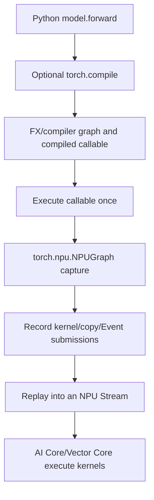
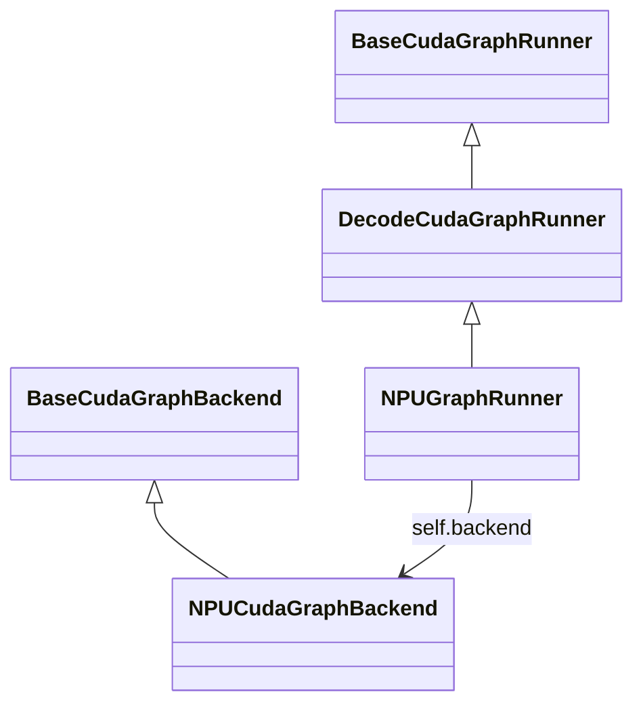
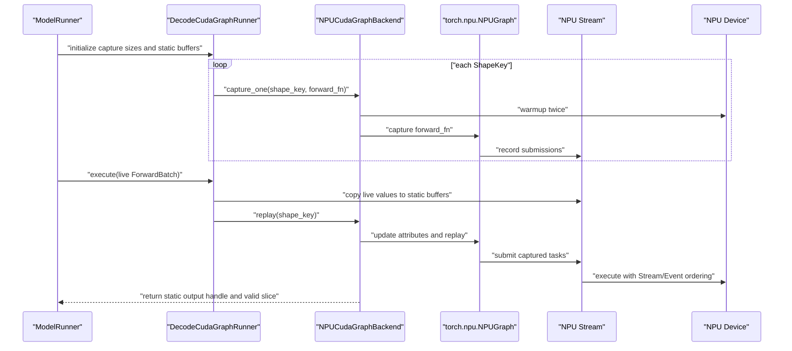

# 05: Computation Graphs, torch.compile, and the SGLang NPU Graph Source Path

> Source baseline: `SGLang@ddaf430e6c59a88da0a6cca4c71033cedf102a88`. This chapter distinguishes four meanings of “graph” and traces a live `ForwardBatch` through static buffers, `torch.npu.NPUGraph` capture, and replay.

## 0. Four Different Graphs

| Name | Nodes/edges represent | Created when |
|---|---|---|
| Conceptual model graph | Mathematical tensor operations and dependencies | Describing model architecture |
| Autograd graph | Operations and gradient dependencies | Dynamically during training forward |
| FX/compiler graph | IR extracted by `torch.compile` | Compilation and guard matching |
| NPUGraph launch graph | Device kernel/copy/Event submission sequence | Runtime capture |

An **IR**, or intermediate representation, is the compiler's internal program form. A **guard** checks assumptions such as dtype, shape, or object state.



`torch.compile` optimizes a program/operator graph. NPUGraph reuses a runtime launch sequence. They can be stacked but are not the same abstraction.

---

## 1. Does Each Model Have One Graph?

The capture facility is generic: `torch.npu.NPUGraph()` does not inherently know GLM, DeepSeek, or Qwen. SGLang's runner invokes the concrete model's `forward`.

The captured artifact is nevertheless specialized to:

- the actual model forward branch;
- TP/PP rank and communication sequence;
- NPU device/context and Device addresses;
- batch/token capture size;
- forward mode and attention metadata;
- Stream index and LoRA variant when included in `ShapeKey`;
- torch, torch_npu, CANN, and kernel versions.

Therefore:

> A model checkpoint does not normally ship with one permanent NPUGraph. A serving process uses a generic mechanism to build a family of environment-specific graph instances.

The runner stores:

```python
self._graphs: Dict[Any, Any] = {}
self._outputs: Dict[Any, Any] = {}
```

and constructs:

```python
ShapeKey(size=size, stream_idx=stream_idx, variant_label=variant_label)
```

One model/rank can therefore own graphs for sizes 1, 2, 4, 8 and additional variants. Each rank normally captures its own objects because weights, context, and storage addresses differ.

---

## 2. Why Use a Launch Graph for Inference?

Decode performs small, frequent steps. Repeating Python dispatch, wrappers, tiling, and many runtime launches can become a significant fraction of latency.

NPUGraph changes:

```text
Every step: Python/runtime submits the entire sequence
```

into:

```text
Once: warm up and capture a stable sequence
Later: update static inputs and replay the sequence
```

It does not change model mathematics, fuse everything into a mega kernel, remove all GM movement, or replace Streams and Events.

---

## 3. Stable Addresses Are the Core Contract

Real API structure:

```python
static_x = torch.empty_like(example_x)
graph = torch.npu.NPUGraph()

with torch.npu.graph(graph):
    static_y = model(static_x)

def run(live_x):
    static_x.copy_(live_x)
    graph.replay()
    return static_y
```

This omits production warmup, capture Stream, pool, and compatibility checks, but shows the address rule:

- `static_x` keeps one address while its contents change;
- `static_y` keeps one output address;
- replay asynchronously rewrites `static_y`;
- returning `static_y` returns a handle, not an early CPU read;
- preserving one replay's output across the next replay requires a correctly ordered clone/copy.

Changing a Python variable to reference a new tensor does not rewrite addresses embedded in a captured launch sequence.

---

## 4. Where SGLang Selects the Graph Path

[`ModelRunner.init_cuda_graphs`](https://github.com/sgl-project/sglang/blob/ddaf430e6c59a88da0a6cca4c71033cedf102a88/python/sglang/srt/model_executor/model_runner.py#L859-L866) installs eager, prefill-graph, and decode-graph runners. The historical `cuda_graph` name is cross-platform and does not imply CUDA on NPU.

At runtime, [`model_runner.py#L1417-L1450`](https://github.com/sgl-project/sglang/blob/ddaf430e6c59a88da0a6cca4c71033cedf102a88/python/sglang/srt/model_executor/model_runner.py#L1417-L1450) checks:

```python
can_run_graph = bool(
    mode_check()
    and self.decode_cuda_graph_runner
    and self.decode_cuda_graph_runner.can_run_graph(forward_batch)
)

if can_run_graph:
    ret = self.decode_cuda_graph_runner.execute(forward_batch, ...)
    return ModelRunnerOutput(logits_output=ret, can_run_graph=True)
```

Failure to match uses eager or another path. Graph replay is an optimization fast path, not the only correct model implementation.

---

## 5. Runner and Backend Responsibilities



- `DecodeCudaGraphRunner`: shape buckets, static buffers, `ForwardBatch`, capture/replay orchestration.
- `NPUGraphRunner`: NPU-specific sequence-length updates, dtype, profiling, output slicing.
- `NPUCudaGraphBackend`: creates, stores, updates, and replays real `torch.npu.NPUGraph` objects.

[`resolve_decode_backend`](https://github.com/sgl-project/sglang/blob/ddaf430e6c59a88da0a6cca4c71033cedf102a88/python/sglang/srt/model_executor/runner_backend/utils.py#L52-L76) returns `NPUCudaGraphBackend` for an NPU device.

---

## 6. Capture From Source

### 6.1 Buckets and Static Buffers

A bucket is a preselected capture size. With `[1, 2, 4, 8]`, a live batch of 5 can be padded to 8 and use the size-8 graph.

`DecodeInputBuffers` owns stable maximum-size buffers including input IDs, positions, request-pool indices, sequence lengths, cache locations, and attention/speculative metadata. Smaller captures use prefix views of these buffers.

More buckets reduce fallback but increase capture time and graph/static-memory use.

### 6.2 Warmup

[`NPUCudaGraphBackend.capture_one`](https://github.com/sgl-project/sglang/blob/ddaf430e6c59a88da0a6cca4c71033cedf102a88/python/sglang/srt/hardware_backend/npu/graph_runner/npu_cudagraph_backend.py#L72-L127) performs two warmups:

```python
for _ in range(2):
    self._device_module.synchronize()
    self._tp_group.barrier()
    forward_fn()
```

This pays kernel loading, lazy initialization, compilation/autotuning, communication setup, and one-time allocations before capture.

### 6.3 Real Capture

```python
graph = torch.npu.NPUGraph()

with torch.npu.graph(
    graph,
    pool=self._pool,
    stream=self._capture_stream,
    auto_dispatch_capture=True,
):
    out = forward_fn()

self._graphs[shape_key] = graph
self._outputs[shape_key] = out
```

| Variable | Meaning |
|---|---|
| `graph` | Captured runtime `NPUGraph` |
| `_pool` | Graph memory-pool handle |
| `_capture_stream` | NPU Stream whose submissions are captured |
| `forward_fn` | Closure that runs model forward on static views |
| `out` | Static output tensor handle |
| `shape_key` | Capture variant key |

Python executes `forward_fn()` during capture; NPUGraph records the resulting NPU submissions rather than storing the Python source string.

---

## 7. Replay With a Live ForwardBatch

### 7.1 Eligibility and Padding

[`can_run_graph`](https://github.com/sgl-project/sglang/blob/ddaf430e6c59a88da0a6cca4c71033cedf102a88/python/sglang/srt/model_executor/runner/decode_cuda_graph_runner.py#L502-L553) rejects incompatible dynamic features and computes a key.

For raw batch 5 and buckets `[1,2,4,8]`, `load_batch`:

1. selects captured size 8;
2. copies five real rows into static buffers;
3. pads three rows and metadata;
4. replays size 8;
5. slices the output back to five valid rows.

### 7.2 Why Copy Then Replay Is Safe

```python
self.buffers.input_ids[: self.raw_num_token].copy_(forward_batch.input_ids)
output = self.backend.replay(graph_key, forward_batch)
```

Both are normally submitted to the same current Stream:

```text
copy live input -> static buffer
  -> replay reads static buffer
  -> downstream sampling reads static output
```

No Host synchronization is needed between them because same-Stream order carries the dependency.

### 7.3 Updating NPU Sequence-Length Attributes

[`NPUGraphRunner.execute`](https://github.com/sgl-project/sglang/blob/ddaf430e6c59a88da0a6cca4c71033cedf102a88/python/sglang/srt/hardware_backend/npu/graph_runner/npu_graph_runner.py#L209-L284) calls `replay_with_input_update` for supported attention paths.

[`NPUCudaGraphBackend`](https://github.com/sgl-project/sglang/blob/ddaf430e6c59a88da0a6cca4c71033cedf102a88/python/sglang/srt/hardware_backend/npu/graph_runner/npu_cudagraph_backend.py#L144-L175) runs:

```python
def _update():
    graph.update(cpu_update_input=cpu_update_input)

thread = threading.Thread(target=_update)
thread.start()
graph.replay()
thread.join()
```

The thread is a Host thread invoking the NPUGraph update API, not an NPU Stream and not attention computation. Only attributes supported by the graph/runtime contract can be updated; this is not arbitrary dynamic shape mutation.

### 7.4 Why Returning the Stored Output Is Correct

```python
self._graphs[shape_key].replay()
return self._outputs[shape_key]
```

`_outputs[shape_key]` is a stable output-storage handle. Each replay writes fresh results into that storage. Same-Stream consumers execute after replay and read the new values. To retain an older replay's values across another replay, clone/copy them before overwrite.

---

## 8. Events Still Matter

Graph capture/replay does not replace Stream/Event semantics:

```text
current Stream:
  copy static inputs -> graph replay -> sampling
```

If an external communication Stream produces an input:

```text
communication Stream: all-reduce -> record ready
graph Stream:                       wait ready -> replay
```

The Event connects the external producer to replay. A graph cannot infer a cross-Stream dependency merely from a tensor name.

---

## 9. torch.compile Versus NPUGraph

[`patch_model_npu`](https://github.com/sgl-project/sglang/blob/ddaf430e6c59a88da0a6cca4c71033cedf102a88/python/sglang/srt/hardware_backend/npu/graph_runner/npu_graph_runner.py#L67-L84) can produce:

```python
torch.compile(
    torch.no_grad()(model.forward),
    fullgraph=True,
    dynamic=False,
    backend=get_compiler_backend("npugraph_ex"),
)
```

- `no_grad`: no autograd backward graph;
- `torch.compile`: extract/optimize a compiler graph;
- `fullgraph=True`: require one compiler region;
- `dynamic=False`: specialize statically;
- outer NPUGraph capture: record launches produced by the compiled callable.

The stack may be:

```text
SGLang control flow
  -> compiled model callable
  -> optimized NPU operators
  -> NPUGraph launch capture
  -> Stream replay
```

---

## 10. Piecewise NPU Graph

[`NPUPiecewiseBackend`](https://github.com/sgl-project/sglang/blob/ddaf430e6c59a88da0a6cca4c71033cedf102a88/python/sglang/srt/compilation/npu_piecewise_backend.py) receives an `fx.GraphModule`, selects concrete runtime-shape entries, warms up, captures `entry.runnable`, and replays a graph per piece.

In debug mode it verifies stable addresses:

```python
new_input_addresses = [
    x.data_ptr() for x in args if isinstance(x, torch.Tensor)
]
assert new_input_addresses == entry.input_addresses

entry.cudagraph.replay()
return entry.output
```

The `cudagraph` field name is historical; the NPU object is an `NPUGraph`.

Piecewise capture provides smaller regions and dynamic boundaries, but adds boundaries, launches, and memory-reference complexity. It is not automatically faster than full capture.

---

## 11. What May Change Between Replays?

| Item | Typical handling |
|---|---|
| Token/position values | Copy into fixed buffers |
| Request/KV indices | Update fixed metadata buffers |
| Raw batch below bucket | Pad to captured size |
| Some sequence-length attributes | `NPUGraph.update` |
| Shape above maximum bucket | Fallback or new capture |
| Tensor address | Usually must remain stable |
| Python data-dependent branch | Capture fixes one path; arbitrary switching is unsupported |
| Data-dependent launch count | Usually incompatible without restructuring |

“Static shape” does not mean static values. It means task topology and resource contracts remain stable enough for values to enter through predefined update channels.

---

## 12. Graph Lifetime and Invalidation

A captured graph is normally a runtime optimization artifact owned by the current serving process, not part of the model weights. Recapture may be required when any of these changes:

- the captured hidden-state mode;
- graph configuration or bucket sizes;
- model or LoRA execution variant;
- Device storage addresses;
- attention backend or kernel path;
- TP/PP topology;
- torch_npu or CANN version.

When the required hidden mode changes, the current runner follows this pattern:

```python
self.backend.cleanup()
self.capture()
```

This is another reason eager forward remains the correctness baseline: the graph caches one executable realization under specific runtime contracts; it is not the sole definition of model semantics.

---

## 13. Full Timeline



---

## 14. Source Reading Order

1. `model_runner.py`: where the graph fast path is selected;
2. `base_cuda_graph_runner.py`: the common runner contract;
3. `decode_cuda_graph_runner.py`: buckets, static buffers, capture, and replay;
4. `runner_backend/utils.py`: the NPU backend factory;
5. `npu_cudagraph_backend.py`: actual `NPUGraph` construction, storage, update, and replay;
6. `npu_graph_runner.py`: NPU sequence-length update and output slicing;
7. `npu_piecewise_backend.py`: FX/compiler piecewise graphs.

---

## 15. Checkpoints and Answers

### 1. Is there one graph per model?

No. The mechanism is generic, while artifacts specialize to model path, rank, addresses, shape key, and runtime. One model process normally owns a family of graphs.

### 2. Does NPUGraph store Python source?

No. Python runs once during capture; runtime records the resulting NPU submissions.

### 3. Why copy into static input rather than reassign a variable?

Captured launches retain Device addresses. Copy changes contents at a known address; Python reassignment does not rewrite captured addresses.

### 4. Why does a stored output handle contain fresh results?

Replay rewrites its stable storage. Same-Stream consumers run afterward. Clone/copy is required only to preserve an old replay across a later overwrite.

### 5. Are Event and graph interchangeable?

No. Events express Stream progress dependencies. Graph work still executes through Streams and needs Events for external cross-Stream producers.

### 6. Are torch.compile and NPUGraph the same?

No. `torch.compile` builds/optimizes compiler IR; NPUGraph captures runtime launches. They may be composed.

### 7. Why is decode the common target?

Its repeated small steps make Host/runtime launch overhead proportionally large, and its shapes are easier to bucket.

### 8. Why does each TP rank capture separately?

Ranks have distinct weights, contexts, addresses, and communication identities, all of which are runtime graph dependencies.

---

## 16. Related Lessons

- [Streams, Events, and asynchronous tensor handles](../../ascend-kernel-infra/torch_npu/02-stream-events-and-graph-capture.md)
- [`ForwardBatch` and static buffers](./foundation/05-model-runner-forward-batch-and-input-buffers.md)
- [GLM-4.7-Flash graph replay](./examples/00-glm-4.7-flash-end-to-end.md#13-npu-graph-开启后的-decode-路径)
- [High-level NPU graph configuration](../06-npu-graph-compilation.md)
