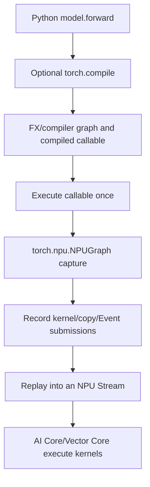
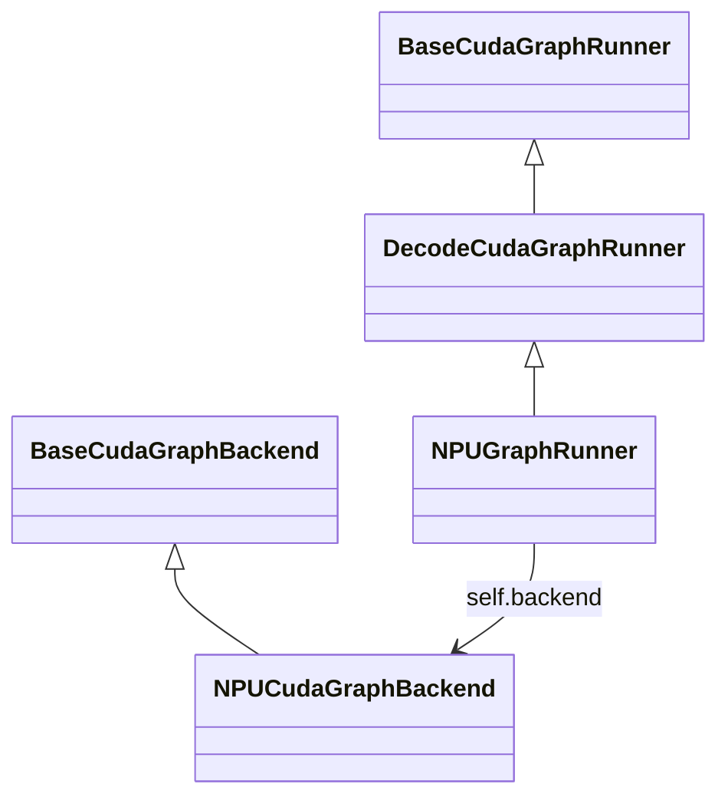

# 05: Computation Graphs, torch.compile, and the SGLang NPU Graph Source Path

> Source baseline: `SGLang@9a03bebf13996b628f8335628a691dcb3aa8400b`. This chapter distinguishes four meanings of “graph,” separates warmup from capture, and traces the complete in-process path from `Scheduler` to `torch.npu.NPUGraph` replay.

## 0. Four Different Graphs

| Name | Nodes/edges represent | Created when |
|---|---|---|
| Conceptual model graph | Mathematical tensor operations and dependencies | Describing model architecture |
| Autograd graph | Operations and gradient dependencies | Dynamically during training forward |
| FX/compiler graph | IR extracted by `torch.compile` | Compilation and guard matching |
| NPUGraph launch graph | Device kernel/copy/Event submission sequence | Runtime capture |

An **IR**, or intermediate representation, is the compiler's internal program form. A **guard** checks assumptions such as dtype, shape, or object state.



`torch.compile` optimizes a program/operator graph. NPUGraph reuses a runtime launch sequence. They can be stacked but are not the same abstraction.

---

## 1. Does Each Model Have One Graph?

The capture facility is generic: `torch.npu.NPUGraph()` does not inherently know GLM, DeepSeek, or Qwen. SGLang's runner invokes the concrete model's `forward`.

The captured artifact is nevertheless specialized to:

- the actual model forward branch;
- TP/PP rank and communication sequence;
- NPU device/context and Device addresses;
- batch/token capture size;
- forward mode and attention metadata;
- Stream index and LoRA variant when included in `ShapeKey`;
- torch, torch_npu, CANN, and kernel versions.

Therefore:

> A model checkpoint does not normally ship with one permanent NPUGraph. A serving process uses a generic mechanism to build a family of environment-specific graph instances.

The runner stores:

```python
self._graphs: Dict[Any, Any] = {}
self._outputs: Dict[Any, Any] = {}
```

and constructs:

```python
ShapeKey(size=size, stream_idx=stream_idx, variant_label=variant_label)
```

One model/rank can therefore own graphs for sizes 1, 2, 4, 8 and additional variants. Each rank normally captures its own objects because weights, context, and storage addresses differ.

---

## 2. Why Use a Launch Graph for Inference?

Decode performs small, frequent steps. Repeating Python dispatch, wrappers, tiling, and many runtime launches can become a significant fraction of latency.

NPUGraph changes:

```text
Every step: Python/runtime submits the entire sequence
```

into:

```text
Once: warm up and capture a stable sequence
Later: update static inputs and replay the sequence
```

It does not change model mathematics, fuse everything into a mega kernel, remove all GM movement, or replace Streams and Events.

---

## 3. Stable Addresses Are the Core Contract

Real API structure:

```python
static_x = torch.empty_like(example_x)
graph = torch.npu.NPUGraph()

with torch.npu.graph(graph):
    static_y = model(static_x)

def run(live_x):
    static_x.copy_(live_x)
    graph.replay()
    return static_y
```

This omits production warmup, capture Stream, pool, and compatibility checks, but shows the address rule:

- `static_x` keeps one address while its contents change;
- `static_y` keeps one output address;
- replay asynchronously rewrites `static_y`;
- returning `static_y` returns a handle, not an early CPU read;
- preserving one replay's output across the next replay requires a correctly ordered clone/copy.

Changing a Python variable to reference a new tensor does not rewrite addresses embedded in a captured launch sequence.

---

## 4. Where SGLang Selects the Graph Path

[`ModelRunner.init_cuda_graphs`](https://github.com/sgl-project/sglang/blob/9a03bebf13996b628f8335628a691dcb3aa8400b/python/sglang/srt/model_executor/model_runner.py#L909-L916) installs eager, prefill-graph, and decode-graph runners. The historical `cuda_graph` name is cross-platform and does not imply CUDA on NPU.

At runtime, [`model_runner.py#L1479-L1516`](https://github.com/sgl-project/sglang/blob/9a03bebf13996b628f8335628a691dcb3aa8400b/python/sglang/srt/model_executor/model_runner.py#L1479-L1516) checks:

```python
can_run_graph = bool(
    mode_check()
    and self.decode_cuda_graph_runner
    and self.decode_cuda_graph_runner.can_run_graph(forward_batch)
)

if can_run_graph:
    ret = self.decode_cuda_graph_runner.execute(forward_batch, ...)
    return ModelRunnerOutput(logits_output=ret, can_run_graph=True)
```

Failure to match uses eager or another path. Graph replay is an optimization fast path, not the only correct model implementation.

---

## 5. Runner and Backend Responsibilities



- `DecodeCudaGraphRunner`: shape buckets, static buffers, `ForwardBatch`, capture/replay orchestration.
- `NPUGraphRunner`: NPU-specific sequence-length updates, dtype, profiling, output slicing.
- `NPUCudaGraphBackend`: creates, stores, updates, and replays real `torch.npu.NPUGraph` objects.

[`resolve_decode_backend`](https://github.com/sgl-project/sglang/blob/9a03bebf13996b628f8335628a691dcb3aa8400b/python/sglang/srt/model_executor/runner_backend/utils.py#L52-L73) returns `NPUCudaGraphBackend` for an NPU device.

### 5.1 Inheritance and Composition Exist at the Same Time

`NPUGraphRunner` and `NPUCudaGraphBackend` are neither two peer graph runners nor a parent/child class pair:

```text
inheritance (is-a):
NPUGraphRunner
  is a DecodeCudaGraphRunner
  and inherits capture(), capture_one_shape(), load_batch(), and related flow

composition (has-a):
NPUGraphRunner
  owns self.backend
  whose NPU value is an NPUCudaGraphBackend
```

[`NPUGraphRunner.__init__()`](https://github.com/sgl-project/sglang/blob/9a03bebf13996b628f8335628a691dcb3aa8400b/python/sglang/srt/hardware_backend/npu/graph_runner/npu_graph_runner.py#L87-L116) does not directly assign:

```python
self.backend = NPUCudaGraphBackend(...)
```

It calls `super().__init__(...)`. After the parent `DecodeCudaGraphRunner` initializes buffers, buckets, and the attention backend, it runs:

```python
self.backend = resolve_decode_backend(self)
```

The factory sees `model_runner.device == "npu"` and returns:

```python
NPUCudaGraphBackend(cuda_graph_runner=self, ...)
```

The runtime relationship is therefore:

```python
runner: NPUGraphRunner
runner.backend: NPUCudaGraphBackend
```

The backend constructor borrows the Device module, TP group, and compile flag from the runner, but does not know model semantics, padding policy, or how to construct a `ForwardBatch`.

| Layer | Knows | Does not own |
|---|---|---|
| `NPUGraphRunner`/`DecodeCudaGraphRunner` | Model, batch/bucket, static input buffers, attention metadata, LoRA/PP/speculative state | A concrete Device runtime capture API |
| `NPUCudaGraphBackend` | `torch.npu.NPUGraph`, capture Stream, graph pool, `ShapeKey -> graph/output`, update and replay | Model layers or how inputs, KV pools, and `ForwardBatch` are organized |

This split lets one decode runner compose with full/breakable CUDA backends or the NPU backend.

The fixed `NPUGraphRunner` also contains helpers named `_create_device_graph()`, `_capture_graph()`, and `_update_inputs()`. Repository-wide reference search at this commit finds only their definitions; the current decode path calls `self.backend.capture_one()` and `self.backend.replay*()` instead. They should not be mistaken for a second active capture path.

### 5.2 `capture_one_shape()` Feeds `capture_one()`; They Are Not Duplicates

Inherited [`capture_one_shape()`](https://github.com/sgl-project/sglang/blob/9a03bebf13996b628f8335628a691dcb3aa8400b/python/sglang/srt/model_executor/runner/decode_cuda_graph_runner.py#L913-L1020) is a **model/shape-layer method**. It answers:

> “For batch-size bucket 4, which static objects constitute one complete model invocation?”

It:

1. derives `bs`, `num_tokens`, and a `ShapeKey` from `size`;
2. uses `capture_prepare()` to create a static `ForwardBatch`, attention backend, and PP tensors;
3. prepares LoRA, TBO, DeepEP, and out-of-graph attention metadata;
4. defines a zero-argument `run_once()` closure;
5. makes that closure call the complete `forward(input_ids, positions, forward_batch, ...)`;
6. passes `ShapeKey + run_once + post_warmup_hook` to the backend.

Only the final call crosses into the Device-graph layer:

```python
self.backend.capture_one(
    shape_key,
    run_once,
    capture_inputs=None,
    post_warmup_hook=post_warmup_hook,
)
```

`NPUCudaGraphBackend.capture_one()` is the **Device-runtime method**. It does not care whether `run_once()` represents GLM, DeepSeek, or Qwen. It only requires that calling the callable submits the intended Device work:

```python
for _ in range(2):
    forward_fn()                 # two ordinary warmups

graph = torch.npu.NPUGraph()
with torch.npu.graph(graph, ...):
    out = forward_fn()           # third execution is captured

self._graphs[shape_key] = graph
self._outputs[shape_key] = out
```

The complete boundary is:

```text
capture_one_shape(size=4, forward)
  -> build static ForwardBatch
  -> build run_once
  -> build ShapeKey
  -> backend.capture_one(ShapeKey, run_once)
       -> warm up
       -> capture with torch.npu.graph
       -> store NPUGraph/output handle
```

Thus:

- `capture_one_shape` prepares **what to execute for one shape**;
- `capture_one` decides **how an already-prepared callable becomes a Device graph**.

Putting both responsibilities into one class would couple the generic model-input contract to one NPU runtime API and prevent clean reuse across backends.

---

## 6. Capture From Source

### 6.1 Buckets and Static Buffers

Keep **batch size** and **bucket** distinct:

- **Batch size** is the number of requests/sequences in one forward; source code abbreviates it as `bs`.
- A **batch-size bucket** is a preselected reusable execution specification keyed by one discrete batch size.
- `capture_bs` is the list of batch sizes to capture, such as `[1, 2, 4, 8]`.

Therefore, `bs` expands to **batch size**, not “bucket size.” In `for bs in capture_bs`, the same integer has two related roles:

```text
bs = 8
  role 1: execute this graph at batch size 8
  role 2: select the batch-size=8 bucket/ShapeKey
```

For a live batch:

```text
raw_bs = 5
capture_bs = [1, 2, 4, 8]

selected bs = 8
graph_key = ShapeKey(size=8)
```

The five real requests are padded to captured batch size 8 and use the graph keyed by 8. A bucket is not a container holding eight batches; the value 8 is the batch size supported by that graph.

`DecodeInputBuffers` owns stable maximum-size buffers including input IDs, positions, request-pool indices, sequence lengths, cache locations, and attention/speculative metadata. Smaller captures use prefix views of these buffers.

More buckets reduce fallback but increase capture time and graph/static-memory use.

### 6.2 Warmup

Use one concrete case throughout this section: SGLang is capturing an ordinary decode bucket with `bs=4`, and `4 in self.compile_bs`, so this bucket enables `torch.compile`. Before learning Dynamo, FX, or TorchAir, identify the five real objects in the call chain:

| Name | Runtime type | Creator | Is it a graph? |
|---|---|---|---|
| `model.forward` | Python bound method tied to the loaded model instance | Model class | No |
| `forward` | Python callable: raw `model.forward` or a Dynamo wrapper | `patch_model_npu()` | No; the wrapper may later select compiled code |
| `forward_batch` | `ForwardBatch` Python object whose fields reference static NPU tensor views and Host metadata | `capture_prepare(4)` | No |
| `run_once` | Zero-argument Python closure | `capture_one_shape()` | No |
| `graph` | `torch.npu.NPUGraph` runtime object | `NPUCudaGraphBackend.capture_one()` | Yes: this is the replayable Device-task graph |

A **bound method** remembers its `self` object. Calling `model.forward(a, b, c)` implicitly passes `model` to the class definition `forward(self, a, b, c)`.

A **callable** is any Python object that can be invoked as `forward(...)`. It need not be an ordinary function or an already-compiled binary; the wrapper returned by `torch.compile` is also a callable.

A **closure** retains references from the scope in which it was defined. `run_once()` accepts no arguments, but remembers this bucket's `forward_batch`, `forward`, `attn_backend`, and `num_tokens`.

The fixed source has this concrete call structure:

```python
# DecodeCudaGraphRunner._capture_one_stream()
with torch_compile_decoration.patch_model(
    self.model_runner.model,
    bs in self.compile_bs,                 # True in this example
    num_tokens=bs * self.captured_req_width,
    tp_group=self.model_runner.tp_group,
) as forward:
    self.capture_one_shape(bs, forward, ...)

# DecodeCudaGraphRunner.capture_one_shape()
forward_batch, attn_backend, pp_proxy_tensors = self.capture_prepare(bs, ...)

def run_once():
    attn_backend.init_forward_metadata_in_graph(forward_batch)
    ...
    return forward(
        forward_batch.input_ids,
        forward_batch.positions,
        forward_batch,
    )

self.backend.capture_one(shape_key, run_once, ...)
```

“Two warmups plus one capture” therefore means that `NPUCudaGraphBackend` invokes the **same `run_once` closure three times**:

```text
run_once call 1: ordinary execution, warmup #1
run_once call 2: ordinary execution, warmup #2
run_once call 3: inside torch.npu.graph(...), the capture forward
```

All three calls see the same `ForwardBatch` object and the same static storage addresses. The distinguishing condition is that the NPU runtime is in capture state only for the third call. Every Dynamo, FX, and TorchAir detail below hangs from this concrete spine.

#### 6.2.1 Precise Definitions

**Warmup** means executing a real forward pass before measurement, capture, or serving so that first-use work happens early. Such work can include:

- lazy Python/module initialization;
- first invocation of Dynamo, `torch.compile`, or the compiler backend;
- kernel/operator binary loading;
- operator selection, autotuning, and workspace allocation;
- allocator cache creation;
- communicator and attention-metadata initialization.

**Capture** means executing a forward pass inside `torch.npu.graph(...)`. The runtime records the submitted Device work, dependencies, and memory contract and produces a replayable `NPUGraph`.

| Property | Warmup | Capture |
|---|---|---|
| Executes a real forward | Yes | Yes |
| Produces a replayable graph | No | Yes |
| Saves its output as the captured output handle | No | Yes, in `_outputs[shape_key]` |
| Primary goal | Remove first-run effects and reach steady state | Record the steady-state launch sequence |
| Inside `torch.npu.graph(...)` | No | Yes |

The exact sequence is:

```text
ordinary forward warmup #1
  -> ordinary forward warmup #2
    -> capture forward inside graph context
      -> future requests replay only
```

Warmup does not record a temporary graph, and the second warmup is not reused as the captured execution. Two warmups are an SGLang NPU backend engineering choice, not a universal hardware rule. First-use compilation, allocation, or communication inside capture can make capture unexpectedly slow, record unwanted one-time work, or invoke operations the runtime cannot capture.

#### 6.2.2 Three Different Warmup Contexts in This Source Tree

First, [`DecodeCudaGraphRunner.capture()`](https://github.com/sgl-project/sglang/blob/9a03bebf13996b628f8335628a691dcb3aa8400b/python/sglang/srt/model_executor/runner/decode_cuda_graph_runner.py#L825-L857) calls the common runner method:

```python
self.warmup()
```

However, [`BaseRunner.warmup()`](https://github.com/sgl-project/sglang/blob/9a03bebf13996b628f8335628a691dcb3aa8400b/python/sglang/srt/model_executor/runner/base_runner.py#L210-L240) contains:

```python
if getattr(mr, "_kernel_warmed_up", False):
    return
mr._kernel_warmed_up = True

if mr.device != "cuda":
    return
```

On the current NPU path it sets the run-once flag and immediately returns. The later FlashInfer workspace, autotune, and DeepGEMM logic is CUDA-specific. This call therefore is **not** the two-forward NPU warmup.

Second, the real per-shape NPU warmup is in [`NPUCudaGraphBackend.capture_one()`](https://github.com/sgl-project/sglang/blob/9a03bebf13996b628f8335628a691dcb3aa8400b/python/sglang/srt/hardware_backend/npu/graph_runner/npu_cudagraph_backend.py#L78-L127):

```python
for _ in range(2):
    self._device_module.synchronize()
    self._tp_group.barrier()
    forward_fn()
    if post_warmup_hook is not None:
        post_warmup_hook()
```

- `synchronize()` waits for earlier NPU work. At the start of the second iteration it also guarantees that the first warmup has completed.
- `barrier()` aligns all Tensor Parallel ranks before each attempt, avoiding mismatched collective progress.
- `forward_fn` is a zero-argument Python closure over the static `ForwardBatch`, static buffer views, attention backend, and selected model callable.
- `post_warmup_hook` lets the attention backend reset state mutated by warmup. The caller obtains it from `attn_backend.on_after_cuda_graph_warmup`.

The warmup return value is discarded. The first pass usually triggers lazy setup; the second more closely resembles steady-state repetition and exposes paths that differ between first and subsequent invocations.

Third, some captured buckets use a `torch.compile` callable. This does not mean “compile the Python file into one binary.” PyTorch extracts an **operator-semantic graph** and creates guards from the first `forward`, then gives the FX graph to the Ascend TorchAir backend. What that backend returns depends on its configuration: the fixed `npugraph_ex` path in this chapter sets `run_eagerly=True`, so TorchAir performs AOT/decomposition/FX preparation and returns an eager FX runner; it **does not build a TorchAir GE/ACL executable graph on this path**. The outer NPUGraph later captures the reusable Device-task sequence.

Start with `compile_bs`.

##### Step 1: Which Buckets Enable Compilation?

[`get_batch_sizes_to_capture()`](https://github.com/sgl-project/sglang/blob/9a03bebf13996b628f8335628a691dcb3aa8400b/python/sglang/srt/model_executor/runner/base_cuda_graph_runner.py#L58-L103) returns two lists:

```python
capture_bs = ...  # every batch-size bucket that needs an NPUGraph
compile_bs = (
    [bs for bs in capture_bs if bs <= server_args.torch_compile_max_bs]
    if get_flags().capture.enable_torch_compile
    else []
)
```

For example:

```text
capture_bs = [1, 2, 4, 8, 16]
torch_compile_max_bs = 8
enable_torch_compile = True

compile_bs = [1, 2, 4, 8]
```

Buckets 1/2/4/8 therefore pass through `torch.compile`; bucket 16 calls raw `model.forward`. All five can still be captured by the outer NPUGraph. **`compile_bs` selects compiler use, while `capture_bs` selects launch-graph creation.**

##### Step 2: The NPU Runner Replaces the Common Patch Function

Before entering parent capture initialization, [`NPUGraphRunner.__init__()`](https://github.com/sgl-project/sglang/blob/9a03bebf13996b628f8335628a691dcb3aa8400b/python/sglang/srt/hardware_backend/npu/graph_runner/npu_graph_runner.py#L87-L108) runs:

```python
from sglang.srt.compilation import torch_compile_decoration

torch_compile_decoration.patch_model = patch_model_npu
super().__init__(model_runner, ...)
```

This is a Python **monkey patch**: a module attribute is redirected at runtime. The common decode runner still calls `torch_compile_decoration.patch_model`, but NPU execution enters `patch_model_npu`.

##### Step 3: Each Bucket Receives One of Two Callables

[`_capture_one_stream()`](https://github.com/sgl-project/sglang/blob/9a03bebf13996b628f8335628a691dcb3aa8400b/python/sglang/srt/model_executor/runner/decode_cuda_graph_runner.py#L875-L912) does:

```python
for bs in reversed(self.capture_bs):
    with torch_compile_decoration.patch_model(
        self.model_runner.model,
        bs in self.compile_bs,
        num_tokens=bs * self.captured_req_width,
        tp_group=self.model_runner.tp_group,
    ) as forward:
        self.capture_one_shape(bs, forward, ...)
```

| Variable | Type | Meaning |
|---|---|---|
| `bs` | Python `int` | Captured batch size of this graph; also its batch-size-bucket key |
| `self.compile_bs` | `list[int]` | Buckets allowed to use `torch.compile` |
| `bs in self.compile_bs` | Python `bool` | The `enable_compile` argument |
| `self.model_runner.model` | `torch.nn.Module` | Loaded SGLang model |
| `forward` | Python callable | Raw bound method or `torch.compile` wrapper |

`patch_model_npu` is a `@contextmanager`. Its `yield` exposes a temporary callable to `with ... as forward`; it is not a model output:

```python
@contextmanager
def patch_model_npu(model, enable_compile, num_tokens, tp_group):
    if enable_compile:
        backend = get_compiler_backend("npugraph_ex")
        yield torch.compile(
            torch.no_grad()(model.forward),
            fullgraph=True,
            dynamic=False,
            backend=backend,
        )
    else:
        yield model.forward
```

- `model.forward` is a Python **bound method** tied to the current model instance.
- `torch.no_grad()` disables autograd backward-graph recording for inference.
- `torch.compile(...)` returns a callable wrapper; reaching this line does not mean compilation with real inputs has completed.
- `fullgraph=True` asks Dynamo for one complete compiler graph rather than silently tolerating arbitrary graph breaks.
- `dynamic=False` specializes to static input specifications, matching bucket capture.
- `num_tokens` and `tp_group` remain in the common patch interface but are not used by the current `patch_model_npu` body.

When `enable_compile=False`, the context yields raw `model.forward`. Two NPU warmups and one NPUGraph capture still happen; only the compiler-graph layer is absent.

##### Step 4: What Is the `npugraph_ex` Backend?

On NPU, [`get_compiler_backend("npugraph_ex")`](https://github.com/sgl-project/sglang/blob/9a03bebf13996b628f8335628a691dcb3aa8400b/python/sglang/srt/utils/common.py#L969-L995) returns a TorchAir backend callable, not the literal string:

```python
compiler_config = CompilerConfig()
compiler_config.mode = "reduce-overhead"
compiler_config.debug.run_eagerly = True
npu_backend = torchair.get_npu_backend(compiler_config=compiler_config)
return npu_backend
```

**TorchAir** adapts PyTorch compiler graphs to the Ascend graph/operator stack. `torchair.get_npu_backend(...)` returns a function conforming to the `torch.compile` backend protocol. Its inputs are not simply the outer function's three arguments; Dynamo/AOT supplies:

```text
gm: torch.fx.GraphModule
example_inputs: a flattened list providing specifications/example values for FX placeholders
```

An **FX GraphModule** combines an FX node graph with referenced module attributes. PyTorch documentation normally uses the name `torch.fx` directly; this lesson does not invent an unstable long-form expansion for “FX.” Common node kinds are `placeholder`, `call_function`, `get_attr`, and `output`. It expresses operator dependencies; it is not an NPU Stream task queue.

In particular, do not assume that `example_inputs` is:

```python
[input_ids, positions, forward_batch]
```

`ForwardBatch` is a complex Python object, not one Device tensor accepted directly by a graph compiler. Dynamo traces Python attribute reads from it. Tensor fields used by computation may be lifted into FX placeholders; compile-time Python values may be specialized and protected by guards; unused fields do not become backend inputs. The number and order of `example_inputs` therefore belong to the compiler graph's internal ABI, not the user's original function signature.

Configuration meanings:

- `mode="reduce-overhead"` favors reduced repeated Host/launch overhead for graph-style execution.
- `debug.run_eagerly=True` **skips TorchAir's NPU graph compiler and returns the eager FX graph runner**.

The second point is essential for the fixed SGLang path. It does not mean “run eager once and still produce a GE/ACL compiled graph.” The official TorchAir implementation in [`_NpuFxCompiler._gen_compiled_gm()`](https://gitee.com/ascend/torchair/blob/b9255d87ebcd54c9ea325f700fcb65deddd8b501/python/torchair/npu_fx_compiler.py#L491-L498) explicitly selects:

```python
if self.config.debug.run_eagerly:
    ...
    return graph.fx_graph

return concrete_graph
```

The `npugraph_ex` combination still uses `torch.compile`'s Dynamo/fullgraph/guard machinery and TorchAir's AOT/decomposition/FX preparation, but the resulting FX GraphModule runs through eager operator dispatch. The outer SGLang `torch.npu.NPUGraph` is what records reusable Device tasks; this path does not nest a TorchAir GE/ACL execution graph inside it.

TorchAir evolves with the CANN/PyTorch-NPU release. Internal class names may change, so another deployment should verify the installed `npu_fx_compiler.py`; the fixed source above establishes the `run_eagerly` semantic used here.

##### Step 5: Why Compilation Happens During the First Warmup Call

A crucial correction comes first: “compiler warmup” does not necessarily produce a TorchAir GE/ACL binary. Under the fixed `npugraph_ex + run_eagerly=True` configuration, the precise statement is:

> Warmup #1 triggers Dynamo graph extraction, guard creation, AOT/TorchAir backend preparation, and the first real execution of an FX runner. `run_eagerly=True` skips TorchAir's NPU graph compiler, so the Device tasks still come from eager NPU operator dispatch while executing that FX graph.

The following subsections enter that call one layer at a time.

###### 5.1 The `torch.compile(...)` Line Only Creates a Wrapper

In the PyTorch 2.10 source, [`torch.compile()`](https://github.com/pytorch/pytorch/blob/v2.10.0/torch/__init__.py#L2505-L2512) ends with:

```python
return torch._dynamo.optimize(
    backend=backend,
    nopython=fullgraph,
    dynamic=dynamic,
    disable=disable,
    guard_filter_fn=guard_filter_fn,
)(model)
```

This registers the callable with Dynamo's optimization context and returns a wrapper that installs a frame-evaluation hook. At this point, none of the following bucket-specific objects exists yet:

- this bucket's `ForwardBatch`;
- an FX `GraphModule` specialized from these inputs;
- guards associated with that graph;
- the runner returned by the TorchAir backend.

Do not read:

```python
forward = torch.compile(...)
```

as a C/C++-style function that has already returned a machine-code address. It means, approximately, “when this Python callable is first invoked, let Dynamo take control first.”

###### 5.2 Warmup #1 Enters `run_once()` From `capture_one()`

The first loop iteration in [`NPUCudaGraphBackend.capture_one()`](https://github.com/sgl-project/sglang/blob/9a03bebf13996b628f8335628a691dcb3aa8400b/python/sglang/srt/hardware_backend/npu/graph_runner/npu_cudagraph_backend.py#L78-L127) executes:

```python
self._device_module.synchronize()
self._tp_group.barrier()
forward_fn()                         # forward_fn is run_once
if post_warmup_hook is not None:
    post_warmup_hook()
```

The two synchronization scopes differ:

- `synchronize()` is Device synchronization: this Host thread waits for previously submitted work on the NPU device;
- `barrier()` is process/rank synchronization: every TP rank must arrive before all continue.

`forward_fn` then enters the real closure defined by `capture_one_shape()`:

```python
def run_once():
    attn_backend.init_forward_metadata_in_graph(forward_batch)

    forward_batch.dp_local_start_pos = None
    forward_batch.dp_local_num_tokens = None
    set_dp_buffer_len(
        forward_batch.global_dp_buffer_len,
        num_tokens,
        forward_batch.dp_padding_mode.is_max_len(),
        forward_batch.global_num_tokens_cpu,
    )
    set_is_extend_in_batch(False)

    out = forward(
        forward_batch.input_ids,
        forward_batch.positions,
        forward_batch,
        **kwargs,
    )
    for capture_hook in self.model_runner.capture_tail_hooks:
        capture_hook(self, out, forward_batch, num_tokens)
    return out
```

`init_forward_metadata_in_graph()` prepares attention-metadata operations that must eventually appear as Device tasks in the captured path. During warmup the runtime is not capturing yet, so those operations execute normally. The following assignments update Host-side `ForwardBatch` state; `set_dp_buffer_len()` establishes DP length state; `set_is_extend_in_batch(False)` selects ordinary decode; the model runs; and tail hooks finish the same execution contract.

The target being warmed is therefore the whole `run_once` path, not only `model.forward`.

###### 5.3 What Dynamo Does on the First Compiled `forward` Call

Python invokes:

```python
forward(
    forward_batch.input_ids,     # NPU Tensor, static input-ID view
    forward_batch.positions,     # NPU Tensor, static position view
    forward_batch,               # ForwardBatch Python object
)
```

The `forward` callable is the Dynamo wrapper from 5.1, which has not produced a graph for these inputs. Dynamo uses Python's frame-evaluation machinery to take over the `model.forward` bytecode.

**Bytecode** is CPython's intermediate instruction stream—operations such as attribute loads, calls, and conditional jumps—not NPU machine code. Dynamo's symbolic interpreter walks it:

- a Python read such as `forward_batch.forward_mode` records the accessed path and a specialization condition;
- tensor operations create FX proxies/nodes instead of immediately completing every mathematical operation as the final model result;
- FakeTensors/example metadata propagate shape, dtype, stride, and device;
- parameters, buffers, and runtime-varying tensor values become graph attributes or inputs.

A **FakeTensor** carries tensor metadata without the real large data allocation. It lets compilation infer a `matmul` output shape without performing the full matrix multiplication during symbolic graph extraction.

`fullgraph=True` maps to `nopython=True` inside `torch.compile`. If Dynamo cannot represent the invocation as an allowed full graph, a graph-break error is expected instead of silently resuming arbitrary Python in the middle.

A **graph break** is the boundary at which Dynamo cannot keep representing Python behavior in the current FX graph. In this full-graph path it is a compatibility problem to diagnose, not a normal segmentation strategy.

###### 5.4 FX GraphModule Versus Guards

Symbolic tracing produces two distinct categories of artifact:

```text
FX GraphModule
  placeholder/get_attr/call_function/output nodes and their dependencies

guards
  conditions under which that GraphModule remains valid
```

A simplified guard set might require:

```text
input_ids is an NPU Tensor
input_ids.dtype == torch.int64
input_ids.shape == [4]
positions.shape == [4]
the model remains on the eval/no_grad path
a branch-selecting ForwardBatch enum remains DECODE
```

Actual guards are generated from every relevant object access and can be more numerous. `dynamic=False` favors shape specialization for the current bucket, so size-4 and size-8 calls commonly select different compiler variants.

Guards execute on the Host; they do no matrix multiplication. They answer, “Can this call safely enter a previously generated callable?” A guard miss may create another variant or eventually fall back after the recompile limit.

###### 5.5 How Dynamo Calls the TorchAir Backend

After constructing `gm` and `example_inputs`, Dynamo's `OutputGraph` calls the user backend with the essential protocol:

```python
compiled_fn = compiler_fn(gm, example_inputs)
assert callable(compiled_fn)
```

Here `compiler_fn` is the TorchAir backend, `gm` is a `torch.fx.GraphModule`, and `example_inputs` correspond to FX placeholders. The backend must return another callable so Dynamo can install it into generated Python bytecode.

TorchAir's [`_npu_backend()`](https://gitee.com/ascend/torchair/blob/b9255d87ebcd54c9ea325f700fcb65deddd8b501/python/torchair/npu_fx_compiler.py#L595-L629) first enters an AOTAutograd/functionalization/decomposition pipeline:

- **AOTAutograd** is PyTorch infrastructure for ahead-of-time forward/backward or inference graph processing; this `no_grad` lesson focuses on the inference/forward graph;
- **functionalization** rewrites selected in-place semantics into forms better suited for graph analysis while preserving required mutation contracts;
- **decomposition** rewrites some composite operators into a supported set of lower-level operations.

None of these objects is an `NPUGraph`.

`_NpuFxCompiler` then prepares a target concrete-graph object and FX runner, but the fixed configuration takes:

```python
if self.config.debug.run_eagerly:
    return graph.fx_graph
```

The callable returned to Dynamo is therefore an AOT/TorchAir-prepared FX GraphModule runner, not a completed GE/ACL executable.

###### 5.6 Where Warmup #1 Performs Real Execution

After the backend returns, Dynamo rewrites the original call to invoke that callable and continues within the **same warmup #1**.

Because this configuration returns an FX GraphModule runner, its ATen/torch_npu/custom-op nodes use ordinary dispatch:

```text
FX call_function node
  -> PyTorch dispatcher
  -> NPU implementation / torch_npu / custom-op wrapper
  -> CANN runtime submits a Device task to the current NPU stream
```

Submission remains asynchronous. Receiving an output tensor handle on the Host does not mean all NPU arithmetic is complete. The `self._device_module.synchronize()` at the start of the second loop iteration waits for warmup #1's Device work.

The first warmup output is discarded. What remains is:

- the first Dynamo trace, guards, and compiler variant;
- the first TorchAir backend/AOT/FX-runner preparation;
- one complete Device execution through that runner;
- any lazy operator registration, kernel load, allocator, or workspace state triggered along the way.

###### 5.7 Why Warmup #2 Still Executes the Entire Model

The second iteration still runs:

```python
self._device_module.synchronize()  # explicitly waits for warmup #1
self._tp_group.barrier()
forward_fn()                       # full run_once again
post_warmup_hook()
```

The compiled `forward` evaluates guards first. On a hit:

```text
guard hit
  -> select warmup #1's callable
  -> do not symbolically reinterpret all model.forward bytecode
  -> do not call the TorchAir backend again
  -> still execute the complete FX graph and resubmit every model Device task
```

Reusing an artifact removes graph extraction/backend preparation; it does not remove model computation. Warmup #2 still calculates all decoder layers, attention, MoE, and logits.

The loop contains no separate `synchronize()` after the second forward. Do not claim that the loop tail explicitly waits for warmup #2. Subsequent capture-context/stream runtime establishes legal ordering; source reading must distinguish an explicit synchronization line from ordering supplied by the following runtime context.

###### 5.8 Only the Third Call Is the Capture Forward

After the two ordinary executions:

```python
graph = torch.npu.NPUGraph()
```

When compilation is enabled, the backend also constructs:

```python
skip_guard_context = torch.compiler.set_stance(
    skip_guard_eval_unsafe=True
)
```

`skip_guard_eval_unsafe` does not permanently delete all guards. The [PyTorch 2.10 documentation](https://docs.pytorch.org/docs/2.10/generated/torch.compiler.set_stance.html) defines it as reducing guard evaluation to the differentiating guards needed among existing variants. It is unsafe because the caller promises that warmup has covered every required variant and no new recompilation is necessary. Fixed buckets, branches, and static storage make that the intended SGLang contract.

The third call runs inside:

```python
with (
    skip_guard_context,
    torch.npu.graph(
        graph,
        pool=self._pool,
        stream=self._capture_stream,
        auto_dispatch_capture=True,
    ),
):
    out = forward_fn()     # third complete run_once
```

The path is still `run_once -> compiled forward -> FX runner -> NPU dispatcher`, but the runtime is now in capture state. Device tasks, dependencies, and address bindings produced by eager FX dispatch are recorded into `graph`.

NPUGraph does **not** record Dynamo bytecode interpretation, the Python FX object structure, the `ForwardBatch` object itself, or a Python loop object such as `for layer in layers` from the original model source.

The raw and compiled paths differ here. Raw `model.forward` executes its original Python control flow again during the third call. In the compiled path, the fixed layer loop was normally unrolled into FX nodes during the first Dynamo trace, so the third call runs the Dynamo wrapper and generated FX runner instead of interpreting that original loop layer by layer. Both paths make their respective dispatcher calls on the Host; NPUGraph retains only the Device-task submissions those calls produce.

###### 5.9 What Persists After the Three Calls

| Invocation | In graph context? | Executes model Device work? | Persistent result |
|---|---|---|---|
| warmup #1 | No | Yes | Dynamo variant, guards, backend/FX-runner cache, and first-use runtime state |
| warmup #2 | No | Yes | More stable kernel/runtime/allocator state; output discarded |
| capture forward | Yes | Yes | `NPUGraph` and an output handle bound to capture storage |

The accurate fixed-path timeline is:

```text
Create the compiled callable
  torch.compile(model.forward, ...)
  -> returns a Dynamo wrapper
  -> no bucket-specific FX graph or guards yet

warmup #1: first forward(...) call
  -> Dynamo interprets bytecode and builds FX using FakeTensor/Proxy values
  -> creates guards
  -> TorchAir backend performs AOT/decomposition/FX preparation
  -> run_eagerly=True returns an FX runner and skips the NPU graph compiler
  -> FX runner dispatches real NPU tasks
  -> warmup output handle is discarded

warmup #2: call the same forward(...) again
  -> guard hit selects the same variant without retracing
  -> the complete FX runner and model Device computation execute again
  -> output handle is discarded again

capture forward: third call
  -> enter torch.npu.graph(...)
  -> execute the same complete run_once a third time
  -> NPUGraph records Device tasks produced by eager FX dispatch
  -> save the graph and capture output handle
```

Compiler warmup therefore does not warm an already-existing NPUGraph. It runs the first Dynamo/TorchAir/dispatcher/runtime path before NPUGraph begins recording.

##### Step 6: What Changes When `run_eagerly=False`?

Do not generalize the SGLang special case into “TorchAir never compiles.” With `run_eagerly=False`, `_NpuFxCompiler._gen_compiled_gm()` returns a concrete graph:

- `mode="max-autotune"` generally creates `GeConcreteGraph`; its [`__call__()`](https://gitee.com/ascend/torchair/blob/b9255d87ebcd54c9ea325f700fcb65deddd8b501/python/torchair/_ge_concrete_graph/fx2ge_converter.py#L643-L706) processes runtime inputs and loads/compiles/runs a GE graph on the first call;
- `mode="reduce-overhead"` creates `AclConcreteGraph`, whose callable manages its own ACL graph compilation/capture/replay.

That alternative timeline is:

```text
Dynamo FX graph
  -> TorchAir concrete graph
  -> first concrete_graph(...) performs internal load/compile/capture
  -> later calls reuse the TorchAir graph runner
```

The fixed SGLang configuration instead composes:

```text
Dynamo/TorchAir-prepared FX runner
  -> eager operator dispatch produces NPU tasks
  -> outer SGLang NPUGraph captures those tasks
```

The three warmup/capture entry points can now be summarized as:

```text
DecodeCudaGraphRunner.capture()
  |
  +-- BaseRunner.warmup()
  |     `-- NPU: returns in this version; CUDA-only autotuning is skipped
  |
  `-- for each ShapeKey
        `-- NPUCudaGraphBackend.capture_one()
              +-- forward_fn()        # warmup 1; may trigger torch.compile
              +-- forward_fn()        # warmup 2; closer to steady state
              `-- torch.npu.graph(...)
                    `-- forward_fn()  # capture run
```

These paths must not be collapsed into “TorchAir always builds a GE/ACL graph and SGLang then captures that same graph.”

```text
DecodeCudaGraphRunner.capture()
  |
  +-- BaseRunner.warmup()
  |     `-- current NPU path returns before CUDA-only autotune
  |
  `-- for each ShapeKey
        `-- NPUCudaGraphBackend.capture_one()
              +-- forward_fn()        # warmup 1; may trigger torch.compile
              +-- forward_fn()        # warmup 2; closer to steady state
              `-- torch.npu.graph(...)
                    `-- forward_fn()  # capture run
```

#### 6.2.3 Why Warmup Must Match the Target Path

A batch-1 eager warmup does not fully warm a batch-8 compiled capture. Effective warmup should match the capture bucket, static buffer views and addresses, model/attention branch, TP collective order, and compile setting.

`capture_one_shape()` defines one closure and passes that same closure to the backend:

```python
def run_once():
    attn_backend.init_forward_metadata_in_graph(forward_batch)
    return forward(
        forward_batch.input_ids,
        forward_batch.positions,
        forward_batch,
    )

self.backend.capture_one(
    shape_key,
    run_once,
    capture_inputs=None,
    post_warmup_hook=post_warmup_hook,
)
```

This `forward_batch` is not a live serving request. `capture_prepare()` builds it from prefix views of `DecodeInputBuffers`, so warmup, capture, and later replay share the same input/metadata storage-address contract; the output handle created by capture is stored separately.

### 6.3 Real Capture

#### 6.3.1 Where the Capture Stream and Graph Pool Come From

Before entering one bucket, `DecodeCudaGraphRunner.capture()` creates a capture session:

```python
with graph_capture() as graph_capture_context, profile_context as prof:
    self.stream = graph_capture_context.stream
    with self.backend.capture_session(self.stream):
        self._capture_one_stream()
```

The NPU backend's `capture_session()` retains the pool and stream:

```python
if self._pool is None:
    self._pool = self._device_module.graph_pool_handle()
set_graph_pool_id(self._pool)
self._capture_stream = stream
try:
    yield
finally:
    self._capture_stream = None
```

`graph_pool_handle()` returns a runtime graph-memory-pool handle, not a Python `list` of tensors. It coordinates stable graph allocations and lets bucket graphs share memory planning. `set_graph_pool_id()` communicates the pool identity to related allocator/communication paths. `_capture_stream` is the NPU Stream used by the third forward. The `finally` block clears only the session's temporary stream reference; it does not delete captured graphs.

Each bucket has its own `NPUGraph`, while buckets in one capture session may share graph-pool planning and a capture stream.

#### 6.3.2 The Complete Capture Branch in `capture_one()`

The fixed source after two warmups is:

```python
graph = torch.npu.NPUGraph()

if self._enable_torch_compile:
    skip_guard_context = torch.compiler.set_stance(
        skip_guard_eval_unsafe=True
    )
else:
    skip_guard_context = empty_context()

if self._memory_saver_adapter is not None and self._memory_saver_adapter.enabled:
    graph_ctx = partial(
        self._memory_saver_adapter.cuda_graph,
        tag=GPU_MEMORY_TYPE_CUDA_GRAPH,
    )
else:
    graph_ctx = torch.npu.graph

with (
    skip_guard_context,
    graph_ctx(
        graph,
        pool=self._pool,
        stream=self._capture_stream,
        auto_dispatch_capture=True,
    ),
):
    out = forward_fn()

self._graphs[shape_key] = graph
self._outputs[shape_key] = out
```

`empty_context()` is a no-op context manager that keeps the compiled and non-compiled branches structurally identical. `graph_ctx` is normally `torch.npu.graph`; with memory saving enabled an adapter supplies the NPU graph capture context.

#### 6.3.3 Before, During, and After `with torch.npu.graph(...)`

Read the context-manager boundaries as:

```text
before entering
  graph is only a new NPUGraph container
  the third forward has not been recorded

enter graph_ctx
  runtime puts the selected stream into capture state
  binds graph, pool, and the auto-dispatch capture option

execute the body
  Host executes the complete run_once()
  model/FX nodes dispatch NPU tasks
  runtime records capturable tasks, dependencies, and address contracts

exit graph_ctx
  runtime ends and finalizes capture
  graph becomes replayable
```

Capture observes submissions produced by dynamic execution; it does not scan the `forward_fn` source string. A branch not taken by the third forward does not magically enter the graph. The Python `if` decision is generally not an NPUGraph node; Device tasks emitted by the selected branch are. `fullgraph=True` constrains the Dynamo compiler graph, while `torch.npu.graph` constrains Device launch capture.

#### 6.3.4 What Each Object Retains

| Object | Type/content | Role after capture |
|---|---|---|
| `graph` | `torch.npu.NPUGraph` | Device tasks, dependencies, and address bindings for this `ShapeKey` |
| `_pool` | Graph memory-pool handle | Stable memory planning for captured graphs |
| `_capture_stream` | NPU Stream | Selects the submission sequence observed during capture |
| `forward_fn` | Python `run_once` closure | Used for warmup/capture; replay does not call it again |
| `out` | Tensor or output tree such as `LogitsProcessorOutput` | Handle to capture-time output storage that replay overwrites |
| `shape_key` | `ShapeKey` | Distinguishes batch-size and stream/variant specifications |
| `_graphs` | `dict[ShapeKey, NPUGraph]` | Runtime graph lookup |
| `_outputs` | `dict[ShapeKey, Any]` | Existing handles bound to graph output storage |

`out` is not a permanently frozen snapshot of capture-time numbers. It refers to storage; later replay updates that same storage.

#### 6.3.5 Source Line to Host/Device Behavior

| Source | Host behavior | Device/runtime behavior |
|---|---|---|
| `graph = torch.npu.NPUGraph()` | Creates a Python/runtime handle | No model execution yet |
| enter `graph_ctx(...)` | Calls context-manager entry | Selected stream begins capture and binds the pool |
| `out = forward_fn()` | Runs metadata preparation, Python model path, and dispatcher calls | Operator tasks are submitted and recorded |
| exit `graph_ctx` | Calls context-manager exit | Capture finalizes into a replayable graph |
| `_graphs[key] = graph` | Stores a handle in a Python dictionary | No Device recomputation |
| `_outputs[key] = out` | Stores the output-storage handle | Does not copy an output-value snapshot |

Warmup #2 cannot “also become the graph” because its `forward_fn()` call occurs outside `graph_ctx`; the runtime was not capturing. The complete third forward must execute again.

The default path keeps `graph` in the process-local `_graphs` dictionary. It does not automatically serialize the whole NPUGraph into the model directory. Loading kernel/compiler caches from disk and loading this runtime NPUGraph are separate ideas.

### 6.4 Why Does AttentionBackend Also Have `forward_decode_graph()`?

First correct a crucial call-chain misconception:

> **When an online request hits the graph fast path, `NPUGraphRunner.execute()` does not call Python `model.forward()` again.**

`model.forward()` executes through the `run_once()` closure only while startup capture is building the graph. For an online hit, [`ModelRunner._forward_raw()`](https://github.com/sgl-project/sglang/blob/9a03bebf13996b628f8335628a691dcb3aa8400b/python/sglang/srt/model_executor/model_runner.py#L1479-L1524) returns early:

```python
ret = self.decode_cuda_graph_runner.execute(forward_batch, ...)
return ModelRunnerOutput(logits_output=ret, can_run_graph=True)
```

The online body of [`NPUGraphRunner.execute()`](https://github.com/sgl-project/sglang/blob/9a03bebf13996b628f8335628a691dcb3aa8400b/python/sglang/srt/hardware_backend/npu/graph_runner/npu_graph_runner.py#L209-L280) is:

```text
load_batch()/copy_ static inputs
  -> compute graph_key
  -> backend.replay_with_input_update(...) or backend.replay(...)
  -> slice padding and return the static output handle
```

There is no `model.forward(...)` in this online sequence. Capture time and replay time must be separated.

#### 6.4.1 Startup Capture: Model and Attention Python Really Execute

```text
initialize NPUGraphRunner
  -> DecodeCudaGraphRunner.capture()
  -> capture_one_shape()
  -> define and invoke run_once()
  -> model.forward(...)
  -> an attention layer in the model
  -> AttentionBackend.forward(...)
  -> AscendAttnBackend.forward_decode(...)
  -> possibly forward_decode_graph(...)
  -> outer NPUGraph captures the resulting attention Device tasks
```

[`AttentionBackend.forward()`](https://github.com/sgl-project/sglang/blob/9a03bebf13996b628f8335628a691dcb3aa8400b/python/sglang/srt/layers/attention/base_attn_backend.py#L195-L245) is the operator-level dispatcher used by each attention layer. It selects `forward_decode()`, `forward_extend()`, and related methods from `ForwardMode`; it is not another model runner.

Ascend's [`forward_decode()`](https://github.com/sgl-project/sglang/blob/9a03bebf13996b628f8335628a691dcb3aa8400b/python/sglang/srt/hardware_backend/npu/attention/ascend_backend.py#L2440-L2484) adds:

```python
if self.graph_mode and (not self.enable_torch_compile):
    return self.forward_decode_graph(...)
```

`graph_mode` does not mean the AttentionBackend owns another graph. It is a Python state flag saying that `self.forward_metadata` now refers to graph-specific static metadata:

```python
attn_backend.init_forward_metadata_out_graph(forward_batch, in_capture=True)
    -> _init_cuda_graph_metadata(...)
    -> _apply_cuda_graph_metadata(...)
         -> self.forward_metadata = metadata
         -> self.graph_mode = True
```

`forward_decode_graph()` merely selects an **outer-graph-capturable implementation** for the attention portion. It can:

- use bucket-prepared block tables, SWA masks, and padding metadata;
- write KV cache at fixed shapes;
- invoke update-aware FIA entry points such as `npu_fused_infer_attention_score.out`;
- avoid live-shape slicing and dynamic metadata construction from the ordinary eager path.

Its tasks remain only one portion of the complete model graph:

```text
whole-model NPUGraph
  = embedding tasks
  + layer-0 attention tasks (emitted by forward_decode_graph)
  + layer-0 MLP/MoE tasks
  + ...
  + logits tasks
```

It does not create, nest, or own a separate attention graph.

#### 6.4.2 Online Replay Does Not Invoke This Python Method

After capture, the tasks emitted by `forward_decode_graph()` already belong to the stored `NPUGraph`:

```text
ModelRunner._forward_raw()
  -> NPUGraphRunner.execute()
       -> load_batch()
            -> init_forward_metadata_out_graph(fb_view)
               # write this iteration's values into static metadata storage
       -> NPUCudaGraphBackend.replay*()
            -> torch.npu.NPUGraph.replay()
               # Device replays the recorded attention tasks
```

Online Python does not enter every model layer and does not call `AttentionBackend.forward()` or `forward_decode_graph()` again. It still calls `init_forward_metadata_out_graph()` before replay because block tables and sequence lengths need fresh **values**, while captured storage addresses stay fixed. Updating graph inputs/metadata is not the same as rerunning Python attention forward.

#### 6.4.3 Why Does `torch.compile` Bypass `forward_decode_graph()`?

The most important sentence is:

> `forward_decode_graph()` does not start compilation or graph capture. It is a manually prepared attention implementation for raw NPUGraph capture when `torch.compile` is disabled.

A less misleading name would be:

```text
forward_decode_for_raw_npugraph_capture()
```

not:

```text
compile_and_capture_attention_graph()
```

There are two independent axes:

| Axis | Switch/entry | Artifact |
|---|---|---|
| Compiler graph | `torch.compile(...)`, Dynamo, FX, TorchAir backend | FX variants, guards, and a backend-returned callable |
| Runtime launch graph | `with torch.npu.graph(...)` | A Device-task sequence in `torch.npu.NPUGraph` |

Outer runtime capture does not require `forward_decode_graph()` to begin. Whether `forward` is a raw bound method or a Dynamo callable, it eventually enters the same backend capture:

```python
# The upstream layer only selects which callable forward is.
with patch_model_npu(model, enable_compile=...) as forward:
    capture_one_shape(bs, forward)

# The downstream layer always performs NPUGraph capture.
graph = torch.npu.NPUGraph()
with torch.npu.graph(graph, ...):
    out = forward_fn()
```

Both cases therefore build an NPUGraph:

```text
without torch.compile:
  raw model.forward
    -> optional manual forward_decode_graph branch
    -> submit attention tasks
    -> outer torch.npu.graph captures them

with torch.compile:
  Dynamo callable / FX runner
    -> trace or execute common forward_decode
    -> submit attention tasks
    -> outer torch.npu.graph captures them
```

`torch.compile` builds its FX compiler graph by taking over ordinary Python `forward` bytecode and tensor operations. It neither requires nor searches for a function whose name contains `_graph`.

Why does the uncompiled path need a manual helper? With no compiler preparing that raw Python path, the Ascend backend explicitly spells out an attention implementation suitable for runtime capture. In the fixed source, `forward_decode_graph()` manually handles:

- graph-specific static `ForwardMetadata`, block tables, and padding;
- FIA workspace queries and fixed output allocation;
- explicit out variants such as `npu_fused_infer_attention_score.out`;
- Host length keywords that `NPUGraph.update()` can patch after capture.

With compilation enabled, the engineering choice is to make the **common `forward_decode()`** suitable for Dynamo/TorchAir input semantics, let the compiler extract FX from ordinary model code, and then let the outer NPUGraph record the resulting Device tasks. The older raw-capture-specialized branch is not layered on top of that compiler path.

This is not a theoretical rule that a compiler could never call `forward_decode_graph()`; it is the current SGLang responsibility split. The historical change makes it explicit: NPU `torch.compile` support changed:

```python
if self.graph_mode:
    return self.forward_decode_graph(...)
```

to:

```python
if self.graph_mode and (not self.enable_torch_compile):
    return self.forward_decode_graph(...)
```

while adding FIA length handling to common `forward_decode()`. The associated [TorchAir compile support PR](https://github.com/sgl-project/sglang/pull/13410) describes host-value-tiling NPU kernels, static inputs, and compiled-forward NPUGraph support. In other words, `forward_decode_graph()` is the older manual raw-graph route; common `forward_decode()` is the selected compiler route.

The fixed condition explicitly includes:

```python
not self.enable_torch_compile
```

The resulting cases are:

| Case | `graph_mode` | `enable_torch_compile` | Attention path during Python capture |
|---|---:|---:|---|
| Ordinary eager | `False` | either | Common `forward_decode()` |
| NPUGraph without compile | `True` | `False` | `forward_decode_graph()` |
| NPUGraph plus `torch.compile` | `True` | `True` | Continue/trace common `forward_decode()` |

`AscendAttnBackend.enable_torch_compile` is the global capture setting, not a per-bucket “this `bs` belongs to `compile_bs`” flag. Once the global flag is true, attention does not enter `forward_decode_graph()`:

- a bucket in `compile_bs` lets Dynamo/TorchAir trace the common `forward_decode()`;
- a bucket outside `compile_bs` executes the common `forward_decode()` through raw Python, while the outer NPUGraph still captures its resulting tasks.

The commit that added TorchAir compile support introduced this condition while adding FIA length handling to the common `forward_decode()` path. The compiled path is therefore intentionally traced/prepared through the common attention implementation rather than the older raw-graph helper.

Bypassing `forward_decode_graph()` does not exclude attention from NPUGraph. The attention tasks submitted by compiled `forward_decode()`/the FX runner during the third `run_once()` are still captured by the outer `torch.npu.graph(...)`.

Keep the three names at their own layers:

| Name | Layer | Role |
|---|---|---|
| `NPUGraphRunner.execute()` | Whole model/online request | Fill static inputs and replay the whole-model graph |
| `NPUCudaGraphBackend.replay*()` | Device runtime | Invoke `NPUGraph.update/replay` |
| `AttentionBackend.forward_decode_graph()` | One attention layer/capture time | Emit capturable attention tasks; does not create a separate graph |

---

## 7. Replay With a Live ForwardBatch

### 7.1 Eligibility

[`can_run_graph`](https://github.com/sgl-project/sglang/blob/9a03bebf13996b628f8335628a691dcb3aa8400b/python/sglang/srt/model_executor/runner/decode_cuda_graph_runner.py#L502-L553) rejects incompatible dynamic features and computes a key.

### 7.2 Padding to a Captured Batch Size

For raw batch 5 and buckets `[1,2,4,8]`, `load_batch`:

1. selects captured size 8;
2. copies five real rows into static buffers;
3. pads three rows and metadata;
4. replays size 8;
5. slices the output back to five valid rows.

### 7.3 `replay_with_input_update`: How Dynamic Sequence Lengths Are Updated

The short answer is:

> `replay_with_input_update` is an **SGLang NPU-backend wrapper**, not a same-named native `torch.npu.NPUGraph` method. It sends fresh Host-side attention-length attributes to `NPUGraph.update(...)`, then replays the same captured graph. It neither creates a new graph nor reruns the complete Python `model.forward`.

#### 7.3.1 Why `seq_lens` Cannot Remain Fixed at Capture Time

`seq_lens` describes the current sequence/KV length of every request:

```text
decode step 1: [10, 25, 7]
decode step 2: [11, 26, 8]
```

Batch size may remain 3, but each generated token extends the readable KV region. These lengths affect valid KV-cache extent, fused-attention work, tiling/dispatch parameters, and whether a padded slot is valid.

There are two different kinds of dynamic input:

| Dynamic value | Typical carrier | Update mechanism |
|---|---|---|
| Device-tensor contents such as `input_ids` and `positions` | Fixed-address NPU tensor | Write the static buffer |
| Operator keyword/Host attributes such as `actual_seq_lengths_kv` | Python `list[int]` or CPU tensor | `NPUGraph.update(cpu_update_input=...)` |

For fused attention, a sequence length may be a Host-side keyword embedded in the captured dispatch record rather than only data at a fixed Device-tensor address. Updating `DecodeInputBuffers.seq_lens` does not automatically rewrite that copied Host attribute.

#### 7.3.2 Difference From Plain `replay()`

The ordinary NPU-backend [`replay()`](https://github.com/sgl-project/sglang/blob/9a03bebf13996b628f8335628a691dcb3aa8400b/python/sglang/srt/hardware_backend/npu/graph_runner/npu_cudagraph_backend.py#L136-L143) is:

```python
def replay(self, shape_key, static_forward_batch, **kwargs):
    self._graphs[shape_key].replay()
    return self._outputs[shape_key]
```

`static_forward_batch` exists for the common backend interface; this NPU implementation does not inspect it. Plain replay uses captured tasks with their existing Host attributes.

[`replay_with_input_update()`](https://github.com/sgl-project/sglang/blob/9a03bebf13996b628f8335628a691dcb3aa8400b/python/sglang/srt/hardware_backend/npu/graph_runner/npu_cudagraph_backend.py#L145-L177) first patches supported captured-task parameters:

| Property | `replay()` | `replay_with_input_update()` |
|---|---|---|
| Uses the same `NPUGraph` | Yes | Yes |
| Recaptures | No | No |
| Static Device tensors | Runner updates them before the call | Same |
| Captured Host keyword | Unchanged | Patched through `graph.update(...)` |
| Typical use | Fully reusable task parameters | Per-step FIA KV lengths |
| Extra machinery | Direct replay | Host thread, update Stream, ExternalEvent |

“Input update” therefore does not replace every model input tensor. It rebinds captured operator kwargs explicitly supported by torch_npu.

Why not keep only `replay()`? Consider one concrete decode:

```text
at capture:
  input_ids storage address = 0x1000
  captured FIA Host keyword actual_seq_lengths_kv = [8, 16]

before the next replay:
  new input_ids are copied into the same 0x1000
  the new sequence lengths should be [9, 17]
```

`copy_()` is enough for `input_ids`, because the graph rereads address `0x1000` and finds new contents. `actual_seq_lengths_kv=[8,16]`, however, may be a copied Host parameter retained in the captured FIA task rather than data in fixed Device storage. Plain:

```python
graph.replay()
```

may therefore run attention with stale lengths. `replay_with_input_update()` patches this supported captured Host parameter to `[9,17]` before the task executes.

The complete implementation also exposes its two input contracts:

```python
def replay_with_input_update(
    self,
    shape_key,
    seq_lens,
    attr_name=None,
    attr_type=None,
    cpu_update_input=None,
):
    if cpu_update_input is None:
        if isinstance(attr_type, torch.Tensor):
            seq_lens = torch.from_numpy(
                np.array(seq_lens).astype(np.int32)
            )
        cpu_update_input = [{attr_name: seq_lens}]

    graph = self._graphs[shape_key]

    def _update():
        self._device_module.set_device(self._device_id)
        graph.update(cpu_update_input=cpu_update_input)

    thread = threading.Thread(target=_update)
    thread.start()
    graph.replay()
    thread.join()
    return self._outputs[shape_key]
```

The two methods also exist for two engineering reasons:

1. `replay()` is the minimum common `BaseCudaGraphBackend` interface; an updateable NPU FIA Host parameter is not a property of every backend.
2. `graph.update()`, its thread, Events, and task patching add a contract and overhead. A model with no such captured Host keyword should take the simpler `replay()` path rather than perform an unconditional empty update.

The standard `NPUGraphRunner.execute()` makes the choice explicitly:

```python
if not (
    is_deepseek_dsa(hf_config)
    or is_deepseek_v4(hf_config)
):
    output = self.backend.replay_with_input_update(...)
else:
    output = self.backend.replay(...)
```

This says only that DSA/v4 attention graphs use another dynamic-input contract. In the fixed DSV4 source, for example, metadata keeps `actual_seq_lengths_kv` as an NPU tensor and refreshes it with `copy_()`; it does not need this generic auto-dispatch-FIA Host-keyword wrapper. It does not mean DSA/v4 lengths are constant.

#### 7.3.3 How the Caller Builds Current Lengths

The standard path in [`NPUGraphRunner.execute()`](https://github.com/sgl-project/sglang/blob/9a03bebf13996b628f8335628a691dcb3aa8400b/python/sglang/srt/hardware_backend/npu/graph_runner/npu_graph_runner.py#L209-L280) is:

```python
if forward_batch.forward_mode.is_target_verify():
    seq_lens_cpu = forward_batch.seq_lens.cpu() + self.captured_req_width
    seq_lens = seq_lens_cpu.tolist() + [0] * (self.bs - self.raw_bs)
else:
    seq_lens = forward_batch.seq_lens.cpu().tolist() + [0] * (
        self.bs - self.raw_bs
    )

output = self.backend.replay_with_input_update(
    graph_key,
    seq_lens=seq_lens,
    attr_name=self._get_update_attr_name(),
    attr_type=self._get_update_attr_type(),
)
```

- `forward_batch.seq_lens` is the live length tensor.
- `.cpu().tolist()` materializes the lengths as a Host list for `cpu_update_input`.
- `raw_bs` is the number of real requests.
- `self.bs` is the padded captured batch size.
- Zeroes fill synthetic padding slots.
- Target verify adds `captured_req_width`, accounting for the verification width passed to attention.

Example:

```text
raw_bs = 3
self.bs = 4
live seq_lens = [10, 25, 7]

ordinary decode:
  [10, 25, 7, 0]

target verify with captured_req_width = 4:
  [14, 29, 11, 0]
```

The final zero belongs to the fourth synthetic request.

#### 7.3.4 `attr_name` and `attr_type`

[`NPUGraphRunner._init_arch_map()`](https://github.com/sgl-project/sglang/blob/9a03bebf13996b628f8335628a691dcb3aa8400b/python/sglang/srt/hardware_backend/npu/graph_runner/npu_graph_runner.py#L120-L168) declares:

| Path | `attr_name` | Meaning |
|---|---|---|
| MLA | `actual_seq_lengths_kv` | Actual readable KV length per request |
| MHA | `context_lens` | Context length per request |
| TARGET_VERIFY | `actual_seq_kvlen` | Actual KV length for verification attention |

The current selector chooses the TARGET_VERIFY name for listed v2 architectures and otherwise selects the MLA name on this path. The MHA mapping exists as part of the reusable runner contract; dictionary presence alone does not mean every model reaches every entry.

`attr_type` is not a `torch.dtype`. It is a representation marker:

```python
self.attr_type = {
    AttentionArch.MLA: [],
    AttentionArch.MHA: torch.Tensor(),
    "TARGET_VERIFY": [],
}
```

The backend checks:

```python
if isinstance(attr_type, torch.Tensor):
    seq_lens = torch.from_numpy(np.array(seq_lens).astype(np.int32))
```

- `[]` keeps `list[int]`.
- `torch.Tensor()` converts it to a CPU `torch.int32` tensor.
- It is not moved to NPU; the API still calls it `cpu_update_input`.

#### 7.3.5 The `cpu_update_input` Structure

The ordinary calling convention becomes:

```python
cpu_update_input = [{attr_name: seq_lens}]
```

Its conceptual type is:

```text
list[dict[str, list[int] | torch.Tensor]]
```

For MLA:

```python
[
    {
        "actual_seq_lengths_kv": [10, 25, 7, 0],
    }
]
```

Why an outer list? One captured graph can contain multiple updatable fused-attention tasks. If current torch_npu receives one dictionary, it copies that dictionary for all recorded updatable tasks, allowing ordinary decode to apply the same batch lengths to every attention layer.

The second calling convention supplies multiple dictionaries directly. An EAGLE draft graph can build per-speculative-step values:

```python
seq_lens_for_each_draft_step = [
    [11, 26, 8, 0],
    [12, 27, 9, 0],
    [13, 28, 10, 0],
]
cpu_update_input = [
    {attr_name: step_seq_lens}
    for step_seq_lens in seq_lens_for_each_draft_step
]

self.backend.replay_with_input_update(
    shape_key,
    seq_lens=None,
    cpu_update_input=cpu_update_input,
)
```

Thus the two backend contracts are:

1. `seq_lens + attr_name + attr_type`: wrap one update dictionary.
2. Direct `cpu_update_input`: caller supplies multiple task/step updates.

#### 7.3.6 Why Capture Requires `auto_dispatch_capture=True`

SGLang captures with:

```python
with torch.npu.graph(
    graph,
    pool=self._pool,
    stream=self._capture_stream,
    auto_dispatch_capture=True,
):
    out = forward_fn()
```

This flag makes torch_npu enter `_GraphDispatchMode` in [`graphs.py`](https://gitee.com/ascend/pytorch/blob/master/torch_npu/npu/graphs.py#L630-L898). The current implementation specially intercepts:

```text
npu_fused_infer_attention_score
npu_fused_infer_attention_score.out
```

Other operators execute normally. `NPUGraph.update` is therefore not a generic editor for arbitrary graph nodes; its central current target is an auto-dispatch-recorded fused infer attention task.

For each supported FIA call during capture, torch_npu conceptually:

```text
1. selects/converts to the out variant
2. prepares maximum workspace and fixed outputs
3. creates an ExternalEvent
4. calls graph_task_group_begin(stream)
5. invokes FIA
6. calls graph_task_group_end(stream) to obtain a handle
7. stores a _GraphDispatchRecord
```

| Record field | Meaning |
|---|---|
| `handle` | Runtime handle for the updatable graph-task group |
| `args`/`kwargs` | Captured FIA arguments |
| `op_cache_entry` | Callable used to rebuild/update the task |
| `event` | Dependency between update and replay Streams |

Tensor arguments are retained through weak references; non-tensor keywords are generally deep-copied. That is why a captured Host list such as `actual_seq_lengths_kv` needs explicit replacement.

Without `auto_dispatch_capture=True`, [`NPUGraph.update()`](https://gitee.com/ascend/pytorch/blob/master/torch_npu/npu/graphs.py#L1075-L1087) raises an error.

#### 7.3.7 What `graph.update()` Does Inside torch_npu

SGLang calls:

```python
graph.update(cpu_update_input=cpu_update_input)
```

`NPUGraph.update()` enters `_GraphDispatchMode.update_capture_record()`. For each captured FIA record:

```text
enter the dedicated update_stream
  -> graph_task_update_begin(update_stream, record.handle)
  -> overwrite selected keys in record.kwargs
  -> invoke record.op_cache_entry with old args and new kwargs
  -> graph_task_update_end(update_stream)
  -> record.event.record(update_stream)
```

Reinvoking `op_cache_entry` inside the runtime update markers rebuilds/patches that captured task group. It does not run the complete model's Python forward and does not create a new `ShapeKey -> NPUGraph`.

```text
after capture:
  FIA task handle H
  kwargs.actual_seq_lengths_kv = capture-time lengths

after update:
  same handle H and same NPUGraph
  kwargs.actual_seq_lengths_kv = current-request lengths
```

Graph topology, weights, bucket, and static tensor-address contracts do not become arbitrarily dynamic.

#### 7.3.8 Why a Host Thread Starts Immediately Before Replay

The SGLang backend runs:

```python
graph = self._graphs[shape_key]

def _update():
    self._device_module.set_device(self._device_id)
    graph.update(cpu_update_input=cpu_update_input)

thread = threading.Thread(target=_update)
thread.start()
graph.replay()
thread.join()
return self._outputs[shape_key]
```

- A new Python thread should not assume it inherited the main thread's current NPU device, so it calls `set_device`.
- `graph.update()` patches FIA tasks on torch_npu's dedicated `update_stream`.
- The main thread does not join first; it immediately starts replay.
- An `ExternalEvent` inserted during capture makes the corresponding replay task wait for the update Stream.
- Update completion records that Event on `update_stream`.
- `thread.join()` ensures the Host update thread ends before this method returns.

The dependency is therefore:

```text
Host update thread:
  graph.update()
      -> update_stream patches FIA task
      -> records ExternalEvent

Host main thread:
  graph.replay()
      -> replay stream reaches Event wait
      -> waits for update-stream record
      -> executes FIA with new lengths
```

`threading.Thread` only launches Host APIs concurrently. The captured `ExternalEvent` orders the two NPU Streams.

#### 7.3.9 Paths That Do Not Use It

The current standard `NPUGraphRunner.execute()` uses plain `backend.replay(...)` for DeepSeek DSA or DeepSeek v4 configurations and `replay_with_input_update(...)` for the shown other paths. This only indicates a different captured-input/attention contract; it does not imply those models have no dynamic lengths.

Not every NPU operator needs or supports this method. It applies when a request-varying value was captured as a supported operator task's Host parameter and torch_npu auto-dispatch recorded an update handle for it.

### 7.4 Why Returning the Stored Output Is Correct

```python
self._graphs[shape_key].replay()
return self._outputs[shape_key]
```

`_outputs[shape_key]` is a stable output-storage handle. Each replay writes fresh results into that storage. Same-Stream consumers execute after replay and read the new values. To retain an older replay's values across another replay, clone/copy them before overwrite.

---

## 8. Events Still Matter

Graph capture/replay does not replace Stream/Event semantics:

```text
current Stream:
  copy static inputs -> graph replay -> sampling
```

If an external communication Stream produces an input:

```text
communication Stream: all-reduce -> record ready
graph Stream:                       wait ready -> replay
```

The Event connects the external producer to replay. A graph cannot infer a cross-Stream dependency merely from a tensor name.

---

## 9. torch.compile Versus NPUGraph

[`patch_model_npu`](https://github.com/sgl-project/sglang/blob/9a03bebf13996b628f8335628a691dcb3aa8400b/python/sglang/srt/hardware_backend/npu/graph_runner/npu_graph_runner.py#L67-L84) can produce:

```python
torch.compile(
    torch.no_grad()(model.forward),
    fullgraph=True,
    dynamic=False,
    backend=get_compiler_backend("npugraph_ex"),
)
```

- `no_grad`: no autograd backward graph;
- `torch.compile`: return a Dynamo wrapper; FX extraction, guard creation, and the backend call begin only when real bucket inputs arrive;
- `fullgraph=True`: require one compiler region and normally fail on a graph break instead of silently splitting it;
- `dynamic=False`: create statically specialized variants, typically matching individual bucket specifications;
- `backend="npugraph_ex"`: obtain a TorchAir backend callable rather than passing a literal string to the NPU;
- the fixed source also sets `compiler_config.debug.run_eagerly=True`: TorchAir performs AOT/decomposition/FX preparation but skips its NPU graph compiler and returns an eager FX runner;
- outer NPUGraph capture: execute the same `run_once` for the third time and record the Device tasks produced through the NPU dispatcher.

The accurate stack for the fixed version is:

```text
SGLang control flow
  -> Dynamo wrapper (guards select a prepared FX variant)
  -> eager FX runner returned by TorchAir
  -> PyTorch dispatcher / torch_npu / custom operators submit NPU tasks
  -> outer NPUGraph records tasks and dependencies
  -> Stream replay
```

Thus “compiled callable” does not mean that a TorchAir GE/ACL binary already exists. This `torch.compile` layer still performs Python graph extraction, guarding, and FX/AOT preparation; NPUGraph records runtime submissions. TorchAir creates its own `GeConcreteGraph`/`AclConcreteGraph` only on the `run_eagerly=False` alternative described in Step 6 of Section 6.2. Compiler graphs and runtime graphs optimize different cost layers.

### 9.1 Which Graph Does “Graph Sinking” Mean?

The short answer is:

> “Let a graph engine resolve operator dependencies, intermediate memory, and scheduling at compile time, then load the whole graph onto the Device” most closely describes CANN/GE **whole-graph or model sinking**. It is not NPUGraph, and it is not the FX graph extracted by `torch.compile` itself. The FX graph is a compiler input; the Ascend Graph/executable model produced after TorchAir conversion and GE compilation is the object that can execute in sunk form.

Here, **sinking** means transferring control of the model's internal execution from Host-side per-operator dispatch to a model task plan already loaded on the Device. It does not mean copying a Python `fx.GraphModule` object verbatim to the NPU. The Host still loads the model, prepares inputs, triggers a model execution, and consumes outputs. What disappears is the Host round trip for every internal operator.

The [official CANN GE overview](https://www.hiascend.com/document/redirect/CannCommunityAscendGraph) defines GE as the control center for graph construction, compilation, optimization, and execution. Framework graphs become Ascend IR, after which GE can apply graph optimization, multi-Stream parallelism, memory reuse, and model sinking. The [official TorchAir overview](https://gitee.com/ascend/torchair/blob/master/README.md) supplies the PyTorch entry: TorchAir builds on Dynamo, converts FX graphs to GE graphs, and supports their compilation and execution on Ascend NPUs.

#### 9.1.1 The Three Artifacts Live at Different Levels

| Name | What It Primarily Stores | How It Is Produced | Primary Purpose |
|---|---|---|---|
| Dynamo/FX graph | Inputs, outputs, dependencies among `aten`/high-level operators, and guards for an input specialization | Dynamo extracts it when a `torch.compile` wrapper first receives real inputs | Supply a semantic IR that a backend can analyze, transform, and lower |
| GE/Ascend Graph and model sinking | Ascend IR nodes and the execution plan produced by GE; on a supported whole-graph path this can include intermediate-tensor lifetimes and memory reuse, Streams/tasks, and operator tiling results | TorchAir converts FX nodes to GE nodes; GE optimizes, compiles, and loads the model | Use whole-graph semantics for fusion, memory planning, and Device-side model scheduling |
| NPUGraph | NPU work/tasks actually emitted on a Stream during capture and their runtime dependencies | `torch.npu.graph(...)` observes one real callable execution | Replay an existing task sequence and avoid repeated Python, dispatcher, and per-operator launch overhead |

“All memory is fixed” also needs qualification. GE can analyze **intermediate tensor** lifetimes, reuse storage for values that are not live at the same time, and arrange workspaces. This does not mean weights, inputs, outputs, and every dynamic temporary allocation cease to have runtime ownership. Likewise, “one-time dispatch” normally means loading a compiled model and then issuing one model-execution trigger per inference, not that the Host disappears after process startup.

#### 9.1.2 Why `torch.compile` Is Related but Not Identical

On a regular TorchAir GE compilation path, the chain is:

```text
Python model.forward
  -> TorchDynamo extracts an FX GraphModule
  -> TorchAir converter: FX/ATen node -> Ascend IR/GE node
  -> GE performs graph optimization, memory planning, tiling, and scheduling
  -> a GE concrete graph/executable model is built and loaded
  -> the Host triggers one model execution per iteration
  -> the Device follows the prepared task/Stream plan
```

`torch.compile` is therefore the **frontend API and compiler orchestrator**; its FX graph is a **frontend compiler IR**; the sunk GE graph is an **Ascend-backend execution artifact**. The same `torch.compile` call could select Inductor, another backend, or a backend that returns an eager FX runner, none of which implies GE model sinking. Calling all of them a “`torch.compile` graph” is convenient in conversation but insufficient for source reading: always ask which backend ran and what callable it returned.

#### 9.1.3 Why NPUGraph Looks Similar but Is a Different Mechanism

The NPUGraph path is closer to:

```text
Python/eager FX callable executes for real
  -> dispatcher, torch_npu, CANN/custom operators submit Device work
  -> NPUGraph records the emitted work on the capture Stream
  -> later NPUGraph.replay() replays that record
```

Both mechanisms can make online Host calls coarser than per-operator dispatch, so both may look like “one call runs the model segment.” Their fundamentals differ:

- GE sees an operator-semantic graph before execution and uses it for whole-graph compilation, lifetime analysis, and scheduling;
- NPUGraph captures lower-level runtime work from a real execution. Capture does not by itself recover complete FX/Ascend IR semantics or replace GE compilation;
- a sunk GE model executes a precompiled model plan, while NPUGraph replays previously captured runtime work.

The official torch_npu [`NPUGraph`](https://gitee.com/ascend/pytorch/blob/master/torch_npu/npu/graphs.py) API exposes exactly this model: `capture_begin()` starts recording NPU work on the current Stream, `capture_end()` closes capture, and `replay()` replays that work.

#### 9.1.4 Which One Does the Fixed SGLang Version Use?

The actual stack for this chapter's source baseline is:

```text
torch.compile / Dynamo FX
  -> TorchAir AOT/decomposition/FX preparation
  -> run_eagerly=True: return an eager FX runner; do not build a GE concrete graph
  -> eager operator dispatch
  -> outer torch.npu.NPUGraph capture/replay
```

Therefore, **this SGLang `npugraph_ex` path uses both `torch.compile` and NPUGraph, but it does not perform the GE model sinking described above**. The name `npugraph_ex` is not evidence that a GE graph was sunk. The decisive source behavior is that `run_eagerly=True` returns an eager FX runner.

Changing to `run_eagerly=False` and taking TorchAir's `GeConcreteGraph` path would instead introduce:

```text
FX graph -> TorchAir lowering -> GE graph/compilation -> GE model execution
```

Whether a deployment can or should capture an outer GE launch again depends on backend/runtime support and measured benefit. Even if it can, NPUGraph would capture that coarse launch; it would not become the GE graph. Do not assume that every version nests both mechanisms.

#### 9.1.5 Whole-Graph Sinking Has Preconditions

Claims that “the entire model is fixed” usually assume **static shapes, graph-compatible operators, statically expressible control flow, and no incompatible Host callback/fallback**. Dynamic shapes, data-dependent Python branches, unsupported operators, or Host-only work can require specialized variants, graph partitioning, fallback, or Host scheduling instead of one universal whole graph.

Also distinguish **whole-graph/model sinking** from **tiling sinking**. The [CANN tiling-sinking documentation](https://www.hiascend.com/document/detail/zh/canncommercial/82RC1/opdevg/Ascendcopdevg/atlas_ascendc_10_00014.html) explains that, after a whole graph is on the Device, an operator whose tiling depends on runtime input values may move its tiling calculation to the Device's AI CPU. That solves the narrower problem of runtime tiling otherwise requiring Host participation; it is not another model graph equivalent to FX or NPUGraph.

A compact but still accurate mnemonic is:

> The FX graph describes “what to compute”; GE compilation and sinking determine “how the whole graph is organized and executed on Ascend”; NPUGraph remembers “which Device work was actually submitted this time so it can be replayed.”

---

## 10. Piecewise NPU Graph

[`NPUPiecewiseBackend`](https://github.com/sgl-project/sglang/blob/9a03bebf13996b628f8335628a691dcb3aa8400b/python/sglang/srt/compilation/npu_piecewise_backend.py) receives an `fx.GraphModule`, selects concrete runtime-shape entries, warms up, captures `entry.runnable`, and replays a graph per piece.

In debug mode it verifies stable addresses:

```python
new_input_addresses = [
    x.data_ptr() for x in args if isinstance(x, torch.Tensor)
]
assert new_input_addresses == entry.input_addresses

entry.cudagraph.replay()
return entry.output
```

The `cudagraph` field name is historical; the NPU object is an `NPUGraph`.

Piecewise capture provides smaller regions and dynamic boundaries, but adds boundaries, launches, and memory-reference complexity. It is not automatically faster than full capture.

---

## 11. What May Change Between Replays?

| Item | Typical handling |
|---|---|
| Token/position values | Copy into fixed buffers |
| Request/KV indices | Update fixed metadata buffers |
| Raw batch below bucket | Pad to captured size |
| Some sequence-length attributes | `NPUGraph.update` |
| Shape above maximum bucket | Fallback or new capture |
| Tensor address | Usually must remain stable |
| Python data-dependent branch | Capture fixes one path; arbitrary switching is unsupported |
| Data-dependent launch count | Usually incompatible without restructuring |

“Static shape” does not mean static values. It means task topology and resource contracts remain stable enough for values to enter through predefined update channels.

---

## 12. Graph Lifetime and Invalidation

A captured graph is normally a runtime optimization artifact owned by the current serving process, not part of the model weights. Recapture may be required when any of these changes:

- the captured hidden-state mode;
- graph configuration or the batch-size bucket set;
- model or LoRA execution variant;
- Device storage addresses;
- attention backend or kernel path;
- TP/PP topology;
- torch_npu or CANN version.

When the required hidden mode changes, the current runner follows this pattern:

```python
self.backend.cleanup()
self.capture()
```

This is another reason eager forward remains the correctness baseline: the graph caches one executable realization under specific runtime contracts; it is not the sole definition of model semantics.

---

## 13. Complete Source Path: Service Startup to One Generated Token

“End to end” here begins when the Scheduler receives requests and forms an executable batch, and ends when the sampler consumes replayed logits. HTTP protocol handling, tokenization, and detokenization are outside this NPU Graph chapter.

### 13.1 Startup: Who Triggers Capture?

The entry point is [`Scheduler.init_model_worker()`](https://github.com/sgl-project/sglang/blob/9a03bebf13996b628f8335628a691dcb3aa8400b/python/sglang/srt/managers/scheduler.py#L901-L910):

```python
def init_model_worker(self):
    self.init_tp_model_worker()          # load the model
    self.maybe_init_draft_worker()
    self.init_memory_pools()             # KV-cache and request pools
    self.init_all_attention_backends()   # must exist before capture
    self.init_all_cuda_graphs()          # historical cross-platform name
```

The order matters because a capture forward needs model weights, memory pools, and an initialized attention backend.

The call chain is:

```text
Scheduler.init_all_cuda_graphs()
  -> TpModelWorker.init_cuda_graphs()
    -> ModelRunner.init_cuda_graphs()
      -> capture_cuda_graphs(model_runner=...)
```

[`capture_cuda_graphs()`](https://github.com/sgl-project/sglang/blob/9a03bebf13996b628f8335628a691dcb3aa8400b/python/sglang/srt/model_executor/model_runner_components/cuda_graph_setup.py#L73-L135) creates shared graph output/static resources, builds an `EagerRunner` as the correctness fallback, and then prepares prefill and decode runners.

The decode branch enters [`capture_decode_graph()`](https://github.com/sgl-project/sglang/blob/9a03bebf13996b628f8335628a691dcb3aa8400b/python/sglang/srt/model_executor/model_runner_components/cuda_graph_setup.py#L285-L352). For `model_runner.device == "npu"`:

```python
graph_runners = {
    "cpu": CPUGraphRunner,
    "npu": NPUGraphRunner,
    "xpu": XPUGraphRunner,
}
runner = graph_runners[model_runner.device](model_runner)
```

Constructing `NPUGraphRunner` captures immediately rather than waiting for the first live request:

```text
NPUGraphRunner.__init__()
  -> replace the common patch_model hook with patch_model_npu
  -> DecodeCudaGraphRunner.__init__()
       -> allocate maximum-size DecodeInputBuffers
       -> resolve_decode_backend(self)
            -> NPUCudaGraphBackend
       -> with model_capture_mode():
            self.capture()
```

[`resolve_decode_backend()`](https://github.com/sgl-project/sglang/blob/9a03bebf13996b628f8335628a691dcb3aa8400b/python/sglang/srt/model_executor/runner_backend/utils.py#L52-L73) currently returns the full-style `NPUCudaGraphBackend` for NPU decode.

### 13.2 Per-Bucket Warmup and Capture

[`DecodeCudaGraphRunner.capture()`](https://github.com/sgl-project/sglang/blob/9a03bebf13996b628f8335628a691dcb3aa8400b/python/sglang/srt/model_executor/runner/decode_cuda_graph_runner.py#L825-L867) opens a capture stream/session and visits large buckets before small ones so smaller graphs can reuse the pool:

```text
capture()
  -> graph_capture() selects a capture Stream
  -> backend.capture_session(stream) establishes the graph memory pool
  -> _capture_one_stream()
       -> for bs in reversed(capture_bs)
            -> patch_model(..., enable_compile = bs in compile_bs)
            -> capture_one_shape(bs, forward)
```

`capture_one_shape()` performs:

```text
captured batch size (the bucket key)
  -> capture_prepare(size)
       -> take prefix views from DecodeInputBuffers
       -> construct a static ForwardBatch
       -> select the attention backend
  -> init_forward_metadata_out_graph(...)
  -> define the run_once() closure
  -> backend.capture_one(shape_key, run_once, post_warmup_hook=...)
```

| Object | Type and role |
|---|---|
| `size`/`bs` | Python `int`; for ordinary decode, the graph's captured batch size and bucket key |
| `DecodeInputBuffers` | Maximum-size `torch.Tensor` collection with stable Device storage |
| `forward_batch` | `ForwardBatch` whose fields point to static tensor views |
| `forward` | `model.forward` or a Dynamo callable returned by `torch.compile`; under current `run_eagerly=True`, the latter selects and executes an eager FX runner |
| `run_once` | Zero-argument closure assembling one complete model call |
| `ShapeKey` | Hashable size/stream/variant lookup key |
| `post_warmup_hook` | Optional attention-state reset callable |

The NPU backend executes the same closure three times:

```text
ordinary forward #1 -> post hook
  -> ordinary forward #2 -> post hook
    -> capture forward inside torch.npu.graph(...)
      -> store ShapeKey -> NPUGraph
      -> store ShapeKey -> static output tensor handle
```

### 13.3 Online Request to Graph Fast Path

[`Scheduler.event_loop_normal()`](https://github.com/sgl-project/sglang/blob/9a03bebf13996b628f8335628a691dcb3aa8400b/python/sglang/srt/managers/scheduler.py#L1580-L1609) receives requests, selects a batch, runs it, and processes its result:

```python
recv_reqs = self.request_receiver.recv_requests()
self.process_input_requests(recv_reqs)
plan = self.get_next_batch_to_run(...)
batch = plan.batch_to_run
result = self.run_batch(batch)
self.process_batch_result(batch, result)
```

`batch` is a `ScheduleBatch`: a scheduler-facing structure with request objects, scheduling state, and substantial CPU-side data. `Scheduler.run_batch()` eventually calls `model_worker.forward_batch_generation(batch)`.

[`TpModelWorker.forward_batch_generation()`](https://github.com/sgl-project/sglang/blob/9a03bebf13996b628f8335628a691dcb3aa8400b/python/sglang/srt/managers/tp_worker.py#L532-L621) converts the structure:

```python
forward_batch = ForwardBatch.init_new(
    batch,
    self.model_runner,
    capture_hidden_mode=capture_hidden_mode,
)
out = self.model_runner.forward(forward_batch)
```

`ForwardBatch` is the model-execution contract. It contains `input_ids`, positions, sequence lengths, request/KV-pool indices, and sampling, attention, and speculative-decoding metadata; most core values are Device tensors.

[`ModelRunner.forward()`](https://github.com/sgl-project/sglang/blob/9a03bebf13996b628f8335628a691dcb3aa8400b/python/sglang/srt/model_executor/model_runner.py#L1335-L1385) establishes profiling and bookkeeping contexts. [`_forward_raw()`](https://github.com/sgl-project/sglang/blob/9a03bebf13996b628f8335628a691dcb3aa8400b/python/sglang/srt/model_executor/model_runner.py#L1479-L1524) selects the graph path:

```python
can_run_graph = bool(
    forward_batch.forward_mode.is_cuda_graph()
    and self.decode_cuda_graph_runner
    and self.decode_cuda_graph_runner.can_run_graph(forward_batch)
)

if can_run_graph:
    ret = self.decode_cuda_graph_runner.execute(forward_batch, ...)
    return ModelRunnerOutput(logits_output=ret, can_run_graph=True)
```

The three gates mean: this forward mode permits launch-graph decode/verify; a decode runner exists; and the live batch maps to a compatible captured `ShapeKey`. A failed gate falls through to the prefill graph or `EagerRunner`.

The `can_run_graph` branch returns immediately after `execute()`. Online decode therefore does not fall through to the later eager `model.forward()` path, and `decode_cuda_graph_runner.execute()` does not call the model on its behalf. It only prepares static buffers/metadata and enters backend replay. Python model forward, layer iteration, and `forward_decode_graph()` already ran during startup capture.

### 13.4 Inside `NPUGraphRunner.execute()`

The NPU override [`execute()`](https://github.com/sgl-project/sglang/blob/9a03bebf13996b628f8335628a691dcb3aa8400b/python/sglang/srt/hardware_backend/npu/graph_runner/npu_graph_runner.py#L209-L280) has five conceptual steps.

1. Inherited `load_batch()` selects a bucket. With live batch 5 and `[1,2,4,8]`, `raw_bs=5` and padded `bs=8`.
2. `buffer_registry.fill_from(...)` copies live values into the captured `DecodeInputBuffers`. Values change; bound storage addresses do not.
3. `attn_backend.init_forward_metadata_out_graph(fb_view)` prepares dynamic metadata that belongs outside the captured task sequence.
4. The runner chooses an attribute such as `actual_seq_lengths_kv` or `context_lens`, calls `replay_with_input_update(...)`, and replays the graph.
5. It slices the static `LogitsProcessorOutput` to `raw_num_token` before returning it.

The backend starts a Host `threading.Thread` for `graph.update(...)`, calls `graph.replay()` on the main thread, and then joins. This is not an unspecified “internal guarantee.” As Sections 7.3.6–7.3.8 show, `auto_dispatch_capture` captures an `ExternalEvent.wait()` before each updateable FIA task, while `graph.update()` patches that task on a dedicated update Stream and then records the Event. Host code may therefore launch replay first, but the replay Stream cannot pass the captured wait until the update has finished. The final `thread.join()` only ensures that the Host update thread has exited before this function returns; it does not order the NPU tasks.

This is where online model Device computation is triggered, but it is a **replay of recorded tasks**, not Python execution:

```text
not:    NPUGraphRunner.execute() -> model.forward() -> every attention layer
actual: NPUGraphRunner.execute() -> NPUGraph.replay() -> Device replays all layer tasks
```

Back in `TpModelWorker.forward_batch_generation()`:

```python
batch_result.next_token_ids = self.model_runner.sample(
    logits_output,
    forward_batch,
)
```

The sampler consumes logits written by the replay. CPU-facing results are later transferred under the Scheduler's D2H-copy and Event ordering.

### 13.5 Combined Timeline

```mermaid
sequenceDiagram
  participant SCH as "Scheduler"
  participant TP as "TpModelWorker"
  participant MR as "ModelRunner"
  participant DR as "NPUGraphRunner"
  participant NB as "NPUCudaGraphBackend"
  participant G as "torch.npu.NPUGraph"
  participant NPU as "NPU Device"

  rect rgb(235,245,255)
    Note over SCH,NPU: "Startup: build one graph per bucket"
    SCH->>TP: "init_cuda_graphs()"
    TP->>MR: "init_cuda_graphs()"
    MR->>DR: "NPUGraphRunner(model_runner)"
    DR->>NB: "capture_session(capture_stream)"
    loop "Each ShapeKey"
      DR->>DR: "capture_prepare(): static ForwardBatch"
      DR->>NB: "capture_one(shape_key, run_once)"
      NB->>NPU: "ordinary warmup forward #1"
      NB->>NPU: "ordinary warmup forward #2"
      NB->>G: "capture forward inside graph context"
      NB->>NB: "store graph and output handle"
    end
  end

  rect rgb(240,255,240)
    Note over SCH,NPU: "Online decode: generate one token"
    SCH->>SCH: "get_next_batch_to_run()"
    SCH->>TP: "forward_batch_generation(ScheduleBatch)"
    TP->>TP: "ForwardBatch.init_new()"
    TP->>MR: "forward(ForwardBatch)"
    MR->>DR: "can_run_graph() + execute()"
    DR->>DR: "select bucket; copy live values to static buffers"
    DR->>NB: "update(seq_lens) + replay(ShapeKey)"
    NB->>G: "replay()"
    G->>NPU: "submit captured operator tasks"
    NB-->>DR: "static output handle"
    DR-->>TP: "logits with padding removed"
    TP->>TP: "sample(logits, ForwardBatch)"
    TP-->>SCH: "GenerationBatchResult"
  end
```

There is no separate process named “Host.” `Scheduler`, `TpModelWorker`, `ModelRunner`, and the runner/backend are Host-side software. During the capture forward, PyTorch/torch_npu dispatch enters operator implementations. Operators supplied by sgl-kernel-npu continue into its C++/NPU wrapper and submit the underlying kernel; other operators may be implemented by torch_npu/CANN. NPUGraph records these Device submissions, so online replay avoids re-running the original Python operator calls one by one.

---

## 14. Source Reading Order

1. `scheduler.py`: startup capture and online `run_batch`;
2. `tp_worker.py`: `ScheduleBatch -> ForwardBatch -> ModelRunner`;
3. `forward_batch_info.py`: the model-execution batch contract;
4. `model_runner.py`: graph fast-path selection;
5. `decode_cuda_graph_runner.py`: buckets, static buffers, warmup/capture, and replay;
6. `runner_backend/utils.py`: the NPU backend factory;
7. `npu_cudagraph_backend.py`: actual `NPUGraph` construction, storage, update, and replay;
8. `npu_graph_runner.py`: NPU sequence-length update and output slicing;
9. `base_attn_backend.py` and NPU `ascend_backend.py`: per-layer graph-compatible attention selection;
10. `npu_piecewise_backend.py`: FX/compiler piecewise graphs.

---

## 15. Checkpoints and Answers

### 1. Is there one graph per model?

No. The mechanism is generic, while artifacts specialize to model path, rank, addresses, shape key, and runtime. One model process normally owns a family of graphs.

### 2. Does NPUGraph store Python source?

No. Python runs once during capture; runtime records the resulting NPU submissions.

### 3. Why does a stored output handle contain fresh results?

Replay rewrites its stable storage. Same-Stream consumers run afterward. Clone/copy is required only to preserve an old replay across a later overwrite.

### 4. Are Event and graph interchangeable?

No. Events express Stream progress dependencies. Graph work still executes through Streams and needs Events for external cross-Stream producers.

### 5. Are torch.compile and NPUGraph the same?

No. `torch.compile` performs Dynamo extraction, guard selection, and backend/AOT/FX preparation; NPUGraph captures the runtime Device tasks actually produced by the callable. On this chapter's fixed `run_eagerly=True` path, TorchAir's own NPU graph compiler is skipped, but the preceding `torch.compile` work still happens and the outer NPUGraph then captures eager FX-runner submissions. They compose, but they are not the same graph.

### 6. Why is decode the common target?

Its repeated small steps make Host/runtime launch overhead proportionally large, and its shapes are easier to bucket.

### 7. Why does each TP rank capture separately?

Ranks have distinct weights, contexts, addresses, and communication identities, all of which are runtime graph dependencies.

### 8. What is the essential difference between warmup and capture?

Warmup is ordinary execution that moves lazy initialization, compilation, kernel loading, and workspace allocation ahead of capture. It produces no replayable graph. Capture executes inside `torch.npu.graph(...)`, records Device submissions, and produces an `NPUGraph` plus a static output handle. The current per-shape NPU sequence is two ordinary warmup forwards followed by one capture forward.

### 9. Is `self.warmup()` in `DecodeCudaGraphRunner.capture()` the two-forward NPU warmup?

No. The current `BaseRunner.warmup()` returns for non-CUDA devices after setting `_kernel_warmed_up`. The two actual NPU model forwards live in `NPUCudaGraphBackend.capture_one()` and run separately for every `ShapeKey`.

### 10. Does the first live request perform the complete capture?

Not on the standard initialization path. After model, memory-pool, and attention-backend initialization, the Scheduler invokes `init_all_cuda_graphs()`. Constructing `NPUGraphRunner` captures all configured buckets. Live requests perform eligibility checks, live-to-static copies, supported attribute updates, and replay. A changed hidden-state capture contract can still trigger cleanup and recapture later.

### 11. Does `bs` Mean Batch Size or Bucket Size?

It means batch size. A bucket is a capture specification keyed by one discrete batch size. Mapping `raw_bs=5` to `bs=8` means padding five real requests to captured batch size 8 and selecting the batch-size=8 graph, not placing eight batches in a container.

### 12. What Is the Essential Difference Between `replay_with_input_update` and `replay`?

Both replay the same captured `NPUGraph`; neither recaptures. Plain `replay` reuses captured tasks unchanged. `replay_with_input_update` first calls `NPUGraph.update` to patch fresh Host keywords such as `actual_seq_lengths_kv` into FIA tasks recorded by torch_npu auto-dispatch, then replays.

### 13. Why Can Replay Start Immediately After the Update Thread Instead of Waiting With `join()` First?

torch_npu inserts an `ExternalEvent` wait while capturing an FIA task. The update thread patches the task on a dedicated update Stream and records the Event; replay waits when it reaches that captured wait. The Python thread only launches Host APIs—the Event orders NPU Streams. The final `join()` ensures the Host update thread exits.

### 14. Can `NPUGraph.update` Modify Arbitrary Parameters, Shapes, or Operators?

No. Current auto-dispatch source specially records `npu_fused_infer_attention_score` and its out variant and retains updateable task handles. Update can modify only operator kwargs explicitly recorded and supported by the runtime. It does not make topology, weight addresses, or buckets arbitrarily dynamic.

### 15. What Is the Relationship Between `NPUGraphRunner` and `NPUCudaGraphBackend`?

It combines runner inheritance with backend composition. `NPUGraphRunner` inherits `DecodeCudaGraphRunner` and owns the model, buckets, static buffers, `ForwardBatch`, and capture/replay orchestration. The parent attaches an `NPUCudaGraphBackend` through `resolve_decode_backend(self)`. That backend owns `torch.npu.NPUGraph`, the pool and Stream, `ShapeKey -> graph/output`, and update/replay. The runner determines what one model execution means; the backend determines how a callable becomes an NPU runtime graph.

### 16. Why Are `capture_one_shape()` and `capture_one()` Separate?

`capture_one_shape()` is the upstream model/shape layer. It builds the bucket's static `ForwardBatch`, attention metadata, `ShapeKey`, and complete `run_once()` closure. It then calls `self.backend.capture_one(shape_key, run_once, ...)`. `capture_one()` is the downstream Device-runtime layer: two warmups, a third execution inside `torch.npu.graph`, and storage of the `NPUGraph` and output handle. The closure connects them; they are not duplicate capture implementations.

### 17. Does the Online Graph Fast Path Call `model.forward()` or `forward_decode_graph()`?

No. During startup capture, `run_once -> model.forward -> AttentionBackend.forward -> forward_decode_graph` (only for the non-compiled graph branch) really executes and emits tasks for capture. Online execution is `_forward_raw -> NPUGraphRunner.execute -> backend.replay* -> NPUGraph.replay`; it directly replays those tasks without re-entering model layers or Python attention forward. The pre-replay `init_forward_metadata_out_graph()` refreshes values in static metadata storage; it does not recompute attention.

### 18. Are Graph Sinking, the `torch.compile` FX Graph, and NPUGraph the Same Graph?

No. The FX graph is an operator-semantic IR extracted by Dynamo. Only after TorchAir lowering and GE compilation produces an executable Ascend Graph/model can that artifact participate in GE whole-graph or model sinking. NPUGraph instead captures and replays lower-level Device work emitted by one real execution. All three may appear in one system pipeline, but they differ in representation level, creation time, and optimization responsibility. The fixed SGLang path's `run_eagerly=True` skips GE concrete-graph generation, so its actual combination is FX preparation, eager dispatch, and an outer NPUGraph—not GE model sinking.

---

## 16. Related Lessons

- [Streams, Events, and asynchronous tensor handles](../../ascend-kernel-infra/torch_npu/02-stream-events-and-graph-capture.md)
- [`ForwardBatch` and static buffers](./foundation/05-model-runner-forward-batch-and-input-buffers.md)
- [GLM-4.7-Flash graph replay](./examples/00-glm-4.7-flash-end-to-end.md#13-npu-graph-开启后的-decode-路径)
- [High-level NPU graph configuration](../06-npu-graph-compilation.md)
