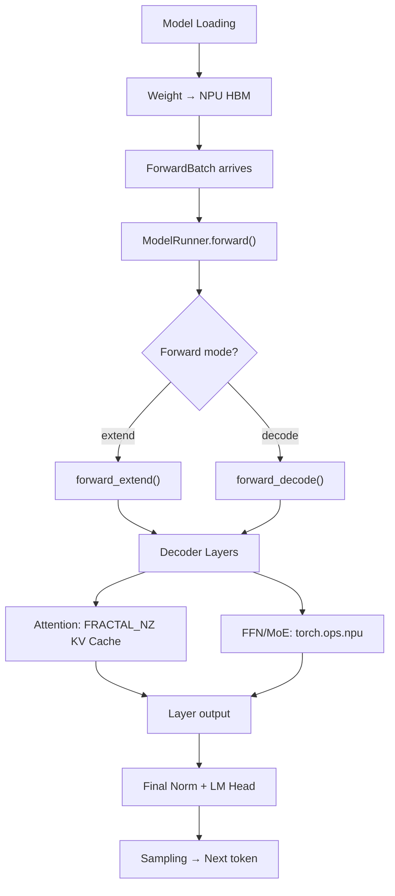
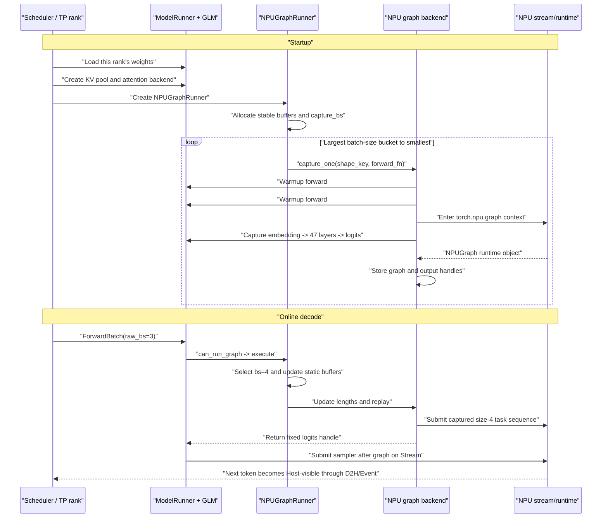

# GLM-4.7-Flash: End-to-End Model Execution on Ascend NPU

## 1. Model Overview

GLM-4.7-Flash is used as a concrete example to trace the complete model execution path on Ascend NPU, from model loading through attention to output.

## 2. Execution Path



## 3. Key Architecture Points

GLM-4.7-Flash architecture hits several NPU-specific paths:
- **Attention**: Uses Ascend backend with FRACTAL_NZ KV layout
- **RoPE**: Applied with NPU-specific implementation
- **RMSNorm**: Uses fused NPU norm kernels
- **FFN**: Uses `torch.ops.npu` for optimized matmul

## 4. Shape Flow

```text
Input: [B, S] token IDs
Embedding: [B, S, H]
Per layer:
  RMSNorm → [B, S, H]
  Attention → [B, S, H] (reads/writes FRACTAL_NZ KV Cache)
  RMSNorm → [B, S, H]
  FFN → [B, S, H]
Final RMSNorm → [B, S, H]
LM Head → [B, S, V] (or [B, V] for decode)
```

## 5. Architecture Diagram

See `assets/glm-4.7-flash-architecture.svg` for the detailed model architecture visualization.

## 6. Source Files

- Model definition: `python/sglang/srt/models/glm4_moe_lite.py`
- Attention: `python/sglang/srt/layers/attention/ascend/`
- Model loading: `python/sglang/srt/model_executor/model_runner.py`

## 7. One GLM-4.7-Flash Decode Graph, End to End

The main path below assumes that `torch.compile` is **not additionally enabled**, so NPUGraph capture/replay can be studied on its own. If both features are enabled, NPUGraph records the device-task submissions produced by the compiled program; the compiled program graph and the launch graph remain two different objects, as Section 7.4 explains.

### 7.1 “CUDA Graph” Is a Compatibility Name on NPU

SGLang retains cross-platform names such as:

```text
--disable-cuda-graph
cuda_graph_config
init_cuda_graphs()
decode_cuda_graph_runner
DecodeCudaGraphRunner
```

On Ascend, these names do not mean that NVIDIA CUDA runs on the device. The NPU subclass creates:

```python
graph = torch.npu.NPUGraph()

with torch.npu.graph(
    graph,
    pool=pool,
    stream=stream,
    auto_dispatch_capture=True,
):
    output = forward_fn()
```

`CudaGraphRunner` is the historical/common SGLang interface name; `torch.npu.NPUGraph` is the actual torch_npu/CANN mechanism.

The default path also does not load a serialized whole-model graph file from the checkpoint directory. Each Scheduler/TP-rank process captures runtime graph objects at startup using its local GLM weights, KV pool, static buffers, and NPU Stream. Individual kernel binaries may come from compilation caches, but that is different from loading a complete SGLang decode graph from disk.

### 7.2 Startup Order

[`Scheduler.init_model_worker()`](https://github.com/sgl-project/sglang/blob/9a03bebf13996b628f8335628a691dcb3aa8400b/python/sglang/srt/managers/scheduler.py#L901-L921) performs the important stages in this order:

```text
create TpModelWorker / ModelRunner
  -> construct GLM and load this TP rank's weights
allocate request and paged MLA KV pools
initialize Ascend attention backend
initialize graph runners
  -> warm up and capture NPU graphs
finish service initialization
  -> accept online requests
```

With TP=4, each rank captures its own graph objects. There is no central graph copied to four NPUs: each graph binds local weight, buffer, KV-pool, and Stream addresses.

[`capture_cuda_graphs()`](https://github.com/sgl-project/sglang/blob/9a03bebf13996b628f8335628a691dcb3aa8400b/python/sglang/srt/model_executor/model_runner_components/cuda_graph_setup.py#L73-L130) builds shared output storage, an eager runner, an optional prefill runner, and a decode runner. [`capture_decode_graph()`](https://github.com/sgl-project/sglang/blob/9a03bebf13996b628f8335628a691dcb3aa8400b/python/sglang/srt/model_executor/model_runner_components/cuda_graph_setup.py#L285-L365) selects `NPUGraphRunner` when the device is NPU.

### 7.3 Batch-Size Buckets and Stable Storage

For ordinary non-speculative decode:

```text
capture_forward_mode = DECODE
captured_req_width = 1 token per request
capture_bs = a discrete list such as [1, 2, 4, 8]
```

Here `bs` means **batch size**. The same integer is also the key of a batch-size bucket. A live batch of three requests can be padded to captured batch size four and use the size-4 graph.

[`DecodeCudaGraphRunner.__init__()`](https://github.com/sgl-project/sglang/blob/9a03bebf13996b628f8335628a691dcb3aa8400b/python/sglang/srt/model_executor/runner/decode_cuda_graph_runner.py#L191-L411) initializes maximum-size attention graph state and creates stable storage for:

```text
input_ids, positions, req_pool_indices
seq_lens, out_cache_loc
block tables and attention metadata
logits/output storage
sampling and parallel metadata
```

Capture and replay may change values inside this storage, but the addresses bound into a graph must remain stable.

### 7.4 Warmup Is Not Capture

For every captured shape, [`NPUCudaGraphBackend.capture_one()`](https://github.com/sgl-project/sglang/blob/9a03bebf13996b628f8335628a691dcb3aa8400b/python/sglang/srt/hardware_backend/npu/graph_runner/npu_cudagraph_backend.py#L78-L134) first executes two ordinary forwards:

```python
for _ in range(2):
    device.synchronize()
    tp_group.barrier()
    forward_fn()  # ordinary execution, outside graph capture
```

These runs pay lazy kernel, runtime, workspace, allocator, communication, JIT, or optional `torch.compile` setup before capture. They execute Device computation but do not save that execution as the graph.

The backend then creates `torch.npu.NPUGraph` and executes the same `forward_fn()` inside `torch.npu.graph(...)`. That third execution records the capturable NPU task sequence and stable-address contract:

```python
self._graphs[shape_key] = graph
self._outputs[shape_key] = out
```

The runner captures buckets from largest to smallest, for example `8 -> 4 -> 2 -> 1`, so smaller graphs can reuse the memory pool established by larger captures.

If a bucket belongs to `compile_bs`, `model.forward` is first wrapped with:

```python
torch.compile(
    torch.no_grad()(model.forward),
    fullgraph=True,
    dynamic=False,
    backend="npugraph_ex",
)
```

The `torch.compile` program representation and `torch.npu.NPUGraph` launch graph are different layers. They can be used together but are not the same graph.

### 7.5 What the Capture Forward Runs Through

For a captured batch size of four, [`capture_one_shape()`](https://github.com/sgl-project/sglang/blob/9a03bebf13996b628f8335628a691dcb3aa8400b/python/sglang/srt/model_executor/runner/decode_cuda_graph_runner.py#L913-L1011) builds a dummy but address-real `ForwardBatch`:

```text
forward_mode       DECODE
batch_size         4
input_ids          [4]
positions          [4]
seq_lens           [4]
out_cache_loc      [4]
```

Its `run_once()` calls:

```python
out = forward(
    forward_batch.input_ids,
    forward_batch.positions,
    forward_batch,
)
```

For GLM-4.7-Flash, the real call path is:

```text
Glm4MoeLiteForCausalLM.forward
  -> Glm4MoeLiteModel.forward
     -> embedding
     -> 47 x Glm4MoeLiteDecoderLayer
        -> RMSNorm
        -> DeepseekV2AttentionMLA
           -> Q/KV projections and RoPE
           -> paged latent-KV write
           -> graph-compatible Ascend FIA attention
           -> absorbed value projection and o_proj
        -> sparse MoE or dense MLP
        -> residual
     -> final RMSNorm
  -> LogitsProcessor and TP vocabulary projection/gather
```

Start from [`Glm4MoeLiteForCausalLM.forward()`](https://github.com/sgl-project/sglang/blob/9a03bebf13996b628f8335628a691dcb3aa8400b/python/sglang/srt/models/glm4_moe_lite.py#L968-L1000). The Python layer loop executes during capture; replay later submits the resulting Device task sequence rather than rerunning that Python loop.

For TP=4, one rank has five real local Q heads. The graph attention path pads them to eight supported heads, runs FIA against the paged latent cache, and slices the result back to five heads before the output projection.

### 7.6 A Real Decode Replay

After prefill has populated the paged MLA KV cache, suppose three requests enter one decode step:

```text
raw_bs = 3
selected captured bs = 4

input_ids = [token_A, token_B, token_C]
positions = [10, 25, 7]
seq_lens = [11, 26, 8]
out_cache_loc = [slot_A, slot_B, slot_C]
```

[`ModelRunner._forward_raw()`](https://github.com/sgl-project/sglang/blob/9a03bebf13996b628f8335628a691dcb3aa8400b/python/sglang/srt/model_executor/model_runner.py#L1479-L1517) checks that the forward mode permits graph execution, a decode runner exists, and the live batch maps to a captured `ShapeKey`.

The runner then:

```text
selects the size-4 graph
copies live tensor values into size-4 static storage
pads the fourth slot safely
prepares current block tables and attention metadata
updates actual_seq_lengths_kv to [11, 26, 8, 0]
replays the captured size-4 NPUGraph
slices output back to the first three valid rows
```

The current MLA call is structurally:

```python
output = self.backend.replay_with_input_update(
    graph_key,
    seq_lens=seq_lens,
    attr_name=self._get_update_attr_name(),
    attr_type=self._get_update_attr_type(),
)
```

For the GLM MLA path, `attr_name` resolves to `actual_seq_lengths_kv`, the Host-side keyword used by the torch_npu fused infer attention operator to describe the real KV sequence length. Here `attr_type` is neither the Python `list` type nor a `torch.dtype`; the current code uses the empty list `[]` as a convention marker meaning that this attribute should stay as a regular Host list. The backend therefore keeps `seq_lens` as `list[int]` and assembles the following `cpu_update_input` before replay:

```python
cpu_update_input = [
    {"actual_seq_lengths_kv": [11, 26, 8, 0]}
]
```

Device tensors such as IDs, positions, and cache locations change by writing stable buffers. The attention length is additionally a captured Host operator keyword, so torch_npu `NPUGraph.update(...)` patches the recorded FIA task before replay.

`graph.replay()` may return a fixed output tensor handle before every Device task has completed. This is safe because the handle names storage; it does not synchronously read its elements. A sampler submitted later on the ordered Stream consumes logits after graph writes, and Host visibility is established later through D2H copy/Event/synchronization.

### 7.7 Complete Timeline



The companion NPU Graph chapter contains the deeper `NPUGraph.update`, ExternalEvent, update-Stream, and output-lifetime analysis: [`05-npu-graph-and-compilation.md`](../05-npu-graph-and-compilation.md).
