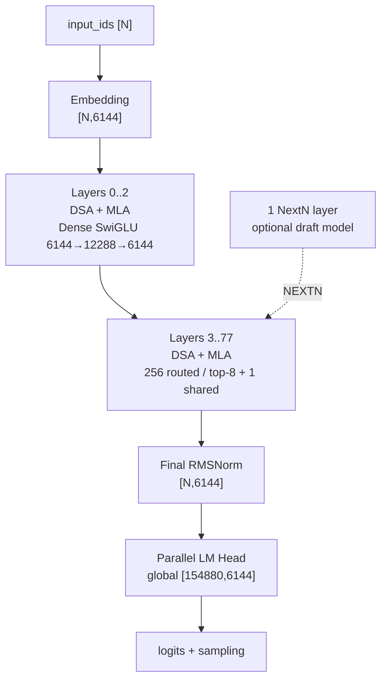
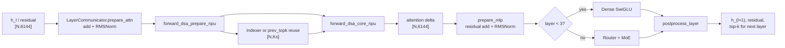
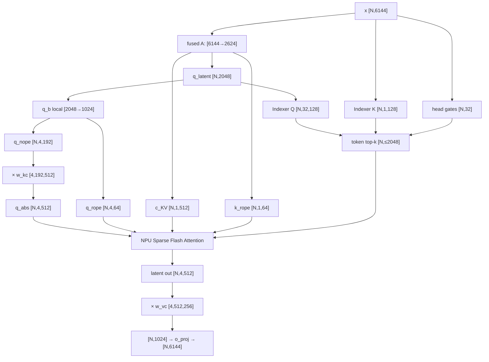
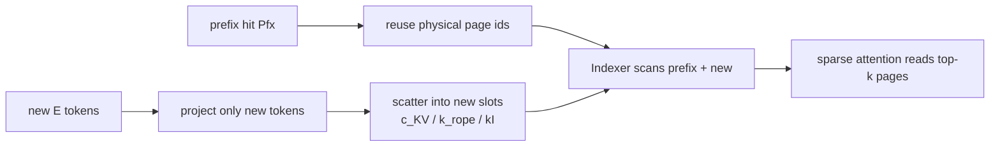
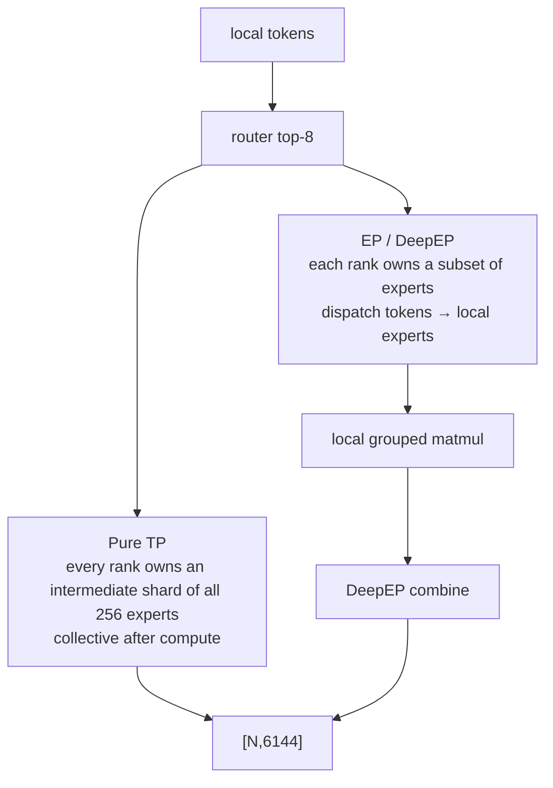
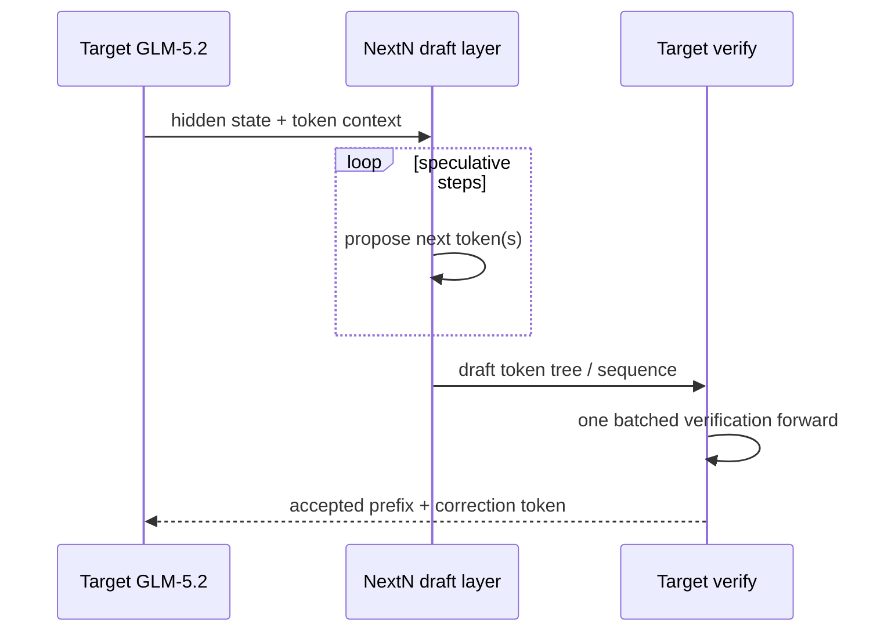
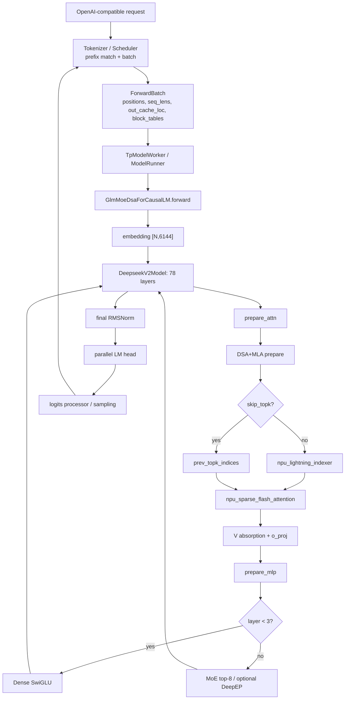

# End-to-End Example: GLM-5.2 on SGLang Ascend NPU

[简体中文](../../../../zh/sglang-ascend-npu/source-code-walkthrough/examples/02-glm-5.2-end-to-end.md) | **English**

This chapter follows the reading method of the [GLM-4.7-Flash end-to-end example](./00-glm-4.7-flash-end-to-end.md), but does not repeat the generic HTTP, Scheduler, `ModelRunner`, logits, and sampling framework. It focuses on the model-specific questions introduced by GLM-5.2:

- Why the 753B, 78-layer `GlmMoeDsaForCausalLM` is implemented primarily in `deepseek_v2.py`.
- How MLA absorbs ordinary per-head K/V computation into a 512-dimensional latent space.
- How the DSA Indexer selects the top 2,048 historical tokens.
- How IndexShare reuses attention token indices across layers, rather than MoE expert indices.
- How Prefill, Decode, Prefix Cache, NPU Graph, and NextN carry three cache components.
- How 256 routed experts, top-8 routing, and one shared expert execute under TP and EP.

> This chapter follows the repository's current source snapshot. The model config, SGLang, and `torch_npu` evolve quickly, so pin every revision before deployment. Old shape comments in source, such as `7168`, `1536`, or 64 Indexer heads, are not the source of truth for GLM-5.2.

---

## 1. Baseline, sources, and prerequisites

### 1.1 Do not mix the teaching and deployment baselines

The chapter first uses a logical baseline so every shape can be calculated by hand:

| Item | Teaching baseline |
|---|---|
| checkpoint | `zai-org/GLM-5.2` BF16 |
| device | Ascend NPU |
| parallelism | TP=16, PP=1; no separate EP/DP initially |
| attention backend | `ascend` |
| execution | eager; NPU Graph initially disabled |
| request | one request, no prefix hit; Prefill followed by token-by-token Decode |
| speculative decoding | disabled first; NextN covered separately |
| page size | NPU default 128; confirm the actual launch argument |

This is not a capacity recommendation. The official deployment material lists approximately 1.51 TB of BF16 weights. Production usually needs more devices or a ModelSlim W8A8 checkpoint with DeepEP and DP/EP. The teaching baseline exists only to answer, “What matrix shape lives on one TP rank?”

A debugging launch skeleton is:

```bash
sglang serve \
  --model-path /path/to/GLM-5.2 \
  --device npu \
  --tp-size 16 \
  --attention-backend ascend \
  --sampling-backend ascend \
  --disable-cuda-graph \
  --host 0.0.0.0 \
  --port 8000
```

`--disable-cuda-graph` is a historical cross-platform name. On NPU, it prevents entry into `NPUGraphRunner` replay while tracing eager execution.

### 1.2 External sources and version record

- [Official GLM-5.2 model card](https://huggingface.co/zai-org/GLM-5.2)
- [Official GLM-5.2 config.json](https://huggingface.co/zai-org/GLM-5.2/blob/main/config.json)
- [SGLang GLM-5.2 cookbook](https://github.com/sgl-project/sglang/blob/main/docs/cookbook/autoregressive/GLM/GLM-5.2.mdx)
- [SGLang Ascend GLM-5.2 deployment guide](https://github.com/sgl-project/sglang/blob/main/docs/docs/hardware-platforms/ascend-npus/model-deployment/tutorials/glm_5_2.mdx)
- [IndexCache / IndexShare paper](https://arxiv.org/abs/2603.12201)

Record the following for every reproduction:

```text
SGLang commit:
sgl-kernel-npu commit:
GLM-5.2 revision:
torch / torch_npu / CANN version:
NPU model, node count, and rank topology:
Full launch arguments:
```

### 1.3 Existing tutorials used as prerequisites

The following concepts are indexed instead of re-derived from scratch. This chapter adds GLM-5.2-specific shapes and source locations:

| Concept | Read first |
|---|---|
| Decoder-only models and causal masks | [Decoder-only Transformer](../../../ai-infra-basic/Model_Architecture/01-decoder-only-transformer.md) |
| MLA low-rank compression and absorption | [Multi-Head Latent Attention](../../../ai-infra-basic/Model_Architecture/04-multi-head-latent-attention.md) |
| DSA mathematics and complexity | [DeepSeek Sparse Attention](../../../ai-infra-basic/Model_Architecture/07-deepseek-sparse-attention.md) |
| Sparse MoE routing | [Sparse MoE Routing](../../../ai-infra-basic/Model_Architecture/03-sparse-moe-routing.md) |
| W8A8/FP8 and quantization debugging | [Quantization](../../../ai-infra-basic/Quantization/README.md) |
| Speculative decoding | [Speculative Decoding](../../../ai-infra-basic/Speculative_Decoding/README.md) |
| NPU Graph | [NPU Graph and compilation](../05-npu-graph-and-compilation.md) |
| TP/HCCL | [Distributed HCCL and communication](../15-distributed-hccl-and-communication.md) |

---

## 2. GLM-5.2 configuration fingerprint

### 2.1 Fields that determine the execution path

| Field | Value | Runtime consequence |
|---|---:|---|
| `architectures` | `GlmMoeDsaForCausalLM` | Native SGLang entry class |
| `dtype` | `bfloat16` | Primary dtype of the original checkpoint |
| `vocab_size` | 154880 | Global embedding / LM-head rows |
| `hidden_size` | 6144 | Backbone hidden width |
| `num_hidden_layers` | 78 | Number of target decoder layers |
| `first_k_dense_replace` | 3 | Layers 0-2 use a dense MLP |
| `intermediate_size` | 12288 | Dense MLP intermediate width |
| `n_routed_experts` | 256 | Routed experts per MoE layer |
| `n_shared_experts` | 1 | Always-executed shared expert per MoE layer |
| `moe_intermediate_size` | 2048 | Intermediate width of one expert |
| `num_experts_per_tok` | 8 | Routed experts selected by each token |
| `scoring_func` | `sigmoid` | Router score nonlinearity |
| `topk_method` | `noaux_tc` | Correction-bias grouped top-k path |
| `norm_topk_prob` | `true` | Normalize selected routing weights |
| `routed_scaling_factor` | 2.5 | Scale the routed-expert result |
| `num_attention_heads` | 64 | Global query heads |
| `q_lora_rank` | 2048 | Query latent dimension |
| `kv_lora_rank` | 512 | KV latent/cache width |
| `qk_nope_head_dim` | 192 | Non-RoPE dimension per head |
| `qk_rope_head_dim` | 64 | RoPE dimension per head |
| `v_head_dim` | 256 | Value dimension per head |
| `index_n_heads` | 32 | DSA Indexer query heads |
| `index_head_dim` | 128 | Dimension of each Indexer head |
| `index_topk` | 2048 | Maximum historical tokens read per main-attention query |
| `index_topk_freq` | 4 | Cross-layer reuse period in the current SGLang implementation |
| `max_position_embeddings` | 1048576 | Configured 1M-token limit |
| `rope_theta` | 8000000 | RoPE base |
| `num_nextn_predict_layers` | 1 | NextN/MTP layers in the checkpoint |

Never confuse the two top-k operations:

```text
DSA token top-k:  select 2,048 historical positions along the sequence axis
MoE expert top-k: select 8 of 256 routed experts along the expert axis
```

The former changes which KV rows attention reads. The latter changes which FFN experts receive a token.

### 2.2 Notation

| Symbol | Value | Meaning |
|---|---:|---|
| `N` | runtime | Token rows in this call: `T` for Prefill, `B` for ordinary Decode |
| `D` | 6144 | Hidden size |
| `L` | 78 | Decoder layers |
| `H` | 64 | Global attention heads |
| `TP` | 16 | Teaching TP size |
| `Htp` | 4 | Heads per TP rank, `64 / 16` |
| `Rq` | 2048 | Query LoRA rank |
| `Rkv` | 512 | KV LoRA rank |
| `Dn` | 192 | NoPE head dimension |
| `Dr` | 64 | RoPE head dimension |
| `Dh` | 256 | `Dn + Dr` |
| `Hi` | 32 | Replicated Indexer heads; not divided into two by TP=16 |
| `Di` | 128 | Indexer head dimension |
| `Ks` | 2048 | DSA historical-token limit |
| `E` | 256 | Routed experts |
| `Ke` | 8 | Routed experts per token |
| `Ie` | 2048 | Expert intermediate width |
| `P` | 128 | NPU page size in this chapter |

PyTorch stores `Linear` weights as `[out_features, in_features]`, so `[N,in] @ W.T -> [N,out]`.

### 2.3 Architecture at a glance



Every target layer follows:

$$
u_l = h_l + \operatorname{DSA\_MLA}(\operatorname{RMSNorm}(h_l))
$$

$$
h_{l+1} = u_l +
\begin{cases}
\operatorname{DenseSwiGLU}(\operatorname{RMSNorm}(u_l)), & l<3 \\
\operatorname{SparseMoE}(\operatorname{RMSNorm}(u_l)), & l\ge 3
\end{cases}
$$

The backbone input, attention delta, MoE delta, and layer output always have shape `[N,6144]`. Shape changes occur inside the submodules.

---

## 3. Source entry: a GLM name with a DeepSeekV2 implementation

### 3.1 Shortest inheritance chain

```text
config.architectures[0] = GlmMoeDsaForCausalLM
  -> model registry finds models/glm4_moe.py
  -> GlmMoeDsaForCausalLM(DeepseekV2ForCausalLM)
  -> DeepseekV2ForCausalLM.model = DeepseekV2Model
  -> DeepseekV2Model.layers[i] = DeepseekV2DecoderLayer
  -> DeepseekV2DecoderLayer.self_attn = DeepseekV2AttentionMLA(use_dsa=True)
```

`GlmMoeDsaForCausalLM` only overrides the architecture-name check for shared-expert fusion. The structure, forward pass, and weight loader come from its parent. Failing to find a `glm5.py` file is therefore not a registration error.

### 3.2 Source map

| Question | File / key symbol |
|---|---|
| GLM entry | [`models/glm4_moe.py::GlmMoeDsaForCausalLM`](../../../../../python/sglang/srt/models/glm4_moe.py) |
| Target model | [`models/deepseek_v2.py::DeepseekV2ForCausalLM`](../../../../../python/sglang/srt/models/deepseek_v2.py) |
| 78-layer loop | `DeepseekV2Model.forward` |
| One decoder layer | `DeepseekV2DecoderLayer.forward` |
| MLA / DSA initialization | `DeepseekV2AttentionMLA.__init__` |
| Indexer | [`layers/attention/dsa/dsa_indexer.py::Indexer`](../../../../../python/sglang/srt/layers/attention/dsa/dsa_indexer.py) |
| NPU DSA prepare/core | [`deepseek_v2_attention_mla_npu.py`](../../../../../python/sglang/srt/hardware_backend/npu/modules/deepseek_v2_attention_mla_npu.py) |
| Ascend sparse attention | [`ascend_backend.py::forward_sparse`](../../../../../python/sglang/srt/hardware_backend/npu/attention/ascend_backend.py) |
| MLA + Index-K cache | [`memory_pool_npu.py::NPUMLATokenToKVPool`](../../../../../python/sglang/srt/hardware_backend/npu/memory_pool_npu.py) |
| Weight rearrangement | [`deepseek_weight_loader.py`](../../../../../python/sglang/srt/models/deepseek_common/deepseek_weight_loader.py) |
| NextN class rewrite | [`configs/model_config.py::_config_draft_model`](../../../../../python/sglang/srt/configs/model_config.py) |

The generic registration mechanism is covered by [model loading and architecture resolution](../../../tp-worker-model-runner/06-model-loading-and-architecture-resolution.md).

### 3.3 The extra value carried between layers

Dense attention normally carries only `hidden_states` and a lazy residual. GLM-5.2 also carries attention `topk_indices`:

```python
topk_indices = None
for layer in self.layers:
    hidden_states, residual, topk_indices = layer(
        ...,
        prev_topk_indices=topk_indices,
    )
```

It is non-null only while IndexShare needs cross-layer reuse. It is not a hidden state and never participates in the residual addition.

---

## 4. Weight loading: checkpoint shapes to execution shapes

### 4.1 MLA A projections are fused

Logical checkpoint weights:

```text
q_a_proj.weight:             [2048,6144]
kv_a_proj_with_mqa.weight:   [512+64,6144] = [576,6144]
```

The loader concatenates them along the output dimension into one replicated parameter:

```text
fused_qkv_a_proj_with_mqa.weight: [2624,6144]
2624 = Rq + Rkv + Dr = 2048 + 512 + 64
```

One GEMM produces `[N,2624]`, then splits it into `[N,2048]` and `[N,576]`. “Fused” here means fused weights and GEMM; q/k/v are not yet ordinary multi-head tensors.

### 4.2 B projections are sharded by attention TP

| Parameter | Global shape | TP=16 local shape | Sharded axis |
|---|---:|---:|---|
| `q_b_proj.weight` | `[64×256,2048]=[16384,2048]` | `[1024,2048]` | output / heads |
| `kv_b_proj.weight` | `[64×(192+256),512]=[28672,512]` | `[1792,512]` | output / heads |
| `o_proj.weight` | `[6144,64×256]=[6144,16384]` | `[6144,1024]` | input / heads |

`q_b_proj` remains directly executable. After loading, `kv_b_proj` is rearranged into absorption matrices for each local head:

```text
w_kc: [Htp,Dn,Rkv] = [4,192,512]
w_vc: [Htp,Rkv,Dv] = [4,512,256]
```

The first absorbs Q-noPE into latent space. The second restores the attention result to value space.

### 4.3 Indexer weights are replicated

| Parameter | Shape | Purpose |
|---|---:|---|
| `indexer.wq_b.weight` | `[32×128,2048]=[4096,2048]` | Query latent to 32 retrieval heads |
| `indexer.wk.weight` | `[128,6144]` | Hidden state to one shared Index K |
| `indexer.weights_proj.weight` | `[32,6144]` | Per-token head gates |
| `indexer.k_norm.weight/bias` | `[128]` | Index-K LayerNorm |

The 32 Indexer heads are not the 64 main-attention heads and must not be divided by TP=16. `ReplicatedLinear` gives every attention rank a consistent retrieval candidate set.

### 4.4 MoE weights: logical first, physical second

The logical weights of one expert are:

```text
gate_proj / up_proj: [2048,6144]
down_proj:           [6144,2048]
```

The loader packs gate and up. Under ordinary TP=16, the intermediate width becomes `2048/16=128`:

```text
packed w13 logical local: [256,2×128,6144]
packed w2  logical local: [256,6144,128]
```

The NPU grouped-matmul path may transpose these into its physical layout. EP, W8A8, and fused shared experts further change the local expert count and dtype. Debug the mathematical axes first, then inspect the `weight_loader` and quant method's actual layout.

---

## 5. Real execution order inside one decoder layer



`LayerCommunicator` centralizes residual additions, RMSNorm, and TP-collective timing. Source may therefore not contain two literal textbook statements of `x = x + f(x)`. The semantics are unchanged, while the physical path may use `npu_add_rms_norm` or collective fusion to reduce HBM traffic.

### 5.1 Dense SwiGLU shapes in Layers 0-2

The first three layers have no routed experts, but their FFNs still contain two upward-projection branches. For $x\in\mathbb R^{N\times6144}$:

$$
g=xW_g^T,\quad u=xW_u^T,\quad
y=\left(\operatorname{SiLU}(g)\odot u\right)W_d^T.
$$

Global and TP=16 local shapes are:

```text
each gate/up weight global  [12288,6144]
each gate/up weight local   [768,6144]
packed gate_up local        [1536,6144]
x                            [N,6144]
gate, up local               [N,768]
SwiGLU local                 [N,768]
down weight local            [6144,768]
down partial                 [N,6144]
TP all-reduce / fused reduce [N,6144]
```

`12288` is the dense-MLP intermediate width. It is not the `2048` intermediate width of one expert in the remaining 75 MoE layers. Mixing them breaks both weight-loading and grouped-matmul shapes.

---

## 6. DSA+MLA prepare: every Q, KV, and RoPE tensor

Here `N` covers both `T` packed Prefill rows and `B` ordinary Decode rows.

### 6.1 Fused A projection and normalization

```text
x                                  [N,6144]
  @ fused_A.T [6144,2624]
fused                              [N,2624]
  split [2048,512+64]
q_latent_raw                       [N,2048]
latent_cache_raw                   [N,576]

q_latent = RMSNorm(q_latent_raw)   [N,2048]
kv_latent = RMSNorm(first 512)     [N,1,512]
k_rope_raw = last 64               [N,1,64]
```

`q_latent` has two semantic consumers: main attention's `q_b_proj` and the DSA Indexer's `wq_b`. A source-level `clone()` protects overlap and buffer lifetime; it does not change the mathematical value.

### 6.2 Query B projection and head split

```text
q_latent [N,2048]
  @ q_b_local.T [2048,1024]
q_flat_local                       [N,1024]
view                               [N,4,256]
split last dim [192,64]
q_nope                             [N,4,192]
q_pe_raw                           [N,4,64]
```

RoPE applies only to `q_pe_raw` and `k_rope_raw`:

$$
q^{R}_{t,h}=R(t)q^{R,raw}_{t,h},\qquad
k^{R}_{t}=R(t)k^{R,raw}_{t}.
$$

The outputs remain `[N,4,64]` and `[N,1,64]`. `rope_interleave=true` changes the even/odd arrangement, not the total shape.

### 6.3 K absorption: why Query changes from 192 to 512

Ordinary attention uses the noPE score:

$$
s^{nope}_{t,s,h}=q^{nope}_{t,h}(k^{nope}_{s,h})^T.
$$

MLA expresses an ordinary key through a latent and B projection:

$$
k^{nope}_{s,h}=c^{KV}_s(W^{K}_{h})^T,
\quad c^{KV}_s\in\mathbb{R}^{512},
\quad W^{K}_{h}\in\mathbb{R}^{192\times512}.
$$

Associativity gives:

$$
q^{nope}_{t,h}(k^{nope}_{s,h})^T
=\left(q^{nope}_{t,h}W^{K}_{h}\right)(c^{KV}_s)^T.
$$

The source therefore computes:

```text
q_nope [N,4,192]
  bmm w_kc [4,192,512]
q_abs  [N,4,512]
```

`q_abs` attends directly to historical `kv_latent [S,1,512]`. Historical `[S,4,192]` ordinary keys never need to be materialized.

### 6.4 V absorption happens after attention

If an ordinary value is:

$$
v_{s,h}=c^{KV}_sW^V_h,
\quad W^V_h\in\mathbb{R}^{512\times256},
$$

then:

$$
\sum_s p_{t,s,h}v_{s,h}
=\left(\sum_s p_{t,s,h}c^{KV}_s\right)W^V_h.
$$

Sparse attention first returns `[N,4,512]`, followed by:

```text
latent attention out [N,4,512]
  bmm w_vc           [4,512,256]
value-space out      [N,4,256]
flatten              [N,1024]
  @ o_proj_local.T   [1024,6144]
attention delta      [N,6144]
```

This is absorbed MLA: `W^K` moves to the query side, `W^V` moves to the output side, and cache permanently stores only the 512-dimensional latent plus the 64-dimensional RoPE key.

### 6.5 Complete shape graph



---

## 7. DSA Indexer: computing the top 2,048

### 7.1 Three projections

For query token `t`:

```text
q_latent [N,2048] @ wq_b.T [2048,4096]
  -> qI [N,32,128]

x [N,6144] @ wk.T [6144,128]
  -> kI [N,128] -> LayerNorm -> [N,128]

x [N,6144] @ weights_proj.T [6144,32]
  -> g [N,32]
```

Indexer Q has 32 heads; K is shared across heads. The first 64 dimensions of Q/K receive RoPE and the remaining 64 are noPE. Backends may then apply an equivalent rotation or quantization to fit the kernel.

### 7.2 Relevance score

For historical position `s≤t`, compute the dot product for each Indexer head:

$$
a_{t,s,j}=\langle q^I_{t,j},k^I_s\rangle,
\qquad j=1,\ldots,32.
$$

Aggregate with query-dependent head gates:

$$
I_{t,s}=\sum_{j=1}^{32}g_{t,j}\operatorname{ReLU}(a_{t,s,j}).
$$

Apply causal validity and top-k:

$$
\mathcal S_t=\operatorname{TopK}_{s\le t}(I_{t,s},K_s),
\qquad K_s=\min(2048,t+1).
$$

Conceptually, `I` is `[T,S]` for one-sequence Prefill and `[B,S]` for Decode. The NPU kernel can scan in blocks and does not need to persist the entire `[T,S]` matrix in HBM.

### 7.3 Ascend operator contract

`Indexer.forward_npu()` performs projection, RoPE, and Index-K cache storage, then calls:

```python
torch_npu.npu_lightning_indexer(
    query=...,             # [N,32,128]
    key=...,               # paged Index-K cache
    weights=...,           # [N,32]
    actual_seq_lengths_query=...,
    actual_seq_lengths_key=...,
    block_table=...,
    layout_query="TND",
    layout_key="PA_BSND",
    sparse_count=2048,
    sparse_mode=3,
)
```

It returns position indices directly consumable by sparse attention, commonly with logical shape `[N,2048]`. Short sequences, padding, CP, and speculative modes use metadata to mark the valid count; not every physical entry must be valid.

`TND` is a packed token-major query layout. `PA_BSND` is paged KV layout. `block_table [B,max_pages]` maps a request's logical pages to physical cache-pool pages.

---

## 8. IndexShare: what is actually shared across layers

### 8.1 Core idea

Adjacent Indexers often select highly overlapping token sets. A Full layer computes `topk_indices`; subsequent Shared layers reuse this position table:

```mermaid
sequenceDiagram
  participant L1 as Full layer
  participant IDX as npu_lightning_indexer
  participant L2 as Shared layer
  participant L3 as Shared layer
  participant L4 as Shared layer
  L1->>IDX: qI, paged kI, gates
  IDX-->>L1: topk_indices [N,2048]
  L1-->>L2: carry topk_indices
  L2->>L2: skip Indexer; run its own sparse MLA
  L2-->>L3: carry the same indices
  L3-->>L4: carry the same indices
  Note over L1,L4: Every layer still has distinct Q/K/V and attention weights; only positions are shared
```

Only integer positions are shared. Every Shared layer still:

- computes its own Q, latent KV, and RoPE;
- writes its own MLA cache;
- reads the selected positions with its own attention parameters;
- executes its own dense MLP or MoE.

### 8.2 Control logic in this SGLang snapshot

`DeepseekV2AttentionMLA.__init__` first checks optional `index_topk_pattern`. Without it, `index_topk_freq=4` gives:

```python
skip_topk = max(layer_id - 1, 0) % 4 != 0
next_skip_topk = layer_id % 4 != 0
```

Substituting the first few layer ids reveals the actual cadence in this implementation:

| layer | `skip_topk` | `next_skip_topk` | Behavior |
|---:|---:|---:|---|
| 0 | false | false | Compute once, but do not pass to layer 1 |
| 1 | false | true | Full: compute and pass to the next layer |
| 2 | true | true | Shared: reuse and keep passing |
| 3 | true | true | Shared: reuse and keep passing |
| 4 | true | false | Shared: reuse and end this group |
| 5 | false | true | Next Full layer; then repeat every four layers |

The current formula therefore makes layer 0 an independent computation, followed by Full layers `1,5,9,...,77` with up to three Shared layers between them. This conclusion comes from the repository's executed code and should not be overwritten by a diagram from another revision.

The layer-forward protocol is:

```text
skip_topk = false: topk = self.indexer(...)
skip_topk = true:  topk = prev_topk_indices

next_skip_topk = true:  return (output, topk)
next_skip_topk = false: return (output, None)
```

The official config also contains descriptive fields such as `indexer_types` and `index_skip_topk_offset`, but this repository snapshot's main execution branch uses `index_topk_freq` / `index_topk_pattern`. Search for consumers again when reading a newer revision instead of treating config comments as executed code.

### 8.3 What it reduces—and what it does not

If only one of every four layers executes an Indexer, the number of Indexer executions falls approximately from `L` to `L/4`. IndexShare does not:

- reduce every main attention from top-2,048 to one quarter of that;
- reuse layer-specific MLA KV tensors;
- reuse MoE top-8 expert ids;
- stop sequence cache from growing linearly with context length.

---

## 9. Sparse MLA core: feeding top-k into main attention

`AscendAttnBackend.forward_sparse()` writes current-token cache rows to physical pages, then calls:

```python
torch_npu.npu_sparse_flash_attention(
    query=q_abs,                 # [N,Htp,512]
    key=kv_latent_cache,         # paged [...,1,512]
    value=kv_latent_cache,       # same latent as key
    query_rope=q_pe,             # [N,Htp,64]
    key_rope=k_rope_cache,       # paged [...,1,64]
    sparse_indices=topk_indices, # [N,≤2048]
    block_table=block_table,
    sparse_block_size=1,
    layout_query="TND",
    layout_kv="PA_BSND",
    sparse_mode=3,
    attention_mode=2,
)
```

For head `h` and selected position `s∈S_t`, the score is:

$$
z_{t,s,h}=\frac{
\langle q^{abs}_{t,h},c^{KV}_s\rangle+
\langle q^R_{t,h},k^R_s\rangle
}{\sqrt{256}}.
$$

Softmax normalizes only over the valid sparse set:

$$
p_{t,s,h}=\frac{e^{z_{t,s,h}}}
{\sum_{u\in\mathcal S_t}e^{z_{t,u,h}}},
\quad s\in\mathcal S_t.
$$

The output is a latent weighted sum:

$$
o^{latent}_{t,h}=\sum_{s\in\mathcal S_t}p_{t,s,h}c^{KV}_s
\in\mathbb R^{512}.
$$

Section 6.4 then restores `[N,4,256]` through `w_vc`. The scale uses complete Q/K head dimension `Dh=192+64=256`, not latent dimension `Rkv=512`.

---

## 10. Prefill: no preliminary dense MHA path

In the tutorial snapshot, GLM-4.7-Flash uses MHA_NPU for pure Prefill and absorbed MLA_NPU for Decode. GLM-5.2 instead uses the common DSA+MLA absorption path for both Prefill and Decode.

### 10.1 Packed-batch shapes

For two requests:

```text
request A: prefix=0,    extend=3000
request B: prefix=1000, extend=2000

T = 3000 + 2000 = 5000
hidden_states                  [5000,6144]
positions                      [5000]
extend_seq_lens                [2] = [3000,2000]
seq_lens                       [2] = [3000,3000]
out_cache_loc                  [5000]
block_tables                   [2,max_pages]
```

Tokens are packed, not represented as a dense `[B,S,D]` rectangle. `actual_seq_lengths_query`, `actual_seq_lengths_kv`, and block tables restore request boundaries.

### 10.2 Prefill order in a Full layer

```text
1. [T,6144] -> fused A -> q_latent / kv_latent / k_rope
2. q_latent -> query heads -> q_abs; RoPE(q_pe,k_pe)
3. [T,6144] -> Indexer K [T,128], then write paged Index-K cache
4. Lightning Indexer scans valid history -> [T,≤2048]
5. Write this layer's MLA latent/RoPE cache
6. Sparse Flash Attention reads only top-k positions
7. V absorption + o_proj -> [T,6144]
8. residual + norm -> dense MLP or MoE
```

A Shared layer omits its own retrieval computation in steps 3-4 and reuses the preceding Full layer's position table. Its own steps 1-2 and 5-8 still execute.

### 10.3 Reading complexity correctly

For sequence length `S` and IndexShare period `F=4`:

- Dense-attention scores scale as `O(H·S²)`.
- Full-layer Indexers still perform approximately `O(Hi·Di·S²/F)` retrieval work across depth.
- Main sparse attention is approximately `O(H·S·min(Ks,S))`.
- MLA also reduces the per-position historical K/V width to `Rkv+Dr=576`.

DSA does not make all Prefill work strictly linear. It restricts the expensive main attention to top-k, while IndexShare reduces the number of Indexer executions across depth.

### 10.4 Prefill Context Parallelism

With DSA Prefill CP, source all-gathers/rearranges required K and metadata and divides query work into balanced previous/next portions. It may call `npu_sparse_flash_attention` twice and concatenate the results. In this mode:

- local query-token count differs from global KV length;
- `actual_seq_lengths_query` may be a tuple;
- block tables are sliced to the CP sub-batch;
- debugging cannot assume single-rank `T=S`.

---

## 11. Prefix Cache: which states are reusable

After a Radix/prefix hit of `Pfx` tokens, only `E` new tokens are projected. Historical state must remain aligned across three caches:

```text
MLA latent cache:  c_KV    [history,1,512]
MLA RoPE cache:    k_rope  [history,1,64]
DSA Index cache:   kI      [history,1,128]
```



Unlike GLM-4.7's prefix dense-re-expansion branch, the GLM-5.2 main path does not need to expand the complete prefix into ordinary K/V heads. Correctness cannot be judged from the hit count alone: all three caches must share the same logical-token-to-physical-slot mapping.

---

## 12. Decode: one new token through every layer

An ordinary Decode batch has one query per active request:

```text
input_ids / positions       [B]
hidden_states               [B,6144]
out_cache_loc               [B]
seq_lens                    [B]
block_tables                [B,max_pages]
```

A Full-layer Decode does:

```text
[B,6144]
 -> fused A [B,2624]
 -> q_abs [B,4,512], q_rope [B,4,64]
 -> new c_KV [B,1,512], new k_rope [B,1,64]
 -> Indexer qI [B,32,128], kI [B,1,128], gates [B,32]
 -> Lightning Indexer scans paged history
 -> top-k [B,≤2048]
 -> sparse MLA reads only selected latent rows
 -> latent out [B,4,512]
 -> V absorption [B,4,256]
 -> o_proj [B,6144]
```

Long-context Decode has two major historical reads:

1. A Full layer's Indexer scans a length-`S`, 128-dimensional Index-K history.
2. Every layer's main attention reads up to 2,048 rows of 512+64-dimensional latent/RoPE history.

IndexShare reduces the number of layers paying cost 1. DSA top-k bounds cost 2. MLA reduces the per-position width of cost 2. The three optimizations operate on different axes.

Decode may also select `NPUFusedMLAPreprocess` / an MLA prolog that fuses A projection, normalization, Q B projection, and RoPE. Selection depends on quantization, forward mode, and version. A fallback executes the equivalent operations described above.

---

## 13. Three paged caches and memory arithmetic

### 13.1 NPU physical shapes

`NPUMLATokenToKVPool` allocates per layer:

```text
k_buffer:       [layer,page_count+1,P,1,512]
v_buffer:       [layer,page_count+1,P,1,64]
index_k_buffer: [layer,page_count+1,P,1,128]
```

`v_buffer` stores RoPE K, not an ordinary 256-dimensional value. The name comes from the generic KV-pool interface. The extra `+1` is a padding/sentinel page.

New tokens use `npu_scatter_nd_update_` with `out_cache_loc` to write all three buffers. Kernels interpret them with `block_table`, page size 128, and `PA_BSND` layout.

### 13.2 BF16 theoretical lower bound

The unquantized elements per token per layer are:

$$
512+64+128=704.
$$

At two bytes per BF16 element:

$$
704\times2=1408\text{ bytes/token/layer}.
$$

The main MLA cache alone uses:

$$
(512+64)\times2=1152\text{ bytes/token/layer}.
$$

At 1,048,576 tokens, ignoring tail-page waste and sentinels:

```text
main MLA cache / layer  = 1.125 GiB
Index-K cache / layer   = 0.250 GiB
total / layer           = 1.375 GiB
78 layers               = 107.25 GiB / sequence
```

This is a full-layer logical-capacity estimate, not final per-rank allocation. PP partitions layers; cache dtype/quantization changes bytes; allocators reserve extra space and fragment pages. Whether Shared layers can omit physical Index-K capacity is version-specific. The current snapshot allocates `index_k_buffer` by `layer_num`, so do not subtract skipped Indexers from this estimate.

### 13.3 Page size does not change the mathematics

Logical token `s` becomes:

```text
logical_page  = floor(s / P)
offset        = s mod P
physical_page = block_table[request,logical_page]
```

Page size changes layout and fragmentation. With a correct block table, attention sees the same token order. DSA top-k output must map into the same logical/physical coordinate system.

---

## 14. MoE: mathematics and shapes for selecting 8 of 256

### 14.1 Router

For normalized token `x_t∈R^6144`:

$$
r_t=x_tW_r^T\in\mathbb R^{256},\qquad
p_t=\sigma(r_t).
$$

The `noaux_tc` path uses a learned correction bias for expert selection and original probabilities for selected weights. With `n_group=1` and `topk_group=1`, grouped filtering degenerates to a single all-expert candidate group:

$$
\mathcal E_t=\operatorname{TopK}(p_t+\text{bias},8).
$$

When `norm_topk_prob=true`:

$$
\hat p_{t,e}=\frac{p_{t,e}}
{\sum_{j\in\mathcal E_t}p_{t,j}},\quad e\in\mathcal E_t.
$$

The routed result is subsequently scaled by `2.5`.

### 14.2 Expert SwiGLU

Each selected expert computes:

$$
y_{t,e}=W^{down}_e\left(
\operatorname{SiLU}(W^{gate}_e x_t)\odot(W^{up}_e x_t)
\right)\in\mathbb R^{6144}.
$$

The token's routed and shared result is:

$$
y_t^{MoE}=2.5\sum_{e\in\mathcal E_t}\hat p_{t,e}y_{t,e}
+y_t^{shared}.
$$

### 14.3 Token expansion and NPU operators

For `N` tokens:

```text
router logits / scores        [N,256]
top-k ids / weights           [N,8]
logical token-expert pairs    R = N×8
routed input                  [R,6144]
w13 grouped matmul            [R,256] local under pure TP16
SwiGLU                        [R,128] local
w2 grouped matmul             [R,6144] partial
weighted combine              [N,6144]
shared expert                 [N,6144]
final MoE delta               [N,6144]
```

The Ascend path commonly consists of top-k, `npu_moe_init_routing_v2`, `npu_grouped_matmul`, `npu_swiglu`, a second grouped matmul, and `npu_moe_finalize_routing`. Exact fusion and signatures vary by `torch_npu`/CANN version; verify the runtime docstring and source call.

### 14.4 TP versus EP



EP reduces expert weight capacity per rank but adds dispatch/combine communication. Throughput depends on batch size, routing imbalance, fabric, and quantization. See [Sparse MoE Routing](../../../ai-infra-basic/Model_Architecture/03-sparse-moe-routing.md) and the later DeepEP component chapter.

---

## 15. NPU operator mapping and fusion boundaries

| Mathematical stage | Current NPU path | Core input/output shapes | Status |
|---|---|---|---|
| residual + RMSNorm | `npu_add_rms_norm`, etc. | `[N,6144] -> [N,6144]` | communicator/version dependent |
| MLA preprocess | ordinary projection sequence or `NPUFusedMLAPreprocess` | `[N,6144] -> q_abs/caches` | Decode/quantization dependent |
| Index-K cache write | `npu_scatter_nd_update_` | `[N,1,128] -> paged` | current source |
| DSA retrieval | `npu_lightning_indexer` | Q `[N,32,128]` -> ids `[N,≤2048]` | current source |
| MLA cache writes | `npu_scatter_nd_update_` | separate 512/64 buffers | current source |
| sparse main attention | `npu_sparse_flash_attention` | `[N,4,512]` + top-k -> `[N,4,512]` | current source |
| V absorption | `torch.bmm` / `batch_matmul_transpose` | 512 -> 256 | Prefill / Decode branch |
| MoE routing/GMM | `npu_moe_*`, `npu_grouped_matmul` | `[N,6144] -> [N,6144]` | backend/quantization dependent |

Without `torch_npu` installed locally, one can validate SGLang call sites but not the runtime signature of a target CANN release. This tutorial documents the parameter contract passed by current source and does not treat an offline API snapshot as permanent.

---

## 16. Multiple streams, NPU Graph, and static shapes

### 16.1 A separate stream for Indexer gate projection

With `SGLANG_NPU_USE_MULTI_STREAM`, `weights_proj(x)` can run on a separate NPU stream while parts of the Q/K path execute:

```text
main stream:    q_lora -> qI; x -> kI; RoPE; cache write
weight stream:  x -> gates [N,32]
join event:     Lightning Indexer waits for gates and Q/K
```

This is not dependency-free parallelism. An event must establish the happens-before relation before Indexer execution. Use a profiler timeline and measured overlap; merely creating two streams does not prove overlap.

### 16.2 NPU Graph replay

NPU Graph does not change model mathematics, but pads `B`, draft-token count, and selected buffers to a capture bucket:

```text
real Decode B=5
capture bucket Bcap=8
q buffer [8,4,512]
top-k buffer [8,2048]
first 5 rows of seq_lens/block_tables are valid
remaining 3 rows are isolated by masks, lengths, and the padding slot
```

IndexShare `topk_indices` must live in graph-reusable tensor/buffer storage. A temporary Python tensor from one replay cannot be treated as permanent. See [NPU Graph and compilation](../05-npu-graph-and-compilation.md) for capture buckets, static buffers, and replay metadata.

---

## 17. NextN / MTP speculative path

The GLM-5.2 config contains one NextN prediction layer. With:

```bash
--speculative-algorithm NEXTN \
--speculative-num-steps 3 \
--speculative-eagle-topk 1 \
--speculative-num-draft-tokens 4
```

`ModelConfig._config_draft_model()` rewrites the draft architecture from `GlmMoeDsaForCausalLM` to `DeepseekV3ForCausalLMNextN`; `deepseek_nextn.py` then builds the draft model. The target's 78 layers are not duplicated into a second full model.



`index_share_for_mtp_iteration=true` expresses the model's intent to reuse Indexer results across MTP iterations; actual behavior remains controlled by the current speculative backend and forward mode. Verification often has `N=B×draft_width`, so attention metadata, cache slots, and `actual_seq_lengths_query` cannot use ordinary Decode's `[B]` assumption.

Rejection-sampling correctness and draft/target cache commit/rollback are covered by [Speculative Decoding](../../../ai-infra-basic/Speculative_Decoding/README.md).

---

## 18. Complete request-to-token call graph



The generic request chain and logits/sampling shapes match the GLM-4.7 chapter. The LM head's global logical shape is `[154880,6144]`; TP=16 commonly shards it to `[9680,6144]`, producing local logits `[N,9680]` before the global logits/sampling protocol chooses a token.

---

## 19. Recommended breakpoints, logs, and assertions

### 19.1 Minimal breakpoint order

1. `GlmMoeDsaForCausalLM.__init__`: confirm the entry class.
2. `DeepseekV2AttentionMLA.__init__`: print DSA/TP/head/rank and skip pattern.
3. `DeepseekV2Model.forward`: observe where inter-layer `topk_indices` becomes null.
4. `forward_dsa_prepare_npu`: verify the `[N,2624]` split and `[N,4,512]` absorbed Q.
5. `Indexer.forward_npu`: verify `[N,32,128]`, `[N,32]`, and cache storage.
6. `AscendAttnBackend.forward_sparse`: verify top-k, block table, and actual lengths.
7. `forward_dsa_core_npu`: verify latent output, V absorption, and output projection.
8. `MoEGate.forward` and the MoE runner: distinguish token top-k from expert top-k.
9. `NPUMLATokenToKVPool.set_*_buffer`: verify the slot used by all three caches.

### 19.2 Suggested assertions

```python
assert hidden_states.shape[-1] == 6144
assert q_lora.shape[-1] == 2048
assert q_nope_out.shape[-2:] == (4,512)        # TP=16
assert q_pe.shape[-2:] == (4,64)
assert k_nope.shape[-2:] == (1,512)
assert k_pe.shape[-2:] == (1,64)
assert index_query.shape[-2:] == (32,128)
assert topk_indices.shape[-1] == 2048          # physical buffer; lengths mark validity
```

Do not copy TP=16 assertions unchanged to TP=8, where `Htp=8`.

---

## 20. Accuracy and performance diagnosis table

| Symptom | First checkpoint | Common cause |
|---|---|---|
| Model class not found | config architecture / registry | Revision mismatch; incorrectly searching for `glm5.py` |
| Wrong first token | fused-A split, RoPE interleave, weight loader | Old-model shapes; reversed q/kv-A order; wrong RoPE layout |
| Failure only at long context | Index-K cache, block table, top-k coordinates | Misaligned three-cache slots; prefix/page mapping error |
| Shared-layer error | `prev_topk_indices` lifetime | Full layer did not return it; graph buffer overwritten; pattern/config mismatch |
| Prefill OOM | Indexer workspace, chunk size, cache pool | Assuming DSA is fully linear; no chunking/CP |
| Decode slows with context | Full-layer Indexer scan | IndexShare not hit; Index-K bandwidth; top-k recomputed every layer |
| Slow attention | `Ks`, page layout, head padding, kernel fallback | Ineffective top-k; unsupported layout; fusion unavailable in this version |
| Slow MoE | routing distribution, DeepEP timeline, GMM shape | Expert imbalance; dispatch/combine dominates; batch too small |
| No multi-stream gain | profiler stream overlap | Immediate event serialization; memory-bandwidth contention |
| Incorrect graph replay | padded-row lengths/slots | Stale static-buffer values; effective-batch metadata not refreshed |
| Low NEXTN acceptance | draft weights, positions, verification cache | Architecture/quantization mismatch; incorrect cache commit |

NPU profiling must include host scheduling, kernel timelines, Pipe Utilization, and HCCL/DeepEP. A single operator duration cannot establish whether stream or communication overlap is effective.

---

## 21. Questions you should be able to answer

1. Why can `[N,4,192]` Q-noPE become `[N,4,512]` without changing attention mathematics?
2. Why can sparse attention point both key and value at the same 512-dimensional latent cache?
3. Along which axes do DSA top-2,048 and MoE top-8 select?
4. Which computations remain in a Shared layer after it reuses the position table?
5. Why can a Full-layer Indexer still slow down linearly with context during Decode?
6. What are the local `q_b_proj`, `w_kc`, and `w_vc` shapes for TP=8?
7. Why is reusing only the MLA cache insufficient after a prefix hit?
8. Why is the last dimension of `v_buffer` 64 rather than `v_head_dim=256`?
9. How do expert weight ownership and token movement differ between pure TP and EP?
10. How can `skip_topk`, `next_skip_topk`, and the layer return value prove that IndexShare is active?

If all ten can be answered from config, equations, shapes, and source, you can independently trace GLM-5.2's main Ascend inference path.

---

## 22. Summary: remember GLM-5.2 in three traces

### Attention trace

```text
[N,6144]
 -> q_latent [N,2048] + cKV [N,1,512] + kR [N,1,64]
 -> q heads [N,4,256]
 -> q_abs [N,4,512] + qR [N,4,64]
 -> DSA token ids [N,≤2048]
 -> sparse latent attention [N,4,512]
 -> V absorption [N,4,256]
 -> o_proj [N,6144]
```

### Cross-layer trace

```text
Full layer:   compute Indexer top-k -> sparse MLA -> pass ids if the next layer shares
Shared layer: reuse previous ids    -> sparse MLA -> keep passing until the group ends
Every layer:  own Q/KV, own attention, own residual, own FFN/MoE
```

### Performance trace

```text
MLA:        compress per-position historical KV width
DSA:        bound each layer's main-attention history to top-2,048
IndexShare: reduce repeated Indexer executions across network depth
MoE:        activate only 8/256 routed experts per token, while always running the shared expert
NextN:      reduce serial target-model calls using an auxiliary prediction layer
```

These five mechanisms are complementary, not different names for one optimization. End-to-end tuning should measure their separate effects on compute, HBM traffic, communication, and scheduling overhead.
