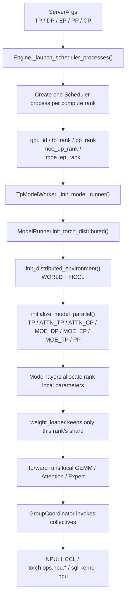
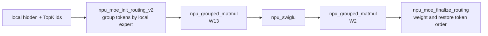
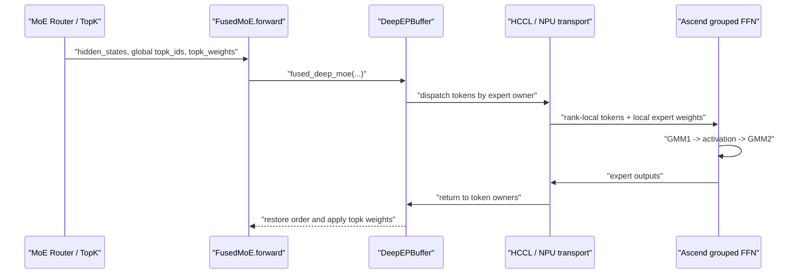
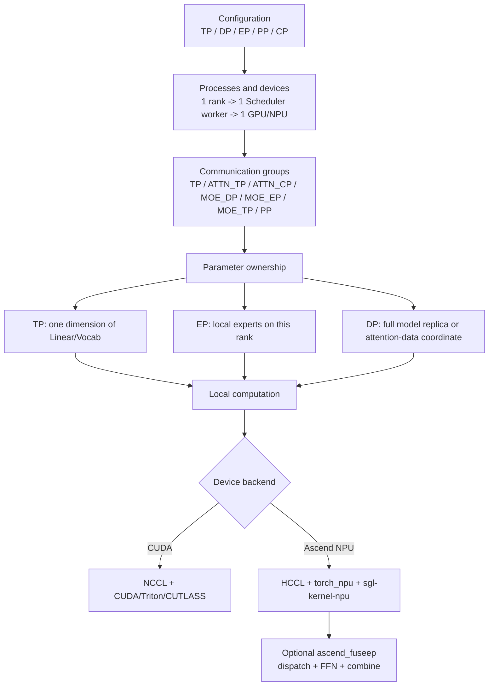

# How TP, DP, and EP Are Actually Sharded: From Rank Topology to Ascend NPU Execution

[简体中文](../../../zh/sglang-source-reading/05-layer-communication/02-tp-dp-ep-sharding-and-ascend-npu.md) | **English**

This chapter answers a question that is easily hidden behind the phrase "parallel strategy":

> How do `--tp-size`, `--dp-size`, and `--ep-size` turn into processes, ranks, NPUs, weight shards, and cross-device communication?

The short answer is:

- **Most sharding semantics are shared across hardware.** Process launch, rank numbering, process-group construction, Column/Row Parallel weight slicing, and global-to-local expert mapping live in the common Python layer.
- **Device execution is not fully shared.** CUDA, ROCm, Ascend NPU, and other backends may replace the collective backend, physical weight layout, GEMM, Attention, MoE dispatch/combine, and graph execution.
- **Ascend does not redefine TP, DP, or EP.** It reuses the same rank topology and layer interfaces, then maps communication to HCCL and selected Linear/MoE operations to `torch.ops.npu.*`, `torch_npu`, or `sgl-kernel-npu`.
- **`ascend_fuseep` is a clearly NPU-specific path.** It requires `ep_size == tp_size` and fuses MoE dispatch, expert FFN, and combine.

This chapter is a static walkthrough of the source currently retained in the repository. The workspace does not provide an Ascend NPU, CANN, or HCCL runtime, so the call graph, rank formulas, parameter shapes, and Markdown can be verified here, but these checks are not presented as real multi-node NPU runtime or performance validation.

## 1. First Separate Four Kinds of Sharding

| What is sharded | Main meaning in SGLang | Is the model replicated? | Typical communication |
|---|---|---:|---|
| Regular DP | Send requests to separate complete model replicas | Yes | Usually no replica-to-replica communication on the inference hot path |
| DP Attention | Split attention token/batch work across attention-DP ranks inside one model-parallel world | Not a simple full replica | Gather/scatter, all-reduce, idle-rank synchronization |
| TP | Split Linear, QKV, vocabulary, and intra-expert matrices by tensor dimension | No | all-reduce / all-gather / reduce-scatter |
| EP | Place different routed experts on different ranks | Router is usually replicated; expert weights are sharded | Partial-output all-reduce or token all-to-all dispatch/combine |

The most important warning is:

> SGLang has two operating forms for `dp_size`: regular DP and DP Attention. Seeing `dp_size=2` is not enough to infer the process topology; you must also inspect `enable_dp_attention`.

## 2. Parameter Relationships: `tp_size` Is Not Always the Matrix-Sharding Degree

The source entry points are `ServerArgs`, `ServerArgs._handle_context_parallelism()`, `ServerArgs._handle_data_parallelism()`, and `ServerArgs._handle_a2a_moe()` in `python/sglang/srt/server_args.py`.

Common options are:

```text
--tensor-parallel-size / --tp-size
--data-parallel-size / --dp-size
--expert-parallel-size / --ep-size / --ep
--moe-data-parallel-size / --moe-dp-size
--attention-context-parallel-size / --attn-cp-size
--enable-dp-attention
--moe-a2a-backend
--moe-dense-tp-size
```

Inside one TP world consumed by `initialize_model_parallel()`, Attention and MoE decompose `tp_size` into more dimensions:

```text
attn_dp_size = dp_size if enable_dp_attention else 1
attn_tp_size = tp_size / attn_dp_size / attn_cp_size

moe_tp_size = tp_size / moe_dp_size / ep_size
```

After DP Attention or multidimensional MoE parallelism is enabled, `tp_size` is better understood as:

> The number of device ranks in the current model-parallel world.

The actual sharding degree of a particular matrix may instead be `attn_tp_size`, `moe_tp_size`, or `moe_dense_tp_size`.

`ServerArgs` validates these relationships before launch:

```python
# python/sglang/srt/server_args.py
# ServerArgs._handle_context_parallelism()

assert self.tp_size % self.attn_cp_size == 0
assert self.tp_size % (self.dp_size * self.attn_cp_size) == 0

assert self.tp_size % self.moe_dp_size == 0
assert self.ep_size * self.moe_dp_size <= self.tp_size
```

These checks ensure that the later rank grids divide evenly.

## 3. Global Call Chain: From Arguments to Every NPU



It helps to separate three layers:

1. **Topology layer**: processes, global rank, local rank, device id, and process groups.
2. **Parameter layer**: which Linear slice and which experts a rank stores.
3. **Execution layer**: which local kernel and collective implementation are used.

The first two layers are mostly common. Hardware-specific behavior is concentrated in the third.

## 4. Step One: Engine Maps Ranks to Processes and Devices

Source locations:

- `python/sglang/srt/entrypoints/engine.py`
  - `Engine._launch_scheduler_processes()`
  - `_calculate_rank_ranges()`
  - `_compute_parallelism_ranks()`
- `python/sglang/srt/managers/data_parallel_controller.py`
  - `DataParallelController.launch_dp_schedulers()`
  - `DataParallelController.launch_dp_attention_schedulers()`
  - `DataParallelController.launch_tensor_parallel_group()`

### 4.1 One Compute Rank Usually Means One Scheduler Process

`Engine._launch_scheduler_processes()` iterates over PP and TP ranks:

```python
for pp_rank in pp_rank_range:
    for tp_rank in tp_rank_range:
        gpu_id = (
            server_args.base_gpu_id
            + ((pp_rank % pp_size_per_node) * tp_size_per_node)
            + (tp_rank % tp_size_per_node) * server_args.gpu_id_step
        )
        attn_cp_rank, moe_dp_rank, moe_ep_rank = _compute_parallelism_ranks(
            server_args, tp_rank
        )
        proc = mp.Process(
            target=run_scheduler_process_func,
            args=(
                server_args,
                port_args,
                gpu_id,
                tp_rank,
                attn_cp_rank,
                moe_dp_rank,
                moe_ep_rank,
                pp_rank,
                None,
                writer,
            ),
        )
```

This code performs **process partitioning**. No model weight has been sliced yet.

On one node with `base_gpu_id=0` and `gpu_id_step=1`, the usual mapping is:

```text
tp_rank 0 -> Scheduler process 0 -> npu:0
tp_rank 1 -> Scheduler process 1 -> npu:1
...
```

Across nodes, `tp_rank` can be a global model rank while `gpu_id` is a node-local device index. Multiple nodes may each have a `gpu_id=0`, but their global ranks differ.

### 4.2 Global Rank, Local Rank, and Group Rank Are Different

| Name | Purpose | Example |
|---|---|---|
| global rank | Unique identifier inside WORLD | 6 |
| local rank / `gpu_id` | Device selected on the current node | `npu:2` |
| TP rank | Position in the current TP world | 6 |
| rank in group | Position inside a particular subgroup | 2 inside `[4,5,6,7]` |
| DP/EP rank | Coordinate obtained by decoding the rank grid | `attn_dp_rank=1`, `moe_ep_rank=2` |

Some of these integers happen to be equal in simple deployments, but their meanings must not be mixed.

### 4.3 Regular DP Creates Independent TP Replicas

When `dp_size > 1` and DP Attention is disabled, `DataParallelController.launch_dp_schedulers()` launches a complete TP/PP worker group for each DP rank:

```python
base_gpu_id = 0
for dp_rank in range(server_args.dp_size):
    thread = threading.Thread(
        target=self.launch_tensor_parallel_group_thread,
        args=(server_args, tmp_port_args, base_gpu_id, dp_rank, ready_event),
    )
    base_gpu_id += (
        server_args.tp_size * server_args.pp_size * server_args.gpu_id_step
    )
```

For `dp_size=2, tp_size=4`:

```text
DP replica 0: NPU 0..3, internal TP ranks 0..3
DP replica 1: NPU 4..7, internal TP ranks 0..3
```

Each replica stores a complete model, while that model is internally sharded with TP=4. `DataParallelController` sends requests using round-robin, shortest-queue, or an explicitly supplied `routed_dp_rank`.

### 4.4 DP Attention Creates One Joint World

`launch_dp_attention_schedulers()` does not repeatedly launch one TP group per DP rank. It makes one call:

```python
self.launch_tensor_parallel_group(
    server_args, port_args, 0, None, broadcasted_ports
)
```

`compute_dp_attention_world_info()` then decodes the DP coordinate from `tp_rank`:

```python
attn_tp_size = tp_size // attn_dp_size // attn_cp_size
attn_tp_rank = tp_rank % attn_tp_size
attn_dp_rank = tp_rank // (attn_tp_size * attn_cp_size)
```

The `dp_rank` in regular DP is a model-replica index. The `attn_dp_rank` in DP Attention is an attention-data coordinate inside one model-parallel world.

## 5. Step Two: ModelRunner Initializes WORLD and All Subgroups

Source locations:

- `python/sglang/srt/model_executor/model_runner.py`
  - `ModelRunner.init_torch_distributed()`
- `python/sglang/srt/distributed/parallel_state.py`
  - `get_default_distributed_backend()`
  - `init_distributed_environment()`
  - `initialize_model_parallel()`
  - `GroupCoordinator`
- `python/sglang/srt/layers/dp_attention.py`
  - `initialize_dp_attention()`
  - `compute_dp_attention_world_info()`

`ModelRunner.init_torch_distributed()` is the central point where topology becomes runtime state:

```python
torch.get_device_module(self.device).set_device(self.gpu_id)
backend = get_default_distributed_backend(self.device)

init_distributed_environment(
    backend=backend,
    world_size=self.tp_size * self.pp_size,
    rank=self.tp_size * self.pp_rank + self.tp_rank,
    local_rank=self.gpu_id,
    distributed_init_method=dist_init_method,
)

initialize_model_parallel(
    tensor_model_parallel_size=self.tp_size,
    attention_data_parallel_size=self.dp_size,
    pipeline_model_parallel_size=self.pp_size,
    expert_model_parallel_size=self.moe_ep_size,
    attention_context_model_parallel_size=self.attn_cp_size,
    moe_data_model_parallel_size=self.moe_dp_size,
)

initialize_dp_attention(
    server_args=self.server_args,
    model_config=self.model_config,
)
```

For NPU:

```python
_DEVICE_TO_DISTRIBUTED_BACKEND = {
    "cuda": "nccl",
    "cpu": "gloo",
    "npu": "hccl" if not envs.SGLANG_ZBAL_LOCAL_MEM_SIZE.get() > 0 else "zbal",
}
```

The same `init_distributed_environment()` calls PyTorch distributed, but the NPU device process group uses HCCL.

## 6. How `initialize_model_parallel()` Builds a Multidimensional Rank Grid

`initialize_model_parallel()` in `python/sglang/srt/distributed/parallel_state.py` creates:

```text
_TP
_ATTN_CP
_ATTN_TP
_MOE_DP
_MOE_EP
_MOE_TP
_PP
```

Each is a `GroupCoordinator` that stores the current process's:

```text
ranks
world_size
rank_in_group
device_group
cpu_group
device
```

### 6.1 TP Groups

TP ranks are contiguous:

```python
for tp_group_idx in range(num_tensor_model_parallel_groups):
    ranks = list(
        range(
            tp_group_idx * tensor_model_parallel_size,
            (tp_group_idx + 1) * tensor_model_parallel_size,
        )
    )
```

For `world_size=8, tp_size=4, pp_size=2`:

```text
TP groups: [0,1,2,3], [4,5,6,7]
PP groups: [0,4], [1,5], [2,6], [3,7]
```

### 6.2 Attention Groups

The Attention rank layout is:

```text
(attention DP, attention CP, attention TP)
```

TP is the fastest-changing dimension:

```text
tp_rank =
    (attn_dp_rank * attn_cp_size + attn_cp_rank)
    * attn_tp_size
    + attn_tp_rank
```

### 6.3 MoE Groups

The MoE rank layout is:

```text
(MoE DP, EP, MoE TP)
```

MoE TP is the fastest-changing dimension:

```text
tp_rank =
    (moe_dp_rank * ep_size + moe_ep_rank)
    * moe_tp_size
    + moe_tp_rank
```

These two formulas are the most useful tools for understanding SGLang's multidimensional parallelism.

## 7. A Complete Eight-Rank Example

Assume:

```text
tp_size      = 8
dp_size      = 2
enable_dp_attention = True
attn_cp_size = 1
ep_size      = 4
moe_dp_size  = 2
pp_size      = 1
```

Then:

```text
attn_tp_size = 8 / 2 / 1 = 4
moe_tp_size  = 8 / 2 / 4 = 1
```

The groups are:

```text
TP:       [0,1,2,3,4,5,6,7]

ATTN_TP:  [0,1,2,3], [4,5,6,7]
ATTN_CP:  [0], [1], [2], [3], [4], [5], [6], [7]

MOE_EP:   [0,1,2,3], [4,5,6,7]
MOE_DP:   [0,4], [1,5], [2,6], [3,7]
MOE_TP:   [0], [1], [2], [3], [4], [5], [6], [7]
```

For a model with 16 routed experts and no redundant experts:

| global rank | Single-node device | attn DP | attn TP | MoE DP | EP | MoE TP | Local routed experts |
|---:|---|---:|---:|---:|---:|---:|---|
| 0 | `npu:0` | 0 | 0 | 0 | 0 | 0 | 0..3 |
| 1 | `npu:1` | 0 | 1 | 0 | 1 | 0 | 4..7 |
| 2 | `npu:2` | 0 | 2 | 0 | 2 | 0 | 8..11 |
| 3 | `npu:3` | 0 | 3 | 0 | 3 | 0 | 12..15 |
| 4 | `npu:4` | 1 | 0 | 1 | 0 | 0 | 0..3 |
| 5 | `npu:5` | 1 | 1 | 1 | 1 | 0 | 4..7 |
| 6 | `npu:6` | 1 | 2 | 1 | 2 | 0 | 8..11 |
| 7 | `npu:7` | 1 | 3 | 1 | 3 | 0 | 12..15 |

Compare ranks 2 and 6:

- They belong to different MoE-DP replicas.
- Both have `moe_ep_rank=2`, so they store the same logical expert shard.
- They process different token data, forming MoE data parallelism.

EP and MoE DP can therefore coexist: EP answers "where is each expert set?", while MoE DP answers "how many data replicas of that expert set exist?"

## 8. TP Parameter Sharding Happens in Layer Construction and Weight Loading

Source locations:

- `python/sglang/srt/layers/linear.py`
  - `ColumnParallelLinear.__init__()`
  - `ColumnParallelLinear.weight_loader()`
  - `ColumnParallelLinear.forward()`
  - `RowParallelLinear.__init__()`
  - `RowParallelLinear.weight_loader()`
  - `RowParallelLinear.forward()`
- `python/sglang/srt/layers/vocab_parallel_embedding.py`
  - `VocabParallelEmbedding.__init__()`
  - `VocabParallelEmbedding._get_indices()`
  - `VocabParallelEmbedding.weight_loader()`
  - `VocabParallelEmbedding.forward()`

### 8.1 Column Parallel Splits the Output Dimension

For `Y = XW`, Column Parallel splits the output dimension of `W`:

```text
W = [W0, W1, ..., Wp-1]
rank r stores Wr
rank r computes Yr = XWr
```

Construction first determines the rank-local parameter shape:

```python
self.output_size_per_partition = divide(self.output_size, tp_size)
```

Checkpoint loading selects the current rank's contiguous shard:

```python
shard_size = param_data.shape[output_dim]
start_idx = self.tp_rank * shard_size
loaded_weight = loaded_weight.narrow(
    output_dim, start_idx, shard_size
)
param_data.copy_(loaded_weight)
```

Forward computes a local output. It all-gathers only when `gather_output=True`:

```python
output_parallel = self.quant_method.apply(self, input_, bias)
if self.gather_output:
    output = tensor_model_parallel_all_gather(output_parallel)
```

### 8.2 Row Parallel Splits the Input Dimension

Row Parallel splits the input dimension of `W`:

```text
X = [X0, X1, ..., Xp-1]
W = vertical_stack(W0, W1, ..., Wp-1)
rank r computes partial_r = Xr Wr
Y = sum(partial_r)
```

Loading slices along `input_dim`:

```python
shard_size = param_data.shape[input_dim]
start_idx = self.tp_rank * shard_size
loaded_weight = loaded_weight.narrow(
    input_dim, start_idx, shard_size
)
```

Forward usually ends with all-reduce:

```python
output_parallel = self.quant_method.apply(self, input_parallel, bias=bias_)
if self.reduce_results and self.tp_size > 1 and not skip_all_reduce:
    output = tensor_model_parallel_all_reduce(output_parallel)
```

### 8.3 How GLM Uses the Common Layers

`Glm4MoeAttention.__init__()` in `python/sglang/srt/models/glm4_moe.py` does not implement a separate NPU TP system:

```python
attn_tp_rank = get_attention_tp_rank()
attn_tp_size = get_attention_tp_size()

self.num_heads = self.total_num_heads // attn_tp_size

self.qkv_proj = QKVParallelLinear(
    hidden_size,
    self.head_dim,
    self.total_num_heads,
    self.total_num_kv_heads,
    tp_rank=attn_tp_rank,
    tp_size=attn_tp_size,
)

self.o_proj = RowParallelLinear(
    self.total_num_heads * self.head_dim,
    hidden_size,
    tp_rank=attn_tp_rank,
    tp_size=attn_tp_size,
    reduce_results=False,
)
```

The model class describes Q/K/V head counts and layer structure. The common Linear layers perform the actual parameter sharding.

### 8.4 Checkpoint Files Are Not TP Shards by Definition

Keep these concepts separate:

- A checkpoint may contain multiple safetensors files.
- A TP rank keeps only one slice of an in-memory parameter.
- With `use_presharded_weights=True`, checkpoint tensors may already be sliced for the target rank.
- During ordinary loading, a rank may read a complete tensor and then use `weight_loader().narrow()` to retain only its local slice.

"Eight checkpoint files" does not imply TP=8, and "one checkpoint file" does not imply that every device keeps a full parameter.

## 9. EP Parameter Sharding: From Global Expert to Local Expert

Source locations:

- `python/sglang/srt/models/glm4_moe.py`
  - `Glm4MoeSparseMoeBlock.__init__()`
  - `Glm4MoeForCausalLM.load_weights()`
- `python/sglang/srt/layers/moe/fused_moe_triton/layer.py`
  - `FusedMoE.__init__()`
  - `FusedMoE._map_global_expert_id_to_local_expert_id()`
  - `FusedMoE.weight_loader()`
  - `FusedMoE.forward_impl()`
  - `create_moe_dispatcher()`
- `python/sglang/srt/layers/moe/token_dispatcher/standard.py`
  - `StandardDispatcher.dispatch()`

### 9.1 The Model Creates a Common FusedMoE

`Glm4MoeSparseMoeBlock.__init__()` creates the gate, TopK, and common MoE implementation:

```python
self.gate = Glm4MoeGate(config=config, ...)

self.experts = get_moe_impl_class(quant_config)(
    num_experts=config.n_routed_experts + self.num_fused_shared_experts,
    num_fused_shared_experts=self.num_fused_shared_experts,
    top_k=self.top_k + self.num_fused_shared_experts,
    hidden_size=config.hidden_size,
    intermediate_size=config.moe_intermediate_size,
    ...
)
```

The router/gate can still produce global expert ids. `FusedMoE` decides expert ownership.

### 9.2 `FusedMoE.__init__()` Computes the Local Expert Count

```python
self.moe_ep_size = get_moe_expert_parallel_world_size()
self.moe_ep_rank = get_moe_expert_parallel_rank()
self.moe_tp_size = get_moe_tensor_parallel_world_size()
self.moe_tp_rank = get_moe_tensor_parallel_rank()

self._num_global_routed = num_experts - num_shared_slots
self._num_local_routed = self._num_global_routed // self.moe_ep_size
self.num_local_experts = (
    self._num_local_routed + num_fused_shared_experts
)

self.intermediate_size_per_partition = (
    intermediate_size // self.moe_tp_size
)
```

Two different operations happen here:

- EP splits by expert id, so each rank owns only a subset of experts.
- MoE TP splits each expert's intermediate dimension, so multiple ranks may cooperate on one expert.

### 9.3 The Weight Loader Drops Experts That Do Not Belong to This Rank

```python
def _map_global_expert_id_to_local_expert_id(self, expert_id):
    start_idx = self.moe_ep_rank * self._num_local_routed
    end_idx = start_idx + self._num_local_routed
    if start_idx <= expert_id < end_idx:
        return expert_id - start_idx
    return -1
```

When `FusedMoE.weight_loader()` receives a global expert id from the checkpoint:

```python
expert_id = self._map_global_expert_id_to_local_expert_id(expert_id)
if expert_id == -1:
    return
```

This is the **parameter-sharding point** for EP: weights for non-local experts are never copied into local parameters.

For local expert `w1/w3` and `w2`, the loader can additionally slice the intermediate dimension by `moe_tp_rank`. EP and intra-expert TP are two orthogonal sharding layers.

## 10. Two Main Runtime Communication Forms for EP

`FusedMoE.forward_impl()` provides the shared skeleton:

```python
dispatch_output = self.dispatcher.dispatch(
    hidden_states=hidden_states,
    topk_output=topk_output,
)

combine_input = self.run_moe_core(
    dispatch_output=dispatch_output,
)

final_hidden_states = self.dispatcher.combine(
    combine_input=combine_input
)
```

### 10.1 No A2A Backend: Replicate Tokens, Compute Local Experts, Then Reduce

`StandardDispatcher` maps global expert ids to local ids and maps non-local experts to `-1`:

```python
self.local_expert_mapping = torch.full(
    (self.num_experts,), -1, dtype=torch.int32, device=device
)
self.local_expert_mapping[start:end] = torch.arange(
    0, self.num_local_routed_experts, ...
)
```

Each rank computes only the contribution of its local experts. Depending on configuration, partial results are then merged with all-reduce.

The mental model is:

```text
token/hidden is visible on EP ranks
  -> each rank keeps assignments for local experts
  -> local expert GEMM
  -> reduce partial outputs
```

### 10.2 With an A2A Backend: Tokens Travel to Their Experts

`create_moe_dispatcher()` selects a dispatcher from `moe_a2a_backend`:

```python
if (
    a2a_backend.is_none()
    or a2a_backend.is_megamoe()
    or a2a_backend.is_ascend_fuseep()
):
    return StandardDispatcher(...)
elif (
    a2a_backend.is_deepep()
    or a2a_backend.is_mooncake()
    or a2a_backend.is_mori()
    or a2a_backend.is_nixl()
):
    return MaybeTboDeepEPDispatcher(...)
```

The flow becomes:

```text
TopK global expert ids
  -> count tokens for each destination rank
  -> dispatch tokens to expert owners
  -> owner rank runs local expert GEMM
  -> combine sends results back to token owners
  -> restore token order and apply TopK weights
```

Expert ownership is a common-layer concept, while the token transport backend may vary by hardware and deployment.

## 11. What Ascend NPU Actually Replaces

### 11.1 Device and Collective Backend: NPU + HCCL

On NPU, `GroupCoordinator.__init__()` sets:

```python
self.device = torch.device(f"npu:{local_rank}")
```

During process-group creation, `get_torch_distributed_pg_options()` builds HCCL options for the default and MoE-related groups and reads:

```text
DEEPEP_HCCL_BUFFSIZE
HCCL_BUFFSIZE
```

`GroupCoordinator.all_reduce()` prefers `NpuCommunicator`:

```python
if self.npu_communicator is not None and not self.npu_communicator.disabled:
    return self.npu_communicator.all_reduce(input_)
```

`NpuCommunicator.all_reduce()` in `python/sglang/srt/distributed/device_communicators/npu_communicator.py` eventually calls:

```python
dist.all_reduce(x, group=self.group)
```

`self.group` is an HCCL device group. Upper layers still call `get_tp_group().all_reduce()`, while the transport has changed from NCCL to HCCL.

NPU also provides quantized communication:

```python
x_q, scale = npu_dynamic_quant(x, dst_type=torch.int8)
dist.all_gather_into_tensor(output_tensor, x_q, group=self.group)
dist.all_gather_into_tensor(output_scale, scale, group=self.group)
output_tensor = dequantize(...)
return output_tensor.sum(dim=0)
```

It approximates quantized all-reduce with low-precision all-gather followed by full-precision reduction.

### 11.2 TP Sharding Rules Stay the Same; the Local Linear Kernel May Change

`ColumnParallelLinear` and `RowParallelLinear` still own shape calculation and checkpoint slicing. `quant_method.apply()` selects the local GEMM.

For example, `NPUW8A8Int8DynamicLinearMethod.apply()` in `python/sglang/srt/hardware_backend/npu/quantization/linear_method_npu.py`:

```python
quant_out, dynamic_scale = torch.ops.npu.npu_dynamic_quant(x)
return torch.ops.npu.npu_quant_matmul(
    quant_out,
    layer.weight,
    layer.weight_scale,
    pertoken_scale=dynamic_scale.flatten(),
    bias=bias,
    output_dtype=original_dtype,
)
```

The division of responsibility is:

```text
"Which dimension of W is sharded, and which slice belongs to rank r?"
    -> common Linear layer

"How is this local W slice multiplied efficiently?"
    -> NPU quant method / torch_npu

"How are rank-local partial results merged?"
    -> GroupCoordinator -> HCCL
```

### 11.3 Common Operations Dispatch to NPU Through `MultiPlatformOp`

`MultiPlatformOp.dispatch_forward()` in `python/sglang/srt/layers/utils/multi_platform.py` does:

```python
if _is_cuda:
    return self.forward_cuda
elif _is_hip:
    return self.forward_hip
elif _is_npu:
    return self.forward_npu
```

The same `FusedMoE` and quantization-method interface can therefore provide an NPU-specific `forward_npu()`.

## 12. Three NPU MoE Execution Paths

### 12.1 NPU Local Standard Path

Without an A2A backend, `UnquantizedFusedMoEMethod.forward_npu()` uses:

```text
torch.ops.npu.npu_moe_init_routing_v2
torch.ops.npu.npu_grouped_matmul       # gate/up
torch.ops.npu.npu_swiglu
torch.ops.npu.npu_grouped_matmul       # down
torch.ops.npu.npu_moe_finalize_routing
```



This is **local expert computation**. The outer EP/TP path still decides how results are synchronized across ranks.

### 12.2 Common DeepEP Dispatcher + NPU Expert Compute

With `moe_a2a_backend=deepep`:

1. The common `MaybeTboDeepEPDispatcher.dispatch()` sends tokens to destination EP ranks.
2. NPU `_forward_npu_deepep()` or `maybe_apply_deepep_npu()` reads the dispatched tokens and `group_list`.
3. `npu_fused_moe_without_routing_weights_bf16()` or its quantized equivalent runs local grouped matmul.
4. The common dispatcher `combine()` sends outputs back to the original token owners.

This path shows that the communication backend and expert-compute backend can be composed rather than implemented in one class.

### 12.3 Ascend FuseEP: Fused Dispatch + FFN + Combine

`ServerArgs._handle_a2a_moe()` handles `ascend_fuseep` specially:

```python
if self.moe_a2a_backend == "ascend_fuseep":
    self.ep_size = self.tp_size
    fuse_mode = envs.SGLANG_NPU_FUSED_MOE_MODE.get()
    if fuse_mode not in [1, 2]:
        raise ValueError(...)
```

In the current implementation:

```text
ascend_fuseep group == TP group
ep_size == tp_size
```

`FusedMoE.forward()` bypasses the normal dispatcher:

```python
if self._use_ascend_fuseep:
    from sglang.srt.hardware_backend.npu.moe.fuseep import forward_fuseep
    return forward_fuseep(self, hidden_states, topk_output)
```

`forward_fuseep()` calls:

```python
hidden_states, _ = buf.fused_deep_moe(
    hidden_states,
    topk_idx=topk_output.topk_ids,
    topk_weights=topk_output.topk_weights,
    gmm1_permuted_weight=layer.w13_weight,
    gmm2_weight=layer.w2_weight,
    num_experts=layer.num_experts,
    fuse_mode=envs.SGLANG_NPU_FUSED_MOE_MODE.get(),
)
```

End-to-end:



`process_fuseep_weights()` also converts `w13_weight`, `w2_weight`, and scales into the Ascend layout required by the fused operator after loading. This changes the **local physical layout**, not the logical expert owner.

## 13. One GLM MoE Request Across Eight NPUs

Consider this simplified configuration:

```text
--device npu
--tp-size 8
--ep-size 8
--moe-a2a-backend ascend_fuseep
```

During startup:

1. `Engine._launch_scheduler_processes()` creates eight Scheduler/worker processes.
2. Each process binds one NPU and receives a distinct `tp_rank`.
3. `ModelRunner.init_torch_distributed()` creates HCCL WORLD and TP/EP groups.
4. `Glm4MoeAttention` shards QKV heads and projection weights by attention TP.
5. `FusedMoE` distributes routed experts across eight EP ranks.
6. `Glm4MoeForCausalLM.load_weights()` passes checkpoint expert names to `FusedMoE.weight_loader()`; each rank skips non-local experts.
7. The NPU quant method and `process_fuseep_weights()` convert local weights into the layout expected by Ascend kernels.

During forward:

1. All participating ranks process the same scheduled batch.
2. QKV Column Parallel computes rank-local heads on every NPU.
3. The Attention backend executes attention with local heads and local KV cache.
4. Row Parallel output projection produces partial outputs and merges them through HCCL when required.
5. The MoE gate produces global expert ids and TopK weights.
6. `ascend_fuseep` sends tokens to the NPUs that own the selected experts.
7. Owner NPUs run local grouped FFN.
8. Expert outputs return to token owners and are combined with TopK weights.
9. The next layer reuses the same rank topology.

## 14. Common Logic Versus Vendor-Specific Logic

| Module / behavior | Common or vendor-specific? | Ascend NPU implementation |
|---|---|---|
| Scheduler process count and rank arguments | Common | Reuses `Engine` / `DataParallelController` |
| global/local/group rank | Common | `gpu_id` binds to `npu:{local_rank}` |
| TP/EP/DP/PP/CP group formulas | Common | Device groups use HCCL |
| Column/Row/Vocab parameter slicing | Common | Reuses `linear.py` and `vocab_parallel_embedding.py` |
| Global expert to local expert | Common | Reuses `FusedMoE.weight_loader()` |
| Collective API | Common abstraction | `NpuCommunicator` / HCCL |
| Local quantized Linear | Vendor-specific | `hardware_backend/npu/quantization/linear_method_npu.py` |
| Local MoE grouped GEMM | Vendor-specific | `UnquantizedFusedMoEMethod.forward_npu()` and NPU quant methods |
| MoE A2A transport | Backend-specific | DeepEP/HCCL or `ascend_fuseep` |
| FuseEP weight layout | NPU-specific | `hardware_backend/npu/moe/fuseep.py::process_fuseep_weights()` |
| Attention kernels and graph execution | Vendor-specific | `hardware_backend/npu/attention/` and `graph_runner/` |

The precise answer to "Is the sharding logic common?" is:

> **The logical topology and parameter ownership are common; communication implementations, physical tensor layouts, and local kernels are platform-specific.**

## 15. Common Misunderstandings

### 15.1 `tp_size=8` Means Every Matrix Is Split Eight Ways

Not necessarily. With DP Attention, CP, EP, or MoE DP enabled, compute `attn_tp_size` and `moe_tp_size` as well.

### 15.2 EP Only Means Loading Fewer Experts

That is only half the story. Loading determines expert ownership; runtime must also align token routing with that ownership, either through local partial computation plus reduction or through A2A dispatch/combine.

### 15.3 DP Never Communicates

Independent regular-DP replicas usually do not run cross-replica collectives on the inference hot path. DP Attention explicitly requires rank-to-rank gathering, scattering, and synchronization.

### 15.4 NPU Has a Completely Separate TP Implementation

That is not how the current source is structured. NPU reuses common Linear layers and rank groups, while replacing HCCL transport, weight postprocessing, and local operators.

### 15.5 `ascend_fuseep` Only Replaces a GEMM Kernel

It does more: it fuses token dispatch, expert FFN, and combine, and the current implementation requires `ep_size == tp_size`.

## 16. Recommended Source Walkthrough Order

| Step | File | Function / code block | Question to answer |
|---:|---|---|---|
| 1 | `python/sglang/srt/server_args.py` | `ServerArgs._handle_context_parallelism()`, `_handle_data_parallelism()`, `_handle_a2a_moe()` | Which divisibility and backend constraints apply? |
| 2 | `python/sglang/srt/entrypoints/engine.py` | `Engine._launch_scheduler_processes()`, `_calculate_rank_ranges()`, `_compute_parallelism_ranks()` | How does one rank become one process and device id? |
| 3 | `python/sglang/srt/managers/data_parallel_controller.py` | `launch_dp_schedulers()`, `launch_dp_attention_schedulers()`, `launch_tensor_parallel_group()` | How do regular DP and DP Attention create different process topologies? |
| 4 | `python/sglang/srt/model_executor/model_runner.py` | `ModelRunner.init_torch_distributed()` | Which function hands configuration to the distributed runtime? |
| 5 | `python/sglang/srt/distributed/parallel_state.py` | `init_distributed_environment()`, `initialize_model_parallel()` | How are TP/ATTN/EP/MoE-DP/PP group ranks generated? |
| 6 | `python/sglang/srt/layers/dp_attention.py` | `compute_dp_attention_world_info()`, `initialize_dp_attention()`, `dp_gather_*()`, `dp_scatter()` | How is an Attention-DP rank decoded, and how are tokens gathered/scattered? |
| 7 | `python/sglang/srt/layers/linear.py` | Constructors, loaders, and forward methods of `ColumnParallelLinear` and `RowParallelLinear` | Which dimension is sharded, and how are outputs merged? |
| 8 | `python/sglang/srt/models/glm4_moe.py` | `Glm4MoeAttention.__init__()`, `Glm4MoeSparseMoeBlock.__init__()`, `load_weights()` | How does a model class reuse common TP/EP layers? |
| 9 | `python/sglang/srt/layers/moe/fused_moe_triton/layer.py` | `FusedMoE.__init__()`, `_map_global_expert_id_to_local_expert_id()`, `forward_impl()` | How do expert ownership, MoE TP, and runtime dispatch connect? |
| 10 | `python/sglang/srt/distributed/device_communicators/npu_communicator.py` | `NpuCommunicator.all_reduce()`, `quant_all_reduce()`, `all_gather()` | How do common collectives reach the NPU backend? |
| 11 | `python/sglang/srt/layers/quantization/unquant.py` | `UnquantizedFusedMoEMethod.forward_npu()`, `_forward_npu_deepep()` | How does NPU local expert compute run? |
| 12 | `python/sglang/srt/hardware_backend/npu/moe/fuseep.py` | `forward_fuseep()`, `process_fuseep_weights()` | How does Ascend fused EP combine communication, compute, and weight layout? |

## 17. Final Mental Model



Keep this sentence:

> SGLang first uses a common rank grid to decide "who stores what and who communicates with whom." The device backend then decides "which implementation performs that communication and local computation." Ascend NPU changes the execution mechanism, not the basic meaning of TP, DP, and EP.

## 18. Connections to Other Chapters

- Process launch, ZMQ, and the Scheduler rank leader: [06-multiprocess-distributed.md](../02-scheduler-runtime/06-multiprocess-distributed.md).
- Where `DecoderLayer` triggers collectives: [01-layer-communicator-and-common-layers.md](./01-layer-communicator-and-common-layers.md).
- How `ModelRunner` loads a model class and checkpoint: [TP Worker / ModelRunner Lesson 6](../../tp-worker-model-runner/06-model-loading-and-architecture-resolution.md).
- Lower-level Ascend MoE kernels, DeepEP, and HCCL: [Ascend Kernel Infra](../../ascend-kernel-infra/README.md).
