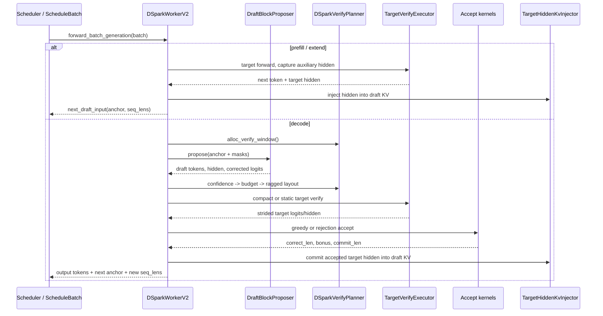
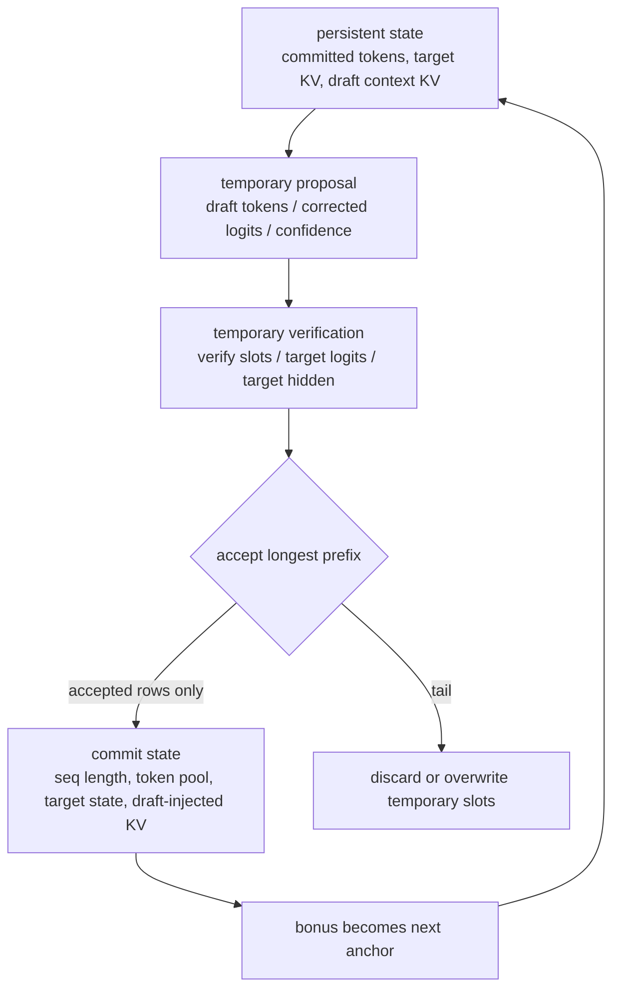
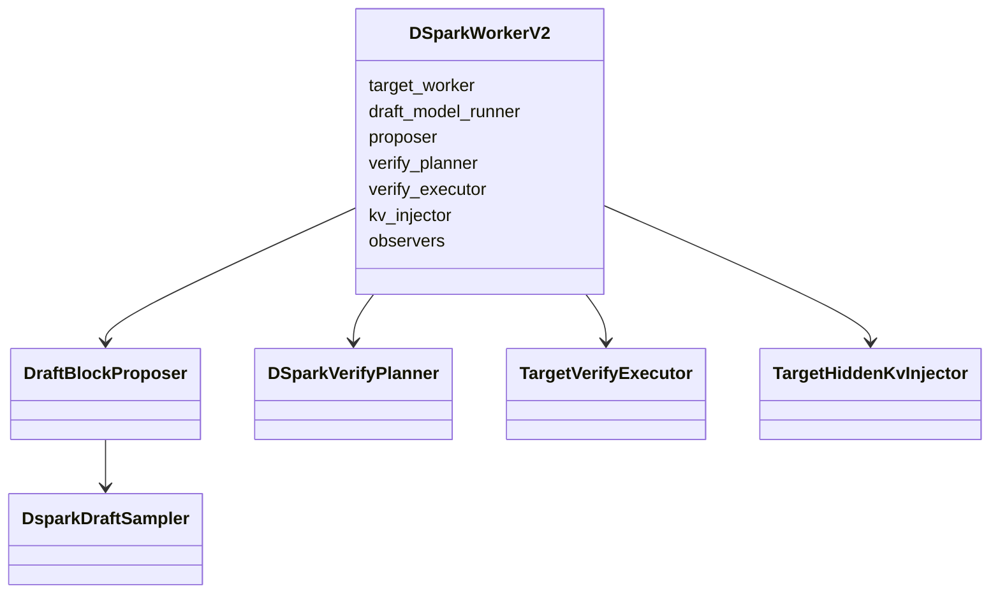
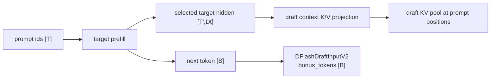
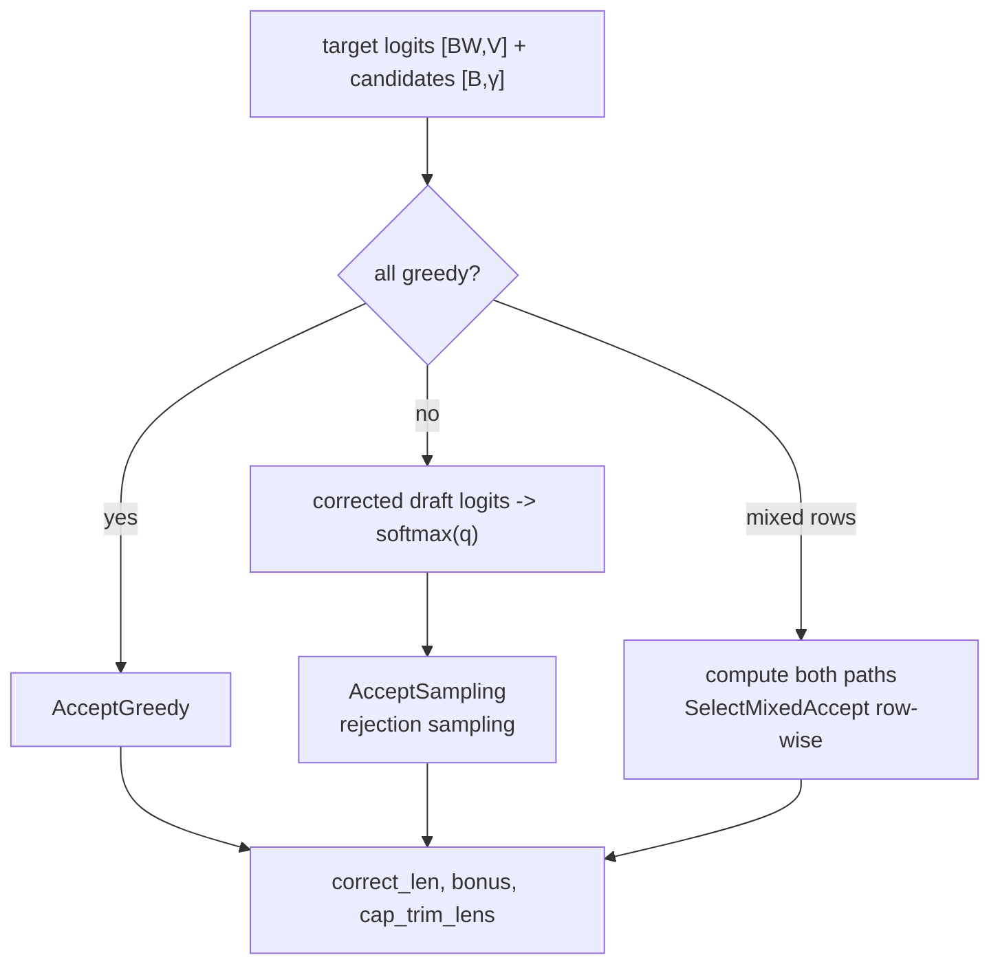
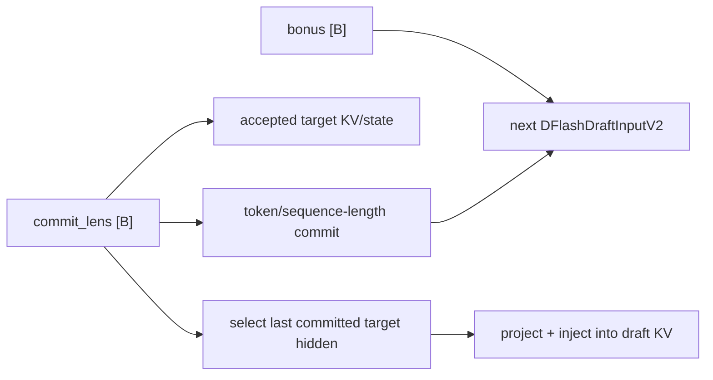

# SGLang DSpark End-to-End Code Walkthrough

[简体中文](../../../zh/sglang-source-reading/06-advanced-features/09-dspark-code-walkthrough.md) | **English**

This chapter starts at server arguments and follows a real SGLang DSpark prefill and decode round until accepted tokens, target/draft KV state, and the next anchor are all ready. The goal is not to list class names, but to answer four concrete questions:

1. who creates each tensor and how its shape changes;
2. how confidence becomes a different verification length for every request;
3. how compact target verification still uses a common acceptance and commit interface;
4. which states are temporary candidates and which become persistent history.

Read [DSpark principles](../../ai-infra-basic/Speculative_Decoding/05-dspark-principles.md) first for the algorithmic derivation. The exact rejection-sampling proof is in [rejection-sampling mathematics](../../ai-infra-basic/Speculative_Decoding/02-rejection-sampling-math.md).

## 0. Source baseline, version boundary, and map

### 0.1 Pin the walkthrough to a reproducible upstream commit

The SGLang snapshot vendored in this tutor predates the DSpark integration. This chapter therefore does not invent local line numbers. It uses SGLang upstream `main` as of 2026-09-22:

```text
commit: 367e3700cfb6a0b03b2fa41a4524febf18ec1f15
subject: avoid host sync in DSpark prefill slot expansion (#40111)
```

Every source link is pinned to that commit. The explanation remains reproducible if upstream later moves a file or changes an interface; compare against this revision before applying it to a newer build.

### 0.2 Logical roles and files

| Role | Core file / class | Responsibility |
|---|---|---|
| algorithm integration | `spec_info.py::SpeculativeAlgorithm` | recognizes `DSPARK`, creates the worker, declares ragged-verify capability |
| argument normalization | `arg_groups/speculative_hook.py::_handle_dspark` | validates device/parallel combinations, resolves `γ`, sets verify width `γ+1` |
| checkpoint config | `dspark_config.py` | parses mask id, Markov rank/type, and block size |
| orchestration | `DSparkWorkerV2` | joins prefill, decode, target, and draft state transitions |
| proposal | `DraftBlockProposer` | builds the anchor-plus-mask block, runs the backbone, samples the block |
| model heads | `models/dspark.py` | shared embedding/LM head, Markov/Gated/RNN, confidence, KV writes |
| budget and layout | `DSparkVerifyPlanner` | confidence, SPS budget, `verify_lens`, ragged layout |
| target verification | `TargetVerifyExecutor` | static/compact forward, scatter, acceptance, hidden commit |
| fused epilogue | `DsparkVerifyEpilogue` | in-graph scatter, greedy accept, optional KV injection |
| ragged kernels | `kernels/.../dspark_verify_window.py` | constructs and maps the compact verification window |
| accept kernels | `kernels/.../dspark_accept.py` | greedy acceptance, commit lengths, new sequence lengths |

Pinned entry points:

- [`spec_info.py`](https://github.com/sgl-project/sglang/blob/367e3700cfb6a0b03b2fa41a4524febf18ec1f15/python/sglang/srt/speculative/spec_info.py)
- [`speculative_hook.py`](https://github.com/sgl-project/sglang/blob/367e3700cfb6a0b03b2fa41a4524febf18ec1f15/python/sglang/srt/arg_groups/speculative_hook.py)
- [`dspark_worker_v2.py`](https://github.com/sgl-project/sglang/blob/367e3700cfb6a0b03b2fa41a4524febf18ec1f15/python/sglang/srt/speculative/dspark_components/dspark_worker_v2.py)
- [`dspark_draft.py`](https://github.com/sgl-project/sglang/blob/367e3700cfb6a0b03b2fa41a4524febf18ec1f15/python/sglang/srt/speculative/dspark_components/dspark_draft.py)
- [`dspark_planner.py`](https://github.com/sgl-project/sglang/blob/367e3700cfb6a0b03b2fa41a4524febf18ec1f15/python/sglang/srt/speculative/dspark_components/dspark_planner.py)
- [`dspark_verify.py`](https://github.com/sgl-project/sglang/blob/367e3700cfb6a0b03b2fa41a4524febf18ec1f15/python/sglang/srt/speculative/dspark_components/dspark_verify.py)
- [`models/dspark.py`](https://github.com/sgl-project/sglang/blob/367e3700cfb6a0b03b2fa41a4524febf18ec1f15/python/sglang/srt/models/dspark.py)

## 1. The complete call chain first



Viewed as state transitions, a round is more than `draft -> target`:



## 2. Startup and argument normalization

Argument names evolve, and checkpoint paths must follow the model card. A conceptual launch for the pinned revision is:

```bash
python -m sglang.launch_server \
  --model-path /path/to/target \
  --speculative-algorithm DSPARK \
  --speculative-draft-model-path /path/to/dspark-draft \
  --speculative-dspark-block-size 7
```

`_handle_dspark()` does more than pass arguments through. It creates invariants used by all later memory and shape accounting:

```text
speculative_num_steps = 1
speculative_eagle_topk = 1
gamma = checkpoint block_size or --speculative-dspark-block-size
speculative_num_draft_tokens = gamma + 1
```

`topk=1` means a linear chain rather than an EAGLE candidate tree. `num_steps=1` reuses generic speculative-accounting fields; it does not mean DSpark proposes only one token.

`resolve_runtime_config()` performs checkpoint-level validation:

```python
gamma = dspark_gamma_from_num_draft_tokens(speculative_num_draft_tokens)
return DSparkRuntimeConfig(
    gamma=gamma,
    verify_num_draft_tokens=gamma + 1,
    mask_token_id=mask_token_id,
)
```

It also requires:

- `markov_rank > 0`;
- a valid `mask_token_id` smaller than the target vocabulary;
- an explicit `γ` consistent with the checkpoint block size;
- supported PP, DP-attention, and CP combinations.

Failing early matters. Once a worker has allocated KV slots, graph buffers, and `[B,W]` acceptance buffers for the wrong `W`, correcting `γ` is too late.

## 3. Worker initialization: an object graph, not one model

`SpeculativeAlgorithm.DSPARK.create_worker()` constructs `DSparkWorkerV2`, which combines the target worker and several DSpark components:



### 3.1 The draft shares target modules

`DSparkDraftMixin.attach_shared_modules()` connects the target embedding and LM head:

```python
def attach_shared_modules(self, *, embed_tokens, lm_head):
    if not self.is_nemotron_35_draft:
        self.embed_tokens = embed_tokens
    self.lm_head = lm_head
```

The checkpoint loader therefore skips duplicate embedding and LM-head weights. `compute_base_logits()` performs:

```python
local_logits = project_through_lm_head(hidden, self.lm_head)
base_logits = gather_and_crop_vocab(local_logits, self.lm_head)
```

Under vocabulary-sharded TP:

```text
hidden                 [Bγ,D]
local LM-head weight   [V_tp,D]
local_logits           [Bγ,V_tp]
all-gather + crop      [Bγ,V]
reshape                [B,γ,V]
```

The Markov head and exact sampling need the complete vocabulary distribution, so this gather/crop cannot be removed casually.

### 3.2 Three memory lifetimes

| Memory | Lifetime | Typical contents |
|---|---|---|
| persistent target cache | across rounds | target attention KV, request-token mapping, KDA/Mamba state |
| persistent draft cache | across rounds | injected target-context K/V, draft attention cache |
| per-step workspace | one round | `[B,W]` slots, draft block, confidence, compact mapping, accept buffers |

CUDA/NPU graphs additionally require stable addresses allocated by capture tier. Folded proposal and epilogue paths move sampling, scatter, and commit into those captured regions.

## 4. Prefill: establish draft context first

`forward_batch_generation()` distinguishes extend/prefill from decode. `_forward_prefill()`:

1. runs normal target prefill with `CaptureHiddenMode.FULL`;
2. obtains target `next_token_ids` and selected auxiliary hidden states;
3. projects and writes target hidden into every draft layer's context KV;
4. uses the target next token as the first decode anchor.



### 4.1 Why injection must happen before prefill returns

The scheduler may update radix-cache state after prefill returns, invalidating `batch.out_cache_loc`. The required ordering is therefore:

```text
target forward -> inject while out_cache_loc is valid -> return to scheduler
```

Deferring injection to the next decode round would use stale locations.

### 4.2 Prefill shapes

Let `T=Σ extend_len_r` and let captured target feature width be `D_t`:

| Tensor | Shape | Meaning |
|---|---:|---|
| `batch.out_cache_loc` | `[T]` | target prompt-token cache slots |
| captured hidden | `[T',D_t]` | selected/projected rows; indexed to align with cache locations |
| absolute positions | `[T']` | derived from prefix and extend lengths |
| projected context K/V | model-specific | written into each draft layer's KV pool |
| `next_token_ids` | `[B]` | next anchor/bonus |
| `new_seq_lens` | `[B]` | formal target lengths after prefill |

`TargetHiddenKvInjector` has branches for ordinary attention, MLA, and unified-KV/SWA. Unified KV also threads request state slots and final positions so old prompt tokens sharing a ring slot cannot race with the final valid write.

## 5. Decode orchestration in `DSparkWorkerV2._forward_decode()`

The following compressed source preserves the real component boundaries:

```python
verify_window = alloc_verify_window(...)
proposal = self._proposer.propose(...)
confidence = proposal.confidence
if confidence is None:
    confidence = planner.compute_confidence_tensor(...)
budget = planner.resolve_verify_token_budget(...)
layout = planner.schedule_layout(..., confidence=confidence, budget=budget)

verify_ids_2d = torch.cat(
    [draft_block_ids[:, :1], draft_tokens], dim=1
)

if planner.should_run_compact(layout=layout):
    target_verify, hidden = executor.run_compact(...)
else:
    target_verify = executor.run_non_compact(...)

accept = executor.accept_and_finalize(...)
executor.commit_hidden(..., commit_lens=accept.commit_lens)
next_draft_input = make_next_draft_input(
    bonus_tokens=accept.bonus,
    new_seq_lens=accept.new_seq_lens,
)
```

### 5.1 Per-round shape ledger

| Point | Tensor | Shape |
|---|---|---:|
| decode entry | `prefix_lens` | `[B]` |
| temporary slots | `positions_2d`, `verify_cache_loc_2d` | `[B,W]` |
| draft input | `draft_block_ids` | commonly `[B,γ]` |
| draft hidden | `draft_hidden` | `[B,γ,D]` |
| draft candidates | `draft_tokens` | `[B,γ]` |
| confidence | `confidence` | `[B,γ]` or `None` |
| per-request verify length | `verify_lens` | `[B]` |
| logical target input | `verify_ids_2d` | `[B,W]`, `W=γ+1` |
| compact target input | compact ids | `[T_v]` |
| common accept logits | strided logits | `[B·W,V]` |
| committed length | `commit_lens` | `[B]` |
| next anchor | `bonus` | `[B]` |

## 6. Allocate the verify window: written slots are not committed history

`alloc_verify_window()` reserves at most `W` logical positions per request:

```text
positions_2d[r]        = [S_r, S_r+1, ..., S_r+W-1]
verify_cache_loc_2d[r] = corresponding temporary KV slots
```

The returned structure is:

```python
class VerifyWindow(msgspec.Struct, frozen=True):
    positions_2d: torch.Tensor
    verify_cache_loc: torch.Tensor
    verify_cache_loc_2d: torch.Tensor
```

These slots allow draft and target forward passes to write candidate state, but only the prefix covered by `commit_lens[r]` becomes visible history. “A cache row was written” does not mean “the token was accepted.”

## 7. Draft proposal: one anchor-plus-mask backbone pass

`DraftBlockProposer._run_forward()` reuses a persistent `[capacity,query_token_num]` buffer:

```python
draft_block_ids[:, 0].copy_(draft_input.bonus_tokens.view(-1))
# remaining columns stay mask_token_id
```

It then flattens the block and creates a `ForwardBatch`:

```python
ForwardBatch(
    forward_mode=ForwardMode.TARGET_VERIFY,
    input_ids=draft_block_ids.flatten(),
    positions=draft_positions,
    out_cache_loc=draft_cache_loc,
    spec_algorithm=SpeculativeAlgorithm.DSPARK,
    ...
)
```

`TARGET_VERIFY` here reuses a multi-token attention/graph path; the model running at this point is still the draft model.

### 7.1 Two hidden layouts

The common `sample_from_anchor=True` path is:

```text
draft input rows    [B,γ]
raw hidden          [Bγ,D]
reshape             [B,γ,D]
```

Another checkpoint family returns `γ+1` query rows. `select_draft_hidden_without_anchor()` checks and slices:

```python
hidden_by_query = hidden_states.view(B, gamma + 1, ...)
selected = hidden_by_query[:, 1:]
```

Sampling hidden is normalized back to `[B,γ,D]`. Seeing `B(γ+1)` draft rows in a profile is not automatically an off-by-one bug; inspect `sample_from_anchor` first.

### 7.2 Base logits and semi-AR sampling

The non-folded path is:

```text
raw hidden [Bγ,D]
 -> target LM head
 -> base logits [Bγ,V]
 -> reshape [B,γ,V]
 -> serial Markov steps
 -> draft_tokens [B,γ]
```

`VanillaMarkov` mirrors the mathematics:

```python
self.markov_w1 = nn.Embedding(V, r)
self.markov_w2 = nn.Linear(r, V, bias=False)

prev_embeds = self.markov_w1(prev_tokens)   # [B,r]
bias = self.markov_w2(prev_embeds)          # [B,V]
step_logits = base_logits[:, k, :] + bias   # [B,V]
```

The greedy CUDA fast path uses `MarkovGreedyStep` to fuse bias dot, add, and argmax, avoiding a separately materialized full-vocabulary bias and intermediate logits. Sampling must retain corrected logits or probabilities because rejection sampling needs `q_k(x)`.

### 7.3 Folded proposal

When a graph runner is available, `DsparkDraftSampler` can run as a graph hook:

```text
draft backbone -> base LM head -> Markov sampling -> confidence
```

and write outputs into preallocated buffers. `proposal.folded=True` only says proposal work was fused. A stochastic batch may still need eager target acceptance because in-graph argmax comparison is insufficient for rejection sampling.

## 8. Confidence aligns hidden with previous-token embeddings

If the checkpoint has a confidence head, the planner calls `compute_confidence()`. Previous-token alignment is:

```text
position 0 previous = anchor
position 1 previous = draft_token[0]
...
position γ-1 previous = draft_token[γ-2]
```

Previous ids and embeddings therefore have shapes `[B,γ]` and `[B,γ,r]` and are concatenated with hidden `[B,γ,D]`.

`DSparkConfidenceHead.apply_sts()` implements

$$
c_{r,k}=\sigma(z_{r,k}/T_k),
$$

returning `[B,γ]`; an invariant checks values remain in `[0,1]`. Without a confidence head:

- static or verify-all mode can still run;
- a confidence-dependent dynamic mode fails at initialization instead of silently inventing a budget.

## 9. Confidence to budget to `RaggedVerifyLayout`

There are two separate decisions:

1. `HostConfidenceBudgetPlanner` decides how many extra tokens are worth verifying in total;
2. a device scheduler allocates that budget into `verify_lens[r]`.

### 9.1 Global budget: lag and request-generation safety

Under overlap scheduling, `prepare_verify_budget()` resolves CPU confidence through `FutureMap` and stores the result in `draft_input.verify_token_budget`; the current decode consumes that prepared value. `HostConfidenceBudgetPlanner` maintains a carry ring:

```text
confidence ring at t-2 -> current budget decision
current confidence     -> ring write for a later round
```

It also compares `req_generation`. If a request-pool slot has been reused by a new request, old confidence is invalidated rather than leaking across requests.

With overlap disabled, `resolve_verify_token_budget()` can synchronously copy current confidence to CPU and compute a budget. That path is easy to understand but more likely to introduce a host synchronization.

### 9.2 Per-request lengths

The device path starts with:

```python
sort_survival = torch.cumprod(confidence.float(), dim=1)  # [B,γ]
```

`ScheduleVerifyLensTopk` then produces `[B]` under constraints:

```text
min_verify_len <= verify_lens[r] <= W
Σ(verify_lens[r] - floor) <= budget
```

Lengths include the anchor. With `γ=4,W=5`, `verify_lens=3` computes

```text
[anchor, draft_1, draft_2]
```

not three drafts plus an anchor.

### 9.3 Layout contents

`RaggedVerifyLayout` maps logical `[B,W]` to compact `[T_v]`. Conceptually it contains:

```text
verify_lens [B]
request offsets / cu_seqlens [B+1]
compact token/request indices [T_v]
graph-tier token count
scatter/gather mapping
```

`T_v=Σ verify_lens`, but graph replay can use `round_up_grid(T_v)`. If the layout exceeds captured grids, the planner must fall back or use another layout rather than replaying an incompatible shape.

## 10. Build target verification input

The worker concatenates the anchor and sampled tokens:

```python
verify_ids_2d = torch.cat(
    [draft_block_ids[:, :1], draft_tokens], dim=1
).contiguous()
```

The result is `[B,W]`. Example:

```text
B=2, γ=3, W=4
anchor       [[10],       [20]]          [2,1]
draft_tokens [[11,12,13], [21,22,23]]   [2,3]
verify_ids   [[10,11,12,13],
              [20,21,22,23]]            [2,4]
```

For grammar requests, `GrammarTree.from_linear_chain(verify_ids_2d)` builds the logical chain. The grammar mask is applied after target logits return. Because compact output is scattered to `[B,W,V]`, one mask path works for static and compact verification.

## 11. Compact target verification: pack, forward, scatter

`TargetVerifyExecutor.run_compact()` has a direct structure:

```python
ragged_window = BuildRaggedVerifyWindow.execute(
    layout=layout,
    draft_block_ids=draft_block_ids,
    draft_tokens=draft_tokens,
    ...
)
target_verify = self._run_ragged(..., ragged_window=ragged_window)
strided_logits = ScatterCompactToStrided.execute(
    compact=target_verify.logits_output.next_token_logits,
    layout=layout,
    verify_num_draft_tokens=W,
)
```

### 11.1 Shape changes

For `verify_lens=[3,1,4]`:

```text
logical ids          [3,4]
valid rows           3+1+4 = 8
compact ids          [8]
target logits        [8,V]
target hidden        [8,D_t]
scattered logits     [3*4,V]
scattered hidden     [3*4,D_t]
```

Uncomputed tail rows receive a fill value, while `cutoff_verify_lens` prevents the acceptor from reading or committing them.

### 11.2 Why scatter back to fixed stride

Downstream logic can use one indexing rule:

```text
row = request_id * W + position_in_chain
```

Greedy acceptance, rejection sampling, grammar, logprob, observers, and hidden commit share one interface. Compact is a physical execution layout; `[B,W]` is the logical protocol.

### 11.3 Graph epilogue

When target verify runs in a graph, `DsparkVerifyEpilogue` can perform

```text
compact scatter -> greedy accept -> commit-length gate -> target-hidden KV injection
```

inside the graph. `fold_eligible` restricts this to all-greedy requests, no extra logit adjustment, no grammar, a folded proposal, and other safety conditions. Any failed condition returns to eager acceptance.

## 12. Acceptance: greedy, sampling, and mixed batches

`accept_draft_tokens()` dispatches by sampling mode:



### 12.1 Greedy

For each request, compare from left to right:

$$
x_k\stackrel{?}{=}\arg\max_v p_k(v).
$$

Stop at the first mismatch. `correct_len` counts matching draft tokens; `bonus` is the target argmax at the stop position. If all drafts match, the final target row supplies an extra bonus.

### 12.2 Sampling

Sampling converts `draft_block.corrected_logits` to `q_k` using the request temperature, then accepts candidate `x_k` with

$$
\alpha_k=\min(1,p_k(x_k)/q_k(x_k)).
$$

On rejection, the correction token comes from normalized `max(p_k-q_k,0)`. TP ranks synchronize draft and target sampling at defined sites so they cannot enter different chains.

### 12.3 `correct_len`, `commit_lens`, and `cap_trim_lens`

```text
correct_len     accepted draft-token count
commit_lens     correct_len + one target bonus/correction
cap_trim_lens   length that full verification could accept but scheduler cap trims
block_accept    commit_lens + cap_trim_lens, used to observe the uncapped ceiling
```

Finally,

$$
new\_seq\_lens=prefix\_lens+commit\_lens.
$$

An uncomputed compact tail can never contribute to commit. `cap-accept` computes the full block but still gates formal commit with `min(commit_lens,verify_lens)`.

## 13. Commit: state is harder than the token list

Acceptance must update at least five places:

1. request token pool / ngram embedding manager;
2. visible target-attention KV prefix;
3. nonstandard target state such as KDA/Mamba;
4. draft context KV, injected from verified target hidden;
5. `next_draft_input`, including bonus and new lengths.



### 13.1 Commit hidden into draft KV

`commit_hidden()` selects only the prefix identified by `commit_lens` from fixed-stride or compact-scattered hidden and calls `TargetHiddenKvInjector`. Writing a rejected tail would make the next draft treat a false candidate as context.

`models/dspark.py::write_target_hidden_kv()` projects target context features into every draft layer's K/V. It uses fused/stacked writes when the layout permits and falls back to per-layer writes otherwise.

### 13.2 KDA/Mamba state

Ordinary Transformer token state is independently addressed by KV slots; KDA/Mamba has recurrent state. The worker computes

```python
last_correct_step_indices = commit_lens.to(torch.int64) - 1
```

and writes the state corresponding to the last formally committed verification step. Choosing the fixed last row would carry rejected-tail state into the next round.

### 13.3 The next anchor

```python
next_draft_input = make_next_draft_input(
    bonus_tokens=accept.bonus,
    new_seq_lens=accept.new_seq_lens,
)
```

The bonus is target-approved and sits at the committed end of this round. It is both streamed to the user and placed in column zero of the next draft block.

## 14. Complete numerical trace: `B=2, γ=3`

Suppose:

```text
prefix_lens = [100, 40]
anchor      = [10, 20]
draft       = [[11,12,13],
               [21,22,23]]
confidence  = [[0.90,0.70,0.20],
               [0.95,0.90,0.80]]
```

### 14.1 Scheduler

Prefix survival is:

```text
R0 [0.90, 0.63, 0.126]
R1 [0.95, 0.855, 0.684]
```

Assume the selected lengths are:

```text
verify_lens = [2,4]      # includes anchors
```

Compact target input is:

```text
R0: [10,11]
R1: [20,21,22,23]
T_v = 6 versus fixed B*W = 8
```

### 14.2 Target and acceptance

Assume:

```text
R0: draft 11 matches target; target then supplies bonus 99
R1: 21 and 22 match; 23 mismatches and target correction is 88
```

Results:

```text
correct_len = [1,2]
bonus       = [99,88]
commit_lens = [2,3]
out tokens  = [[11,99], [21,22,88]] (possibly physically flattened)
new_seq_lens= [102,43]
```

R0 candidates 2 and 3 were not verified and must not appear in committed logits, hidden state, or cache visibility. R1 candidate 23 was computed but replaced by correction 88. The next anchors are `[99,88]`.

## 15. Real branches for static, compact, and cap-accept

| Branch | `layout` | Target forward | Acceptance cutoff | Hidden commit |
|---|---|---|---|---|
| static | `None` | `[B·W]` | no dynamic cap | by `commit_lens` |
| compact | `RaggedVerifyLayout` | `[T_v]`, then scatter | `verify_lens` | computed prefix only |
| cap-accept | layout exists but full verify | `[B·W]` | `verify_lens` | gated commit |

For debugging, first compare static and compact under greedy decoding and an identical seed. Then add sampling, grammar, DP attention, and graph folding one feature at a time.

## 16. Parallelism, device, and graph considerations

### 16.1 TP

- base LM-head logits are produced on vocabulary shards and gathered/cropped;
- draft sampling, planner lengths, and target sampling synchronize at defined sites;
- if any rank chooses a different token or `verify_lens`, collective and graph shapes diverge.

### 16.2 DP attention

Local `T_v` may differ across DP ranks, while shared model compute or collectives require a compatible graph tier. The planner gathers or propagates `global_spec_verify_tier_num_tokens`, chooses a sufficiently large tier, and retains local valid-token metadata.

### 16.3 CUDA and Ascend NPU

The pinned `_handle_dspark` admits CUDA and NPU, but fused kernels, graph runners, and attention-backend coverage depend on device and revision. Separate:

```text
algorithm semantics: γ/W, Markov, confidence, layout, accept, commit
device fast paths: Triton/CUDA kernel, NPU kernel, graph capture, fused KV write
```

A missing fused path should fall back to an equivalent implementation, not change acceptance semantics. Validate the exact SGLang, torch/torch_npu, CANN, hardware, and checkpoint compatibility matrix before deployment.

### 16.4 Grammar and logits processors

Grammar and extra logits adjustments change the target distribution. The most aggressive folded accept is allowed only when those adjustments are no-ops. Otherwise SGLang restores logical strided logits, applies masks/adjustments, and accepts afterward.

## 17. Profiling and diagnosis

Record metrics in this order:

| Layer | Metrics | Typical problem |
|---|---|---|
| draft | backbone time, Markov time, folded hit rate | serial head/vocabulary projection too expensive, graph miss |
| confidence | per-position calibration, predicted vs observed survival | STS table does not match checkpoint |
| scheduler | budget, `verify_lens` histogram, valid `T_v` | budget pinned to minimum or maximum |
| graph | requested tier, captured tier, padding ratio | ragged layout still heavily padded |
| target | compact verify time, attention/kernel time | stale SPS table or changed batch regime |
| accept | correct length, commit length, cap trim | high confidence but low acceptance |
| state | cache locations, new lengths, next anchor | tail committed or off-by-one state |

### 17.1 Fast invariants

Every round should satisfy:

```text
draft_tokens.shape             == [B,γ]
verify_ids_2d.shape            == [B,γ+1]
1 <= verify_lens[r]            <= γ+1
commit_lens[r]                 <= verify_lens[r]
new_seq_lens[r]                == prefix_lens[r] + commit_lens[r]
next_anchor[r]                 == bonus[r]
compact valid rows             == sum(verify_lens)
```

Sampling additionally requires the corrected draft distribution to use exactly the temperature and top-k/top-p processing that generated the candidate. A mismatched `q` breaks exact rejection sampling.

### 17.2 Common failures

| Symptom | Check first |
|---|---|
| `γ` and buffer shape differ by one | proposal length confused with verify width |
| compact differs from static | scatter index, cutoff, uncomputed fill, commit gate |
| first round of a new request is abnormal | request-slot generation and lagged-confidence contamination |
| greedy correct, sampling wrong | corrected logits retained; draft temperature/processors match |
| divergence starts in round two | bonus anchor, accepted-hidden injection, Mamba/KDA commit |
| graph wrong, eager correct | folded-hook buffer/tier and epilogue capture |
| DP ranks hang | global tier, valid-token counts, sampling/planning synchronization |

## 18. Breakpoint-guided reading route

For a first pass, use greedy decoding and disable overlap and graphs. Break in this order:

```text
_handle_dspark
  -> DSparkWorkerV2.__init__
  -> DSparkWorkerV2._forward_prefill
  -> TargetHiddenKvInjector.inject_target_hidden
  -> DSparkWorkerV2._forward_decode
  -> DraftBlockProposer._run_forward
  -> DSparkDraftMixin.compute_base_logits
  -> VanillaMarkov.sample_block
  -> DSparkVerifyPlanner.compute_confidence_tensor
  -> DSparkVerifyPlanner.schedule_layout
  -> TargetVerifyExecutor.run_compact
  -> accept_draft_tokens
  -> TargetVerifyExecutor.commit_hidden
  -> make_next_draft_input
```

At each breakpoint print only dtype, device, shape, lengths for two requests, and a few token ids. Never dump full `[B,γ,V]` logits.

Then enable, one at a time:

1. overlap scheduling and lagged confidence;
2. CUDA/NPU graphs, capture tiers, and folded proposal;
3. sampling and corrected draft distributions;
4. grammar/logits processors;
5. TP/DP attention;
6. a KDA/Mamba target.

## 19. Key source index

| Question | Entry point |
|---|---|
| where `γ+1` is established | [`dspark_config.py::resolve_runtime_config`](https://github.com/sgl-project/sglang/blob/367e3700cfb6a0b03b2fa41a4524febf18ec1f15/python/sglang/srt/speculative/dspark_components/dspark_config.py) |
| how the draft block is built | [`dspark_draft.py::DraftBlockProposer._run_forward`](https://github.com/sgl-project/sglang/blob/367e3700cfb6a0b03b2fa41a4524febf18ec1f15/python/sglang/srt/speculative/dspark_components/dspark_draft.py) |
| where Markov mathematics becomes code | [`models/dspark.py::VanillaMarkov`](https://github.com/sgl-project/sglang/blob/367e3700cfb6a0b03b2fa41a4524febf18ec1f15/python/sglang/srt/models/dspark.py) |
| how confidence is computed | [`dspark_planner.py::compute_confidence`](https://github.com/sgl-project/sglang/blob/367e3700cfb6a0b03b2fa41a4524febf18ec1f15/python/sglang/srt/speculative/dspark_components/dspark_planner.py) |
| how the budget is lagged | [`dspark_planner.py::HostConfidenceBudgetPlanner`](https://github.com/sgl-project/sglang/blob/367e3700cfb6a0b03b2fa41a4524febf18ec1f15/python/sglang/srt/speculative/dspark_components/dspark_planner.py) |
| how the ragged window is packed | [`dspark_verify_window.py`](https://github.com/sgl-project/sglang/blob/367e3700cfb6a0b03b2fa41a4524febf18ec1f15/python/sglang/kernels/ops/speculative/dspark/dspark_verify_window.py) |
| how compact output is scattered | [`dspark_verify.py::TargetVerifyExecutor.run_compact`](https://github.com/sgl-project/sglang/blob/367e3700cfb6a0b03b2fa41a4524febf18ec1f15/python/sglang/srt/speculative/dspark_components/dspark_verify.py) |
| how greedy/rejection paths are selected | [`dspark_verify.py::accept_draft_tokens`](https://github.com/sgl-project/sglang/blob/367e3700cfb6a0b03b2fa41a4524febf18ec1f15/python/sglang/srt/speculative/dspark_components/dspark_verify.py) |
| orchestration for a complete round | [`dspark_worker_v2.py::_forward_decode`](https://github.com/sgl-project/sglang/blob/367e3700cfb6a0b03b2fa41a4524febf18ec1f15/python/sglang/srt/speculative/dspark_components/dspark_worker_v2.py) |

## 20. Completion check

After this chapter, answer without looking at the diagrams:

1. Why is DSpark's `speculative_num_draft_tokens` equal to `γ+1`?
2. What do `draft_block_ids`, `draft_tokens`, and `verify_ids_2d` each contain?
3. Why must sampling retain corrected draft logits while greedy can retain only tokens?
4. Why might current confidence not determine the current verification budget?
5. If compact target computes `[T_v]` rows, why does the acceptor still see `[B·W,V]`?
6. Why does `commit_lens` contain one more token than `correct_len`?
7. Why do temporary KV rows for a rejected tail not become next-round state?
8. Why does KDA/Mamba use `commit_lens-1` to select recurrent state?

Answering these eight questions means you have reconstructed DSpark from paper-level modules into SGLang's complete, graph-capturable, parallel, target-semantics-preserving serving path.
