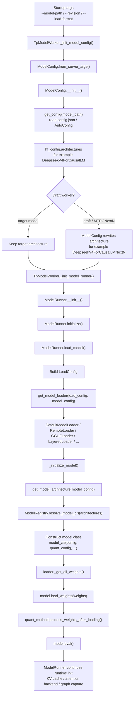

# Lesson 6: How ModelRunner Recognizes and Loads Different Models

[简体中文](../../zh/tp-worker-model-runner/06-model-loading-and-architecture-resolution.md) | **English**

This lesson answers a practical question: when SGLang starts with a model path or model name, how does `ModelRunner` know whether to instantiate `DeepseekV4ForCausalLM`, `Glm4MoeForCausalLM`, `GlmMoeDsaForCausalLM`, or fall back to a Transformers wrapper?

The short answer:

> `ModelRunner` does not branch directly on the human-facing model name string. The stable key is the HuggingFace config `architectures` field. `model_path` locates the checkpoint, `ModelConfig` reads and normalizes the config, `ModelRegistry` resolves an architecture name to a Python model class, and `ModelLoader` instantiates the model and loads weights.

---

## 0. End-to-End Overview



There are three important boundaries:

| Boundary | Input | Output | Source Functions |
|---|---|---|---|
| Args to config | `server_args.model_path`, `revision`, `json_model_override_args` | `ModelConfig`, `hf_config.architectures` | `python/sglang/srt/managers/tp_worker.py` / `TpModelWorker._init_model_config()`; `python/sglang/srt/configs/model_config.py` / `ModelConfig.from_server_args()`, `ModelConfig.__init__()` |
| Config to model class | `hf_config.architectures` | Python model class | `python/sglang/srt/model_loader/utils.py` / `get_model_architecture()`; `python/sglang/srt/models/registry.py` / `ModelRegistry.resolve_model_cls()` |
| Model class to runnable model | model class, `LoadConfig`, checkpoint weights | `self.model` | `python/sglang/srt/model_executor/model_runner.py` / `ModelRunner.load_model()`; `python/sglang/srt/model_loader/loader.py` / `get_model_loader()`, `DefaultModelLoader.load_model()`, `_initialize_model()` |

---

## 1. The Model Name Is Not the Final Dispatch Key

In conversation we often say “load DeepSeek V4”, “load GLM-4.7-Flash”, or “load GLM 5.2”. Inside SGLang's execution layer, model recognition does not start from those display names.

The key field is usually in the checkpoint `config.json`:

```json
{
  "architectures": ["DeepseekV4ForCausalLM"],
  "model_type": "...",
  "hidden_size": 7168,
  "num_hidden_layers": 61
}
```

`model_path` tells `ModelConfig` where to find this config. It may be a local path, a HuggingFace repo id, or a path used together with a remote loader. `ModelRunner` receives an already-parsed `ModelConfig`; it does not re-read the model directory by itself.

Source locations:

```text
python/sglang/srt/managers/tp_worker.py
  TpModelWorker._init_model_config()
    -> ModelConfig.from_server_args(...)

python/sglang/srt/configs/model_config.py
  ModelConfig.from_server_args(...)
    -> ModelConfig(...)

  ModelConfig.__init__(...)
    -> get_config(model_path, trust_remote_code, revision, model_override_args, ...)
    -> self.hf_config
    -> self.hf_text_config
    -> self.hf_generation_config
```

Mental model:

```text
User-provided model_path
  -> locate config.json
  -> read hf_config.architectures
  -> every later model-class decision follows architectures
```

---

## 2. TpModelWorker Chooses Target or Draft First

`TpModelWorker` adapts the `Scheduler` to the model execution layer. During initialization it creates `ModelConfig`, then creates `ModelRunner`.

Source locations:

```text
python/sglang/srt/managers/tp_worker.py
  TpModelWorker.__init__()
    -> self._init_model_config()
    -> self._init_model_runner()

  TpModelWorker._init_model_config()
    target worker:
      model_path = server_args.model_path
      revision = server_args.revision

    draft worker:
      model_path = server_args.speculative_draft_model_path
      revision = server_args.speculative_draft_model_revision

    -> ModelConfig.from_server_args(..., is_draft_model=self.is_draft_worker)

  TpModelWorker._init_model_runner()
    -> ModelRunner(model_config=self.model_config, ...)
```

Why this matters:

- Normal generation needs only the target model.
- Speculative decoding adds a draft model.
- Multi-layer EAGLE / MTP / NextN can make one worker own multiple draft `ModelRunner` instances.
- Draft models may have their `architectures` rewritten to dedicated NextN/MTP classes.

So before entering `ModelRunner`, `TpModelWorker` has already decided whether this runner is a target runner or a draft runner.

---

## 3. ModelConfig Reads and Normalizes the Config

`ModelConfig.__init__()` is the first stage of model identity resolution. It reads `config.json`, but it also derives many runtime fields used later by SGLang.

Source locations:

```text
python/sglang/srt/configs/model_config.py
  ModelConfig.__init__()
    -> self.hf_config = get_config(...)
    -> self.hf_text_config = get_hf_text_config(self.hf_config)
    -> self.hf_generation_config = get_generation_config(...)
    -> self.is_generation = is_generation_model(self.hf_config.architectures, ...)
    -> self.is_multimodal = is_multimodal_model(self.hf_config.architectures)
    -> self.is_encoder_decoder = is_encoder_decoder_model(self.hf_config.architectures)
    -> self._config_draft_model()
```

### 3.1 `json_model_override_args` Can Rewrite the Config

If startup args include `--json-model-override-args`, those values affect `hf_config` during `get_config(...)`. This is useful when adapting or debugging a new model.

Example:

```text
--json-model-override-args '{"architectures": ["TorchNativeLlamaForCausalLM"]}'
```

After that override, `ModelRegistry` sees the overridden architecture rather than the checkpoint's original value.

### 3.2 Draft Models Can Rewrite Architecture

Speculative decoding draft workers go through `ModelConfig._config_draft_model()`. This logic rewrites normal architectures into dedicated draft/MTP/NextN architectures.

Source locations:

```text
python/sglang/srt/configs/model_config.py
  ModelConfig._config_draft_model()
    DeepseekV4ForCausalLM -> DeepseekV4ForCausalLMNextN
    Glm4MoeForCausalLM -> Glm4MoeForCausalLMNextN
    Glm4MoeLiteForCausalLM -> Glm4MoeLiteForCausalLMNextN
    GlmOcrForConditionalGeneration -> GlmOcrForConditionalGenerationNextN
    MiMoForCausalLM -> MiMoMTP
    Qwen3MoeForCausalLM -> Qwen3MoeForCausalLMMTP
```

This explains a common surprise: the same model family can instantiate different Python classes in the target runner and the draft runner.

---

## 4. ModelRegistry: Architecture String to Python Class

`ModelRegistry` is the center of SGLang's model-class discovery. It does not maintain one giant handwritten mapping table. Instead, when registering the `sglang.srt.models` package, it scans model modules and reads their `EntryClass`.

Source locations:

```text
python/sglang/srt/models/registry.py
  ModelRegistry = _ModelRegistry()
  ModelRegistry.register("sglang.srt.models")

  _ModelRegistry.register(package_name)
    -> import_model_classes(package_name)

  _ModelRegistry.import_model_classes(package_name)
    -> iterate model modules in the package
    -> importlib.import_module(module_name)
    -> if the module has EntryClass:
         self.models[EntryClass.__name__] = EntryClass

  _ModelRegistry.resolve_model_cls(architectures)
    -> _normalize_archs(architectures)
    -> return the first registered model class
```

A typical model file exposes:

```python
class DeepseekV4ForCausalLM(nn.Module):
    ...

EntryClass = [DeepseekV4ForCausalLM]
```

One file can also register multiple architectures:

```python
class Glm4MoeForCausalLM(nn.Module):
    ...

class GlmMoeDsaForCausalLM(DeepseekV2ForCausalLM):
    ...

EntryClass = [Glm4MoeForCausalLM, GlmMoeDsaForCausalLM]
```

Two details matter:

- `EntryClass.__name__` must match the string in `hf_config.architectures` for the native SGLang path to resolve.
- `EntryClass` may be a single class or a list, so one source file can support multiple model architectures.

---

## 5. get_model_architecture: Native, Transformers Fallback, and External Models

The function that hands `ModelConfig` to the registry is `get_model_architecture()`.

Source locations:

```text
python/sglang/srt/model_loader/utils.py
  get_model_architecture(model_config)
    -> architectures = model_config.hf_config.architectures
    -> supported_archs = ModelRegistry.get_supported_archs()
    -> decide whether there is a native SGLang implementation
    -> optionally resolve_transformers_arch(...)
    -> ModelRegistry.resolve_model_cls(architectures)
    -> model_config._resolved_model_arch = resolved_arch
    -> model_config._resolved_model_impl = model_impl
```

It handles three common cases:

| Case | Handling | Result |
|---|---|---|
| Native SGLang support exists | Directly call `ModelRegistry.resolve_model_cls()` | Returns a native model class such as `DeepseekV4ForCausalLM` |
| User chose `model_impl=transformers`, or native support is missing but Transformers can handle it | Use `resolve_transformers_arch()` and a Transformers wrapper | Better compatibility, fewer SGLang-native optimizations |
| Unsupported everywhere | `ModelRegistry` raises unsupported architecture | Startup fails; add an implementation or fix config |

There is also an extension point:

```text
Environment variable SGLANG_EXTERNAL_MODEL_PACKAGE
  -> ModelRegistry.register(external_package, overwrite=True)
```

This lets external packages register custom model modules without modifying SGLang's main package.

---

## 6. ModelRunner.load_model Prepares the Loader and Triggers Weight Loading

`ModelRunner.initialize()` calls `self.load_model()`. At that point the model object and weights enter the current rank's device context.

Source locations:

```text
python/sglang/srt/model_executor/model_runner.py
  ModelRunner.__init__()
    -> self.initialize(...)

  ModelRunner.initialize()
    -> self.sampler = create_sampler()
    -> self.load_model()
    -> self._prepare_moe_topk()
    -> self.configure_kv_cache_dtype()
    -> self.init_memory_pool(...)
    -> self.init_attention_backend()
    -> self.kernel_warmup()
    -> self.init_device_graphs()
    -> self.init_piecewise_cuda_graphs()

  ModelRunner.load_model()
    -> self.load_config = LoadConfig(...)
    -> monkey_patch_vllm_parallel_state()
    -> self.loader = get_model_loader(self.load_config, self.model_config)
    -> self.model = self.loader.load_model(model_config, device_config)
    -> get_offloader().post_init()
    -> handle kv cache scales, sliding window, dtype, and related state
```

`LoadConfig` describes how weights should be loaded, including:

- `load_format`: auto, safetensors, pt, gguf, dummy, remote, remote instance, layered, and other formats.
- `download_dir`: download/cache location.
- `model_loader_extra_config`: loader-specific options.
- `tp_rank`: the current tensor-parallel rank, used for rank-local weight shards.
- `modelopt_config`: ModelOpt/quantization-related config.
- `draft_model_idx`: identifies the current draft model in multi-layer draft scenarios.

`ModelRunner.load_model()` does not parse every checkpoint format itself. It organizes the runtime context into `LoadConfig`, then delegates to a loader.

---

## 7. get_model_loader Selects the Weight Loader by load_format

`get_model_loader()` is the dispatch table for loading formats.

Source locations:

```text
python/sglang/srt/model_loader/loader.py
  get_model_loader(load_config, model_config)
    LoadFormat.DUMMY -> DummyModelLoader
    LoadFormat.SHARDED_STATE -> ShardedStateLoader
    LoadFormat.BITSANDBYTES -> BitsAndBytesModelLoader
    LoadFormat.GGUF -> GGUFModelLoader
    LoadFormat.LAYERED -> LayeredModelLoader
    LoadFormat.FLASH_RL -> QuantizedRLModelLoader
    LoadFormat.REMOTE -> RemoteModelLoader
    LoadFormat.REMOTE_INSTANCE -> RemoteInstanceModelLoader
    LoadFormat.PRIVATE -> private loader
    LoadFormat.RUNAI_STREAMER -> RunaiModelStreamerLoader
    regular local formats -> DefaultModelLoader
```

Most local HuggingFace/safetensors paths use `DefaultModelLoader`. Remote weight services, layered loading, GGUF, bitsandbytes, and other specialized paths use their dedicated loaders.

Loader selection and model-class selection are separate:

```text
architecture decides "which nn.Module class to instantiate"
load_format decides "how to find, shard, read, and transfer weights"
```

---

## 8. DefaultModelLoader Instantiates the Model, Then Calls load_weights

`DefaultModelLoader.load_model()` is the best loader to read first because it shows the normal loading skeleton.

Source locations:

```text
python/sglang/srt/model_loader/loader.py
  DefaultModelLoader.load_model(model_config, device_config)
    -> quant_config = _get_quantization_config(...)
    -> with set_default_torch_dtype(model_config.dtype)
    -> with target_device:
         model = _initialize_model(model_config, load_config, quant_config)
    -> self.load_weights_and_postprocess(
         model,
         self._get_all_weights(model_config, model),
         target_device,
       )
    -> return model.eval()

  _initialize_model(model_config, load_config, quant_config)
    -> model_class, resolved_arch = get_model_architecture(model_config)
    -> kwargs = {"config": model_config.hf_config, "quant_config": quant_config}
    -> add sparse-head / draft_model_idx kwargs when needed
    -> return model_class(**kwargs)

  DefaultModelLoader.load_weights_and_postprocess(model, weights, target_device)
    -> model.load_weights(weights)
    -> iterate modules:
         quant_method.process_weights_after_loading(module)
```

The important layering is:

| Step | Owner | Meaning |
|---|---|---|
| Create an empty model structure | `_initialize_model()` | Resolve `architecture -> model_cls`, then instantiate `nn.Module` |
| Locate and iterate weight files | `DefaultModelLoader._get_all_weights()` | Handle safetensors/bin/pt and related file formats |
| Assign checkpoint tensors to module parameters | `model.load_weights(weights)` | Each model class owns its checkpoint-name mapping |
| Post-process quantized weights | `quant_method.process_weights_after_loading()` | Some quantization methods need packing, reordering, or calibration |

Most model-specific differences therefore live in two places:

- The model class `__init__()` / `forward()` defines structure and computation.
- The model class `load_weights()` defines how checkpoint names map to module parameters.

---

## 9. Examples: DeepSeek V4, GLM-4.7-Flash, GLM 5/5.2

### 9.1 DeepSeek V4

If the checkpoint config contains:

```json
{
  "architectures": ["DeepseekV4ForCausalLM"]
}
```

The main path is:

```text
ModelConfig.hf_config.architectures = ["DeepseekV4ForCausalLM"]
  -> get_model_architecture()
  -> ModelRegistry.resolve_model_cls(["DeepseekV4ForCausalLM"])
  -> python/sglang/srt/models/deepseek_v4.py
       EntryClass = [DeepseekV4ForCausalLM]
  -> DefaultModelLoader._initialize_model()
       model = DeepseekV4ForCausalLM(config=hf_config, quant_config=...)
  -> model.load_weights(...)
```

DeepSeek V4 also has dedicated adaptation logic:

```text
python/sglang/srt/configs/model_config.py
  is_deepseek_v4(self.hf_config)
    -> set DeepSeek V4-derived runtime fields
    -> prepare information used later by FP4 experts, hybrid SWA, MLA/KV cache, and attention setup

  ModelConfig._config_draft_model()
    draft worker:
      DeepseekV4ForCausalLM -> DeepseekV4ForCausalLMNextN
```

So the target runner usually loads `DeepseekV4ForCausalLM`, while a draft runner may load `DeepseekV4ForCausalLMNextN` in speculative/MTP scenarios.

### 9.2 GLM-4.7-Flash

In the current source tree, the GLM-4.5 / GLM-4.6 / GLM-4.7 MoE path is concentrated in `glm4_moe.py` and `glm4_moe_nextn.py`.

Source locations:

```text
python/sglang/srt/models/glm4_moe.py
  Glm4MoeForCausalLM
  GlmMoeDsaForCausalLM
  EntryClass = [Glm4MoeForCausalLM, GlmMoeDsaForCausalLM]

python/sglang/srt/models/glm4_moe_nextn.py
  Glm4MoeForCausalLMNextN
  EntryClass = [Glm4MoeForCausalLMNextN]
```

If a GLM-4.7-Flash checkpoint says `architectures = ["Glm4MoeForCausalLM"]`, the path is:

```text
config.json architectures = ["Glm4MoeForCausalLM"]
  -> ModelRegistry
  -> Glm4MoeForCausalLM
  -> Glm4MoeForCausalLM.__init__()
  -> Glm4MoeModel / Glm4MoeDecoderLayer / Glm4MoeAttention / Glm4MoeSparseMoeBlock
  -> Glm4MoeForCausalLM.load_weights(...)
```

If it is used as a draft/MTP model, `ModelConfig._config_draft_model()` may rewrite it:

```text
Glm4MoeForCausalLM -> Glm4MoeForCausalLMNextN
```

Then execution enters `glm4_moe_nextn.py`.

### 9.3 GLM 5 / GLM 5.2

In the current repository source, there is no separately named `glm5.py` or `Glm5ForCausalLM` model file. GLM 5 DSA-related handling appears through architecture names such as `GlmMoeDsaForCausalLM`.

Relevant source signals:

```text
python/sglang/srt/server_args.py
  several branches inspect hf_config.architectures[0] == GlmMoeDsaForCausalLM

python/sglang/srt/configs/model_config.py
  several branches inspect self.hf_config.architectures for GlmMoeDsaForCausalLM

python/sglang/srt/models/glm4_moe.py
  class GlmMoeDsaForCausalLM(DeepseekV2ForCausalLM)
  EntryClass = [Glm4MoeForCausalLM, GlmMoeDsaForCausalLM]
```

So when reading GLM 5 / 5.2, do not start by searching for a “GLM5 filename”. First inspect the checkpoint's `config.json.architectures`:

```text
If architectures = ["GlmMoeDsaForCausalLM"]
  -> registry resolves GlmMoeDsaForCausalLM from glm4_moe.py

If architectures names a class that SGLang has not registered but Transformers supports
  -> SGLang may use the Transformers fallback

If architectures cannot be resolved anywhere
  -> startup fails with unsupported architecture
```

In other words, the source entry for GLM 5/5.2 depends on the checkpoint-declared architecture, not the market-facing model name.

---

## 10. After Loading, ModelRunner Still Initializes the Runtime

After the model class and weights are loaded, `ModelRunner` initialization is still not done. The second half of `ModelRunner.initialize()` prepares inference-time runtime structures.

Source locations:

```text
python/sglang/srt/model_executor/model_runner.py
  ModelRunner.initialize()
    -> self._prepare_moe_topk()
    -> self.configure_kv_cache_dtype()
    -> self.init_memory_pool(pre_model_load_memory)
    -> self.init_attention_backend()
    -> self.kernel_warmup()
    -> self.init_device_graphs()
    -> self.init_piecewise_cuda_graphs()
```

Those steps mean:

| Initialization Step | Purpose |
|---|---|
| `_prepare_moe_topk()` | Prepare MoE routing/top-k state |
| `configure_kv_cache_dtype()` | Decide whether KV cache uses FP8, BF16, FP4, or auto inference |
| `init_memory_pool()` | Create request pool and token-to-KV pool |
| `init_attention_backend()` | Select attention backend based on model and startup args |
| `kernel_warmup()` | Warm up kernels so the first real request does not pay all autotune cost |
| `init_device_graphs()` | Capture decode CUDA graph / NPU graph when available |
| `init_piecewise_cuda_graphs()` | Capture smaller local graphs for selected modules |

The full picture has two phases:

```text
Model loading:
  architecture -> model class -> checkpoint weights -> self.model

Runtime preparation:
  self.model -> KV cache -> attention backend -> graph -> forward/sampling
```

---

## 11. How to Add a New Native SGLang Model

The loading flow tells us that adding a model should not start by editing `ModelRunner`. Instead, make the model discoverable by `ModelRegistry` and make sure the loader can place weights into it.

Checklist:

| Step | Action | Location |
|---|---|---|
| 1 | Add or update a model implementation file | `python/sglang/srt/models/<new_model>.py` |
| 2 | Define the model class | `class NewModelForCausalLM(nn.Module)` |
| 3 | Expose `EntryClass` | `EntryClass = [NewModelForCausalLM]` |
| 4 | Ensure architecture name matches config | checkpoint `config.json` / `architectures` |
| 5 | Implement constructor | `__init__(self, config, quant_config, ...)` |
| 6 | Implement forward | `forward(self, input_ids, positions, forward_batch, ...)` |
| 7 | Implement weight mapping | `load_weights(self, weights)` |
| 8 | Add draft/MTP rewriting if needed | `ModelConfig._config_draft_model()` |
| 9 | Add server-args auto policy if needed | `python/sglang/srt/server_args.py` |

Minimal mental model:

```text
Do not put new model dispatch into ModelRunner.
ModelRunner only needs a runnable nn.Module.
Model-specific differences belong in sglang.srt.models.<model_file> and ModelRegistry.
```

---

## 12. Reading Tasks

Read the source in this order:

| Order | File | Function/Segment | Question to Answer |
|---:|---|---|---|
| 1 | `python/sglang/srt/managers/tp_worker.py` | `TpModelWorker._init_model_config()` | Where do target-worker and draft-worker `model_path` values come from? |
| 2 | `python/sglang/srt/configs/model_config.py` | `ModelConfig.from_server_args()`, `ModelConfig.__init__()` | Where are `hf_config` and `architectures` created? |
| 3 | `python/sglang/srt/configs/model_config.py` | `ModelConfig._config_draft_model()` | How does speculative/MTP rewrite architecture? |
| 4 | `python/sglang/srt/models/registry.py` | `ModelRegistry.register()`, `import_model_classes()`, `resolve_model_cls()` | How does `EntryClass` become an architecture-to-class mapping? |
| 5 | `python/sglang/srt/model_loader/utils.py` | `get_model_architecture()` | How are native, Transformers fallback, and MindSpore branches selected? |
| 6 | `python/sglang/srt/model_executor/model_runner.py` | `ModelRunner.load_model()` | How is `LoadConfig` created, and how is the loader called? |
| 7 | `python/sglang/srt/model_loader/loader.py` | `get_model_loader()`, `DefaultModelLoader.load_model()`, `_initialize_model()` | How does the loader instantiate the model and load weights? |
| 8 | `python/sglang/srt/models/deepseek_v4.py` | `EntryClass`, `DeepseekV4ForCausalLM.__init__()`, `load_weights()` | Where are DeepSeek V4 structure and weight mapping defined? |
| 9 | `python/sglang/srt/models/glm4_moe.py` | `Glm4MoeForCausalLM`, `GlmMoeDsaForCausalLM`, `EntryClass` | How are GLM MoE / DSA paths registered? |

---

## 13. Final Mental Model

```mermaid
flowchart LR
  A["Display name<br/>DeepSeek V4 / GLM-4.7 / GLM 5.2"] --> B["model_path"]
  B --> C["config.json"]
  C --> D["architectures"]
  D --> E["ModelConfig<br/>normalization and special rewrites"]
  E --> F["ModelRegistry<br/>architecture -> Python class"]
  F --> G["ModelLoader<br/>load_format -> weight reading strategy"]
  G --> H["model_cls(config, quant_config)"]
  H --> I["model.load_weights"]
  I --> J["ModelRunner.self.model"]
  J --> K["KV cache / attention backend / graph"]
  K --> L["forward_decode / forward_extend"]
```



Takeaway:

> Loading different models in `ModelRunner` is not primarily about checking a model name. It is about reading the config architecture, resolving that architecture through the registry, and using a loader to put checkpoint weights into the resolved Python class. The model family name is a hint; `hf_config.architectures` decides the actual source path.
