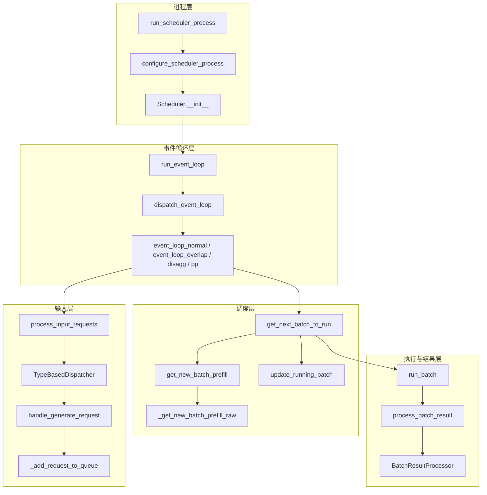

# Scheduler 架构总览

## 一句话理解

`Scheduler` 是 SGLang server 里真正决定“下一次 GPU forward 跑哪些请求”的组件。它一边从 Tokenizer/RPC 收请求，一边维护等待队列和运行中 batch，再根据 KV cache、请求优先级、chunked prefill、LoRA、grammar、disaggregation、overlap 等约束，把请求组装成 `ScheduleBatch` 交给模型 worker 执行。

源码入口：

- `python/sglang/srt/managers/scheduler.py:Scheduler.__init__`
- `python/sglang/srt/managers/scheduler.py:Scheduler.run_event_loop`
- `python/sglang/srt/managers/scheduler.py:dispatch_event_loop`

## 核心职责

1. 进程初始化：加载模型配置、并行拓扑、IPC 通道、KV cache、worker、metrics、grammar、LoRA、HiCache 等组件。
2. 请求接收：从 `request_receiver` 读取 TokenizerManager/RPC 发来的请求。
3. 请求分发：通过 `TypeBasedDispatcher` 把不同请求类型派发给不同 handler。
4. 入队与校验：把生成请求转换成 `Req`，做长度、logprob、多模态、grammar、disaggregation 等校验，然后放入 `waiting_queue` 或专用队列。
5. batch 决策：在每一轮事件循环里调用 `get_next_batch_to_run`，优先构造 prefill batch，没有 prefill 时推进 decode batch。
6. forward 执行：调用 `model_worker.forward_batch_generation` 或 embedding worker。
7. 结果处理：按 prefill/decode/prebuilt/idle 分支更新请求状态、释放缓存、发送输出。
8. 空闲维护：空闲时做 cache/invariant 检查、metrics 刷新、睡眠等待下一次事件。

## 关键状态

核心状态入口主要分散在 `Scheduler.init_running_status`、`Scheduler.init_chunked_prefill` 和 `Scheduler.init_overlap`。

| 状态 | 含义 | 谁会读写 |
| --- | --- | --- |
| `waiting_queue` | 等待被 prefill 的 `Req` 列表 | `_add_request_to_queue` 写入，`_get_new_batch_prefill_raw` 消费 |
| `running_batch` | 已完成 prefill、正在 decode 或等待 decode 的 batch | `get_next_batch_to_run` 合并 prefill 结果，`update_running_batch` 推进 |
| `cur_batch` | 当前这一轮准备执行或正在执行的 batch | event loop 设置，结果处理时读取 |
| `last_batch` | 上一轮执行过的 batch | overlap/normal loop 用它把 extend batch 合并进 running batch |
| `chunked_req` | 被切分 prefill 的大请求，初始化于 `init_chunked_prefill` | `PrefillAdder` 创建或继续调度 |
| `result_queue` | overlap 模式下暂存已经 launch 但尚未处理的结果，初始化于 `init_overlap`/`event_loop_overlap` | `event_loop_overlap` 维护 |
| `return_health_check_ipcs` | 忙碌时延迟返回的健康检查请求 | `process_input_requests` 写入，`maybe_send_health_check_signal` 消费 |

## 主要协作者

| 组件 | 文件/函数 | 在 Scheduler 中的角色 |
| --- | --- | --- |
| `Req` | `schedule_batch.py:Req` | 单个生成/embedding 请求的运行时状态，包括输入 token、输出 token、采样参数、缓存位置、完成状态 |
| `ScheduleBatch` | `schedule_batch.py:ScheduleBatch` | 一次 GPU forward 的 batch 容器，保存 req 列表、forward mode、token 张量、KV cache 索引等 |
| `SchedulePolicy` | `schedule_policy.py:SchedulePolicy.calc_priority` | 给等待队列排序，决定请求调度优先级 |
| `PrefillAdder` | `schedule_policy.py:PrefillAdder.add_one_req` | 在 token/request/KV cache 预算下挑选能进入下一次 prefill 的请求 |
| `BatchResultProcessor` | `scheduler_components/batch_result_processor.py` | 处理模型 forward 结果，更新请求状态并发送输出 |
| `tree_cache` | KV/Radix/HiCache 相关实现 | 负责 prefix cache 命中、缓存插入、缓存释放、HiCache 异步事件 |
| `model_worker` | Scheduler 初始化时创建 | 真正执行 generation/embedding forward |
| `grammar_manager` | Scheduler 初始化时创建 | 结构化输出 grammar 的等待、准备、abort 与采样同步 |
| `ipc_channels` | Scheduler 初始化时创建 | 与 tokenizer、detokenizer、RPC 进程通信 |

## Scheduler 的层次



## 最重要的设计点

### 1. Continuous batching

Scheduler 不会等一批请求全部完成才接收新请求。每一轮循环都会先收新请求，再决定是否优先跑 prefill；如果没有合适的 prefill，就继续 decode 已在运行的请求。

关键函数：

- `scheduler.py:Scheduler.event_loop_normal`
- `scheduler.py:Scheduler.get_next_batch_to_run`
- `scheduler.py:Scheduler._get_new_batch_prefill_raw`
- `scheduler.py:Scheduler.update_running_batch`

### 2. Prefill 优先，但受预算约束

新请求必须先走 prefill，把 prompt 写进 KV cache。`PrefillAdder` 会根据可用请求槽、可用 KV cache token、chunked prefill、LoRA 限制、优先级抢占等条件，决定哪些请求能进入当前 prefill batch。

### 3. Decode 是 running_batch 的持续推进

完成 prefill 的请求会进入 `running_batch`。decode 阶段每轮通常为每个未完成请求生成新 token；如果 KV cache 不够，`update_running_batch` 会撤回一部分请求，把它们重新放回等待队列。

### 4. Overlap 模式把“发起 forward”和“处理上轮结果”拆开

普通模式是：

```text
选 batch -> run_batch -> process_batch_result -> 下一轮
```

Overlap 模式是：

```text
处理上轮必要结果 -> 发起本轮 forward -> 再处理上一轮结果 -> 延迟采样 -> 下一轮
```

这样 Scheduler 的 CPU 侧准备工作可以和 GPU forward 部分重叠，但也需要 `future_map`、stream 同步和 `result_queue` 保证数据生命周期正确。
