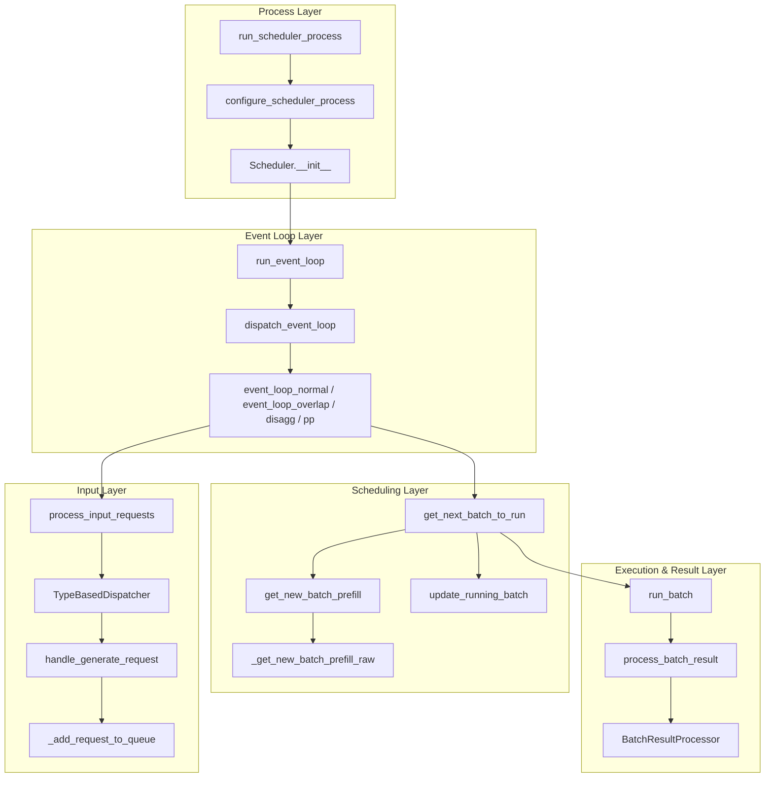

[中文](./01-architecture.md) | [English](./01-architecture_EN.md)

# Scheduler Architecture Overview

## One-Sentence Summary

The `Scheduler` is the component in an SGLang server that truly decides "which requests the next GPU forward should run." It receives requests from Tokenizer/RPC on one side, maintains a waiting queue and running batch, then assembles requests into a `ScheduleBatch` based on KV cache, request priority, chunked prefill, LoRA, grammar, disaggregation, overlap, and other constraints, and hands them off to the model worker for execution.

Source entry points:

- `python/sglang/srt/managers/scheduler.py:Scheduler.__init__`
- `python/sglang/srt/managers/scheduler.py:Scheduler.run_event_loop`
- `python/sglang/srt/managers/scheduler.py:dispatch_event_loop`

## Core Responsibilities

1. Process initialization: Load model config, parallel topology, IPC channels, KV cache, worker, metrics, grammar, LoRA, HiCache, and other components.
2. Request reception: Read requests from TokenizerManager/RPC via `request_receiver`.
3. Request dispatch: Route different request types to different handlers via `TypeBasedDispatcher`.
4. Enqueue & validation: Convert generation requests to `Req`, perform length, logprob, multimodal, grammar, and disaggregation validation, then place into `waiting_queue` or dedicated queues.
5. Batch decision: In each event loop iteration, call `get_next_batch_to_run`, prioritize constructing prefill batches; when no prefill is available, advance decode batches.
6. Forward execution: Call `model_worker.forward_batch_generation` or embedding worker.
7. Result processing: Branch by prefill/decode/prebuilt/idle to update request state, release cache, and send output.
8. Idle maintenance: When idle, perform cache/invariant checks, refresh metrics, sleep waiting for next event.

## Key State

Core state initialization is spread across `Scheduler.init_running_status`, `Scheduler.init_chunked_prefill`, and `Scheduler.init_overlap`.

| State | Meaning | Who Reads/Writes |
| --- | --- | --- |
| `waiting_queue` | List of `Req` waiting to be prefilled | `_add_request_to_queue` writes, `_get_new_batch_prefill_raw` consumes |
| `running_batch` | Batch that has completed prefill and is currently decoding or waiting to decode | `get_next_batch_to_run` merges prefill results, `update_running_batch` advances |
| `cur_batch` | The batch being prepared or executed in the current round | Event loop sets, result processing reads |
| `last_batch` | The batch executed in the previous round | Overlap/normal loop uses it to merge extend batch into running batch |
| `chunked_req` | Large request with split prefill, initialized in `init_chunked_prefill` | `PrefillAdder` creates or continues scheduling |
| `result_queue` | In overlap mode, stores results that have been launched but not yet processed | `event_loop_overlap` maintains |
| `return_health_check_ipcs` | Health check requests deferred when busy | `process_input_requests` writes, `maybe_send_health_check_signal` consumes |

## Main Collaborators

| Component | File/Function | Role in Scheduler |
| --- | --- | --- |
| `Req` | `schedule_batch.py:Req` | Runtime state for a single generation/embedding request |
| `ScheduleBatch` | `schedule_batch.py:ScheduleBatch` | Batch container for one GPU forward |
| `SchedulePolicy` | `schedule_policy.py:SchedulePolicy.calc_priority` | Orders waiting queue, determines scheduling priority |
| `PrefillAdder` | `schedule_policy.py:PrefillAdder.add_one_req` | Selects requests that fit into the next prefill batch |
| `BatchResultProcessor` | `scheduler_components/batch_result_processor.py` | Processes model forward results, updates request state, sends output |
| `tree_cache` | KV/Radix/HiCache implementations | Manages prefix cache hits, insertions, evictions, HiCache async events |
| `model_worker` | Created during Scheduler init | Actually executes generation/embedding forward |
| `grammar_manager` | Created during Scheduler init | Manages structured output grammar waiting, preparation, abort, and sampling sync |
| `ipc_channels` | Created during Scheduler init | Communicates with tokenizer, detokenizer, and RPC processes |

## Scheduler Layers



## Key Design Points

### 1. Continuous Batching

The Scheduler does not wait for an entire batch of requests to complete before accepting new ones. Every loop iteration first receives new requests, then decides whether to prioritize prefill; if no suitable prefill exists, it continues decoding requests already in progress.

Key functions:

- `scheduler.py:Scheduler.event_loop_normal`
- `scheduler.py:Scheduler.get_next_batch_to_run`
- `scheduler.py:Scheduler._get_new_batch_prefill_raw`
- `scheduler.py:Scheduler.update_running_batch`

### 2. Prefill First, Budget-Constrained

New requests must first go through prefill to write prompts into KV cache. `PrefillAdder` decides which requests can enter the current prefill batch based on available request slots, available KV cache tokens, chunked prefill, LoRA constraints, and priority preemption.

### 3. Decode as Continuous Advancement of Running Batch

Requests that complete prefill enter `running_batch`. During decode, each round typically generates one new token per incomplete request. If KV cache is insufficient, `update_running_batch` retracts some requests, placing them back into the waiting queue.

### 4. Overlap Mode Separates "Launch Forward" from "Process Previous Results"

Normal mode:

```
select batch -> run_batch -> process_batch_result -> next round
```

Overlap mode:

```
process previous required results -> launch current forward -> process previous results again -> delayed sampling -> next round
```

This allows the Scheduler's CPU-side preparation work to partially overlap with GPU forward execution, but requires `future_map`, stream synchronization, and `result_queue` to ensure correct data lifetimes.
