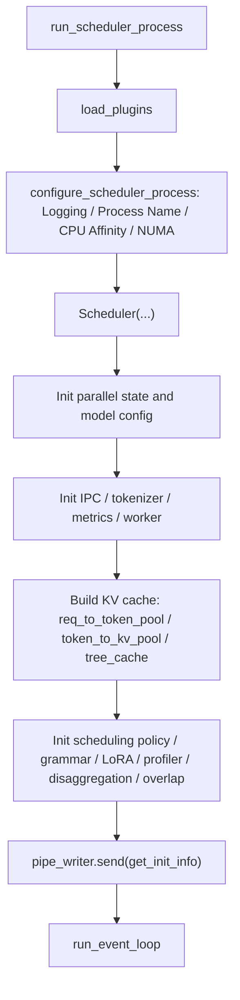
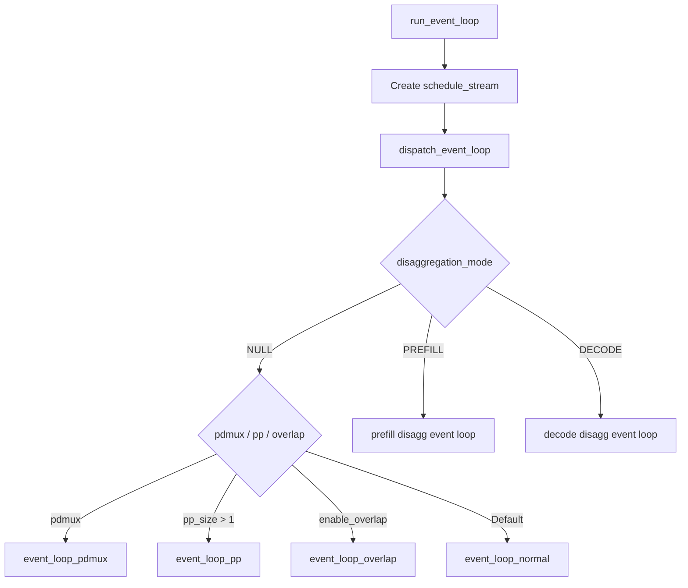
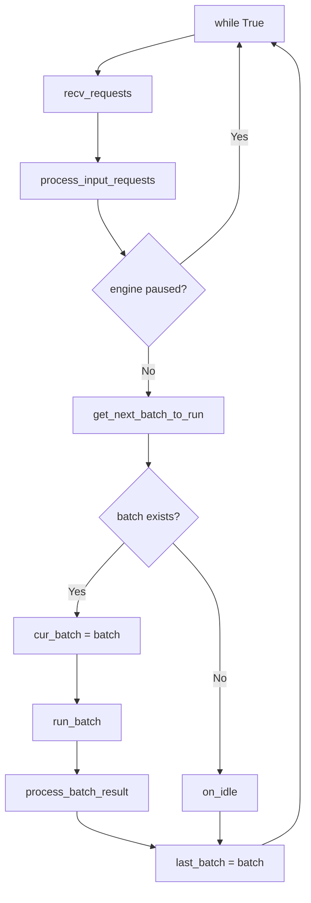
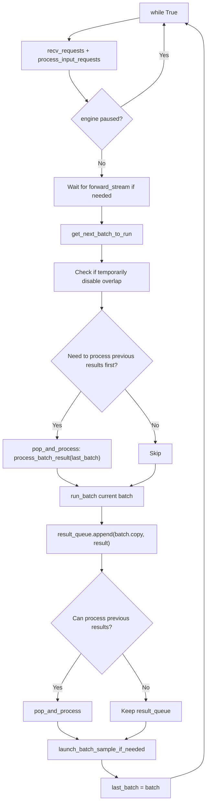
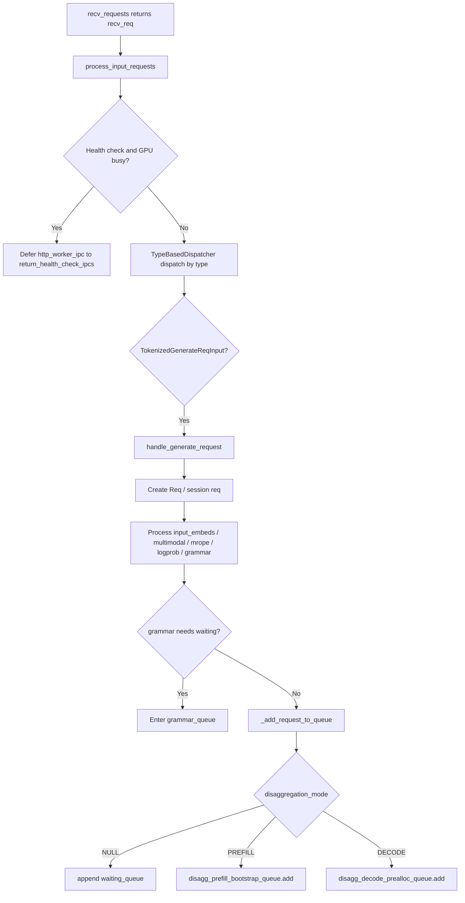
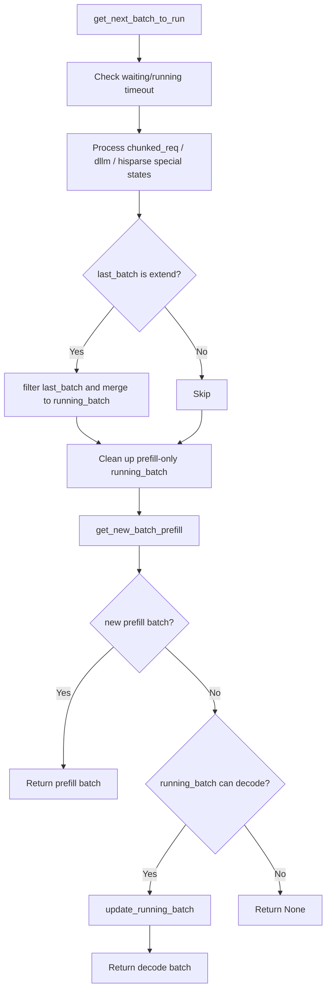
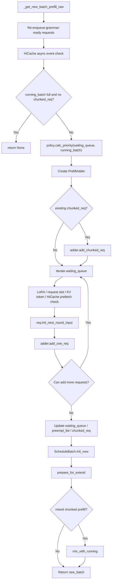
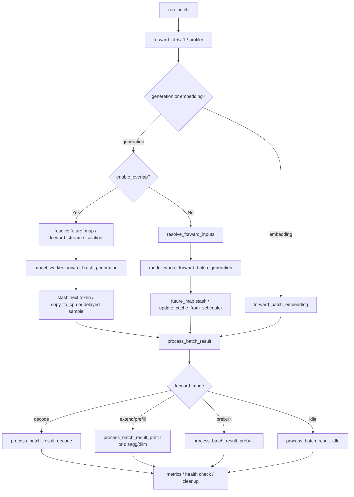

[中文](./02-flowcharts.md) | [English](./02-flowcharts_EN.md)

# Scheduler Flowcharts

## 1. Scheduler Process Startup

Corresponding source:

- `python/sglang/srt/managers/scheduler.py:run_scheduler_process`
- `python/sglang/srt/managers/scheduler.py:configure_scheduler_process`
- `python/sglang/srt/managers/scheduler.py:Scheduler.__init__`
- `python/sglang/srt/managers/scheduler.py:Scheduler.run_event_loop`

## 2. Event Loop Dispatch

Corresponding source:

- `scheduler.py:Scheduler.run_event_loop`
- `scheduler.py:dispatch_event_loop`

## 3. Normal Event Loop

Corresponding source: `scheduler.py:Scheduler.event_loop_normal`

## 4. Overlap Event Loop

Corresponding source:

- `scheduler.py:Scheduler.event_loop_overlap`
- `scheduler.py:Scheduler.is_disable_overlap_for_batch`
- `scheduler.py:Scheduler.launch_batch_sample_if_needed`

## 5. Input Request to waiting_queue

Corresponding source:

- `scheduler.py:Scheduler.process_input_requests`
- `scheduler.py:Scheduler.init_request_dispatcher`
- `scheduler.py:Scheduler.handle_generate_request`
- `scheduler.py:Scheduler._add_request_to_queue`

## 6. get_next_batch_to_run Decision

Corresponding source:

- `scheduler.py:Scheduler.get_next_batch_to_run`
- `scheduler.py:Scheduler.get_new_batch_prefill`
- `scheduler.py:Scheduler._get_new_batch_prefill_raw`
- `scheduler.py:Scheduler.update_running_batch`

## 7. Prefill Batch Construction

Corresponding source: `scheduler.py:Scheduler._get_new_batch_prefill_raw`

## 8. run_batch and Result Processing

Corresponding source:

- `scheduler.py:Scheduler.run_batch`
- `scheduler.py:Scheduler.process_batch_result`
- `scheduler_components/batch_result_processor.py:process_batch_result_prefill`
- `scheduler_components/batch_result_processor.py:process_batch_result_decode`

