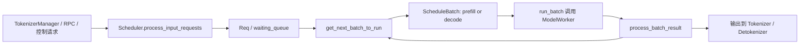

# Scheduler 架构专题

本目录专门讲解 `python/sglang/srt/managers/scheduler.py`。目标不是复制完整源码，而是把 Scheduler 的职责、关键状态、主循环、请求入队、prefill/decode 调度、forward 执行、结果处理这些路径拆开讲清楚。

## 阅读顺序

1. [01-architecture.md](./01-architecture.md)：先建立 Scheduler 的整体架构图和核心对象表。
2. [02-flowcharts.md](./02-flowcharts.md)：用 Mermaid 流程图梳理从进程启动到请求完成的主路径。
3. [03-annotated-code-walkthrough.md](./03-annotated-code-walkthrough.md)：教学版代码导读，使用关键代码骨架加中文注释解释每一段在做什么。
4. [04-function-map.md](./04-function-map.md)：按函数索引 Scheduler 的主要入口、状态变化和下一跳。

## 关键源码

- `python/sglang/srt/managers/scheduler.py`：Scheduler 主体。
- `python/sglang/srt/managers/schedule_batch.py`：`Req` 与 `ScheduleBatch` 数据结构。
- `python/sglang/srt/managers/schedule_policy.py`：`SchedulePolicy` 与 `PrefillAdder`。
- `python/sglang/srt/managers/scheduler_components/batch_result_processor.py`：batch 结果处理与输出发送。

## 学习主线

Scheduler 可以理解成 SGLang 运行时的 GPU 调度中枢：

