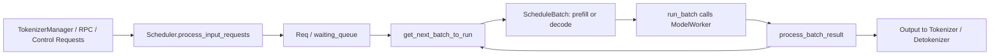

[中文](./README.md) | [English](./README_EN.md)

# Scheduler Architecture Topic

This directory is dedicated to explaining `python/sglang/srt/managers/scheduler.py`. The goal is not to replicate the complete source code, but to clearly break down the Scheduler's responsibilities, key states, main loop, request enqueueing, prefill/decode scheduling, forward execution, and result processing paths.

## Reading Order

1. [01-architecture.md](./01-architecture.md): First establish the overall architecture diagram and core object table of the Scheduler.
2. [02-flowcharts.md](./02-flowcharts.md): Use Mermaid flowcharts to trace the main path from process startup to request completion.
3. [03-annotated-code-walkthrough.md](./03-annotated-code-walkthrough.md): Educational code walkthrough using key code skeletons with Chinese annotations explaining each section.
4. [04-function-map.md](./04-function-map.md): Index Scheduler's main entry points, state changes, and next hops by function.
5. [05-scheduler-annotated-cn.py](./05-scheduler-annotated-cn.py): Annotated full copy of `scheduler.py` with Chinese block-level comments; for learning cross-reference only, not for execution.

## Key Source Files

- `python/sglang/srt/managers/scheduler.py`: Scheduler main body.
- `python/sglang/srt/managers/schedule_batch.py`: `Req` and `ScheduleBatch` data structures.
- `python/sglang/srt/managers/schedule_policy.py`: `SchedulePolicy` and `PrefillAdder`.
- `python/sglang/srt/managers/scheduler_components/batch_result_processor.py`: Batch result processing and output sending.

## Learning Main Thread

The Scheduler can be understood as SGLang's runtime GPU scheduling hub:

