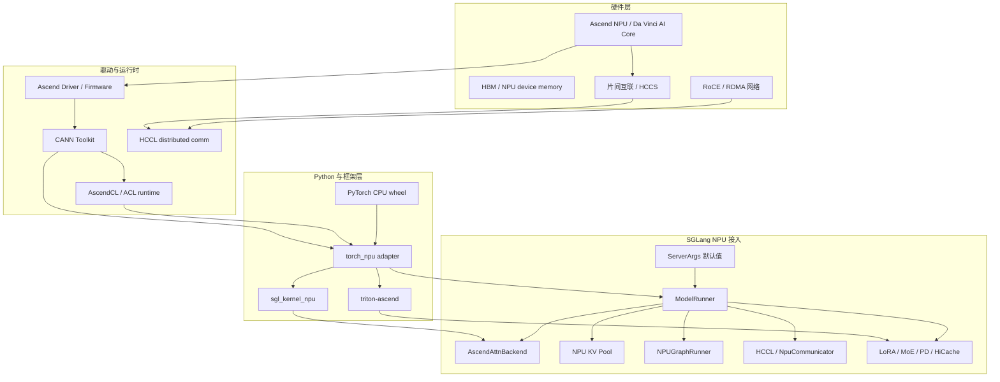
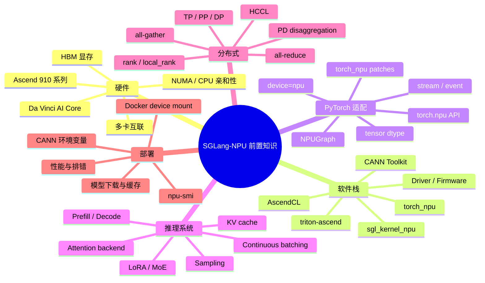
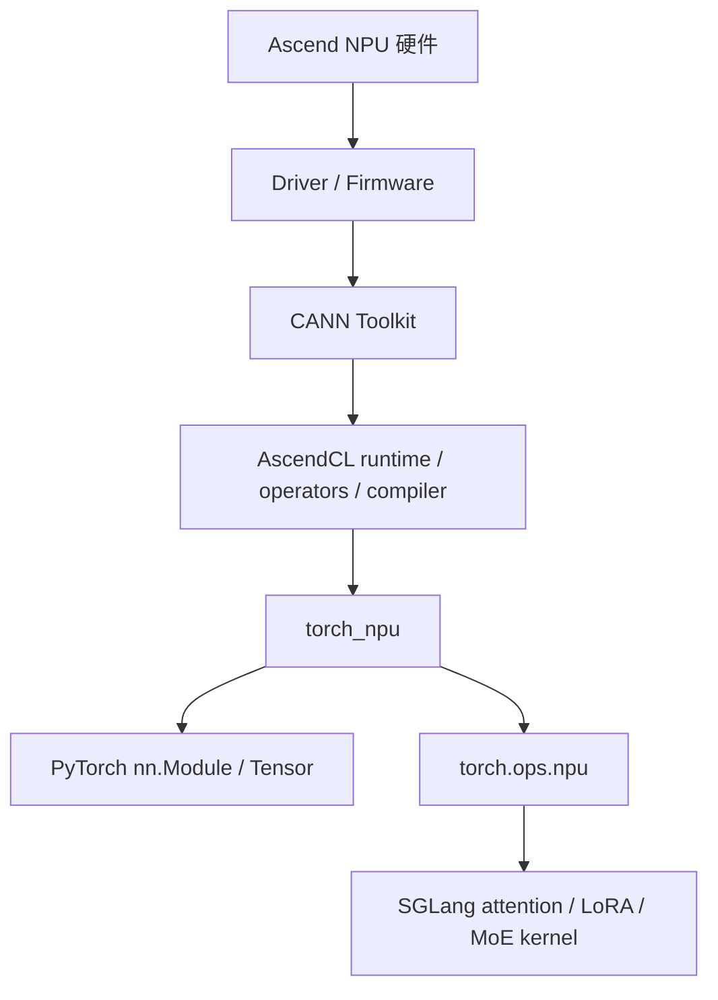
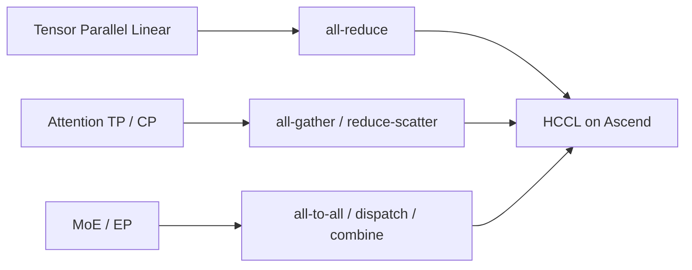
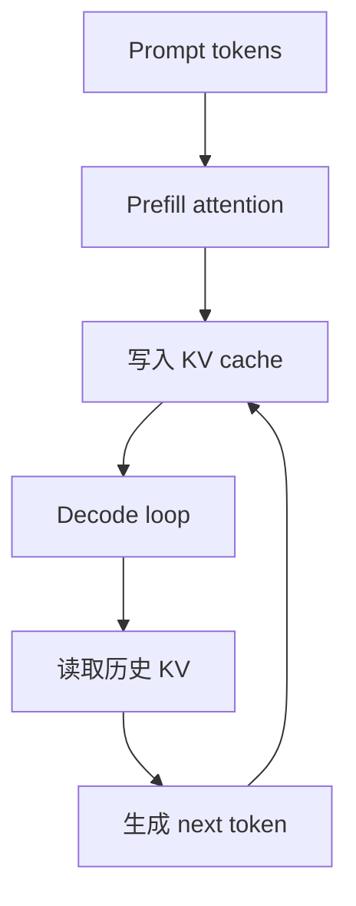
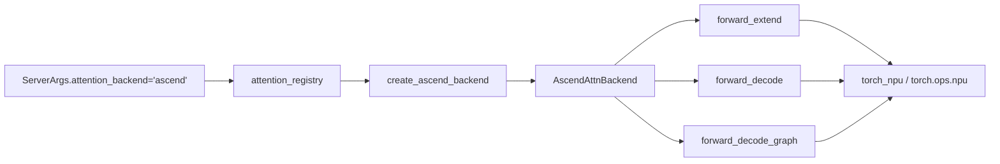

# 00. Ascend NPU 背景知识

这一讲回答一个前置问题：**在真正阅读 SGLang 的 NPU 代码、部署 SGLang 服务之前，需要先理解 Ascend NPU 这套软硬件栈里有哪些对象，它们和 CUDA/GPU serving 的差异在哪里。**

如果只想跑服务，可以先看 `01-environment-and-install.md`。如果想读源码，这一讲最好先过一遍，否则看到 `torch_npu`、`CANN`、`HCCL`、`acl_format`、`NPUGraph`、`ASCEND_MF_TRANSFER_PROTOCOL` 这些词时，很容易把“框架层问题”和“设备后端问题”混在一起。

## 总览



一句话理解：**Ascend NPU 不是 CUDA 设备，SGLang 需要通过 CANN + torch_npu + sgl_kernel_npu 把 PyTorch 模型执行、attention kernel、KV cache、graph capture 和分布式通信映射到 NPU 后端。**

## 你需要掌握的知识地图



## 1. Ascend NPU 是什么

Ascend NPU 是华为昇腾 AI 加速器。对 SGLang 这种 LLM serving 框架来说，你可以先把它理解为“承载 Transformer 前向计算的设备”，但它和 NVIDIA CUDA GPU 的差异很大：

| 维度 | CUDA GPU 直觉 | Ascend NPU 直觉 |
|---|---|---|
| 设备 API | `torch.cuda`、CUDA Runtime | `torch.npu`、AscendCL/CANN |
| PyTorch 适配 | PyTorch 原生 CUDA backend | `torch_npu` 作为 PyTorch NPU 适配层 |
| 通信 | NCCL | HCCL |
| kernel | CUDA/Triton/CUTLASS/FlashInfer | CANN operator、`torch.ops.npu`、`sgl_kernel_npu`、triton-ascend |
| graph | CUDA Graph | NPU Graph，即 `torch.npu.NPUGraph` |
| 权重/张量格式 | 常见 contiguous layout | 可能需要 ACL format，例如 ND、FRACTAL_NZ |
| 常见瓶颈 | kernel launch、HBM、NCCL、attention | kernel backend、tensor format、HCCL、graph capture、KV layout |

读 SGLang-NPU 源码时，不要把所有变量名里的 `cuda` 都理解成 CUDA。SGLang 很多通用接口历史上沿用 `cuda_graph`、`gpu_id`、`cuda_graph_max_bs` 这类名字，但在 NPU 场景里实际会映射到 NPU graph、NPU device 和 NPU 后端。

## 2. CANN、Driver、Firmware、torch_npu 的关系

Ascend 软件栈可以按下面理解：



关键组件：

| 组件 | 你需要知道什么 |
|---|---|
| Ascend Driver / Firmware | 让系统识别 NPU 设备，`npu-smi info` 能看到设备是第一步。 |
| CANN Toolkit | 提供 Ascend 编译器、运行时、算子库、HCCL 等能力。 |
| AscendCL / ACL | 更底层的运行时接口，SGLang 不直接大量写 ACL，但 tensor format 和 kernel 行为会受它影响。 |
| PyTorch | SGLang 模型执行的上层框架。官方 NPU 安装路径通常使用 PyTorch CPU wheel 加 `torch_npu`。 |
| `torch_npu` | PyTorch 到 Ascend 的适配层，提供 `torch.npu`、NPU profiler、NPU graph、NPU operator。 |
| `sgl_kernel_npu` | SGLang 面向 Ascend 的专用 kernel 包，例如 attention、LoRA、MoE、Mamba/GDN 相关算子。 |
| `triton-ascend` | Ascend 版本 Triton 支持，用于部分 JIT/fallback/kernel 路径。 |

## 3. NPU 设备模型

在 SGLang 里你会看到这些概念：

| 名称 | 含义 |
|---|---|
| `device=npu` | 运行时设备类型，和 `cuda`、`cpu` 平级。 |
| `gpu_id` / `base-gpu-id` | 历史命名，NPU 场景里通常表示本进程绑定的 NPU device id。 |
| `rank` | 分布式全局进程编号。 |
| `local_rank` | 当前机器内的设备编号。 |
| `tp_rank` | tensor parallel 组内 rank。 |
| `tp_size` | tensor parallel 切分大小。 |
| `pp_rank` | pipeline parallel stage 编号。 |
| `attention_backend=ascend` | SGLang 使用 Ascend attention backend，而不是 CUDA/FlashInfer/Triton 后端。 |

部署时最先确认三件事：

```bash
npu-smi info
python - <<'PY'
import torch
import torch_npu
print("torch:", torch.__version__)
print("torch_npu:", torch_npu.__version__)
print("npu available:", torch.npu.is_available())
print("npu count:", torch.npu.device_count())
if torch.npu.is_available():
    print("device 0:", torch.npu.get_device_name(0))
PY
```

如果这里不通，SGLang 不可能正常启动。

## 4. HCCL 与多卡通信

SGLang 多卡推理依赖 tensor parallel、pipeline parallel、expert parallel 等机制。这些机制底层需要 collective communication。

在 CUDA 生态里常见的是 NCCL；在 Ascend 生态里对应的是 HCCL。



SGLang 里的关键源码：

- `python/sglang/srt/distributed/parallel_state.py`
- `python/sglang/srt/distributed/device_communicators/npu_communicator.py`

你需要理解：

- 单卡先不需要关心 HCCL 性能，但仍可能初始化 HCCL 相关组件。
- 多卡 TP 时，rank 与 device 的绑定非常重要。
- 网络和 HCCS/RDMA 配置不对时，模型可能能加载，但第一次 collective 卡住或报错。
- SGLang NPU 默认会关闭 CUDA custom all-reduce，因为那套实现不适用于 NPU。

## 5. Prefill、Decode 与 KV Cache

LLM serving 中最重要的两个阶段：

| 阶段 | 做什么 | 对 NPU 的影响 |
|---|---|---|
| Prefill / Extend | 一次性处理 prompt token，写入 KV cache | 大量 attention 计算，显存峰值高，长 prompt 需要 chunked prefill。 |
| Decode | 每轮为每个请求生成 1 个或少量 token | 对低延迟、graph replay、KV cache 读取效率要求高。 |



SGLang-NPU 中，KV cache 不是普通 PyTorch tensor 随便放一下就完事。它涉及：

- page size，NPU 默认通常设为 `128`。
- MHA/MLA 不同 KV layout。
- `NPUMHATokenToKVPool`、`NPUMLATokenToKVPool`。
- `NPUPagedTokenToKVPoolAllocator`。
- HiCache 打开时的 `kernel_ascend` backend 和特定 layout。

## 6. Attention Backend 为什么是核心

Transformer 推理里 attention 是最核心的 kernel 路径之一。SGLang 在 CUDA 上可选 FlashInfer、Triton、FlashAttention、TRT-LLM 等后端；在 Ascend 上要切到 `ascend`。

SGLang-NPU 的 attention 核心是：

- 注册入口：`python/sglang/srt/layers/attention/attention_registry.py`
- 实现入口：`python/sglang/srt/hardware_backend/npu/attention/ascend_backend.py`
- 主类：`AscendAttnBackend`



阅读时重点抓住：

- `ForwardBatch` 是通用执行输入。
- `ForwardMetadata` 是 Ascend attention 需要的设备侧 metadata。
- `forward_extend()` 对应 prefill/extend。
- `forward_decode()` 对应 decode。
- `forward_decode_graph()` 对应 graph replay 下的 decode。

## 7. NPU Graph

NPU Graph 类似 CUDA Graph：对固定形状的计算图进行 capture，然后 replay，减少调度和 launch 开销。

SGLang 里 NPU graph 相关路径：

- `python/sglang/srt/hardware_backend/npu/graph_runner/npu_graph_runner.py`
- `python/sglang/srt/compilation/npu_piecewise_backend.py`

需要理解的概念：

| 概念 | 解释 |
|---|---|
| warmup | capture 前先跑一两次，让内存和算子状态稳定。 |
| capture | 用 `torch.npu.graph(...)` 捕获固定 shape 前向路径。 |
| replay | 后续相同 shape 直接 replay。 |
| static buffer | graph replay 要求输入地址稳定，所以很多输入需要预分配并原地更新。 |
| `cuda_graph_max_bs` | 名字沿用 CUDA，但 NPU 下会影响 NPU graph capture batch size。 |

## 8. Tensor Format 与 FRACTAL_NZ

Ascend 上有一些设备友好的 tensor format，例如 `FRACTAL_NZ`。SGLang 里可以看到：

- `NPUACLFormat`
- `npu_format_cast(...)`
- `_is_nz_aligned(...)`

直觉上：

- 普通 PyTorch tensor 通常是 ND 格式。
- 某些 NPU 算子在 FRACTAL_NZ 格式下更高效。
- 不是所有 shape 都能转 NZ，维度需要满足对齐要求。
- 如果 shape 不满足，SGLang 会跳过转换并提示可能影响性能。

这会影响权重加载、量化权重、MoE 权重、MLA 预处理等路径。

## 9. PD Disaggregation 与 MemFabric-Hybrid

PD disaggregation 是把 Prefill 和 Decode 分到不同 worker 或不同节点执行，中间传输 KV cache。


Ascend NPU 下 SGLang 使用：

- `AscendTransferEngine`
- `AscendKVManager`
- `ASCEND_MF_STORE_URL`
- `ASCEND_MF_TRANSFER_PROTOCOL`
- `memfabric-hybrid`

初学阶段可以先跳过 PD 分离。先跑通单机单进程，再跑 TP，多卡稳定后再看 PD。

## 10. LoRA、MoE、量化与多模态

这些属于第二阶段知识，但你需要知道它们在 NPU 上可能有专门后端：

| 特性 | NPU 相关入口 |
|---|---|
| LoRA | `AscendLoRABackend`，使用 `torch.ops.npu.sgmv_shrink` / `sgmv_expand`。 |
| MoE | `hardware_backend/npu/moe/*`、`fused_moe_method_npu.py`。 |
| GPTQ/AWQ | `GPTQAscend*`、`AWQAscend*` kernel。 |
| Mamba/GDN/hybrid linear attention | `ascend_hybrid_linear_attn_backend.py`、`ascend_gdn_backend.py`。 |
| 多模态 | Qwen/GLM VL processor patch、ViT NPU graph、`mm-attention-backend ascend_attn`。 |

## 11. 和 CUDA 经验的主要差异

| 如果你熟悉 CUDA | 迁移到 Ascend NPU 时要换成 |
|---|---|
| `nvidia-smi` | `npu-smi info` |
| CUDA Toolkit | CANN Toolkit |
| NCCL | HCCL |
| `torch.cuda` | `torch.npu` / `torch_npu` |
| CUDA Graph | `torch.npu.NPUGraph` |
| FlashInfer/Triton attention | `attention_backend=ascend` |
| CUDA custom all-reduce | NPU 下通常禁用 |
| CUDA kernel package | `sgl_kernel_npu` |
| CUDA profiling | `torch_npu.profiler` |

## 12. 学习检查清单

进入 `01-environment-and-install.md` 之前，确认你能回答这些问题：

- `CANN` 和 `torch_npu` 分别处在哪一层？
- `torch.npu.is_available()` 失败时，应该先排查 SGLang 还是先排查驱动/CANN？
- 为什么 SGLang 在 NPU 上要把 `attention_backend` 设为 `ascend`？
- `Prefill` 和 `Decode` 对 KV cache 的访问模式有什么不同？
- `HCCL` 在多卡 TP 中承担什么角色？
- 为什么 graph capture 需要固定 shape 和稳定的输入地址？
- `ASCEND_MF_STORE_URL` 属于普通单卡 serving，还是 PD disaggregation？

如果这些问题能说清楚，读 SGLang-NPU 源码和部署文档会顺很多。

## 参考资料

- SGLang 官方 Ascend NPU 安装文档：https://docs.sglang.io/platforms/ascend_npu.html
- SGLang 本仓库源码入口：`python/sglang/srt/hardware_backend/npu/`
- SGLang NPU 接入图谱：`learning/sglang-ascend-npu/02-ascend-npu-integration-map.md`
