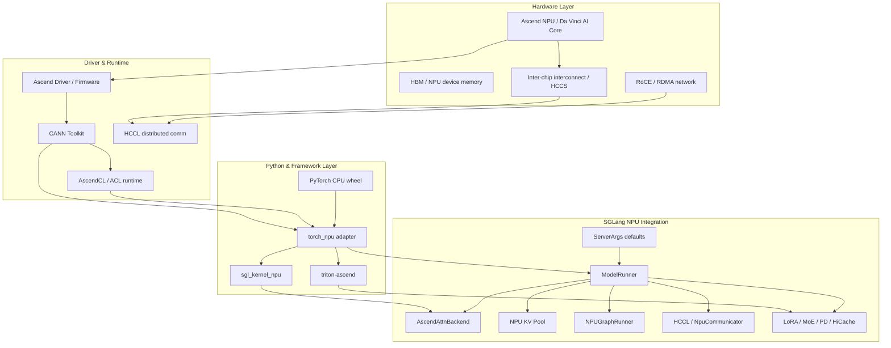

[中文](./00-background.md) | [English](./00-background_EN.md)

# 00. Ascend NPU Background

This lecture answers a prerequisite question: **before reading SGLang's NPU code or deploying SGLang services, you need to understand what objects exist in the Ascend NPU hardware/software stack and how they differ from CUDA/GPU serving.**

If you just want to run services, start with `01-environment-and-install.md`. If you want to read source code, this lecture is recommended first — otherwise, when you encounter terms like `torch_npu`, `CANN`, `HCCL`, `acl_format`, `NPUGraph`, `ASCEND_MF_TRANSFER_PROTOCOL`, it's easy to confuse "framework-layer issues" with "device backend issues."

## Overview

## Key Differences from CUDA/GPU

| Concept | CUDA/GPU | Ascend NPU |
|---|---|---|
| Device runtime | CUDA Runtime / Driver API | CANN (Compute Architecture for Neural Networks) |
| Device library | cuBLAS, cuDNN | ACL (Ascend Compute Language) |
| Collective comm | NCCL | HCCL (Huawei Collective Communication Library) |
| Python adapter | `torch.cuda` | `torch_npu` |
| Kernel language | CUDA C++, Triton | Ascend C, Triton-Ascend |
| Graph capture | `torch.cuda.CUDAGraph` | `torch.npu.NPUGraph` |
| Tensor layout | NCHW, NHWC | FRACTAL_NZ, NCHW, ND (5D formats) |
| Custom kernels | `sgl-kernel` (CUDA) | `sgl-kernel-npu` (Ascend) |

## Prerequisite Knowledge Check

Before diving into SGLang NPU source code, verify:
- [ ] Understand `is_npu()` detection mechanism
- [ ] Know CANN version compatibility with `torch_npu`
- [ ] Understand HCCL vs NCCL communication patterns
- [ ] Know NPU memory hierarchy (HBM, L2, L1, UB)
- [ ] Understand `acl_format` and why FRACTAL_NZ is used
- [ ] Know `NPUGraph` capture/replay constraints
