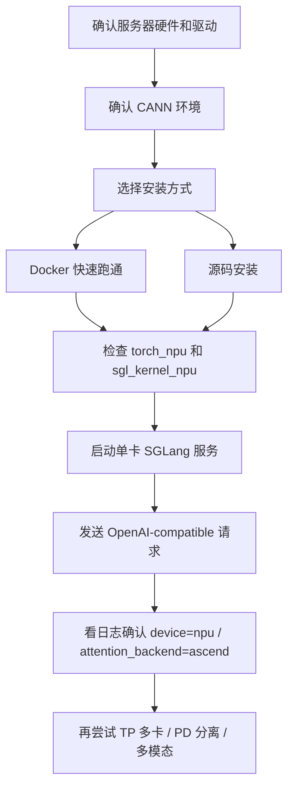
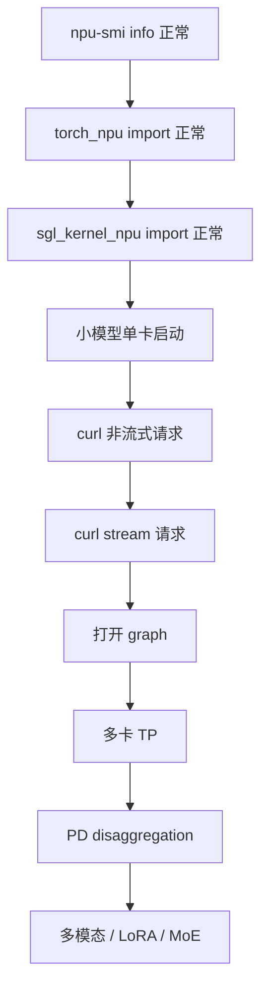

# 01. 安装与环境：GNU/Linux + Ascend NPU 服务器上跑通 SGLang

这一讲面向一台已经具备 GNU/Linux + Ascend NPU 的服务器，目标是从 0 到 1 跑通 SGLang NPU serving。

本文按两个路径写：

- **路径 A：Docker 快速跑通**。适合你只是想先启动服务、验证模型能跑。
- **路径 B：源码环境安装**。适合你要读源码、改源码、调试 SGLang NPU 后端。

官方 Ascend NPU 文档当前推荐的关键组合包括 Python 3.11、CANN 8.5.0、PyTorch/torch_npu 2.8.0、triton-ascend、memfabric-hybrid 1.0.5。具体版本必须和你的服务器 HDK、驱动、CANN、torch_npu 适配关系一致。

## 总流程



## 0. 服务器侧检查

先登录服务器，确认设备和系统状态。

```bash
uname -a
cat /etc/os-release
npu-smi info
npu-smi info -t topo
```

你至少要看到：

- NPU 设备存在。
- 设备 Health/Status 正常。
- 每张卡有对应 device id。
- 多卡机器能看到拓扑信息。

如果 `npu-smi` 不存在或看不到设备，先不要安装 SGLang，应该先处理 Ascend driver/firmware/CANN。

## 1. CANN 环境检查

常见 CANN 路径：

```bash
ls /usr/local/Ascend/ascend-toolkit/latest
ls /usr/local/Ascend/driver
cat /etc/ascend_install.info
```

设置环境变量。不同服务器安装路径可能不同，下面以常见路径为例：

```bash
export ASCEND_HOME=/usr/local/Ascend
export ASCEND_TOOLKIT_HOME=/usr/local/Ascend/ascend-toolkit/latest
export ASCEND_INSTALL_PATH=/usr/local/Ascend/ascend-toolkit/latest
source /usr/local/Ascend/ascend-toolkit/latest/set_env.sh
```

建议把这几行写到你的 shell profile 或服务启动脚本里。

检查编译器和版本文件：

```bash
which npu-smi
which bisheng || true
cat ${ASCEND_TOOLKIT_HOME}/version.cfg || true
```

## 2. 路径 A：Docker 快速跑通

如果服务器已经安装 Docker，并且你只是想先验证 SGLang 能跑，Docker 是最省心的路径。

### 2.1 选择镜像

官方文档给出的镜像命名方式大致是：

```text
docker.io/lmsysorg/sglang:<tag>
```

Ascend 常见标签形态：

```text
main-cann8.5.0-a3
main-cann8.5.0-910b
v0.5.6-cann8.5.0-a3
v0.5.6-cann8.5.0-910b
```

选择建议：

| 机器 | 镜像标签倾向 |
|---|---|
| Atlas 800I A3 | `*-cann8.5.0-a3` |
| Atlas 800I A2 / 910B | `*-cann8.5.0-910b` |
| 不确定 | 先看 `npu-smi info` 和服务器交付文档。 |

拉取示例：

```bash
docker pull docker.io/lmsysorg/sglang:main-cann8.5.0-910b
```

### 2.2 启动容器

下面命令偏 A2/8 卡机器。A3 或 16 卡机器需要把 `/dev/davinci*` 映射范围调整到实际设备数量。

```bash
docker run -it --rm \
  --privileged \
  --network=host \
  --ipc=host \
  --shm-size=16g \
  --device=/dev/davinci0 \
  --device=/dev/davinci1 \
  --device=/dev/davinci2 \
  --device=/dev/davinci3 \
  --device=/dev/davinci4 \
  --device=/dev/davinci5 \
  --device=/dev/davinci6 \
  --device=/dev/davinci7 \
  --device=/dev/davinci_manager \
  --device=/dev/hisi_hdc \
  -v /usr/local/sbin:/usr/local/sbin \
  -v /usr/local/Ascend/driver:/usr/local/Ascend/driver \
  -v /usr/local/Ascend/firmware:/usr/local/Ascend/firmware \
  -v /etc/ascend_install.info:/etc/ascend_install.info \
  -v /var/queue_schedule:/var/queue_schedule \
  -v ~/.cache/:/root/.cache/ \
  -e HF_TOKEN="${HF_TOKEN}" \
  docker.io/lmsysorg/sglang:main-cann8.5.0-910b \
  bash
```

进入容器后检查：

```bash
npu-smi info
python3 - <<'PY'
import torch
import torch_npu
print("torch:", torch.__version__)
print("torch_npu:", torch_npu.__version__)
print("npu available:", torch.npu.is_available())
print("npu count:", torch.npu.device_count())
PY
```

## 3. 路径 B：源码安装

源码路径适合本教程，因为你后续会读 `hardware_backend/npu` 里的实现。

### 3.1 创建 Python 3.11 环境

官方文档当前强调 NPU 路径使用 Python 3.11。建议用 conda 或 micromamba 隔离环境：

```bash
conda create -n sglang_npu python=3.11 -y
conda activate sglang_npu
python --version
```

### 3.2 安装 PyTorch 与 torch_npu

按官方当前示例：

```bash
PYTORCH_VERSION=2.8.0
TORCHVISION_VERSION=0.23.0
TORCH_NPU_VERSION=2.8.0

pip install torch==${PYTORCH_VERSION} torchvision==${TORCHVISION_VERSION} \
  --index-url https://download.pytorch.org/whl/cpu
pip install torch_npu==${TORCH_NPU_VERSION}
```

注意：

- `torch`、`torchvision`、`torch_npu` 必须互相匹配。
- `torch_npu` 还必须匹配 CANN/驱动版本。
- 如果你们服务器已有运维提供的 wheel 或内部源，优先使用内部源。

验证：

```bash
python - <<'PY'
import torch
import torch_npu
print("torch:", torch.__version__)
print("torch_npu:", torch_npu.__version__)
print("npu available:", torch.npu.is_available())
print("npu count:", torch.npu.device_count())
if torch.npu.is_available():
    x = torch.ones((2, 2), device="npu")
    print(x + 1)
PY
```

### 3.3 安装 triton-ascend

```bash
pip install triton-ascend
```

如果安装失败，常见原因是 Python、CANN、pip 源或平台 wheel 不匹配。先确认官方/内部源是否支持你的系统架构。

### 3.4 安装 MemFabric-Hybrid

如果你只跑普通单机混合 prefill/decode serving，可以暂时不装。若要跑 PD disaggregation，需要安装：

```bash
pip install memfabric-hybrid==1.0.5
```

PD 分离后续会用到：

```bash
export ASCEND_MF_STORE_URL="tcp://<prefill_ip>:<free_port>"
export ASCEND_MF_TRANSFER_PROTOCOL="device_rdma"  # 需要 RDMA 时再设置
```

### 3.5 安装 SGLang NPU kernel

SGLang NPU 依赖 `sgl_kernel_npu`。如果你使用官方 Docker，通常已经内置。源码安装时需要按你们环境可用方式安装。

先检查是否已经存在：

```bash
python - <<'PY'
try:
    import sgl_kernel_npu
    print("sgl_kernel_npu: OK")
except Exception as e:
    print("sgl_kernel_npu import failed:", repr(e))
PY
```

如果失败，按官方 NPU kernel 安装说明或团队内部 wheel 安装。安装完成后再做一次 import 检查。

### 3.6 安装 SGLang 源码

在本仓库根目录：

```bash
cd /path/to/SGLangTutorial
cp python/pyproject_npu.toml python/pyproject.toml
pip install -e "python[all_npu]"
```

如果你不想覆盖 `python/pyproject.toml`，也可以在独立 clone 的 SGLang 源码目录里执行。官方示例是把 `python/pyproject_npu.toml` 移动或复制成 `python/pyproject.toml` 后安装。

检查 CLI：

```bash
python -m sglang.check_env
sglang serve --help | head
```

## 4. 系统性能设置

这些设置不是“能否启动”的必要条件，但对稳定性能很重要。

### 4.1 CPU performance governor

```bash
echo performance | sudo tee /sys/devices/system/cpu/cpu*/cpufreq/scaling_governor
cat /sys/devices/system/cpu/cpu0/cpufreq/scaling_governor
```

期望输出：

```text
performance
```

### 4.2 关闭 NUMA balancing

```bash
sudo sysctl -w kernel.numa_balancing=0
cat /proc/sys/kernel/numa_balancing
```

期望输出：

```text
0
```

### 4.3 降低 swappiness

```bash
sudo sysctl -w vm.swappiness=10
cat /proc/sys/vm/swappiness
```

期望输出：

```text
10
```

## 5. 单卡启动 SGLang 服务

先选择一个模型。为了首次跑通，建议用较小模型或本地已下载模型，减少变量。

示例：

```bash
export SGLANG_SET_CPU_AFFINITY=1
export HF_TOKEN=<your_hf_token_if_needed>

sglang serve \
  --model-path meta-llama/Llama-3.1-8B-Instruct \
  --host 0.0.0.0 \
  --port 8000 \
  --device npu \
  --attention-backend ascend \
  --base-gpu-id 0 \
  --tp-size 1
```

如果模型已经在本地：

```bash
sglang serve \
  --model-path /data/models/Qwen2.5-7B-Instruct \
  --host 0.0.0.0 \
  --port 8000 \
  --device npu \
  --attention-backend ascend \
  --base-gpu-id 0 \
  --tp-size 1
```

日志里重点找：

- `device='npu'` 或 NPU device 设置。
- `attention_backend=ascend`。
- `Capture npu graph begin/end`，如果没有禁用 graph。
- HCCL 或 distributed 初始化信息。
- KV cache pool 初始化信息。

## 6. 发送请求验证

另开一个 shell：

```bash
curl http://127.0.0.1:8000/v1/chat/completions \
  -H "Content-Type: application/json" \
  -d '{
    "model": "default",
    "messages": [
      {"role": "user", "content": "用一句话介绍 SGLang。"}
    ],
    "temperature": 0,
    "max_tokens": 64
  }'
```

流式请求：

```bash
curl http://127.0.0.1:8000/v1/chat/completions \
  -H "Content-Type: application/json" \
  -d '{
    "model": "default",
    "stream": true,
    "messages": [
      {"role": "user", "content": "写三条 Ascend NPU 部署检查项。"}
    ],
    "max_tokens": 128
  }'
```

如果返回正常，说明最小 serving 已跑通。

## 7. 多卡 TP 启动

如果单卡稳定，再尝试 TP。

示例 4 卡：

```bash
export SGLANG_SET_CPU_AFFINITY=1

sglang serve \
  --model-path /data/models/Qwen2.5-32B-Instruct \
  --host 0.0.0.0 \
  --port 8000 \
  --device npu \
  --attention-backend ascend \
  --base-gpu-id 0 \
  --tp-size 4
```

关注：

- rank 是否按预期绑定到 device。
- HCCL 初始化是否成功。
- 是否卡在模型加载后的 first forward。
- 多卡显存占用是否均衡。

## 8. PD Disaggregation 跑法

初学不建议第一天就跑 PD。普通服务跑通后，再理解 PD。

Prefill server：

```bash
export SGLANG_SET_CPU_AFFINITY=1
export ASCEND_MF_STORE_URL="tcp://127.0.0.1:18000"
# Atlas 800I A2 且需要 RDMA 传 KV 时再启用：
# export ASCEND_MF_TRANSFER_PROTOCOL="device_rdma"

sglang serve \
  --model-path /data/models/Qwen2.5-7B-Instruct \
  --disaggregation-mode prefill \
  --disaggregation-transfer-backend ascend \
  --disaggregation-bootstrap-port 8995 \
  --attention-backend ascend \
  --device npu \
  --base-gpu-id 0 \
  --tp-size 1 \
  --host 127.0.0.1 \
  --port 8000
```

Decode server：

```bash
export ASCEND_MF_STORE_URL="tcp://127.0.0.1:18000"
# export ASCEND_MF_TRANSFER_PROTOCOL="device_rdma"

sglang serve \
  --model-path /data/models/Qwen2.5-7B-Instruct \
  --disaggregation-mode decode \
  --disaggregation-transfer-backend ascend \
  --attention-backend ascend \
  --device npu \
  --base-gpu-id 1 \
  --tp-size 1 \
  --host 127.0.0.1 \
  --port 8001
```

Router：

```bash
python -m sglang_router.launch_router \
  --pd-disaggregation \
  --policy cache_aware \
  --prefill http://127.0.0.1:8000 8995 \
  --decode http://127.0.0.1:8001 \
  --host 127.0.0.1 \
  --port 6688
```

请求发到 router：

```bash
curl http://127.0.0.1:6688/v1/chat/completions \
  -H "Content-Type: application/json" \
  -d '{
    "model": "default",
    "messages": [{"role": "user", "content": "hello"}],
    "max_tokens": 32
  }'
```

## 9. 多模态模型示例

多模态 NPU 路径会多一些参数。示例：

```bash
sglang serve \
  --model-path /data/models/Qwen3-VL-30B-A3B-Instruct \
  --host 0.0.0.0 \
  --port 8000 \
  --tp 4 \
  --device npu \
  --attention-backend ascend \
  --mm-attention-backend ascend_attn \
  --disable-radix-cache \
  --trust-remote-code \
  --enable-multimodal \
  --sampling-backend ascend
```

第一次建议先跑纯文本模型，确认 NPU 基础链路稳定后再跑多模态。

## 10. 常见问题排查

### 10.1 `torch.npu.is_available()` 为 False

排查：

```bash
npu-smi info
echo $ASCEND_TOOLKIT_HOME
source /usr/local/Ascend/ascend-toolkit/latest/set_env.sh
python -c "import torch, torch_npu; print(torch.npu.is_available())"
```

常见原因：

- 驱动或 firmware 没装好。
- CANN 环境变量没 source。
- `torch_npu` 与 CANN/torch 版本不匹配。
- 容器没有映射 `/dev/davinci*`、`/dev/davinci_manager`、`/dev/hisi_hdc`。

### 10.2 找不到 `sgl_kernel_npu`

检查：

```bash
python -c "import sgl_kernel_npu; print('ok')"
pip list | grep -i sgl
```

处理：

- 使用官方 NPU Docker 镜像。
- 或安装与你当前 SGLang 版本匹配的 `sgl_kernel_npu` wheel。
- 或按官方 NPU kernel 仓库说明从源码构建。

### 10.3 attention backend 走错

启动时显式加：

```bash
--device npu --attention-backend ascend
```

并在日志里确认：

```text
attention_backend=ascend
prefill_attention_backend=ascend
decode_attention_backend=ascend
```

### 10.4 启动后卡住

优先看：

- 是否正在下载模型。
- 是否卡在 HCCL 初始化。
- 是否卡在 graph capture。
- 是否显存不足。
- 是否 TP rank/device 绑定错误。

临时缩小变量：

```bash
sglang serve \
  --model-path /data/models/small-model \
  --device npu \
  --attention-backend ascend \
  --tp-size 1 \
  --disable-cuda-graph
```

`--disable-cuda-graph` 名字沿用 CUDA，在 NPU 上也可用于先绕开 graph capture，帮助定位问题。

### 10.5 显存不足

尝试：

- 换更小模型。
- 降低 `--mem-fraction-static`。
- 降低并发和最大 token。
- 使用合适的 `--tp-size`。
- 检查是否有其他进程占用 NPU。

```bash
npu-smi info
```

## 11. 推荐的首次上手路线



每一步都保留日志。不要在第一轮同时打开 TP、PD、多模态、LoRA、量化和长上下文。一次只引入一个变量，排错会轻松很多。

## 12. 最小命令合集

### 环境检查

```bash
npu-smi info
source /usr/local/Ascend/ascend-toolkit/latest/set_env.sh
python - <<'PY'
import torch
import torch_npu
print(torch.__version__)
print(torch_npu.__version__)
print(torch.npu.is_available())
print(torch.npu.device_count())
PY
```

### 源码安装

```bash
conda create -n sglang_npu python=3.11 -y
conda activate sglang_npu
source /usr/local/Ascend/ascend-toolkit/latest/set_env.sh

pip install torch==2.8.0 torchvision==0.23.0 --index-url https://download.pytorch.org/whl/cpu
pip install torch_npu==2.8.0
pip install triton-ascend

cd /path/to/SGLangTutorial
cp python/pyproject_npu.toml python/pyproject.toml
pip install -e "python[all_npu]"
```

### 启动服务

```bash
export SGLANG_SET_CPU_AFFINITY=1

sglang serve \
  --model-path /data/models/Qwen2.5-7B-Instruct \
  --host 0.0.0.0 \
  --port 8000 \
  --device npu \
  --attention-backend ascend \
  --base-gpu-id 0 \
  --tp-size 1
```

### 请求测试

```bash
curl http://127.0.0.1:8000/v1/chat/completions \
  -H "Content-Type: application/json" \
  -d '{
    "model": "default",
    "messages": [{"role": "user", "content": "hello"}],
    "max_tokens": 32
  }'
```

## 参考资料

- SGLang 官方 Ascend NPU 安装文档：https://docs.sglang.io/platforms/ascend_npu.html
- 本仓库 NPU 包配置：`python/pyproject_npu.toml`
- 本仓库环境检查：`python/sglang/check_env.py`
- 本教程前置知识：`learning/sglang-ascend-npu/00-background.md`
