# SGLang Ascend NPU 接入点与调用图谱

本篇聚焦一个问题：**Ascend NPU 在 SGLang 里到底接入了哪些地方，这些类和函数如何从启动、初始化、请求执行、KV cache、attention、graph、分布式、PD 分离、LoRA、MoE 和量化串起来。**

读这篇时可以把普通 SGLang serving 主链路先放在脑中：

```text
HTTP / Engine -> TokenizerManager -> Scheduler -> TpModelWorker -> ModelRunner -> model.forward -> sampler
```

Ascend NPU 的接入点并没有重写这条主链路，而是在其中的设备相关节点接管：

- 设备识别：`is_npu()`、`current_platform.is_npu()`。
- 后端初始化：`init_npu_backend()`。
- 参数默认值：`set_default_server_args()`。
- attention 注册：`attention_backend="ascend"`。
- KV cache：NPU 专用 memory pool 和 allocator。
- graph：`NPUGraphRunner`、`NPUPiecewiseBackend`。
- 分布式：HCCL、`NpuCommunicator`、ZBAL。
- 特性后端：Ascend PD disaggregation、Ascend LoRA、NPU MoE/量化/多模态预处理。

## 总体架构图

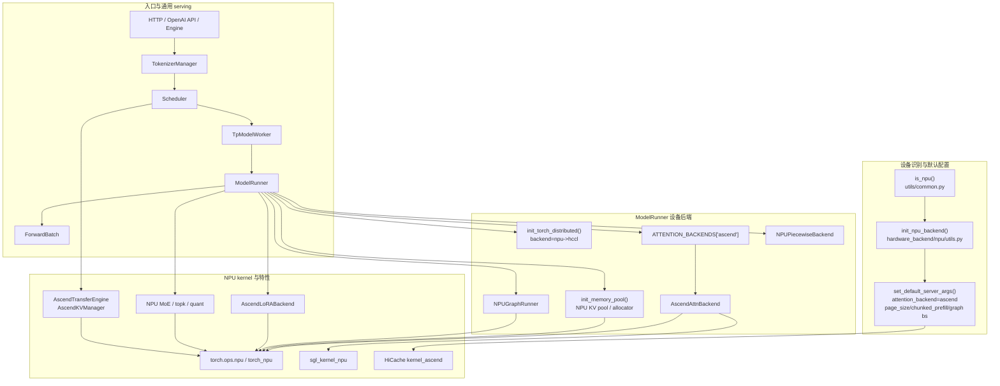

核心判断：**凡是仍在处理请求、队列、batch、采样和输出，基本是通用 SGLang 逻辑；凡是处理 device、stream、graph、kernel、KV layout、通信 backend 和 tensor format，基本是 Ascend NPU 接入逻辑。**

## 源码接入点总表

| 层级 | 文件 | 接入点 | 作用 |
|---|---|---|---|
| 包配置 | `python/pyproject_npu.toml` | `srt_npu`、`all_npu`、`dev_npu` | NPU 版本安装入口，指向 Ascend NPU 文档。 |
| 环境检查 | `python/sglang/check_env.py` | `NPUEnv` | 检查 `torch_npu`、NPU 可见性、CANN 环境变量、驱动版本。 |
| 设备识别 | `python/sglang/srt/utils/common.py` | `is_npu()`、`get_npu_memory_capacity()` | 判断当前是否为 NPU 环境，读取 NPU 显存容量。 |
| 后端初始化 | `python/sglang/srt/hardware_backend/npu/utils.py` | `init_npu_backend()` | 导入 `sgl_kernel_npu`、`torch_npu`，设置 NPU 编译模式。 |
| 默认参数 | `python/sglang/srt/hardware_backend/npu/utils.py` | `set_default_server_args()` | 强制默认 attention backend 为 `ascend`，设置 page size、chunked prefill、graph bs、HiCache。 |
| 模型执行 | `python/sglang/srt/model_executor/model_runner.py` | `_is_npu` import-time 初始化、`ModelRunner.initialize()` | NPU 设备下初始化 attention、ZBAL、NPU graph。 |
| attention 注册 | `python/sglang/srt/layers/attention/attention_registry.py` | `@register_attention_backend("ascend")` | 将字符串 `"ascend"` 映射到 `AscendAttnBackend`。 |
| attention 实现 | `python/sglang/srt/hardware_backend/npu/attention/ascend_backend.py` | `AscendAttnBackend` | prefill、decode、mixed、MTP、dLLM、graph metadata 与 NPU attention kernel。 |
| attention metadata | `python/sglang/srt/hardware_backend/npu/attention/ascend_backend.py` | `ForwardMetadata`、`AscendAttnMaskBuilder` | 保存 Ascend attention 所需的 seq len、mask、slot mapping、graph metadata。 |
| MLA 预处理 | `python/sglang/srt/hardware_backend/npu/attention/mla_preprocess.py` | `NPUFusedMLAPreprocess` | MLA 模型的 RMSNorm、RoPE、KV cache 写入等融合预处理。 |
| hybrid linear attention | `python/sglang/srt/hardware_backend/npu/attention/ascend_hybrid_linear_attn_backend.py` | `AscendMamba2AttnBackend`、`AscendHybridLinearAttnBackend` | NPU 下 Mamba/hybrid linear attention 后端。 |
| GDN attention | `python/sglang/srt/hardware_backend/npu/attention/ascend_gdn_backend.py` | `AscendGDNAttnBackend` | NPU 下 hybrid GDN 模型 attention 后端。 |
| KV pool | `python/sglang/srt/hardware_backend/npu/memory_pool_npu.py` | `NPUMHATokenToKVPool`、`NPUMLATokenToKVPool` | NPU MHA/MLA KV cache 存储、CPU copy、load back。 |
| KV allocator | `python/sglang/srt/hardware_backend/npu/allocator_npu.py` | `NPUPagedTokenToKVPoolAllocator` | NPU paged KV slot 分配、释放、decode/extend 分配。 |
| graph | `python/sglang/srt/hardware_backend/npu/graph_runner/npu_graph_runner.py` | `NPUGraphRunner` | NPU decode graph capture/replay。 |
| piecewise graph | `python/sglang/srt/compilation/npu_piecewise_backend.py` | `NPUPiecewiseBackend` | 基于 `torch.npu.NPUGraph()` 的分片 graph capture/replay。 |
| speculative graph | `python/sglang/srt/hardware_backend/npu/graph_runner/eagle_*_npu_graph_runner.py` | `EAGLEDraftNpuGraphRunner` 等 | EAGLE draft worker 的 NPU graph 适配。 |
| ViT graph | `python/sglang/srt/hardware_backend/npu/graph_runner/vit_npu_graph_runner.py` | `ViTNpuGraphRunner` | 多模态 ViT 前向的 NPU graph 适配。 |
| 分布式 backend | `python/sglang/srt/distributed/parallel_state.py` | `get_default_distributed_backend()` | NPU 默认走 `hccl`；ZBAL 打开时可走 `zbal`。 |
| NPU communicator | `python/sglang/srt/distributed/device_communicators/npu_communicator.py` | `NpuCommunicator` | NPU all-reduce、quant all-reduce、all-gather。 |
| PD 分离 | `python/sglang/srt/disaggregation/ascend/transfer_engine.py` | `AscendTransferEngine` | Ascend prefill/decode 分离中的 KV transfer engine。 |
| PD KV 管理 | `python/sglang/srt/disaggregation/ascend/conn.py` | `AscendKVManager`、`AscendKVSender`、`AscendKVReceiver` | Ascend KV buffer 注册、PP/MLA 指针切片、KV block 传输。 |
| LoRA | `python/sglang/srt/lora/backend/ascend_backend.py` | `AscendLoRABackend` | NPU `sgmv_shrink` / `sgmv_expand` 实现 LoRA A/B 矩阵。 |
| 量化 Linear | `python/sglang/srt/hardware_backend/npu/quantization/linear_method_npu.py` | `NPUW8A8Int8LinearMethod` 等 | NPU int8/w4a4 线性层后端。 |
| 量化 MoE | `python/sglang/srt/hardware_backend/npu/quantization/fused_moe_method_npu.py` | `NPUW4A4Int4DynamicMoEMethod` 等 | NPU fused MoE 权重处理和执行。 |
| AWQ/GPTQ | `python/sglang/srt/hardware_backend/npu/quantization/awq_kernels.py`、`gptq_kernels.py` | `AWQAscendLinearKernel`、`GPTQLinearAscendKernel` | Ascend 上 AWQ/GPTQ kernel 适配。 |
| MoE 工具 | `python/sglang/srt/hardware_backend/npu/moe/topk.py`、`fuseep.py` | `fused_topk_npu()`、`forward_fuseep()` | NPU MoE top-k、FuseEP 路径。 |
| stream / CMO | `python/sglang/srt/hardware_backend/npu/utils.py`、`cmo.py` | shared/routed stream、CMO prefetch | MoE、权重 cache、独立 stream 管理。 |
| 多模态预处理 | `python/sglang/srt/hardware_backend/npu/modules/qwen_vl_processor.py`、`glm46v_processor.py` | patch wrapper | 在 NPU 上调整 Qwen/GLM 多模态预处理行为。 |
| profiling | `python/sglang/srt/utils/profile_utils.py` | `torch_npu.profiler` patch | 把 PyTorch profiler CUDA activity 替换为 NPU activity。 |

## 启动初始化流程

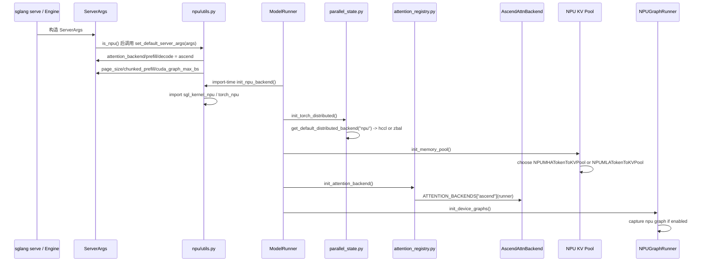

### 初始化关键节点说明

1. `set_default_server_args(args)` 是 NPU 的“启动参数闸门”。它会把 `attention_backend`、`prefill_attention_backend`、`decode_attention_backend` 都设为 `"ascend"`，并根据 NPU 显存容量设置 `chunked_prefill_size` 和 `cuda_graph_max_bs`。
2. `ModelRunner` 文件导入时，如果 `_is_npu` 为真，会立即调用 `init_npu_backend()`。这一步导入 NPU kernel 包，并修正 `torch.cuda.is_available` 被 `transfer_to_npu` mock 的副作用。
3. `ModelRunner.initialize()` 中，NPU 分支的顺序是 `init_attention_backend()`，可选 `lazy_init_zbal_gva_mem()`，然后 `init_device_graphs()`。
4. `init_memory_pool()` 来自 `ModelRunnerKVCacheMixin`，它在 `attention_backend == "ascend"` 且不是 mambaish 模型时选择 NPU KV pool。

## 参数默认值接入点

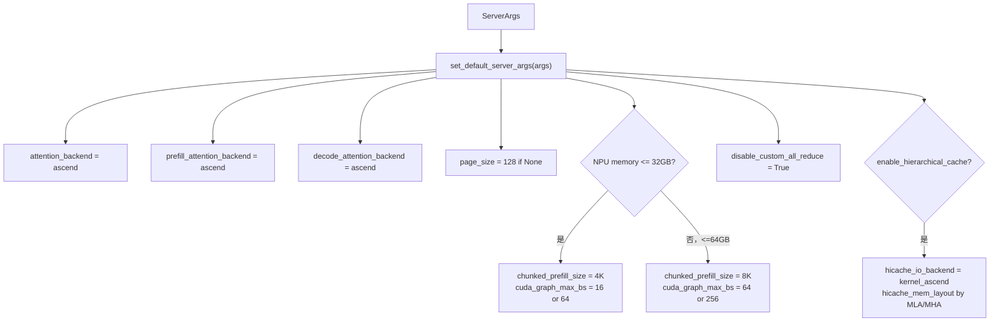

这些默认值会影响后续三个关键分支：

- attention 初始化时命中 `ATTENTION_BACKENDS["ascend"]`。
- KV pool 初始化时命中 `NPUMHATokenToKVPool` 或 `NPUMLATokenToKVPool`。
- graph 初始化时选择 `NPUGraphRunner`。

## 请求执行主链路中的 NPU 触发点

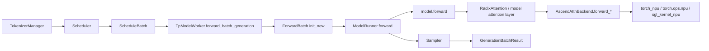

对一次普通生成请求而言，NPU 不直接参与 `TokenizerManager` 和 `Scheduler` 的请求排队逻辑。它主要从 `TpModelWorker -> ModelRunner -> model.forward -> attention layer` 开始变得重要。

实际执行中有两类 NPU 路径：

- **prefill / extend**：`AscendAttnBackend.forward_extend()` 负责处理 prompt 或追加上下文的 attention。
- **decode**：`AscendAttnBackend.forward_decode()` 或 `forward_decode_graph()` 负责每轮 next token attention，graph replay 通常集中在 decode 路径。

## Attention 后端调用关系

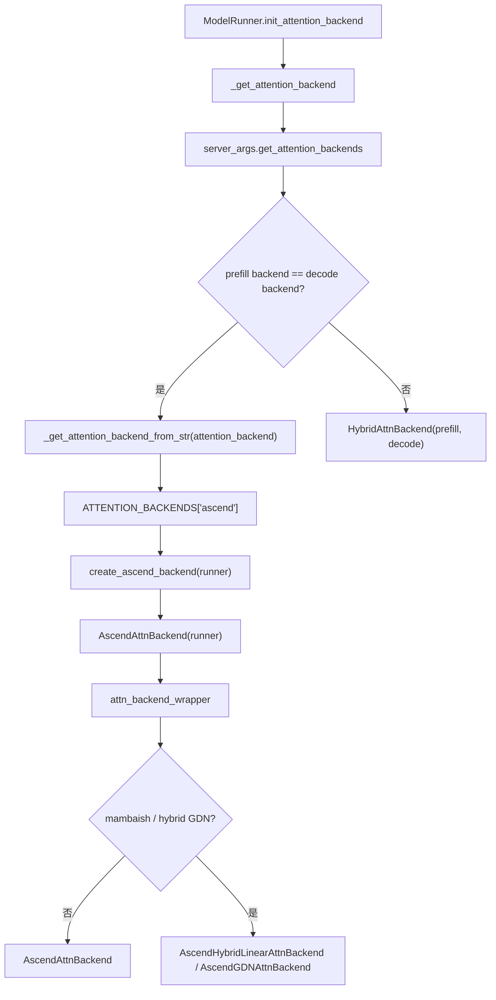

### `AscendAttnBackend` 内部结构

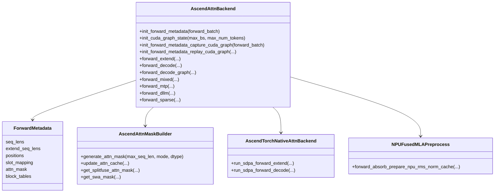

`AscendAttnBackend` 是最核心的 NPU 类。它把 `ForwardBatch` 转成 Ascend attention kernel 能消费的 metadata，并按 forward mode 分发到不同 kernel：

- `forward_extend()`：prefill/extend 路径。
- `forward_decode()`：常规 decode 路径。
- `forward_decode_graph()`：graph replay 场景下的 decode 路径。
- `forward_mixed()`：prefill/decode 混合 batch。
- `forward_mtp()`：MTP/speculative 相关路径。
- `forward_dllm()`：diffusion LLM 特殊路径。

常见底层调用包括：

- `torch_npu.npu_sparse_flash_attention(...)`
- `torch_npu.npu_fused_infer_attention_score(...)`
- `torch_npu.npu_fused_infer_attention_score_v2(...)`
- `torch.ops.npu.npu_fused_infer_attention_score(...)`
- `torch_npu._npu_paged_attention(...)`
- `torch_npu._npu_paged_attention_mla(...)`
- `torch_npu.atb.npu_ring_mla(...)`

## KV Cache 与 Allocator 调用关系

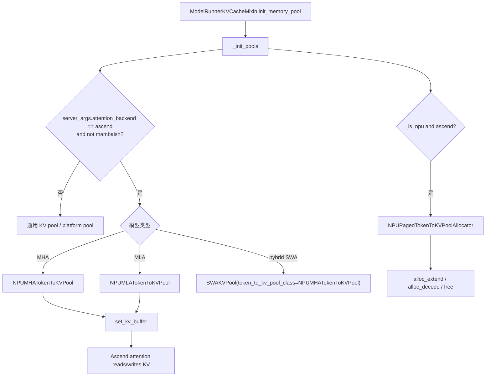

### 关键类关系

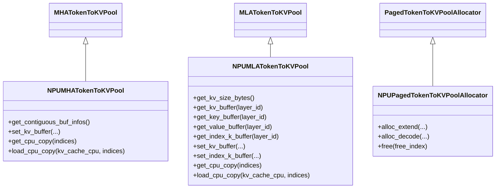

这里要特别注意：`attention_backend == "ascend"` 不只是影响 attention kernel，也影响 KV cache 的物理布局和 allocator。也就是说，NPU attention backend 和 NPU KV pool 是一组配套设计。

## Graph 与编译接入点

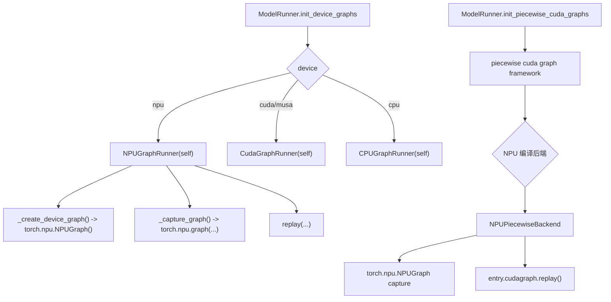

`NPUGraphRunner` 继承 `CudaGraphRunner`，复用大部分 graph runner 框架，但把设备 graph 替换成 NPU：

- `_create_device_graph()` 返回 `torch.npu.NPUGraph()`。
- `_capture_graph()` 使用 `torch.npu.graph(...)`。
- `_cache_loc_dtype()` 在 NPU 上使用 NPU 需要的 dtype。
- `replay()` 执行 capture 后的固定 shape decode。

`NPUPiecewiseBackend` 则复用 `CUDAPiecewiseBackend` 的分片思想，但 capture/replay 换成 `torch.npu.NPUGraph()`。它的核心状态是：

- `concrete_size_entries`：哪些 runtime shape 需要专门 capture。
- `entry.runnable`：未 capture 前的可执行图。
- `entry.cudagraph`：虽然变量名沿用 CUDA，但实际是 `NPUGraph`。
- `entry.output`：graph output 的弱引用缓存。

## 分布式与 HCCL 接入点

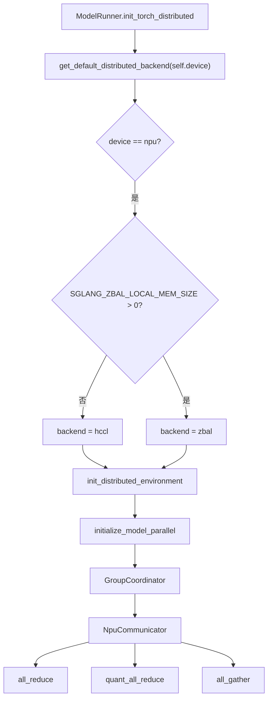

NPU 分布式相关关键点：

- `parallel_state.py` 中 `get_default_distributed_backend("npu")` 默认返回 `hccl`，如果开启 ZBAL local memory 则返回 `zbal`。
- `get_torch_distributed_pg_options()` 在 NPU 下创建 HCCL process group options，并配置 `hccl_buffer_size`。
- `GroupCoordinator` 会在 NPU 场景中使用 `NpuCommunicator` 执行部分 collective。
- `NpuCommunicator.quant_all_reduce()` 使用 `torch_npu.npu_dynamic_quant`，先低精度 all-gather，再转换回原 dtype 做 reduce。

## Ascend PD Disaggregation 调用关系

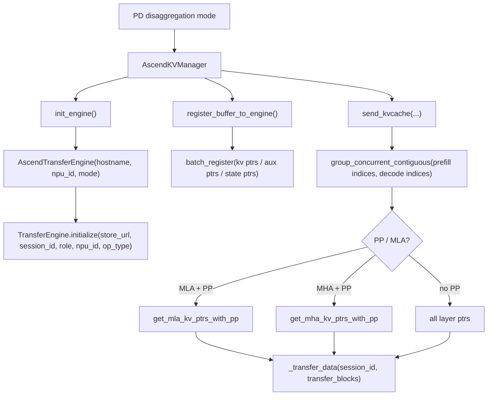

### PD 关键类图

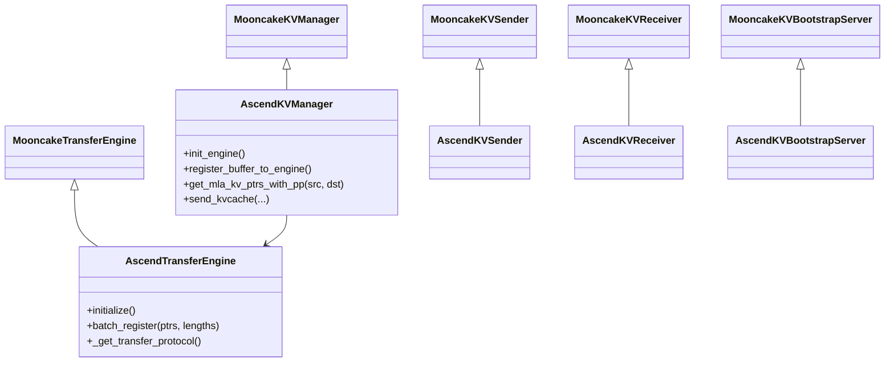

`AscendTransferEngine` 的关键环境变量：

| 变量 | 含义 |
|---|---|
| `ASCEND_MF_STORE_URL` | memfabric hybrid transfer engine 的集中存储地址。 |
| `ASCEND_MF_TRANSFER_PROTOCOL` | 可选 `sdma` 或 `device_rdma`。 |

如果协议是 `device_rdma`，初始化时会先用 `torch.distributed.all_gather` 预初始化 HCCL，避免 RDMA 初始化冲突。

## LoRA 接入点

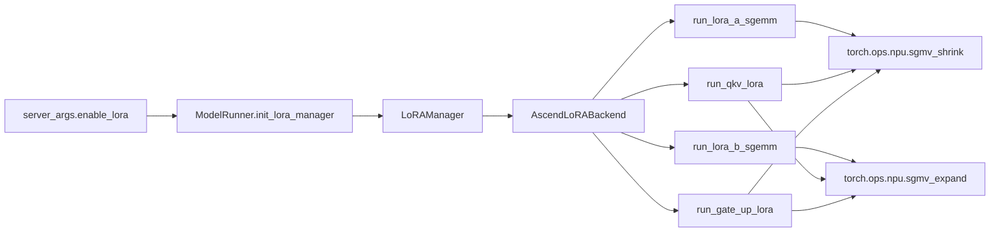

`AscendLoRABackend` 的设计核心是 segment-based grouped matrix-vector：

- `weight_indices` 决定每个 token 使用哪个 LoRA adapter。
- `seg_lens` 描述同 adapter token 的连续 segment。
- `sgmv_shrink` 负责 LoRA A 降维。
- `sgmv_expand` 负责 LoRA B 升维并写回 base output。
- `scalings` 在 A 之后按 token segment 展开后乘入。

## MoE、量化与线性层接入点

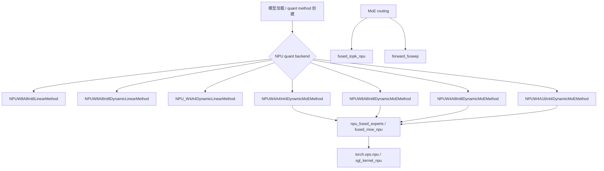

NPU 量化相关类通常遵循两阶段：

1. `process_weights_after_loading(layer)`：加载后对权重做 NPU 需要的格式转换、pack、scale/bias 处理。
2. `apply(...)`：推理时调用 NPU kernel 完成 linear 或 MoE expert 计算。

`utils.py` 里的 `process_shared_expert()`、`process_routed_expert()` 还提供了独立 stream 计算路径，用于 shared expert 和 routed expert 的并行/流水管理。

## 多模态与 profiling 接入点

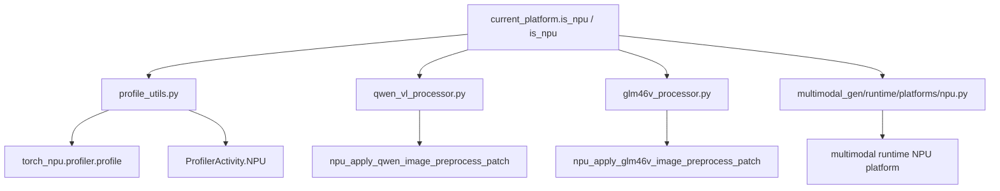

这些不是普通文本 LLM 推理的第一优先级，但读多模态或 profiling 时会频繁遇到。

## Ascend NPU 知识图谱

```mermaid
flowchart TB
  NPU["Ascend NPU support"] --> ENV["环境与包"]
  NPU --> BOOT["启动默认值"]
  NPU --> RUN["运行时执行"]
  NPU --> MEM["KV cache"]
  NPU --> ATTN["Attention"]
  NPU --> GRAPH["Graph"]
  NPU --> DIST["分布式"]
  NPU --> FEATURE["特性后端"]

  ENV --> PYPROJ["pyproject_npu.toml"]
  ENV --> CHECK["NPUEnv"]
  ENV --> TORCHNPU["torch_npu"]
  ENV --> SGLKNPU["sgl_kernel_npu"]

  BOOT --> ISNPU["is_npu"]
  BOOT --> INIT["init_npu_backend"]
  BOOT --> DEFARGS["set_default_server_args"]

  RUN --> MODELRUNNER["ModelRunner"]
  RUN --> FORWARDBATCH["ForwardBatch"]
  RUN --> ATTNREG["attention_registry"]

  MEM --> MHAKV["NPUMHATokenToKVPool"]
  MEM --> MLAKV["NPUMLATokenToKVPool"]
  MEM --> ALLOC["NPUPagedTokenToKVPoolAllocator"]

  ATTN --> ASCATTN["AscendAttnBackend"]
  ATTN --> MASK["AscendAttnMaskBuilder"]
  ATTN --> META["ForwardMetadata"]
  ATTN --> MLAPRE["NPUFusedMLAPreprocess"]
  ATTN --> HYBRID["AscendHybridLinearAttnBackend"]
  ATTN --> GDN["AscendGDNAttnBackend"]

  GRAPH --> NPUGR["NPUGraphRunner"]
  GRAPH --> PIECE["NPUPiecewiseBackend"]
  GRAPH --> EAGLE["EAGLEDraftNpuGraphRunner"]
  GRAPH --> VIT["ViTNpuGraphRunner"]

  DIST --> HCCL["HCCL backend"]
  DIST --> GROUP["GroupCoordinator"]
  DIST --> COMM["NpuCommunicator"]
  DIST --> ZBAL["ZBAL"]

  FEATURE --> PD["AscendTransferEngine / AscendKVManager"]
  FEATURE --> LORA["AscendLoRABackend"]
  FEATURE --> MOE["NPU fused MoE"]
  FEATURE --> QUANT["NPU quant methods"]
  FEATURE --> MM["NPU multimodal patches"]
```

## 类之间的调用关系速查

| 上游类/函数 | 下游类/函数 | 关系 |
|---|---|---|
| `ServerArgs` 初始化流程 | `set_default_server_args(args)` | NPU 环境下设置默认服务参数。 |
| `ModelRunner` 模块导入 | `init_npu_backend()` | import-time 初始化 NPU 后端。 |
| `ModelRunner.__init__()` | `init_torch_distributed()` | 设置设备、分布式 backend、初始化 TP/PP/DP group。 |
| `init_torch_distributed()` | `get_default_distributed_backend("npu")` | 获取 HCCL/ZBAL backend。 |
| `init_torch_distributed()` | `register_sgl_tp_rank(gpu_id)` | NPU 下注册 TP rank。 |
| `ModelRunner.initialize()` | `init_memory_pool()` | 初始化 req pool、KV pool、allocator。 |
| `ModelRunnerKVCacheMixin._init_pools()` | `NPUMHATokenToKVPool` | MHA + Ascend backend 使用。 |
| `ModelRunnerKVCacheMixin._init_pools()` | `NPUMLATokenToKVPool` | MLA + Ascend backend 使用。 |
| `ModelRunnerKVCacheMixin._init_pools()` | `NPUPagedTokenToKVPoolAllocator` | NPU paged KV 分配器。 |
| `ModelRunner.initialize()` | `init_attention_backend()` | 初始化 attention backend。 |
| `init_attention_backend()` | `ATTENTION_BACKENDS["ascend"]` | 通过 registry 创建 Ascend 后端。 |
| `create_ascend_backend(runner)` | `AscendAttnBackend(runner)` | 实例化 NPU attention。 |
| `attn_backend_wrapper()` | `AscendHybridLinearAttnBackend` / `AscendGDNAttnBackend` | hybrid/mambaish 模型包装后端。 |
| `model.forward()` 中 attention layer | `AscendAttnBackend.forward_extend/decode/mixed` | attention 层调用具体 NPU backend。 |
| `AscendAttnBackend` | `ForwardMetadata` | 每个 batch 的 NPU attention metadata。 |
| `AscendAttnBackend` | `AscendAttnMaskBuilder` | mask 构建与缓存。 |
| `AscendAttnBackend` | `NPUFusedMLAPreprocess` | MLA 模型预处理。 |
| `ModelRunner.initialize()` | `lazy_init_zbal_gva_mem()` | NPU + ZBAL mix alloc 下 lazy 初始化 GVA。 |
| `ModelRunner.initialize()` | `init_device_graphs()` | NPU 下创建 `NPUGraphRunner`。 |
| `init_device_graphs()` | `NPUGraphRunner` | capture/replay decode graph。 |
| `init_piecewise_cuda_graphs()` | `NPUPiecewiseBackend` | NPU piecewise graph capture/replay。 |
| `GroupCoordinator` | `NpuCommunicator` | NPU collective 通信封装。 |
| `AscendKVManager.init_engine()` | `AscendTransferEngine` | PD 分离初始化 Ascend transfer engine。 |
| `AscendKVManager.register_buffer_to_engine()` | `AscendTransferEngine.batch_register()` | 注册 KV/aux/state buffer。 |
| `AscendKVManager.send_kvcache()` | `_transfer_data(...)` | 将 prefill KV blocks 传到 decode worker。 |
| `LoRAManager` | `AscendLoRABackend` | NPU LoRA 计算后端。 |
| `AscendLoRABackend` | `torch.ops.npu.sgmv_shrink/expand` | LoRA A/B kernel。 |
| NPU quant method | NPU fused linear / MoE kernels | 加载后权重处理与推理执行。 |

## 建议阅读顺序

1. `python/sglang/srt/hardware_backend/npu/utils.py`：先看 `set_default_server_args()` 和 `init_npu_backend()`，理解 NPU 接入的“开关”。
2. `python/sglang/srt/model_executor/model_runner.py`：看 import-time 初始化、`initialize()` 中的 NPU 分支、`init_attention_backend()`、`init_device_graphs()`。
3. `python/sglang/srt/layers/attention/attention_registry.py`：看 `"ascend"` backend 如何注册，并看 hybrid/mambaish 包装逻辑。
4. `python/sglang/srt/hardware_backend/npu/attention/ascend_backend.py`：重点看 `AscendAttnBackend` 的 `init_forward_metadata()`、`forward_extend()`、`forward_decode()`。
5. `python/sglang/srt/model_executor/model_runner_kv_cache_mixin.py`：看 `attention_backend == "ascend"` 如何选择 NPU KV pool 和 allocator。
6. `python/sglang/srt/hardware_backend/npu/memory_pool_npu.py` 与 `allocator_npu.py`：看 KV cache 的 NPU 物理布局和 slot 分配。
7. `python/sglang/srt/hardware_backend/npu/graph_runner/npu_graph_runner.py` 与 `python/sglang/srt/compilation/npu_piecewise_backend.py`：看 NPU graph capture/replay。
8. `python/sglang/srt/distributed/parallel_state.py` 与 `device_communicators/npu_communicator.py`：看 HCCL、ZBAL 和 NPU collective。
9. `python/sglang/srt/disaggregation/ascend/*`：看 Ascend PD disaggregation。
10. `python/sglang/srt/lora/backend/ascend_backend.py`、`hardware_backend/npu/quantization/*`、`hardware_backend/npu/moe/*`：最后看 LoRA、量化和 MoE 特性后端。

## 一句话总结

SGLang 的 Ascend NPU 适配可以理解为一组围绕 `ModelRunner` 展开的设备后端替换：`ServerArgs` 先把后端默认值切到 `ascend`，`ModelRunner` 再选择 NPU 分布式、NPU KV pool、`AscendAttnBackend` 和 `NPUGraphRunner`；高级特性如 PD、LoRA、MoE、量化、多模态，则各自通过 `hardware_backend/npu`、`disaggregation/ascend` 和 `lora/backend/ascend_backend.py` 接入同一条 serving 主链路。
