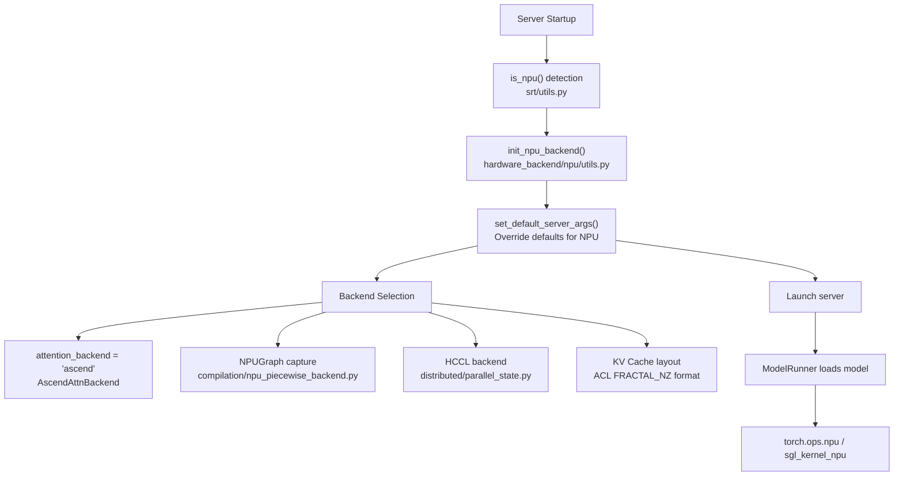

[中文](./02-ascend-npu-integration-map.md) | [English](./02-ascend-npu-integration-map_EN.md)

# 02. Ascend NPU Integration Map

## Where NPU Branches Exist in SGLang

SGLang's Ascend NPU adaptation primarily occurs at these integration points:

## Key Files by Integration Point

| Integration Point | Key Files | What Changes |
|---|---|---|
| Device Detection | `srt/utils/common.py`, `srt/configs/device_config.py` | `is_npu()` flag |
| Backend Init | `srt/hardware_backend/npu/utils.py` | `init_npu_backend()`, `set_default_server_args()` |
| Attention | `srt/layers/attention/ascend/` | Ascend-specific attention kernels |
| Graph | `srt/compilation/npu_piecewise_backend.py` | `NPUGraph` capture/replay |
| Communication | `srt/distributed/parallel_state.py` | HCCL backend selection |
| KV Cache | `srt/mem_cache/` | FRACTAL_NZ layout |
| LoRA | `srt/lora/backend/ascend_backend.py` | `sgmv_shrink/expand` via `torch.ops.npu` |
| PD Transfer | `srt/disaggregation/ascend/transfer_engine.py` | `AscendTransferEngine` |
| HiCache | `srt/mem_cache/hicache/` | `kernel_ascend` backend |

## Default Parameter Overrides

| Parameter | GPU Default | NPU Default | Reason |
|---|---|---|---|
| `attention_backend` | `flashinfer` | `ascend` | NPU has its own attention kernel |
| `page_size` | `16` | `128` | Better NPU memory alignment |
| `chunked_prefill_size` | Dynamic | Based on NPU memory | Adjust for different HBM |
| `cuda_graph_max_bs` | Dynamic | Adjusted for NPU memory | `NPUGraph` uses different memory |
| `disable_custom_all_reduce` | `False` | `True` | No CUDA custom all-reduce on NPU |
