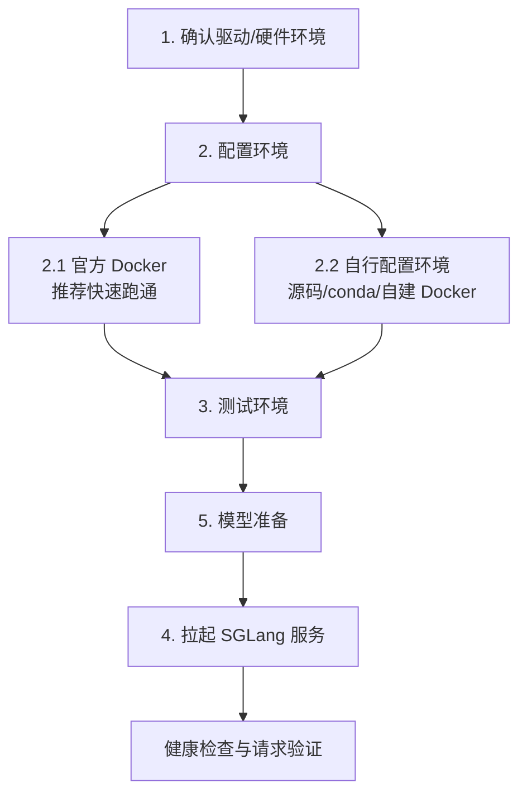

**中文** | [English](./03-launch-and-minimal-serving_EN.md)

# 03. 隔离环境启动与最小 Serving 跑通

这一讲只解决一件事：在一台 GNU/Linux + Ascend NPU 服务器上，用尽量不影响整机环境的方式跑通 SGLang 服务。

最推荐的路径是官方 Docker。官方 Ascend NPU 镜像已经内置了 SGLang、CANN 相关运行依赖、PyTorch/torch_npu、NPU kernel 等组件，因此使用官方 Docker 时，不需要再手动配置 CANN 环境变量、创建 Python 环境或重新安装 SGLang。你只需要确认宿主机驱动和 NPU 正常、拉取镜像、挂载模型目录，然后直接启动 `sglang serve`。

如果你要学习源码、修改 SGLang、验证某个分支，才进入“自行配置环境”路径。

## 总体流程



> 使用本地或离线模型时，必须先完成模型准备，再启动服务；使用在线模型名时，运行时可以在服务启动过程中下载模型。

## 1. 确认驱动/硬件环境

这一步只检查宿主机，不安装 Python 包，不修改系统环境。

```bash
uname -a
cat /etc/os-release
npu-smi info
npu-smi info -t topo
```

确认 Ascend 驱动和 CANN 常见位置：

```bash
ls /usr/local/Ascend/driver
ls /usr/local/Ascend/ascend-toolkit/latest
cat /etc/ascend_install.info || true
```

如果 `npu-smi info` 失败，先不要继续安装 SGLang。这通常是驱动、固件、设备权限或容器设备映射问题，不是 SGLang 本身的问题。

多人服务器上还要确认两件事：

- 你要使用的 NPU 卡没有被他人占用。
- 你要暴露的服务端口没有被他人占用。

```bash
npu-smi info
lsof -i :8000 || true
```

## 2. 配置环境

这一节分两条路：

- **2.1 官方 Docker**：推荐路径。镜像内已经配置好 SGLang 环境，直接启动服务。
- **2.2 自行配置环境**：只在你需要源码开发、验证分支或不用官方镜像时使用。

### 2.1 拉取官方 Docker

官方镜像命名方式：

```text
docker.io/lmsysorg/sglang:<tag>
```

常见 Ascend tag：

```text
main-cann8.5.0-a3
main-cann8.5.0-910b
v0.5.6-cann8.5.0-a3
v0.5.6-cann8.5.0-910b
```

选择建议：

| 硬件 | 镜像标签倾向 |
|---|---|
| Atlas 800I A3 | `*-cann8.5.0-a3` |
| Atlas 800I A2 / 910B | `*-cann8.5.0-910b` |
| 不确定 | 先看服务器交付文档和 `npu-smi info`。 |

拉取示例：

```bash
docker pull docker.io/lmsysorg/sglang:main-cann8.5.0-910b
```

官方 Docker 路径下，宿主机只需要准备个人模型、缓存、日志目录：

```bash
mkdir -p \
  /home/{myspace}/sglang-npu-workspace/models \
  /home/{myspace}/sglang-npu-workspace/cache \
  /home/{myspace}/sglang-npu-workspace/logs
```

> 普通 Docker 的镜像层通常仍由 Docker daemon 存在系统目录，例如 `/var/lib/docker`。如果镜像层也必须放到 `/home/{myspace}`，请使用 rootless Docker，或请管理员统一配置 Docker `data-root`。普通用户不要自行修改系统 Docker daemon。

#### 2.1.1 进入官方调试容器

下面示例按 Atlas 800I A2/910B 的 8 卡机器写。A3 或 16 卡机器需要按实际情况增加 `/dev/davinci8` 到 `/dev/davinci15`。

```bash
docker run -it --rm \
  --name sglang-npu-dev-{myspace} \
  --privileged \
  --network=host \
  --ipc=host \
  --shm-size=16g \
  --device=/dev/davinci0 \
  --device=/dev/davinci1 \
  --device=/dev/davinci2 \
  --device=/dev/davinci3 \
  --device=/dev/davinci4 \
  --device=/dev/davinci5 \
  --device=/dev/davinci6 \
  --device=/dev/davinci7 \
  --device=/dev/davinci_manager \
  --device=/dev/hisi_hdc \
  -v /usr/local/sbin:/usr/local/sbin:ro \
  -v /usr/local/Ascend/driver:/usr/local/Ascend/driver:ro \
  -v /usr/local/Ascend/firmware:/usr/local/Ascend/firmware:ro \
  -v /etc/ascend_install.info:/etc/ascend_install.info:ro \
  -v /var/queue_schedule:/var/queue_schedule \
  -v /home/{myspace}/sglang-npu-workspace:/workspace/sglang-npu \
  docker.io/lmsysorg/sglang:main-cann8.5.0-910b \
  bash
```

进入容器后，不需要再 `source set_env.sh`，也不需要 `pip install -e`。官方镜像已经准备好运行环境。

### 2.2 不用官方 Docker，自行配置环境

只有以下场景需要走这一节：

- 你要从 GitHub 拉取 SGLang 源码并修改代码。
- 你要验证某个未进入官方镜像的分支、tag、commit。
- 你的服务器不能使用官方镜像，需要在现有基础镜像、conda 或 venv 中重建环境。

自行配置时，所有文件仍然放在个人目录下：

```bash
export USER_SPACE=/home/{myspace}
export SGLANG_WORKSPACE=${USER_SPACE}/sglang-npu-workspace
export SGLANG_REPO=${SGLANG_WORKSPACE}/src/sglang
export SGLANG_MODELS=${SGLANG_WORKSPACE}/models
export SGLANG_CACHE=${SGLANG_WORKSPACE}/cache
export SGLANG_LOGS=${SGLANG_WORKSPACE}/logs
export SGLANG_WHEELS=${SGLANG_WORKSPACE}/wheels
export SGLANG_CONDA_ROOT=${SGLANG_WORKSPACE}/conda
export SGLANG_VENV=${SGLANG_WORKSPACE}/venvs/sglang_npu

export HF_HOME=${SGLANG_CACHE}/huggingface
export TRANSFORMERS_CACHE=${HF_HOME}
export HUGGINGFACE_HUB_CACHE=${HF_HOME}/hub
export MODELSCOPE_CACHE=${SGLANG_CACHE}/modelscope
export TORCH_HOME=${SGLANG_CACHE}/torch
export XDG_CACHE_HOME=${SGLANG_CACHE}/xdg
export PIP_CACHE_DIR=${SGLANG_CACHE}/pip

mkdir -p \
  "$(dirname "$SGLANG_REPO")" \
  "$SGLANG_MODELS" \
  "$SGLANG_CACHE" \
  "$SGLANG_LOGS" \
  "$SGLANG_WHEELS" \
  "$SGLANG_CONDA_ROOT" \
  "$(dirname "$SGLANG_VENV")"
```

这些变量只在当前 shell 和它启动的子进程中生效。不要写入 `/etc/profile`、`/etc/environment` 或共享 shell 配置。

#### 2.2.1 在 Docker 中重新从 GitHub 安装 SGLang

如果你仍然使用官方镜像作为基础环境，但不想使用镜像内置 SGLang，可以在容器里重新 clone GitHub 源码。先按 2.1.1 进入调试容器，然后执行：

```bash
cd /workspace/sglang-npu
mkdir -p src cache logs wheels

git clone https://github.com/sgl-project/sglang.git src/sglang
cd src/sglang

# 可选：切换到要验证的分支、tag 或 commit。
# git checkout <branch-or-tag-or-commit>

cp python/pyproject_npu.toml python/pyproject.toml
python3 -m pip install --upgrade pip setuptools wheel
python3 -m pip install -e "python[all_npu]"
```

确认当前导入的是你刚 clone 的源码：

```bash
python3 - <<'PY'
import sglang
print(sglang.__file__)
PY
```

输出路径应该包含：

```text
/workspace/sglang-npu/src/sglang/python/sglang
```

如果你希望不污染镜像内 Python，可以在挂载目录中创建 venv：

```bash
cd /workspace/sglang-npu
python3 -m venv --system-site-packages venvs/sglang-source-dev
source venvs/sglang-source-dev/bin/activate

cd src/sglang
cp python/pyproject_npu.toml python/pyproject.toml
python -m pip install --upgrade pip setuptools wheel
python -m pip install -e "python[all_npu]"
```

`--system-site-packages` 的目的是复用镜像里已经匹配好的 `torch`、`torch_npu`、`triton-ascend`、`sgl_kernel_npu` 等依赖。完全独立 venv 也可以，但需要你自行安装所有匹配版本的 wheel。

#### 2.2.2 使用 conda / micromamba 自行配置

如果不能使用 Docker，建议使用 conda 或 micromamba 隔离 Python：

```bash
source /usr/local/Ascend/ascend-toolkit/latest/set_env.sh

conda create -p "$SGLANG_CONDA_ROOT/envs/sglang_npu" python=3.11 -y
conda activate "$SGLANG_CONDA_ROOT/envs/sglang_npu"

python -m pip install --upgrade pip setuptools wheel
python -m pip install torch==2.8.0 torchvision==0.23.0 \
  --index-url https://download.pytorch.org/whl/cpu
python -m pip install torch_npu==2.8.0
python -m pip install triton-ascend memfabric-hybrid==1.0.5
```

安装 SGLang 源码：

```bash
git clone https://github.com/sgl-project/sglang.git "$SGLANG_REPO"
cd "$SGLANG_REPO"
cp python/pyproject_npu.toml python/pyproject.toml
python -m pip install -e "python[all_npu]"
```

`sgl_kernel_npu` 可能需要从官方发布 wheel、内部制品库或源码构建产物安装。若 `import sgl_kernel_npu` 失败，先补齐该 wheel。

## 3. 测试环境

### 3.1 官方 Docker 测试

在 2.1.1 进入的官方容器中执行：

```bash
npu-smi info
sglang serve --help | head

python3 - <<'PY'
import torch
import torch_npu
import sglang
import sgl_kernel_npu
print("torch:", torch.__version__)
print("torch_npu:", torch_npu.__version__)
print("npu available:", torch.npu.is_available())
print("npu count:", torch.npu.device_count())
print("sglang:", sglang.__file__)
print("sgl_kernel_npu ok")
PY
```

如果这些检查通过，官方 Docker 环境已经可以直接启动服务。

### 3.2 自行配置环境测试

在 conda、venv 或源码 Docker 环境中执行：

```bash
source /usr/local/Ascend/ascend-toolkit/latest/set_env.sh

python -m sglang.check_env
python - <<'PY'
import torch
import torch_npu
import sglang
import sgl_kernel_npu
print("npu available:", torch.npu.is_available())
print("npu count:", torch.npu.device_count())
print("sglang:", sglang.__file__)
print("all imports ok")
PY
```

常见 warning 对照：

| Warning | 含义 | 处理 |
|---|---|---|
| `Environment variable SGL_* is deprecated, please use SGLANG_*` | 旧脚本还在用 `SGL_MODELS`、`SGL_CACHE` 等旧变量。 | 改成 `SGLANG_MODELS`、`SGLANG_CACHE`、`SGLANG_WORKSPACE`。 |
| `'python -m sglang.launch_server' is still supported...` | 旧入口仍可用，但推荐 CLI。 | 使用 `sglang serve`。 |
| `Triton is not supported on current platform, roll back to CPU` | 某些 Triton 辅助路径在当前 Ascend 平台不可用。 | 若服务可用且日志确认 `attention_backend=ascend`，先记录为性能风险；吞吐异常再检查 `triton-ascend`、`sgl_kernel_npu` 和模型算子路径。 |

## 4. 拉起 SGLang 服务

启动服务前通常要先完成第 5 节模型准备，确保模型已经在本地目录，例如：

```text
/home/{myspace}/sglang-npu-workspace/models/Qwen2.5-7B-Instruct
```

在官方 Docker 中，对应容器内路径是：

```text
/workspace/sglang-npu/models/Qwen2.5-7B-Instruct
```

### 4.1 官方 Docker 在线启动

如果容器可以访问外网，并且你希望让运行时自动下载模型，可以直接给 `--model-path` 传在线模型名：

```bash
docker run -it --rm \
  --name sglang-npu-server-{myspace} \
  --privileged \
  --network=host \
  --ipc=host \
  --shm-size=16g \
  --device=/dev/davinci0 \
  --device=/dev/davinci_manager \
  --device=/dev/hisi_hdc \
  -v /usr/local/sbin:/usr/local/sbin:ro \
  -v /usr/local/Ascend/driver:/usr/local/Ascend/driver:ro \
  -v /usr/local/Ascend/firmware:/usr/local/Ascend/firmware:ro \
  -v /etc/ascend_install.info:/etc/ascend_install.info:ro \
  -v /var/queue_schedule:/var/queue_schedule \
  -v /home/{myspace}/sglang-npu-workspace:/workspace/sglang-npu \
  docker.io/lmsysorg/sglang:main-cann8.5.0-910b \
  sglang serve \
    --model-path Qwen/Qwen2.5-7B-Instruct \
    --host 0.0.0.0 \
    --port 8000 \
    --device npu \
    --attention-backend ascend \
    --base-gpu-id 0 \
    --tp-size 1
```

在线启动最省步骤，但模型下载来源和缓存路径受运行时实现影响。更可控的做法是先用 ModelScope 下载到个人目录，再按 4.2 用本地模型路径启动。

### 4.2 官方 Docker 离线或本地模型启动

这是生产和多人服务器上更推荐的方式：

```bash
docker run -it --rm \
  --name sglang-npu-server-{myspace} \
  --privileged \
  --network=host \
  --ipc=host \
  --shm-size=16g \
  --device=/dev/davinci0 \
  --device=/dev/davinci_manager \
  --device=/dev/hisi_hdc \
  -v /usr/local/sbin:/usr/local/sbin:ro \
  -v /usr/local/Ascend/driver:/usr/local/Ascend/driver:ro \
  -v /usr/local/Ascend/firmware:/usr/local/Ascend/firmware:ro \
  -v /etc/ascend_install.info:/etc/ascend_install.info:ro \
  -v /var/queue_schedule:/var/queue_schedule \
  -v /home/{myspace}/sglang-npu-workspace:/workspace/sglang-npu \
  docker.io/lmsysorg/sglang:main-cann8.5.0-910b \
  sglang serve \
    --model-path /workspace/sglang-npu/models/Qwen2.5-7B-Instruct \
    --host 0.0.0.0 \
    --port 8000 \
    --device npu \
    --attention-backend ascend \
    --base-gpu-id 0 \
    --tp-size 1
```

如果要后台运行：

```bash
docker run -d \
  --name sglang-npu-server-{myspace} \
  --restart unless-stopped \
  --privileged \
  --network=host \
  --ipc=host \
  --shm-size=16g \
  --device=/dev/davinci0 \
  --device=/dev/davinci_manager \
  --device=/dev/hisi_hdc \
  -v /usr/local/sbin:/usr/local/sbin:ro \
  -v /usr/local/Ascend/driver:/usr/local/Ascend/driver:ro \
  -v /usr/local/Ascend/firmware:/usr/local/Ascend/firmware:ro \
  -v /etc/ascend_install.info:/etc/ascend_install.info:ro \
  -v /var/queue_schedule:/var/queue_schedule \
  -v /home/{myspace}/sglang-npu-workspace:/workspace/sglang-npu \
  docker.io/lmsysorg/sglang:main-cann8.5.0-910b \
  sglang serve \
    --model-path /workspace/sglang-npu/models/Qwen2.5-7B-Instruct \
    --host 0.0.0.0 \
    --port 8000 \
    --device npu \
    --attention-backend ascend \
    --base-gpu-id 0 \
    --tp-size 1
```

查看和停止：

```bash
docker logs -f sglang-npu-server-{myspace}
docker stop sglang-npu-server-{myspace}
docker rm sglang-npu-server-{myspace}
```

### 4.3 自行配置环境启动

如果你使用 2.2 的源码、conda 或 venv 环境：

```bash
source /usr/local/Ascend/ascend-toolkit/latest/set_env.sh
cd "$SGLANG_REPO"

sglang serve \
  --model-path "$SGLANG_MODELS/Qwen2.5-7B-Instruct" \
  --host 0.0.0.0 \
  --port 8000 \
  --device npu \
  --attention-backend ascend \
  --base-gpu-id 0 \
  --tp-size 1 \
  2>&1 | tee "$SGLANG_LOGS/sglang-npu-8000.log"
```

### 4.4 健康检查

```bash
curl http://127.0.0.1:8000/health
curl http://127.0.0.1:8000/v1/models
```

非流式请求：

```bash
curl http://127.0.0.1:8000/v1/chat/completions \
  -H "Content-Type: application/json" \
  -d '{
    "model": "default",
    "messages": [{"role": "user", "content": "用一句话介绍 SGLang。"}],
    "temperature": 0,
    "max_tokens": 64
  }'
```

日志里重点确认：

```text
device=npu
attention_backend=ascend
prefill_attention_backend=ascend
decode_attention_backend=ascend
```

## 5. 模型准备

模型建议统一放到：

```text
/home/{myspace}/sglang-npu-workspace/models
```

官方 Docker 中会通过挂载看到同一个目录：

```text
/workspace/sglang-npu/models
```

### 5.1 使用 ModelScope 下载模型

如果你使用官方 Docker，可以先进入 2.1.1 的调试容器，再执行：

```bash
python3 -m pip install -U modelscope
mkdir -p /workspace/sglang-npu/models /workspace/sglang-npu/cache/modelscope

export MODELSCOPE_CACHE=/workspace/sglang-npu/cache/modelscope

modelscope download \
  --model Qwen/Qwen2.5-7B-Instruct \
  --local_dir /workspace/sglang-npu/models/Qwen2.5-7B-Instruct
```

如果当前 ModelScope CLI 不支持 `--local_dir`，使用 Python API：

```bash
python3 - <<'PY'
from modelscope import snapshot_download

snapshot_download(
    "Qwen/Qwen2.5-7B-Instruct",
    local_dir="/workspace/sglang-npu/models/Qwen2.5-7B-Instruct",
    cache_dir="/workspace/sglang-npu/cache/modelscope",
)
PY
```

如果模型需要登录权限：

```bash
modelscope login --token <your_modelscope_token>
```

不要把 token 写进共享脚本或教程文件。

### 5.2 使用 Hugging Face 下载模型

如果你所在网络访问 Hugging Face 更方便：

```bash
export HF_HOME=/workspace/sglang-npu/cache/huggingface
export HF_TOKEN=<your_token_if_needed>

huggingface-cli download Qwen/Qwen2.5-7B-Instruct \
  --local-dir /workspace/sglang-npu/models/Qwen2.5-7B-Instruct
```

### 5.3 离线或内网拷贝模型

如果服务器不能直接联网：

1. 在可联网机器下载模型。
2. 用 `rsync`、对象存储或内网制品库拷贝到 `/home/{myspace}/sglang-npu-workspace/models/Qwen2.5-7B-Instruct`。
3. 确保 tokenizer、config、safetensors 等文件完整。

检查：

```bash
ls /home/{myspace}/sglang-npu-workspace/models/Qwen2.5-7B-Instruct
find /home/{myspace}/sglang-npu-workspace/models/Qwen2.5-7B-Instruct -maxdepth 1 -type f | sort | head -30
```

## 常见问题

| 现象 | 原因 | 处理 |
|---|---|---|
| 容器里 `npu-smi` 不存在 | 没挂载 `/usr/local/sbin` 或 driver 路径 | 检查 Docker `-v /usr/local/sbin` 和 Ascend driver 挂载。 |
| 容器里看不到 NPU | 没映射 `/dev/davinci*` | 增加对应 `--device`。 |
| `torch.npu.is_available()` 为 False | 没有正确加载 CANN，或 torch/torch_npu/CANN 不匹配 | 官方 Docker 优先；自建环境检查 `source set_env.sh` 和版本组合。 |
| `import sgl_kernel_npu` 失败 | NPU kernel 包没装或版本不匹配 | 使用官方 Docker，或安装匹配 wheel。 |
| 端口被占用 | 8000 已有服务 | 优先换自己的 `--port`，不要停止无法确认归属的旧服务。 |
| 在线启动下载很慢 | 服务器访问模型源慢或无公网 | 用 ModelScope 或离线拷贝提前准备本地模型。 |
| 吞吐异常且出现 Triton fallback warning | 部分 Triton 路径回退 | 确认日志中 attention backend 是 `ascend`，再检查 `triton-ascend`、`sgl_kernel_npu` 和模型算子路径。 |

## 最小跑通验收标准

- `npu-smi info` 在宿主机和容器内都正常。
- 官方 Docker 中 `sglang serve --help` 正常。
- `torch.npu.is_available()` 为 `True`。
- `import sglang` 和 `import sgl_kernel_npu` 成功。
- 模型目录中有完整 `config.json`、tokenizer 和权重文件。
- 服务日志确认 `device=npu` 和 `attention_backend=ascend`。
- `/health` 正常。
- `/v1/chat/completions` 能返回内容。

## 参考资料

- [SGLang 官方文档](https://docs.sglang.ai/)
- [SGLang GitHub](https://github.com/sgl-project/sglang)
- [ModelScope 模型社区](https://modelscope.cn/)
