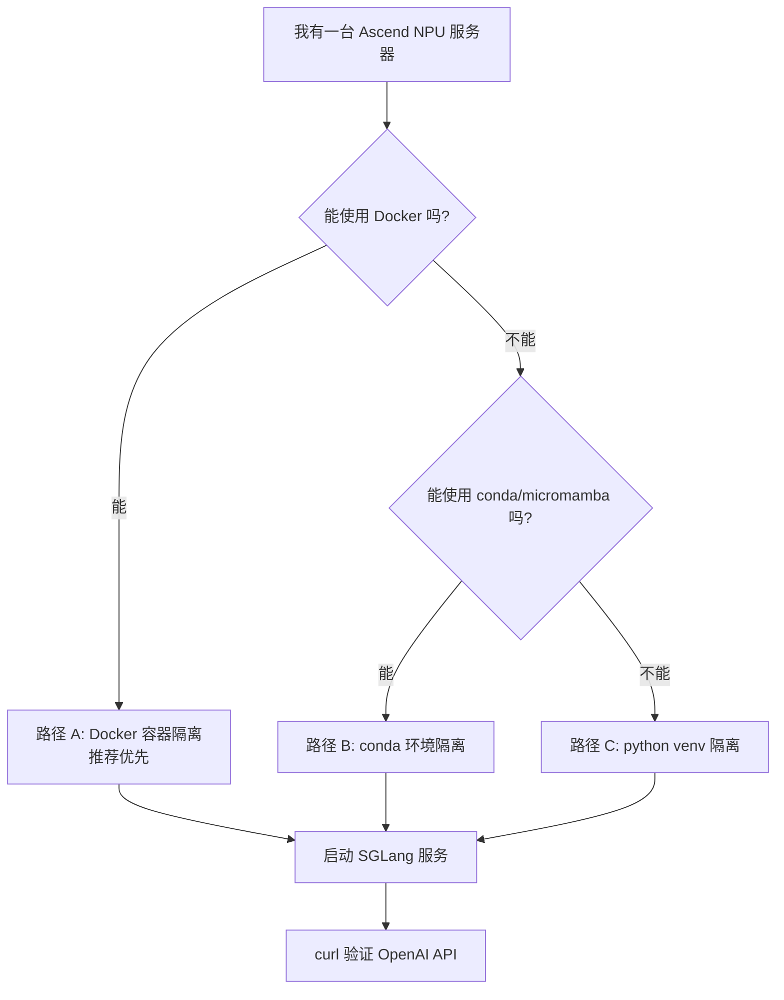
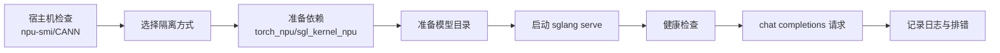

# 03. 隔离环境启动与最小 Serving 跑通

这一讲把“启动与最小 serving 跑通”细化成一份完整操作手册：在一台 GNU/Linux + Ascend NPU 服务器上，如何尽量**不影响整机环境**，通过 Docker、conda 或 Python venv 拉起 SGLang-NPU 运行环境，并最终启动一个 OpenAI-compatible 服务。

官方 Ascend NPU 文档当前给出的关键组合包括 Python 3.11、CANN 8.5.0、PyTorch/torch_npu 2.8.0、triton-ascend、memfabric-hybrid 1.0.5，并提供源码安装和 Docker 两条路径。实际部署时，以服务器驱动、CANN、HDK、镜像和内部 wheel 适配关系为准。

## 本讲目标

完成后你应该得到三样东西：

1. 一个不会污染系统 Python 的 SGLang-NPU 运行环境。
2. 一套可复用的启动脚本。
3. 一个能通过 `/v1/chat/completions` 返回 token 的最小服务。

## 个人目录约定

本讲所有你主动创建、下载、缓存和运行产生的文件，都默认放在你的个人目录：

```text
/home/{myspace}
```

## 不影响他人环境的原则

这台服务器如果是多人共用机器，本讲所有步骤都必须遵守一个边界：只影响你自己的用户空间、你自己启动的 shell、你自己的虚拟环境、你自己的容器或 `systemctl --user` 用户服务。

具体来说：

- 本讲里的 `export` 只应该在当前 shell、启动脚本或容器 `-e` 参数里使用；它们会影响当前 shell 及其子进程，关闭终端后自然失效。
- `/home/{myspace}/sglang_npu_env.sh` 是个人手动加载文件，不要自动写入 `/etc/profile`、`/etc/environment`、`/etc/bash.bashrc` 等全局 profile。
- 不要使用 `sudo pip install`，不要修改系统 Python，不要把包安装到系统 site-packages。
- 不要执行 `conda config --system`，不要改全局 pip 配置；缓存目录使用 `PIP_CACHE_DIR=${SGLANG_CACHE}/pip` 固定到个人目录。
- 不要把模型、wheel、日志、缓存长期写到 `/tmp`、`/usr/local`、`/opt`、`/root`、`/var` 等共享或系统目录。
- Docker 示例里的 `-e` 环境变量只影响该容器；容器名和端口是全机共享资源，需要带上个人标识并避开他人正在使用的端口。
- 后台服务只使用 `systemctl --user`，不要使用 `sudo systemctl` 创建系统级服务。
- 如果 Docker 镜像层也必须落在个人目录，使用 rootless Docker，或请管理员统一配置；普通用户不要自行修改系统 Docker daemon。

后续命令统一使用下面这些变量。请把 `{myspace}` 替换成你自己的 Linux 用户或个人空间名：

```bash
export USER_SPACE=/home/{myspace}
export SGLANG_WORKSPACE=${USER_SPACE}/sglang-npu-workspace
export SGLANG_REPO=${USER_SPACE}/SGLangTutorial
export SGLANG_MODELS=${SGLANG_WORKSPACE}/models
export SGLANG_CACHE=${SGLANG_WORKSPACE}/cache
export SGLANG_LOGS=${SGLANG_WORKSPACE}/logs
export SGLANG_WHEELS=${SGLANG_WORKSPACE}/wheels
export SGLANG_SCRIPTS=${SGLANG_WORKSPACE}/scripts
export SGLANG_CONDA_ROOT=${SGLANG_WORKSPACE}/conda
export SGLANG_VENV=${SGLANG_WORKSPACE}/venvs/sglang_npu

mkdir -p \
  "$SGLANG_MODELS" \
  "$SGLANG_CACHE" \
  "$SGLANG_LOGS" \
  "$SGLANG_WHEELS" \
  "$SGLANG_SCRIPTS" \
  "$SGLANG_CONDA_ROOT" \
  "$(dirname "$SGLANG_VENV")"
```

建议把这些变量写入一个个人手动加载文件，例如：

```bash
cat > ${USER_SPACE}/sglang_npu_env.sh <<'EOF'
export USER_SPACE=/home/{myspace}
export SGLANG_WORKSPACE=${USER_SPACE}/sglang-npu-workspace
export SGLANG_REPO=${USER_SPACE}/SGLangTutorial
export SGLANG_MODELS=${SGLANG_WORKSPACE}/models
export SGLANG_CACHE=${SGLANG_WORKSPACE}/cache
export SGLANG_LOGS=${SGLANG_WORKSPACE}/logs
export SGLANG_WHEELS=${SGLANG_WORKSPACE}/wheels
export SGLANG_SCRIPTS=${SGLANG_WORKSPACE}/scripts
export SGLANG_CONDA_ROOT=${SGLANG_WORKSPACE}/conda
export SGLANG_VENV=${SGLANG_WORKSPACE}/venvs/sglang_npu

export HF_HOME=${SGLANG_CACHE}/huggingface
export TRANSFORMERS_CACHE=${HF_HOME}
export HUGGINGFACE_HUB_CACHE=${HF_HOME}/hub
export TORCH_HOME=${SGLANG_CACHE}/torch
export XDG_CACHE_HOME=${SGLANG_CACHE}/xdg
export PIP_CACHE_DIR=${SGLANG_CACHE}/pip
export CONDA_PKGS_DIRS=${SGLANG_CONDA_ROOT}/pkgs
export SGLANG_SET_CPU_AFFINITY=1
EOF
```

之后每次只在需要运行 SGLang 的终端里执行，不要把它追加到全局 profile 或多人共享的 shell 初始化文件：

```bash
source /home/{myspace}/sglang_npu_env.sh
mkdir -p "$SGLANG_MODELS" "$SGLANG_CACHE" "$SGLANG_LOGS" "$SGLANG_WHEELS" "$SGLANG_SCRIPTS" "$SGLANG_CONDA_ROOT"
```

这条 `source` 只影响当前 shell 和它启动的子进程。想清理时，关闭这个终端最简单；如果必须在同一个 shell 中清理，可以 `unset USER_SPACE SGLANG_WORKSPACE SGLANG_REPO SGLANG_MODELS SGLANG_CACHE SGLANG_LOGS SGLANG_WHEELS SGLANG_SCRIPTS SGLANG_CONDA_ROOT SGLANG_VENV HF_HOME TRANSFORMERS_CACHE HUGGINGFACE_HUB_CACHE TORCH_HOME XDG_CACHE_HOME PIP_CACHE_DIR CONDA_PKGS_DIRS SGLANG_SET_CPU_AFFINITY ASCEND_RT_VISIBLE_DEVICES`。

注意：普通 Docker 的镜像层默认由 Docker daemon 存在系统目录，例如 `/var/lib/docker`。如果你要求“镜像层本身也必须保存在 `/home/{myspace}`”，需要使用 rootless Docker，或者请管理员统一把 Docker `data-root` 配到合适位置。不要在多人服务器上自行改系统 Docker daemon。否则，Docker 路径能保证模型、缓存、日志、脚本等业务文件在 `/home/{myspace}`，但 `docker pull` 的镜像层不完全受普通用户控制。

## Warning 对照

如果你在启动时看到下面这些 warning，优先按表格处理：

| Warning | 含义 | 教程中的处理 |
|---|---|---|
| `Environment variable SGL_* is deprecated, please use SGLANG_*` | 旧版教程或个人脚本里仍使用 `SGL_MODELS`、`SGL_CACHE` 等旧变量名。 | 本讲统一改为 `SGLANG_MODELS`、`SGLANG_CACHE`、`SGLANG_WORKSPACE` 等；检查自己的 `sglang_npu_env.sh` 和启动脚本。 |
| `'python -m sglang.launch_server' is still supported, but 'sglang serve' is the recommended entrypoint` | 旧启动入口仍可用，但官方推荐 CLI 入口。 | 本讲所有服务启动命令统一使用 `sglang serve`。 |
| `Triton is not supported on current platform, roll back to CPU` | 某些 FLA/Triton 辅助路径在当前 Ascend 平台不可用，代码会回退；它不等同于 NPU 服务启动失败。 | 先确认 `--device npu`、`--attention-backend ascend`、`torch.npu.is_available()` 和 `sgl_kernel_npu`；如果性能异常，再检查 `triton-ascend`、kernel wheel 和当前模型是否走到了非 Ascend 优化路径。 |

## 推荐路径选择



| 路径 | 隔离程度 | 适合场景 | 风险 |
|---|---|---|---|
| Docker | 最高 | 快速验证、部署复现、避免污染系统 Python | 需要正确映射 NPU 设备和 Ascend driver。 |
| conda/micromamba | 中等 | 源码阅读、开发调试、不能用 Docker 但能建环境 | 依赖仍依赖宿主机 CANN。 |
| Python venv | 中等偏低 | 服务器无 conda，但允许使用系统 Python 3.11 | Python 版本必须合适，隔离弱于 conda。 |

## 总体流程



## 0. 宿主机只做最小检查

无论使用 Docker、conda 还是 venv，Ascend 驱动和 CANN 通常都依赖宿主机。先确认宿主机有可用 NPU：

```bash
uname -a
cat /etc/os-release
npu-smi info
npu-smi info -t topo
```

检查 CANN 常见位置：

```bash
ls /usr/local/Ascend/ascend-toolkit/latest
ls /usr/local/Ascend/driver
cat /etc/ascend_install.info || true
```

加载 CANN 环境：

```bash
source /usr/local/Ascend/ascend-toolkit/latest/set_env.sh
echo $ASCEND_TOOLKIT_HOME
```

如果 `npu-smi info` 失败，先不要继续安装 SGLang。这通常是驱动、固件、设备权限或容器映射问题，不是 SGLang 问题。

## 1. 目录规划

如果前面没有执行“个人目录约定”里的初始化命令，这里再执行一次。后续所有路径都基于 `/home/{myspace}`：

```bash
source /home/{myspace}/sglang_npu_env.sh

mkdir -p \
  "$SGLANG_MODELS" \
  "$SGLANG_CACHE" \
  "$SGLANG_LOGS" \
  "$SGLANG_WHEELS" \
  "$SGLANG_SCRIPTS" \
  "$SGLANG_CONDA_ROOT" \
  "$(dirname "$SGLANG_VENV")"
```

如果是多人服务器，建议使用自己的用户目录或项目目录，不要把临时文件写到系统 Python、`/usr/local` 或全局 site-packages。

### 1.1 源码仓库也放在个人目录

如果服务器上还没有本教程仓库或 SGLang 源码，统一放到：

```text
/home/{myspace}/SGLangTutorial
```

示例：

```bash
source /home/{myspace}/sglang_npu_env.sh
cd "$USER_SPACE"

git clone <your-repo-url> "$SGLANG_REPO"
cd "$SGLANG_REPO"
git status
```

如果仓库已经存在：

```bash
source /home/{myspace}/sglang_npu_env.sh
cd "$SGLANG_REPO"
git pull
```

这样源码、editable install 入口、教程文档和后续脚本都在 `/home/{myspace}` 之下。

## 2. 路径 A：Docker 隔离运行

Docker 是优先推荐的方式，因为它对 Python 包、SGLang 包、部分运行依赖的隔离最好；宿主机只需要提供 Ascend driver、固件、NPU 设备节点和必要的挂载。

### 2.1 选择镜像

官方镜像命名方式：

```text
docker.io/lmsysorg/sglang:<tag>
```

常见 Ascend tag：

```text
main-cann8.5.0-a3
main-cann8.5.0-910b
v0.5.6-cann8.5.0-a3
v0.5.6-cann8.5.0-910b
```

选择建议：

| 硬件 | 镜像标签倾向 |
|---|---|
| Atlas 800I A3 | `*-cann8.5.0-a3` |
| Atlas 800I A2 / 910B | `*-cann8.5.0-910b` |
| 不确定 | 先看服务器交付文档和 `npu-smi info`。 |

拉取示例：

```bash
docker pull docker.io/lmsysorg/sglang:main-cann8.5.0-910b
```

如果必须让 Docker 镜像层也落在 `/home/{myspace}`，不要自己修改系统 Docker daemon。优先使用 rootless Docker，或请管理员评估后统一配置类似：

```json
{
  "data-root": "/home/{myspace}/docker-data"
}
```

这一步通常需要管理员权限，而且会影响整台机器的 Docker 行为。本教程后续 Docker 命令只保证挂载出来的模型、缓存和日志都在 `/home/{myspace}`。

### 2.2 进入调试容器

下面示例按 8 卡 Atlas 800I A2/910B 写。A3 或 16 卡机器需要增加 `/dev/davinci8` 到 `/dev/davinci15`。

```bash
export IMAGE=docker.io/lmsysorg/sglang:main-cann8.5.0-910b
source /home/{myspace}/sglang_npu_env.sh
USER_TAG=$(basename "$USER_SPACE")
mkdir -p "$SGLANG_WORKSPACE"/{models,cache,logs,wheels,scripts}

# 容器名是全机唯一资源，建议带上个人空间名，避免和其他用户冲突。
# Docker -e 变量只影响当前容器，不会写入宿主机环境。
docker run -it --rm \
  --name "sglang-npu-dev-${USER_TAG}" \
  --privileged \
  --network=host \
  --ipc=host \
  --shm-size=16g \
  --device=/dev/davinci0 \
  --device=/dev/davinci1 \
  --device=/dev/davinci2 \
  --device=/dev/davinci3 \
  --device=/dev/davinci4 \
  --device=/dev/davinci5 \
  --device=/dev/davinci6 \
  --device=/dev/davinci7 \
  --device=/dev/davinci_manager \
  --device=/dev/hisi_hdc \
  -v /usr/local/sbin:/usr/local/sbin:ro \
  -v /usr/local/Ascend/driver:/usr/local/Ascend/driver:ro \
  -v /usr/local/Ascend/firmware:/usr/local/Ascend/firmware:ro \
  -v /etc/ascend_install.info:/etc/ascend_install.info:ro \
  -v /var/queue_schedule:/var/queue_schedule \
  -v "$SGLANG_WORKSPACE":/workspace/sglang-npu \
  -e HF_TOKEN="${HF_TOKEN}" \
  -e ASCEND_RT_VISIBLE_DEVICES=0 \
  -e HF_HOME=/workspace/sglang-npu/cache/huggingface \
  -e TRANSFORMERS_CACHE=/workspace/sglang-npu/cache/huggingface \
  -e HUGGINGFACE_HUB_CACHE=/workspace/sglang-npu/cache/huggingface/hub \
  -e TORCH_HOME=/workspace/sglang-npu/cache/torch \
  -e XDG_CACHE_HOME=/workspace/sglang-npu/cache/xdg \
  -e PIP_CACHE_DIR=/workspace/sglang-npu/cache/pip \
  "$IMAGE" \
  bash
```

容器里检查：

```bash
npu-smi info
python3 - <<'PY'
import torch
import torch_npu
print("torch:", torch.__version__)
print("torch_npu:", torch_npu.__version__)
print("npu available:", torch.npu.is_available())
print("npu count:", torch.npu.device_count())
PY
python3 - <<'PY'
import sglang
import sgl_kernel_npu
print("sglang ok")
print("sgl_kernel_npu ok")
PY
```

### 2.3 在容器内从 GitHub 重新安装 SGLang

官方 Docker 镜像里通常已经带有一份可运行的 SGLang 环境，适合快速验证 NPU、CANN、torch_npu 和 kernel 是否匹配。但如果你的目标是学习源码、验证某个分支、修改 SGLang 代码，建议把镜像只当作 Ascend/CANN/Python 基础环境，在容器里重新从 GitHub 拉取 SGLang 并安装到你自己的挂载目录。

推荐目录约定如下：

```text
/workspace/sglang-npu/
  src/sglang/                 # 从 GitHub 拉取的 SGLang 源码
  venvs/sglang-source-dev/    # 可选：容器内个人 venv
  cache/
  models/
  logs/
```

进入前面 `sglang-npu-dev-${USER_TAG}` 调试容器后，先准备源码目录：

```bash
cd /workspace/sglang-npu
mkdir -p src venvs cache logs wheels

git clone https://github.com/sgl-project/sglang.git src/sglang
cd src/sglang

# 可选：切换到你要学习或验证的分支、tag、commit。
# git checkout <branch-or-tag-or-commit>
git status
```

如果你的服务器无法直接访问 GitHub，可以在可联网机器上 clone 后用 `rsync`、对象存储或内网制品库同步到 `/home/{myspace}/sglang-npu-workspace/src/sglang`。因为该目录已经挂载到容器里的 `/workspace/sglang-npu/src/sglang`，容器内不需要再写入系统目录。

接下来有两种安装方式。

**方式 A：复用镜像依赖，只覆盖 SGLang 源码**

这种方式最快，仍然使用镜像中已经匹配好的 `torch`、`torch_npu`、CANN 相关依赖和 kernel wheel，但 SGLang Python 包会指向你刚从 GitHub 拉取的源码：

```bash
cd /workspace/sglang-npu/src/sglang

# NPU 分支通常使用 NPU 版 pyproject。
cp python/pyproject_npu.toml python/pyproject.toml

python3 -m pip install --upgrade pip setuptools wheel
python3 -m pip install -e "python[all_npu]"
```

验证当前导入的 SGLang 是否来自你的源码目录：

```bash
python3 - <<'PY'
import sglang
import sglang.srt
print("sglang:", sglang.__file__)
print("srt:", sglang.srt.__file__)
PY
```

输出路径应该包含 `/workspace/sglang-npu/src/sglang/python/sglang`。如果仍然指向镜像内置路径，说明 editable install 没有生效，可以检查 `pip show sglang`：

```bash
python3 -m pip show sglang
python3 -m pip list | grep -E 'sglang|torch|torch-npu|torch_npu|triton'
```

**方式 B：在容器内创建独立 venv 后从源码安装**

这种方式更干净，适合你不想污染镜像内 Python site-packages，或需要在同一个容器里反复切换不同 SGLang 分支。venv 放在 `/workspace/sglang-npu/venvs`，仍然是你的个人挂载目录：

```bash
cd /workspace/sglang-npu
python3 -m venv venvs/sglang-source-dev
source venvs/sglang-source-dev/bin/activate

python -m pip install --upgrade pip setuptools wheel
```

如果镜像内已经有与当前 CANN 匹配的 `torch`、`torch_npu`、`triton-ascend`、`sgl_kernel_npu`，但普通 venv 看不到它们，可以改用依赖镜像 site-packages 的 venv：

```bash
deactivate 2>/dev/null || true
rm -rf /workspace/sglang-npu/venvs/sglang-source-dev
python3 -m venv --system-site-packages /workspace/sglang-npu/venvs/sglang-source-dev
source /workspace/sglang-npu/venvs/sglang-source-dev/bin/activate
python -m pip install --upgrade pip setuptools wheel
```

如果你希望 venv 完全独立，则需要按前面版本表重新安装匹配的依赖：

```bash
python -m pip install torch==2.8.0 torchvision==0.23.0 \
  --index-url https://download.pytorch.org/whl/cpu
python -m pip install torch_npu==2.8.0
python -m pip install triton-ascend memfabric-hybrid==1.0.5

# sgl_kernel_npu 通常需要使用官方发布 wheel、镜像内 wheel、内部制品库或源码构建产物。
# python -m pip install /workspace/sglang-npu/wheels/<sgl_kernel_npu-*.whl>
```

然后安装 GitHub 源码：

```bash
cd /workspace/sglang-npu/src/sglang
cp python/pyproject_npu.toml python/pyproject.toml
python -m pip install -e "python[all_npu]"
```

最后做一次完整验证：

```bash
python - <<'PY'
import torch
import torch_npu
import sglang
import sgl_kernel_npu
print("torch:", torch.__version__)
print("torch_npu:", torch_npu.__version__)
print("npu available:", torch.npu.is_available())
print("sglang:", sglang.__file__)
print("sgl_kernel_npu ok")
PY
sglang serve --help | head
```

从源码环境启动服务时，先确保当前 shell 已经进入对应环境和源码目录：

```bash
source /usr/local/Ascend/ascend-toolkit/latest/set_env.sh
source /workspace/sglang-npu/venvs/sglang-source-dev/bin/activate 2>/dev/null || true
cd /workspace/sglang-npu/src/sglang

export SGLANG_SET_CPU_AFFINITY=1
export ASCEND_RT_VISIBLE_DEVICES=0

sglang serve \
  --model-path /workspace/sglang-npu/models/Qwen2.5-7B-Instruct \
  --host 0.0.0.0 \
  --port 8000 \
  --device npu \
  --attention-backend ascend \
  --base-gpu-id 0 \
  --tp-size 1 \
  2>&1 | tee /workspace/sglang-npu/logs/sglang-source-dev-8000.log
```

> 如果你使用的是方式 A，没有创建 venv，可以跳过 `source /workspace/sglang-npu/venvs/sglang-source-dev/bin/activate`。关键是 `sglang.__file__` 必须指向 `/workspace/sglang-npu/src/sglang/python/sglang`，否则你仍在使用镜像内置 SGLang。

### 2.4 直接用容器内置 SGLang 启动服务

如果模型已经挂载到 `/workspace/sglang-npu/models/Qwen2.5-7B-Instruct`：

```bash
export SGLANG_SET_CPU_AFFINITY=1
export ASCEND_RT_VISIBLE_DEVICES=0

sglang serve \
  --model-path /workspace/sglang-npu/models/Qwen2.5-7B-Instruct \
  --host 0.0.0.0 \
  --port 8000 \
  --device npu \
  --attention-backend ascend \
  --base-gpu-id 0 \
  --tp-size 1 \
  2>&1 | tee /workspace/sglang-npu/logs/sglang-npu-single.log
```

### 2.5 一条命令后台启动容器服务

如果已经验证容器可以正常看到 NPU，可以用后台模式启动：

```bash
export IMAGE=docker.io/lmsysorg/sglang:main-cann8.5.0-910b
source /home/{myspace}/sglang_npu_env.sh

docker run -d \
  --name "sglang-npu-server-$(basename "$USER_SPACE")" \
  --restart unless-stopped \
  --privileged \
  --network=host \
  --ipc=host \
  --shm-size=16g \
  --device=/dev/davinci0 \
  --device=/dev/davinci_manager \
  --device=/dev/hisi_hdc \
  -v /usr/local/sbin:/usr/local/sbin:ro \
  -v /usr/local/Ascend/driver:/usr/local/Ascend/driver:ro \
  -v /usr/local/Ascend/firmware:/usr/local/Ascend/firmware:ro \
  -v /etc/ascend_install.info:/etc/ascend_install.info:ro \
  -v /var/queue_schedule:/var/queue_schedule \
  -v "$SGLANG_WORKSPACE":/workspace/sglang-npu \
  -e ASCEND_RT_VISIBLE_DEVICES=0 \
  -e SGLANG_SET_CPU_AFFINITY=1 \
  -e HF_HOME=/workspace/sglang-npu/cache/huggingface \
  -e TRANSFORMERS_CACHE=/workspace/sglang-npu/cache/huggingface \
  -e HUGGINGFACE_HUB_CACHE=/workspace/sglang-npu/cache/huggingface/hub \
  -e TORCH_HOME=/workspace/sglang-npu/cache/torch \
  -e XDG_CACHE_HOME=/workspace/sglang-npu/cache/xdg \
  -e PIP_CACHE_DIR=/workspace/sglang-npu/cache/pip \
  "$IMAGE" \
  sglang serve \
    --model-path /workspace/sglang-npu/models/Qwen2.5-7B-Instruct \
    --host 0.0.0.0 \
    --port 8000 \
    --device npu \
    --attention-backend ascend \
    --base-gpu-id 0 \
    --tp-size 1
```

查看日志：

```bash
source /home/{myspace}/sglang_npu_env.sh
docker logs -f "sglang-npu-server-$(basename "$USER_SPACE")"
```

停止服务：

```bash
source /home/{myspace}/sglang_npu_env.sh
docker stop "sglang-npu-server-$(basename "$USER_SPACE")"
docker rm "sglang-npu-server-$(basename "$USER_SPACE")"
```

## 3. 路径 B：conda / micromamba 隔离安装

如果不能用 Docker，建议使用 conda 或 micromamba。它能隔离 Python 和 pip 包，但仍依赖宿主机 CANN 和 driver。

### 3.1 创建环境

```bash
source /home/{myspace}/sglang_npu_env.sh
conda create -p "$SGLANG_CONDA_ROOT/envs/sglang_npu" python=3.11 -y
conda activate "$SGLANG_CONDA_ROOT/envs/sglang_npu"
python --version
```

或 micromamba：

```bash
source /home/{myspace}/sglang_npu_env.sh
export MAMBA_ROOT_PREFIX=${SGLANG_CONDA_ROOT}/micromamba
micromamba create -p "$MAMBA_ROOT_PREFIX/envs/sglang_npu" python=3.11 -y
micromamba activate "$MAMBA_ROOT_PREFIX/envs/sglang_npu"
```

加载 CANN：

```bash
source /usr/local/Ascend/ascend-toolkit/latest/set_env.sh
```

建议把 CANN 加载写成环境激活脚本：

```bash
mkdir -p "$CONDA_PREFIX/etc/conda/activate.d"
cat > "$CONDA_PREFIX/etc/conda/activate.d/ascend.sh" <<'EOF'
source /usr/local/Ascend/ascend-toolkit/latest/set_env.sh
export USER_SPACE=/home/{myspace}
export SGLANG_WORKSPACE=${USER_SPACE}/sglang-npu-workspace
export SGLANG_CACHE=${SGLANG_WORKSPACE}/cache
export HF_HOME=${SGLANG_CACHE}/huggingface
export TRANSFORMERS_CACHE=${HF_HOME}
export HUGGINGFACE_HUB_CACHE=${HF_HOME}/hub
export TORCH_HOME=${SGLANG_CACHE}/torch
export XDG_CACHE_HOME=${SGLANG_CACHE}/xdg
export PIP_CACHE_DIR=${SGLANG_CACHE}/pip
export SGLANG_SET_CPU_AFFINITY=1
EOF
```

这个脚本只写入当前 conda 环境的 `$CONDA_PREFIX/etc/conda/activate.d/`，只在激活这个环境时生效，不会影响其他 conda 环境、其他用户或系统 shell。不要把同样内容写入 `/etc/profile` 或共享的 `~/.bashrc`。

### 3.2 安装依赖

当前官方示例：

```bash
PYTORCH_VERSION=2.8.0
TORCHVISION_VERSION=0.23.0
TORCH_NPU_VERSION=2.8.0

source /home/{myspace}/sglang_npu_env.sh
pip install --upgrade pip setuptools wheel
pip install torch==${PYTORCH_VERSION} torchvision==${TORCHVISION_VERSION} \
  --index-url https://download.pytorch.org/whl/cpu
pip install torch_npu==${TORCH_NPU_VERSION}
pip install triton-ascend
```

这里的 `pip` 必须来自已激活的 conda/micromamba 环境；不要加 `sudo`，也不要在未激活环境时安装，避免写入系统 Python。

如果要使用 PD disaggregation：

```bash
pip install memfabric-hybrid==1.0.5
```

安装或检查 SGLang NPU kernel：

```bash
python - <<'PY'
try:
    import sgl_kernel_npu
    print("sgl_kernel_npu already installed")
except Exception as e:
    print("need install sgl_kernel_npu:", repr(e))
PY
```

如果失败，需要按你们机器对应的 wheel、官方构建说明或内部源安装 `sgl_kernel_npu`。

### 3.3 安装 SGLang 源码

在源码目录：

```bash
cd /home/{myspace}/SGLangTutorial
cp python/pyproject_npu.toml python/pyproject.toml
pip install -e "python[all_npu]"
```

验证：

```bash
python -m sglang.check_env
python - <<'PY'
import torch
import torch_npu
import sglang
import sgl_kernel_npu
print("npu available:", torch.npu.is_available())
print("npu count:", torch.npu.device_count())
print("all imports ok")
PY
```

## 4. 路径 C：Python venv 隔离安装

如果服务器没有 conda，但系统有 Python 3.11，可以使用 venv：

```bash
source /home/{myspace}/sglang_npu_env.sh
python3.11 -m venv "$SGLANG_VENV"
source "$SGLANG_VENV/bin/activate"
python --version
source /usr/local/Ascend/ascend-toolkit/latest/set_env.sh
```

安装依赖：

```bash
source /home/{myspace}/sglang_npu_env.sh
pip install --upgrade pip setuptools wheel

pip install torch==2.8.0 torchvision==0.23.0 \
  --index-url https://download.pytorch.org/whl/cpu
pip install torch_npu==2.8.0
pip install triton-ascend
pip install memfabric-hybrid==1.0.5

cd /home/{myspace}/SGLangTutorial
cp python/pyproject_npu.toml python/pyproject.toml
pip install -e "python[all_npu]"
```

venv 的缺点是 Python 版本依赖系统已安装的 `python3.11`。如果系统 Python 太旧，不建议强行用 venv。

## 5. 离线或内网环境下载依赖

很多 NPU 服务器不能直接访问公网。建议在可联网机器上提前下载 wheel，然后拷贝到服务器。

### 5.1 下载 wheel

```bash
source /home/{myspace}/sglang_npu_env.sh
mkdir -p "$SGLANG_WHEELS"

pip download torch==2.8.0 torchvision==0.23.0 \
  --index-url https://download.pytorch.org/whl/cpu \
  -d "$SGLANG_WHEELS"

pip download torch_npu==2.8.0 triton-ascend memfabric-hybrid==1.0.5 \
  -d "$SGLANG_WHEELS"
```

`sgl_kernel_npu` 可能需要从官方发布页、内部制品库或源码构建得到 wheel，把它也放入 `$SGLANG_WHEELS`。

### 5.2 离线安装

把 `wheels/` 拷贝到服务器：

```bash
pip install --no-index --find-links "$SGLANG_WHEELS" \
  torch==2.8.0 torchvision==0.23.0 torch_npu==2.8.0 triton-ascend memfabric-hybrid==1.0.5
```

安装本地源码：

```bash
cd /home/{myspace}/SGLangTutorial
cp python/pyproject_npu.toml python/pyproject.toml
pip install --no-index --find-links "$SGLANG_WHEELS" -e "python[all_npu]"
```

## 6. 模型准备

建议把模型放在独立目录：

```bash
source /home/{myspace}/sglang_npu_env.sh
mkdir -p "$SGLANG_MODELS"
```

如果能联网：

```bash
export HF_HOME=$SGLANG_CACHE/huggingface
export HF_TOKEN=<your_token_if_needed>

huggingface-cli download Qwen/Qwen2.5-7B-Instruct \
  --local-dir "$SGLANG_MODELS/Qwen2.5-7B-Instruct"
```

如果不能联网：

- 在可联网机器下载模型。
- 用 `rsync`、对象存储或内网制品库拷贝到 `$SGLANG_MODELS`。
- 保留 tokenizer、config、safetensors 等完整文件。

检查：

```bash
ls "$SGLANG_MODELS/Qwen2.5-7B-Instruct"
```

## 7. 编写可复用启动脚本

创建 `run_sglang_npu_single.sh`：

```bash
source /home/{myspace}/sglang_npu_env.sh
cat > "$SGLANG_SCRIPTS/run_sglang_npu_single.sh" <<'EOF'
#!/usr/bin/env bash
set -euo pipefail

source /usr/local/Ascend/ascend-toolkit/latest/set_env.sh

export USER_SPACE=${USER_SPACE:-/home/{myspace}}
export SGLANG_WORKSPACE=${SGLANG_WORKSPACE:-${USER_SPACE}/sglang-npu-workspace}
export SGLANG_CACHE=${SGLANG_CACHE:-${SGLANG_WORKSPACE}/cache}
export SGLANG_MODELS=${SGLANG_MODELS:-${SGLANG_WORKSPACE}/models}
export SGLANG_LOGS=${SGLANG_LOGS:-${SGLANG_WORKSPACE}/logs}
export ASCEND_RT_VISIBLE_DEVICES=${ASCEND_RT_VISIBLE_DEVICES:-0}
export SGLANG_SET_CPU_AFFINITY=${SGLANG_SET_CPU_AFFINITY:-1}
export HF_HOME=${HF_HOME:-${SGLANG_CACHE}/huggingface}
export TRANSFORMERS_CACHE=${TRANSFORMERS_CACHE:-${HF_HOME}}
export HUGGINGFACE_HUB_CACHE=${HUGGINGFACE_HUB_CACHE:-${HF_HOME}/hub}
export TORCH_HOME=${TORCH_HOME:-${SGLANG_CACHE}/torch}
export XDG_CACHE_HOME=${XDG_CACHE_HOME:-${SGLANG_CACHE}/xdg}
export PIP_CACHE_DIR=${PIP_CACHE_DIR:-${SGLANG_CACHE}/pip}

MODEL_PATH=${MODEL_PATH:-${SGLANG_MODELS}/Qwen2.5-7B-Instruct}
HOST=${HOST:-0.0.0.0}
PORT=${PORT:-8000}
LOG_DIR=${LOG_DIR:-${SGLANG_LOGS}}
mkdir -p "$LOG_DIR"

sglang serve \
  --model-path "$MODEL_PATH" \
  --host "$HOST" \
  --port "$PORT" \
  --device npu \
  --attention-backend ascend \
  --base-gpu-id 0 \
  --tp-size 1 \
  2>&1 | tee "$LOG_DIR/sglang-npu-single-${PORT}.log"
EOF

chmod +x "$SGLANG_SCRIPTS/run_sglang_npu_single.sh"
```

启动：

```bash
source /home/{myspace}/sglang_npu_env.sh
MODEL_PATH="$SGLANG_MODELS/Qwen2.5-7B-Instruct" \
PORT=8000 \
"$SGLANG_SCRIPTS/run_sglang_npu_single.sh"
```

## 8. 使用 systemd 用户服务可选

如果你想在不写入系统服务的情况下让服务后台运行，可以使用 user-level systemd。这里所有命令都必须带 `--user`，服务文件只放在 `/home/{myspace}/.config/systemd/user/`，不要使用 `sudo systemctl` 创建系统级服务。

创建用户服务：

```bash
source /home/{myspace}/sglang_npu_env.sh
mkdir -p "${USER_SPACE}/.config/systemd/user"
cat > "${USER_SPACE}/.config/systemd/user/sglang-npu.service" <<EOF
[Unit]
Description=SGLang NPU Server
After=network.target

[Service]
Type=simple
WorkingDirectory=$SGLANG_WORKSPACE
Environment=MODEL_PATH=$SGLANG_MODELS/Qwen2.5-7B-Instruct
Environment=PORT=8000
Environment=USER_SPACE=$USER_SPACE
Environment=SGLANG_WORKSPACE=$SGLANG_WORKSPACE
Environment=SGLANG_CACHE=$SGLANG_CACHE
Environment=SGLANG_MODELS=$SGLANG_MODELS
Environment=SGLANG_LOGS=$SGLANG_LOGS
ExecStart=$SGLANG_SCRIPTS/run_sglang_npu_single.sh
Restart=on-failure
RestartSec=5

[Install]
WantedBy=default.target
EOF
```

启动：

```bash
systemctl --user daemon-reload
systemctl --user start sglang-npu
systemctl --user status sglang-npu
journalctl --user -u sglang-npu -f
```

停止：

```bash
systemctl --user stop sglang-npu
```

## 9. 健康检查和请求验证

健康检查：

```bash
curl http://127.0.0.1:8000/health
curl http://127.0.0.1:8000/v1/models
```

非流式请求：

```bash
curl http://127.0.0.1:8000/v1/chat/completions \
  -H "Content-Type: application/json" \
  -d '{
    "model": "default",
    "messages": [{"role": "user", "content": "用一句话介绍 SGLang。"}],
    "temperature": 0,
    "max_tokens": 64
  }'
```

流式请求：

```bash
curl http://127.0.0.1:8000/v1/chat/completions \
  -H "Content-Type: application/json" \
  -d '{
    "model": "default",
    "stream": true,
    "messages": [{"role": "user", "content": "列出三条 Ascend NPU 部署检查项。"}],
    "max_tokens": 128
  }'
```

## 10. 启动日志验收

日志里重点确认：

```text
device=npu
attention_backend=ascend
prefill_attention_backend=ascend
decode_attention_backend=ascend
Init torch distributed begin
Init torch distributed ends
Capture npu graph begin
Capture npu graph end
```

如果没有看到 graph capture，也不一定是错误。可能是你显式加了 `--disable-cuda-graph`，或者当前模型/模式不走 graph。首次跑通时正确性优先。

## 11. 常见隔离问题

| 现象 | 原因 | 处理 |
|---|---|---|
| 容器里 `npu-smi` 不存在 | 没挂载 `/usr/local/sbin` 或 driver 路径 | 检查 Docker `-v /usr/local/sbin` 和 Ascend driver 挂载。 |
| 容器里看不到 NPU | 没映射 `/dev/davinci*` | 增加对应 `--device`。 |
| conda 环境里 `torch.npu.is_available()` 为 False | 没 source CANN 或版本不匹配 | `source set_env.sh`，检查 torch/torch_npu/CANN。 |
| `import sgl_kernel_npu` 失败 | NPU kernel 包没装 | 安装匹配版本 wheel 或使用官方 Docker。 |
| 启动卡在 graph capture | graph 相关问题 | 先加 `--disable-cuda-graph` 跑通。 |
| `Triton is not supported on current platform` | 当前平台不支持某些 Triton 路径，触发 CPU fallback | 如果服务能正常使用且日志确认 `attention_backend=ascend`，可先记录为性能风险；若吞吐异常，检查 `triton-ascend`、`sgl_kernel_npu` 和模型算子路径。 |
| 端口被占用 | 8000 已有服务 | 优先换成自己的 `--port`；不要停止无法确认归属的旧服务。 |
| 模型下载很慢 | 服务器无公网 | 离线下载模型和 wheel。 |

## 12. 最小排错命令

绕开 graph：

```bash
sglang serve \
  --model-path "$SGLANG_MODELS/Qwen2.5-7B-Instruct" \
  --host 0.0.0.0 \
  --port 8000 \
  --device npu \
  --attention-backend ascend \
  --base-gpu-id 0 \
  --tp-size 1 \
  --disable-cuda-graph
```

只暴露单卡：

```bash
export ASCEND_RT_VISIBLE_DEVICES=0
```

查看占用：

```bash
npu-smi info
ps -ef | grep sglang
lsof -i :8000
```

## 13. 最小跑通验收标准

- 不修改系统 Python。
- 不写入 `/etc/profile`、`/etc/environment`、系统 Docker daemon 或系统级 systemd 服务。
- Docker、conda 或 venv 至少一种隔离方式可用。
- `torch.npu.is_available()` 为 `True`。
- `import sglang` 和 `import sgl_kernel_npu` 成功。
- 服务日志确认 `device=npu` 和 `attention_backend=ascend`。
- `/health` 正常。
- `/v1/chat/completions` 非流式和流式都能返回。
- 日志文件保存在独立工作目录。

## 参考资料

- SGLang 官方 Ascend NPU 安装文档：https://docs.sglang.io/platforms/ascend_npu.html
- 本教程安装基础：`learning/sglang-ascend-npu/01-environment-and-install.md`
- 后续参数拆解：`learning/sglang-ascend-npu/04-npu-backend-args.md`
