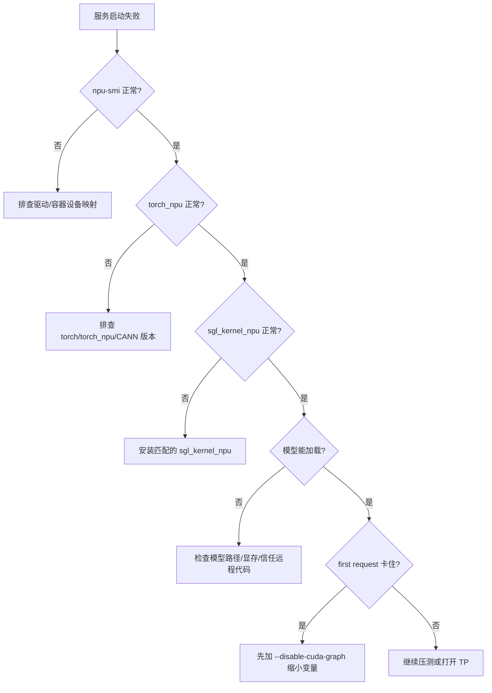

# 03. 启动与最小 Serving 跑通

这一讲只解决一件事：在 Ascend NPU 服务器上把 SGLang 服务启动起来，并用 OpenAI-compatible API 验证它真的能生成 token。不要在第一轮同时打开多卡、PD 分离、LoRA、多模态和复杂量化；最小闭环越干净，后续排错越轻松。

## 最小闭环


## 启动前检查

```bash
source /usr/local/Ascend/ascend-toolkit/latest/set_env.sh
npu-smi info

python - <<'PY'
import torch
import torch_npu
print("torch:", torch.__version__)
print("torch_npu:", torch_npu.__version__)
print("npu available:", torch.npu.is_available())
print("npu count:", torch.npu.device_count())
PY

python - <<'PY'
import sglang
import sgl_kernel_npu
print("sglang ok")
print("sgl_kernel_npu ok")
PY
```

如果 `torch.npu.is_available()` 为 `False`，先回到 `01-environment-and-install.md` 处理驱动、CANN、容器设备映射或版本匹配。

## 推荐首次模型

首次建议选择：

- 本地已经下载好的 7B/8B instruct 模型。
- 非多模态模型。
- 非 MoE 大模型。
- 非 PD 分离部署。
- 单卡显存能装下的模型。

示例路径：

```text
/data/models/Qwen2.5-7B-Instruct
/data/models/Llama-3.1-8B-Instruct
```

## 单卡启动命令

```bash
export SGLANG_SET_CPU_AFFINITY=1
export ASCEND_RT_VISIBLE_DEVICES=0

python -m sglang.launch_server \
  --model-path /data/models/Qwen2.5-7B-Instruct \
  --host 0.0.0.0 \
  --port 8000 \
  --device npu \
  --attention-backend ascend \
  --base-gpu-id 0 \
  --tp-size 1
```

说明：

| 参数 | 含义 |
|---|---|
| `--device npu` | 明确使用 NPU 设备。 |
| `--attention-backend ascend` | 使用 Ascend attention 后端。 |
| `--base-gpu-id 0` | 历史命名，在 NPU 下表示起始 device id。 |
| `--tp-size 1` | 首次只跑单卡。 |
| `ASCEND_RT_VISIBLE_DEVICES=0` | 只暴露 0 号 NPU，减少误绑定。 |

## 日志里要确认什么

启动日志里重点找：

```text
device=npu
attention_backend=ascend
prefill_attention_backend=ascend
decode_attention_backend=ascend
Init torch distributed begin/end
Capture npu graph begin/end
```

如果你看到 CUDA/FlashInfer/Triton attention backend 被选中，说明 NPU 默认参数或启动参数没有生效。

## 请求验证

非流式：

```bash
curl http://127.0.0.1:8000/v1/chat/completions \
  -H "Content-Type: application/json" \
  -d '{
    "model": "default",
    "messages": [{"role": "user", "content": "用一句话介绍 SGLang。"}],
    "temperature": 0,
    "max_tokens": 64
  }'
```

流式：

```bash
curl http://127.0.0.1:8000/v1/chat/completions \
  -H "Content-Type: application/json" \
  -d '{
    "model": "default",
    "stream": true,
    "messages": [{"role": "user", "content": "列出三条 Ascend NPU 部署检查项。"}],
    "max_tokens": 128
  }'
```

健康检查：

```bash
curl http://127.0.0.1:8000/health
curl http://127.0.0.1:8000/v1/models
```

## 首次排错流程



## 临时关闭 graph 定位问题

如果启动时卡在 graph capture，先用：

```bash
python -m sglang.launch_server \
  --model-path /data/models/Qwen2.5-7B-Instruct \
  --device npu \
  --attention-backend ascend \
  --tp-size 1 \
  --disable-cuda-graph
```

这里的 `--disable-cuda-graph` 名字沿用 CUDA，但 NPU 场景也会影响 NPU graph capture。服务跑通后再打开 graph 看性能。

## 最小跑通的验收标准

- `npu-smi info` 能看到设备。
- `torch.npu.is_available()` 为 `True`。
- `import sgl_kernel_npu` 成功。
- SGLang 启动日志显示 `device=npu` 和 `attention_backend=ascend`。
- `/health` 正常。
- `/v1/chat/completions` 非流式和流式都能返回。
- 关闭服务后 NPU 显存释放。
