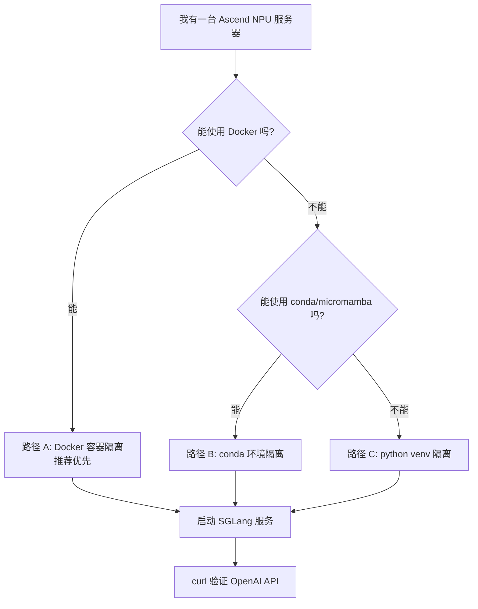
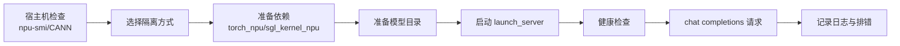

# 03. 隔离环境启动与最小 Serving 跑通

这一讲把“启动与最小 serving 跑通”细化成一份完整操作手册：在一台 GNU/Linux + Ascend NPU 服务器上，如何尽量**不影响整机环境**，通过 Docker、conda 或 Python venv 拉起 SGLang-NPU 运行环境，并最终启动一个 OpenAI-compatible 服务。

官方 Ascend NPU 文档当前给出的关键组合包括 Python 3.11、CANN 8.5.0、PyTorch/torch_npu 2.8.0、triton-ascend、memfabric-hybrid 1.0.5，并提供源码安装和 Docker 两条路径。实际部署时，以服务器驱动、CANN、HDK、镜像和内部 wheel 适配关系为准。

## 本讲目标

完成后你应该得到三样东西：

1. 一个不会污染系统 Python 的 SGLang-NPU 运行环境。
2. 一套可复用的启动脚本。
3. 一个能通过 `/v1/chat/completions` 返回 token 的最小服务。

## 推荐路径选择



| 路径 | 隔离程度 | 适合场景 | 风险 |
|---|---|---|---|
| Docker | 最高 | 快速验证、部署复现、避免污染系统 Python | 需要正确映射 NPU 设备和 Ascend driver。 |
| conda/micromamba | 中等 | 源码阅读、开发调试、不能用 Docker 但能建环境 | 依赖仍依赖宿主机 CANN。 |
| Python venv | 中等偏低 | 服务器无 conda，但允许使用系统 Python 3.11 | Python 版本必须合适，隔离弱于 conda。 |

## 总体流程



## 0. 宿主机只做最小检查

无论使用 Docker、conda 还是 venv，Ascend 驱动和 CANN 通常都依赖宿主机。先确认宿主机有可用 NPU：

```bash
uname -a
cat /etc/os-release
npu-smi info
npu-smi info -t topo
```

检查 CANN 常见位置：

```bash
ls /usr/local/Ascend/ascend-toolkit/latest
ls /usr/local/Ascend/driver
cat /etc/ascend_install.info || true
```

加载 CANN 环境：

```bash
source /usr/local/Ascend/ascend-toolkit/latest/set_env.sh
echo $ASCEND_TOOLKIT_HOME
```

如果 `npu-smi info` 失败，先不要继续安装 SGLang。这通常是驱动、固件、设备权限或容器映射问题，不是 SGLang 问题。

## 1. 目录规划

建议先规划几个目录，避免后续把模型、缓存、日志散落在系统路径里：

```bash
export SGL_WORKSPACE=$HOME/sglang-npu-workspace
export SGL_MODELS=$SGL_WORKSPACE/models
export SGL_CACHE=$SGL_WORKSPACE/cache
export SGL_LOGS=$SGL_WORKSPACE/logs
export SGL_WHEELS=$SGL_WORKSPACE/wheels

mkdir -p "$SGL_MODELS" "$SGL_CACHE" "$SGL_LOGS" "$SGL_WHEELS"
```

如果是多人服务器，建议使用自己的用户目录或项目目录，不要把临时文件写到系统 Python、`/usr/local` 或全局 site-packages。

## 2. 路径 A：Docker 隔离运行

Docker 是优先推荐的方式，因为它对 Python 包、SGLang 包、部分运行依赖的隔离最好；宿主机只需要提供 Ascend driver、固件、NPU 设备节点和必要的挂载。

### 2.1 选择镜像

官方镜像命名方式：

```text
docker.io/lmsysorg/sglang:<tag>
```

常见 Ascend tag：

```text
main-cann8.5.0-a3
main-cann8.5.0-910b
v0.5.6-cann8.5.0-a3
v0.5.6-cann8.5.0-910b
```

选择建议：

| 硬件 | 镜像标签倾向 |
|---|---|
| Atlas 800I A3 | `*-cann8.5.0-a3` |
| Atlas 800I A2 / 910B | `*-cann8.5.0-910b` |
| 不确定 | 先看服务器交付文档和 `npu-smi info`。 |

拉取示例：

```bash
docker pull docker.io/lmsysorg/sglang:main-cann8.5.0-910b
```

### 2.2 进入调试容器

下面示例按 8 卡 Atlas 800I A2/910B 写。A3 或 16 卡机器需要增加 `/dev/davinci8` 到 `/dev/davinci15`。

```bash
export IMAGE=docker.io/lmsysorg/sglang:main-cann8.5.0-910b
export SGL_WORKSPACE=$HOME/sglang-npu-workspace
mkdir -p "$SGL_WORKSPACE"/{models,cache,logs}

docker run -it --rm \
  --name sglang-npu-dev \
  --privileged \
  --network=host \
  --ipc=host \
  --shm-size=16g \
  --device=/dev/davinci0 \
  --device=/dev/davinci1 \
  --device=/dev/davinci2 \
  --device=/dev/davinci3 \
  --device=/dev/davinci4 \
  --device=/dev/davinci5 \
  --device=/dev/davinci6 \
  --device=/dev/davinci7 \
  --device=/dev/davinci_manager \
  --device=/dev/hisi_hdc \
  -v /usr/local/sbin:/usr/local/sbin:ro \
  -v /usr/local/Ascend/driver:/usr/local/Ascend/driver:ro \
  -v /usr/local/Ascend/firmware:/usr/local/Ascend/firmware:ro \
  -v /etc/ascend_install.info:/etc/ascend_install.info:ro \
  -v /var/queue_schedule:/var/queue_schedule \
  -v "$SGL_WORKSPACE":/workspace/sglang-npu \
  -v "$HOME/.cache/huggingface":/root/.cache/huggingface \
  -e HF_TOKEN="${HF_TOKEN}" \
  -e ASCEND_RT_VISIBLE_DEVICES=0 \
  "$IMAGE" \
  bash
```

容器里检查：

```bash
npu-smi info
python3 - <<'PY'
import torch
import torch_npu
print("torch:", torch.__version__)
print("torch_npu:", torch_npu.__version__)
print("npu available:", torch.npu.is_available())
print("npu count:", torch.npu.device_count())
PY
python3 - <<'PY'
import sglang
import sgl_kernel_npu
print("sglang ok")
print("sgl_kernel_npu ok")
PY
```

### 2.3 直接用容器启动服务

如果模型已经挂载到 `/workspace/sglang-npu/models/Qwen2.5-7B-Instruct`：

```bash
export SGLANG_SET_CPU_AFFINITY=1
export ASCEND_RT_VISIBLE_DEVICES=0

python3 -m sglang.launch_server \
  --model-path /workspace/sglang-npu/models/Qwen2.5-7B-Instruct \
  --host 0.0.0.0 \
  --port 8000 \
  --device npu \
  --attention-backend ascend \
  --base-gpu-id 0 \
  --tp-size 1 \
  2>&1 | tee /workspace/sglang-npu/logs/sglang-npu-single.log
```

### 2.4 一条命令后台启动容器服务

如果已经验证容器可以正常看到 NPU，可以用后台模式启动：

```bash
docker run -d \
  --name sglang-npu-server \
  --restart unless-stopped \
  --privileged \
  --network=host \
  --ipc=host \
  --shm-size=16g \
  --device=/dev/davinci0 \
  --device=/dev/davinci_manager \
  --device=/dev/hisi_hdc \
  -v /usr/local/sbin:/usr/local/sbin:ro \
  -v /usr/local/Ascend/driver:/usr/local/Ascend/driver:ro \
  -v /usr/local/Ascend/firmware:/usr/local/Ascend/firmware:ro \
  -v /etc/ascend_install.info:/etc/ascend_install.info:ro \
  -v /var/queue_schedule:/var/queue_schedule \
  -v "$SGL_WORKSPACE":/workspace/sglang-npu \
  -e ASCEND_RT_VISIBLE_DEVICES=0 \
  -e SGLANG_SET_CPU_AFFINITY=1 \
  "$IMAGE" \
  python3 -m sglang.launch_server \
    --model-path /workspace/sglang-npu/models/Qwen2.5-7B-Instruct \
    --host 0.0.0.0 \
    --port 8000 \
    --device npu \
    --attention-backend ascend \
    --base-gpu-id 0 \
    --tp-size 1
```

查看日志：

```bash
docker logs -f sglang-npu-server
```

停止服务：

```bash
docker stop sglang-npu-server
docker rm sglang-npu-server
```

## 3. 路径 B：conda / micromamba 隔离安装

如果不能用 Docker，建议使用 conda 或 micromamba。它能隔离 Python 和 pip 包，但仍依赖宿主机 CANN 和 driver。

### 3.1 创建环境

```bash
conda create -n sglang_npu python=3.11 -y
conda activate sglang_npu
python --version
```

或 micromamba：

```bash
micromamba create -n sglang_npu python=3.11 -y
micromamba activate sglang_npu
```

加载 CANN：

```bash
source /usr/local/Ascend/ascend-toolkit/latest/set_env.sh
```

建议把 CANN 加载写成环境激活脚本：

```bash
mkdir -p "$CONDA_PREFIX/etc/conda/activate.d"
cat > "$CONDA_PREFIX/etc/conda/activate.d/ascend.sh" <<'EOF'
source /usr/local/Ascend/ascend-toolkit/latest/set_env.sh
export SGLANG_SET_CPU_AFFINITY=1
EOF
```

### 3.2 安装依赖

当前官方示例：

```bash
PYTORCH_VERSION=2.8.0
TORCHVISION_VERSION=0.23.0
TORCH_NPU_VERSION=2.8.0

pip install --upgrade pip setuptools wheel
pip install torch==${PYTORCH_VERSION} torchvision==${TORCHVISION_VERSION} \
  --index-url https://download.pytorch.org/whl/cpu
pip install torch_npu==${TORCH_NPU_VERSION}
pip install triton-ascend
```

如果要使用 PD disaggregation：

```bash
pip install memfabric-hybrid==1.0.5
```

安装或检查 SGLang NPU kernel：

```bash
python - <<'PY'
try:
    import sgl_kernel_npu
    print("sgl_kernel_npu already installed")
except Exception as e:
    print("need install sgl_kernel_npu:", repr(e))
PY
```

如果失败，需要按你们机器对应的 wheel、官方构建说明或内部源安装 `sgl_kernel_npu`。

### 3.3 安装 SGLang 源码

在源码目录：

```bash
cd /path/to/SGLangTutorial
cp python/pyproject_npu.toml python/pyproject.toml
pip install -e "python[all_npu]"
```

验证：

```bash
python -m sglang.check_env
python - <<'PY'
import torch
import torch_npu
import sglang
import sgl_kernel_npu
print("npu available:", torch.npu.is_available())
print("npu count:", torch.npu.device_count())
print("all imports ok")
PY
```

## 4. 路径 C：Python venv 隔离安装

如果服务器没有 conda，但系统有 Python 3.11，可以使用 venv：

```bash
python3.11 -m venv $HOME/.venvs/sglang_npu
source $HOME/.venvs/sglang_npu/bin/activate
python --version
source /usr/local/Ascend/ascend-toolkit/latest/set_env.sh
```

安装依赖：

```bash
pip install --upgrade pip setuptools wheel

pip install torch==2.8.0 torchvision==0.23.0 \
  --index-url https://download.pytorch.org/whl/cpu
pip install torch_npu==2.8.0
pip install triton-ascend
pip install memfabric-hybrid==1.0.5

cd /path/to/SGLangTutorial
cp python/pyproject_npu.toml python/pyproject.toml
pip install -e "python[all_npu]"
```

venv 的缺点是 Python 版本依赖系统已安装的 `python3.11`。如果系统 Python 太旧，不建议强行用 venv。

## 5. 离线或内网环境下载依赖

很多 NPU 服务器不能直接访问公网。建议在可联网机器上提前下载 wheel，然后拷贝到服务器。

### 5.1 下载 wheel

```bash
mkdir -p wheels

pip download torch==2.8.0 torchvision==0.23.0 \
  --index-url https://download.pytorch.org/whl/cpu \
  -d wheels

pip download torch_npu==2.8.0 triton-ascend memfabric-hybrid==1.0.5 \
  -d wheels
```

`sgl_kernel_npu` 可能需要从官方发布页、内部制品库或源码构建得到 wheel，把它也放入 `wheels/`。

### 5.2 离线安装

把 `wheels/` 拷贝到服务器：

```bash
pip install --no-index --find-links "$SGL_WHEELS" \
  torch==2.8.0 torchvision==0.23.0 torch_npu==2.8.0 triton-ascend memfabric-hybrid==1.0.5
```

安装本地源码：

```bash
cd /path/to/SGLangTutorial
cp python/pyproject_npu.toml python/pyproject.toml
pip install --no-index --find-links "$SGL_WHEELS" -e "python[all_npu]"
```

## 6. 模型准备

建议把模型放在独立目录：

```bash
mkdir -p $SGL_MODELS
```

如果能联网：

```bash
export HF_HOME=$SGL_CACHE/huggingface
export HF_TOKEN=<your_token_if_needed>

huggingface-cli download Qwen/Qwen2.5-7B-Instruct \
  --local-dir $SGL_MODELS/Qwen2.5-7B-Instruct
```

如果不能联网：

- 在可联网机器下载模型。
- 用 `rsync`、对象存储或内网制品库拷贝到 `$SGL_MODELS`。
- 保留 tokenizer、config、safetensors 等完整文件。

检查：

```bash
ls $SGL_MODELS/Qwen2.5-7B-Instruct
```

## 7. 编写可复用启动脚本

创建 `run_sglang_npu_single.sh`：

```bash
cat > $SGL_WORKSPACE/run_sglang_npu_single.sh <<'EOF'
#!/usr/bin/env bash
set -euo pipefail

source /usr/local/Ascend/ascend-toolkit/latest/set_env.sh

export ASCEND_RT_VISIBLE_DEVICES=${ASCEND_RT_VISIBLE_DEVICES:-0}
export SGLANG_SET_CPU_AFFINITY=${SGLANG_SET_CPU_AFFINITY:-1}
export HF_HOME=${HF_HOME:-$HOME/sglang-npu-workspace/cache/huggingface}

MODEL_PATH=${MODEL_PATH:-$HOME/sglang-npu-workspace/models/Qwen2.5-7B-Instruct}
HOST=${HOST:-0.0.0.0}
PORT=${PORT:-8000}
LOG_DIR=${LOG_DIR:-$HOME/sglang-npu-workspace/logs}
mkdir -p "$LOG_DIR"

python -m sglang.launch_server \
  --model-path "$MODEL_PATH" \
  --host "$HOST" \
  --port "$PORT" \
  --device npu \
  --attention-backend ascend \
  --base-gpu-id 0 \
  --tp-size 1 \
  2>&1 | tee "$LOG_DIR/sglang-npu-single-${PORT}.log"
EOF

chmod +x $SGL_WORKSPACE/run_sglang_npu_single.sh
```

启动：

```bash
MODEL_PATH=$SGL_MODELS/Qwen2.5-7B-Instruct \
PORT=8000 \
$SGL_WORKSPACE/run_sglang_npu_single.sh
```

## 8. 使用 systemd 用户服务可选

如果你想在不写入系统服务的情况下让服务后台运行，可以使用 user-level systemd。

创建用户服务：

```bash
mkdir -p ~/.config/systemd/user
cat > ~/.config/systemd/user/sglang-npu.service <<EOF
[Unit]
Description=SGLang NPU Server
After=network.target

[Service]
Type=simple
WorkingDirectory=$SGL_WORKSPACE
Environment=MODEL_PATH=$SGL_MODELS/Qwen2.5-7B-Instruct
Environment=PORT=8000
ExecStart=$SGL_WORKSPACE/run_sglang_npu_single.sh
Restart=on-failure
RestartSec=5

[Install]
WantedBy=default.target
EOF
```

启动：

```bash
systemctl --user daemon-reload
systemctl --user start sglang-npu
systemctl --user status sglang-npu
journalctl --user -u sglang-npu -f
```

停止：

```bash
systemctl --user stop sglang-npu
```

## 9. 健康检查和请求验证

健康检查：

```bash
curl http://127.0.0.1:8000/health
curl http://127.0.0.1:8000/v1/models
```

非流式请求：

```bash
curl http://127.0.0.1:8000/v1/chat/completions \
  -H "Content-Type: application/json" \
  -d '{
    "model": "default",
    "messages": [{"role": "user", "content": "用一句话介绍 SGLang。"}],
    "temperature": 0,
    "max_tokens": 64
  }'
```

流式请求：

```bash
curl http://127.0.0.1:8000/v1/chat/completions \
  -H "Content-Type: application/json" \
  -d '{
    "model": "default",
    "stream": true,
    "messages": [{"role": "user", "content": "列出三条 Ascend NPU 部署检查项。"}],
    "max_tokens": 128
  }'
```

## 10. 启动日志验收

日志里重点确认：

```text
device=npu
attention_backend=ascend
prefill_attention_backend=ascend
decode_attention_backend=ascend
Init torch distributed begin
Init torch distributed ends
Capture npu graph begin
Capture npu graph end
```

如果没有看到 graph capture，也不一定是错误。可能是你显式加了 `--disable-cuda-graph`，或者当前模型/模式不走 graph。首次跑通时正确性优先。

## 11. 常见隔离问题

| 现象 | 原因 | 处理 |
|---|---|---|
| 容器里 `npu-smi` 不存在 | 没挂载 `/usr/local/sbin` 或 driver 路径 | 检查 Docker `-v /usr/local/sbin` 和 Ascend driver 挂载。 |
| 容器里看不到 NPU | 没映射 `/dev/davinci*` | 增加对应 `--device`。 |
| conda 环境里 `torch.npu.is_available()` 为 False | 没 source CANN 或版本不匹配 | `source set_env.sh`，检查 torch/torch_npu/CANN。 |
| `import sgl_kernel_npu` 失败 | NPU kernel 包没装 | 安装匹配版本 wheel 或使用官方 Docker。 |
| 启动卡在 graph capture | graph 相关问题 | 先加 `--disable-cuda-graph` 跑通。 |
| 端口被占用 | 8000 已有服务 | 换 `--port` 或停止旧服务。 |
| 模型下载很慢 | 服务器无公网 | 离线下载模型和 wheel。 |

## 12. 最小排错命令

绕开 graph：

```bash
python -m sglang.launch_server \
  --model-path $SGL_MODELS/Qwen2.5-7B-Instruct \
  --host 0.0.0.0 \
  --port 8000 \
  --device npu \
  --attention-backend ascend \
  --base-gpu-id 0 \
  --tp-size 1 \
  --disable-cuda-graph
```

只暴露单卡：

```bash
export ASCEND_RT_VISIBLE_DEVICES=0
```

查看占用：

```bash
npu-smi info
ps -ef | grep sglang
lsof -i :8000
```

## 13. 最小跑通验收标准

- 不修改系统 Python。
- Docker、conda 或 venv 至少一种隔离方式可用。
- `torch.npu.is_available()` 为 `True`。
- `import sglang` 和 `import sgl_kernel_npu` 成功。
- 服务日志确认 `device=npu` 和 `attention_backend=ascend`。
- `/health` 正常。
- `/v1/chat/completions` 非流式和流式都能返回。
- 日志文件保存在独立工作目录。

## 参考资料

- SGLang 官方 Ascend NPU 安装文档：https://docs.sglang.io/platforms/ascend_npu.html
- 本教程安装基础：`learning/sglang-ascend-npu/01-environment-and-install.md`
- 后续参数拆解：`learning/sglang-ascend-npu/04-npu-backend-args.md`
