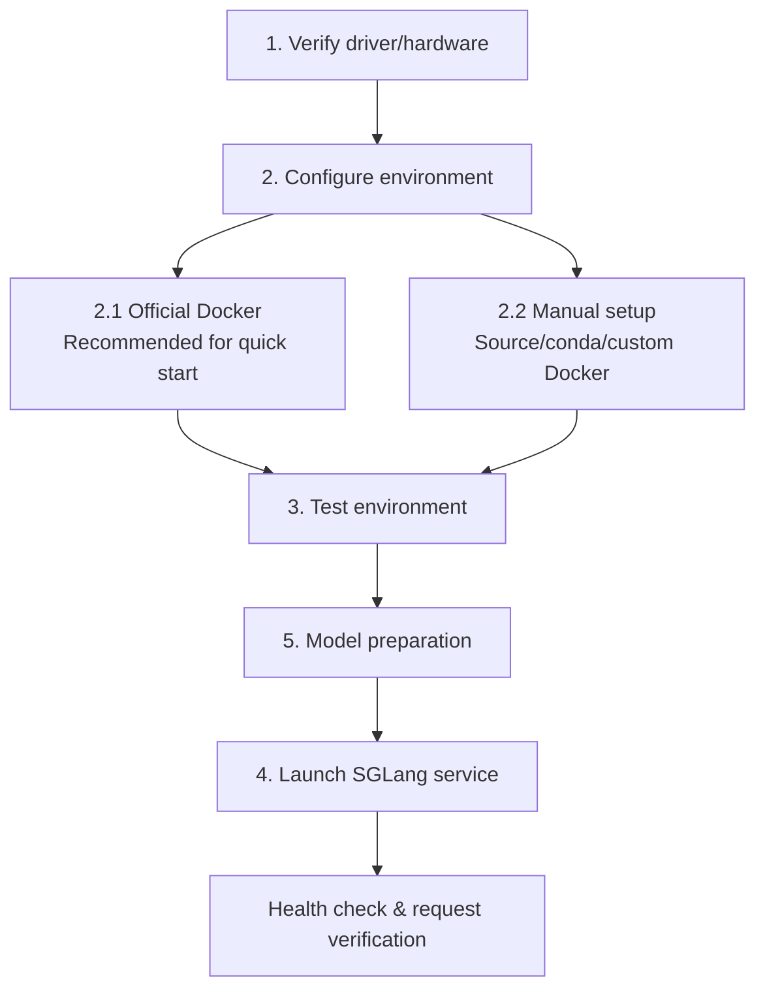

[中文](./03-launch-and-minimal-serving.md) | [English](./03-launch-and-minimal-serving_EN.md)

# 03. Isolated Environment Setup & Minimal Serving

This lecture solves one thing: running SGLang service on a GNU/Linux + Ascend NPU server with minimal impact on the host environment.

The recommended path is the **official Docker image**. Official Ascend NPU images already bundle SGLang, CANN runtime dependencies, PyTorch/torch_npu, NPU kernels, etc. — no manual CANN env setup, Python environment creation, or SGLang reinstallation needed.

Use the "manual setup" path only when you need to read/modify source code, verify a specific branch, or don't use the official image.

## Overall Flow



## 1. Verify Driver/Hardware

```bash
uname -a
cat /etc/os-release
npu-smi info
npu-smi info -t topo
```

Verify Ascend driver and CANN locations:

```bash
ls /usr/local/Ascend/driver
ls /usr/local/Ascend/ascend-toolkit/latest
cat /etc/ascend_install.info || true
```

If `npu-smi info` fails, do NOT proceed with SGLang installation. This is typically a driver, firmware, device permission, or container device mapping issue.

## 2. Official Docker (Recommended)

### 2.1 Pull Official Image

Common Ascend tags:

```text
main-cann8.5.0-a3       # Atlas 800I A3
main-cann8.5.0-910b     # Atlas 800I A2 / 910B
v0.5.6-cann8.5.0-a3
v0.5.6-cann8.5.0-910b
```

```bash
docker pull docker.io/lmsysorg/sglang:main-cann8.5.0-910b
```

Prepare workspace directories:

```bash
mkdir -p \
  /home/{myspace}/sglang-npu-workspace/models \
  /home/{myspace}/sglang-npu-workspace/cache \
  /home/{myspace}/sglang-npu-workspace/logs
```

### 2.2 Enter Debug Container (8-card A2/910B example)

```bash
docker run -it --rm \
  --name sglang-npu-dev-{myspace} \
  --privileged --network=host --ipc=host --shm-size=16g \
  --device=/dev/davinci0 --device=/dev/davinci1 \
  --device=/dev/davinci2 --device=/dev/davinci3 \
  --device=/dev/davinci4 --device=/dev/davinci5 \
  --device=/dev/davinci6 --device=/dev/davinci7 \
  --device=/dev/davinci_manager --device=/dev/hisi_hdc \
  -v /usr/local/sbin:/usr/local/sbin:ro \
  -v /usr/local/Ascend/driver:/usr/local/Ascend/driver:ro \
  -v /usr/local/Ascend/firmware:/usr/local/Ascend/firmware:ro \
  -v /etc/ascend_install.info:/etc/ascend_install.info:ro \
  -v /var/queue_schedule:/var/queue_schedule \
  -v /home/{myspace}/sglang-npu-workspace:/workspace/sglang-npu \
  docker.io/lmsysorg/sglang:main-cann8.5.0-910b bash
```

## 3. Manual Environment Setup

Only needed when:
- You need to clone SGLang source and modify code
- You need to verify a branch/tag/commit not in the official image

Key steps:
1. Install matching CANN toolkit version
2. Install `torch_npu` (version must match CANN)
3. Clone SGLang source
4. Install NPU extras: `pip install -e "python/[srt_npu]"`
5. Install `sgl_kernel_npu`

## 4. Launch Minimal Service

Single-card test:

```bash
python -m sglang.launch_server \
  --model Qwen/Qwen2.5-7B-Instruct \
  --host 0.0.0.0 --port 8000 \
  --device npu
```

Multi-card TP:

```bash
python -m sglang.launch_server \
  --model Qwen/Qwen2.5-72B-Instruct \
  --host 0.0.0.0 --port 8000 \
  --device npu --tp-size 8
```

## 5. Health Check & Verification

```bash
curl http://localhost:8000/health
curl http://localhost:8000/v1/models

curl http://localhost:8000/v1/chat/completions \
  -H "Content-Type: application/json" \
  -d '{"model":"default","messages":[{"role":"user","content":"Hello!"}]}'
```
