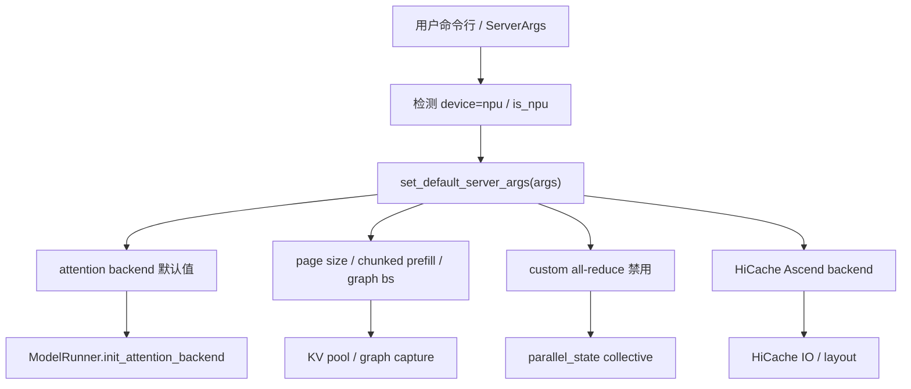
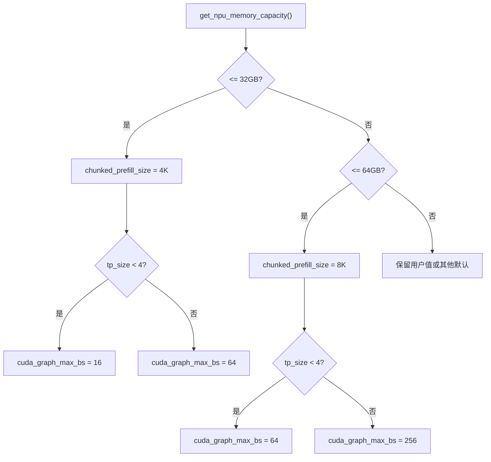

# 04. NPU 后端参数与默认值

这一讲拆解 SGLang 在 Ascend NPU 上为什么要改默认参数，以及这些参数会影响哪些源码分支。核心文件是：

```text
python/sglang/srt/hardware_backend/npu/utils.py
```

重点函数：

```text
set_default_server_args(args)
init_npu_backend()
npu_format_cast(...)
init_zbal(...)
lazy_init_zbal_gva_mem(...)
```

## 参数生效链路



## `set_default_server_args` 做了什么

| 行为 | 默认值 | 影响 |
|---|---|---|
| `attention_backend` | `ascend` | 主 attention 后端切换到 NPU 实现。 |
| `prefill_attention_backend` | `ascend` | prefill/extend 走 Ascend kernel。 |
| `decode_attention_backend` | `ascend` | decode 走 Ascend kernel。 |
| `page_size` | `128` | NPU KV cache page 粒度。 |
| `chunked_prefill_size` | 32GB 卡约 4K，64GB 卡约 8K | 限制长 prompt 一次 prefill 峰值。 |
| `cuda_graph_max_bs` | 按显存和 TP size 设置 | 控制 NPU graph capture batch size。 |
| `disable_custom_all_reduce` | `True` | 禁用 CUDA custom all-reduce。 |
| `hicache_io_backend` | `kernel_ascend` | HiCache 使用 Ascend kernel IO。 |
| `hicache_mem_layout` | 按 MLA/MHA 选择 | KV 分层缓存布局匹配 NPU attention。 |

## 显存容量分支



理解这段逻辑时要抓两个变量：

- `chunked_prefill_size` 控制 prefill 峰值。
- `cuda_graph_max_bs` 控制 graph capture 覆盖的 decode batch size。

## attention backend 参数

NPU 上建议显式写：

```bash
--device npu \
--attention-backend ascend
```

如果要分开指定：

```bash
--attention-backend ascend \
--prefill-attention-backend ascend \
--decode-attention-backend ascend
```

对源码的影响：


## page size

NPU 默认 `page_size=128`，会影响：

- `NPUMHATokenToKVPool`
- `NPUMLATokenToKVPool`
- `NPUPagedTokenToKVPoolAllocator`
- attention backend 的 block/page metadata
- PD 分离时 KV block 索引与传输粒度

不建议初学阶段随意改 `page_size`。只有在明确模型、kernel 和 KV layout 要求时再调整。

## graph 参数

常见相关参数：

| 参数 | 作用 |
|---|---|
| `--disable-cuda-graph` | 关闭 graph capture。NPU 下也适用。 |
| `--cuda-graph-max-bs` | 控制最大 capture batch size。 |
| `--cuda-graph-bs` | 指定 capture 的 batch size 集合。 |
| `--disable-piecewise-cuda-graph` | 关闭 piecewise graph。 |
| `--piecewise-cuda-graph-tokens` | 控制 piecewise graph capture token 数。 |

这些名字里有 `cuda`，但 NPU 下会映射到 `NPUGraphRunner` 或 `NPUPiecewiseBackend`。

## HiCache 参数

如果打开 hierarchical cache：

```bash
--enable-hierarchical-cache
```

NPU 默认会设置：

```text
hicache_io_backend = kernel_ascend
hicache_mem_layout = page_first_kv_split    # MLA
hicache_mem_layout = page_first_direct      # MHA
```

直觉：

- HiCache 把部分 KV cache 扩展到 host/storage。
- NPU attention 需要匹配它能高效读写的 layout。
- MLA 和 MHA 的 KV 结构不同，所以 layout 也不同。

## ZBAL 参数

ZBAL 是 NPU 场景里的特殊内存/通信相关路径。相关环境变量：

```bash
export SGLANG_ZBAL_LOCAL_MEM_SIZE=<MB>
export SGLANG_ZBAL_BOOTSTRAP_URL=<ip:port>
```

源码路径：

- `init_zbal(...)`
- `lazy_init_zbal_gva_mem(...)`
- `parallel_state.get_default_distributed_backend("npu")`

初学建议：普通单卡和普通 TP 先不要打开 ZBAL。等基础链路稳定后，再按硬件和团队部署规范启用。

## tensor format 参数

NPU 里有 ACL format：

- `ACL_FORMAT_ND`
- `ACL_FORMAT_FRACTAL_NZ`

相关函数：

```text
npu_format_cast(tensor, acl_format=NPUACLFormat.ACL_FORMAT_FRACTAL_NZ)
```

注意：

- 转 NZ 需要 shape 对齐。
- BF16/FP16 通常要求最后两维都能被 16 整除。
- 不满足条件时会跳过转换，正确性优先，性能可能下降。

## 推荐启动模板

单卡：

```bash
python -m sglang.launch_server \
  --model-path /data/models/Qwen2.5-7B-Instruct \
  --device npu \
  --attention-backend ascend \
  --tp-size 1 \
  --base-gpu-id 0 \
  --host 0.0.0.0 \
  --port 8000
```

定位问题：

```bash
python -m sglang.launch_server \
  --model-path /data/models/Qwen2.5-7B-Instruct \
  --device npu \
  --attention-backend ascend \
  --tp-size 1 \
  --disable-cuda-graph
```

多卡：

```bash
python -m sglang.launch_server \
  --model-path /data/models/Qwen2.5-32B-Instruct \
  --device npu \
  --attention-backend ascend \
  --tp-size 4 \
  --base-gpu-id 0 \
  --host 0.0.0.0 \
  --port 8000
```

## 阅读任务

1. 打开 `hardware_backend/npu/utils.py`，逐项标注 `set_default_server_args()` 修改了哪些字段。
2. 打开 `model_runner.py`，找到 NPU 下 `init_attention_backend()` 和 `init_device_graphs()` 的调用顺序。
3. 打开 `model_runner_kv_cache_mixin.py`，找到 `attention_backend == "ascend"` 时选择 NPU KV pool 的分支。
