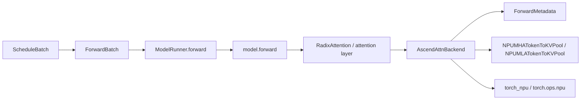
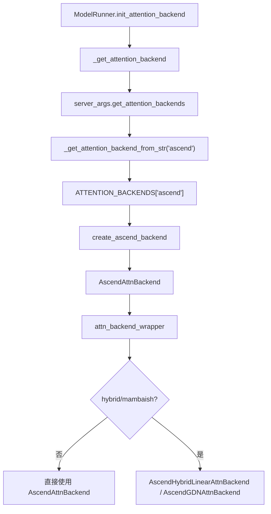
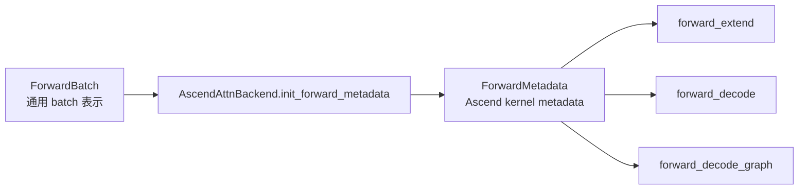
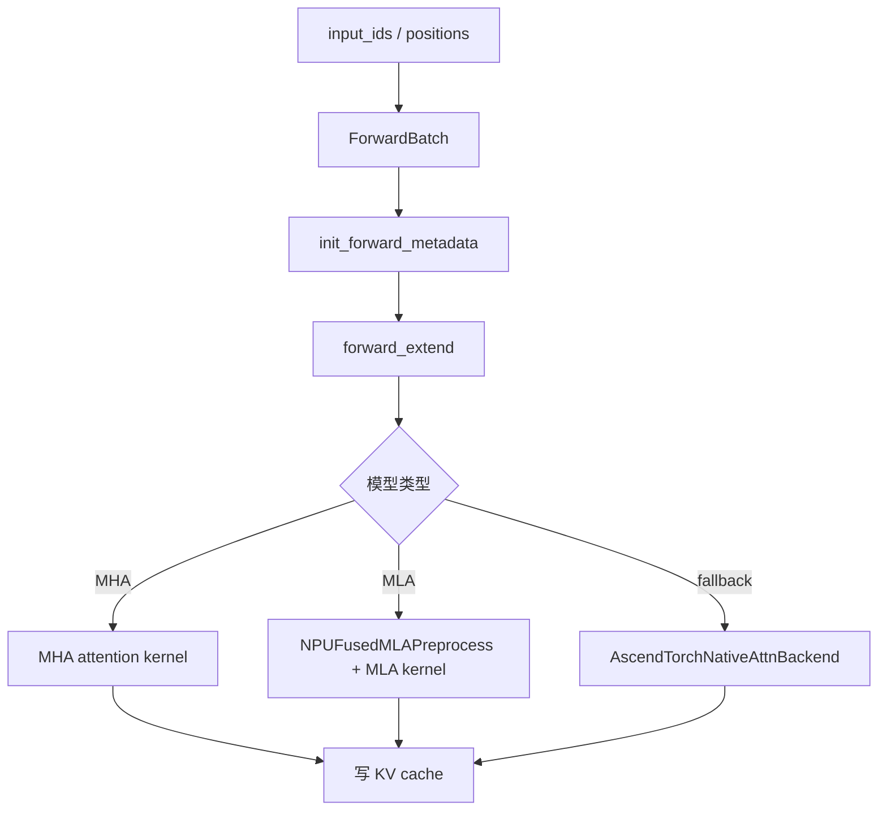
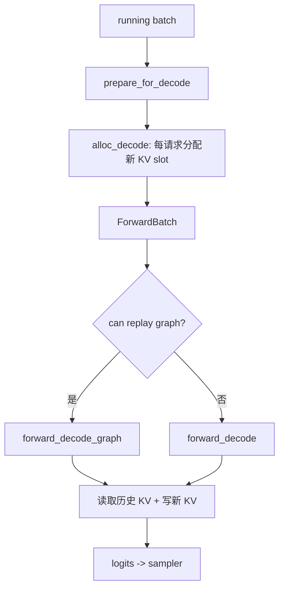
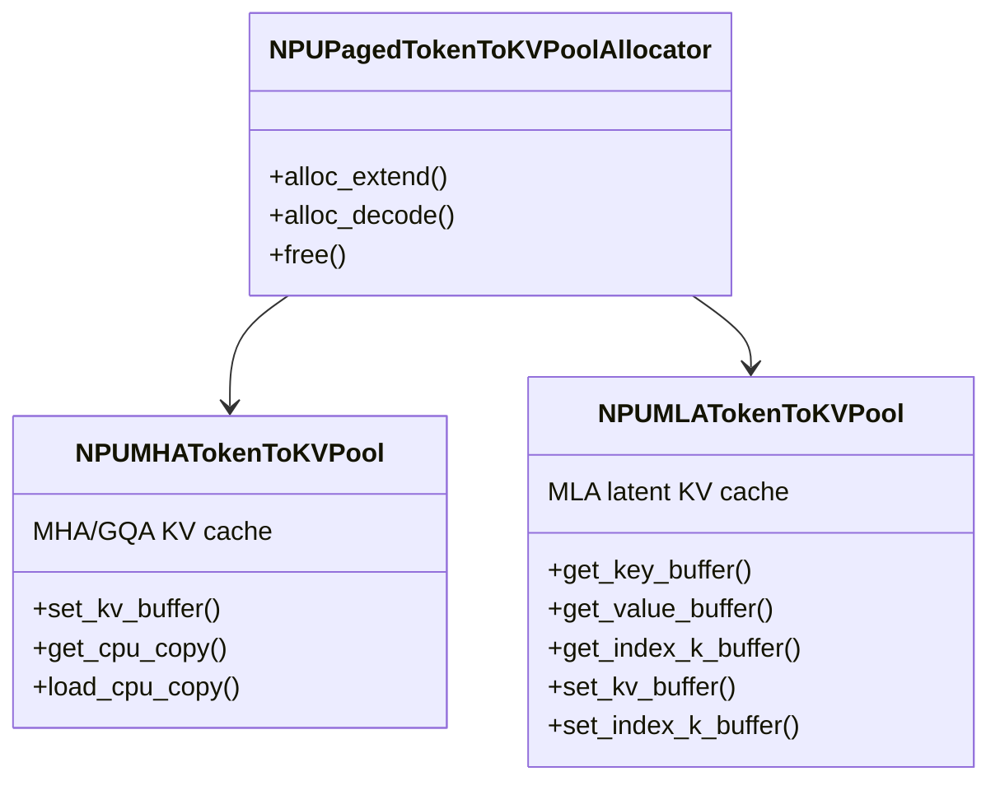
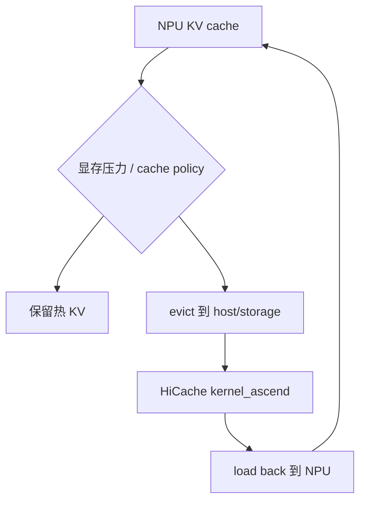

# 05. Ascend Attention、KV Cache 与 HiCache

这一讲拆 SGLang-NPU 最核心的性能路径：attention backend 如何读写 KV cache，以及 NPU 专用 KV pool 为什么要和 `attention_backend=ascend` 配套使用。

## 主链路



## 关键源码

| 主题 | 文件 |
|---|---|
| attention 注册 | `python/sglang/srt/layers/attention/attention_registry.py` |
| Ascend attention 主实现 | `python/sglang/srt/hardware_backend/npu/attention/ascend_backend.py` |
| MLA 预处理 | `python/sglang/srt/hardware_backend/npu/attention/mla_preprocess.py` |
| NPU KV pool | `python/sglang/srt/hardware_backend/npu/memory_pool_npu.py` |
| NPU allocator | `python/sglang/srt/hardware_backend/npu/allocator_npu.py` |
| KV pool 选择 | `python/sglang/srt/model_executor/model_runner_kv_cache_mixin.py` |

## Attention backend 初始化



## `ForwardMetadata`

`ForwardBatch` 是 SGLang 通用的模型执行输入；`ForwardMetadata` 是 Ascend attention backend 的设备侧执行信息。

它承载的信息包括：

- `seq_lens`
- `extend_seq_lens`
- `positions`
- `slot_mapping`
- `block_tables`
- attention mask
- graph replay 所需的固定 shape metadata

理解方式：



## Prefill / Extend 路径

Prefill 处理 prompt token，写入 KV cache。



重点：

- 长 prompt 会受 `chunked_prefill_size` 影响。
- MHA 和 MLA 的 KV layout 不同。
- MLA 可能经过 `NPUFusedMLAPreprocess` 做 RMSNorm、RoPE、KV cache 写入融合。

## Decode 路径

Decode 每轮通常为每个活跃请求生成 1 个 token。



Decode 的性能非常依赖：

- KV cache 读取效率。
- graph replay 是否命中。
- batch size 是否在 capture 范围内。
- attention backend 是否走 Ascend kernel，而不是 fallback。

## NPU KV Pool 类型



选择逻辑：

| 模型类型 | KV pool |
|---|---|
| 普通 MHA/GQA | `NPUMHATokenToKVPool` |
| MLA | `NPUMLATokenToKVPool` |
| hybrid SWA | `SWAKVPool(token_to_kv_pool_class=NPUMHATokenToKVPool)` |

## Allocator

`NPUPagedTokenToKVPoolAllocator` 负责从 KV pool 中分配 slot。

| 方法 | 作用 |
|---|---|
| `alloc_extend` | prefill/extend 时为多个 token 分配 KV slot。 |
| `alloc_decode` | decode 时通常为每个请求分配 1 个新 token slot。 |
| `free` | 请求结束后释放 KV slot。 |

调度层看到的是 token 位置和 request index；attention kernel 需要的是可以访问 KV cache 的具体 slot metadata。allocator 就是中间桥梁。

## HiCache

HiCache 是分层 KV cache，可以把部分 KV 从 NPU device memory 扩展到 host 或 storage。

NPU 默认配置：

```text
hicache_io_backend = kernel_ascend
hicache_mem_layout = page_first_kv_split   # MLA
hicache_mem_layout = page_first_direct     # MHA
```



初学建议：

- 先不要打开 HiCache。
- 先确认普通 KV cache 和 attention 路径稳定。
- 再用长上下文和 prefix cache 场景测试 HiCache。

## 常见错误直觉

| 现象 | 可能方向 |
|---|---|
| 服务能启动，first token 很慢 | graph 未命中、prefill 过大、attention fallback。 |
| 长 prompt OOM | `chunked_prefill_size`、KV pool size、`mem_fraction_static`。 |
| decode 抖动大 | graph capture size 不覆盖、batch shape 变化大。 |
| MLA 模型异常 | MLA KV layout、`NPUFusedMLAPreprocess`、模型配置。 |
| HiCache 打开后变慢 | IO backend、host 内存、load back 频繁。 |

## 阅读任务

1. 在 `attention_registry.py` 中找到 `"ascend"` 注册点。
2. 在 `ascend_backend.py` 中找到 `init_forward_metadata()`、`forward_extend()`、`forward_decode()`。
3. 在 `model_runner_kv_cache_mixin.py` 中找到 NPU KV pool 选择分支。
4. 在 `memory_pool_npu.py` 中比较 `NPUMHATokenToKVPool` 和 `NPUMLATokenToKVPool`。
