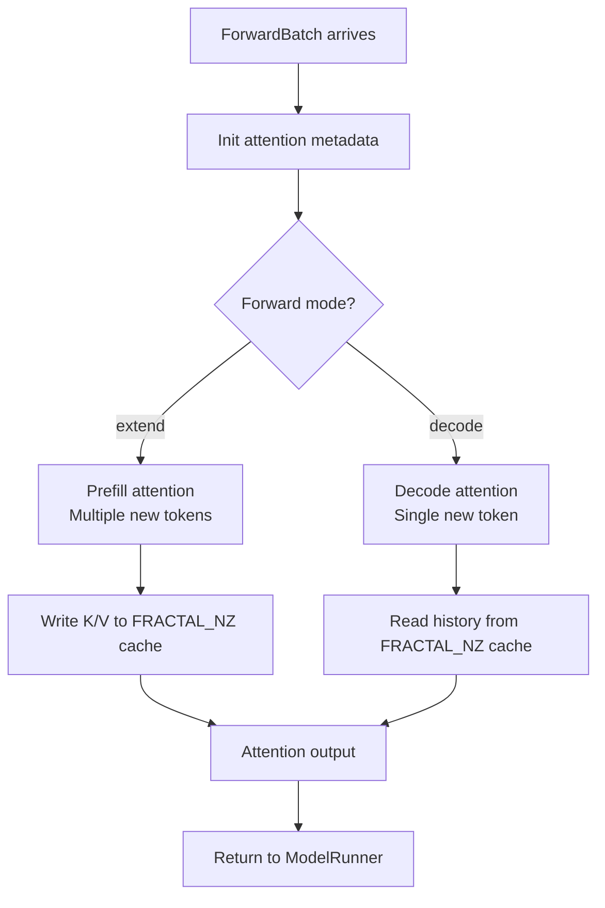

[中文](./05-attention-kv-cache.md) | [English](./05-attention-kv-cache_EN.md)

# 05. Ascend Attention & KV Cache

## 1. Attention Backend Registration

`attention_backend = "ascend"` is resolved in `attention_registry.py`:

```python
# The "ascend" backend maps to Ascend-specific attention implementation
ATTENTION_BACKENDS["ascend"] = AscendAttnBackend
```

## 2. Prefill vs Decode Backend

SGLang can use different backends for prefill and decode, combined as Hybrid:

```python
prefill_backend = _get_attention_backend("ascend", is_prefill=True)
decode_backend = _get_attention_backend("ascend", is_decode=True)
```

On NPU, both typically use `ascend` backend. The hybrid pattern allows future optimization where prefill and decode use different NPU kernel strategies.

## 3. KV Cache on Ascend NPU

### Layout

Ascend NPU uses `FRACTAL_NZ` format for optimal matrix operations. KV Cache pages are stored in this format:

```text
Standard layout: [num_tokens, num_heads, head_dim]
Ascend layout:   FRACTAL_NZ rearranged for Cube Unit efficiency
```

### Page Size

NPU default `page_size = 128` (vs GPU default `16`):
- Better alignment with NPU memory access granularity
- Larger pages reduce page table overhead
- Trade-off: more memory fragmentation for short requests

### Memory Pool

```text
req_to_token_pool: [max_requests, max_tokens_per_request]
token_to_kv_pool:  [max_total_tokens, ...] (stored in FRACTAL_NZ)
```

## 4. HiCache with Ascend

When HiCache is enabled on NPU:

```python
hicache_io_backend = "kernel_ascend"
# Uses Ascend-specific kernel for:
# - Write-through from GPU to CPU
# - Prefetch from CPU to GPU
# - Eviction management
```

KV layout changes when HiCache is active — must be compatible with both the Ascend attention kernel and the hierarchical cache transfer engine.

## 5. Attention Kernel Flow



## 6. Key Source Locations

| Component | File |
|---|---|
| Attention registry | `srt/layers/attention/attention_registry.py` |
| Ascend attention | `srt/layers/attention/ascend/` |
| KV Cache pool | `srt/mem_cache/` |
| HiCache Ascend | `srt/mem_cache/hicache/` |
