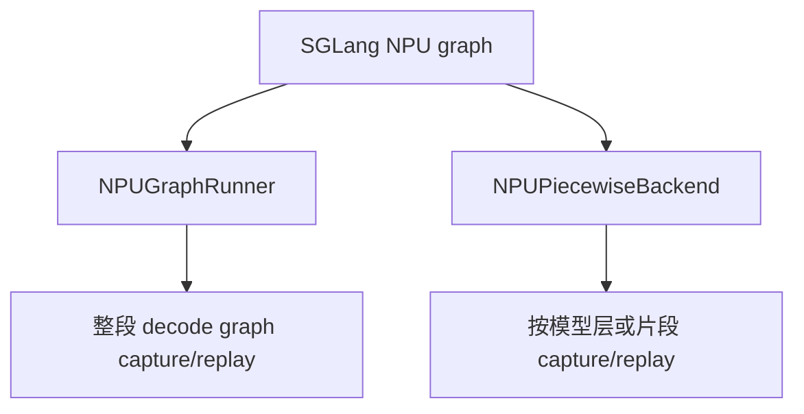
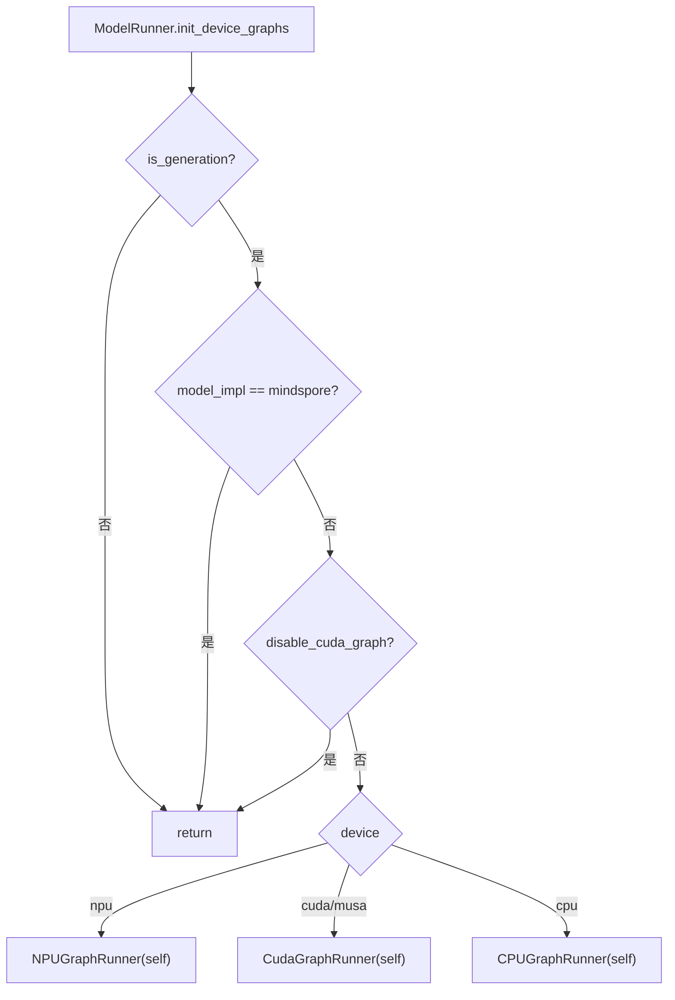
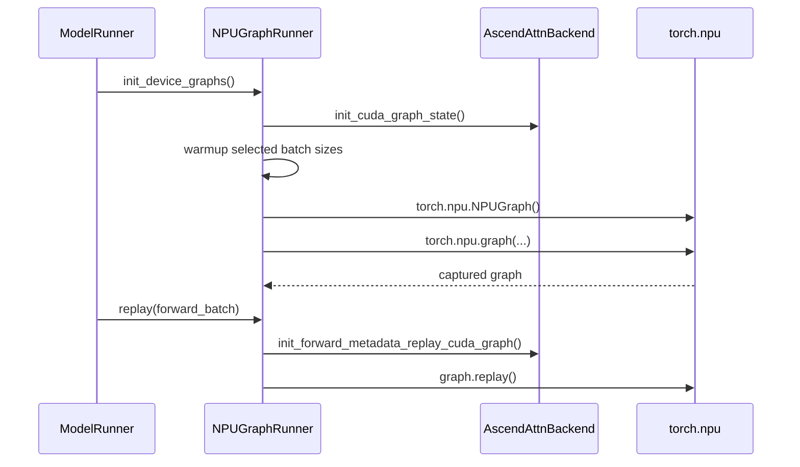
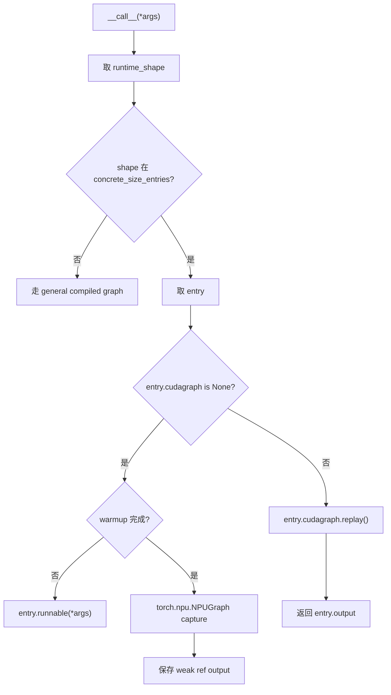

# 06. NPU Graph 与 Piecewise Compilation

这一讲解释 SGLang 在 Ascend NPU 上如何使用 graph capture/replay 降低 decode 开销。虽然很多参数和类名沿用 `cuda_graph`，但在 NPU 设备下实际走的是 `torch.npu.NPUGraph`。

## 为什么需要 graph

Decode 阶段每轮生成 token，计算形状通常较小但频率很高。如果每轮都完整经过 Python 调度和 kernel launch，延迟会被放大。

Graph 的目标：

- 固定 shape 先 capture。
- 后续相同 shape 直接 replay。
- 减少 Python 与 runtime 调度开销。
- 提升 decode 低延迟稳定性。

## 两条 graph 路径



关键源码：

| 路径 | 文件 |
|---|---|
| 常规 NPU graph runner | `python/sglang/srt/hardware_backend/npu/graph_runner/npu_graph_runner.py` |
| piecewise graph backend | `python/sglang/srt/compilation/npu_piecewise_backend.py` |
| 初始化入口 | `python/sglang/srt/model_executor/model_runner.py` / `init_device_graphs()`、`init_piecewise_cuda_graphs()` |

## `init_device_graphs()` 选择逻辑



## `NPUGraphRunner`

`NPUGraphRunner` 继承 `CudaGraphRunner`，保留通用 graph runner 框架，但替换设备相关操作：

| 方法 | NPU 行为 |
|---|---|
| `_create_device_graph()` | 返回 `torch.npu.NPUGraph()`。 |
| `_capture_graph()` | 使用 `torch.npu.graph(...)`。 |
| `_update_inputs()` | 更新 replay 前的静态输入 buffer。 |
| `_cache_loc_dtype()` | 使用 NPU 路径需要的 dtype。 |
| `replay()` | 对已 capture 的 batch size 执行 NPU graph replay。 |



## Piecewise graph

常规 graph 更像捕获一大段 decode；piecewise graph 把模型拆成多个片段捕获。

`NPUPiecewiseBackend` 继承 CUDA piecewise backend 的设计，但核心 graph 对象是：

```python
torch.npu.NPUGraph()
```

核心状态：

| 状态 | 含义 |
|---|---|
| `concrete_size_entries` | 哪些 runtime shape 需要专门 capture。 |
| `entry.runnable` | capture 前实际可执行函数。 |
| `entry.cudagraph` | 变量名沿用 CUDA，NPU 下实际保存 NPUGraph。 |
| `entry.output` | replay 后的输出引用。 |
| `entry.num_finished_warmup` | warmup 计数。 |

## Piecewise capture 流程



## 常见参数

| 参数 | 建议 |
|---|---|
| `--disable-cuda-graph` | 首次排错可打开，稳定后关闭。 |
| `--cuda-graph-max-bs` | 覆盖常见 decode batch size，过大占内存。 |
| `--cuda-graph-bs` | 精确指定 capture batch sizes。 |
| `--disable-piecewise-cuda-graph` | piecewise graph 有问题时可先关闭。 |
| `--piecewise-cuda-graph-tokens` | 控制 piecewise capture token 数。 |

## 排错方法

如果服务卡在 capture：

```bash
--disable-cuda-graph
```

如果常规 graph 正常，但 piecewise 有问题：

```bash
--disable-piecewise-cuda-graph
```

如果 replay 报输入地址不一致，说明 graph 依赖的静态 buffer 被重新分配或输入 shape 没有按预期进入 capture entry。

## 日志观察

关注：

```text
Capture npu graph begin
Capture npu graph end
mem usage=...
```

如果 graph capture 内存占用过高，可以降低 `cuda_graph_max_bs` 或减少 capture batch sizes。

## 阅读任务

1. 打开 `npu_graph_runner.py`，看 `_create_device_graph()` 和 `_capture_graph()`。
2. 打开 `npu_piecewise_backend.py`，看 warmup、capture、replay 三段逻辑。
3. 回到 `model_runner.py`，看 `init_device_graphs()` 在 NPU 下如何选择 `NPUGraphRunner`。
