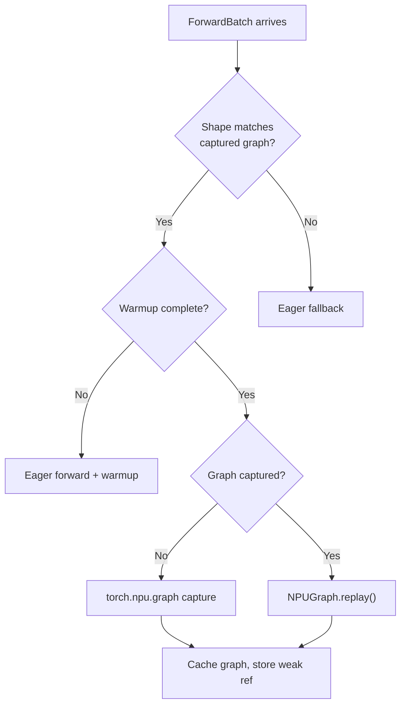

[中文](./06-npu-graph-compilation.md) | [English](./06-npu-graph-compilation_EN.md)

# 06. NPU Graph & Compilation

## 1. NPUGraph vs CUDAGraph

| Aspect | CUDAGraph | NPUGraph |
|---|---|---|
| API | `torch.cuda.CUDAGraph()` | `torch.npu.NPUGraph()` |
| Context manager | `torch.cuda.graph(g)` | `torch.npu.graph(g, pool=...)` |
| Memory pool | Implicit | Explicit pool required |
| Capture scope | Full model or piecewise | Full model or piecewise |
| Static shapes | Required | Required |
| Tensor format | Standard | May use FRACTAL_NZ internally |

## 2. Capture Flow

```python
# From npu_piecewise_backend.py
g = torch.npu.NPUGraph()
with torch.npu.graph(g, pool=memory_pool):
    output = model(static_input)  # All ops captured
# g is now ready for replay
```

## 3. Replay Decision



## 4. Piecewise Graph

Splitting the model into graph segments:

```text
Full model: [Embed → Layer0 → Layer1 → ... → LayerN → LM Head]
Piecewise:  [Graph_0: Embed+Layer0-3]
            [Graph_1: Layer4-7]
            [Graph_2: Layer8-11]
            ...
```

Benefits on NPU:
- Smaller graphs = faster capture, less memory
- Dynamic operations (e.g., MoE routing) between pieces
- Easier to debug capture failures
- Per-piece format casting optimization

## 5. Key Source

- `srt/compilation/npu_piecewise_backend.py` — NPU piecewise graph backend
- `srt/model_executor/cuda_graph_runner.py` — Graph runner (used for both CUDA and NPU)
- `srt/hardware_backend/npu/utils.py` — `NPUGraph` initialization

## 6. Common Issues

| Issue | Symptom | Solution |
|---|---|---|
| Shape mismatch | Graph replay skipped | Expand captured batch sizes |
| Memory pool exhaustion | Capture fails | Increase pool size or reduce graph scope |
| Dynamic control flow | Graph capture incomplete | Move dynamic ops between graph pieces |
| FRACTAL_NZ conversion | Extra overhead | Ensure format is stable across captures |
