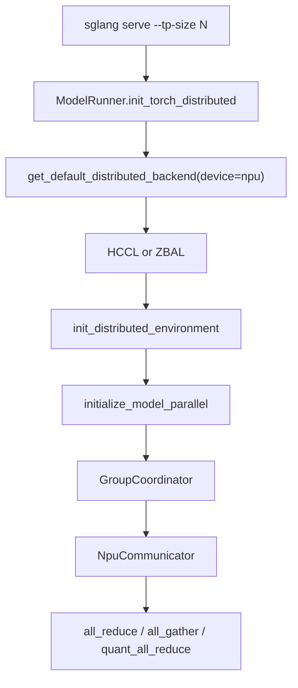
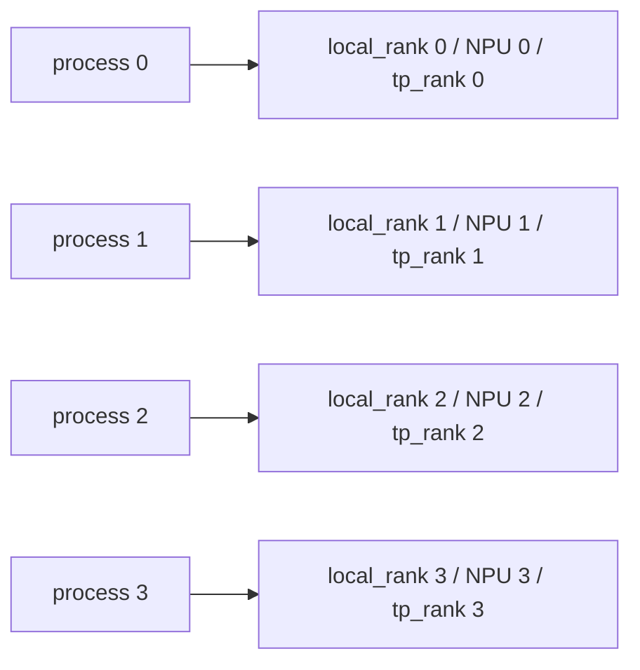
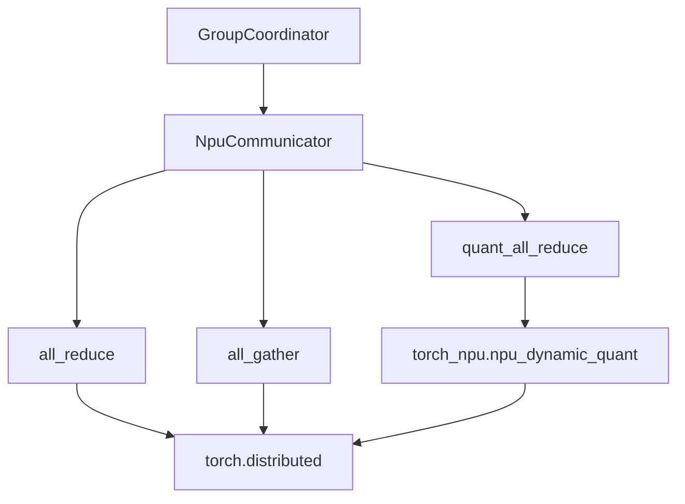

# 07. 分布式、HCCL 与 Tensor Parallel

这一讲讲 Ascend NPU 多卡推理。SGLang 的上层并行概念仍然是 TP、PP、DP、EP，但底层通信从 CUDA/NCCL 世界切到 Ascend/HCCL 世界。

## 多卡主链路



## 核心源码

| 主题 | 文件 |
|---|---|
| 分布式初始化 | `python/sglang/srt/model_executor/model_runner.py` / `init_torch_distributed()` |
| group 管理 | `python/sglang/srt/distributed/parallel_state.py` |
| NPU communicator | `python/sglang/srt/distributed/device_communicators/npu_communicator.py` |
| torch patch | `python/sglang/srt/utils/patch_torch.py` |

## HCCL 与 NCCL 的心智替换

| CUDA 生态 | Ascend NPU 生态 |
|---|---|
| NCCL | HCCL |
| `torch.cuda.set_device` | `torch.npu.set_device` |
| CUDA custom all-reduce | NPU 下通常禁用 |
| NCCL env | HCCL/CANN/env |
| GPU rank | NPU rank |

SGLang 里 `get_default_distributed_backend("npu")` 默认返回：

```text
hccl
```

如果打开 ZBAL local memory，则可能返回：

```text
zbal
```

## TP 启动示例

4 卡：

```bash
export SGLANG_SET_CPU_AFFINITY=1
export ASCEND_RT_VISIBLE_DEVICES=0,1,2,3

sglang serve \
  --model-path /data/models/Qwen2.5-32B-Instruct \
  --host 0.0.0.0 \
  --port 8000 \
  --device npu \
  --attention-backend ascend \
  --base-gpu-id 0 \
  --tp-size 4
```

8 卡：

```bash
export ASCEND_RT_VISIBLE_DEVICES=0,1,2,3,4,5,6,7

sglang serve \
  --model-path /data/models/large-model \
  --device npu \
  --attention-backend ascend \
  --base-gpu-id 0 \
  --tp-size 8 \
  --host 0.0.0.0 \
  --port 8000
```

## rank 与 device



错误绑定常见表现：

- 某张卡显存占用异常高。
- 某些 rank 初始化失败。
- HCCL 初始化卡住。
- first request 卡住。

## `NpuCommunicator`

`NpuCommunicator` 提供三个核心操作：

| 方法 | 作用 |
|---|---|
| `all_reduce(x)` | 直接用 `dist.all_reduce`。 |
| `quant_all_reduce(x)` | 先 `npu_dynamic_quant`，低精度 all-gather，再 full precision reduce。 |
| `all_gather(x, dim)` | `dist.all_gather_into_tensor` 后 reshape/movedim。 |



## 多卡排错

### 1. 单卡先通过

多卡失败前先确认：

```bash
--tp-size 1
```

已经能稳定返回。

### 2. 检查拓扑

```bash
npu-smi info -t topo
```

### 3. 检查 rank 日志

关注：

```text
Init torch distributed begin
Init torch distributed ends
backend=hccl
rank=
local_rank=
tp_rank=
```

### 4. 关闭 graph 缩小变量

```bash
--disable-cuda-graph
```

### 5. 检查环境变量

```bash
echo $ASCEND_RT_VISIBLE_DEVICES
echo $ASCEND_TOOLKIT_HOME
echo $HCCL_CONNECT_TIMEOUT
```

必要时设置更长 HCCL timeout，避免慢启动误判。

## TP 与显存

TP 可以把权重切到多卡，但 KV cache、activation、graph buffer 仍然会占用每卡显存。不要只按“模型参数 / TP size”估算显存。

影响显存的因素：

- 模型参数 dtype。
- KV cache dtype。
- `mem_fraction_static`。
- `cuda_graph_max_bs`。
- max running requests。
- 上下文长度。
- LoRA/MoE/多模态额外 buffer。

## 什么时候用 PP/DP/EP

| 并行方式 | 初学建议 |
|---|---|
| TP | 最先尝试，最常见。 |
| PP | 模型太大或多节点时再看。 |
| DP attention | 高并发和复杂部署再看。 |
| EP / MoE | MoE 模型专项。 |

## 阅读任务

1. 在 `parallel_state.py` 中找到 `get_default_distributed_backend()`。
2. 在 `model_runner.py` 中看 `init_torch_distributed()` 如何调用 `init_distributed_environment()`。
3. 在 `npu_communicator.py` 中读 `quant_all_reduce()`。
