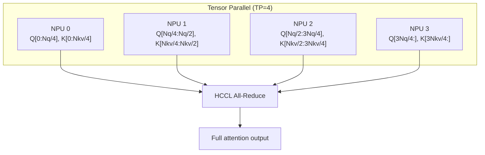

[中文](./07-distributed-hccl-tp.md) | [English](./07-distributed-hccl-tp_EN.md)

# 07. Distributed: HCCL & Tensor Parallelism

## 1. HCCL: NPU's Collective Communication

HCCL (Huawei Collective Communication Library) is Ascend NPU's equivalent of NCCL. It provides:

| Operation | HCCL API | Use in SGLang |
|---|---|---|
| All-reduce | `hccl_all_reduce` | TP attention/FFN output aggregation |
| All-gather | `hccl_all_gather` | TP input distribution, DP attention |
| Reduce-scatter | `hccl_reduce_scatter` | TP gradient aggregation (training) |
| All-to-all | `hccl_all_to_all` | MoE EP dispatch/combine |
| Broadcast | `hccl_broadcast` | Model weight sync across ranks |

## 2. TP on NPU



## 3. NPU Communicator

`NpuCommunicator` wraps HCCL for SGLang's distributed layer:

```python
# In parallel_state.py
if is_npu():
    backend = "hccl"  # vs "nccl" for CUDA
    group = torch.distributed.new_group(ranks, backend=backend)
```

## 4. Key NPU Communication Differences

| Aspect | CUDA/NCCL | Ascend/HCCL |
|---|---|---|
| Custom all-reduce | Supported (custom kernels) | Disabled (`disable_custom_all_reduce=True`) |
| Communication backend | `nccl` | `hccl` |
| Memory registration | CUDA IPC | ZBAL (Zero-Balance) |
| Interconnect | NVLink/NVSwitch | HCCS (intra-node), RoCE (inter-node) |

## 5. ZBAL (Zero-Balance)

ZBAL is Ascend's memory optimization:

```python
# In hardware_backend/npu/utils.py
init_zbal(...)           # Initialize ZBAL
lazy_init_zbal_gva_mem() # Lazy global virtual address setup
```

ZBAL affects:
- Communication buffer allocation
- Memory registration for HCCL
- Peer-to-peer access across NPUs

## 6. Verification Steps

1. Single NPU: verify basic serving works
2. `tp_size=2`: verify HCCL init, rank mapping, memory
3. Long prompts: verify chunked prefill across TP
4. Continuous batching: verify dynamic batch sizes
5. Streaming: verify streaming token delivery

```bash
# TP=2 example
python -m sglang.launch_server \
  --model Qwen/Qwen2.5-7B-Instruct \
  --device npu --tp-size 2
```
