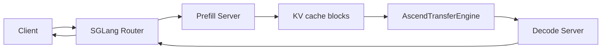
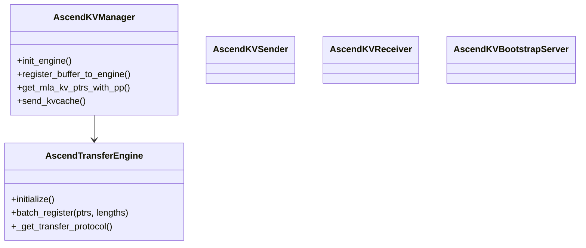
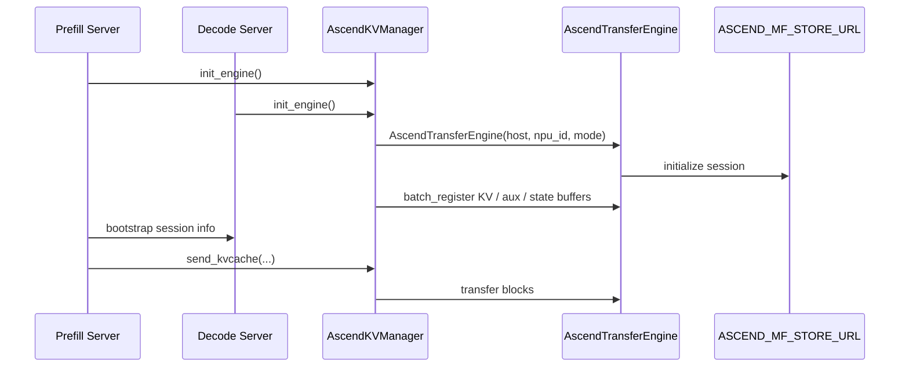
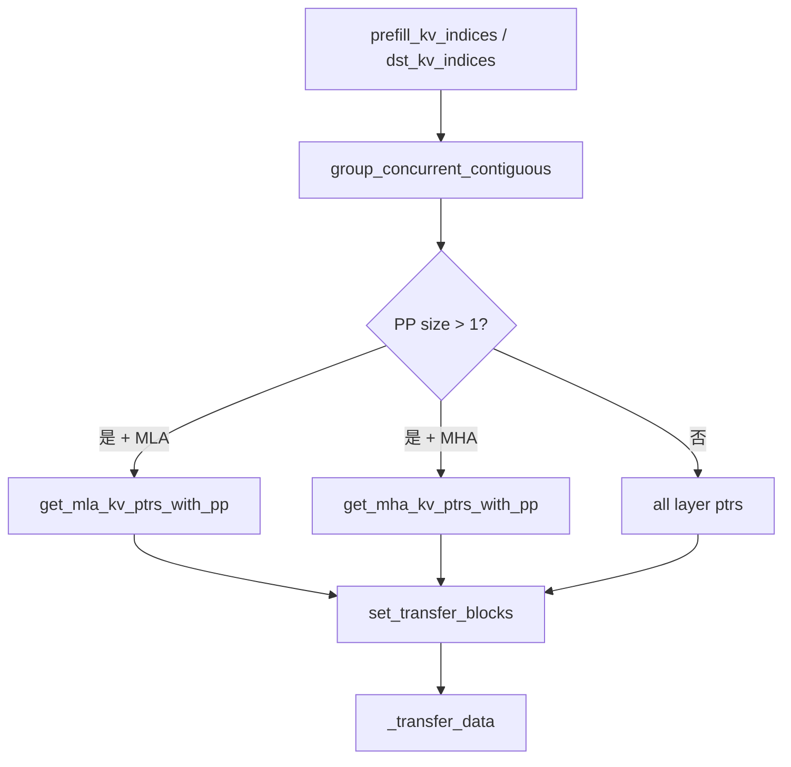

# 08. Ascend PD Disaggregation 与 KV Transfer

PD disaggregation 是把 Prefill 和 Decode 分离部署：Prefill worker 负责处理 prompt 并生成 KV cache，Decode worker 负责持续生成 token。Ascend NPU 下，SGLang 提供了 Ascend transfer backend 来传输 KV。

## 为什么要 PD 分离

Prefill 和 Decode 的资源特征不同：

| 阶段 | 特征 |
|---|---|
| Prefill | 大矩阵、大 attention、吞吐敏感、显存峰值高。 |
| Decode | 小步循环、延迟敏感、KV cache 访问频繁。 |

分离后可以：

- 用不同机器/卡组分别优化 prefill 和 decode。
- 降低 decode 被长 prompt 阻塞的概率。
- 针对业务负载独立扩容。

## 架构



## 核心源码

| 主题 | 文件 |
|---|---|
| Ascend transfer engine | `python/sglang/srt/disaggregation/ascend/transfer_engine.py` |
| Ascend KV manager | `python/sglang/srt/disaggregation/ascend/conn.py` |
| 通用 disaggregation | `python/sglang/srt/disaggregation/*` |
| 路由器 | `sglang_router.launch_router` |

## 类关系



## 初始化流程



## 环境变量

| 变量 | 含义 |
|---|---|
| `ASCEND_MF_STORE_URL` | transfer engine 的集中存储/协调地址。 |
| `ASCEND_MF_TRANSFER_PROTOCOL` | `sdma` 或 `device_rdma`。 |

协议选择：

- `sdma`：默认或未指定时使用，适合先跑通。
- `device_rdma`：需要 RDMA 能力，初始化时会提前 all-gather 初始化 HCCL。

## 单机双进程示例

Prefill：

```bash
export ASCEND_MF_STORE_URL="tcp://127.0.0.1:18000"
export ASCEND_RT_VISIBLE_DEVICES=0

sglang serve \
  --model-path /data/models/Qwen2.5-7B-Instruct \
  --device npu \
  --attention-backend ascend \
  --disaggregation-mode prefill \
  --disaggregation-transfer-backend ascend \
  --disaggregation-bootstrap-port 8995 \
  --base-gpu-id 0 \
  --tp-size 1 \
  --host 127.0.0.1 \
  --port 8000
```

Decode：

```bash
export ASCEND_MF_STORE_URL="tcp://127.0.0.1:18000"
export ASCEND_RT_VISIBLE_DEVICES=1

sglang serve \
  --model-path /data/models/Qwen2.5-7B-Instruct \
  --device npu \
  --attention-backend ascend \
  --disaggregation-mode decode \
  --disaggregation-transfer-backend ascend \
  --base-gpu-id 1 \
  --tp-size 1 \
  --host 127.0.0.1 \
  --port 8001
```

Router：

```bash
python -m sglang_router.launch_router \
  --pd-disaggregation \
  --policy cache_aware \
  --prefill http://127.0.0.1:8000 8995 \
  --decode http://127.0.0.1:8001 \
  --host 127.0.0.1 \
  --port 6688
```

请求：

```bash
curl http://127.0.0.1:6688/v1/chat/completions \
  -H "Content-Type: application/json" \
  -d '{
    "model": "default",
    "messages": [{"role": "user", "content": "hello"}],
    "max_tokens": 32
  }'
```

## KV transfer 的核心逻辑

`AscendKVManager.send_kvcache()` 做几件事：

1. 根据 prefill/decode KV index 合并连续 block。
2. 根据 PP/MLA/MHA 选择源和目标 KV 指针。
3. 计算 `(src_addr, dst_addr, length)` transfer blocks。
4. 调用底层 `_transfer_data(...)`。



## 常见问题

| 现象 | 排查方向 |
|---|---|
| `memfabric_hybrid` import 失败 | 安装 `memfabric-hybrid`，确认版本。 |
| 初始化 transfer engine 失败 | `ASCEND_MF_STORE_URL`、端口、协议、权限。 |
| `device_rdma` 卡住 | RDMA 网络、HCCL 初始化、网卡可见性。 |
| prefill 成功但 decode 无输出 | bootstrap、router 配置、KV transfer block。 |
| MLA + PP 异常 | `get_mla_kv_ptrs_with_pp` 指针切片逻辑。 |

## 学习建议

1. 单卡普通 serving 跑通。
2. 多卡 TP 跑通。
3. 单机 prefill/decode 分离跑通。
4. 再看跨机、RDMA、router 策略。

不要第一步就跨机 RDMA，这会把网络、HCCL、transfer engine 和 SGLang 调度问题混在一起。
