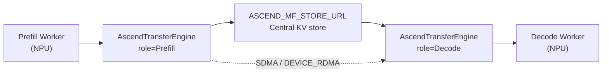
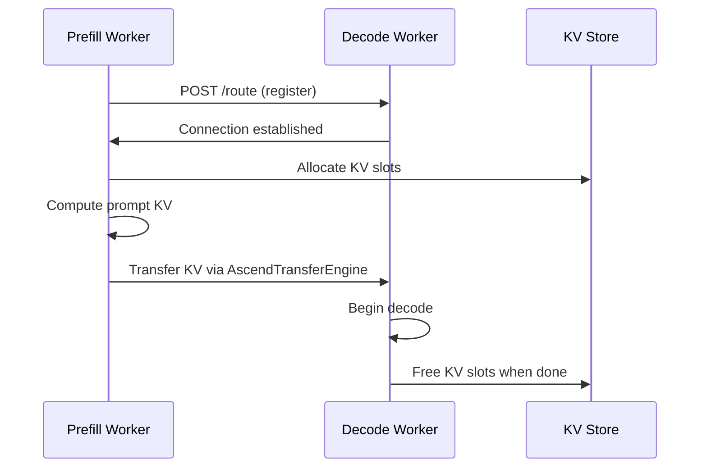

[中文](./08-ascend-pd-disaggregation.md) | [English](./08-ascend-pd-disaggregation_EN.md)

# 08. Ascend PD Disaggregation

## 1. Architecture



## 2. AscendTransferEngine

Core source: `srt/disaggregation/ascend/transfer_engine.py`

```python
class AscendTransferEngine:
    def __init__(self, role, store_url, transfer_protocol):
        # role: "prefill" or "decode"
        # store_url: ASCEND_MF_STORE_URL
        # transfer_protocol: "sdma" or "device_rdma"
```

Key environment variables:

| Variable | Purpose |
|---|---|
| `ASCEND_MF_STORE_URL` | Central store address for KV transfer coordination |
| `ASCEND_MF_TRANSFER_PROTOCOL` | `device_rdma` (RDMA) or `sdma` (System DMA) |

## 3. Transfer Protocols

| Protocol | Best For | Requirements |
|---|---|---|
| `device_rdma` | High-speed inter-node transfer | RDMA-capable network, `memfabric_hybrid` |
| `sdma` | Intra-node transfer | HCCS interconnect |

For `device_rdma`:
- HCCL is initialized via all-gather before RDMA to avoid initialization conflicts
- `memfabric_hybrid` package must be installed
- Higher throughput but stricter environment requirements

## 4. Bootstrap Flow



## 5. Key Source

- `srt/disaggregation/ascend/transfer_engine.py` — Transfer engine
- `srt/disaggregation/ascend/conn.py` — Connection management
- `srt/managers/scheduler.py` — `disaggregation_mode` branching
