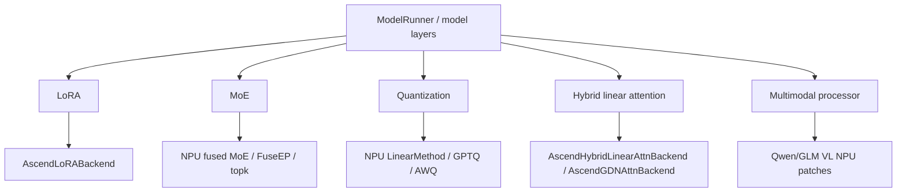
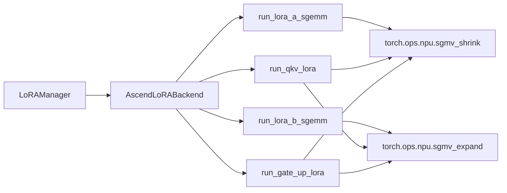
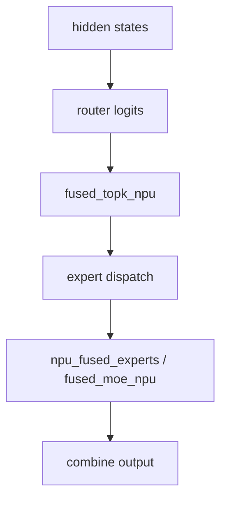
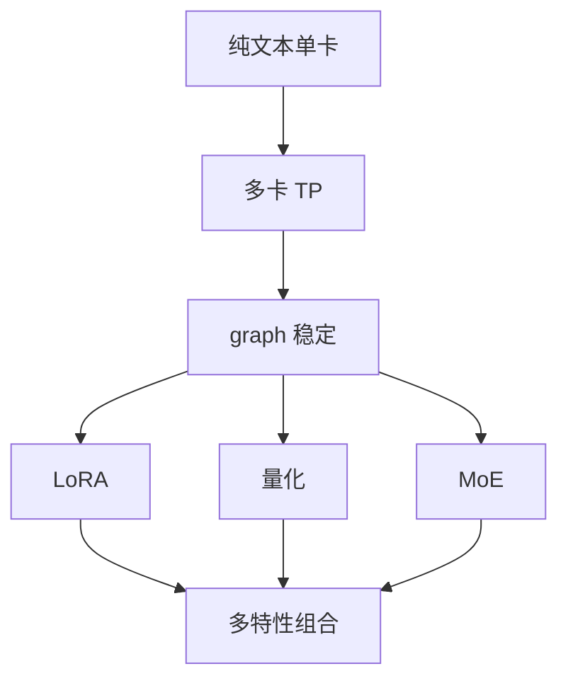

# 09. Ascend LoRA、MoE、量化与特性分支

这一讲看 NPU 上的高级特性后端。它们不是跑通 SGLang 的第一步，但在真实业务中经常遇到：LoRA adapter serving、MoE 模型、GPTQ/AWQ/INT8/INT4 量化、多模态处理、Mamba/GDN/hybrid linear attention。

## 总览图



## LoRA

核心文件：

```text
python/sglang/srt/lora/backend/ascend_backend.py
```

核心类：

```text
AscendLoRABackend
```

调用关系：



LoRA 后端的关键数据：

| 字段 | 作用 |
|---|---|
| `weight_indices` | 每个 segment 使用哪个 adapter。 |
| `seg_lens` | 每个 adapter segment 覆盖多少 token。 |
| `scalings` | LoRA scaling，按 token 展开。 |
| `lora_ranks` | adapter rank 信息。 |

启动示例：

```bash
sglang serve \
  --model-path /data/models/base-model \
  --device npu \
  --attention-backend ascend \
  --enable-lora \
  --max-loras-per-batch 4
```

## MoE

NPU MoE 相关文件：

```text
python/sglang/srt/hardware_backend/npu/moe/topk.py
python/sglang/srt/hardware_backend/npu/moe/fuseep.py
python/sglang/srt/hardware_backend/npu/quantization/fused_moe_method_npu.py
```

关键能力：

- `fused_topk_npu()`：NPU top-k routing。
- `forward_fuseep()`：FuseEP 路径。
- `fused_moe_npu()`：NPU fused MoE 执行。
- shared/routed expert 独立 stream 管理。



## 独立 stream

`hardware_backend/npu/utils.py` 里有：

- `process_shared_expert(...)`
- `process_routed_expert(...)`
- `get_share_stream()`
- `get_routed_stream()`
- `wait_share_stream()`
- `wait_routed_stream()`

这些用于把 shared expert 和 routed expert 放到独立 stream 上执行，减少串行等待。

## 量化 Linear

核心文件：

```text
python/sglang/srt/hardware_backend/npu/quantization/linear_method_npu.py
```

核心类：

| 类 | 场景 |
|---|---|
| `NPUW8A8Int8LinearMethod` | W8A8 INT8。 |
| `NPUW8A8Int8DynamicLinearMethod` | dynamic W8A8。 |
| `NPU_W4A4DynamicLinearMethod` | W4A4 dynamic。 |

通用两阶段：

1. `process_weights_after_loading(layer)`：加载后处理权重格式。
2. `apply(layer, x, bias)`：推理时调用 NPU kernel。

## GPTQ / AWQ

相关入口：

```text
python/sglang/srt/hardware_backend/npu/quantization/gptq_kernels.py
python/sglang/srt/hardware_backend/npu/quantization/awq_kernels.py
python/sglang/srt/layers/quantization/gptq/gptq.py
python/sglang/srt/layers/quantization/awq/schemes/
```

类名：

- `GPTQLinearAscendKernel`
- `GPTQMoEAscendKernel`
- `GPTQAscendConfig`
- `GPTQLinearAscendMethod`
- `GPTQMoEAscendMethod`
- `AWQAscendLinearKernel`
- `AWQAscendMoEKernel`

排错直觉：

- 量化格式是否被 NPU 后端支持。
- group size 是否满足 NPU kernel 要求。
- 权重是否完成 NPU format cast。
- MoE 权重是否需要额外 pack 或 permute。

## Hybrid Linear Attention / Mamba / GDN

相关文件：

```text
python/sglang/srt/hardware_backend/npu/attention/ascend_hybrid_linear_attn_backend.py
python/sglang/srt/hardware_backend/npu/attention/ascend_gdn_backend.py
```

相关类：

- `AscendMambaAttnBackendBase`
- `AscendMamba2AttnBackend`
- `AscendHybridLinearAttnBackend`
- `AscendGDNAttnBackend`

这些类通常通过 `attention_registry.attn_backend_wrapper()` 包装到 full attention backend 上。

## 多模态 patch

相关文件：

```text
python/sglang/srt/hardware_backend/npu/modules/qwen_vl_processor.py
python/sglang/srt/hardware_backend/npu/modules/glm46v_processor.py
python/sglang/srt/hardware_backend/npu/graph_runner/vit_npu_graph_runner.py
```

多模态模型除了文本 LLM，还涉及：

- image/video preprocessing。
- ViT encoder。
- multimodal token merge。
- `--mm-attention-backend ascend_attn`。

建议先跑纯文本模型，再跑多模态。

## 特性开启顺序



## 阅读任务

1. 打开 `ascend_backend.py`，读 `AscendLoRABackend` 的 `run_lora_a_sgemm()` 与 `run_lora_b_sgemm()`。
2. 打开 `fused_moe_method_npu.py`，找到 `fused_moe_npu()`。
3. 打开 `linear_method_npu.py`，看量化 linear 的 `process_weights_after_loading()` 和 `apply()`。
4. 打开 `attention_registry.py`，看 NPU hybrid attention wrapper 如何选择 Ascend 类。
