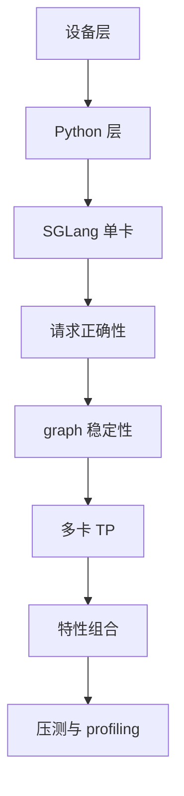
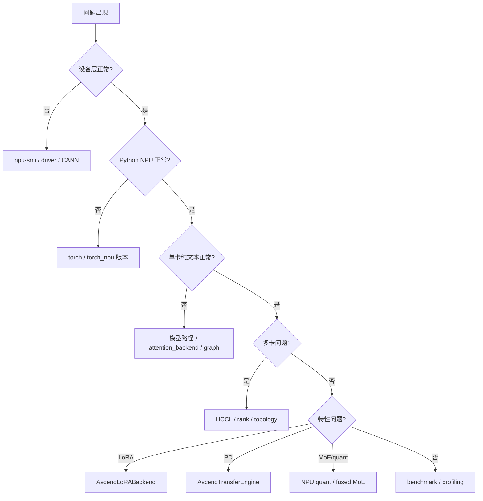

# 10. Benchmark、Profiling 与排错

这一讲给出 Ascend NPU 上 SGLang 的验证、压测和排错方法。核心原则：**先正确，再稳定，最后性能。**

## 验证层级



## 分层检查命令

设备层：

```bash
npu-smi info
npu-smi info -t topo
```

Python 层：

```bash
python - <<'PY'
import torch
import torch_npu
print(torch.__version__)
print(torch_npu.__version__)
print(torch.npu.is_available())
print(torch.npu.device_count())
PY
```

SGLang 包：

```bash
python -m sglang.check_env
python -c "import sglang, sgl_kernel_npu; print('ok')"
```

服务层：

```bash
curl http://127.0.0.1:8000/health
curl http://127.0.0.1:8000/v1/models
```

## 基础压测维度

| 维度 | 观察什么 |
|---|---|
| prompt 长度 | prefill 延迟、OOM、chunked prefill。 |
| output 长度 | decode tokens/s、稳定性。 |
| 并发数 | batching、P50/P99 latency。 |
| batch size | graph replay 覆盖范围。 |
| TP size | HCCL 通信开销和显存均衡。 |
| graph 开关 | graph capture/replay 对延迟影响。 |
| KV cache dtype/layout | 显存和 attention 性能。 |

## 推荐实验矩阵

```text
单卡:
  1 request, prompt 128, output 64
  1 request, prompt 4096, output 64
  8 concurrent, prompt 512, output 128

多卡:
  tp=2
  tp=4

graph:
  disable graph
  enable graph
  different cuda_graph_max_bs
```

## 日志关键字

```text
device=npu
attention_backend=ascend
Init torch distributed
backend=hccl
Capture npu graph begin
Capture npu graph end
mem usage
chunked_prefill_size
cuda_graph_max_bs
```

## 常见故障速查

| 现象 | 首查方向 |
|---|---|
| `torch.npu.is_available() == False` | driver、CANN、torch_npu、容器设备映射。 |
| `import sgl_kernel_npu` 失败 | NPU kernel wheel 未安装或版本不匹配。 |
| SGLang 启动但 attention backend 不是 ascend | 启动参数或 NPU 默认参数未生效。 |
| 卡在 graph capture | 先加 `--disable-cuda-graph`。 |
| first request 卡住 | HCCL、graph、模型 lazy init、kernel 编译。 |
| 长 prompt OOM | `chunked_prefill_size`、KV pool、`mem_fraction_static`。 |
| 多卡卡住 | HCCL、rank/device 绑定、拓扑、端口。 |
| PD transfer 失败 | `memfabric-hybrid`、`ASCEND_MF_STORE_URL`、协议。 |
| LoRA 输出异常 | adapter segment、rank、AscendLoRABackend kernel。 |

## 排错决策树



## Profiling

SGLang 在 NPU 下会使用 `torch_npu.profiler` 适配 PyTorch profiler。

相关文件：

```text
python/sglang/srt/utils/profile_utils.py
python/sglang/multimodal_gen/runtime/utils/profiler.py
```

你需要知道：

- NPU activity 对应 `torch_npu.profiler.ProfilerActivity.NPU`。
- trace handler 使用 `torch_npu.profiler.tensorboard_trace_handler`。
- NPU profiling 可能生成自己的 trace 文件。

## 性能调优顺序

1. 确认没有 fallback 到非 Ascend attention。
2. 确认 graph capture/replay 命中常见 decode batch size。
3. 调整 `cuda_graph_max_bs`，平衡延迟和显存。
4. 调整 `chunked_prefill_size`，平衡长 prompt 峰值和吞吐。
5. 多卡下看 HCCL 通信是否成为瓶颈。
6. 再考虑 HiCache、LoRA、MoE、量化等特性组合。

## 最小对比实验

关闭 graph：

```bash
python -m sglang.launch_server \
  --model-path /data/models/Qwen2.5-7B-Instruct \
  --device npu \
  --attention-backend ascend \
  --tp-size 1 \
  --disable-cuda-graph
```

打开 graph：

```bash
python -m sglang.launch_server \
  --model-path /data/models/Qwen2.5-7B-Instruct \
  --device npu \
  --attention-backend ascend \
  --tp-size 1 \
  --cuda-graph-max-bs 64
```

对比：

- 首 token latency。
- decode tokens/s。
- P50/P99 latency。
- NPU 显存占用。
- graph capture 时间。

## 交付前检查清单

- 单卡服务稳定。
- 多卡 TP 稳定。
- stream/non-stream API 都稳定。
- 长 prompt 不 OOM。
- graph 打开后无 replay 错误。
- 日志确认 `attention_backend=ascend`。
- 压测记录包括模型、TP、上下文长度、并发、输出长度、graph 参数。
- 如果启用 PD/LoRA/MoE/量化，分别做单独验收。

## 读源码定位技巧

| 问题 | 先看文件 |
|---|---|
| NPU 参数默认值 | `hardware_backend/npu/utils.py` |
| attention 性能 | `hardware_backend/npu/attention/ascend_backend.py` |
| KV cache OOM | `model_runner_kv_cache_mixin.py`、`memory_pool_npu.py` |
| graph capture | `graph_runner/npu_graph_runner.py`、`npu_piecewise_backend.py` |
| 多卡通信 | `parallel_state.py`、`npu_communicator.py` |
| PD transfer | `disaggregation/ascend/transfer_engine.py`、`conn.py` |
| LoRA | `lora/backend/ascend_backend.py` |
| MoE/quant | `hardware_backend/npu/quantization/*`、`hardware_backend/npu/moe/*` |
