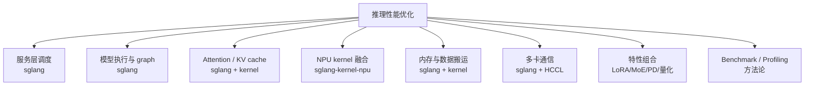
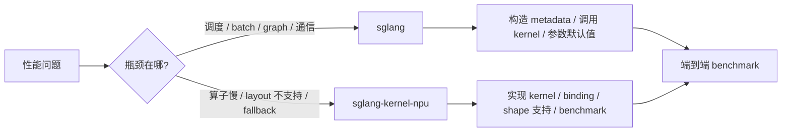

# 11. SGLang NPU 推理优化工作地图

这一讲面向刚开始参与 SGLang Ascend NPU 开发的同学。假设你的主要工作围绕两个仓库：

- `sglang`：服务框架、调度、batch、graph、分布式、模型执行、特性集成。
- `sglang-kernel-npu`：Ascend NPU kernel、算子封装、layout、融合、数据搬运和底层性能实现。

推理优化不是单点工作。一次性能提升可能来自调度策略，也可能来自 attention kernel、KV cache layout、graph capture、HCCL 通信、模型特性组合，甚至来自 benchmark 方法修正。初学者最容易踩的坑是“看到慢就去改 kernel”。正确做法是先把优化对象分类，再用指标判断瓶颈在哪一层。

## 总览图



## 先建立性能指标语言

在开始优化前，必须知道自己要改善哪个指标。

| 指标 | 主要影响阶段 | 常见瓶颈 |
|---|---|---|
| TTFT / first token latency | prefill、调度排队、graph warmup | 长 prompt、chunked prefill、首次 kernel 编译、KV 分配。 |
| TPOT / per-token latency | decode | attention decode kernel、graph replay、采样、通信。 |
| tokens/s | prefill + decode 总吞吐 | batch 策略、kernel 利用率、HCCL、KV cache。 |
| P50/P99 latency | 调度、排队、graph shape 命中 | 请求混部、batch 波动、fallback、同步点。 |
| NPU 利用率 | 全链路 | CPU 调度慢、kernel 太碎、内存搬运多、通信等待。 |
| HBM 显存占用 | KV cache、graph、权重、workspace | page size、dtype、graph capture batch、静态池。 |
| 稳定性 | 全链路 | graph shape 不匹配、OOM、HCCL 卡住、kernel 边界 case。 |

优化报告至少要包含：

- 模型、精度、TP size、设备型号、CANN/torch_npu/sgl_kernel_npu 版本。
- prompt 长度、output 长度、并发、请求分布。
- 是否启用 graph、chunked prefill、PD、LoRA、MoE、量化。
- baseline 与优化后指标。

## 方向一：服务层调度与 batching

**主要仓库：`sglang`**

这一层决定请求什么时候进入 batch、prefill/decode 如何交错、不同请求如何共享一次 forward。它不直接写 NPU kernel，但会决定 kernel 看到的 shape、batch size 和 token 分布。

### 你在优化什么

- 连续 batching 是否让 NPU 保持忙碌。
- 长 prompt prefill 是否阻塞短请求 decode。
- decode batch size 是否落在 graph capture 覆盖范围内。
- 请求队列是否产生过多 P99 抖动。
- scheduler 是否生成了适合 Ascend attention backend 的 metadata。

### 典型工作内容

| 工作 | 解释 | 常见改动位置 |
|---|---|---|
| 调整 prefill/decode 混排策略 | 避免大 prompt 独占执行窗口。 | scheduler、batch policy、server args。 |
| 改进 chunked prefill | 把长 prompt 拆成更可控的 prefill 块。 | `chunked_prefill_size`、scheduler metadata。 |
| 稳定 decode batch shape | 提高 graph replay 命中率。 | batch 构造、graph runner shape key。 |
| 减少无效 batch 或小 kernel | 减少 NPU 空转与 kernel launch overhead。 | scheduler merge/split 逻辑。 |
| 为 NPU 添加默认参数 | 让用户不手动配置也走合理路径。 | `hardware_backend/npu/utils.py`。 |

### 判断是否该改这一层

如果 profiling 里 NPU 利用率低，但 kernel 本身不慢，CPU 调度、batch 构造、等待时间明显，就先看服务层。典型表现是：

- 请求很多但 NPU 上 kernel 间隔大。
- P99 很差，P50 正常。
- decode batch size 波动大，graph replay 命中率低。
- 长 prompt 来了以后短请求延迟突然升高。

## 方向二：模型执行、NPU Graph 与编译

**主要仓库：`sglang`**

NPU graph 的目标是减少 decode 阶段的 Python 调度、框架 dispatch 和 kernel launch 开销。它通常对小 batch decode latency 很敏感。

### 你在优化什么

- graph capture 是否覆盖常见 batch size。
- replay 是否稳定命中。
- graph 输入输出地址是否稳定。
- piecewise graph 是否把模型切得合理。
- graph capture 的显存开销是否可接受。

### 典型工作内容

| 工作 | 解释 | 风险 |
|---|---|---|
| 调整 `cuda_graph_max_bs` 默认值 | 名字沿用 CUDA，但 NPU 下对应 `NPUGraph` 语义。 | 值太大占显存，太小覆盖不足。 |
| 扩展 capture batch size 集合 | 覆盖实际线上常见 batch。 | capture 时间和显存增加。 |
| 修复 graph replay shape mismatch | 某些输入 shape 或 metadata 没进入 key。 | 可能引入错误 replay。 |
| 拆分 piecewise graph | 让不稳定部分留在 eager，稳定部分 replay。 | 切分过细会降低收益。 |
| 减少 graph 外同步 | 避免 CPU/NPU sync 打断流水。 | 调试难度较高。 |

### 判断是否该改这一层

对比两组实验：

```bash
sglang serve ... --disable-cuda-graph
sglang serve ... --cuda-graph-max-bs 64
```

如果打开 graph 后 TPOT 明显下降，但偶发 shape miss 或显存暴涨，就说明 graph 层有优化空间。如果打开 graph 几乎无收益，可能是 kernel 或通信才是瓶颈。

## 方向三：Attention 与 KV Cache

**主要仓库：`sglang` + `sglang-kernel-npu`**

LLM 推理中最核心的 NPU 热路径通常是 attention 与 KV cache。prefill 关注大矩阵和长序列吞吐，decode 关注小步迭代、KV 读取和低延迟。

### 你在优化什么

- prefill attention kernel 吞吐。
- decode attention kernel 延迟。
- KV cache page size、layout、dtype 是否适合 Ascend kernel。
- attention metadata 构造是否高效。
- HiCache 或分层 KV 是否和 NPU layout 匹配。

### SGLang 主仓工作

| 工作 | 解释 |
|---|---|
| 选择 `attention_backend=ascend` | 确保请求进入 Ascend backend，而不是 CUDA/Triton fallback。 |
| 构造 attention metadata | 把 batch、seq len、page table、slot mapping 传给 kernel。 |
| 管理 KV cache allocator | 控制 page 分配、释放、复用、碎片。 |
| 配置 page size / dtype | 影响 kernel 访问粒度和显存占用。 |
| 接入 HiCache | 让 host/storage KV 读写匹配 Ascend layout。 |

### Kernel 仓工作

| 工作 | 解释 |
|---|---|
| 优化 paged attention kernel | 提高 KV 读取、softmax、value 聚合效率。 |
| 支持更多 head size / dtype | 减少 fallback，提高模型覆盖面。 |
| 减少 layout 转换 | 让 kernel 直接消费 SGLang 侧 KV layout。 |
| 融合小算子 | 降低 launch 数和中间 tensor 写回。 |
| 优化边界 case | 处理短序列、尾块、不规则 batch。 |

### 判断是否该改这一层

如果 profiling 显示 attention kernel 占主要时间，且 NPU 利用率高但 tokens/s 不达标，就看 kernel 和 KV layout。如果 NPU 利用率低，先不要急着改 attention kernel，可能是调度或 graph 没喂饱。

## 方向四：NPU Kernel 融合与算子开发

**主要仓库：`sglang-kernel-npu`**

这是最底层也最硬核的方向。目标是把模型推理中的高频算子做成适合 Ascend 的高性能实现，并通过 SGLang 主仓正确调用。

### 你在优化什么

- 单个 kernel 的计算效率。
- kernel launch 数量。
- 中间 tensor 的读写次数。
- NPU core 利用率和 memory bandwidth。
- 算子对不同 shape 的覆盖范围。

### 典型 kernel 工作

| 类型 | 例子 | 价值 |
|---|---|---|
| Attention kernel | prefill/decode paged attention | 直接决定 LLM 热路径性能。 |
| LoRA kernel | `sgmv_shrink`、`sgmv_expand` 类路径 | 降低多 adapter 场景开销。 |
| MoE kernel | expert routing、top-k、grouped GEMM 辅助 | 减少 routing 和 expert 调度开销。 |
| Quant kernel | dequant、quant matmul、scale 处理 | 支持低比特模型并降低带宽。 |
| Cache kernel | KV copy、cache locs、HiCache IO | 降低 KV 搬运和更新成本。 |
| Sampling kernel | logits processor、top-p/top-k 辅助 | 高并发下减少 CPU 采样瓶颈。 |

### Kernel PR 通常要交付什么

- 正确性测试：多 dtype、多 shape、边界 case。
- 性能测试：和旧实现/fallback 的对比。
- SGLang 接入：Python binding、backend 调用、feature flag。
- fallback 策略：不支持的 shape 要清晰回退。
- 文档：支持范围、限制、推荐参数。

## 方向五：内存、layout 与数据搬运

**主要仓库：`sglang` + `sglang-kernel-npu`**

很多 NPU 性能问题不是算得慢，而是数据搬得多、格式转得多、缓存布局不合适。

### 你在优化什么

- HBM 占用。
- KV cache 碎片。
- ND / FRACTAL_NZ 等格式转换开销。
- host 到 device、device 到 device 的搬运次数。
- graph capture 额外占用。
- 临时 tensor 生命周期。

### 典型工作内容

| 工作 | 所在层 | 说明 |
|---|---|---|
| 减少格式转换 | SGLang + kernel | 如果每步 decode 都 format cast，性能会很差。 |
| 优化 KV page 管理 | SGLang | 降低碎片和 OOM 风险。 |
| 减少临时 tensor | kernel | 尽量融合或复用 workspace。 |
| 控制 graph 显存 | SGLang | graph batch 覆盖越大，静态内存越高。 |
| 优化 cache copy | kernel | KV transfer、HiCache、prefix cache 都会受益。 |

### 判断是否该改这一层

典型信号：

- NPU 利用率不低，但 memory bandwidth 接近瓶颈。
- 显存占用远高于预期。
- 长 prompt 容易 OOM。
- profiling 里出现频繁 copy、format cast、slice/scatter。
- graph 打开后显存暴涨。

## 方向六：多卡 TP / HCCL 通信

**主要仓库：`sglang`，部分依赖底层通信库**

多卡性能不是单卡性能乘以卡数。TP 下每层可能有 all-reduce、all-gather、reduce-scatter，通信和计算重叠做不好，扩展效率会明显下降。

### 你在优化什么

- HCCL 初始化和 rank/device 绑定。
- collective 调用次数和数据量。
- 通信与计算是否重叠。
- TP size 对显存、batch、latency 的影响。
- 多机或 RDMA 场景下的拓扑问题。

### 典型工作内容

| 工作 | 解释 |
|---|---|
| 修正 NPU distributed backend | 确保走 `hccl` 而不是 CUDA/NCCL 分支。 |
| 优化 collective 位置 | 减少不必要同步。 |
| 调整 TP 默认策略 | 不同模型大小和卡数下选择合理 TP。 |
| 支持通信 overlap | 让通信等待被计算覆盖。 |
| 修复 rank/device 映射 | 避免多进程绑错卡。 |

### 判断是否该改这一层

如果单卡性能正常，TP=2/4 后扩展效率很差，或者多卡 first token 卡住，就看通信。先确认：

- HCCL 日志正常。
- rank 到 NPU 的映射正确。
- 每张卡显存负载接近。
- profiling 里通信等待是否占比高。

## 方向七：PD 分离、LoRA、MoE、量化等特性组合

**主要仓库：`sglang` + `sglang-kernel-npu`**

特性组合经常带来新的性能问题。比如 LoRA 单独看很快，叠加 high concurrency 后 adapter 切换成为瓶颈；PD 分离单独可用，但 KV transfer 成为瓶颈。

### PD Disaggregation

优化重点：

- Prefill 与 Decode 资源拆分比例。
- KV transfer latency。
- `sdma` 与 `device_rdma` 选择。
- KV block 粒度和 page table 映射。

工作边界：

- SGLang 主仓负责角色管理、连接、KV 元数据、调度。
- 底层库负责传输能力和硬件路径。

### LoRA

优化重点：

- adapter batching。
- segment 信息构造。
- rank 和 dtype 支持。
- `sgmv_shrink` / `sgmv_expand` kernel 性能。

工作边界：

- SGLang 主仓负责 adapter 管理、batch info、backend 接入。
- kernel 侧负责 NPU op 性能和 shape 覆盖。

### MoE

优化重点：

- routing 开销。
- expert dispatch / combine。
- grouped GEMM 或 fused expert kernel。
- shared expert 与 routed expert stream overlap。

初学建议：先把 dense 模型性能跑稳，再看 MoE。MoE 的瓶颈常常混合了 routing、通信、kernel 和 load balance。

### Quantization

优化重点：

- dequant 是否融合进 matmul。
- scale/zero-point 读取是否高效。
- 低比特权重 layout 是否适合 NPU。
- fallback 是否过多。

量化优化必须同时看正确性和性能。只看 tokens/s 不够，还要确认输出质量和数值误差。

## 方向八：Benchmark、Profiling 与性能归因

**主要仓库：`sglang`**

性能优化需要可复现的实验。没有稳定 benchmark，优化很容易变成“感觉快了”。

### 你要建立的实验矩阵

| 维度 | 建议覆盖 |
|---|---|
| prompt 长度 | 128、512、4096、长上下文。 |
| output 长度 | 32、128、512。 |
| 并发 | 1、4、16、64。 |
| TP size | 1、2、4、8。 |
| graph | 关闭、默认、不同 `cuda_graph_max_bs`。 |
| 模型类型 | dense、MoE、LoRA、量化。 |
| 模型来源 | 本地模型，避免下载影响测试。 |

### Profiling 看什么

- NPU trace 中最耗时的 kernel。
- kernel 之间是否有大空洞。
- CPU 是否在 batch 构造、采样、tokenization 上耗时。
- HCCL collective 是否阻塞。
- format cast / copy 是否频繁。
- graph capture/replay 是否命中。

### 性能归因顺序

1. 先做最小单卡 dense 模型。
2. 关闭 graph，得到 eager baseline。
3. 打开 graph，确认 graph 收益。
4. 固定模型与请求分布，调整一个变量。
5. 单卡稳定后再引入 TP。
6. TP 稳定后再叠加 PD、LoRA、MoE、量化。

## 两个仓库的协作边界



| 问题 | 优先仓库 |
|---|---|
| `attention_backend` 没切到 ascend | `sglang` |
| graph shape miss | `sglang` |
| batch 构造导致低利用率 | `sglang` |
| HCCL rank 映射错误 | `sglang` |
| attention kernel 单次耗时高 | `sglang-kernel-npu`，同时检查 SGLang metadata |
| 某个 head size fallback | `sglang-kernel-npu` |
| LoRA kernel 不支持某 rank | `sglang-kernel-npu` + `sglang` backend |
| KV layout 和 kernel 不匹配 | 两边都要改 |
| 性能数据无法复现 | `sglang` benchmark / docs |

## 初学者的推荐成长路线

1. **先会跑 benchmark**：固定模型、请求分布、参数，拿到稳定 baseline。
2. **再会读日志**：确认 device、attention backend、graph、HCCL、fallback。
3. **再会定位瓶颈层**：调度、graph、attention、通信、内存搬运分开判断。
4. **先做小 PR**：补日志、补 benchmark、修 fallback、扩 shape 测试。
5. **再做接入 PR**：把已有 kernel 接到 SGLang 后端。
6. **最后做 kernel PR**：实现新 kernel 或融合路径，并交付端到端数据。

## PR 设计模板

做任何推理优化前，可以先写这个模板：

```text
目标:
  优化哪个场景，指标是什么。

Baseline:
  模型、硬件、版本、启动参数、请求分布、当前指标。

瓶颈证据:
  profiling / log / benchmark 对比。

改动范围:
  sglang:
  sglang-kernel-npu:

正确性验证:
  单卡、TP、stream/non-stream、边界 shape。

性能验证:
  baseline vs after，至少三轮稳定结果。

风险:
  不支持 shape、fallback、显存增长、graph capture 变化。
```

## 本讲小结

SGLang NPU 推理优化可以粗略分成三层：

1. **SGLang runtime 层**：调度、batch、graph、通信、特性编排。
2. **Kernel 层**：attention、LoRA、MoE、quant、cache copy 等 NPU 算子。
3. **方法论层**：benchmark、profiling、归因、回归测试。

初学者最重要的能力不是马上写最快的 kernel，而是能判断“慢在哪里”。当你能把一个性能问题稳定归因到调度、graph、kernel、通信或内存搬运中的某一类，后续优化就会清晰很多。
