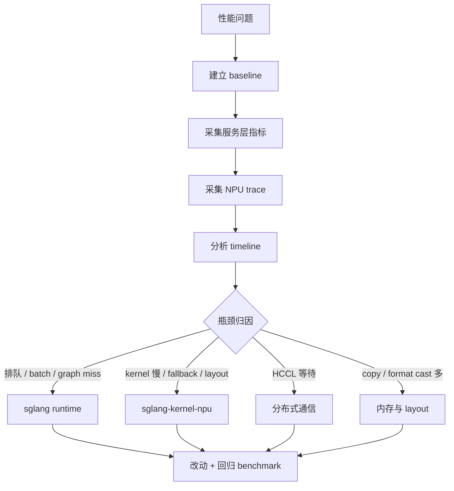

# 12. SGLang-NPU Profiling 详细教学

这一讲专门讲 SGLang-NPU 的 profiling。目标不是“打开一个 profiler 看一眼图”，而是建立一套可复现的性能归因流程：先确定慢在哪里，再决定应该改 `sglang` 主仓、`sglang-kernel-npu`，还是环境与部署参数。

## Profiling 总览



SGLang-NPU profiling 通常分四层：

| 层级 | 观察对象 | 常用工具 |
|---|---|---|
| 请求层 | TTFT、TPOT、tokens/s、P50/P99 | benchmark client、日志、OpenAI API 压测。 |
| Runtime 层 | scheduler、batch、graph capture/replay、采样 | SGLang 日志、Python profiler、SGLang profiling 工具。 |
| NPU 层 | kernel timeline、NPU idle gap、copy、format cast | `torch_npu.profiler`、TensorBoard trace、Ascend 工具链。 |
| 分布式层 | HCCL collective、rank 等待、通信重叠 | NPU trace、HCCL 日志、rank 日志。 |

## 0. Profiling 前的原则

不要一上来就打开重 profiler。Profiling 本身会带来开销，尤其是 NPU trace、shape 记录、memory profile、stack trace。

推荐顺序：

1. 先不打开 profiler，跑稳定 baseline。
2. 只打开轻量日志和 benchmark 指标。
3. 再采短窗口 NPU trace。
4. 最后才打开更重的 stack、memory、record_shapes。

每次只改一个变量：

```text
固定模型 + 固定请求分布 + 固定启动参数 + 固定 profiling 窗口
```

否则你看到的差异可能来自请求抖动，而不是代码改动。

## 1. 建立 Baseline

### 1.1 固定启动参数

先用本地模型启动服务，避免在线下载影响结果：

```bash
sglang serve \
  --model-path /workspace/sglang-npu/models/Qwen2.5-7B-Instruct \
  --host 0.0.0.0 \
  --port 8000 \
  --device npu \
  --attention-backend ascend \
  --base-gpu-id 0 \
  --tp-size 1
```

记录以下信息：

```bash
npu-smi info
python3 - <<'PY'
import torch
import torch_npu
import sglang
print("torch:", torch.__version__)
print("torch_npu:", torch_npu.__version__)
print("sglang:", sglang.__file__)
print("npu available:", torch.npu.is_available())
PY
```

### 1.2 固定请求矩阵

建议至少覆盖：

| 场景 | prompt | output | 并发 | 目的 |
|---|---:|---:|---:|---|
| decode latency | 128 | 128 | 1 | 看单请求 TPOT。 |
| prefill | 4096 | 32 | 1 | 看长 prompt prefill。 |
| continuous batching | 512 | 128 | 8/16 | 看调度与 batch。 |
| graph coverage | 512 | 128 | 1/4/16/64 | 看 graph shape 覆盖。 |
| TP | 512 | 128 | 8 | 看 HCCL 通信。 |

baseline 表格模板：

```text
model:
device:
CANN / torch_npu / sglang / sgl_kernel_npu:
tp_size:
graph:
prompt_len:
output_len:
concurrency:
TTFT:
TPOT:
tokens/s:
P50/P99:
NPU util:
HBM:
notes:
```

## 2. SGLang 服务层 Profiling

服务层 profiling 的目标是判断：慢是因为请求排队、batch 构造、graph miss、采样、tokenization，还是 NPU kernel 本身。

### 2.1 先看日志关键字

启动日志里重点找：

```text
device=npu
attention_backend=ascend
prefill_attention_backend=ascend
decode_attention_backend=ascend
chunked_prefill_size
cuda_graph_max_bs
Capture npu graph begin
Capture npu graph end
backend=hccl
```

如果 attention backend 不是 `ascend`，不要继续做 kernel profiling。先修后端选择。

### 2.2 用 graph 开关做快速归因

同一组请求分别跑：

```bash
sglang serve ... --disable-cuda-graph
```

和：

```bash
sglang serve ... --cuda-graph-max-bs 64
```

判断：

| 现象 | 说明 |
|---|---|
| 打开 graph 后 TPOT 明显下降 | graph replay 有收益，后续优化 graph coverage。 |
| 打开 graph 后收益很小 | kernel、通信或调度可能是主瓶颈。 |
| 打开 graph 后显存暴涨 | capture batch 覆盖过大或静态 buffer 太多。 |
| 打开 graph 后偶发错误 | shape key、metadata 或输入地址稳定性要检查。 |

### 2.3 用 batch 维度定位调度问题

如果并发升高后 tokens/s 没上去，先观察：

- NPU timeline 是否有大空洞。
- decode batch size 是否频繁很小。
- 请求是否被长 prompt prefill 阻塞。
- scheduler 是否频繁拆分/合并 batch。
- graph replay 是否只命中少数 batch size。

这类问题通常优先看 `sglang` 主仓，而不是 kernel 仓。

## 3. 使用 torch_npu.profiler 采集 NPU Trace

SGLang 在 NPU 下会通过 `torch_npu.profiler` 适配 PyTorch profiler。你会在源码中看到类似接入点：

```text
python/sglang/srt/utils/profile_utils.py
python/sglang/multimodal_gen/runtime/utils/profiler.py
```

核心概念：

- CUDA activity 在 NPU 下要替换成 `ProfilerActivity.NPU`。
- trace handler 使用 `torch_npu.profiler.tensorboard_trace_handler(...)`。
- NPU profiling 文件会写到你指定的日志目录。

### 3.1 最小 torch_npu profiler 示例

下面的脚本用于理解 profiler 输出结构，不等价于完整 SGLang server profiling：

```python
import torch
import torch_npu

activities = [
    torch_npu.profiler.ProfilerActivity.CPU,
    torch_npu.profiler.ProfilerActivity.NPU,
]

with torch_npu.profiler.profile(
    activities=activities,
    schedule=torch_npu.profiler.schedule(wait=1, warmup=1, active=3, repeat=1),
    on_trace_ready=torch_npu.profiler.tensorboard_trace_handler(
        "/workspace/sglang-npu/logs/profiler"
    ),
    record_shapes=True,
    profile_memory=True,
    with_stack=False,
) as prof:
    for step in range(8):
        # 替换成你的 NPU workload。
        x = torch.randn((4096, 4096), device="npu", dtype=torch.float16)
        y = x @ x
        torch.npu.synchronize()
        prof.step()
```

字段解释：

| 参数 | 建议 |
|---|---|
| `wait` | 跳过启动和首次 lazy init。 |
| `warmup` | 让 profiler 预热，不把 warmup 作为正式数据。 |
| `active` | 只采短窗口，降低开销。 |
| `record_shapes` | 定位 shape 问题时开启，常规性能对比可关闭。 |
| `profile_memory` | 查显存问题时开启，平时尽量关闭。 |
| `with_stack` | 很重，只有定位 Python 调用栈时开启。 |

### 3.2 对 SGLang server 采集 trace 的策略

Server 是长生命周期进程，不能无限制采集 trace。推荐做短窗口：

1. 启动 SGLang server。
2. 先发几轮 warmup 请求。
3. 开启 profiler。
4. 只采 10 到 30 秒。
5. 停止 profiler。
6. 立刻保存请求参数和日志。

如果当前 SGLang 版本提供内置 profiler 开关或 HTTP profiling 入口，优先使用内置方式；如果没有，就在本地开发分支中把 profiler 包在 worker/model forward 热路径周围。采集点应该尽量靠近 `ModelRunner` forward，而不是包住整个 HTTP server。

推荐采集窗口：

| 目标 | 采集窗口 |
|---|---|
| prefill kernel | 发长 prompt 请求时 active 3 到 5 step。 |
| decode kernel | 发固定输出长度请求，跳过首 token 后采中间 decode。 |
| graph replay | warmup 完成后采 replay 阶段。 |
| HCCL | TP 多卡请求稳定后采 active 窗口。 |
| LoRA/MoE | adapter/expert 已加载后采稳定请求。 |

## 4. TensorBoard Trace 怎么看

trace 生成后，通常可以用 TensorBoard 打开：

```bash
tensorboard --logdir /workspace/sglang-npu/logs/profiler --host 0.0.0.0 --port 6006
```

重点看五件事。

### 4.1 NPU 是否有大空洞

如果 NPU kernel 之间有明显空洞：

- CPU 可能在构造 batch 或 metadata。
- 采样、tokenization 或 detokenization 可能阻塞。
- graph replay 没命中，回到 eager 路径。
- 多卡可能在等通信。

这种情况通常不是先改 kernel。

### 4.2 最耗时 kernel 是谁

如果 timeline 中少数 kernel 占大头，记录：

```text
kernel name:
input shape:
dtype:
duration:
调用阶段: prefill / decode / sampling / cache copy
是否 fallback:
```

如果是 attention、LoRA、MoE、quant kernel，通常需要看 `sglang-kernel-npu`。如果是 format cast、copy、slice/scatter，通常要同时看 SGLang layout 和 kernel 输入格式。

### 4.3 CPU 与 NPU 是否同步过多

高频同步会打断流水。典型来源：

- 代码里显式 `synchronize`。
- 读取 NPU tensor 到 CPU。
- logging 或 debug 打印触发数据同步。
- graph capture 前后同步。
- HCCL collective 等待。

初学者加 debug 日志时尤其要小心：不要在热路径里打印 NPU tensor value。

### 4.4 Graph capture 与 replay 是否符合预期

你要区分：

- capture 阶段慢：可能正常，通常只发生在 warmup。
- replay 阶段慢：需要看 graph 内 kernel。
- 频繁重新 capture：shape key 或 batch 波动问题。
- 没有 replay：graph 参数、shape 或禁用开关问题。

### 4.5 Copy / format cast 是否异常

如果看到大量格式转换或 copy：

- 检查 KV cache layout 是否适配 Ascend attention。
- 检查 kernel 是否要求特殊 format。
- 检查 SGLang 是否每步都在重新构造 device tensor。
- 检查 host/device 来回搬运是否来自采样或 logging。

## 5. 不同瓶颈的 Profiling 方案

### 5.1 Prefill 慢

实验：

```text
prompt_len=4096, output_len=16, concurrency=1
prompt_len=8192, output_len=16, concurrency=1
```

看：

- prefill attention kernel 耗时。
- chunked prefill 是否触发。
- HBM 峰值。
- 是否 OOM 或频繁 cache allocate。

常见优化：

- 调整 `chunked_prefill_size`。
- 优化 prefill attention kernel。
- 减少 prefill metadata 构造开销。
- 检查 KV page 分配和写入路径。

### 5.2 Decode 慢

实验：

```text
prompt_len=128/512, output_len=256, concurrency=1/8/16
```

看：

- TPOT。
- decode attention kernel。
- graph replay 命中率。
- sampling 是否在 CPU 成为瓶颈。
- batch size 是否稳定。

常见优化：

- 扩大常见 batch 的 graph coverage。
- 优化 decode attention kernel。
- 减少每 token metadata 更新。
- 融合 sampling/logits 处理。

### 5.3 多卡 TP 扩展差

实验：

```text
tp_size=1, 2, 4
相同模型、相同请求分布
```

看：

- HCCL collective 耗时。
- rank 之间是否负载不均。
- 每层通信是否阻塞计算。
- HCCL 初始化和 rank/device 映射。

常见优化：

- 减少不必要 collective。
- 调整 TP size。
- 通信与计算 overlap。
- 检查拓扑、网卡和 HCCL 环境。

### 5.4 Kernel fallback

如果出现 fallback warning 或 timeline 中走了非预期 op：

1. 记录模型、dtype、shape、head size、seq len。
2. 查 kernel 是否支持该 shape。
3. 查 SGLang backend 是否把该 shape 路由到了 Ascend kernel。
4. 决定是补 kernel 支持，还是在 SGLang 中提前规避。

## 6. Profiling 结果如何变成开发任务

| Profiling 结论 | 开发任务 |
|---|---|
| NPU 大量 idle gap | 查 scheduler、batch、tokenization、graph miss。 |
| attention kernel 占比最高 | 优化 `sglang-kernel-npu` attention 或 SGLang metadata/layout。 |
| copy/format cast 多 | 统一 layout，减少 host/device 搬运。 |
| graph replay 不命中 | 查 graph shape key、batch size 分布、capture 参数。 |
| HCCL 等待高 | 查 TP 通信、rank 映射、overlap。 |
| CPU sampling 高 | 优化 logits processor / sampling，考虑 device-side 处理。 |
| LoRA/MoE 特性慢 | 分别 profile adapter kernel、routing、expert dispatch。 |

## 7. Profiling 报告模板

每次提交性能优化 PR，建议附上：

```text
标题:
  优化场景和核心收益。

环境:
  NPU 型号:
  CANN:
  torch:
  torch_npu:
  sglang:
  sgl_kernel_npu:

模型与参数:
  model:
  dtype:
  tp_size:
  graph:
  attention_backend:

请求分布:
  prompt_len:
  output_len:
  concurrency:
  request_count:

Baseline:
  TTFT:
  TPOT:
  tokens/s:
  P50/P99:
  HBM:

After:
  TTFT:
  TPOT:
  tokens/s:
  P50/P99:
  HBM:

Profiling 证据:
  trace 路径:
  主要 kernel:
  idle gap:
  copy / format cast:
  HCCL:

风险:
  shape 限制:
  graph 影响:
  显存变化:
  fallback 策略:
```

## 8. 常见误区

| 误区 | 正确做法 |
|---|---|
| 一上来打开完整 profiler 跑长压测 | 先 baseline，再短窗口采样。 |
| 只看平均 tokens/s | 同时看 TTFT、TPOT、P50/P99、显存。 |
| 看到 kernel 慢就改 kernel | 先确认 NPU 是否被喂饱、graph 是否命中。 |
| 把首轮请求当稳定性能 | 首轮包含 lazy init、graph capture、kernel 编译。 |
| 不固定请求分布 | 固定 prompt/output/concurrency，才能比较。 |
| 忽略 fallback warning | fallback 可能让结果正确但性能很差。 |
| 在热路径打印 NPU tensor | 可能触发同步，污染 profiling。 |

## 本讲小结

SGLang-NPU profiling 的核心能力是归因：

- **调度慢**：看 batch、队列、NPU idle gap。
- **graph 慢**：看 capture/replay、shape key、显存。
- **kernel 慢**：看 NPU timeline 中的 hot kernel。
- **内存慢**：看 copy、format cast、KV layout。
- **通信慢**：看 HCCL collective 和 rank 等待。

只有归因清楚，才知道应该改 `sglang`、`sglang-kernel-npu`，还是改部署参数。
