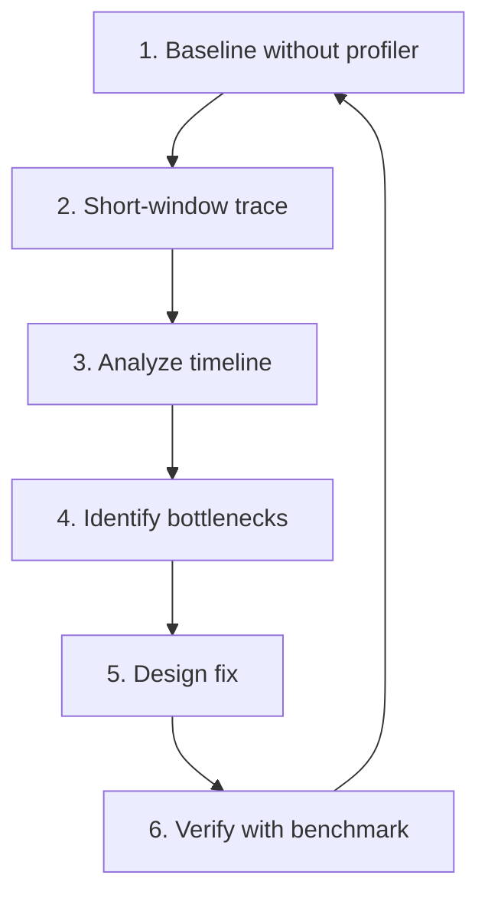

[中文](./12-npu-profiling-guide.md) | [English](./12-npu-profiling-guide_EN.md)

# 12. NPU Profiling Guide

## 1. Profiling Workflow



## 2. Establishing Baseline

Always measure without profiler overhead first:

```bash
# Record key metrics
TTFT (Time To First Token)
ITL (Inter-Token Latency)
TPS (Tokens Per Second)
QPS (Queries Per Second)
GPU/NPU utilization
HBM usage
```

## 3. NPU Profiler Usage

```python
import torch_npu

# Basic profiling
with torch_npu.profiler.profile(
    activities=[torch_npu.profiler.ProfilerActivity.NPU],
    schedule=torch_npu.profiler.schedule(wait=2, warmup=2, active=5),
) as prof:
    for step in range(20):
        model_runner.forward(batch)
        prof.step()

# Export for TensorBoard
prof.export_chrome_trace("npu_trace.json")
```

## 4. Timeline Analysis

Key things to look for:

| Pattern | Indicates | Action |
|---|---|---|
| NPU idle gaps | CPU scheduling overhead | Optimize scheduler, check overlap |
| Hot kernel > 50% time | Single kernel bottleneck | Optimize or fuse that kernel |
| Frequent format casts | Layout conversion overhead | Pre-convert tensors to FRACTAL_NZ |
| HCCL wait long | Communication bottleneck | Check TP balance, network |
| Copy D2H/H2D excessive | Unnecessary data transfer | Keep data on device |

## 5. Scenario-Specific Profiling

| Scenario | Profiling Window | Focus |
|---|---|---|
| Prefill | Single prefill forward | Compute utilization, memory peak |
| Decode | 100+ decode steps | Memory bandwidth, graph replay |
| TP | Multi-step trace | HCCL wait time, load balance |
| PD | Full transfer + decode | Transfer latency, engine overhead |
| Combined features | End-to-end trace | Feature interaction overhead |

## 6. Converting Profiling to Development Tasks

```text
Profile finding → Root cause hypothesis → Source location → Fix → Verify

Example:
  "40% time in format_cast" 
    → Tensors not pre-converted to FRACTAL_NZ
    → Check tensor allocation in model loading
    → Add pre-conversion step
    → Re-profile: format_cast < 1%
```
