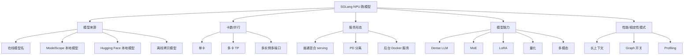
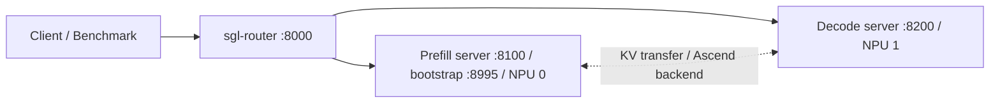

**中文** | [English](./13-run-models-by-scenario_EN.md)

# 13. SGLang NPU 多场景模型运行手册

这一讲是场景化启动手册。前面的章节分别讲环境、参数、PD、LoRA、profiling；这一讲把它们组合成“我要跑某类模型/某种部署形态时，该用什么命令、先验收什么、常见坑在哪”。

本讲默认你已经完成：

- 宿主机 `npu-smi info` 正常。
- 官方 Docker 或自建环境可以执行 `sglang serve --help`。
- 模型已经放在 `/workspace/sglang-npu/models` 或 `/home/{myspace}/sglang-npu-workspace/models`。
- 普通单卡请求已经能返回。

## 场景总览



## 0. 统一约定

### 0.1 Docker 内路径

官方 Docker 推荐把个人工作目录挂载到容器：

```bash
-v /home/{myspace}/sglang-npu-workspace:/workspace/sglang-npu
```

本讲默认容器内路径：

```bash
export WORKSPACE=/workspace/sglang-npu
export MODEL_ROOT=/workspace/sglang-npu/models
export LOG_ROOT=/workspace/sglang-npu/logs
mkdir -p "$MODEL_ROOT" "$LOG_ROOT"
```

### 0.2 通用 NPU 参数

绝大多数场景都建议显式带上：

```bash
--device npu \
--attention-backend ascend
```

单卡时通常加：

```bash
--base-gpu-id 0 \
--tp-size 1
```

多卡时通常加：

```bash
--tp-size <N>
```

> SGLang 里不少参数名沿用 CUDA 术语，例如 `--disable-cuda-graph`、`--cuda-graph-max-bs`。在 NPU 下它们会映射到 NPU graph 语义，不代表真的使用 CUDA。

### 0.3 最小验收命令

每个场景启动后都先做：

```bash
curl http://127.0.0.1:8000/health
curl http://127.0.0.1:8000/v1/models
curl http://127.0.0.1:8000/v1/chat/completions \
  -H "Content-Type: application/json" \
  -d '{
    "model": "default",
    "messages": [{"role": "user", "content": "用一句话说明你已经在 NPU 上运行。"}],
    "temperature": 0,
    "max_tokens": 64
  }'
```

日志里至少确认：

```text
device=npu
attention_backend=ascend
```

### 0.4 脚本目录约定

本讲后续所有脚本都建议放在个人工作目录里，不写入系统目录，也不修改全局 profile：

```bash
export WORKSPACE=/workspace/sglang-npu
mkdir -p "$WORKSPACE/scripts"/{models,single,tp,pd,docker,bench}
mkdir -p "$WORKSPACE/logs"/{single,tp,pd,docker,bench}
```

脚本统一遵循三个原则：

- 所有环境变量只在当前脚本进程内 `export`，不写入 `/etc/profile`、`~/.bashrc`、`~/.profile`。
- 所有日志写到 `$WORKSPACE/logs/<scenario>`，所有 PID 写到对应场景目录，便于停服。
- 所有模型、缓存、源码都放在 `$WORKSPACE` 或宿主机 `/home/{myspace}/sglang-npu-workspace` 下。

一个最小脚本骨架如下：

```bash
cat > "$WORKSPACE/scripts/single/run_single_qwen.sh" <<'SH'
#!/usr/bin/env bash
set -euo pipefail

WORKSPACE=${WORKSPACE:-/workspace/sglang-npu}
MODEL_ROOT=${MODEL_ROOT:-$WORKSPACE/models}
LOG_ROOT=${LOG_ROOT:-$WORKSPACE/logs}
mkdir -p "$LOG_ROOT/single"

export ASCEND_RT_VISIBLE_DEVICES=${ASCEND_RT_VISIBLE_DEVICES:-0}

exec > >(tee -a "$LOG_ROOT/single/qwen-single.log") 2>&1
exec sglang serve \
  --model-path "$MODEL_ROOT/Qwen2.5-7B-Instruct" \
  --host 0.0.0.0 \
  --port 8000 \
  --device npu \
  --attention-backend ascend \
  --base-gpu-id 0 \
  --tp-size 1
SH

chmod +x "$WORKSPACE/scripts/single/run_single_qwen.sh"
bash "$WORKSPACE/scripts/single/run_single_qwen.sh"
```

多卡 TP 脚本只需要把可见卡和 `--tp-size` 对齐：

```bash
cat > "$WORKSPACE/scripts/tp/run_tp4_qwen.sh" <<'SH'
#!/usr/bin/env bash
set -euo pipefail

WORKSPACE=${WORKSPACE:-/workspace/sglang-npu}
MODEL_ROOT=${MODEL_ROOT:-$WORKSPACE/models}
LOG_ROOT=${LOG_ROOT:-$WORKSPACE/logs}
mkdir -p "$LOG_ROOT/tp"

export ASCEND_RT_VISIBLE_DEVICES=${ASCEND_RT_VISIBLE_DEVICES:-0,1,2,3}

exec > >(tee -a "$LOG_ROOT/tp/qwen-tp4.log") 2>&1
exec sglang serve \
  --model-path "$MODEL_ROOT/Qwen2.5-32B-Instruct" \
  --host 0.0.0.0 \
  --port 8000 \
  --device npu \
  --attention-backend ascend \
  --tp-size 4
SH

chmod +x "$WORKSPACE/scripts/tp/run_tp4_qwen.sh"
bash "$WORKSPACE/scripts/tp/run_tp4_qwen.sh"
```

## 1. 按模型来源区分

### 1.1 在线模型名启动

适合：临时验证、网络可访问模型源、模型不大。

```bash
sglang serve \
  --model-path Qwen/Qwen2.5-7B-Instruct \
  --host 0.0.0.0 \
  --port 8000 \
  --device npu \
  --attention-backend ascend \
  --base-gpu-id 0 \
  --tp-size 1
```

优点是命令短。缺点是下载来源、缓存目录、网络速度和 token 权限会影响启动时间，不适合严肃 benchmark。

### 1.2 ModelScope 本地模型启动

适合：国内网络、内网模型仓库、可控缓存路径。

先下载：

```bash
python3 -m pip install -U modelscope
export MODELSCOPE_CACHE=/workspace/sglang-npu/cache/modelscope
mkdir -p "$MODELSCOPE_CACHE" "$MODEL_ROOT"

modelscope download \
  --model Qwen/Qwen2.5-7B-Instruct \
  --local_dir "$MODEL_ROOT/Qwen2.5-7B-Instruct"
```

启动：

```bash
sglang serve \
  --model-path "$MODEL_ROOT/Qwen2.5-7B-Instruct" \
  --host 0.0.0.0 \
  --port 8000 \
  --device npu \
  --attention-backend ascend \
  --base-gpu-id 0 \
  --tp-size 1
```

如果 ModelScope CLI 版本不支持 `--local_dir`，用 Python API：

```bash
python3 - <<'PY'
from modelscope import snapshot_download

snapshot_download(
    "Qwen/Qwen2.5-7B-Instruct",
    local_dir="/workspace/sglang-npu/models/Qwen2.5-7B-Instruct",
    cache_dir="/workspace/sglang-npu/cache/modelscope",
)
PY
```

### 1.3 Hugging Face 本地模型启动

适合：能访问 Hugging Face，或团队已有 HF 镜像源。

```bash
export HF_HOME=/workspace/sglang-npu/cache/huggingface
export HF_TOKEN=<your_token_if_needed>

huggingface-cli download Qwen/Qwen2.5-7B-Instruct \
  --local-dir "$MODEL_ROOT/Qwen2.5-7B-Instruct"

sglang serve \
  --model-path "$MODEL_ROOT/Qwen2.5-7B-Instruct" \
  --host 0.0.0.0 \
  --port 8000 \
  --device npu \
  --attention-backend ascend \
  --base-gpu-id 0 \
  --tp-size 1
```

### 1.4 完全离线模型启动

适合：生产环境、封闭内网、无法访问外部模型源。

在可联网机器下载模型后，把完整目录拷贝到：

```text
/home/{myspace}/sglang-npu-workspace/models/Qwen2.5-7B-Instruct
```

在容器内检查：

```bash
ls "$MODEL_ROOT/Qwen2.5-7B-Instruct"
find "$MODEL_ROOT/Qwen2.5-7B-Instruct" -maxdepth 1 -type f | sort | head -30
```

启动：

```bash
sglang serve \
  --model-path "$MODEL_ROOT/Qwen2.5-7B-Instruct" \
  --host 0.0.0.0 \
  --port 8000 \
  --device npu \
  --attention-backend ascend \
  --base-gpu-id 0 \
  --tp-size 1
```

## 2. 按卡数和并行方式区分

### 2.1 单卡 Dense 模型

适合：最小功能验证、开发调试、单卡 profiling。

```bash
export ASCEND_RT_VISIBLE_DEVICES=0

sglang serve \
  --model-path "$MODEL_ROOT/Qwen2.5-7B-Instruct" \
  --host 0.0.0.0 \
  --port 8000 \
  --device npu \
  --attention-backend ascend \
  --base-gpu-id 0 \
  --tp-size 1 \
  2>&1 | tee "$LOG_ROOT/single-card.log"
```

验收重点：

- `torch.npu.device_count()` 至少为 1。
- 日志确认 `device=npu`。
- 单请求和 stream 请求都能返回。

### 2.2 多卡 Tensor Parallel

适合：模型单卡放不下，或希望提升吞吐。

```bash
export ASCEND_RT_VISIBLE_DEVICES=0,1,2,3

sglang serve \
  --model-path "$MODEL_ROOT/Qwen2.5-32B-Instruct" \
  --host 0.0.0.0 \
  --port 8000 \
  --device npu \
  --attention-backend ascend \
  --tp-size 4 \
  --base-gpu-id 0 \
  2>&1 | tee "$LOG_ROOT/tp4.log"
```

验收重点：

- 日志出现 HCCL 初始化。
- 每张卡显存都有占用。
- `tp_size` 和可见 NPU 数量一致。
- 单卡能跑通后再跑多卡。

常见问题：

| 现象 | 方向 |
|---|---|
| 多卡启动卡住 | HCCL、rank/device 映射、端口冲突。 |
| 单卡正常，多卡慢 | HCCL 通信占比高、TP size 不合适。 |
| 某张卡显存异常 | rank 绑定、模型 shard、可见设备配置。 |

### 2.3 多实例多端口

适合：一台机器上用不同 NPU 跑多个小模型，或做 A/B 实验。

实例 A：

```bash
ASCEND_RT_VISIBLE_DEVICES=0 \
sglang serve \
  --model-path "$MODEL_ROOT/Qwen2.5-7B-Instruct" \
  --host 0.0.0.0 \
  --port 8000 \
  --device npu \
  --attention-backend ascend \
  --base-gpu-id 0 \
  --tp-size 1
```

实例 B：

```bash
ASCEND_RT_VISIBLE_DEVICES=1 \
sglang serve \
  --model-path "$MODEL_ROOT/another-model" \
  --host 0.0.0.0 \
  --port 8001 \
  --device npu \
  --attention-backend ascend \
  --base-gpu-id 0 \
  --tp-size 1
```

注意：`ASCEND_RT_VISIBLE_DEVICES=1` 后，进程内看到的第一张卡通常仍是逻辑 0，所以 `--base-gpu-id 0` 是常见写法。

## 3. 按服务形态区分

### 3.1 普通混合 Prefill/Decode Serving

这是默认形态，prefill 和 decode 在同一个 server 中完成。

```bash
sglang serve \
  --model-path "$MODEL_ROOT/Qwen2.5-7B-Instruct" \
  --host 0.0.0.0 \
  --port 8000 \
  --device npu \
  --attention-backend ascend \
  --tp-size 1
```

适合：

- 单机服务。
- 初次验证。
- 大多数开发调试。

### 3.2 PD 分离：整体拓扑

适合：长 prompt 多、decode 持续时间长、希望 prefill 和 decode 分开扩容。官方推荐的 PD 分离实践一般拆成三个入口：

- Prefill server：负责 prompt prefill，启动时使用 `--disaggregation-mode prefill`，并暴露 bootstrap port。
- Decode server：负责 token decode，启动时使用 `--disaggregation-mode decode`，并启用 `--pd-disaggregation`。
- Router：对外提供 OpenAI-compatible API，把请求路由到 prefill/decode worker。

单机双卡最小拓扑可以这样理解：



多机时，prefill 和 decode 的 HTTP 地址会变成不同机器的 IP，`ASCEND_MF_STORE_URL`、RDMA/SDMA 协议和网络连通性需要由集群统一约定。本讲先用单机双进程把链路跑通。

### 3.3 PD 分离：公共环境脚本

先创建一个只影响当前 PD 脚本的公共环境文件：

```bash
mkdir -p "$WORKSPACE/scripts/pd" "$WORKSPACE/logs/pd"

cat > "$WORKSPACE/scripts/pd/env.sh" <<'SH'
#!/usr/bin/env bash
set -euo pipefail

export WORKSPACE=${WORKSPACE:-/workspace/sglang-npu}
export MODEL_ROOT=${MODEL_ROOT:-$WORKSPACE/models}
export LOG_ROOT=${LOG_ROOT:-$WORKSPACE/logs}
export MODEL_PATH=${MODEL_PATH:-$MODEL_ROOT/Qwen2.5-7B-Instruct}

export HOST=${HOST:-0.0.0.0}
export CLIENT_HOST=${CLIENT_HOST:-127.0.0.1}
export ROUTER_PORT=${ROUTER_PORT:-8000}
export PREFILL_PORT=${PREFILL_PORT:-8100}
export DECODE_PORT=${DECODE_PORT:-8200}
export PREFILL_BOOTSTRAP_PORT=${PREFILL_BOOTSTRAP_PORT:-8995}

export PREFILL_NPUS=${PREFILL_NPUS:-0}
export DECODE_NPUS=${DECODE_NPUS:-1}
export PREFILL_TP_SIZE=${PREFILL_TP_SIZE:-1}
export DECODE_TP_SIZE=${DECODE_TP_SIZE:-1}

# 同一组 PD worker 必须使用同一个 store URL。
export ASCEND_MF_STORE_URL=${ASCEND_MF_STORE_URL:-tcp://127.0.0.1:18000}

# 默认先走 SDMA/本机链路。跨机或 Atlas 800I A2 RDMA 场景再按集群规范改成 device_rdma。
export ASCEND_MF_TRANSFER_PROTOCOL=${ASCEND_MF_TRANSFER_PROTOCOL:-sdma}

mkdir -p "$LOG_ROOT/pd"
SH

chmod +x "$WORKSPACE/scripts/pd/env.sh"
```

说明：

- `PREFILL_NPUS=0`、`DECODE_NPUS=1` 表示两个 server 分别绑定不同 NPU。
- 如果一台机器上只有一张可用 NPU，不建议用 PD 分离做性能结论，只能做功能冒烟。
- 如果 prefill/decode 各自使用多卡，把 `PREFILL_NPUS` 和 `DECODE_NPUS` 写成逗号分隔，并同步调大对应 `*_TP_SIZE`。

### 3.4 PD 分离：Prefill Server 脚本

Prefill server 脚本：

```bash
cat > "$WORKSPACE/scripts/pd/start_prefill.sh" <<'SH'
#!/usr/bin/env bash
set -euo pipefail

PD_DIR=$(cd "$(dirname "${BASH_SOURCE[0]}")" && pwd)
source "$PD_DIR/env.sh"

export ASCEND_RT_VISIBLE_DEVICES="$PREFILL_NPUS"

exec > >(tee -a "$LOG_ROOT/pd/prefill.log") 2>&1
exec sglang serve \
  --model-path "$MODEL_PATH" \
  --host "$HOST" \
  --port "$PREFILL_PORT" \
  --device npu \
  --attention-backend ascend \
  --tp-size "$PREFILL_TP_SIZE" \
  --disaggregation-mode prefill \
  --disaggregation-transfer-backend ascend \
  --disaggregation-bootstrap-port "$PREFILL_BOOTSTRAP_PORT"
SH

chmod +x "$WORKSPACE/scripts/pd/start_prefill.sh"
```

前台启动方式，适合第一次排错：

```bash
bash "$WORKSPACE/scripts/pd/start_prefill.sh"
```

后台启动方式，适合正式联调：

```bash
nohup bash "$WORKSPACE/scripts/pd/start_prefill.sh" \
  > "$LOG_ROOT/pd/prefill.nohup.log" 2>&1 &
echo $! > "$LOG_ROOT/pd/prefill.pid"
```

Prefill 就绪检查：

```bash
curl "http://127.0.0.1:${PREFILL_PORT}/health"
curl "http://127.0.0.1:${PREFILL_PORT}/server_info"
grep -Ei "disaggregation|bootstrap|ascend|transfer" "$LOG_ROOT/pd/prefill.log"
```

### 3.5 PD 分离：Decode Server 脚本

Decode server 脚本：

```bash
cat > "$WORKSPACE/scripts/pd/start_decode.sh" <<'SH'
#!/usr/bin/env bash
set -euo pipefail

PD_DIR=$(cd "$(dirname "${BASH_SOURCE[0]}")" && pwd)
source "$PD_DIR/env.sh"

export ASCEND_RT_VISIBLE_DEVICES="$DECODE_NPUS"

exec > >(tee -a "$LOG_ROOT/pd/decode.log") 2>&1
exec sglang serve \
  --model-path "$MODEL_PATH" \
  --host "$HOST" \
  --port "$DECODE_PORT" \
  --device npu \
  --attention-backend ascend \
  --tp-size "$DECODE_TP_SIZE" \
  --disaggregation-mode decode \
  --disaggregation-transfer-backend ascend \
  --pd-disaggregation
SH

chmod +x "$WORKSPACE/scripts/pd/start_decode.sh"
```

启动：

```bash
nohup bash "$WORKSPACE/scripts/pd/start_decode.sh" \
  > "$LOG_ROOT/pd/decode.nohup.log" 2>&1 &
echo $! > "$LOG_ROOT/pd/decode.pid"
```

Decode 就绪检查：

```bash
curl "http://127.0.0.1:${DECODE_PORT}/health"
curl "http://127.0.0.1:${DECODE_PORT}/server_info"
grep -Ei "disaggregation|decode|ascend|transfer" "$LOG_ROOT/pd/decode.log"
```

### 3.6 PD 分离：Router 脚本

当前仓库内的实验 router 在 `experimental/sgl-router`，命令形态是：

```bash
sgl-router \
  --host 0.0.0.0 \
  --port 8000 \
  --model-id Qwen2.5-7B-Instruct \
  --tokenizer-path /workspace/sglang-npu/models/Qwen2.5-7B-Instruct/tokenizer.json \
  --worker-urls http://127.0.0.1:8100 http://127.0.0.1:8200
```

如果容器内没有 `sgl-router` 二进制，先从源码构建一次：

```bash
cd /sgl-workspace/sglang/experimental/sgl-router
cargo build --release
cp target/release/sgl-router "$WORKSPACE/sgl-router"
```

Router 启动脚本：

```bash
cat > "$WORKSPACE/scripts/pd/start_router.sh" <<'SH'
#!/usr/bin/env bash
set -euo pipefail

PD_DIR=$(cd "$(dirname "${BASH_SOURCE[0]}")" && pwd)
source "$PD_DIR/env.sh"

ROUTER_BIN=${ROUTER_BIN:-sgl-router}
if ! command -v "$ROUTER_BIN" >/dev/null 2>&1; then
  if [ -x "$WORKSPACE/sgl-router" ]; then
    ROUTER_BIN="$WORKSPACE/sgl-router"
  else
    echo "Cannot find sgl-router. Build it from experimental/sgl-router first." >&2
    exit 1
  fi
fi

TOKENIZER_PATH=${TOKENIZER_PATH:-$MODEL_PATH/tokenizer.json}

exec > >(tee -a "$LOG_ROOT/pd/router.log") 2>&1
exec "$ROUTER_BIN" \
  --host "$HOST" \
  --port "$ROUTER_PORT" \
  --model-id "$(basename "$MODEL_PATH")" \
  --tokenizer-path "$TOKENIZER_PATH" \
  --worker-urls \
    "http://${CLIENT_HOST}:${PREFILL_PORT}" \
    "http://${CLIENT_HOST}:${DECODE_PORT}"
SH

chmod +x "$WORKSPACE/scripts/pd/start_router.sh"
```

启动：

```bash
nohup bash "$WORKSPACE/scripts/pd/start_router.sh" \
  > "$LOG_ROOT/pd/router.nohup.log" 2>&1 &
echo $! > "$LOG_ROOT/pd/router.pid"
```

Router 就绪检查：

```bash
curl "http://127.0.0.1:${ROUTER_PORT}/healthz"
curl "http://127.0.0.1:${ROUTER_PORT}/readyz"
curl "http://127.0.0.1:${ROUTER_PORT}/v1/models"
grep -Ei "worker|prefill|decode|ready|route" "$LOG_ROOT/pd/router.log"
```

> 如果你使用的是 Kubernetes EndpointSlice 发现模式，router 不再写 `--worker-urls`，而是用 `--service-discovery --prefill-selector ... --decode-selector ...`。本讲先聚焦最容易复现的静态 worker URL 模式。

### 3.7 PD 分离：一键启动、压测和停服

一键启动脚本：

```bash
cat > "$WORKSPACE/scripts/pd/run_all_local.sh" <<'SH'
#!/usr/bin/env bash
set -euo pipefail

PD_DIR=$(cd "$(dirname "${BASH_SOURCE[0]}")" && pwd)
source "$PD_DIR/env.sh"

nohup bash "$PD_DIR/start_prefill.sh" > "$LOG_ROOT/pd/prefill.nohup.log" 2>&1 &
echo $! > "$LOG_ROOT/pd/prefill.pid"
sleep 10

nohup bash "$PD_DIR/start_decode.sh" > "$LOG_ROOT/pd/decode.nohup.log" 2>&1 &
echo $! > "$LOG_ROOT/pd/decode.pid"
sleep 10

nohup bash "$PD_DIR/start_router.sh" > "$LOG_ROOT/pd/router.nohup.log" 2>&1 &
echo $! > "$LOG_ROOT/pd/router.pid"
sleep 3

echo "PD service started."
echo "Router: http://127.0.0.1:${ROUTER_PORT}"
echo "Logs: $LOG_ROOT/pd"
SH

chmod +x "$WORKSPACE/scripts/pd/run_all_local.sh"
bash "$WORKSPACE/scripts/pd/run_all_local.sh"
```

功能请求必须打到 router，而不是直接打 prefill/decode：

```bash
curl "http://127.0.0.1:${ROUTER_PORT}/v1/chat/completions" \
  -H "Content-Type: application/json" \
  -d '{
    "model": "Qwen2.5-7B-Instruct",
    "messages": [{"role": "user", "content": "请用三句话解释 PD 分离推理。"}],
    "temperature": 0,
    "max_tokens": 128
  }'
```

最小压测脚本：

```bash
cat > "$WORKSPACE/scripts/pd/bench_router.sh" <<'SH'
#!/usr/bin/env bash
set -euo pipefail

PD_DIR=$(cd "$(dirname "${BASH_SOURCE[0]}")" && pwd)
source "$PD_DIR/env.sh"

export BENCH_URL="http://127.0.0.1:${ROUTER_PORT}/v1/chat/completions"
export BENCH_MODEL="$(basename "$MODEL_PATH")"
export BENCH_RESULT="$LOG_ROOT/pd/bench-router.jsonl"
export BENCH_NUM_PROMPTS=${BENCH_NUM_PROMPTS:-32}
export BENCH_INPUT_WORDS=${BENCH_INPUT_WORDS:-512}
export BENCH_MAX_TOKENS=${BENCH_MAX_TOKENS:-128}

python3 - <<'PY' 2>&1 | tee "$LOG_ROOT/pd/bench-router.log"
import json
import os
import time
import urllib.request

url = os.environ["BENCH_URL"]
model = os.environ["BENCH_MODEL"]
result_path = os.environ["BENCH_RESULT"]
num_prompts = int(os.environ["BENCH_NUM_PROMPTS"])
input_words = int(os.environ["BENCH_INPUT_WORDS"])
max_tokens = int(os.environ["BENCH_MAX_TOKENS"])

prompt = " ".join(["请解释 SGLang NPU PD 分离推理的关键路径。"] * input_words)
latencies = []
ok = 0

with open(result_path, "w", encoding="utf-8") as f:
    for i in range(num_prompts):
        payload = {
            "model": model,
            "messages": [{"role": "user", "content": prompt}],
            "temperature": 0,
            "max_tokens": max_tokens,
        }
        body = json.dumps(payload).encode("utf-8")
        req = urllib.request.Request(
            url,
            data=body,
            headers={"Content-Type": "application/json"},
            method="POST",
        )
        start = time.perf_counter()
        try:
            with urllib.request.urlopen(req, timeout=300) as resp:
                data = json.loads(resp.read().decode("utf-8"))
            latency = time.perf_counter() - start
            usage = data.get("usage", {})
            row = {
                "id": i,
                "ok": True,
                "latency_s": latency,
                "prompt_tokens": usage.get("prompt_tokens"),
                "completion_tokens": usage.get("completion_tokens"),
                "total_tokens": usage.get("total_tokens"),
            }
            ok += 1
            latencies.append(latency)
        except Exception as exc:
            latency = time.perf_counter() - start
            row = {"id": i, "ok": False, "latency_s": latency, "error": repr(exc)}
        f.write(json.dumps(row, ensure_ascii=False) + "\n")
        f.flush()
        print(row)

if latencies:
    total = sum(latencies)
    latencies_sorted = sorted(latencies)
    p50 = latencies_sorted[len(latencies_sorted) // 2]
    p95 = latencies_sorted[max(0, int(len(latencies_sorted) * 0.95) - 1)]
    print(
        json.dumps(
            {
                "summary": {
                    "ok": ok,
                    "num_prompts": num_prompts,
                    "avg_latency_s": total / len(latencies),
                    "p50_latency_s": p50,
                    "p95_latency_s": p95,
                    "qps": len(latencies) / total if total else None,
                    "result_path": result_path,
                }
            },
            ensure_ascii=False,
        )
    )
else:
    raise SystemExit("all requests failed")
PY
SH

chmod +x "$WORKSPACE/scripts/pd/bench_router.sh"
bash "$WORKSPACE/scripts/pd/bench_router.sh"
```

跑测结果要同时收集四类信息：

- `bench-router.log`：成功数、平均延迟、P50/P95、QPS。
- `bench-router.jsonl`：每条请求的 latency、token usage 和错误信息。
- `router.log`：请求是否稳定进入 worker，是否有 5xx、timeout、circuit breaker。
- `prefill.log`：prefill batch、bootstrap port、KV transfer 发送侧是否正常。
- `decode.log`：decode batch、KV transfer 接收侧、持续 decode 是否正常。

停服脚本：

```bash
cat > "$WORKSPACE/scripts/pd/stop_pd.sh" <<'SH'
#!/usr/bin/env bash
set -euo pipefail

PD_DIR=$(cd "$(dirname "${BASH_SOURCE[0]}")" && pwd)
source "$PD_DIR/env.sh"

for name in router decode prefill; do
  pid_file="$LOG_ROOT/pd/${name}.pid"
  if [ -f "$pid_file" ]; then
    pid=$(cat "$pid_file")
    if kill -0 "$pid" >/dev/null 2>&1; then
      kill "$pid"
      echo "stopped $name pid=$pid"
    fi
    rm -f "$pid_file"
  fi
done
SH

chmod +x "$WORKSPACE/scripts/pd/stop_pd.sh"
bash "$WORKSPACE/scripts/pd/stop_pd.sh"
```

PD 常见问题定位顺序：

1. 先分别访问 prefill/decode 的 `/health` 和 `/server_info`，确认两个 worker 自己可用。
2. 再访问 router 的 `/healthz`、`/readyz`、`/v1/models`，确认 router 发现了 worker。
3. 小流量请求先跑通，再增加 `--num-prompts` 和 `--request-rate`。
4. 如果 router 正常但请求失败，优先看 decode 日志里的 KV 接收和 bootstrap 信息。
5. 如果跨机失败，优先检查 `ASCEND_MF_STORE_URL`、端口、防火墙、RDMA 网卡和 `ASCEND_MF_TRANSFER_PROTOCOL`。

### 3.8 后台 Docker 服务

适合：长时间运行，或者把服务交给其他人调用。

```bash
docker run -d \
  --name sglang-npu-qwen-{myspace} \
  --restart unless-stopped \
  --privileged \
  --network=host \
  --ipc=host \
  --shm-size=16g \
  --device=/dev/davinci0 \
  --device=/dev/davinci_manager \
  --device=/dev/hisi_hdc \
  -v /usr/local/sbin:/usr/local/sbin:ro \
  -v /usr/local/Ascend/driver:/usr/local/Ascend/driver:ro \
  -v /usr/local/Ascend/firmware:/usr/local/Ascend/firmware:ro \
  -v /etc/ascend_install.info:/etc/ascend_install.info:ro \
  -v /var/queue_schedule:/var/queue_schedule \
  -v /home/{myspace}/sglang-npu-workspace:/workspace/sglang-npu \
  docker.io/lmsysorg/sglang:main-cann8.5.0-910b \
  sglang serve \
    --model-path /workspace/sglang-npu/models/Qwen2.5-7B-Instruct \
    --host 0.0.0.0 \
    --port 8000 \
    --device npu \
    --attention-backend ascend \
    --base-gpu-id 0 \
    --tp-size 1
```

查看：

```bash
docker logs -f sglang-npu-qwen-{myspace}
```

停止：

```bash
docker stop sglang-npu-qwen-{myspace}
docker rm sglang-npu-qwen-{myspace}
```

## 4. 按模型能力区分

### 4.1 MoE 模型

适合：Qwen-MoE、DeepSeek-MoE 等带 expert 的模型。

```bash
sglang serve \
  --model-path "$MODEL_ROOT/moe-model" \
  --host 0.0.0.0 \
  --port 8000 \
  --device npu \
  --attention-backend ascend \
  --tp-size 4
```

MoE 验收重点：

- routing 正确，输出不异常。
- 多卡时 expert 相关通信稳定。
- profiling 中关注 routed expert、shared expert、top-k、combine。
- 如果出现 fallback，确认是正确性兜底还是性能降级。

### 4.2 LoRA 模型

适合：一个 base model 加多个 adapter。

先确认本地 SGLang 版本参数：

```bash
sglang serve --help | grep -i lora
```

常见启动模板：

```bash
sglang serve \
  --model-path "$MODEL_ROOT/base-model" \
  --host 0.0.0.0 \
  --port 8000 \
  --device npu \
  --attention-backend ascend \
  --tp-size 1 \
  --enable-lora \
  --max-loras-per-batch 4
```

LoRA 场景的参数在不同版本中可能还涉及 adapter 路径、LoRA 名称映射、rank 限制等，请以 `sglang serve --help` 和当前分支文档为准。

验收重点：

- base-only 输出正常。
- 单 adapter 输出正常。
- 多 adapter batch 输出正常。
- 日志确认 Ascend LoRA backend 或 NPU LoRA kernel 被使用。

### 4.3 量化模型

适合：AWQ、GPTQ、W8A8、W4A4 等量化模型。

先确认模型目录里有量化配置：

```bash
ls "$MODEL_ROOT/quant-model"
grep -R "quant" "$MODEL_ROOT/quant-model"/*.json || true
```

启动模板：

```bash
sglang serve \
  --model-path "$MODEL_ROOT/quant-model" \
  --host 0.0.0.0 \
  --port 8000 \
  --device npu \
  --attention-backend ascend \
  --tp-size 1
```

如果你的 SGLang 版本需要显式量化参数，先查：

```bash
sglang serve --help | grep -i quant
```

量化验收重点：

- 输出正确性和基线模型一致性。
- 日志中是否走 NPU quant backend。
- 是否 fallback 到慢路径。
- HBM 是否明显下降。

### 4.4 多模态模型

适合：Qwen-VL、GLM-4.6V 等多模态模型。

```bash
sglang serve \
  --model-path "$MODEL_ROOT/Qwen3-VL-30B-A3B-Instruct" \
  --host 0.0.0.0 \
  --port 8000 \
  --device npu \
  --attention-backend ascend \
  --tp-size 4 \
  --enable-multimodal
```

多模态验收重点：

- 文本-only 请求先跑通。
- 图片请求再跑通。
- 关注 processor 是否走了 NPU 适配 patch。
- 注意图像分辨率和 token 数会显著影响 prefill。

## 5. 按性能/稳定性模式区分

### 5.1 长上下文模型

适合：长 prompt、RAG、文档问答。

```bash
sglang serve \
  --model-path "$MODEL_ROOT/Qwen2.5-7B-Instruct" \
  --host 0.0.0.0 \
  --port 8000 \
  --device npu \
  --attention-backend ascend \
  --tp-size 1 \
  --chunked-prefill-size 4096
```

验收重点：

- 4096/8192 prompt 不 OOM。
- prefill latency 可接受。
- KV cache 显存占用符合预期。
- 如果首 token 很慢，先 profile prefill。

### 5.2 关闭 Graph 做定位

适合：遇到 graph capture 卡住、replay 错误、shape 不稳定。

```bash
sglang serve \
  --model-path "$MODEL_ROOT/Qwen2.5-7B-Instruct" \
  --host 0.0.0.0 \
  --port 8000 \
  --device npu \
  --attention-backend ascend \
  --tp-size 1 \
  --disable-cuda-graph
```

如果关闭 graph 后正常，说明问题可能在 capture/replay、shape key、静态输入地址或 graph 覆盖范围。

### 5.3 调整 Graph 覆盖范围

适合：decode batch size 稳定，但 graph replay 覆盖不足。

```bash
sglang serve \
  --model-path "$MODEL_ROOT/Qwen2.5-7B-Instruct" \
  --host 0.0.0.0 \
  --port 8000 \
  --device npu \
  --attention-backend ascend \
  --tp-size 1 \
  --cuda-graph-max-bs 64
```

验收重点：

- TPOT 是否下降。
- graph capture 时间是否可接受。
- HBM 是否增长过多。
- 是否频繁 fallback 到 eager。

### 5.4 Profiling 模式

适合：要生成 profiling 跑测报告。

先按第 12 讲准备：

```bash
export RUN_ID=$(date +%Y%m%d-%H%M%S)
export PROF_ROOT=/workspace/sglang-npu/profiling-runs/${RUN_ID}
mkdir -p "$PROF_ROOT"
```

启动：

```bash
sglang serve \
  --model-path "$MODEL_ROOT/Qwen2.5-7B-Instruct" \
  --host 0.0.0.0 \
  --port 8000 \
  --device npu \
  --attention-backend ascend \
  --tp-size 1 \
  2>&1 | tee "$PROF_ROOT/server.log"
```

压测：

```bash
python3 /workspace/sglang-npu/bench_openai.py \
  --prompt-len 512 \
  --max-tokens 128 \
  --concurrency 8 \
  --requests 64 \
  --out "$PROF_ROOT/decode-c8"
```

## 6. 组合场景示例

### 6.1 本地 ModelScope + 单卡 + profiling

```bash
export MODEL_PATH=/workspace/sglang-npu/models/Qwen2.5-7B-Instruct
export RUN_ID=$(date +%Y%m%d-%H%M%S)
export PROF_ROOT=/workspace/sglang-npu/profiling-runs/${RUN_ID}
mkdir -p "$PROF_ROOT"

sglang serve \
  --model-path "$MODEL_PATH" \
  --host 0.0.0.0 \
  --port 8000 \
  --device npu \
  --attention-backend ascend \
  --tp-size 1 \
  2>&1 | tee "$PROF_ROOT/server.log"
```

### 6.2 离线模型 + TP4 + graph

```bash
export ASCEND_RT_VISIBLE_DEVICES=0,1,2,3

sglang serve \
  --model-path "$MODEL_ROOT/Qwen2.5-32B-Instruct" \
  --host 0.0.0.0 \
  --port 8000 \
  --device npu \
  --attention-backend ascend \
  --tp-size 4 \
  --cuda-graph-max-bs 64 \
  2>&1 | tee "$LOG_ROOT/tp4-graph.log"
```

### 6.3 PD 分离 + 本地模型 + 双卡双进程 + Router

这是最推荐的 PD 入门组合：模型从本地目录读取，prefill 使用 NPU 0，decode 使用 NPU 1，所有请求统一打到 router。

```bash
export WORKSPACE=/workspace/sglang-npu
export MODEL_PATH="$WORKSPACE/models/Qwen2.5-7B-Instruct"
export PREFILL_NPUS=0
export DECODE_NPUS=1
export ROUTER_PORT=8000
export PREFILL_PORT=8100
export DECODE_PORT=8200
export PREFILL_BOOTSTRAP_PORT=8995

bash "$WORKSPACE/scripts/pd/run_all_local.sh"
```

然后压测 router：

```bash
bash "$WORKSPACE/scripts/pd/bench_router.sh"
```

看结果时不要只看 benchmark 输出，还要同时看：

```bash
tail -n 100 "$WORKSPACE/logs/pd/router.log"
tail -n 100 "$WORKSPACE/logs/pd/prefill.log"
tail -n 100 "$WORKSPACE/logs/pd/decode.log"
```

如果要切到多卡 prefill + 多卡 decode，可以这样覆盖变量：

```bash
export PREFILL_NPUS=0,1
export PREFILL_TP_SIZE=2
export DECODE_NPUS=2,3
export DECODE_TP_SIZE=2
bash "$WORKSPACE/scripts/pd/run_all_local.sh"
```

## 7. 场景选择速查表

| 目标 | 建议场景 |
|---|---|
| 第一次验证 NPU | 单卡 Dense + 本地模型。 |
| 网络可用，快速试跑 | 在线模型名启动。 |
| 国内下载模型 | ModelScope 本地模型。 |
| 生产稳定 | 离线模型 + 后台 Docker。 |
| 模型太大 | 多卡 TP。 |
| 长 prompt 多 | 长上下文 + chunked prefill。 |
| Decode 压力大 | graph 覆盖 + profiling。 |
| prefill/decode 资源不均 | PD 分离。 |
| 多 adapter 服务 | LoRA。 |
| expert 模型 | MoE。 |
| 降低显存或带宽 | 量化模型。 |
| 图片/多模态 | 多模态模型。 |

## 8. 通用排错顺序

1. 宿主机 `npu-smi info` 是否正常。
2. 容器内 `npu-smi info` 是否正常。
3. `torch.npu.is_available()` 是否为 `True`。
4. `import sglang, sgl_kernel_npu` 是否成功。
5. 日志里是否是 `device=npu`。
6. 日志里 attention backend 是否是 `ascend`。
7. 单卡是否正常。
8. 再看多卡、PD、LoRA、MoE、量化、多模态。
9. 出现性能问题再进入第 12 讲 profiling。

## 本讲小结

SGLang NPU 跑模型可以按四个维度组合：

- 模型来源：在线、ModelScope、本地 HF、离线。
- 计算资源：单卡、多卡 TP、多实例。
- 服务形态：普通 serving、PD 分离、后台服务。
- 模型能力：Dense、MoE、LoRA、量化、多模态、长上下文。

初学时不要一上来组合所有能力。最稳的路线是：**单卡 Dense 本地模型 -> 多卡 TP -> 长上下文/graph -> PD/LoRA/MoE/量化/多模态 -> profiling 与性能优化**。
