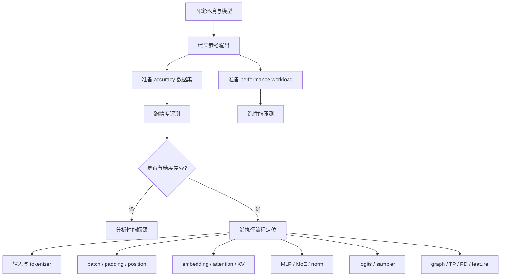
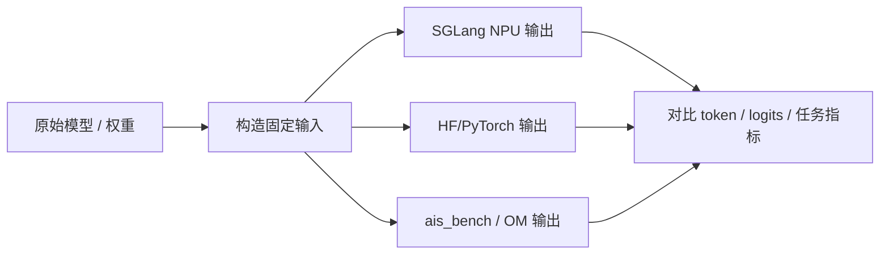
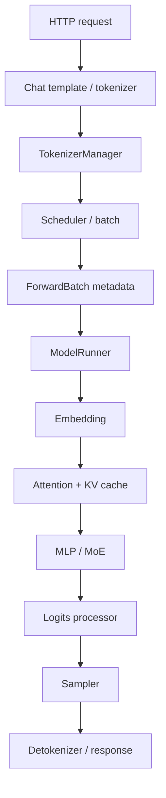

# 14. 模型精度与性能测试，以及精度问题定位

本讲面向已经能在 Ascend NPU 上跑通 SGLang 服务的开发者。目标不是只会发一条请求，而是建立一套可复现的测试方法：同一个模型、同一份数据、同一组启动参数，能够稳定比较不同后端、不同优化开关、不同 kernel 或不同部署形态的精度与性能差异。

这一讲尤其关注精度问题定位。性能问题通常可以从 profiler timeline 里看到“慢在哪里”，精度问题更麻烦：它可能来自 tokenizer、chat template、dtype、attention mask、KV cache、graph replay、采样、量化、LoRA、MoE、TP 通信、PD KV transfer 等任何一环。定位时最重要的是沿着模型执行流程逐层缩小范围，而不是一上来怀疑某个 kernel。

## 目标图



## 0. 测试原则

### 0.1 先定义“精度”

LLM serving 里的“精度问题”不只是一种现象。测试前要先说明你在比较什么：

| 类型 | 典型指标 | 适合场景 |
|---|---|---|
| Logits 级一致性 | max abs diff、mean abs diff、top-k overlap | kernel、dtype、graph、TP、attention 问题定位。 |
| Token 级一致性 | greedy token 是否一致、首个分叉 token | SGLang 端到端链路、KV cache、sampler 定位。 |
| 任务级准确率 | exact match、F1、choice accuracy、pass@k | MMLU、CEval、GSM8K、HumanEval 等数据集。 |
| 文本质量 | win rate、人工评审、LLM-as-judge | 聊天、摘要、长文本生成。 |
| 服务正确性 | HTTP 成功率、schema、stream chunk 完整性 | serving、router、PD、并发。 |

对于 SGLang-NPU 开发，建议使用三层精度标准：

1. **端到端任务精度**：证明模型服务没有明显退化。
2. **固定 prompt greedy token 一致性**：定位哪条请求开始分叉。
3. **中间 tensor / logits 对比**：定位具体模块、kernel 或 graph 分支。

### 0.2 先固定变量

精度测试必须先去掉随机性：

```bash
export WORKSPACE=/workspace/sglang-npu
export MODEL_ROOT=$WORKSPACE/models
export LOG_ROOT=$WORKSPACE/logs
export EVAL_ROOT=$WORKSPACE/eval
mkdir -p "$LOG_ROOT/accuracy" "$LOG_ROOT/perf" "$EVAL_ROOT"/{datasets,outputs,reports,scripts}
```

请求侧固定：

```json
{
  "temperature": 0,
  "top_p": 1,
  "max_tokens": 128,
  "stream": false
}
```

服务侧固定：

- 固定模型目录，不用在线模型名做正式评测。
- 固定 `--dtype`、`--tp-size`、`--attention-backend ascend`。
- 先关闭 LoRA、量化、speculative decoding、PD、HiCache 等额外特性。
- 先单卡 eager 或最少优化开关跑通，再逐步打开 graph、TP、PD、量化。

### 0.3 推荐基线矩阵

一套完整测试至少保留三类 baseline：

| Baseline | 用途 | 启动建议 |
|---|---|---|
| HF / PyTorch reference | 判断模型和 tokenizer 本身是否正常 | 离线脚本，单条 prompt，greedy。 |
| SGLang CPU/GPU 或已知正确版本 | 判断 NPU 分支是否引入差异 | 同模型、同请求参数。 |
| SGLang NPU eager baseline | 判断 graph、kernel fusion、TP、PD 是否引入差异 | 先加 `--disable-cuda-graph`。 |

注意：`--disable-cuda-graph` 在 SGLang 参数名里沿用 CUDA 术语，在 NPU 上可以用于关闭 NPU graph 路径，帮助把 graph replay 问题从普通 forward 问题中分离出来。

## 1. 测试目录和脚本框架

建议把所有评测脚本都放在个人目录映射后的 workspace 内：

```bash
mkdir -p "$EVAL_ROOT/scripts" "$EVAL_ROOT/datasets" "$EVAL_ROOT/outputs" "$EVAL_ROOT/reports"
```

公共配置：

```bash
cat > "$EVAL_ROOT/scripts/env.sh" <<'SH'
#!/usr/bin/env bash
set -euo pipefail

export WORKSPACE=${WORKSPACE:-/workspace/sglang-npu}
export MODEL_ROOT=${MODEL_ROOT:-$WORKSPACE/models}
export LOG_ROOT=${LOG_ROOT:-$WORKSPACE/logs}
export EVAL_ROOT=${EVAL_ROOT:-$WORKSPACE/eval}
export MODEL_PATH=${MODEL_PATH:-$MODEL_ROOT/Qwen2.5-7B-Instruct}
export MODEL_ID=${MODEL_ID:-$(basename "$MODEL_PATH")}
export BASE_URL=${BASE_URL:-http://127.0.0.1:8000}

mkdir -p "$LOG_ROOT/accuracy" "$LOG_ROOT/perf" "$EVAL_ROOT"/{datasets,outputs,reports}
SH

chmod +x "$EVAL_ROOT/scripts/env.sh"
```

最小请求探针：

```bash
cat > "$EVAL_ROOT/scripts/probe_openai.sh" <<'SH'
#!/usr/bin/env bash
set -euo pipefail

SCRIPT_DIR=$(cd "$(dirname "${BASH_SOURCE[0]}")" && pwd)
source "$SCRIPT_DIR/env.sh"

curl "$BASE_URL/v1/chat/completions" \
  -H "Content-Type: application/json" \
  -d "{
    \"model\": \"$MODEL_ID\",
    \"messages\": [{\"role\": \"user\", \"content\": \"只输出数字 42。\"}],
    \"temperature\": 0,
    \"max_tokens\": 8
  }" | tee "$LOG_ROOT/accuracy/probe.json"
SH

chmod +x "$EVAL_ROOT/scripts/probe_openai.sh"
bash "$EVAL_ROOT/scripts/probe_openai.sh"
```

## 2. 性能测试怎么做

### 2.1 性能指标

SGLang serving 场景至少记录这些指标：

| 指标 | 含义 | 常见影响因素 |
|---|---|---|
| QPS | 每秒完成请求数 | 并发、batching、模型大小、graph 命中。 |
| input tokens/s | prefill 吞吐 | attention prefill、chunked prefill、KV 写入。 |
| output tokens/s | decode 吞吐 | decode attention、sampler、graph replay。 |
| TTFT | time to first token | prefill、排队、router、PD transfer。 |
| ITL | inter-token latency | decode kernel、batch size、graph、通信。 |
| P50/P95/P99 latency | 延迟分布 | 调度、抖动、GC、内存、HCCL、worker 不均。 |
| error rate | 请求失败率 | OOM、timeout、router、PD、网络。 |

性能结论必须带上 workload 参数，例如 prompt 长度、输出长度、并发、request rate、streaming、模型 dtype、TP size。没有 workload 的 tokens/s 没有可比性。

### 2.2 OpenAI 接口压测脚本

下面脚本不依赖额外 benchmark 工具，直接打 SGLang OpenAI-compatible API，适合先建立服务性能 baseline：

```bash
cat > "$EVAL_ROOT/scripts/bench_openai_basic.py" <<'PY'
import argparse
import concurrent.futures
import json
import statistics
import time
import urllib.request


def post(url, model, prompt, max_tokens, timeout):
    payload = {
        "model": model,
        "messages": [{"role": "user", "content": prompt}],
        "temperature": 0,
        "max_tokens": max_tokens,
        "stream": False,
    }
    req = urllib.request.Request(
        url,
        data=json.dumps(payload).encode("utf-8"),
        headers={"Content-Type": "application/json"},
        method="POST",
    )
    start = time.perf_counter()
    try:
        with urllib.request.urlopen(req, timeout=timeout) as resp:
            data = json.loads(resp.read().decode("utf-8"))
        latency = time.perf_counter() - start
        usage = data.get("usage", {})
        return {
            "ok": True,
            "latency_s": latency,
            "prompt_tokens": usage.get("prompt_tokens"),
            "completion_tokens": usage.get("completion_tokens"),
            "total_tokens": usage.get("total_tokens"),
        }
    except Exception as exc:
        return {"ok": False, "latency_s": time.perf_counter() - start, "error": repr(exc)}


def percentile(values, p):
    if not values:
        return None
    ordered = sorted(values)
    idx = min(len(ordered) - 1, max(0, int(len(ordered) * p) - 1))
    return ordered[idx]


def main():
    parser = argparse.ArgumentParser()
    parser.add_argument("--base-url", default="http://127.0.0.1:8000")
    parser.add_argument("--model", required=True)
    parser.add_argument("--num-prompts", type=int, default=64)
    parser.add_argument("--concurrency", type=int, default=4)
    parser.add_argument("--input-repeat", type=int, default=256)
    parser.add_argument("--max-tokens", type=int, default=128)
    parser.add_argument("--output", required=True)
    parser.add_argument("--timeout", type=int, default=300)
    args = parser.parse_args()

    url = args.base_url.rstrip("/") + "/v1/chat/completions"
    prompt = " ".join(["请解释 Ascend NPU 上大模型推理的关键性能路径。"] * args.input_repeat)
    results = []
    start_all = time.perf_counter()

    with concurrent.futures.ThreadPoolExecutor(max_workers=args.concurrency) as pool:
        futures = [
            pool.submit(post, url, args.model, prompt, args.max_tokens, args.timeout)
            for _ in range(args.num_prompts)
        ]
        for future in concurrent.futures.as_completed(futures):
            row = future.result()
            results.append(row)
            print(json.dumps(row, ensure_ascii=False), flush=True)

    elapsed = time.perf_counter() - start_all
    ok_rows = [r for r in results if r["ok"]]
    latencies = [r["latency_s"] for r in ok_rows]
    total_prompt = sum(r.get("prompt_tokens") or 0 for r in ok_rows)
    total_completion = sum(r.get("completion_tokens") or 0 for r in ok_rows)

    summary = {
        "num_prompts": args.num_prompts,
        "ok": len(ok_rows),
        "failed": len(results) - len(ok_rows),
        "elapsed_s": elapsed,
        "qps": len(ok_rows) / elapsed if elapsed else None,
        "p50_latency_s": statistics.median(latencies) if latencies else None,
        "p95_latency_s": percentile(latencies, 0.95),
        "p99_latency_s": percentile(latencies, 0.99),
        "input_tokens_per_s": total_prompt / elapsed if elapsed else None,
        "output_tokens_per_s": total_completion / elapsed if elapsed else None,
        "total_tokens_per_s": (total_prompt + total_completion) / elapsed if elapsed else None,
    }

    with open(args.output, "w", encoding="utf-8") as f:
        json.dump({"summary": summary, "results": results}, f, ensure_ascii=False, indent=2)
    print(json.dumps({"summary": summary}, ensure_ascii=False, indent=2))


if __name__ == "__main__":
    main()
PY
```

运行：

```bash
source "$EVAL_ROOT/scripts/env.sh"
python3 "$EVAL_ROOT/scripts/bench_openai_basic.py" \
  --base-url "$BASE_URL" \
  --model "$MODEL_ID" \
  --num-prompts 128 \
  --concurrency 8 \
  --input-repeat 512 \
  --max-tokens 128 \
  --output "$EVAL_ROOT/reports/perf-openai-c8.json" \
  2>&1 | tee "$LOG_ROOT/perf/perf-openai-c8.log"
```

建议至少跑四组：

| 场景 | 参数 |
|---|---|
| 短输入短输出 | `--input-repeat 32 --max-tokens 32` |
| 长输入短输出 | `--input-repeat 1024 --max-tokens 32` |
| 短输入长输出 | `--input-repeat 32 --max-tokens 512` |
| 长输入长输出 | `--input-repeat 1024 --max-tokens 512` |

这样可以把 prefill-heavy 和 decode-heavy 分开看。长输入慢，多半先看 attention prefill、chunked prefill、KV cache 写入；长输出慢，多半先看 decode graph、decode attention、sampler 和 batch 调度。

### 2.3 PD 分离性能测试

PD 分离不能直接压 prefill 或 decode server，要压 router：

```bash
export BASE_URL=http://127.0.0.1:8000
export MODEL_ID=Qwen2.5-7B-Instruct

python3 "$EVAL_ROOT/scripts/bench_openai_basic.py" \
  --base-url "$BASE_URL" \
  --model "$MODEL_ID" \
  --num-prompts 128 \
  --concurrency 8 \
  --input-repeat 1024 \
  --max-tokens 128 \
  --output "$EVAL_ROOT/reports/perf-pd-router-c8.json"
```

PD 性能报告需要同时附上：

- router 日志：请求是否均匀进入 worker，是否有 timeout 或 upstream error。
- prefill 日志：prefill batch、bootstrap port、KV 发送是否正常。
- decode 日志：KV 接收、decode batch、持续输出是否正常。
- `ASCEND_MF_STORE_URL` 和 `ASCEND_MF_TRANSFER_PROTOCOL`。

## 3. 精度测试怎么做

### 3.1 固定样例集

先做一个小而稳定的 smoke dataset：

```bash
cat > "$EVAL_ROOT/datasets/smoke_qa.jsonl" <<'JSONL'
{"id":"math-001","prompt":"请只输出 2+3 的结果，不要解释。","expect":"5"}
{"id":"fact-001","prompt":"中国的首都是哪里？只输出城市名。","expect":"北京"}
{"id":"format-001","prompt":"请输出 JSON：{\"ok\": true}，不要输出其他内容。","expect":"{\"ok\": true}"}
{"id":"reason-001","prompt":"小明有 3 个苹果，又买了 4 个，一共几个？只输出数字。","expect":"7"}
JSONL
```

端到端精度脚本：

```bash
cat > "$EVAL_ROOT/scripts/eval_jsonl_openai.py" <<'PY'
import argparse
import json
import re
import time
import urllib.request


def normalize(text):
    text = text.strip()
    text = re.sub(r"\s+", "", text)
    return text


def call(base_url, model, prompt, max_tokens):
    payload = {
        "model": model,
        "messages": [{"role": "user", "content": prompt}],
        "temperature": 0,
        "top_p": 1,
        "max_tokens": max_tokens,
        "stream": False,
    }
    req = urllib.request.Request(
        base_url.rstrip("/") + "/v1/chat/completions",
        data=json.dumps(payload).encode("utf-8"),
        headers={"Content-Type": "application/json"},
        method="POST",
    )
    start = time.perf_counter()
    with urllib.request.urlopen(req, timeout=300) as resp:
        data = json.loads(resp.read().decode("utf-8"))
    latency = time.perf_counter() - start
    content = data["choices"][0]["message"]["content"]
    return content, data.get("usage", {}), latency


def main():
    parser = argparse.ArgumentParser()
    parser.add_argument("--base-url", default="http://127.0.0.1:8000")
    parser.add_argument("--model", required=True)
    parser.add_argument("--input", required=True)
    parser.add_argument("--output", required=True)
    parser.add_argument("--max-tokens", type=int, default=128)
    args = parser.parse_args()

    total = 0
    correct = 0
    with open(args.input, encoding="utf-8") as fin, open(args.output, "w", encoding="utf-8") as fout:
        for line in fin:
            row = json.loads(line)
            total += 1
            try:
                pred, usage, latency = call(args.base_url, args.model, row["prompt"], args.max_tokens)
                ok = normalize(pred) == normalize(row["expect"])
                correct += int(ok)
                out = {
                    "id": row["id"],
                    "ok": ok,
                    "prompt": row["prompt"],
                    "expect": row["expect"],
                    "pred": pred,
                    "usage": usage,
                    "latency_s": latency,
                }
            except Exception as exc:
                out = {"id": row.get("id"), "ok": False, "error": repr(exc)}
            fout.write(json.dumps(out, ensure_ascii=False) + "\n")
            fout.flush()
            print(json.dumps(out, ensure_ascii=False), flush=True)

    print(json.dumps({"total": total, "correct": correct, "accuracy": correct / total if total else 0}, ensure_ascii=False))


if __name__ == "__main__":
    main()
PY
```

运行：

```bash
source "$EVAL_ROOT/scripts/env.sh"
python3 "$EVAL_ROOT/scripts/eval_jsonl_openai.py" \
  --base-url "$BASE_URL" \
  --model "$MODEL_ID" \
  --input "$EVAL_ROOT/datasets/smoke_qa.jsonl" \
  --output "$EVAL_ROOT/reports/accuracy-smoke.jsonl" \
  2>&1 | tee "$LOG_ROOT/accuracy/accuracy-smoke.log"
```

### 3.2 数据集评测建议

正式精度评测建议按能力拆分：

| 能力 | 数据集示例 | 指标 |
|---|---|---|
| 选择题知识 | MMLU、CEval、CMMLU | choice accuracy |
| 数学推理 | GSM8K、MATH 子集 | exact match |
| 代码 | HumanEval、MBPP | pass@1 / pass@k |
| 长上下文 | LongBench、needle-in-a-haystack | exact match / retrieval accuracy |
| 中文问答 | CMMLU、C-Eval、内部 QA 集 | exact match / F1 |
| 服务稳定性 | 自建 JSONL prompts | success rate / schema correctness |

对于 SGLang-NPU 开发，任务级数据集主要用于判断“有没有整体退化”。一旦发现退化，不能只看最终 accuracy，需要回到固定 prompt、token 一致性和 logits 对比。

### 3.3 ais_bench 的角色

`ais_bench` 常用于 Ascend 生态里的离线模型推理性能/精度测试，尤其是 OM 模型、ATC 转换后的模型、纯 Ascend 推理链路。它和 SGLang serving 的关系要分清：

- SGLang 是在线 LLM serving runtime，核心入口是 HTTP/OpenAI API、scheduler、KV cache、continuous batching。
- `ais_bench` 更适合作为 Ascend 离线推理工具，验证模型转换、离线算子链路、纯模型输入输出性能。
- 如果你在定位“是模型/算子本身错，还是 SGLang serving 链路错”，`ais_bench` 可以作为第三方参考路径。

典型使用流程：



安装位置仍然建议放在个人环境：

```bash
python3 -m venv "$WORKSPACE/venvs/aisbench"
source "$WORKSPACE/venvs/aisbench/bin/activate"
python3 -m pip install -U pip
python3 -m pip install ais_bench
```

常见离线推理命令形态如下，具体参数以当前安装版本 `python3 -m ais_bench --help` 或 `ais_bench --help` 为准：

```bash
python3 -m ais_bench \
  --model "$EVAL_ROOT/om/model.om" \
  --input "$EVAL_ROOT/aisbench/input" \
  --output "$EVAL_ROOT/aisbench/output" \
  --batchsize 1
```

用 `ais_bench` 时要特别注意：

- 输入 tensor 的 dtype、shape、layout 必须和 OM 模型一致。
- LLM 的 tokenizer、position ids、attention mask、past KV 并不总是能自然映射到单次离线 OM 推理。
- `ais_bench` 的结果更适合定位底层模型/算子链路，不应直接替代 SGLang 端到端 serving 精度评测。
- 如果 SGLang 和 HF 一致，但 `ais_bench` 不一致，优先检查 OM 转换、输入预处理和 layout。
- 如果 HF 和 `ais_bench` 一致，但 SGLang 不一致，优先检查 SGLang 的 tokenizer、batch、KV cache、attention backend、graph 或 sampler。

## 4. 精度问题定位总流程

### 4.1 二分定位矩阵

遇到精度问题，先用开关组合做二分：

| 对比 | 如果差异消失 | 下一步 |
|---|---|---|
| NPU graph on vs `--disable-cuda-graph` | graph 相关 | 查 capture shape、replay 输入地址、static buffer。 |
| TP 多卡 vs 单卡 | 通信/切分相关 | 查 weight partition、rank 映射、HCCL、reduce。 |
| PD vs 普通 serving | KV transfer 相关 | 查 prefill/decode KV 一致性、bootstrap、transfer backend。 |
| 量化 vs 非量化 | quant kernel/scale 相关 | 查 scale、zero point、group size、dtype。 |
| LoRA on vs off | LoRA backend 相关 | 查 adapter id、rank、segment、sgmv 输入。 |
| MoE on vs dense 小模型 | expert routing 相关 | 查 top-k、expert map、combine。 |
| streaming vs non-streaming | 输出协议或 sampler 状态 | 查增量输出、finish reason、stop string。 |

### 4.2 沿 SGLang 执行流程定位

下面是推荐顺序。越靠前的问题越容易造成“看起来像模型不准”，但其实还没进入模型计算。



#### 4.2.1 请求与 chat template

常见问题：

- 服务端和 baseline 使用不同 chat template。
- system prompt、BOS/EOS、assistant prefix 不一致。
- `max_tokens`、stop words、temperature、top_p 不一致。
- 多轮对话格式和单轮 prompt 格式混用。

定位方法：

1. 打印或保存最终送入 tokenizer 的 prompt 文本。
2. 对比 HF reference 和 SGLang 的 token ids。
3. 把复杂 chat 请求降级成纯 prompt completion 或单轮 chat。

判断标准：如果 token ids 不一致，后面的模型输出不一致是正常的，先修输入。

#### 4.2.2 TokenizerManager 与 detokenizer

常见问题：

- tokenizer 文件版本不一致。
- added tokens、special tokens、chat template 文件没有随模型目录一起拷贝。
- 中文空格、换行、JSON 标点被 normalize 脚本误判。
- streaming chunk 拼接时丢 token 或重复 token。

定位方法：

```bash
curl "$BASE_URL/v1/tokenize" \
  -H "Content-Type: application/json" \
  -d "{\"model\":\"$MODEL_ID\",\"text\":\"请只输出数字 42。\"}"
```

如果服务支持 tokenize/detokenize 接口，先验证：

- 同一文本 tokenize 后 token ids 是否和 HF tokenizer 一致。
- token ids detokenize 后是否能还原。
- stream 和 non-stream 最终文本是否一致。

#### 4.2.3 Scheduler、batch、padding、position

常见问题：

- 单请求正确，并发 batch 后错误。
- 短 prompt 正确，长 prompt 错误。
- prefill 正确，decode 若干步后分叉。
- padding side、position ids、seq len、request merge/split metadata 错。

定位方法：

1. 单请求、并发 1 跑通。
2. 并发 2，构造一长一短两个 prompt。
3. 并发 N，观察是否只有混 batch 时错误。
4. 记录每个请求的 prompt token 长度、生成长度、首个分叉 token。

如果单请求正确、batch 后错误，优先看 `ScheduleBatch`、`ForwardBatch`、attention metadata、position ids 和 KV cache index。

#### 4.2.4 Embedding 与输入 dtype

常见问题：

- input ids dtype 或 device 不一致。
- embedding weight 加载不完整。
- TP 下 vocab parallel 切分或 gather 错误。
- 模型权重 dtype 和运行 dtype 不符合预期。

定位方法：

- 对同一批 `input_ids` 比较 embedding 输出。
- 先用极短 prompt，减少 attention 和 KV cache 干扰。
- 单卡正常、TP 异常时，重点看 vocab parallel 和 rank 切分。

#### 4.2.5 Attention 与 KV cache

这是 NPU 精度问题最高发区域之一。

常见问题：

- prefill attention mask 或 causal mask 错。
- page size、KV cache index、slot mapping 错。
- KV cache layout 与 Ascend attention kernel 预期不一致。
- dtype 或 format cast 导致误差放大。
- decode 使用了错误历史 KV。
- 长上下文或 chunked prefill 边界处错误。

定位方法：

| 现象 | 优先检查 |
|---|---|
| 首 token 就错 | prefill attention、position ids、mask、prompt tokens。 |
| 生成几步后错 | decode KV cache 读写、slot mapping、sampler。 |
| 长 prompt 才错 | chunked prefill、page table、position offset。 |
| batch 后错 | per-request seq len、padding、KV index。 |
| graph on 才错 | graph capture/replay 的 static input 与 KV buffer。 |

推荐二分：

1. 短 prompt vs 长 prompt。
2. batch 1 vs batch N。
3. `--disable-cuda-graph` vs graph on。
4. `--attention-backend ascend` 与可用 reference backend 对比。
5. prefill logits 与 decode 每步 logits 分开比较。

#### 4.2.6 MLP、Norm、Activation

常见问题：

- fused kernel 与 unfused PyTorch 路径误差不同。
- RMSNorm/LayerNorm epsilon 不一致。
- activation 近似实现差异。
- dtype 从 fp16/bf16 切换后误差放大。

定位方法：

- 用一层或少层模型做模块级输出对比。
- 关闭可关闭的 fusion 或 graph。
- 对比每层 hidden states 的 diff，找到误差突然放大的层。

判断方法：如果误差从某一层开始明显放大，问题通常在该层或上一层输出进入该层的 layout/dtype。

#### 4.2.7 MoE

MoE 的精度问题通常不是“整体随机错”，而是 expert routing 或 combine 出错。

常见问题：

- top-k expert id 不一致。
- expert 权重切分或加载错。
- shared expert 与 routed expert stream 同步问题。
- combine weight、permute/unpermute 错。
- EP/TP 组合下 expert map 不一致。

定位方法：

1. 记录 top-k expert ids 和 scores。
2. 对比 routed expert 输出、shared expert 输出。
3. 禁用或绕过某些融合路径，确认是 routing 还是 expert compute。
4. 单 batch 单 token 先跑，再扩展到 batch N。

#### 4.2.8 Logits processor 与 sampler

常见问题：

- temperature、top_p、top_k、repetition penalty 不一致。
- stop token、EOS token 配置不同。
- logits dtype 或 vocab size 处理错误。
- greedy 下 argmax token 因微小 diff 翻转。

定位方法：

- 先固定 `temperature=0`。
- 保存每步 top-10 token 及 logits。
- 如果 top-1 不同但 top-2 差距极小，这是数值误差敏感区；继续看任务级影响。
- 如果 top-k 排序大范围不同，回到 attention/MLP/logits processor。

#### 4.2.9 NPU graph

常见问题：

- capture 的 shape 与 replay 的实际请求不一致。
- static buffer 地址复用错误。
- graph replay 时某些 metadata 没更新。
- warmup 和实际 batch 的路径不同。

定位方法：

1. 加 `--disable-cuda-graph`，如果恢复正常，问题集中在 graph。
2. 固定 batch size 和 seq len，确认是否 shape 相关。
3. 检查 graph capture 日志，看错误请求是否命中同一个 graph。
4. 对比 graph 前后的 logits 或 hidden states。

#### 4.2.10 TP / HCCL

常见问题：

- rank 到 device 映射错。
- tensor parallel 权重切分错。
- all-reduce/all-gather/reduce-scatter dtype 或 shape 错。
- HCCL 通信未完成就读取结果。

定位方法：

- 单卡和 TP2 对比。
- TP2 和 TP4 对比。
- 小 batch、小 prompt 先复现。
- 检查每个 rank 的日志、显存、通信初始化。
- 对比每层 all-reduce 前后 tensor 统计量。

#### 4.2.11 PD 分离

常见问题：

- prefill 生成的 KV 与 decode 读取的 KV 不一致。
- bootstrap port、store URL、transfer protocol 配置不一致。
- router 把请求送到了错误 worker。
- prefill/decode 模型版本或 tokenizer 版本不一致。
- 多机时间、网络、防火墙、RDMA 配置导致传输异常。

定位方法：

1. 同模型普通 serving 正确，再测 PD。
2. prefill/decode 分别查 `/server_info`，确认模型路径、disaggregation mode。
3. 功能请求打 router，不直接打 prefill/decode。
4. 对同一 prompt 比较普通 serving 与 PD 的首个分叉 token。
5. 如果首 token 正确、后续错误，重点看 decode 接收 KV 后的 cache index。

## 5. Logits 和 token 对比实践

端到端任务 accuracy 只能告诉你“错了”，不能告诉你“哪里错”。真正定位时建议输出每步 token。

### 5.1 固定 prompt 输出对比

创建一组定位 prompt：

```bash
cat > "$EVAL_ROOT/datasets/debug_prompts.jsonl" <<'JSONL'
{"id":"short","prompt":"只输出 A。"}
{"id":"math","prompt":"请一步一步思考：17 加 28 等于多少？最后只输出答案。"}
{"id":"long","prompt":"请阅读下面重复文本并回答最后的问题。苹果 香蕉 橘子 葡萄 苹果 香蕉 橘子 葡萄 苹果 香蕉 橘子 葡萄。问题：文本中出现了哪四种水果？"}
JSONL
```

运行两个服务，例如：

- reference：`http://127.0.0.1:8000`
- candidate：`http://127.0.0.1:8001`

对比脚本：

```bash
cat > "$EVAL_ROOT/scripts/compare_two_servers.py" <<'PY'
import argparse
import json
import urllib.request


def call(base_url, model, prompt, max_tokens):
    payload = {
        "model": model,
        "messages": [{"role": "user", "content": prompt}],
        "temperature": 0,
        "max_tokens": max_tokens,
        "stream": False,
    }
    req = urllib.request.Request(
        base_url.rstrip("/") + "/v1/chat/completions",
        data=json.dumps(payload).encode("utf-8"),
        headers={"Content-Type": "application/json"},
        method="POST",
    )
    with urllib.request.urlopen(req, timeout=300) as resp:
        data = json.loads(resp.read().decode("utf-8"))
    return data["choices"][0]["message"]["content"], data.get("usage", {})


def first_diff(a, b):
    for i, (ca, cb) in enumerate(zip(a, b)):
        if ca != cb:
            return i
    return None if len(a) == len(b) else min(len(a), len(b))


def main():
    parser = argparse.ArgumentParser()
    parser.add_argument("--ref-url", required=True)
    parser.add_argument("--cand-url", required=True)
    parser.add_argument("--model", required=True)
    parser.add_argument("--input", required=True)
    parser.add_argument("--output", required=True)
    parser.add_argument("--max-tokens", type=int, default=128)
    args = parser.parse_args()

    with open(args.input, encoding="utf-8") as fin, open(args.output, "w", encoding="utf-8") as fout:
        for line in fin:
            row = json.loads(line)
            ref, ref_usage = call(args.ref_url, args.model, row["prompt"], args.max_tokens)
            cand, cand_usage = call(args.cand_url, args.model, row["prompt"], args.max_tokens)
            out = {
                "id": row["id"],
                "same_text": ref == cand,
                "first_char_diff": first_diff(ref, cand),
                "ref": ref,
                "cand": cand,
                "ref_usage": ref_usage,
                "cand_usage": cand_usage,
            }
            fout.write(json.dumps(out, ensure_ascii=False) + "\n")
            print(json.dumps(out, ensure_ascii=False), flush=True)


if __name__ == "__main__":
    main()
PY
```

运行：

```bash
python3 "$EVAL_ROOT/scripts/compare_two_servers.py" \
  --ref-url http://127.0.0.1:8000 \
  --cand-url http://127.0.0.1:8001 \
  --model "$MODEL_ID" \
  --input "$EVAL_ROOT/datasets/debug_prompts.jsonl" \
  --output "$EVAL_ROOT/reports/compare-ref-candidate.jsonl"
```

如果两边输出一开始就不同，先查 tokenizer/chat template/prefill。若前半段一致、后面分叉，优先查 decode KV cache、graph 或 sampler。

## 6. 性能与精度联合分析

很多优化会同时影响性能和精度，因此报告里要把两者放在同一张表里：

| 实验 | accuracy | output tok/s | TTFT | P95 latency | 结论 |
|---|---:|---:|---:|---:|---|
| eager baseline | 0.812 | 420 | 0.82s | 4.1s | 参考。 |
| graph on | 0.812 | 610 | 0.71s | 3.0s | 可接受。 |
| new attention kernel | 0.806 | 690 | 0.68s | 2.8s | 有精度回退，需定位。 |
| TP4 | 0.812 | 1180 | 0.92s | 3.3s | 吞吐提升，TTFT 变高。 |

判断原则：

- 性能提升但任务精度下降，不能合入，除非明确是可接受近似且有产品签字。
- token 级偶发分叉不一定等于任务精度下降，但必须解释原因。
- logits diff 在低精度 dtype 下允许有小误差，但 top-k 排名大范围变化要继续定位。
- 只报平均延迟不够，P95/P99 才能反映 serving 稳定性。

## 7. 精度问题报告模板

```markdown
## 问题现象

- 模型：
- SGLang commit：
- sglang-kernel-npu commit：
- CANN / torch_npu：
- 启动参数：
- 复现 prompt / dataset：
- reference：
- candidate：

## 精度差异

- 任务指标：
- 首个分叉样例：
- 首个分叉 token / 文本位置：
- logits diff：

## 二分结果

| 开关 | 结果 |
|---|---|
| graph off |  |
| TP=1 |  |
| PD off |  |
| quant off |  |
| LoRA off |  |

## 初步定位

- 疑似阶段：
- 相关源码：
- 相关日志：
- 下一步实验：
```

## 8. 常见现象速查表

| 现象 | 优先怀疑 | 下一步 |
|---|---|---|
| 输出语言或格式完全不对 | chat template / tokenizer | 对比 token ids。 |
| 单请求正确，并发错误 | batch metadata / KV index | 并发 1、2、N 二分。 |
| 短 prompt 正确，长 prompt 错 | chunked prefill / position / page table | 改 prompt 长度二分。 |
| graph off 正确，graph on 错 | NPU graph replay | 查 capture shape 和 static buffer。 |
| 单卡正确，TP 错 | weight partition / HCCL | TP1、TP2、TP4 对比。 |
| 普通 serving 正确，PD 错 | KV transfer / router | 查 prefill/decode/server_info。 |
| 非量化正确，量化错 | scale / group / quant kernel | 对比反量化路径。 |
| LoRA off 正确，LoRA on 错 | adapter map / sgmv | 查 LoRA batch info。 |
| MoE 模型部分样例错 | expert routing | 记录 top-k expert。 |
| 文本末尾异常截断 | stop / EOS / max_tokens | 查 finish_reason。 |

## 本讲小结

SGLang-NPU 的精度和性能测试要分层做：先固定输入、模型和启动参数，再用 OpenAI 接口建立端到端 baseline；如果出现精度差异，先用 graph、TP、PD、量化、LoRA 等开关二分，再沿 `request -> tokenizer -> scheduler -> ForwardBatch -> ModelRunner -> attention/KV -> logits -> sampler` 的执行流程定位。`ais_bench` 可以作为 Ascend 离线推理参考工具，但不能替代 SGLang serving 端到端评测。一个合格的优化结论必须同时给出精度指标、性能指标、复现脚本和问题定位证据。
