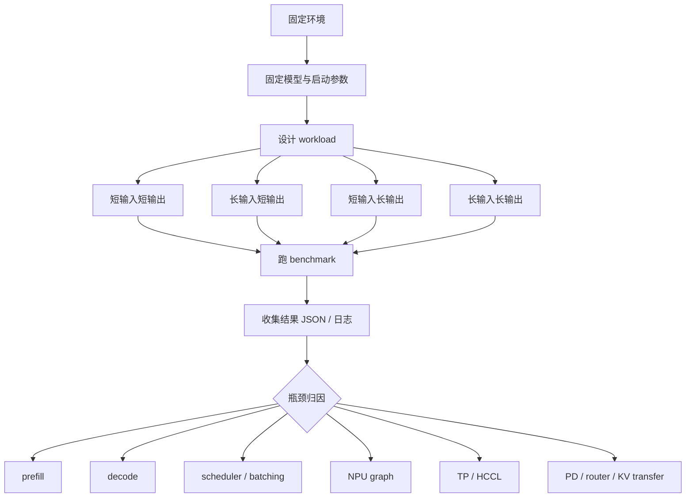

# 14. SGLang Ascend NPU 性能测试

本讲专门讲性能测试。它回答三个问题：

1. 应该用什么 workload 衡量 SGLang-NPU 的推理性能？
2. 如何用可复现脚本跑单卡、多卡、PD 分离、在线服务等场景？
3. 拿到结果后，如何判断瓶颈在 prefill、decode、调度、graph、通信、router 还是 KV transfer？

性能测试不要和精度测试混在一起做。性能测试关注吞吐、延迟、稳定性和资源利用率；精度测试关注输出是否正确。一个优化 PR 至少要证明“性能变好且精度不退化”，但这两个证明过程应该分开设计。

## 目标图



## 0. 性能测试原则

### 0.1 先固定测试环境

所有脚本仍然放在个人目录映射后的 workspace，不写系统目录，不污染其他人的环境：

```bash
export WORKSPACE=/workspace/sglang-npu
export MODEL_ROOT=$WORKSPACE/models
export LOG_ROOT=$WORKSPACE/logs
export PERF_ROOT=$WORKSPACE/perf
mkdir -p "$LOG_ROOT/perf" "$PERF_ROOT"/{scripts,reports,workloads}
```

公共配置脚本：

```bash
cat > "$PERF_ROOT/scripts/env.sh" <<'SH'
#!/usr/bin/env bash
set -euo pipefail

export WORKSPACE=${WORKSPACE:-/workspace/sglang-npu}
export MODEL_ROOT=${MODEL_ROOT:-$WORKSPACE/models}
export LOG_ROOT=${LOG_ROOT:-$WORKSPACE/logs}
export PERF_ROOT=${PERF_ROOT:-$WORKSPACE/perf}
export MODEL_PATH=${MODEL_PATH:-$MODEL_ROOT/Qwen2.5-7B-Instruct}
export MODEL_ID=${MODEL_ID:-$(basename "$MODEL_PATH")}
export BASE_URL=${BASE_URL:-http://127.0.0.1:8000}

mkdir -p "$LOG_ROOT/perf" "$PERF_ROOT"/{scripts,reports,workloads}
SH

chmod +x "$PERF_ROOT/scripts/env.sh"
```

### 0.2 必须记录的上下文

任何性能结果都必须带上下文，否则无法比较：

| 类别 | 必须记录 |
|---|---|
| 代码版本 | SGLang commit、sglang-kernel-npu commit、镜像 tag。 |
| 环境版本 | CANN、driver、firmware、torch、torch_npu、Python。 |
| 模型 | 模型路径、参数规模、dtype、量化方式。 |
| 启动参数 | `--device npu`、`--attention-backend ascend`、`--tp-size`、graph、chunked prefill、PD 参数。 |
| workload | prompt 长度、输出长度、并发、request rate、请求数、streaming。 |
| 结果 | QPS、input tokens/s、output tokens/s、TTFT、ITL、P50/P95/P99、error rate。 |

建议每次压测前保存服务启动命令：

```bash
ps -ef | grep -E "sglang serve|sgl-router" | grep -v grep | tee "$LOG_ROOT/perf/processes.txt"
```

### 0.3 性能指标解释

| 指标 | 含义 | 优先关联路径 |
|---|---|---|
| QPS | 每秒完成请求数 | 调度、batching、服务总体容量。 |
| input tokens/s | 每秒处理输入 token | prefill attention、chunked prefill、KV 写入。 |
| output tokens/s | 每秒生成输出 token | decode attention、NPU graph、sampler。 |
| TTFT | 首 token 延迟 | 排队、prefill、router、PD transfer。 |
| ITL | token 间延迟 | decode kernel、graph replay、batch 稳定性。 |
| P95/P99 latency | 尾延迟 | 抖动、OOM retry、HCCL、router upstream timeout。 |
| error rate | 请求失败率 | OOM、timeout、worker crash、router 状态。 |

短输入短输出主要看 serving overhead；长输入短输出主要看 prefill；短输入长输出主要看 decode；长输入长输出会同时放大 prefill 和 decode。

## 1. 启动性能测试服务

### 1.1 单卡 baseline

```bash
source "$PERF_ROOT/scripts/env.sh"

sglang serve \
  --model-path "$MODEL_PATH" \
  --host 0.0.0.0 \
  --port 8000 \
  --device npu \
  --attention-backend ascend \
  --base-gpu-id 0 \
  --tp-size 1 \
  2>&1 | tee "$LOG_ROOT/perf/server-single.log"
```

第一次跑性能时建议先关 graph 建一个 eager baseline：

```bash
sglang serve \
  --model-path "$MODEL_PATH" \
  --host 0.0.0.0 \
  --port 8000 \
  --device npu \
  --attention-backend ascend \
  --base-gpu-id 0 \
  --tp-size 1 \
  --disable-cuda-graph \
  2>&1 | tee "$LOG_ROOT/perf/server-single-eager.log"
```

对比 eager 和 graph on 的意义：

- eager 正常、graph on 更快：正常。
- eager 正常、graph on 无提升：graph 可能没有命中，或 workload shape 不在 graph 覆盖内。
- eager 稳定、graph on 抖动：查看 graph capture/replay、shape、batch size。

### 1.2 TP 多卡服务

```bash
export ASCEND_RT_VISIBLE_DEVICES=0,1,2,3

sglang serve \
  --model-path "$MODEL_PATH" \
  --host 0.0.0.0 \
  --port 8000 \
  --device npu \
  --attention-backend ascend \
  --tp-size 4 \
  2>&1 | tee "$LOG_ROOT/perf/server-tp4.log"
```

TP 性能测试重点：

- 单卡模型放得下时，TP 不一定降低 TTFT，因为 HCCL 通信会引入额外开销。
- 大模型放不下时，TP 是容量前提，此时重点看扩展效率。
- 如果 TP4 比 TP2 吞吐提升很小，优先看 HCCL 等待、all-reduce、rank/device 映射。

### 1.3 PD 分离服务

PD 分离性能测试应压 router，而不是直接压 prefill/decode server。可以复用第 13 讲中的脚本：

```bash
export WORKSPACE=/workspace/sglang-npu
export MODEL_PATH="$WORKSPACE/models/Qwen2.5-7B-Instruct"
export PREFILL_NPUS=0
export DECODE_NPUS=1
export ROUTER_PORT=8000

bash "$WORKSPACE/scripts/pd/run_all_local.sh"
```

PD 性能结论必须同时记录：

- router 日志：是否有 upstream timeout、worker unhealthy、请求分发异常。
- prefill 日志：prefill batch、bootstrap port、KV 发送状态。
- decode 日志：KV 接收、decode batch、持续输出状态。
- `ASCEND_MF_STORE_URL`、`ASCEND_MF_TRANSFER_PROTOCOL`。

## 2. OpenAI 接口压测脚本

下面脚本不依赖额外工具，直接打 SGLang OpenAI-compatible API，适合所有服务形态：单卡、TP、多实例、PD router。

```bash
cat > "$PERF_ROOT/scripts/bench_openai_basic.py" <<'PY'
import argparse
import concurrent.futures
import json
import statistics
import time
import urllib.request


def post(url, model, prompt, max_tokens, timeout):
    payload = {
        "model": model,
        "messages": [{"role": "user", "content": prompt}],
        "temperature": 0,
        "max_tokens": max_tokens,
        "stream": False,
    }
    req = urllib.request.Request(
        url,
        data=json.dumps(payload).encode("utf-8"),
        headers={"Content-Type": "application/json"},
        method="POST",
    )
    start = time.perf_counter()
    try:
        with urllib.request.urlopen(req, timeout=timeout) as resp:
            data = json.loads(resp.read().decode("utf-8"))
        latency = time.perf_counter() - start
        usage = data.get("usage", {})
        return {
            "ok": True,
            "latency_s": latency,
            "prompt_tokens": usage.get("prompt_tokens") or 0,
            "completion_tokens": usage.get("completion_tokens") or 0,
            "total_tokens": usage.get("total_tokens") or 0,
        }
    except Exception as exc:
        return {"ok": False, "latency_s": time.perf_counter() - start, "error": repr(exc)}


def percentile(values, p):
    if not values:
        return None
    ordered = sorted(values)
    idx = min(len(ordered) - 1, max(0, int(len(ordered) * p) - 1))
    return ordered[idx]


def main():
    parser = argparse.ArgumentParser()
    parser.add_argument("--base-url", default="http://127.0.0.1:8000")
    parser.add_argument("--model", required=True)
    parser.add_argument("--num-prompts", type=int, default=64)
    parser.add_argument("--concurrency", type=int, default=4)
    parser.add_argument("--input-repeat", type=int, default=256)
    parser.add_argument("--max-tokens", type=int, default=128)
    parser.add_argument("--output", required=True)
    parser.add_argument("--timeout", type=int, default=300)
    args = parser.parse_args()

    url = args.base_url.rstrip("/") + "/v1/chat/completions"
    prompt = " ".join(["请解释 Ascend NPU 上大模型推理的关键性能路径。"] * args.input_repeat)
    results = []
    start_all = time.perf_counter()

    with concurrent.futures.ThreadPoolExecutor(max_workers=args.concurrency) as pool:
        futures = [
            pool.submit(post, url, args.model, prompt, args.max_tokens, args.timeout)
            for _ in range(args.num_prompts)
        ]
        for future in concurrent.futures.as_completed(futures):
            row = future.result()
            results.append(row)
            print(json.dumps(row, ensure_ascii=False), flush=True)

    elapsed = time.perf_counter() - start_all
    ok_rows = [r for r in results if r["ok"]]
    latencies = [r["latency_s"] for r in ok_rows]
    total_prompt = sum(r["prompt_tokens"] for r in ok_rows)
    total_completion = sum(r["completion_tokens"] for r in ok_rows)

    summary = {
        "num_prompts": args.num_prompts,
        "ok": len(ok_rows),
        "failed": len(results) - len(ok_rows),
        "elapsed_s": elapsed,
        "qps": len(ok_rows) / elapsed if elapsed else None,
        "p50_latency_s": statistics.median(latencies) if latencies else None,
        "p95_latency_s": percentile(latencies, 0.95),
        "p99_latency_s": percentile(latencies, 0.99),
        "input_tokens_per_s": total_prompt / elapsed if elapsed else None,
        "output_tokens_per_s": total_completion / elapsed if elapsed else None,
        "total_tokens_per_s": (total_prompt + total_completion) / elapsed if elapsed else None,
    }

    with open(args.output, "w", encoding="utf-8") as f:
        json.dump({"summary": summary, "results": results}, f, ensure_ascii=False, indent=2)
    print(json.dumps({"summary": summary}, ensure_ascii=False, indent=2))


if __name__ == "__main__":
    main()
PY
```

运行示例：

```bash
source "$PERF_ROOT/scripts/env.sh"
python3 "$PERF_ROOT/scripts/bench_openai_basic.py" \
  --base-url "$BASE_URL" \
  --model "$MODEL_ID" \
  --num-prompts 128 \
  --concurrency 8 \
  --input-repeat 512 \
  --max-tokens 128 \
  --output "$PERF_ROOT/reports/openai-c8-in512-out128.json" \
  2>&1 | tee "$LOG_ROOT/perf/openai-c8-in512-out128.log"
```

## 3. Workload 设计

### 3.1 四象限 workload

至少跑下面四组：

| 目标 | 参数示例 | 主要观察 |
|---|---|---|
| 短输入短输出 | `--input-repeat 32 --max-tokens 32` | API overhead、调度开销、基础稳定性。 |
| 长输入短输出 | `--input-repeat 1024 --max-tokens 32` | prefill、chunked prefill、KV 写入。 |
| 短输入长输出 | `--input-repeat 32 --max-tokens 512` | decode、graph replay、sampler。 |
| 长输入长输出 | `--input-repeat 1024 --max-tokens 512` | prefill + decode 综合压力。 |

批量运行脚本：

```bash
cat > "$PERF_ROOT/scripts/run_workload_matrix.sh" <<'SH'
#!/usr/bin/env bash
set -euo pipefail

SCRIPT_DIR=$(cd "$(dirname "${BASH_SOURCE[0]}")" && pwd)
source "$SCRIPT_DIR/env.sh"

run_case() {
  local name=$1
  local input_repeat=$2
  local max_tokens=$3
  local concurrency=$4
  python3 "$SCRIPT_DIR/bench_openai_basic.py" \
    --base-url "$BASE_URL" \
    --model "$MODEL_ID" \
    --num-prompts 128 \
    --concurrency "$concurrency" \
    --input-repeat "$input_repeat" \
    --max-tokens "$max_tokens" \
    --output "$PERF_ROOT/reports/${name}.json" \
    2>&1 | tee "$LOG_ROOT/perf/${name}.log"
}

run_case short_in_short_out 32 32 8
run_case long_in_short_out 1024 32 4
run_case short_in_long_out 32 512 8
run_case long_in_long_out 1024 512 4
SH

chmod +x "$PERF_ROOT/scripts/run_workload_matrix.sh"
bash "$PERF_ROOT/scripts/run_workload_matrix.sh"
```

### 3.2 并发扫描

并发扫描用于找到系统拐点：

```bash
cat > "$PERF_ROOT/scripts/sweep_concurrency.sh" <<'SH'
#!/usr/bin/env bash
set -euo pipefail

SCRIPT_DIR=$(cd "$(dirname "${BASH_SOURCE[0]}")" && pwd)
source "$SCRIPT_DIR/env.sh"

for c in 1 2 4 8 16 32; do
  name="sweep-c${c}"
  python3 "$SCRIPT_DIR/bench_openai_basic.py" \
    --base-url "$BASE_URL" \
    --model "$MODEL_ID" \
    --num-prompts 128 \
    --concurrency "$c" \
    --input-repeat 512 \
    --max-tokens 128 \
    --output "$PERF_ROOT/reports/${name}.json" \
    2>&1 | tee "$LOG_ROOT/perf/${name}.log"
done
SH

chmod +x "$PERF_ROOT/scripts/sweep_concurrency.sh"
```

解读方法：

- QPS 随并发增加而上升，P95 可接受：还没到饱和点。
- QPS 变平，P95 明显上升：达到吞吐拐点。
- error rate 上升：已经超过服务承载能力。
- output tokens/s 不升反降：decode batch、graph、内存或调度可能进入低效区。

## 4. 场景化性能测试

### 4.1 单卡性能

单卡测试用于建立最小 baseline：

```bash
export BASE_URL=http://127.0.0.1:8000
export MODEL_ID=Qwen2.5-7B-Instruct
bash "$PERF_ROOT/scripts/run_workload_matrix.sh"
```

重点看：

- graph on 相比 eager 是否提升。
- 长输入时是否出现 OOM 或 prefill 尾延迟。
- 短输入长输出时 output tokens/s 是否稳定。

### 4.2 多卡 TP 性能

TP 测试要比较 `tp-size=1/2/4/8`，但前提是模型能在这些配置下都跑起来。

报告表建议：

| TP size | input tok/s | output tok/s | P95 latency | HCCL 日志异常 | 结论 |
|---:|---:|---:|---:|---|---|
| 1 |  |  |  |  | baseline |
| 2 |  |  |  |  |  |
| 4 |  |  |  |  |  |

如果 TP 增大后吞吐提升不明显，优先检查：

- HCCL 初始化和 rank/device 映射。
- attention 或 MLP 后的 all-reduce 等待。
- batch size 是否太小，导致通信开销占比过高。
- 单卡是否已经被内存或 graph shape 限制。

### 4.3 PD 分离性能

PD 适合长 prompt 或 prefill/decode 资源不均的场景。测试时至少比较：

| 模式 | 压测入口 | 目的 |
|---|---|---|
| 普通 serving | SGLang server | baseline。 |
| PD local | router | 本机 prefill/decode 拆分收益。 |
| PD multi-node | router | 跨机 KV transfer 和网络影响。 |

PD 分离下，如果 TTFT 下降但 P95 上升，可能是 router 或 KV transfer 抖动。如果 output tokens/s 下降，可能是 decode worker 不足、KV 接收等待或 batch 形成不稳定。

### 4.4 长上下文性能

长上下文主要观察 prefill 和 KV cache：

```bash
python3 "$PERF_ROOT/scripts/bench_openai_basic.py" \
  --base-url "$BASE_URL" \
  --model "$MODEL_ID" \
  --num-prompts 32 \
  --concurrency 2 \
  --input-repeat 4096 \
  --max-tokens 32 \
  --output "$PERF_ROOT/reports/long-context.json"
```

如果长上下文慢：

- 看 `chunked_prefill_size` 是否过小或过大。
- 看 KV cache 内存是否接近上限。
- 看 attention backend 是否确实是 `ascend`。
- 看日志里是否有 fallback、format cast 或 OOM retry。

## 5. 结果整理与归因

### 5.1 汇总结果脚本

```bash
cat > "$PERF_ROOT/scripts/summarize_reports.py" <<'PY'
import glob
import json
import os

for path in sorted(glob.glob(os.path.join(os.environ.get("PERF_ROOT", "."), "reports", "*.json"))):
    with open(path, encoding="utf-8") as f:
        data = json.load(f)
    s = data.get("summary", {})
    print(
        "\t".join(
            [
                os.path.basename(path),
                str(s.get("ok")),
                str(s.get("failed")),
                f"{s.get('qps'):.3f}" if isinstance(s.get("qps"), (int, float)) else "",
                f"{s.get('input_tokens_per_s'):.1f}" if isinstance(s.get("input_tokens_per_s"), (int, float)) else "",
                f"{s.get('output_tokens_per_s'):.1f}" if isinstance(s.get("output_tokens_per_s"), (int, float)) else "",
                f"{s.get('p95_latency_s'):.3f}" if isinstance(s.get("p95_latency_s"), (int, float)) else "",
            ]
        )
    )
PY

source "$PERF_ROOT/scripts/env.sh"
python3 "$PERF_ROOT/scripts/summarize_reports.py"
```

### 5.2 瓶颈速查表

| 现象 | 优先怀疑 | 下一步 |
|---|---|---|
| 长输入慢，短输入正常 | prefill attention / chunked prefill | 跑长输入短输出，开 profiling。 |
| 短输入长输出慢 | decode / graph / sampler | 对比 eager 与 graph on。 |
| QPS 不随并发上升 | batch 形成差或模型饱和 | 并发扫描，观察 batch 日志。 |
| P95/P99 很高 | 抖动、GC、OOM、通信等待 | 看服务日志和 profiler timeline。 |
| TP 扩展效率低 | HCCL / all-reduce | 对比 TP2/TP4，查 rank 日志。 |
| PD 下 TTFT 异常 | router / prefill / KV transfer | 同时看 router、prefill、decode 日志。 |
| graph on 无提升 | shape 未命中 graph | 查 graph capture/replay 日志。 |

## 6. 性能报告模板

```markdown
## 环境

- SGLang commit：
- sglang-kernel-npu commit：
- 镜像 / CANN / torch_npu：
- NPU 型号与卡数：

## 模型与启动参数

- 模型：
- dtype：
- tp-size：
- graph：
- PD：
- 其他关键参数：

## Workload

| case | input-repeat | max-tokens | concurrency | num-prompts |
|---|---:|---:|---:|---:|

## 结果

| case | ok | failed | QPS | input tok/s | output tok/s | P95 |
|---|---:|---:|---:|---:|---:|---:|

## 结论

- 最优配置：
- 性能拐点：
- 主要瓶颈：
- 后续 profiling 方向：
```

## 本讲小结

性能测试的核心是可复现：固定模型、启动参数、workload 和结果格式。SGLang-NPU 的性能分析要把 prefill、decode、batching、graph、TP/HCCL、PD/router/KV transfer 分开观察。性能结论不要只看平均 QPS，必须同时看 tokens/s、TTFT、P95/P99、error rate 和服务日志。发现瓶颈后，再进入第 12 讲 profiling 做 timeline 级归因。
