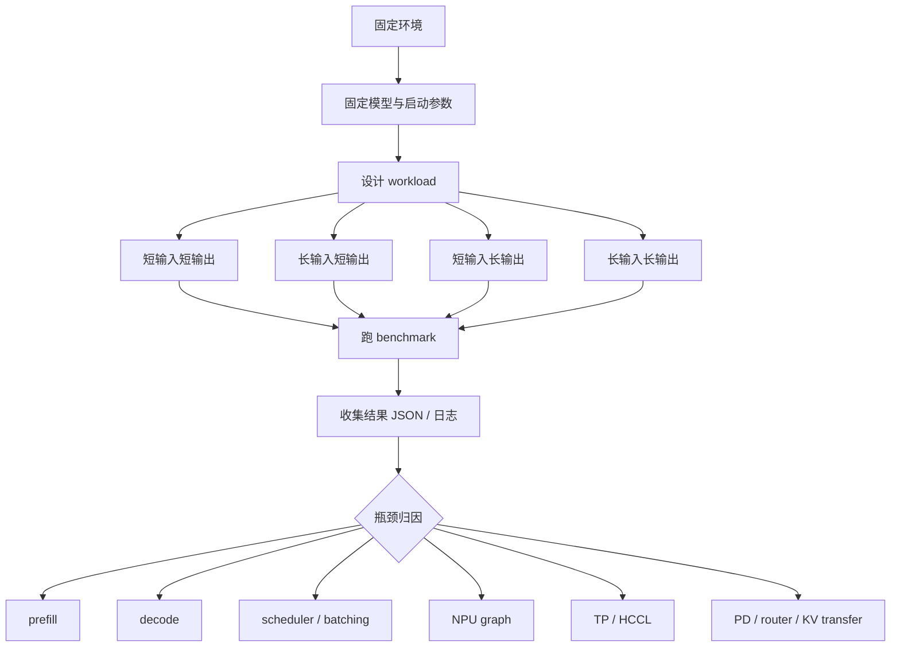

# 14. SGLang Ascend NPU 性能测试

本讲专门讲性能测试。它回答三个问题：

1. 应该用什么 workload 衡量 SGLang-NPU 的推理性能？
2. 如何用可复现脚本跑单卡、多卡、PD 分离、在线服务等场景？
3. 拿到结果后，如何判断瓶颈在 prefill、decode、调度、graph、通信、router 还是 KV transfer？

性能测试不要和精度测试混在一起做。性能测试关注吞吐、延迟、稳定性和资源利用率；精度测试关注输出是否正确。一个优化 PR 至少要证明“性能变好且精度不退化”，但这两个证明过程应该分开设计。

## 目标图



## 0. 性能测试原则

### 0.1 先固定测试环境

所有脚本仍然放在个人目录映射后的 workspace，不写系统目录，不污染其他人的环境：

```bash
export WORKSPACE=/workspace/sglang-npu
export MODEL_ROOT=$WORKSPACE/models
export LOG_ROOT=$WORKSPACE/logs
export PERF_ROOT=$WORKSPACE/perf
mkdir -p "$LOG_ROOT/perf" "$PERF_ROOT"/{scripts,reports,workloads}
```

公共配置脚本：

```bash
cat > "$PERF_ROOT/scripts/env.sh" <<'SH'
#!/usr/bin/env bash
set -euo pipefail

export WORKSPACE=${WORKSPACE:-/workspace/sglang-npu}
export MODEL_ROOT=${MODEL_ROOT:-$WORKSPACE/models}
export LOG_ROOT=${LOG_ROOT:-$WORKSPACE/logs}
export PERF_ROOT=${PERF_ROOT:-$WORKSPACE/perf}
export MODEL_PATH=${MODEL_PATH:-$MODEL_ROOT/Qwen2.5-7B-Instruct}
export MODEL_ID=${MODEL_ID:-$(basename "$MODEL_PATH")}
export BASE_URL=${BASE_URL:-http://127.0.0.1:8000}

mkdir -p "$LOG_ROOT/perf" "$PERF_ROOT"/{scripts,reports,workloads}
SH

chmod +x "$PERF_ROOT/scripts/env.sh"
```

### 0.2 必须记录的上下文

任何性能结果都必须带上下文，否则无法比较：

| 类别 | 必须记录 |
|---|---|
| 代码版本 | SGLang commit、sglang-kernel-npu commit、镜像 tag。 |
| 环境版本 | CANN、driver、firmware、torch、torch_npu、Python。 |
| 模型 | 模型路径、参数规模、dtype、量化方式。 |
| 启动参数 | `--device npu`、`--attention-backend ascend`、`--tp-size`、graph、chunked prefill、PD 参数。 |
| workload | prompt 长度、输出长度、并发、request rate、请求数、streaming。 |
| 结果 | QPS、request rate、concurrency、input tokens/s、output tokens/s、total tokens/s、TTFT、TPOT、ITL、P50/P95/P99、error rate、timeout rate、SLA goodput。 |
| 服务端状态 | running batch size、queue length、graph 命中、KV cache 使用率、prefix cache 命中率。 |
| 资源与通信 | NPU 利用率、HBM 使用量、HCCL 时间、KV transfer 时间、router/worker timeout。 |

建议每次压测前保存服务启动命令：

```bash
ps -ef | grep -E "sglang serve|sgl-router" | grep -v grep | tee "$LOG_ROOT/perf/processes.txt"
```

### 0.3 性能指标解释

性能指标不要只看一个平均值。SGLang 推理服务至少要同时观察 **请求级延迟**、**token 级吞吐**、**流式生成体验**、**调度与缓存状态**、**NPU/HCCL/网络资源**。同一个 QPS 结果，可能对应“低延迟稳定服务”，也可能对应“高并发堆积后的尾延迟失控”，所以必须成组解读。

#### 0.3.1 请求级指标

| 指标 | 常见写法 | 含义 | 怎么计算 | 优先关联路径 |
|---|---|---|---|---|
| 请求数 | requests、num prompts | 本轮压测发出的总请求数。 | 压测脚本输入。 | workload 规模。 |
| 成功请求数 | ok、success | 正常返回的请求数。 | HTTP 2xx 且响应可解析。 | 服务稳定性。 |
| 失败请求数 | failed、errors | 超时、连接失败、HTTP 错误、worker crash、router upstream error 等失败请求。 | `failed = total - ok`。 | OOM、timeout、router、worker。 |
| 错误率 | error rate | 失败请求占比。 | `failed / total`。 | 容量上限、OOM、超时、服务崩溃。 |
| QPS | requests/s、RPS | 每秒完成的成功请求数，衡量服务整体请求吞吐。 | `ok_requests / elapsed_s`。 | scheduler、batching、router、整体容量。 |
| 请求注入速率 | request rate、arrival rate | 压测端每秒向服务发起多少请求。 | 压测器控制值。 | 是否接近线上流量模型。 |
| 并发数 | concurrency、in-flight requests | 同一时刻最多有多少请求在服务端处理中或排队。 | 压测器控制值，也可从服务日志观察。 | batch 形成、排队、显存/KV cache 压力。 |
| 端到端延迟 | latency、E2E latency | 从客户端发出请求到收到完整响应的时间。非流式压测最容易采到这个指标。 | `response_done_time - request_start_time`。 | 排队、prefill、decode、网络、序列化。 |
| 平均延迟 | avg latency、mean latency | 所有成功请求端到端延迟的平均值。 | `sum(latency) / ok_requests`。 | 粗略趋势。 |
| 中位延迟 | P50 latency、median | 50% 请求不超过该延迟，表示典型用户体验。 | latency 排序后取 50 分位。 | 常规体验。 |
| 尾延迟 | P90/P95/P99 latency | 90%、95%、99% 请求不超过该延迟，表示慢请求和抖动。 | latency 排序后取对应分位。 | HCCL、OOM retry、graph miss、router、KV transfer。 |
| 最大延迟 | max latency | 本轮最慢请求耗时。 | `max(latency)`。 | 极端抖动、单点阻塞。 |
| 超时率 | timeout rate | 因客户端或服务端 timeout 失败的比例。 | `timeout_requests / total`。 | SLA、router upstream timeout、服务饱和。 |

`QPS` 和 `request rate` 容易混淆：`request rate` 是压测器“发出去”的速度，`QPS` 是服务“成功完成”的速度。当 request rate 高于系统容量时，QPS 会变平，而 P95/P99 和 timeout rate 会快速上升。

#### 0.3.2 流式生成体验指标

在线大模型服务通常使用 streaming。流式场景下，端到端 latency 不能完整描述用户体验，还要拆成首 token 和后续 token。

| 指标 | 常见写法 | 含义 | 怎么计算 | 优先关联路径 |
|---|---|---|---|---|
| 首 token 延迟 | TTFT、time to first token | 客户端发出请求到收到第一个输出 token 的时间。 | `first_token_time - request_start_time`。 | 排队、prefill、chunked prefill、router、PD KV transfer。 |
| token 间延迟 | ITL、inter-token latency | 相邻两个输出 token 到达客户端的时间间隔。 | `token_i_time - token_(i-1)_time`。 | decode kernel、NPU graph、sampler、batch 稳定性。 |
| 每输出 token 时间 | TPOT、time per output token | 输出阶段平均每个 token 消耗的时间，常用来衡量 decode 体验。 | `(last_token_time - first_token_time) / max(output_tokens - 1, 1)`。 | decode attention、MoE、graph replay。 |
| 生成阶段延迟 | generation latency | 首 token 之后到完整输出结束的耗时。 | `response_done_time - first_token_time`。 | decode 长输出性能。 |
| 首 token P95/P99 | P95 TTFT、P99 TTFT | 首 token 的尾延迟。 | 对所有请求 TTFT 取分位。 | prefill 抖动、排队、PD transfer。 |
| TPOT P95/P99 | P95 TPOT、P99 TPOT | 每请求平均输出 token 时间的尾部分位。 | 对每个请求 TPOT 取分位。 | decode 抖动、graph miss、HCCL。 |
| ITL P95/P99 | P95 ITL、P99 ITL | 单 token 间隔的尾部分位。 | 汇总所有 token 间隔后取分位。 | decode step 抖动、batch 变化。 |

非流式请求只能准确得到端到端 latency 和 tokens/s，不能准确拆出 TTFT/ITL/TPOT。要测这些指标，压测脚本必须打开 `stream=true`，并记录每个 chunk 到达时间。做 SGLang-NPU 性能结论时，建议至少跑一组 streaming workload，否则无法判断用户首字响应和连续出字体验。

#### 0.3.3 token 吞吐指标

token 吞吐比 QPS 更适合比较不同输入/输出长度下的模型执行能力。

| 指标 | 常见写法 | 含义 | 怎么计算 | 优先关联路径 |
|---|---|---|---|---|
| 输入 token 吞吐 | input tokens/s、prompt tok/s | 每秒处理多少 prompt/input token。主要衡量 prefill 能力。 | `sum(prompt_tokens) / elapsed_s`。 | prefill attention、chunked prefill、KV 写入、prefix cache。 |
| 输出 token 吞吐 | output tokens/s、decode tok/s | 每秒生成多少 completion/output token。主要衡量 decode 能力。 | `sum(completion_tokens) / elapsed_s`。 | decode attention、NPU graph、sampler、MoE。 |
| 总 token 吞吐 | total tokens/s | 输入 token 和输出 token 合计吞吐。 | `(prompt_tokens + completion_tokens) / elapsed_s`。 | 总体算力利用。 |
| 单卡 token 吞吐 | tokens/s/card | 平均到每张 NPU 的 token 吞吐。 | `tokens/s / npu_count`。 | 多卡扩展效率。 |
| prefill 吞吐 | prefill tokens/s | prefill 阶段每秒处理 prompt token 的速度。 | `prefill_tokens / prefill_time`。 | 长输入、chunked prefill、attention backend。 |
| decode 吞吐 | decode tokens/s | decode 阶段每秒产出 token 的速度。 | `generated_tokens / decode_time`。 | 长输出、graph、batch 稳定性。 |
| 平均输入长度 | avg input tokens | 每个请求平均 prompt token 数。 | `sum(prompt_tokens) / ok_requests`。 | workload 是否一致。 |
| 平均输出长度 | avg output tokens | 每个请求平均 completion token 数。 | `sum(completion_tokens) / ok_requests`。 | decode 压力是否一致。 |
| 有效 token 吞吐 | useful tokens/s | 去掉失败请求、warmup、padding 后的有效吞吐。 | 按报告口径定义。 | 真实业务收益。 |

同一个 QPS 下，`短输入短输出` 和 `长输入长输出` 的 token 计算量完全不同。因此比较优化前后性能时，要固定输入/输出长度，并同时报告 QPS、input tokens/s、output tokens/s。

#### 0.3.4 调度、batch 与缓存指标

这些指标通常来自 SGLang 服务日志、metrics endpoint 或 profiling，不一定由简单 HTTP 压测脚本直接产生。

| 指标 | 含义 | 为什么重要 | 优先关联路径 |
|---|---|---|---|
| 排队时间 | 请求进入服务后等待 scheduler 处理的时间。 | 高并发下 TTFT 可能主要花在排队，而不是模型计算。 | scheduler、router、worker 负载。 |
| active requests | 当前正在处理的请求数。 | 判断服务是否饱和、batch 是否稳定。 | scheduler。 |
| waiting requests | 当前等待调度的请求数。 | 队列持续增长说明 request rate 超过容量。 | scheduler、router。 |
| running batch size | 单次 forward 中包含的请求数。 | batch 太小会导致 NPU 利用率不足，太大可能增加尾延迟。 | batching、graph shape。 |
| batch token 数 | 单次 forward 中的 token 数。 | prefill 看 input token，decode 通常每请求 1 个 query token。 | prefill/decode 调度。 |
| prefill/decode 混合比例 | batch 中 prefill 与 decode 工作占比。 | chunked prefill 或长 prompt 会影响 decode 出字稳定性。 | scheduler、chunked prefill。 |
| graph 命中率 | decode 或固定 shape 是否命中 NPU Graph replay。 | graph miss 会让 decode 退回 eager，ITL 抖动。 | NPU Graph runner。 |
| KV cache 使用率 | KV pool 已使用 block/page 占比。 | 接近上限时容易出现抢占、OOM 或请求失败。 | memory pool、radix cache。 |
| prefix cache 命中率 | prompt 前缀复用命中比例。 | 命中后 input tokens/s、TTFT 会显著变化，必须单独记录。 | radix cache、prefix cache。 |
| cache eviction 次数 | KV/radix cache 被淘汰次数。 | 淘汰过多会造成重复 prefill 和延迟抖动。 | cache policy。 |

如果只看客户端 latency，很难区分“模型算得慢”和“请求排队久”。做瓶颈归因时，应把客户端压测结果和服务端 scheduler 日志放在一起看。

#### 0.3.5 NPU 与系统资源指标

资源指标用于解释为什么吞吐没有继续提升。

| 指标 | 含义 | 解读方式 |
|---|---|---|
| NPU 利用率 | NPU AI Core/计算单元忙碌程度。 | 利用率低且 QPS 低，可能是 batch 太小、CPU 调度或通信阻塞。 |
| HBM/显存使用量 | 模型权重、KV cache、临时 buffer 占用。 | 接近上限时关注 OOM、KV cache eviction、batch 限制。 |
| HBM 带宽 | NPU 高带宽内存读写压力。 | RMSNorm、KV cache、MoE、采样等可能受带宽影响。 |
| AICPU/Host 开销 | CPU/AICPU 辅助任务耗时。 | tokenization、JSON、采样后处理、shape 调度可能造成 overhead。 |
| kernel 时间占比 | NPU 算子在 timeline 中的耗时比例。 | 判断瓶颈在 attention、MLP/MoE、norm、sampler 还是 cache。 |
| HCCL 通信时间 | all-reduce/all-gather/reduce-scatter 耗时。 | TP/CP/DP 扩展效率低时重点看。 |
| HCCL 等待时间 | 设备等待其它 rank 到达 collective 的时间。 | rank 不均衡、batch 分布不均或某卡慢会放大尾延迟。 |
| Host CPU 使用率 | 服务进程 CPU 消耗。 | 高 CPU 可能导致调度、HTTP、tokenizer 或日志成为瓶颈。 |
| 网络带宽 | 跨机 PD、router、KV transfer 的网络吞吐。 | PD multi-node 中 TTFT/P99 异常时重点看。 |
| 磁盘/模型加载耗时 | cold start 和首次请求相关耗时。 | 不应混入 steady-state 性能。 |

资源指标必须和 workload 一起解读。短输入短输出场景中 CPU/HTTP overhead 占比会更高；长输入场景中 prefill attention 和 KV 写入占比更高；长输出场景中 decode graph、attention、sampler 和 HCCL 更关键。

#### 0.3.6 分布式与 PD 分离指标

多卡和 PD 分离场景下，单机单进程指标不够，需要额外观察跨 rank、跨服务的指标。

| 指标 | 含义 | 适用场景 | 优先关联路径 |
|---|---|---|---|
| TP 扩展效率 | TP 从 1 增加到 N 后，吞吐提升接近多少。 | TP2/TP4/TP8 对比。 | HCCL、算子切分、batch size。 |
| 单 rank 耗时差异 | 不同 TP rank 同一阶段耗时是否一致。 | 多卡 profiling。 | rank/device 映射、负载不均。 |
| all-reduce 时间 | TP/attention/MoE all-reduce 总耗时。 | TP 性能分析。 | `LayerCommunicator`、linear/MoE row-parallel。 |
| all-gather 时间 | token 或 latent gather 耗时。 | DP attention、CP、attn input scattered。 | `LayerCommunicator`、DP/CP。 |
| reduce-scatter 时间 | 汇总并切分输出的耗时。 | DP padding、CP、部分 MoE。 | `should_use_reduce_scatter`。 |
| router 排队时间 | 请求在 router 等待可用 worker 的时间。 | PD 或多实例 serving。 | router 调度。 |
| prefill worker 时间 | prefill server 从收到请求到完成 KV 发送的时间。 | PD 分离。 | prefill attention、KV 写入、KV transfer。 |
| decode worker 时间 | decode server 等待 KV 并生成输出的时间。 | PD 分离。 | KV 接收、decode batch、graph。 |
| KV transfer 时间 | prefill 到 decode 的 KV 传输耗时。 | PD 分离、跨机。 | `ASCEND_MF_*`、SDMA/RDMA、网络。 |
| upstream timeout | router 调用 worker 超时次数。 | PD 或多 worker。 | worker 健康、网络、服务饱和。 |

PD 的性能不能只看总 QPS。常见情况是 TTFT 因 prefill 独立扩容而下降，但 P99 因 router 或 KV transfer 抖动上升；也可能 prefill 很快，decode worker 数量不足导致 output tokens/s 下降。

#### 0.3.7 派生效率指标

派生指标用于比较配置或 PR 的收益，但它们依赖前面的基础指标，不能单独使用。

| 指标 | 含义 | 公式或口径 | 适用问题 |
|---|---|---|---|
| SLA goodput | 满足延迟 SLA 的成功请求吞吐。 | `latency <= SLA` 的成功请求数 / elapsed。 | “吞吐高但尾延迟不可用”时更可信。 |
| token goodput | 满足 TTFT/TPOT SLA 的输出 token 吞吐。 | 满足 SLA 请求的 output tokens / elapsed。 | 流式服务体验。 |
| TP scaling efficiency | 多卡扩展效率。 | `throughput_TPN / (throughput_TP1 * N)`。 | 判断 TP 是否被 HCCL 或 batch 限制。 |
| graph speedup | NPU Graph 带来的加速比。 | `eager_latency / graph_latency` 或 `graph_tokens/s / eager_tokens/s`。 | graph 是否值得打开。 |
| prefill/decode 时间占比 | 请求耗时中 prefill 与 decode 的比例。 | profiling 或服务日志统计。 | 判断优化方向。 |
| 每百万 token NPU 小时 | 处理固定 token 量消耗多少 NPU 时间。 | `npu_count * elapsed_hours / (tokens / 1e6)`。 | 成本评估。 |
| 性能回归百分比 | 新旧版本差异。 | `(new - old) / old`，延迟类越低越好，吞吐类越高越好。 | PR 验证。 |

报告性能收益时要说明指标方向：吞吐、goodput、利用率越高越好；延迟、错误率、超时率、NPU 小时/token 越低越好。不要把这些指标混成一个“综合分数”，否则很难定位真实瓶颈。

#### 0.3.8 四象限 workload 与指标优先级

| Workload | 最优先指标 | 次级指标 | 常见瓶颈 |
|---|---|---|---|
| 短输入短输出 | QPS、P50/P95 latency、error rate | CPU 使用率、scheduler 排队 | HTTP/JSON、调度、batch 太小。 |
| 长输入短输出 | input tokens/s、TTFT、P95 TTFT | KV cache 使用率、chunked prefill 日志 | prefill attention、KV 写入、prefix cache。 |
| 短输入长输出 | output tokens/s、TPOT、ITL P95/P99 | graph 命中率、sampler 耗时 | decode attention、NPU Graph、batch 稳定性。 |
| 长输入长输出 | TTFT、output tokens/s、P99 latency、error rate | HBM 使用、HCCL、KV cache | prefill + decode 互相干扰，内存压力。 |
| TP 多卡 | tokens/s/card、TP scaling efficiency、HCCL 时间 | rank 耗时差异、P99 | all-reduce、all-gather、rank 不均衡。 |
| PD 分离 | TTFT、P95/P99、KV transfer time | router queue、worker timeout | router、KV 传输、decode worker 不足。 |

短输入短输出主要看 serving overhead；长输入短输出主要看 prefill；短输入长输出主要看 decode；长输入长输出会同时放大 prefill 和 decode。只有把 workload 类型和指标优先级绑定起来，性能结论才不会跑偏。

## 1. 启动性能测试服务

### 1.1 单卡 baseline

```bash
source "$PERF_ROOT/scripts/env.sh"

sglang serve \
  --model-path "$MODEL_PATH" \
  --host 0.0.0.0 \
  --port 8000 \
  --device npu \
  --attention-backend ascend \
  --base-gpu-id 0 \
  --tp-size 1 \
  2>&1 | tee "$LOG_ROOT/perf/server-single.log"
```

第一次跑性能时建议先关 graph 建一个 eager baseline：

```bash
sglang serve \
  --model-path "$MODEL_PATH" \
  --host 0.0.0.0 \
  --port 8000 \
  --device npu \
  --attention-backend ascend \
  --base-gpu-id 0 \
  --tp-size 1 \
  --disable-cuda-graph \
  2>&1 | tee "$LOG_ROOT/perf/server-single-eager.log"
```

对比 eager 和 graph on 的意义：

- eager 正常、graph on 更快：正常。
- eager 正常、graph on 无提升：graph 可能没有命中，或 workload shape 不在 graph 覆盖内。
- eager 稳定、graph on 抖动：查看 graph capture/replay、shape、batch size。

### 1.2 TP 多卡服务

```bash
export ASCEND_RT_VISIBLE_DEVICES=0,1,2,3

sglang serve \
  --model-path "$MODEL_PATH" \
  --host 0.0.0.0 \
  --port 8000 \
  --device npu \
  --attention-backend ascend \
  --tp-size 4 \
  2>&1 | tee "$LOG_ROOT/perf/server-tp4.log"
```

TP 性能测试重点：

- 单卡模型放得下时，TP 不一定降低 TTFT，因为 HCCL 通信会引入额外开销。
- 大模型放不下时，TP 是容量前提，此时重点看扩展效率。
- 如果 TP4 比 TP2 吞吐提升很小，优先看 HCCL 等待、all-reduce、rank/device 映射。

### 1.3 PD 分离服务

PD 分离性能测试应压 router，而不是直接压 prefill/decode server。可以复用第 13 讲中的脚本：

```bash
export WORKSPACE=/workspace/sglang-npu
export MODEL_PATH="$WORKSPACE/models/Qwen2.5-7B-Instruct"
export PREFILL_NPUS=0
export DECODE_NPUS=1
export ROUTER_PORT=8000

bash "$WORKSPACE/scripts/pd/run_all_local.sh"
```

PD 性能结论必须同时记录：

- router 日志：是否有 upstream timeout、worker unhealthy、请求分发异常。
- prefill 日志：prefill batch、bootstrap port、KV 发送状态。
- decode 日志：KV 接收、decode batch、持续输出状态。
- `ASCEND_MF_STORE_URL`、`ASCEND_MF_TRANSFER_PROTOCOL`。

## 2. OpenAI 接口压测脚本

下面脚本不依赖额外工具，直接打 SGLang OpenAI-compatible API，适合所有服务形态：单卡、TP、多实例、PD router。

```bash
cat > "$PERF_ROOT/scripts/bench_openai_basic.py" <<'PY'
import argparse
import concurrent.futures
import json
import statistics
import time
import urllib.request


def post(url, model, prompt, max_tokens, timeout):
    payload = {
        "model": model,
        "messages": [{"role": "user", "content": prompt}],
        "temperature": 0,
        "max_tokens": max_tokens,
        "stream": False,
    }
    req = urllib.request.Request(
        url,
        data=json.dumps(payload).encode("utf-8"),
        headers={"Content-Type": "application/json"},
        method="POST",
    )
    start = time.perf_counter()
    try:
        with urllib.request.urlopen(req, timeout=timeout) as resp:
            data = json.loads(resp.read().decode("utf-8"))
        latency = time.perf_counter() - start
        usage = data.get("usage", {})
        return {
            "ok": True,
            "latency_s": latency,
            "prompt_tokens": usage.get("prompt_tokens") or 0,
            "completion_tokens": usage.get("completion_tokens") or 0,
            "total_tokens": usage.get("total_tokens") or 0,
        }
    except Exception as exc:
        return {"ok": False, "latency_s": time.perf_counter() - start, "error": repr(exc)}


def percentile(values, p):
    if not values:
        return None
    ordered = sorted(values)
    idx = min(len(ordered) - 1, max(0, int(len(ordered) * p) - 1))
    return ordered[idx]


def main():
    parser = argparse.ArgumentParser()
    parser.add_argument("--base-url", default="http://127.0.0.1:8000")
    parser.add_argument("--model", required=True)
    parser.add_argument("--num-prompts", type=int, default=64)
    parser.add_argument("--concurrency", type=int, default=4)
    parser.add_argument("--input-repeat", type=int, default=256)
    parser.add_argument("--max-tokens", type=int, default=128)
    parser.add_argument("--output", required=True)
    parser.add_argument("--timeout", type=int, default=300)
    args = parser.parse_args()

    url = args.base_url.rstrip("/") + "/v1/chat/completions"
    prompt = " ".join(["请解释 Ascend NPU 上大模型推理的关键性能路径。"] * args.input_repeat)
    results = []
    start_all = time.perf_counter()

    with concurrent.futures.ThreadPoolExecutor(max_workers=args.concurrency) as pool:
        futures = [
            pool.submit(post, url, args.model, prompt, args.max_tokens, args.timeout)
            for _ in range(args.num_prompts)
        ]
        for future in concurrent.futures.as_completed(futures):
            row = future.result()
            results.append(row)
            print(json.dumps(row, ensure_ascii=False), flush=True)

    elapsed = time.perf_counter() - start_all
    ok_rows = [r for r in results if r["ok"]]
    latencies = [r["latency_s"] for r in ok_rows]
    total_prompt = sum(r["prompt_tokens"] for r in ok_rows)
    total_completion = sum(r["completion_tokens"] for r in ok_rows)

    summary = {
        "num_prompts": args.num_prompts,
        "ok": len(ok_rows),
        "failed": len(results) - len(ok_rows),
        "elapsed_s": elapsed,
        "qps": len(ok_rows) / elapsed if elapsed else None,
        "p50_latency_s": statistics.median(latencies) if latencies else None,
        "p95_latency_s": percentile(latencies, 0.95),
        "p99_latency_s": percentile(latencies, 0.99),
        "input_tokens_per_s": total_prompt / elapsed if elapsed else None,
        "output_tokens_per_s": total_completion / elapsed if elapsed else None,
        "total_tokens_per_s": (total_prompt + total_completion) / elapsed if elapsed else None,
    }

    with open(args.output, "w", encoding="utf-8") as f:
        json.dump({"summary": summary, "results": results}, f, ensure_ascii=False, indent=2)
    print(json.dumps({"summary": summary}, ensure_ascii=False, indent=2))


if __name__ == "__main__":
    main()
PY
```

运行示例：

```bash
source "$PERF_ROOT/scripts/env.sh"
python3 "$PERF_ROOT/scripts/bench_openai_basic.py" \
  --base-url "$BASE_URL" \
  --model "$MODEL_ID" \
  --num-prompts 128 \
  --concurrency 8 \
  --input-repeat 512 \
  --max-tokens 128 \
  --output "$PERF_ROOT/reports/openai-c8-in512-out128.json" \
  2>&1 | tee "$LOG_ROOT/perf/openai-c8-in512-out128.log"
```

## 3. Workload 设计

### 3.1 四象限 workload

至少跑下面四组：

| 目标 | 参数示例 | 主要观察 |
|---|---|---|
| 短输入短输出 | `--input-repeat 32 --max-tokens 32` | API overhead、调度开销、基础稳定性。 |
| 长输入短输出 | `--input-repeat 1024 --max-tokens 32` | prefill、chunked prefill、KV 写入。 |
| 短输入长输出 | `--input-repeat 32 --max-tokens 512` | decode、graph replay、sampler。 |
| 长输入长输出 | `--input-repeat 1024 --max-tokens 512` | prefill + decode 综合压力。 |

批量运行脚本：

```bash
cat > "$PERF_ROOT/scripts/run_workload_matrix.sh" <<'SH'
#!/usr/bin/env bash
set -euo pipefail

SCRIPT_DIR=$(cd "$(dirname "${BASH_SOURCE[0]}")" && pwd)
source "$SCRIPT_DIR/env.sh"

run_case() {
  local name=$1
  local input_repeat=$2
  local max_tokens=$3
  local concurrency=$4
  python3 "$SCRIPT_DIR/bench_openai_basic.py" \
    --base-url "$BASE_URL" \
    --model "$MODEL_ID" \
    --num-prompts 128 \
    --concurrency "$concurrency" \
    --input-repeat "$input_repeat" \
    --max-tokens "$max_tokens" \
    --output "$PERF_ROOT/reports/${name}.json" \
    2>&1 | tee "$LOG_ROOT/perf/${name}.log"
}

run_case short_in_short_out 32 32 8
run_case long_in_short_out 1024 32 4
run_case short_in_long_out 32 512 8
run_case long_in_long_out 1024 512 4
SH

chmod +x "$PERF_ROOT/scripts/run_workload_matrix.sh"
bash "$PERF_ROOT/scripts/run_workload_matrix.sh"
```

### 3.2 并发扫描

并发扫描用于找到系统拐点：

```bash
cat > "$PERF_ROOT/scripts/sweep_concurrency.sh" <<'SH'
#!/usr/bin/env bash
set -euo pipefail

SCRIPT_DIR=$(cd "$(dirname "${BASH_SOURCE[0]}")" && pwd)
source "$SCRIPT_DIR/env.sh"

for c in 1 2 4 8 16 32; do
  name="sweep-c${c}"
  python3 "$SCRIPT_DIR/bench_openai_basic.py" \
    --base-url "$BASE_URL" \
    --model "$MODEL_ID" \
    --num-prompts 128 \
    --concurrency "$c" \
    --input-repeat 512 \
    --max-tokens 128 \
    --output "$PERF_ROOT/reports/${name}.json" \
    2>&1 | tee "$LOG_ROOT/perf/${name}.log"
done
SH

chmod +x "$PERF_ROOT/scripts/sweep_concurrency.sh"
```

解读方法：

- QPS 随并发增加而上升，P95 可接受：还没到饱和点。
- QPS 变平，P95 明显上升：达到吞吐拐点。
- error rate 上升：已经超过服务承载能力。
- output tokens/s 不升反降：decode batch、graph、内存或调度可能进入低效区。

## 4. 场景化性能测试

### 4.1 单卡性能

单卡测试用于建立最小 baseline：

```bash
export BASE_URL=http://127.0.0.1:8000
export MODEL_ID=Qwen2.5-7B-Instruct
bash "$PERF_ROOT/scripts/run_workload_matrix.sh"
```

重点看：

- graph on 相比 eager 是否提升。
- 长输入时是否出现 OOM 或 prefill 尾延迟。
- 短输入长输出时 output tokens/s 是否稳定。

### 4.2 多卡 TP 性能

TP 测试要比较 `tp-size=1/2/4/8`，但前提是模型能在这些配置下都跑起来。

报告表建议：

| TP size | input tok/s | output tok/s | P95 latency | HCCL 日志异常 | 结论 |
|---:|---:|---:|---:|---|---|
| 1 |  |  |  |  | baseline |
| 2 |  |  |  |  |  |
| 4 |  |  |  |  |  |

如果 TP 增大后吞吐提升不明显，优先检查：

- HCCL 初始化和 rank/device 映射。
- attention 或 MLP 后的 all-reduce 等待。
- batch size 是否太小，导致通信开销占比过高。
- 单卡是否已经被内存或 graph shape 限制。

### 4.3 PD 分离性能

PD 适合长 prompt 或 prefill/decode 资源不均的场景。测试时至少比较：

| 模式 | 压测入口 | 目的 |
|---|---|---|
| 普通 serving | SGLang server | baseline。 |
| PD local | router | 本机 prefill/decode 拆分收益。 |
| PD multi-node | router | 跨机 KV transfer 和网络影响。 |

PD 分离下，如果 TTFT 下降但 P95 上升，可能是 router 或 KV transfer 抖动。如果 output tokens/s 下降，可能是 decode worker 不足、KV 接收等待或 batch 形成不稳定。

### 4.4 长上下文性能

长上下文主要观察 prefill 和 KV cache：

```bash
python3 "$PERF_ROOT/scripts/bench_openai_basic.py" \
  --base-url "$BASE_URL" \
  --model "$MODEL_ID" \
  --num-prompts 32 \
  --concurrency 2 \
  --input-repeat 4096 \
  --max-tokens 32 \
  --output "$PERF_ROOT/reports/long-context.json"
```

如果长上下文慢：

- 看 `chunked_prefill_size` 是否过小或过大。
- 看 KV cache 内存是否接近上限。
- 看 attention backend 是否确实是 `ascend`。
- 看日志里是否有 fallback、format cast 或 OOM retry。

## 5. 结果整理与归因

### 5.1 汇总结果脚本

```bash
cat > "$PERF_ROOT/scripts/summarize_reports.py" <<'PY'
import glob
import json
import os

for path in sorted(glob.glob(os.path.join(os.environ.get("PERF_ROOT", "."), "reports", "*.json"))):
    with open(path, encoding="utf-8") as f:
        data = json.load(f)
    s = data.get("summary", {})
    print(
        "\t".join(
            [
                os.path.basename(path),
                str(s.get("ok")),
                str(s.get("failed")),
                f"{s.get('qps'):.3f}" if isinstance(s.get("qps"), (int, float)) else "",
                f"{s.get('input_tokens_per_s'):.1f}" if isinstance(s.get("input_tokens_per_s"), (int, float)) else "",
                f"{s.get('output_tokens_per_s'):.1f}" if isinstance(s.get("output_tokens_per_s"), (int, float)) else "",
                f"{s.get('p95_latency_s'):.3f}" if isinstance(s.get("p95_latency_s"), (int, float)) else "",
            ]
        )
    )
PY

source "$PERF_ROOT/scripts/env.sh"
python3 "$PERF_ROOT/scripts/summarize_reports.py"
```

### 5.2 瓶颈速查表

| 现象 | 优先怀疑 | 下一步 |
|---|---|---|
| 长输入慢，短输入正常 | prefill attention / chunked prefill | 跑长输入短输出，开 profiling。 |
| 短输入长输出慢 | decode / graph / sampler | 对比 eager 与 graph on。 |
| QPS 不随并发上升 | batch 形成差或模型饱和 | 并发扫描，观察 batch 日志。 |
| P95/P99 很高 | 抖动、GC、OOM、通信等待 | 看服务日志和 profiler timeline。 |
| TP 扩展效率低 | HCCL / all-reduce | 对比 TP2/TP4，查 rank 日志。 |
| PD 下 TTFT 异常 | router / prefill / KV transfer | 同时看 router、prefill、decode 日志。 |
| graph on 无提升 | shape 未命中 graph | 查 graph capture/replay 日志。 |

## 6. 性能报告模板

```markdown
## 环境

- SGLang commit：
- sglang-kernel-npu commit：
- 镜像 / CANN / torch_npu：
- NPU 型号与卡数：

## 模型与启动参数

- 模型：
- dtype：
- tp-size：
- graph：
- PD：
- 其他关键参数：

## Workload

| case | input-repeat | max-tokens | concurrency | num-prompts |
|---|---:|---:|---:|---:|

## 结果

| case | ok | failed | QPS | input tok/s | output tok/s | TTFT P95 | TPOT P95 | P95 latency | error rate |
|---|---:|---:|---:|---:|---:|---:|---:|---:|---:|

## 结论

- 最优配置：
- 性能拐点：
- 主要瓶颈：
- 后续 profiling 方向：
```

## 本讲小结

性能测试的核心是可复现：固定模型、启动参数、workload 和结果格式。SGLang-NPU 的性能分析要把 prefill、decode、batching、graph、TP/HCCL、PD/router/KV transfer 分开观察。性能结论不要只看平均 QPS，必须同时看 input/output tokens/s、TTFT、TPOT、ITL、P95/P99、error rate、timeout rate、SLA goodput、资源指标和服务日志。发现瓶颈后，再进入第 12 讲 profiling 做 timeline 级归因。
