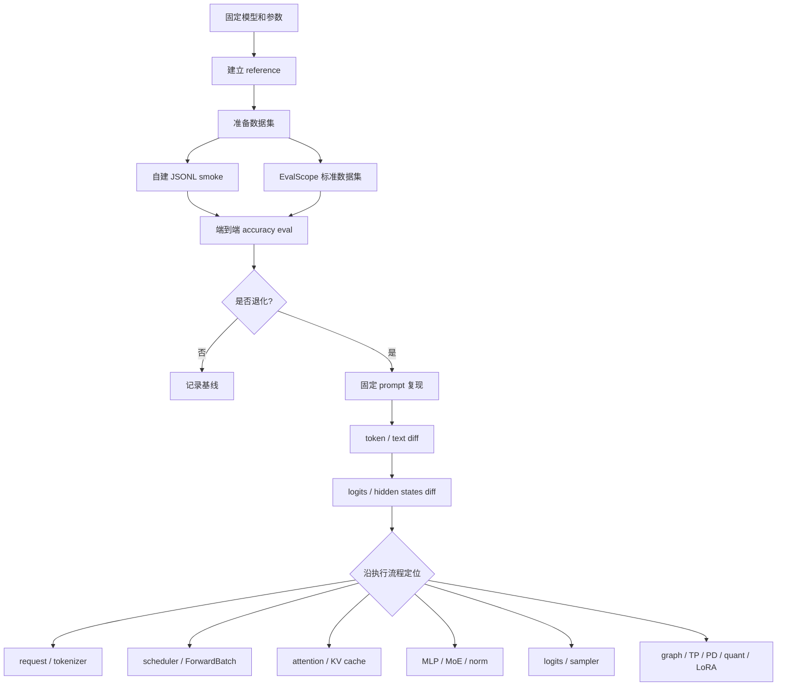
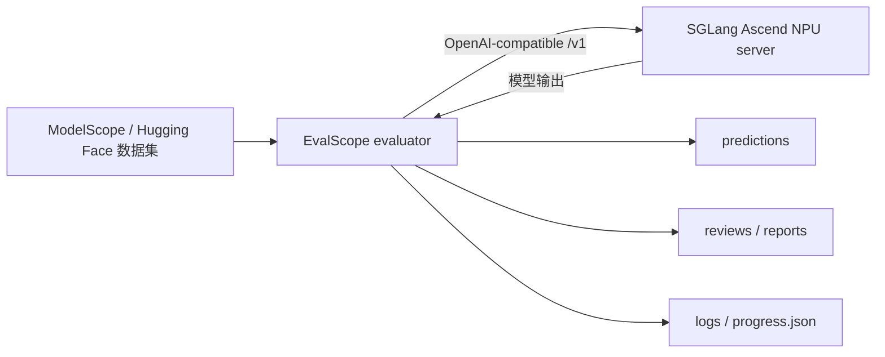
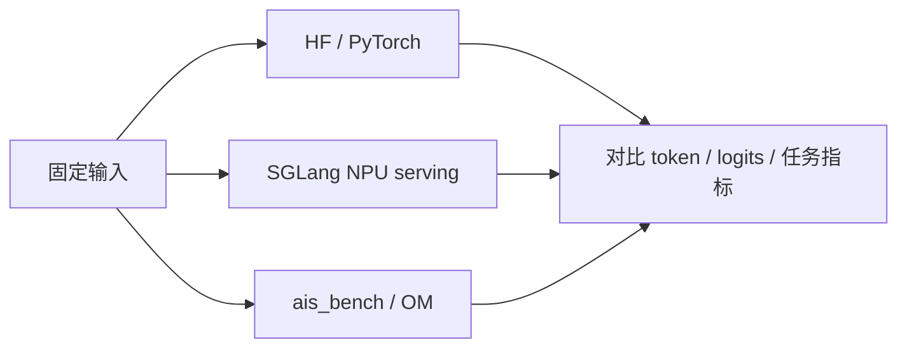
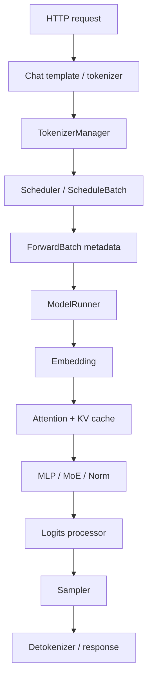

# 15. SGLang Ascend NPU 精度测试与问题定位

本讲专门讲精度测试与精度问题定位。它回答三个问题：

1. 如何用数据集评估 SGLang-NPU 模型输出是否正确？
2. `ais_bench` 这类 Ascend 离线推理工具在精度验证中应该放在什么位置？
3. 一旦出现精度问题，如何沿 SGLang 执行流程定位到 tokenizer、batch、attention/KV、graph、TP、PD、量化、LoRA 或 MoE？

精度测试和性能测试必须分开。性能测试里可以用简单 prompt；精度测试里要固定采样参数、数据集、评测规则和 reference。否则你看到的差异可能只是随机采样、chat template 或数据清洗造成的。

## 目标图



## 0. 精度测试原则

### 0.1 先定义精度口径

LLM serving 里的“精度”有多层含义：

| 类型 | 指标 | 用途 |
|---|---|---|
| 任务级精度 | exact match、F1、choice accuracy、pass@k | 判断模型能力是否整体退化。 |
| Token 级一致性 | greedy token 是否一致、首个分叉 token | 定位 SGLang 链路中哪一步开始错。 |
| Logits 级一致性 | max abs diff、mean abs diff、top-k overlap | 定位 kernel、dtype、graph、TP、attention。 |
| 输出协议正确性 | JSON schema、finish reason、stream 完整性 | 定位 serving 和 detokenizer。 |

推荐顺序：

1. 先跑任务级精度，判断是否真的退化。
2. 再找固定 prompt 的首个分叉 token。
3. 最后进入 logits 或中间 tensor 对比。

### 0.2 固定随机性

精度测试必须固定请求参数：

```json
{
  "temperature": 0,
  "top_p": 1,
  "max_tokens": 128,
  "stream": false
}
```

服务侧先固定：

- 同一个本地模型目录。
- 同一个 tokenizer 和 chat template。
- 同一个 dtype。
- 先关 LoRA、量化、speculative decoding、PD、HiCache 等额外特性。
- 先单卡、graph off 建 baseline，再逐步打开 graph、TP、PD、量化。

### 0.3 精度测试目录

```bash
export WORKSPACE=/workspace/sglang-npu
export MODEL_ROOT=$WORKSPACE/models
export LOG_ROOT=$WORKSPACE/logs
export ACC_ROOT=$WORKSPACE/accuracy
mkdir -p "$LOG_ROOT/accuracy" "$ACC_ROOT"/{scripts,datasets,reports,outputs,reference}
```

公共配置：

```bash
cat > "$ACC_ROOT/scripts/env.sh" <<'SH'
#!/usr/bin/env bash
set -euo pipefail

export WORKSPACE=${WORKSPACE:-/workspace/sglang-npu}
export MODEL_ROOT=${MODEL_ROOT:-$WORKSPACE/models}
export LOG_ROOT=${LOG_ROOT:-$WORKSPACE/logs}
export ACC_ROOT=${ACC_ROOT:-$WORKSPACE/accuracy}
export MODEL_PATH=${MODEL_PATH:-$MODEL_ROOT/Qwen2.5-7B-Instruct}
export MODEL_ID=${MODEL_ID:-$(basename "$MODEL_PATH")}
export BASE_URL=${BASE_URL:-http://127.0.0.1:8000}

mkdir -p "$LOG_ROOT/accuracy" "$ACC_ROOT"/{scripts,datasets,reports,outputs,reference}
SH

chmod +x "$ACC_ROOT/scripts/env.sh"
```

## 1. Reference 怎么建立

### 1.1 Reference 类型

| Reference | 用途 | 注意事项 |
|---|---|---|
| HF/PyTorch 离线脚本 | 判断模型和 tokenizer 本身 | 要使用同一模型目录和 chat template。 |
| 已知正确的 SGLang 版本 | 判断新 commit 是否引入回归 | 启动参数要一致。 |
| SGLang-NPU eager | 判断 graph/fusion 是否引入问题 | 加 `--disable-cuda-graph`。 |
| ais_bench / OM | 判断 Ascend 离线模型链路 | 不等价于 serving 端到端。 |

建议至少保留两个 reference：一个 HF/PyTorch reference，一个 SGLang-NPU eager reference。

### 1.2 最小请求探针

```bash
cat > "$ACC_ROOT/scripts/probe_openai.sh" <<'SH'
#!/usr/bin/env bash
set -euo pipefail

SCRIPT_DIR=$(cd "$(dirname "${BASH_SOURCE[0]}")" && pwd)
source "$SCRIPT_DIR/env.sh"

curl "$BASE_URL/v1/chat/completions" \
  -H "Content-Type: application/json" \
  -d "{
    \"model\": \"$MODEL_ID\",
    \"messages\": [{\"role\": \"user\", \"content\": \"只输出数字 42。\"}],
    \"temperature\": 0,
    \"top_p\": 1,
    \"max_tokens\": 8,
    \"stream\": false
  }" | tee "$LOG_ROOT/accuracy/probe.json"
SH

chmod +x "$ACC_ROOT/scripts/probe_openai.sh"
bash "$ACC_ROOT/scripts/probe_openai.sh"
```

探针不用于证明精度，只用于确认服务和基本采样参数可用。

## 2. 数据集精度评测

### 2.1 Smoke 数据集

先做一个很小但稳定的数据集：

```bash
cat > "$ACC_ROOT/datasets/smoke_qa.jsonl" <<'JSONL'
{"id":"math-001","prompt":"请只输出 2+3 的结果，不要解释。","expect":"5"}
{"id":"fact-001","prompt":"中国的首都是哪里？只输出城市名。","expect":"北京"}
{"id":"format-001","prompt":"请输出 JSON：{\"ok\": true}，不要输出其他内容。","expect":"{\"ok\": true}"}
{"id":"reason-001","prompt":"小明有 3 个苹果，又买了 4 个，一共几个？只输出数字。","expect":"7"}
JSONL
```

端到端评测脚本：

```bash
cat > "$ACC_ROOT/scripts/eval_jsonl_openai.py" <<'PY'
import argparse
import json
import re
import time
import urllib.request


def normalize(text):
    text = text.strip()
    text = re.sub(r"\s+", "", text)
    return text


def call(base_url, model, prompt, max_tokens):
    payload = {
        "model": model,
        "messages": [{"role": "user", "content": prompt}],
        "temperature": 0,
        "top_p": 1,
        "max_tokens": max_tokens,
        "stream": False,
    }
    req = urllib.request.Request(
        base_url.rstrip("/") + "/v1/chat/completions",
        data=json.dumps(payload).encode("utf-8"),
        headers={"Content-Type": "application/json"},
        method="POST",
    )
    start = time.perf_counter()
    with urllib.request.urlopen(req, timeout=300) as resp:
        data = json.loads(resp.read().decode("utf-8"))
    latency = time.perf_counter() - start
    content = data["choices"][0]["message"]["content"]
    return content, data.get("usage", {}), latency


def main():
    parser = argparse.ArgumentParser()
    parser.add_argument("--base-url", default="http://127.0.0.1:8000")
    parser.add_argument("--model", required=True)
    parser.add_argument("--input", required=True)
    parser.add_argument("--output", required=True)
    parser.add_argument("--max-tokens", type=int, default=128)
    args = parser.parse_args()

    total = 0
    correct = 0
    with open(args.input, encoding="utf-8") as fin, open(args.output, "w", encoding="utf-8") as fout:
        for line in fin:
            row = json.loads(line)
            total += 1
            try:
                pred, usage, latency = call(args.base_url, args.model, row["prompt"], args.max_tokens)
                ok = normalize(pred) == normalize(row["expect"])
                correct += int(ok)
                out = {
                    "id": row["id"],
                    "ok": ok,
                    "prompt": row["prompt"],
                    "expect": row["expect"],
                    "pred": pred,
                    "usage": usage,
                    "latency_s": latency,
                }
            except Exception as exc:
                out = {"id": row.get("id"), "ok": False, "error": repr(exc)}
            fout.write(json.dumps(out, ensure_ascii=False) + "\n")
            fout.flush()
            print(json.dumps(out, ensure_ascii=False), flush=True)

    summary = {"total": total, "correct": correct, "accuracy": correct / total if total else 0}
    print(json.dumps(summary, ensure_ascii=False))


if __name__ == "__main__":
    main()
PY
```

运行：

```bash
source "$ACC_ROOT/scripts/env.sh"
python3 "$ACC_ROOT/scripts/eval_jsonl_openai.py" \
  --base-url "$BASE_URL" \
  --model "$MODEL_ID" \
  --input "$ACC_ROOT/datasets/smoke_qa.jsonl" \
  --output "$ACC_ROOT/reports/accuracy-smoke.jsonl" \
  2>&1 | tee "$LOG_ROOT/accuracy/accuracy-smoke.log"
```

### 2.2 正式数据集

建议按能力选择数据集：

| 能力 | 数据集示例 | 指标 |
|---|---|---|
| 选择题知识 | MMLU、CEval、CMMLU | choice accuracy |
| 数学推理 | GSM8K、MATH 子集 | exact match |
| 代码 | HumanEval、MBPP | pass@1 / pass@k |
| 长上下文 | LongBench、needle-in-a-haystack | exact match / retrieval accuracy |
| 中文问答 | CMMLU、C-Eval、内部 QA 集 | exact match / F1 |
| 服务格式 | 自建 JSONL prompts | schema correctness |

正式评测要保存：

- 原始样本。
- 模型输出。
- normalize 后的输出。
- 正误判断。
- 请求参数。
- 服务启动参数。

## 3. 使用 EvalScope 评测 SGLang 服务

EvalScope 是 ModelScope 社区提供的大模型评测框架。对于本教程，它最重要的价值是：不需要让 EvalScope 直接加载 NPU 模型，而是通过 OpenAI-compatible API 调用已经启动的 SGLang 服务，再完成数据集加载、prompt 构造、请求、答案解析、指标计算和结果落盘。



官方入口：

- [EvalScope GitHub](https://github.com/modelscope/evalscope)
- [EvalScope Quick Start](https://evalscope.readthedocs.io/en/latest/get_started/basic_usage.html)
- [EvalScope 参数说明](https://evalscope.readthedocs.io/en/latest/get_started/parameters.html)

### 3.1 EvalScope 和本讲自建 JSONL 脚本的分工

| 工具 | 更适合做什么 |
|---|---|
| 本讲 `eval_jsonl_openai.py` | 最小复现、内部样例、快速修改 normalize 规则。 |
| EvalScope | 标准数据集、统一指标、结果归档、多次实验对比。 |
| ais_bench | OM 模型和 Ascend 离线推理链路验证。 |

推荐先用自建 smoke JSONL 确认接口，再用 EvalScope 跑 5 条数据，最后才跑完整数据集。

### 3.2 在个人目录创建隔离环境

EvalScope 只负责访问 HTTP API，不需要安装进 SGLang 的运行环境。单独创建 venv 可以避免它的 Python 依赖影响 `torch_npu`、SGLang 和 `sglang-kernel-npu`：

```bash
export WORKSPACE=/workspace/sglang-npu
export ACC_ROOT=$WORKSPACE/accuracy
export EVALSCOPE_ROOT=$ACC_ROOT/evalscope

mkdir -p "$WORKSPACE/venvs" "$EVALSCOPE_ROOT"/{cache,runs,configs,logs}
python3 -m venv "$WORKSPACE/venvs/evalscope"
source "$WORKSPACE/venvs/evalscope/bin/activate"

python3 -m pip install -U pip setuptools wheel
python3 -m pip install evalscope
```

检查安装并保存依赖快照：

```bash
which python3
which evalscope
python3 -c "from importlib.metadata import version; print(version('evalscope'))"
evalscope eval --help | head -n 40
python3 -m pip freeze > "$EVALSCOPE_ROOT/evalscope-requirements.txt"
```

需要 EvalScope Web 服务和可视化能力时再安装额外依赖：

```bash
python3 -m pip install 'evalscope[service]'
```

不要把上述依赖安装进 SGLang 官方容器的全局 Python，也不要使用 `sudo pip install`。

如果需要调试 EvalScope 源码，仍然把仓库放在个人目录：

```bash
mkdir -p "$WORKSPACE/src"
git clone https://github.com/modelscope/evalscope.git "$WORKSPACE/src/evalscope"
source "$WORKSPACE/venvs/evalscope/bin/activate"
python3 -m pip install -e "$WORKSPACE/src/evalscope"
```

普通使用优先安装 PyPI 包；只有需要调试 dataset adapter、答案解析或评测逻辑时才使用源码可编辑安装，并记录具体 commit。

### 3.3 配置个人缓存和结果目录

创建局部环境脚本：

```bash
cat > "$EVALSCOPE_ROOT/env.sh" <<'SH'
#!/usr/bin/env bash
set -euo pipefail

export WORKSPACE=${WORKSPACE:-/workspace/sglang-npu}
export ACC_ROOT=${ACC_ROOT:-$WORKSPACE/accuracy}
export EVALSCOPE_ROOT=${EVALSCOPE_ROOT:-$ACC_ROOT/evalscope}
export MODEL_ID=${MODEL_ID:-Qwen2.5-7B-Instruct}
export BASE_URL=${BASE_URL:-http://127.0.0.1:8000}

# EvalScope、ModelScope 和 Hugging Face 的下载内容都固定在个人目录。
export EVALSCOPE_CACHE=${EVALSCOPE_CACHE:-$EVALSCOPE_ROOT/cache/evalscope}
export MODELSCOPE_CACHE=${MODELSCOPE_CACHE:-$EVALSCOPE_ROOT/cache/modelscope/hub}
export HF_HOME=${HF_HOME:-$EVALSCOPE_ROOT/cache/huggingface}
export EVALSCOPE_LANGUAGE=${EVALSCOPE_LANGUAGE:-zh}

mkdir -p \
  "$EVALSCOPE_CACHE" \
  "$MODELSCOPE_CACHE" \
  "$HF_HOME" \
  "$EVALSCOPE_ROOT"/{runs,configs,logs}
SH

chmod +x "$EVALSCOPE_ROOT/env.sh"
source "$EVALSCOPE_ROOT/env.sh"
```

这些变量只对当前 shell 和它启动的 EvalScope 进程生效，不要追加到 `~/.bashrc`、`~/.profile` 或 `/etc/profile`。

### 3.4 确认 SGLang API 地址和模型 ID

先确认服务健康：

```bash
source "$EVALSCOPE_ROOT/env.sh"
curl -f "$BASE_URL/health"
curl -s "$BASE_URL/v1/models" | tee "$EVALSCOPE_ROOT/logs/models.json"
```

EvalScope 的 `--api-url` 要传 API 根路径，例如：

```text
http://127.0.0.1:8000/v1
```

`--model` 必须和 `/v1/models` 返回的模型 ID 一致。如果 SGLang 启动时配置了 served model name，应使用 served model name，而不是模型目录的 basename。

根据部署位置选择 `BASE_URL`：

| EvalScope 位置 | SGLang 位置 | `BASE_URL` 示例 |
|---|---|---|
| 同一容器 | 同一容器 | `http://127.0.0.1:8000` |
| 宿主机 | 使用 `--network=host` 的 SGLang 容器 | `http://127.0.0.1:8000` |
| 独立容器 | 同一个自定义 Docker network | `http://<sglang-container-name>:8000` |
| 另一台服务器 | 远程 SGLang 节点 | `http://<server-ip>:8000` |

不同容器时，`127.0.0.1` 只指向 EvalScope 自己所在的容器。不要为了绕过网络配置就把无鉴权的 SGLang API 暴露到公共网络。

先直接验证 OpenAI API：

```bash
curl "$BASE_URL/v1/chat/completions" \
  -H "Content-Type: application/json" \
  -d "{
    \"model\": \"$MODEL_ID\",
    \"messages\": [{\"role\": \"user\", \"content\": \"只输出数字 5：2+3 等于多少？\"}],
    \"temperature\": 0,
    \"max_tokens\": 32
  }"
```

### 3.5 第一次冒烟评测

EvalScope 默认从 ModelScope 获取数据集。先用 `--limit 5` 验证下载、请求、解析和评分链路：

```bash
source "$WORKSPACE/venvs/evalscope/bin/activate"
source "$EVALSCOPE_ROOT/env.sh"

evalscope eval \
  --model "$MODEL_ID" \
  --api-url "$BASE_URL/v1" \
  --api-key EMPTY \
  --eval-type openai_api \
  --datasets gsm8k ceval \
  --limit 5 \
  --eval-batch-size 1 \
  --seed 42 \
  --generation-config '{"temperature":0,"top_p":1,"max_tokens":2048,"stream":false,"timeout":300,"retries":2}' \
  --enable-progress-tracker \
  --work-dir "$EVALSCOPE_ROOT/runs/smoke" \
  2>&1 | tee "$EVALSCOPE_ROOT/logs/smoke.log"
```

精度冒烟先用 `--eval-batch-size 1`，可以排除并发和混合 batch 对复现的干扰。冒烟通过后再增加并发验证 serving 稳定性，但正式基线应保持固定配置。

### 3.6 正式数据集评测

冒烟通过后，移除 `--limit` 跑完整数据集：

```bash
RUN_NAME="qwen25-7b-npu-$(date +%Y%m%d-%H%M%S)"

evalscope eval \
  --model "$MODEL_ID" \
  --api-url "$BASE_URL/v1" \
  --api-key EMPTY \
  --eval-type openai_api \
  --datasets gsm8k ceval mmlu \
  --eval-batch-size 1 \
  --seed 42 \
  --generation-config '{"temperature":0,"top_p":1,"max_tokens":4096,"stream":false,"timeout":600,"retries":2}' \
  --enable-progress-tracker \
  --work-dir "$EVALSCOPE_ROOT/runs/$RUN_NAME" \
  2>&1 | tee "$EVALSCOPE_ROOT/logs/$RUN_NAME.log"
```

不同模型需要调整：

- 普通 instruct 模型：优先 `temperature=0`、`top_p=1`。
- reasoning 模型：提高 `max_tokens`，并检查数据集是否需要移除 `<think>...</think>` 的后处理。
- 代码数据集：涉及代码执行时应使用隔离 sandbox，不要直接在共享服务器宿主环境执行未知代码。
- 某些依赖 logits 的数据集不支持 OpenAI API 模式，选择数据集前先查看 EvalScope 对应 benchmark 页面。

### 3.7 使用 YAML 固化配置

为了让不同 commit 的结果可比较，建议把配置保存到个人目录：

```bash
cat > "$EVALSCOPE_ROOT/configs/sglang_npu_accuracy.yaml" <<YAML
model: $MODEL_ID
api_url: $BASE_URL/v1
api_key: EMPTY
eval_type: openai_api
eval_backend: Native
datasets:
  - gsm8k
  - ceval
limit: 10
eval_batch_size: 1
seed: 42
generation_config:
  temperature: 0
  top_p: 1
  max_tokens: 2048
  stream: false
  timeout: 300
  retries: 2
work_dir: $EVALSCOPE_ROOT/runs/yaml-smoke
enable_progress_tracker: true
YAML
```

运行 YAML：

```bash
python3 - <<'PY'
import os
from evalscope import run_task

config = os.path.join(
    os.environ["EVALSCOPE_ROOT"],
    "configs",
    "sglang_npu_accuracy.yaml",
)
run_task(task_cfg=config)
PY
```

提交精度报告时，应同时保存这份 YAML、SGLang 启动命令和代码 commit。

### 3.8 结果目录怎么读

EvalScope 的 `work-dir` 中通常包含：

```text
runs/<run-name>/
├── configs/       # 本次任务的最终配置
├── logs/          # EvalScope 运行日志
├── predictions/   # 模型原始预测
├── reviews/       # 逐样例评分和解析结果
├── reports/       # 汇总指标
└── progress.json  # 开启 progress tracker 后生成
```

定位精度回退时，推荐按顺序看：

1. `reports`：确认哪个数据集或 subset 下降。
2. `reviews`：筛选 reference 正确、candidate 错误的样例。
3. `predictions`：检查模型原始输出、思维链、答案格式和截断。
4. `configs`：确认两次实验的 generation config、数据集和模型 ID 一致。
5. SGLang 日志：按样例定位请求执行路径。

复用已有推理结果重新评分时，可以使用当前版本帮助中显示的 `--use-cache <run-dir>`；如果只修改答案解析或评分逻辑，优先复用 prediction，避免再次跑完整模型推理。执行前先用 `evalscope eval --help` 核对当前版本的 cache/rerun 参数。

### 3.9 可选：启动本地结果服务

安装了 `evalscope[service]` 后，可以仅绑定 loopback 地址，避免共享服务器上对其他用户暴露端口：

```bash
source "$WORKSPACE/venvs/evalscope/bin/activate"
evalscope service --host 127.0.0.1 --port 9000
```

浏览器访问 `http://127.0.0.1:9000`。如果服务器是远程机器，应通过 SSH 端口转发访问，不要为了方便改成公共监听地址。

### 3.10 EvalScope 常见问题

| 现象 | 原因 | 处理 |
|---|---|---|
| API 返回 404 | `--api-url` 没有指向 `/v1` | 改成 `$BASE_URL/v1`。 |
| model not found | `--model` 与 `/v1/models` 不一致 | 使用服务实际暴露的模型 ID。 |
| 数据集下载到用户默认 home | 缓存变量未在当前 shell 生效 | 先 `source "$EVALSCOPE_ROOT/env.sh"`。 |
| 答案内容正确但得分为 0 | 输出格式、答案提取或 reasoning 标签影响评分 | 查看 `predictions` 和 `reviews`，调整 dataset args/过滤器。 |
| 大量 timeout | `max_tokens` 或 timeout 太小，服务过载 | 先并发 1，增加 timeout，查看 SGLang 日志。 |
| 两次结果无法比较 | generation config、数据集版本或模型 ID 不一致 | 对比 `configs` 并记录依赖版本。 |
| API 模式数据集不可用 | 数据集需要 logits 或本地模型能力 | 换支持 API 评测的数据集或使用其他 reference。 |

## 4. ais_bench 的角色

`ais_bench` 是 Ascend 生态里常用的离线推理工具，常用于 OM 模型或 ATC 转换后的模型性能/精度验证。它适合作为 Ascend 离线模型链路的参考，但不能替代 SGLang serving 端到端精度测试。

关系如下：



推荐使用边界：

- 如果 SGLang 和 HF 一致，但 `ais_bench` 不一致，优先检查 OM 转换、输入 tensor、layout、dtype。
- 如果 HF 和 `ais_bench` 一致，但 SGLang 不一致，优先检查 SGLang tokenizer、batch、KV cache、attention backend、graph 或 sampler。
- 如果三者都不一致，先确认 tokenizer、模型版本和输入预处理是否一致。

个人环境安装：

```bash
python3 -m venv "$WORKSPACE/venvs/aisbench"
source "$WORKSPACE/venvs/aisbench/bin/activate"
python3 -m pip install -U pip
python3 -m pip install ais_bench
```

典型命令形态如下，具体参数以当前版本的 `python3 -m ais_bench --help` 或 `ais_bench --help` 为准：

```bash
python3 -m ais_bench \
  --model "$ACC_ROOT/om/model.om" \
  --input "$ACC_ROOT/aisbench/input" \
  --output "$ACC_ROOT/aisbench/output" \
  --batchsize 1
```

注意：

- LLM 的 tokenizer、position ids、attention mask、past KV 不一定能自然映射为一次 OM 输入。
- `ais_bench` 更适合定位底层模型/算子链路，不适合覆盖 SGLang 的 scheduler、continuous batching、KV cache 管理和 sampler。
- 不要把 `ais_bench` 的 QPS 与 SGLang serving QPS 直接比较，它们衡量的系统边界不同。

## 5. 精度问题二分定位

先用开关组合把问题缩小：

| 对比 | 如果差异消失 | 重点怀疑 |
|---|---|---|
| graph on vs `--disable-cuda-graph` | graph off 正常 | NPU graph capture/replay、static buffer、shape。 |
| TP 多卡 vs 单卡 | 单卡正常 | weight partition、rank 映射、HCCL reduce。 |
| PD vs 普通 serving | 普通 serving 正常 | KV transfer、router、prefill/decode 模型不一致。 |
| 量化 vs 非量化 | 非量化正常 | scale、zero point、group size、quant kernel。 |
| LoRA on vs off | LoRA off 正常 | adapter id、rank、segment、sgmv 输入。 |
| MoE 模型特定样例错 | dense 正常 | expert routing、top-k、combine、expert map。 |
| streaming vs non-streaming | non-stream 正常 | chunk 拼接、finish reason、detokenizer 状态。 |

二分顺序建议：

1. 单请求、batch 1、短 prompt。
2. 关闭 graph。
3. 单卡。
4. 关闭 PD、LoRA、量化、HiCache。
5. 再逐个打开特性，找到最小复现配置。

## 6. 沿 SGLang 执行流程定位



### 6.1 Request 与 chat template

常见问题：

- reference 和 SGLang 使用不同 chat template。
- system prompt、BOS/EOS、assistant prefix 不一致。
- `max_tokens`、stop words、temperature、top_p 不一致。
- 多轮对话格式和单轮 prompt 格式混用。

定位方法：

1. 保存最终送入 tokenizer 的 prompt 文本。
2. 对比 HF tokenizer 和 SGLang tokenize 结果。
3. 把复杂 chat 请求降级成单轮、无 system prompt。

如果 token ids 不一致，后面输出不一致是正常现象，先修输入。

### 6.2 TokenizerManager 与 detokenizer

常见问题：

- tokenizer 文件、added tokens、special tokens 不一致。
- 模型目录缺少 `tokenizer_config.json` 或 chat template。
- streaming 拼接丢 token、重复 token。
- 中文空格、换行、JSON 标点被错误 normalize。

验证：

```bash
curl "$BASE_URL/v1/tokenize" \
  -H "Content-Type: application/json" \
  -d "{\"model\":\"$MODEL_ID\",\"text\":\"请只输出数字 42。\"}"
```

如果服务支持 detokenize，也要反向验证 token ids 能否还原文本。

### 6.3 Scheduler、batch、padding、position

典型现象：

- 单请求正确，并发后错误。
- 短 prompt 正确，长 prompt 错误。
- prefill 正确，decode 几步后分叉。
- 一长一短两个请求混 batch 后只有短请求错。

定位方法：

1. batch 1 跑固定 prompt。
2. batch 2 跑一长一短。
3. batch N 跑相同 prompt。
4. 记录 prompt token 长度、生成长度、首个分叉 token。

如果只有混 batch 错，优先查 `ScheduleBatch`、`ForwardBatch`、attention metadata、position ids、KV slot mapping。

### 6.4 Embedding 与输入 dtype

常见问题：

- input ids dtype 或 device 不一致。
- embedding weight 加载不完整。
- TP 下 vocab parallel 切分或 gather 错误。
- 运行 dtype 与预期不一致。

定位方法：

- 用极短 prompt 减少 attention 干扰。
- 对同一批 `input_ids` 比较 embedding 输出。
- 单卡正确、TP 错误时，重点看 vocab partition 和 rank 映射。

### 6.5 Attention 与 KV cache

这是 NPU 精度问题最高发区域。

| 现象 | 优先检查 |
|---|---|
| 首 token 就错 | prefill attention、mask、position ids、prompt token。 |
| 生成几步后错 | decode KV cache 读写、slot mapping、sampler。 |
| 长 prompt 才错 | chunked prefill、page table、position offset。 |
| batch 后错 | per-request seq len、padding、KV index。 |
| graph on 才错 | graph capture/replay 的 static input 和 KV buffer。 |

重点怀疑：

- causal mask 或 attention mask。
- page size、KV index、slot mapping。
- KV cache layout 与 Ascend attention kernel 预期不一致。
- dtype 或 format cast 导致误差放大。
- decode 读取了错误历史 KV。

### 6.6 MLP、Norm、Activation

常见问题：

- fused kernel 与 unfused PyTorch 路径误差不同。
- RMSNorm/LayerNorm epsilon 不一致。
- activation 近似实现差异。
- dtype 从 fp16/bf16 切换后误差放大。

定位方法：

- 对比每层 hidden states。
- 找误差突然放大的层。
- 关闭可关闭的 fusion 或 graph。
- 用小模型或少层模型缩短定位时间。

### 6.7 MoE

MoE 精度问题通常集中在 routing 和 combine：

- top-k expert id 不一致。
- expert score 不一致。
- expert 权重加载或切分错。
- shared expert 与 routed expert stream 同步问题。
- permute/unpermute 或 combine weight 错。

定位方法：

1. 保存 top-k expert ids 和 scores。
2. 对比 shared expert 输出与 routed expert 输出。
3. 单 batch 单 token 先复现，再扩展到 batch N。

### 6.8 Logits processor 与 sampler

常见问题：

- temperature、top_p、top_k、repetition penalty 不一致。
- EOS、stop token、vocab size 处理错误。
- greedy 下 top-1 和 top-2 差距极小，微小误差导致 token 翻转。

定位方法：

- 固定 `temperature=0`。
- 保存每步 top-10 token 与 logits。
- 如果 top-1 不同但差距极小，继续看任务级影响。
- 如果 top-k 排名大范围不同，回到 attention/MLP/logits processor。

### 6.9 NPU graph

常见问题：

- capture shape 与 replay 请求不一致。
- static buffer 地址复用错误。
- replay 时 metadata 没更新。
- warmup 路径和真实请求路径不同。

定位方法：

1. 加 `--disable-cuda-graph`。
2. 固定 batch size 和 seq len。
3. 查看 graph capture/replay 日志。
4. 对比 graph 前后的 logits 或 hidden states。

### 6.10 TP / HCCL

常见问题：

- rank 到 device 映射错误。
- tensor parallel 权重切分错误。
- all-reduce/all-gather/reduce-scatter shape 或 dtype 错。
- HCCL 通信未完成就读取结果。

定位方法：

- 单卡 vs TP2。
- TP2 vs TP4。
- 小 batch、小 prompt 先复现。
- 对比各 rank 日志和 tensor 统计量。

### 6.11 PD 分离

常见问题：

- prefill 生成的 KV 和 decode 读取的 KV 不一致。
- bootstrap port、store URL、transfer protocol 配置不一致。
- router 把请求送到错误 worker。
- prefill/decode 模型或 tokenizer 版本不一致。

定位方法：

1. 普通 serving 正确后再测 PD。
2. 查 prefill/decode `/server_info`。
3. 功能请求打 router，不直接打 prefill/decode。
4. 比较普通 serving 与 PD 的首个分叉 token。
5. 首 token 正确、后续错误时，重点看 decode KV cache index。

## 7. 固定 prompt 对比实践

创建定位 prompt：

```bash
cat > "$ACC_ROOT/datasets/debug_prompts.jsonl" <<'JSONL'
{"id":"short","prompt":"只输出 A。"}
{"id":"math","prompt":"请一步一步思考：17 加 28 等于多少？最后只输出答案。"}
{"id":"long","prompt":"请阅读下面重复文本并回答最后的问题。苹果 香蕉 橘子 葡萄 苹果 香蕉 橘子 葡萄 苹果 香蕉 橘子 葡萄。问题：文本中出现了哪四种水果？"}
JSONL
```

对比两个服务：

```bash
cat > "$ACC_ROOT/scripts/compare_two_servers.py" <<'PY'
import argparse
import json
import urllib.request


def call(base_url, model, prompt, max_tokens):
    payload = {
        "model": model,
        "messages": [{"role": "user", "content": prompt}],
        "temperature": 0,
        "max_tokens": max_tokens,
        "stream": False,
    }
    req = urllib.request.Request(
        base_url.rstrip("/") + "/v1/chat/completions",
        data=json.dumps(payload).encode("utf-8"),
        headers={"Content-Type": "application/json"},
        method="POST",
    )
    with urllib.request.urlopen(req, timeout=300) as resp:
        data = json.loads(resp.read().decode("utf-8"))
    return data["choices"][0]["message"]["content"], data.get("usage", {})


def first_diff(a, b):
    for i, (ca, cb) in enumerate(zip(a, b)):
        if ca != cb:
            return i
    return None if len(a) == len(b) else min(len(a), len(b))


def main():
    parser = argparse.ArgumentParser()
    parser.add_argument("--ref-url", required=True)
    parser.add_argument("--cand-url", required=True)
    parser.add_argument("--model", required=True)
    parser.add_argument("--input", required=True)
    parser.add_argument("--output", required=True)
    parser.add_argument("--max-tokens", type=int, default=128)
    args = parser.parse_args()

    with open(args.input, encoding="utf-8") as fin, open(args.output, "w", encoding="utf-8") as fout:
        for line in fin:
            row = json.loads(line)
            ref, ref_usage = call(args.ref_url, args.model, row["prompt"], args.max_tokens)
            cand, cand_usage = call(args.cand_url, args.model, row["prompt"], args.max_tokens)
            out = {
                "id": row["id"],
                "same_text": ref == cand,
                "first_char_diff": first_diff(ref, cand),
                "ref": ref,
                "cand": cand,
                "ref_usage": ref_usage,
                "cand_usage": cand_usage,
            }
            fout.write(json.dumps(out, ensure_ascii=False) + "\n")
            print(json.dumps(out, ensure_ascii=False), flush=True)


if __name__ == "__main__":
    main()
PY
```

运行：

```bash
python3 "$ACC_ROOT/scripts/compare_two_servers.py" \
  --ref-url http://127.0.0.1:8000 \
  --cand-url http://127.0.0.1:8001 \
  --model "$MODEL_ID" \
  --input "$ACC_ROOT/datasets/debug_prompts.jsonl" \
  --output "$ACC_ROOT/reports/compare-ref-candidate.jsonl"
```

解读：

- 开头就不同：先查 tokenizer、chat template、prefill。
- 前半段一致后面分叉：优先查 decode KV、graph、sampler。
- 只有长 prompt 不同：查 chunked prefill、position、page table。
- 只有并发不同：查 batch metadata 和 KV slot。

## 8. 精度问题报告模板

```markdown
## 问题现象

- 模型：
- SGLang commit：
- sglang-kernel-npu commit：
- CANN / torch_npu：
- 启动参数：
- 复现 prompt / dataset：
- reference：
- candidate：

## 精度差异

- 任务指标：
- 首个分叉样例：
- 首个分叉 token / 文本位置：
- logits diff：

## 二分结果

| 开关 | 结果 |
|---|---|
| graph off |  |
| TP=1 |  |
| PD off |  |
| quant off |  |
| LoRA off |  |

## 初步定位

- 疑似阶段：
- 相关源码：
- 相关日志：
- 下一步实验：
```

## 9. 常见现象速查表

| 现象 | 优先怀疑 | 下一步 |
|---|---|---|
| 输出语言或格式完全不对 | chat template / tokenizer | 对比 token ids。 |
| 单请求正确，并发错误 | batch metadata / KV index | 并发 1、2、N 二分。 |
| 短 prompt 正确，长 prompt 错 | chunked prefill / position / page table | 改 prompt 长度二分。 |
| graph off 正确，graph on 错 | NPU graph replay | 查 capture shape 和 static buffer。 |
| 单卡正确，TP 错 | weight partition / HCCL | TP1、TP2、TP4 对比。 |
| 普通 serving 正确，PD 错 | KV transfer / router | 查 prefill/decode/server_info。 |
| 非量化正确，量化错 | scale / group / quant kernel | 对比反量化路径。 |
| LoRA off 正确，LoRA on 错 | adapter map / sgmv | 查 LoRA batch info。 |
| MoE 模型部分样例错 | expert routing | 记录 top-k expert。 |
| 文本末尾异常截断 | stop / EOS / max_tokens | 查 finish_reason。 |

## 本讲小结

精度测试的核心是先定义比较口径，再固定输入、采样参数、模型版本和 reference。任务级数据集能告诉你是否退化，固定 prompt 和 token diff 能告诉你从哪里开始分叉，logits 或中间 tensor diff 才能定位到 kernel、graph、TP、PD、量化、LoRA 或 MoE。EvalScope 适合通过 OpenAI-compatible API 对 SGLang 做标准数据集评测；`ais_bench` 可以作为 Ascend 离线推理参考，但二者都不能替代针对具体问题的 token/logits 级定位。
