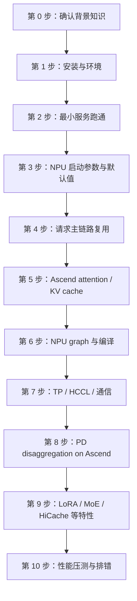
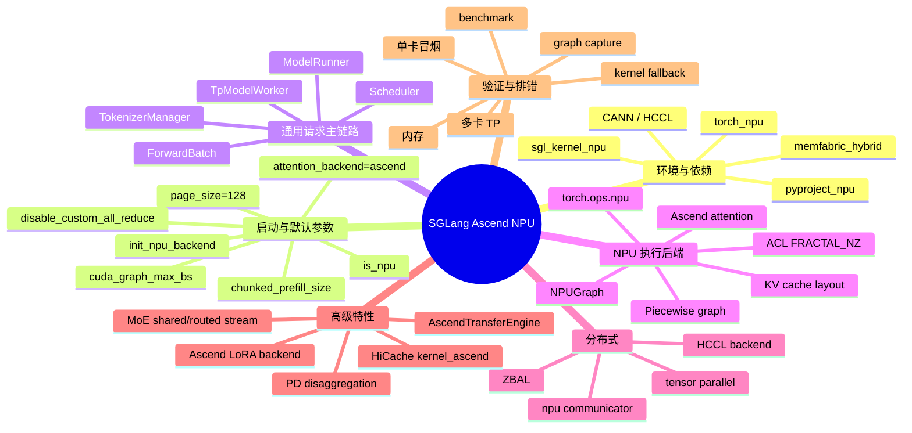
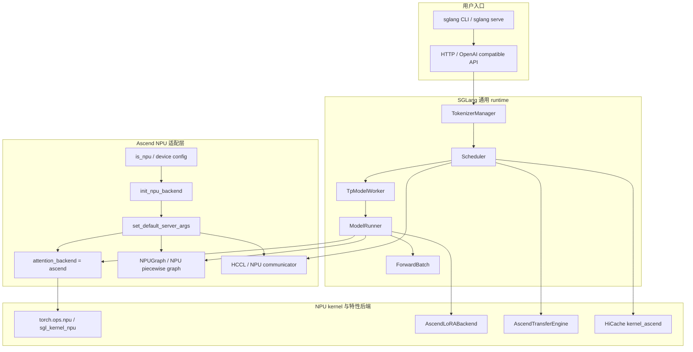
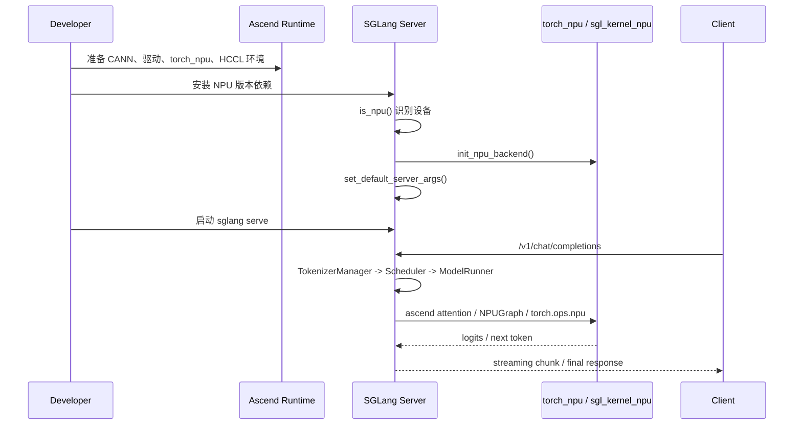
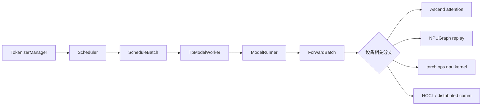
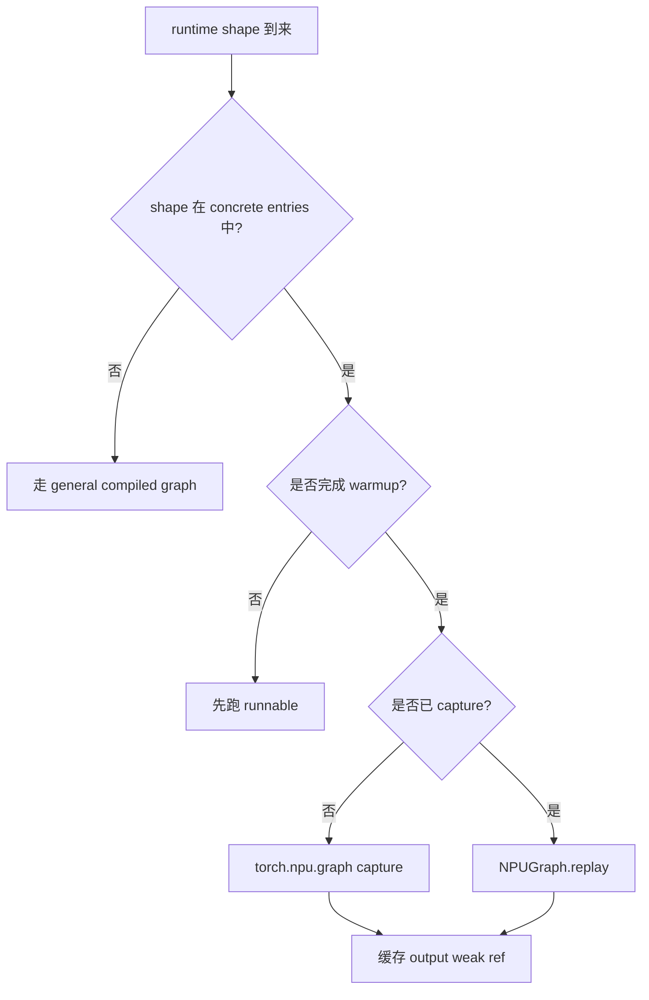
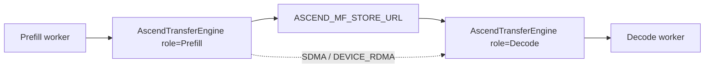

# SGLang Ascend NPU 实践总览

本目录用于拆解 SGLang 在 Ascend NPU 上的适配、部署和源码实践。学习目标不是把 GPU serving 经验简单搬到 NPU，而是建立一条清晰路径：先跑通环境和最小服务，再理解 SGLang 如何识别 NPU、设置默认参数、选择 Ascend 后端，最后深入 attention、graph、分布式通信、PD disaggregation、LoRA 与性能调优。

## 适合谁阅读

- 已经读过 SGLang 普通请求生命周期，知道 `TokenizerManager -> Scheduler -> TpModelWorker -> ModelRunner` 主链路。
- 想在 Ascend 910 系列 NPU 上部署或二次开发 SGLang。
- 想理解 SGLang 源码里 `is_npu()`、`torch_npu`、`hccl`、`ascend` backend、`NPUGraph` 等分支如何接入主流程。

## 学习总览图

一句话主线：**Ascend NPU 适配主要发生在运行环境、设备初始化、默认参数、kernel/backend、通信和少数特性后端；SGLang 的请求调度主链路仍然沿用通用 serving 架构。**

## 思维导图

## 源码地图

| 主题 | 关键源码位置 | 先看什么 |
|---|---|---|
| NPU Python 包配置 | `python/pyproject_npu.toml` | `srt_npu`、`all_npu`、`dev_npu` extras，以及文件里指向 Ascend NPU 文档的注释。 |
| NPU 后端初始化 | `python/sglang/srt/hardware_backend/npu/utils.py` | `init_npu_backend()`、`set_default_server_args()`。 |
| NPU 默认服务参数 | `python/sglang/srt/hardware_backend/npu/utils.py` | attention backend、page size、chunked prefill、graph batch size、custom all reduce、HiCache 配置。 |
| 设备识别与通用工具 | `python/sglang/srt/utils/*`、`python/sglang/srt/configs/device_config.py` | `is_npu()`、设备能力、显存查询、设备配置如何被上层调用。 |
| Graph / 编译 | `python/sglang/srt/compilation/npu_piecewise_backend.py`、`python/sglang/srt/model_executor/cuda_graph_runner.py` | `torch.npu.NPUGraph()`、`torch.npu.graph(...)`、固定 shape replay。 |
| Attention 后端选择 | `python/sglang/srt/layers/attention/attention_registry.py`、`python/sglang/srt/layers/attention/*` | `attention_backend="ascend"` 如何进入具体 attention backend。 |
| 分布式通信 | `python/sglang/srt/distributed/parallel_state.py` | NPU 下的 `hccl` backend、all-reduce / all-gather / reduce-scatter 分支。 |
| Ascend PD 分离 | `python/sglang/srt/disaggregation/ascend/transfer_engine.py`、`python/sglang/srt/disaggregation/ascend/conn.py` | `AscendTransferEngine`、`ASCEND_MF_STORE_URL`、`ASCEND_MF_TRANSFER_PROTOCOL`。 |
| LoRA Ascend 后端 | `python/sglang/srt/lora/backend/ascend_backend.py` | `torch.ops.npu.sgmv_shrink`、`torch.ops.npu.sgmv_expand`。 |
| NPU fallback / 特殊 kernel | `python/sglang/jit_kernel/diffusion/triton/npu_fallback.py`、`python/sglang/srt/speculative/triton_ops/cache_locs.py` | NPU 不适合直接走 Triton/CUDA 分支时如何替代。 |

## 架构分层

读图时注意两条线：

1. 通用 runtime 主链路不因为 NPU 改名，仍然是请求进入、调度、batch、forward、采样、回传。
2. NPU 分支主要在“设备相关决策点”接管，例如 attention backend、graph capture、通信 backend、kernel op 和内存布局。

## 实践流程

## 学习大纲

### 00. 背景预备

目标：确认自己已经知道通用 serving 主链路。

建议先读：

- `learning/sglang-source-reading/01-request-lifecycle.md`
- `learning/sglang-source-reading/04-model-runner-attention.md`
- `learning/tp-worker-model-runner/01-architecture.md`

读完后应该能回答：

- `ScheduleBatch` 和 `ForwardBatch` 分别属于哪一层？
- prefill 和 decode 为什么需要不同的 attention metadata？
- `ModelRunner` 为什么是设备后端最集中的入口之一？

### 01. 安装与依赖

目标：把 NPU 版本的 Python 包、Ascend runtime 和 SGLang extra 关系理清。

重点：

- `python/pyproject_npu.toml` 中的 NPU extras。
- `torch_npu` 与 `sgl_kernel_npu` 是 NPU 运行时能力的核心入口。
- CANN、驱动、HCCL 和 Python 环境需要互相匹配。

产出：

- 一份“环境检查清单”。
- 一条最小安装命令记录。
- 一条 `python -c` 级别的 NPU 可用性检查。

### 02. 最小服务跑通

目标：不要一开始就研究所有 kernel，先证明服务能启动、能返回 token。

建议路径：

1. 单卡启动一个小模型或本地测试模型。
2. 发送 OpenAI-compatible chat completion 请求。
3. 记录启动日志中的设备、attention backend、graph、显存信息。
4. 再打开流式输出、较长 prompt、不同 batch size 做基本验证。

### 03. NPU 默认参数

目标：理解 SGLang 为什么在 NPU 上主动改默认值。

核心源码：`python/sglang/srt/hardware_backend/npu/utils.py`

重点函数：

- `init_npu_backend()`
- `set_default_server_args(args)`
- `npu_format_cast(...)`
- `init_zbal(...)`
- `lazy_init_zbal_gva_mem(...)`

需要理解的默认值：

| 参数/行为 | NPU 默认处理 | 为什么重要 |
|---|---|---|
| `attention_backend` | 设置为 `ascend` | 避免走 CUDA/Triton 专用 attention。 |
| `prefill_attention_backend` | 设置为 `ascend` | prefill 需要 NPU 可用 kernel 和 metadata。 |
| `decode_attention_backend` | 设置为 `ascend` | decode 低延迟路径需要固定后端。 |
| `page_size` | 缺省时设为 `128` | KV cache page 粒度会影响内存和 attention。 |
| `chunked_prefill_size` | 按 NPU 显存容量设置 | 控制长 prompt prefill 峰值。 |
| `cuda_graph_max_bs` | 按显存和 TP size 设置 | 这里名字沿用 CUDA graph，但 NPU 走 `NPUGraph` 语义。 |
| `disable_custom_all_reduce` | 设为 `True` | NPU 不走 CUDA custom all-reduce。 |
| HiCache | `kernel_ascend` 与特定 layout | 分层 KV cache 需要适配 Ascend kernel。 |

### 04. 请求主链路中的 NPU 接入点

目标：把“通用链路”和“NPU 分支”拼起来。

读源码时的判断方法：

- 如果代码在处理请求对象、队列、batch 策略，通常是通用 SGLang 逻辑。
- 如果代码在处理 device、stream、graph、kernel、通信 backend、tensor format，通常是 NPU 适配逻辑。

### 05. Attention 与 KV cache

目标：理解 NPU 后端最核心的性能路径。

重点问题：

- `attention_backend="ascend"` 在哪里被解析？
- prefill 和 decode 是否共用同一个 backend？
- KV cache 的 page size、layout、dtype 对 Ascend kernel 有什么约束？
- HiCache 打开后，`hicache_io_backend="kernel_ascend"` 和 layout 如何改变读写路径？

阅读建议：

1. 先从 attention registry 找到 `"ascend"` 对应后端。
2. 再看 `ModelRunner.init_attention_backend()` 一类入口如何初始化 backend。
3. 最后回到 `ForwardBatch`，看 attention metadata 是如何进入 model forward 的。

### 06. NPU Graph 与编译

目标：理解固定 shape replay 如何降低 decode 开销。

核心源码：`python/sglang/srt/compilation/npu_piecewise_backend.py`

关键概念：

- `torch.npu.NPUGraph()`
- `torch.npu.graph(npugraph, pool=...)`
- warmup 后 capture
- replay 时要求输入地址稳定
- piecewise graph 把模型拆成多个可捕获片段

### 07. TP / HCCL / 通信

目标：理解多卡 Ascend 下为什么通信分支不同。

核心源码：`python/sglang/srt/distributed/parallel_state.py`

重点：

- NPU 的默认分布式 backend 会落到 `hccl`。
- NPU 下部分 all-gather、reduce-scatter、all-reduce 会走专门 communicator 或 torch distributed 分支。
- `disable_custom_all_reduce=True` 会影响 CUDA custom all-reduce 相关优化是否启用。
- ZBAL 相关环境变量会改变本地内存和通信初始化路径。

实践建议：

- 先跑单卡，再跑 `tp_size=2`。
- 观察 HCCL 初始化日志、rank 映射、显存占用。
- 再验证长 prompt、continuous batching、streaming 是否稳定。

### 08. Ascend PD Disaggregation

目标：理解 Prefill/Decode 分离在 Ascend 上如何传 KV。

核心源码：

- `python/sglang/srt/disaggregation/ascend/transfer_engine.py`
- `python/sglang/srt/disaggregation/ascend/conn.py`

关键对象：`AscendTransferEngine`

关键环境变量：

| 变量 | 用途 |
|---|---|
| `ASCEND_MF_STORE_URL` | Ascend transfer engine 的集中存储地址。 |
| `ASCEND_MF_TRANSFER_PROTOCOL` | 可选 `device_rdma` 或 `sdma`。 |

流程图：

注意：

- 如果使用 `device_rdma`，源码会提前通过 all-gather 初始化 HCCL，避免 RDMA 初始化冲突。
- 如果缺少 `memfabric_hybrid`，`AscendTransferEngine` 会在初始化时报错。

### 09. LoRA / MoE / 特性分支

目标：知道哪些特性在 Ascend 上有专门实现，哪些可能走 fallback。

LoRA：

- 核心源码：`python/sglang/srt/lora/backend/ascend_backend.py`
- 关键 kernel：`torch.ops.npu.sgmv_shrink`、`torch.ops.npu.sgmv_expand`
- 关键输入：`LoRABatchInfo` 中的 `weight_indices`、`seg_lens`、`scalings`

MoE：

- NPU utility 里有 shared expert / routed expert stream 管理。
- 读 MoE 前先理解 `process_shared_expert(...)`、`process_routed_expert(...)` 如何用独立 stream 包裹计算。

Fallback：

- NPU 不适合直接复用 CUDA/Triton kernel 的地方，通常会出现 fallback 或 `disable=_is_npu` 之类分支。
- 看到 fallback 时先判断：它是正确性兜底，还是性能降级路径。

### 10. 性能压测与排错

目标：建立“先正确、再稳定、最后性能”的验证顺序。

建议验证矩阵：

| 场景 | 先看指标 | 常见问题 |
|---|---|---|
| 单卡最小请求 | 能否返回、首 token 延迟 | 依赖没装、backend 没切到 ascend。 |
| 长 prompt prefill | prefill 耗时、显存峰值 | `chunked_prefill_size` 不合适、KV cache 不足。 |
| decode 多 batch | tokens/s、延迟抖动 | graph capture shape 不匹配、batch size 超出 graph 配置。 |
| TP 多卡 | HCCL 初始化、rank 日志 | 通信环境、网卡、rank/device 映射。 |
| PD 分离 | KV transfer 成功率 | `memfabric_hybrid`、store URL、传输协议。 |
| LoRA | adapter 加载与输出正确性 | Ascend LoRA backend、segment 信息、rank 限制。 |

排错顺序：

1. 先确认 `torch_npu` 和 NPU 设备可见。
2. 再确认 SGLang 日志里是否识别为 NPU。
3. 再确认 `attention_backend`、`prefill_attention_backend`、`decode_attention_backend` 都是 `ascend`。
4. 单卡跑通后再打开 TP、HiCache、LoRA、PD 分离。
5. 如果性能异常，优先看 graph 是否 capture/replay、是否走 fallback、是否频繁触发格式转换或内存搬运。

## 后续拆分计划

本目录后续建议按下面顺序继续扩展：

1. [00-background.md](./00-background.md)：Ascend NPU 背景知识，梳理硬件、CANN、torch_npu、HCCL、KV cache、attention、graph、PD 等前置概念。
2. [01-environment-and-install.md](./01-environment-and-install.md)：GNU/Linux + Ascend NPU 服务器上的安装、环境检查、Docker/源码部署和最小服务跑通。
3. [02-ascend-npu-integration-map.md](./02-ascend-npu-integration-map.md)：Ascend NPU 全量源码接入点、初始化流程、调用关系和知识图谱。
4. [03-launch-and-minimal-serving.md](./03-launch-and-minimal-serving.md)：单卡服务启动、请求验证、日志解读。
5. [04-npu-backend-args.md](./04-npu-backend-args.md)：`set_default_server_args()` 逐行讲解。
6. [05-attention-kv-cache.md](./05-attention-kv-cache.md)：Ascend attention、KV cache、HiCache。
7. [06-npu-graph-compilation.md](./06-npu-graph-compilation.md)：`NPUGraph`、piecewise graph、shape 与 replay。
8. [07-distributed-hccl-tp.md](./07-distributed-hccl-tp.md)：TP、HCCL、communicator、ZBAL。
9. [08-ascend-pd-disaggregation.md](./08-ascend-pd-disaggregation.md)：Ascend PD 分离与 KV transfer。
10. [09-lora-moe-feature-branches.md](./09-lora-moe-feature-branches.md)：Ascend LoRA、MoE stream、fallback。
11. [10-benchmark-debugging.md](./10-benchmark-debugging.md)：压测方法、日志定位、性能问题排查。

## 第一轮阅读任务

读完这份总览后，建议立刻做三件事：

1. 打开 `python/sglang/srt/hardware_backend/npu/utils.py`，用自己的话解释 `set_default_server_args()` 改了哪些参数。
2. 打开 `python/sglang/srt/compilation/npu_piecewise_backend.py`，画出 warmup、capture、replay 三个阶段。
3. 打开 `python/sglang/srt/disaggregation/ascend/transfer_engine.py`，说明 `sdma` 和 `device_rdma` 的初始化差异。

如果这三件事能讲清楚，就已经抓住了 SGLang Ascend NPU 学习线的骨架。
