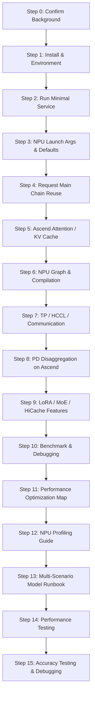
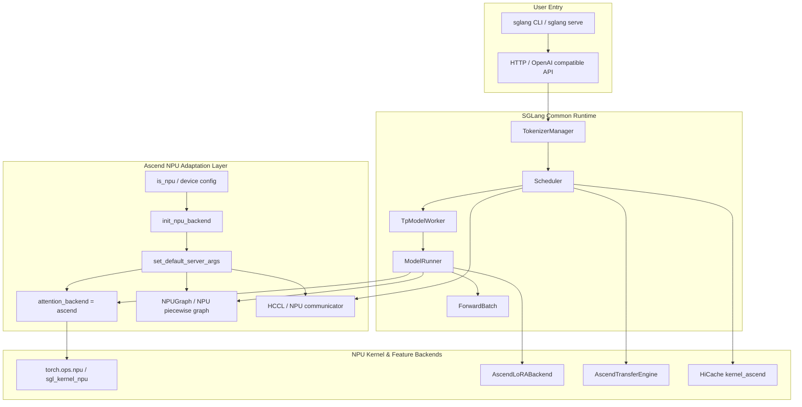
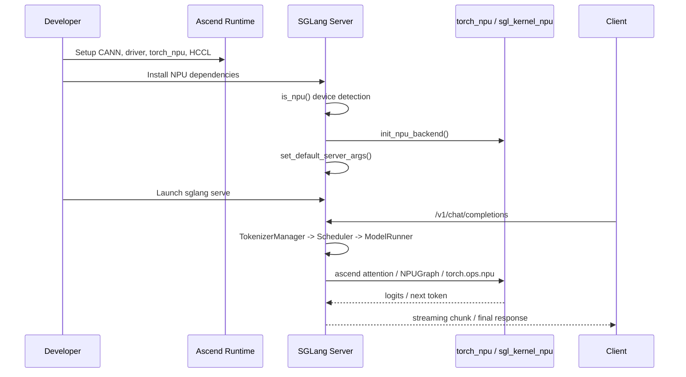

[中文](./README.md) | [English](./README_EN.md)

# SGLang Ascend NPU Practice Overview

This directory breaks down SGLang's adaptation, deployment, and source code practice on Ascend NPU. The learning goal is not to simply transplant GPU serving experience to NPU, but to establish a clear path: first get the environment and minimal service running, then understand how SGLang identifies NPU, sets default parameters, selects Ascend backends, and finally dive deep into attention, graph, distributed communication, PD disaggregation, LoRA, and performance tuning.

To track Ascend source code branches by component, enter [source-code-walkthrough](./source-code-walkthrough/README.md). That topic first establishes a complete component map of SGLang & `sgl-kernel-npu`, then uses GLM-4.7-Flash to trace an end-to-end model execution path, and finally explains branch entry points, initialization & runtime call chains, internal code composition, kernel/communication boundaries, and verification methods component by component.

## Who Should Read

- Already familiar with SGLang's standard request lifecycle, knowing the `TokenizerManager -> Scheduler -> TpModelWorker -> ModelRunner` main chain.
- Want to deploy or develop SGLang on Ascend 910 series NPU.
- Want to understand how `is_npu()`, `torch_npu`, `hccl`, `ascend` backend, `NPUGraph` and other branches integrate into SGLang's main flow.

## Learning Overview

One-sentence summary: **Ascend NPU adaptation primarily occurs in runtime environment, device initialization, default parameters, kernel/backend, communication, and a few feature backends; SGLang's request scheduling main chain still follows the general serving architecture.**

## Source Code Map

| Topic | Key Source Locations | What to Read First |
|---|---|---|
| NPU Python Package Config | `python/pyproject_npu.toml` | `srt_npu`, `all_npu`, `dev_npu` extras |
| NPU Backend Init | `python/sglang/srt/hardware_backend/npu/utils.py` | `init_npu_backend()`, `set_default_server_args()` |
| NPU Default Server Args | `python/sglang/srt/hardware_backend/npu/utils.py` | attention backend, page size, chunked prefill, graph batch size, custom all reduce, HiCache config |
| Device Detection & Utils | `python/sglang/srt/utils/*`, `python/sglang/srt/configs/device_config.py` | `is_npu()`, device capability, memory query |
| Graph / Compilation | `python/sglang/srt/compilation/npu_piecewise_backend.py`, `python/sglang/srt/model_executor/cuda_graph_runner.py` | `torch.npu.NPUGraph()`, fixed shape replay |
| Attention Backend Selection | `python/sglang/srt/layers/attention/attention_registry.py` | How `attention_backend="ascend"` routes to specific backend |
| Distributed Communication | `python/sglang/srt/distributed/parallel_state.py` | NPU `hccl` backend, all-reduce/all-gather/reduce-scatter branches |
| Ascend PD Disaggregation | `python/sglang/srt/disaggregation/ascend/transfer_engine.py`, `.../conn.py` | `AscendTransferEngine`, env vars |
| LoRA Ascend Backend | `python/sglang/srt/lora/backend/ascend_backend.py` | `torch.ops.npu.sgmv_shrink`, `torch.ops.npu.sgmv_expand` |
| NPU Fallback / Special Kernels | `python/sglang/jit_kernel/diffusion/triton/npu_fallback.py` | How NPU avoids Triton/CUDA-only paths |

## Architecture Layers

Two lines to follow when reading the diagram:

1. The common runtime main chain does not change names for NPU — it's still request entry, scheduling, batch, forward, sampling, return.
2. NPU branches mainly take over at "device-related decision points," such as attention backend, graph capture, communication backend, kernel ops, and memory layout.

## Practice Flow

## Learning Outline

### 00. Background Preparation

Goal: Confirm you already know the general serving main chain.

### 01. Install & Dependencies

Goal: Clarify the relationships between NPU Python packages, Ascend runtime, and SGLang extras.

### 02. Minimal Service

Goal: Don't study all kernels at once — first prove the service can start and return tokens.

### 03. NPU Default Parameters

Goal: Understand why SGLang proactively changes defaults on NPU.

| Parameter/Behavior | NPU Default | Why Important |
|---|---|---|
| `attention_backend` | Set to `ascend` | Avoid CUDA/Triton-only attention |
| `prefill_attention_backend` | Set to `ascend` | Prefill needs NPU-compatible kernels |
| `decode_attention_backend` | Set to `ascend` | Decode low-latency path needs fixed backend |
| `page_size` | Default to `128` | KV cache page granularity affects memory & attention |
| `chunked_prefill_size` | Set by NPU memory capacity | Controls long prompt prefill peak |
| `cuda_graph_max_bs` | Set by memory & TP size | Uses NPUGraph semantics |
| `disable_custom_all_reduce` | Set to `True` | NPU doesn't use CUDA custom all-reduce |
| HiCache | `kernel_ascend` with specific layout | Hierarchical KV cache needs Ascend kernel adaptation |

### 04. NPU Integration Points in Request Main Chain

Goal: Piece together the "common chain" and "NPU branches."

### 05. Attention & KV Cache

Goal: Understand the most critical performance path for NPU backend.

### 06. NPU Graph & Compilation

Goal: Understand how fixed shape replay reduces decode overhead.

### 07. TP / HCCL / Communication

Goal: Understand why communication branches differ for multi-card Ascend.

### 08. Ascend PD Disaggregation

Goal: Understand how KV is transferred in Prefill/Decode separation on Ascend.

### 09. LoRA / MoE / Feature Branches

Goal: Know which features have dedicated Ascend implementations and which may fall back.

### 10. Benchmark & Debugging

Goal: Establish the "correctness first, then stability, finally performance" verification order.

### 11. Performance Optimization Work Map

Goal: For new developers of both SGLang and `sglang-kernel-npu`, establish a holistic map of optimization categories.

### 12. NPU Profiling Guide

Goal: Establish a reproducible SGLang-NPU profiling workflow.

### 13. Multi-Scenario Model Runbook

Goal: Organize single-card, multi-card, PD disaggregation, online/offline models, LoRA, MoE, quantization, multimodal, and long-context scenarios into copy-paste launch templates.

### 14. Performance Testing

Goal: Establish reproducible SGLang-NPU performance testing workflows.

### 15. Accuracy Testing & Debugging

Goal: Establish reproducible model accuracy testing and precision issue localization along SGLang's execution flow.
