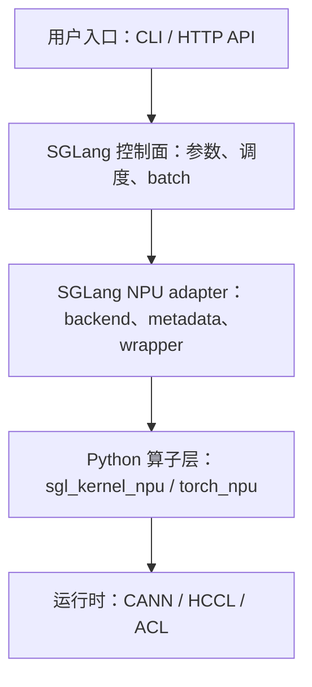
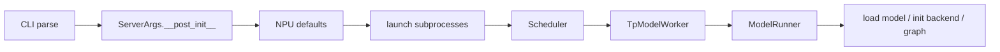

# 00. 源码阅读方法与 Ascend 分支搜索法

本讲建立后续源码串讲统一采用的阅读方法。目标不是记住所有文件，而是能够从一个用户行为出发，稳定找到 Ascend NPU 分支、调用对象、外部 kernel 和验证入口。

## 本讲目标

- 区分平台识别、backend 注册、专用算子和 fallback。
- 从 `sglang serve` 参数反向追踪到实际类和函数。
- 判断实现属于 SGLang、`sglang-kernel-npu`、`torch_npu` 还是 CANN/HCCL。
- 分别画出初始化调用链和请求执行调用链。
- 用运行证据证明请求确实进入目标分支。

## 1. 先固定源码版本

```bash
cd /sgl-workspace/sglang
git rev-parse HEAD
git status --short

python3 - <<'PY'
from importlib.metadata import PackageNotFoundError, version

for package in ["sglang", "sgl-kernel-npu", "torch", "torch-npu"]:
    try:
        print(package, version(package))
    except PackageNotFoundError:
        print(package, "not installed")
PY
```

每份阅读笔记开头统一记录：

```text
SGLang commit:
sglang-kernel-npu commit:
torch / torch_npu:
CANN / driver:
模型:
启动命令:
```

源码路径和分支条件会变化。没有 commit 的调用链很难复现。

## 2. 五层源码边界



### 2.1 用户入口

包括 `sglang serve`、HTTP API，以及 graph、TP、PD、LoRA、量化等参数。阅读问题是：用户提供了什么，SGLang 又自动补齐了什么？

### 2.2 SGLang 控制面

典型对象：

- `ServerArgs`
- `TokenizerManager`
- `Scheduler`
- `ScheduleBatch`
- `TpModelWorker`
- `ForwardBatch`
- `ModelRunner`

这些对象大多跨平台复用。NPU backend 使用的 shape、position、KV index 和 sampling metadata 都由控制面产生，因此不能跳过。

### 2.3 SGLang NPU adapter

典型路径：

```text
python/sglang/srt/hardware_backend/npu/
python/sglang/srt/disaggregation/ascend/
python/sglang/srt/lora/backend/ascend_backend.py
python/sglang/srt/distributed/device_communicators/npu_communicator.py
```

adapter 负责把通用对象转换成 Ascend kernel 需要的参数、metadata、dtype、shape、layout 和 stream。

### 2.4 Python 算子层

常见形式：

```python
import sgl_kernel_npu
import torch_npu

torch_npu.npu_rms_norm(...)
torch.ops.npu.npu_format_cast(...)
```

读到算子调用时要记录输入 shape、dtype、device、layout，输出语义，是否原地修改，以及是否有 native fallback。

### 2.5 CANN/HCCL/ACL

进入 `torch_npu` 或自定义 op 后已经跨越 SGLang 仓库边界。profiling 中看到的设备 kernel、通信任务和 format cast 通常属于这一层。

## 3. 六种 Ascend 分支形式

### 3.1 平台判断

```bash
rg "def is_npu|is_npu\(" python/sglang/srt
rg 'device == "npu"|device != "npu"' python/sglang/srt
```

典型用途是导入专用包、覆盖默认参数、禁用某项优化或选择 NPU communicator。

### 3.2 Registry 选择

```bash
rg 'register.*ascend|backend.*ascend|"ascend"' \
  python/sglang/srt/layers \
  python/sglang/srt/hardware_backend \
  python/sglang/srt/lora
```

典型调用链：

```text
字符串参数
  -> 注册表字典
  -> factory function
  -> backend class
  -> wrapper
```

只搜索类名会漏掉“为什么选中这个类”。

### 3.3 动态导入

```bash
rg "import torch_npu|import sgl_kernel_npu" python/sglang -n
```

需要判断导入发生在模块 import、ServerArgs 初始化、ModelRunner 初始化还是第一次 forward。导入时机决定错误出现在哪个进程和阶段。

### 3.4 专用算子

```bash
rg "torch_npu\.npu_|torch\.ops\.npu" python/sglang/srt -n
```

建议用表格记录：

| 调用点 | 输入 | 输出 | fallback |
|---|---|---|---|
| `layernorm.py` | hidden、weight、eps | normalized output | PyTorch norm |

### 3.5 默认参数覆盖

```bash
rg "set_default_server_args|_handle_npu_backends" python/sglang/srt -n
```

用户未显式指定 backend 时，NPU handler 也可能把字段改为 `ascend`，再由通用 registry 选择实现。

### 3.6 禁用和 fallback

```bash
rg "fallback|not support|disable.*npu|if.*is_npu" python/sglang/srt -n
```

必须区分：

- **不支持**：明确报错。
- **正确性 fallback**：能运行但可能慢。
- **参数覆盖**：用户值被平台值替换。
- **特性禁用**：某种优化在 NPU 下关闭。

## 4. 初始化链和请求链要分开

### 4.1 初始化调用链



### 4.2 请求执行调用链


backend 通常只初始化一次，但它的请求期方法每个 batch 都会执行。不要把两者画在同一时间线上。

## 5. 完整追踪示例：Ascend Attention

### 5.1 找参数

```bash
rg "attention_backend" python/sglang/srt/server_args.py
```

### 5.2 找 NPU 默认值

```bash
rg 'attention_backend = "ascend"' \
  python/sglang/srt/hardware_backend/npu \
  python/sglang/srt/server_args.py
```

### 5.3 找 registry

```bash
rg 'register_attention_backend\("ascend"' \
  python/sglang/srt/layers/attention
```

### 5.4 找 backend 初始化

```bash
rg "init_attention_backend|_get_attention_backend_from_str" \
  python/sglang/srt/model_executor/model_runner.py
```

### 5.5 找请求期方法

```bash
rg "init_forward_metadata|forward_extend|forward_decode" \
  python/sglang/srt/hardware_backend/npu/attention/ascend_backend.py
```

最终链路应记录成：

```text
ServerArgs._handle_npu_backends
  -> set_default_server_args
  -> attention_backend = "ascend"
  -> ModelRunner.init_attention_backend
  -> ATTENTION_BACKENDS["ascend"]
  -> AscendAttnBackend
  -> init_forward_metadata
  -> extend/decode kernel path
```

## 6. 如何验证追踪结果

### 6.1 静态证据

- 找到分支条件。
- 找到 factory/registry。
- 找到类构造位置。
- 找到请求期方法。
- 找到外部 op 或 fallback。

### 6.2 运行证据

- 启动日志显示 `device=npu` 和 `attention_backend=ascend`。
- 在最小复现环境临时加日志或断点。
- profiling 中出现对应 NPU kernel。
- 关闭该特性后，调用链发生预期变化。

不要只凭文件名判断请求进入了某个分支。

## 7. 阅读记录模板

```markdown
# 特性名称

## 入口
- CLI/API：
- ServerArgs 字段：

## 分支
- 条件：
- registry/factory：
- 实现类：

## 初始化链

## 请求链

## 数据结构
- shape：
- dtype：
- layout：
- device：

## 外部边界
- sglang-kernel-npu：
- torch_npu：
- CANN/HCCL：

## fallback

## 验证方法
```

## 8. 练习

1. 找出 `AscendLoRABackend` 通过哪个 registry 被选择。
2. 找出 NPU 为什么不使用 CUDA custom all-reduce。
3. 找出 `ForwardInputBuffers.share_buffers()` 在 NPU 上的行为。
4. 找出 PD transfer backend 如何映射到 `AscendKVManager`。
5. 分别画出 attention backend 的初始化链和请求执行链。

## 本讲小结

阅读 Ascend NPU 源码的关键不是全局搜索一个 `npu` 字符串，而是从入口开始依次确认：参数怎样确定、分支怎样选择、类何时创建、请求数据怎样进入、最终调用哪个算子，以及失败时怎样 fallback。后续每讲都沿用这套方法。
