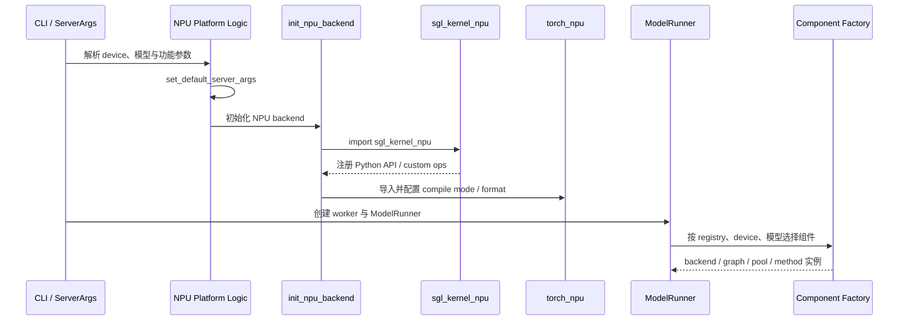
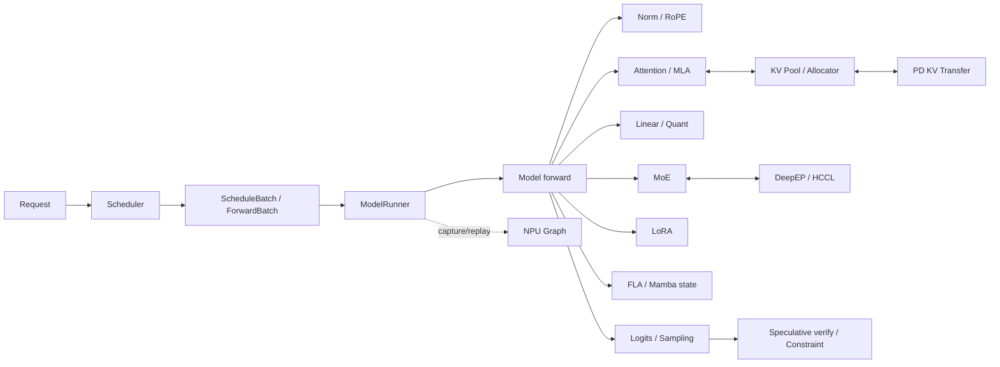
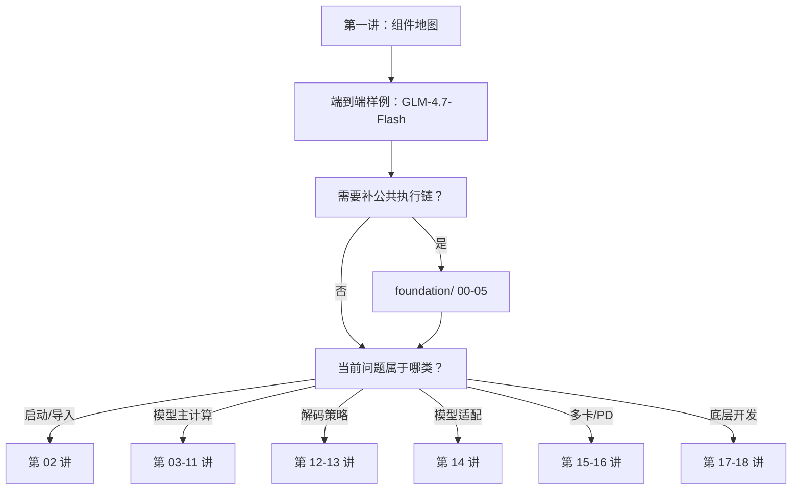

# 第一讲：SGLang NPU 全组件与双仓目录总览

本讲不急着进入某个大文件逐行阅读，而是先建立一张稳定的组件地图。以后看到 `is_npu()`、`attention_backend="ascend"`、`torch.ops.npu.*` 或 `sgl_kernel_npu.*` 时，先判断代码属于哪一层、哪个组件，再沿着该组件的调用链继续阅读。

## 1. 本讲目标

完成本讲后，应能回答：

1. SGLang NPU 由哪些主要组件组成？
2. 每个组件在 SGLang 和 `sgl-kernel-npu` 中分别位于哪里？
3. 哪些能力由 SGLang 编排，哪些由 `sgl_kernel_npu`、`torch_npu`、CANN、HCCL 或 DeepEP 实现？
4. NPU 分支有哪些常见形态，为什么不能只搜索 `if device == "npu"`？
5. 一个组件从初始化到请求执行，通常会经过哪些对象和算子边界？
6. 后续应进入哪一讲继续阅读某个组件？

## 2. 先定义“组件”

本系列把满足以下条件之一的代码集合视为一个组件：

- 有独立的 backend、runner、manager、method 或 registry；
- 有独立的运行时状态，例如 graph pool、KV pool、communication buffer；
- 对 tensor 的 shape、dtype、layout 或生命周期有明确契约；
- 在 `sgl-kernel-npu` 中有独立 Python 子包、custom op 或 `csrc/` 实现；
- 可以独立测试、benchmark、profiling 或发生 fallback；
- 修改后会形成相对清晰的 SGLang/kernel 双仓提交边界。

因此，“NPU 支持”不是一个单独 backend，而是一组通过注册表、工厂函数、模型类型和运行时条件拼装起来的组件。

## 3. 双仓关系：控制面与数据面

### 3.1 SGLang 负责什么

SGLang 主要负责控制面和运行时编排：

```text
用户参数 / 模型配置
  -> 平台识别与能力校验
  -> backend、method、runner、manager 选择
  -> 对象初始化与状态持有
  -> Scheduler 组织请求和 batch
  -> ModelRunner 驱动模型 forward
  -> 为 NPU 算子准备 tensor、metadata、stream 和通信组
```

SGLang 中最集中的 NPU 目录是：

```text
python/sglang/srt/hardware_backend/npu/
├── attention/
│   ├── ascend_backend.py
│   ├── ascend_gdn_backend.py
│   ├── ascend_hybrid_linear_attn_backend.py
│   ├── ascend_torch_native_backend.py
│   └── mla_preprocess.py
├── graph_runner/
│   ├── npu_graph_runner.py
│   ├── vit_npu_graph_runner.py
│   ├── eagle_draft_npu_graph_runner.py
│   └── eagle_draft_extend_npu_graph_runner.py
├── modules/
│   ├── deepseek_v2_attention_mla_npu.py
│   ├── glm46v_processor.py
│   └── qwen_vl_processor.py
├── moe/
│   ├── fuseep.py
│   └── topk.py
├── quantization/
│   ├── awq_kernels.py
│   ├── fused_moe_method_npu.py
│   ├── gptq_kernels.py
│   └── linear_method_npu.py
├── allocator_npu.py
├── cmo.py
├── memory_pool_npu.py
└── utils.py
```

这个目录不是全部。下列通用目录也包含关键 Ascend 接入点：

```text
python/sglang/srt/
├── server_args.py
├── layers/attention/attention_registry.py
├── model_executor/model_runner.py
├── layers/{activation,layernorm,sampler}.py
├── layers/rotary_embedding/
├── lora/backend/{lora_registry,ascend_backend}.py
├── distributed/{parallel_state,communication_op}.py
├── distributed/device_communicators/npu_communicator.py
├── disaggregation/ascend/{conn,transfer_engine}.py
├── speculative/
├── constrained/xgrammar_backend.py
└── models/
```

结论是：`hardware_backend/npu/` 是 NPU adapter 的核心，但组件的“选择入口”经常在通用目录中。

### 3.2 sgl-kernel-npu 负责什么

官方 `sgl-kernel-npu` 仓库由两部分构成：

- `sgl_kernel_npu`：面向 SGLang 推理的 NPU kernel Python 包；
- `deep_ep`：面向 MoE Expert Parallel 的 DeepEP-Ascend 包。

仓库顶层结构：

```text
sgl-kernel-npu/
├── python/
├── csrc/
├── include/
├── benchmark/
├── tests/
├── docs/
├── cmake/
├── scripts/
├── CMakeLists.txt
└── build.sh
```

`sgl_kernel_npu` Python 包的主要组件：

```text
python/sgl_kernel_npu/sgl_kernel_npu/
├── activation/
├── attention/
├── fla/
├── mamba/
├── mem_cache/
├── moe/
├── norm/
├── sample/
├── utils/
├── kvcacheio.py
└── speculative.py
```

当前官方仓库的 `csrc/` 可以看到这些算子或基础设施目录：

```text
csrc/
├── alloc_extend/
├── apply_token_bitmask/
├── assign_cache_op/
├── attentions/
├── batch_matmul_transpose/
├── build_tree/
├── cache_location_assign/
├── catlass/
├── causal_conv1d/
├── causal_conv1d_update/
├── deepep/
├── lightning_indexer/
├── lora/
├── mega_chunk_gdn/
├── mla_preprocess/
├── recurrent_gated_delta_rule/
├── transfer_kv_dim_exchange/
├── tri_inv/
├── utils/
├── pytorch_extensions.cpp
└── CMakeLists.txt
```

不同 commit 的目录会变化，阅读时要以实际 checkout 为准。官方入口：

- [sgl-kernel-npu](https://github.com/sgl-project/sgl-kernel-npu)
- [SGLang](https://github.com/sgl-project/sglang)

## 4. 全组件清单

下表是后续课程的主索引。

| 编号 | 组件 | SGLang 主要位置 | kernel/外部实现 | 后续讲次 |
|---|---|---|---|---|
| C01 | 平台与运行时接入 | `server_args.py`、`hardware_backend/npu/utils.py` | `sgl_kernel_npu` 包初始化、`torch_npu` | 02 |
| C02 | Attention / MLA | `attention_registry.py`、`npu/attention/` | `attention/`、`csrc/attentions`、CANN FIA | 03 |
| C03 | KV cache 与内存 | `memory_pool_npu.py`、`allocator_npu.py`、`mem_cache/` | `mem_cache/`、`kvcacheio.py`、cache/allocator csrc | 04 |
| C04 | NPU Graph 与编译 | `npu/graph_runner/`、`compilation/` | `torch.npu.NPUGraph`、`torch.compile` | 05 |
| C05 | Norm / RoPE / Activation | `layers/layernorm.py`、`rotary_embedding/`、`activation.py` | `norm/`、`activation/`、`torch_npu` | 06 |
| C06 | 量化与 Linear | `npu/quantization/linear_method_npu.py`、AWQ/GPTQ | `torch.ops.npu`、`torch_npu`、CANN matmul | 07 |
| C07 | MoE 路由与 Expert 计算 | `npu/moe/topk.py`、`fused_moe_method_npu.py` | `moe/`、NPU grouped matmul/routing ops | 08 |
| C08 | DeepEP-Ascend / FuseEP | `npu/moe/fuseep.py`、MoE method 分支 | `python/deep_ep/`、`csrc/deepep/` | 09 |
| C09 | LoRA | `lora/backend/ascend_backend.py` | `csrc/lora/`、SGMV/BGMV/SGEMMV ops | 10 |
| C10 | FLA / Mamba / Hybrid Attention | `ascend_gdn_backend.py`、`ascend_hybrid_linear_attn_backend.py` | `fla/`、`mamba/`、GDN/conv/state csrc | 11 |
| C11 | Speculative decoding | `speculative/`、EAGLE NPU graph runners | `sample/`、`speculative.py`、`csrc/build_tree` | 12 |
| C12 | Sampling 与约束解码 | `layers/sampler.py`、`constrained/` | `sample/`、`apply_token_bitmask/`、`torch_npu` | 13 |
| C13 | 模型专用与多模态适配 | `npu/modules/`、`models/` | MLA preprocess、batch matmul、模型专用算子 | 14 |
| C14 | 分布式与 HCCL | `layers/communicator.py`、`parallel_state.py`、`npu_communicator.py` | HCCL、`torch.distributed`、`torch_npu` | 15 |
| C15 | PD 分离与 KV 传输 | `disaggregation/ascend/` | memfabric、SDMA/RDMA、KV transfer ops | 16 |
| C16 | 工具算子与内存优化 | `npu/cmo.py`、模型 indexer 分支 | lightning indexer、tri-inv、batch matmul | 17 |
| C17 | 构建、注册、测试与 benchmark | `pyproject_npu.toml`、SGLang tests | `build.sh`、CMake、`pytorch_extensions.cpp`、tests/benchmark | 18 |

### 4.1 这张表中最容易混淆的边界

**Attention 与 KV cache**：attention 决定如何读取和计算，KV cache 组件决定缓存的分配、索引、布局、写入和回收。两者共享 metadata，但生命周期不同。

**MoE 与 DeepEP**：MoE 组件包含 gating、top-k、expert matmul、activation 和 combine；DeepEP 是多卡 Expert Parallel 下的 token dispatch/combine 通信组件，不等于整个 MoE forward。

**NPU Graph 与 kernel**：graph runner 捕获的是一段完整执行图，不是某个独立数学算子。它通常由 `torch.npu.NPUGraph` 和 `torch.compile` 提供，`sgl-kernel-npu` 中没有与整个 graph runner 一一对应的目录。

**`torch.ops.npu` 与 `sgl_kernel_npu`**：同为 `npu` namespace 不代表同一个仓库。部分 op 由 `torch_npu`/CANN 提供，部分 custom op 需要先导入 `sgl_kernel_npu` 才完成注册。归属判断必须检查注册代码、构建文件和 import 前置条件。

## 5. NPU 组件是怎样被选中的

SGLang 使用多种分支机制。只搜索 `if device == "npu"` 会漏掉大量路径。

### 5.1 平台识别分支

典型形式：

```python
if is_npu():
    ...
```

它常用于：

- 选择 device API、stream 和 event；
- 设置 NPU 默认参数；
- 关闭 CUDA/Triton 专用能力；
- 导入 NPU 专用模块；
- 选择 memory pool、graph runner 或 communicator。

### 5.2 参数覆盖与默认值分支

`hardware_backend/npu/utils.py` 中的 `set_default_server_args()` 会把 attention backend 设为 `ascend`，并根据设备内存、TP size 等条件设置 page size、chunked prefill、graph batch size 和 HiCache backend。

这一步把“当前平台是 NPU”转换成后续 registry 可识别的字符串或配置对象。

### 5.3 Registry 分支

Attention 的典型路径：

```text
set_default_server_args
  -> attention_backend = "ascend"
  -> ATTENTION_BACKENDS["ascend"]
  -> create_ascend_backend(runner)
  -> AscendAttnBackend(runner)
```

LoRA 的典型路径：

```text
lora_backend = "ascend"
  -> LORA_SUPPORTED_BACKENDS["ascend"]
  -> create_ascend_backend()
  -> AscendLoRABackend
```

Registry 把通用配置与平台专用 class 解耦，因此它是阅读 backend 组件时最重要的入口之一。

### 5.4 Runner/Factory 映射分支

`ModelRunner` 会从设备类型映射到 graph runner。当前源码中可看到：

```text
"npu" -> NPUGraphRunner
```

类似的工厂选择还会出现在 memory pool、allocator、quant method、MoE method、speculative worker 和 multimodal graph runner 中。

### 5.5 模型结构分支

不是所有 NPU 模型都进入同一个 attention：

- 普通 MHA/GQA 进入 `AscendAttnBackend`；
- MLA 模型还会进入 MLA preprocess 和模型专用 prepare/core；
- GDN、Mamba2、hybrid linear attention 进入专用 backend；
- Qwen-VL、GLM-V 等多模态模型可能安装 processor patch 或选择 ViT graph runner。

这里的选择条件可能来自 Hugging Face config、模型类、layer type 或 `use_mla_backend`，不一定直接出现 `npu` 字样。

### 5.6 Capability 与环境分支

有些路径由以下条件共同决定：

- NPU 型号与显存容量；
- CANN、`torch_npu`、`sgl-kernel-npu` 版本；
- dtype、quant config、page size、head size；
- TP/DP/EP/CP 配置；
- graph 是否启用；
- 是否使用 speculative、LoRA、HiCache、PD 或多模态。

因此一条真实调用链通常是“平台条件 + 参数条件 + 模型条件 + shape 条件”的交集。

## 6. 启动时的总初始化链



`init_npu_backend()` 中的 `import sgl_kernel_npu` 不是可有可无的普通 import。对于通过扩展注册的 custom op，导入包可能是让 `torch.ops.npu.*` 可见的前置步骤。

## 7. 请求时的组件调用关系



这张图表达的是依赖关系，不代表每个请求都会经过所有组件。例如：

- 普通 dense 模型不会进入 MoE/DeepEP；
- 未加载 adapter 时不会执行 LoRA；
- 非 speculative 请求不会执行 tree build/verify；
- 单机普通 serving 不会进入 PD transfer；
- graph 被禁用时，模型仍会 eager 执行其他组件。

## 8. 逐组件看“代码由什么组成”

### C01：平台与运行时接入

**SGLang 组成**：平台判断、NPU 默认参数、backend 一次性初始化、ACL format helper、全局 stream/状态。

**关键对象/函数**：`set_default_server_args()`、`init_npu_backend()`、`NPUACLFormat`。

**输出**：后续组件可依赖的 `torch_npu` runtime、已注册 custom ops、NPU 默认 backend 和参数。

### C02：Attention / MLA

**SGLang 组成**：

- `AscendAttnBackend`：主 MHA/GQA/MLA attention backend；
- `ForwardMetadata`：每次 forward 所需的序列、位置和 mask 信息；
- `AscendAttnMaskBuilder`：构造 attention mask；
- `AscendAttnMultiStepDraftBackend`：speculative 多步 draft；
- `NPUFusedMLAPreprocess`：MLA 前处理；
- `AscendTorchNativeAttnBackend`：native 路径；
- GDN 与 hybrid linear attention 专用 backend。

**底层组成**：`sgl_kernel_npu.attention`、MLA preprocess custom op、`torch_npu.npu_fused_infer_attention_score*`、sparse flash attention 和 CANN attention 算子。

### C03：KV cache 与内存

**SGLang 组成**：

- `NPUMHATokenToKVPool`：MHA KV cache；
- `NPUMLATokenToKVPool`：MLA KV cache；
- `NPUPagedTokenToKVPoolAllocator`：paged slot 分配；
- cache location、scatter update、HiCache 与存储 backend 对接。

**底层组成**：`sgl_kernel_npu.mem_cache`、`kvcacheio.py`、alloc/assign/update/transfer custom ops，以及 `torch_npu` scatter/update 能力。

### C04：NPU Graph 与编译

**SGLang 组成**：`NPUGraphRunner`、`ViTNpuGraphRunner`、EAGLE draft/extend graph runner，以及 graph 输入 buffer、capture/replay 和模型 patch。

**底层组成**：主要依赖 `torch.npu.NPUGraph`、`torch.compile` 和 NPU compile backend。它是执行容器组件，不对应单一 kernel。

### C05：Norm / RoPE / Activation

**SGLang 组成**：通用 layer 中的平台分支和模型调用点。

**底层组成**：`sgl_kernel_npu.norm`、`sgl_kernel_npu.activation`、融合 split-QKV/RMSNorm/RoPE、add-RMSNorm-bias、SwiGLU quant，以及 `torch_npu` 原生算子。

### C06：量化与 Linear

**SGLang 组成**：

- `_NPULinearMethodBase`；
- `NPUW8A8Int8LinearMethod`；
- `NPUW8A8Int8DynamicLinearMethod`；
- `NPU_W4A4DynamicLinearMethod`；
- `GPTQLinearAscendKernel`、`AWQAscendLinearKernel`。

**底层组成**：动态量化、权重 pack、quant matmul、weight quant batch matmul。当前大量实现直接进入 `torch.ops.npu` 或 `torch_npu`，不能默认归入 `sgl-kernel-npu`。

### C07：MoE 路由与 Expert 计算

**SGLang 组成**：`fused_topk_npu()`、不同 W/A dtype 的 NPU fused MoE method、routing、grouped matmul、SwiGLU、unpermute/finalize。

**底层组成**：NPU MoE gating/routing/grouped matmul ops、`sgl_kernel_npu` 的 L1 norm 和 quant activation，以及模型权重转换逻辑。

### C08：DeepEP-Ascend / FuseEP

**SGLang 组成**：`forward_fuseep()`、buffer 获取、权重 reshape/permute/cache，以及是否进入 DeepEP/FuseEP 的 method 分支。

**底层组成**：DeepEP-Ascend buffer、normal 或 low-latency dispatch/combine、HCCS/RDMA 通信和 device kernel。

### C09：LoRA

**SGLang 组成**：LoRA registry、`AscendLoRABackend`、adapter batch metadata、shrink/expand 调用。

**底层组成**：SGMV/BGMV/SGEMMV 类算子及 `csrc/lora/`。主要难点是不同请求 adapter 索引、segment 与 TP 分片的一致性。

### C10：FLA / Mamba / Hybrid Attention

**SGLang 组成**：`AscendGDNAttnBackend`、`AscendMambaAttnBackendBase`、`AscendMamba2AttnBackend`、`AscendHybridLinearAttnBackend`。

**底层组成**：GDN gating、recurrent gated delta rule、causal conv1d、Mamba state update 和对应 state cache。

### C11：Speculative decoding

**SGLang 组成**：EAGLE/MTP worker、draft info、NPU draft graph runner、tree metadata、cache location 更新。

**底层组成**：build-tree custom op、greedy verify、cache loc update，以及 draft/target 两套模型状态协调。

### C12：Sampling 与约束解码

**SGLang 组成**：sampler、penalty、top-k/top-p、grammar bitmask 应用。

**底层组成**：`torch_npu.npu_top_k_top_p`、`sgl_kernel_npu.sample`、`apply_token_bitmask` custom op。

### C13：模型专用与多模态适配

**SGLang 组成**：DeepSeek MLA prepare/core、Qwen-VL 与 GLM-V processor patch、ViT graph runner，以及模型文件中的 NPU fused-op 分支。

**底层组成**：fused split Q/K norm、MLA preprocess、batch matmul transpose、视觉预处理和 attention 算子。

### C14：分布式与 HCCL

**SGLang 组成**：TP/PP/DP/EP group 管理、`NpuCommunicator`、collective wrapper、通信量化或特殊并行策略。

**底层组成**：`torch.distributed` HCCL backend、`torch_npu` collective、HCCL runtime。它与 DeepEP 有依赖关系，但两者不是同一组件。

### C15：PD 分离与 KV 传输

**SGLang 组成**：`AscendTransferEngine`、`AscendKVManager`、`AscendKVSender`、`AscendKVReceiver`、`AscendKVBootstrapServer`。

**底层组成**：Mooncake/memfabric 抽象、SDMA 或 device RDMA、KV 地址与 layout 交换。该组件连接 prefill 和 decode 实例，不参与单个 attention 的数学计算。

### C16：工具算子与内存优化

**SGLang 组成**：CMO stream、权重 prefetch、shared expert 独立 stream、模型 indexer 的 NPU 分支。

**底层组成**：lightning indexer、triangular inverse、batch matmul transpose、format cast 和其他可复用 custom ops。

### C17：构建、注册、测试与 benchmark

**SGLang 组成**：NPU Python 依赖、功能选择、集成测试和服务级测试。

**kernel 仓组成**：CMake/build 脚本、Python wheel、`pytorch_extensions.cpp`、算子注册、单元测试、精度测试和 microbenchmark。

## 9. 类与组件知识图谱

```mermaid
flowchart TB
  SA["ServerArgs"] --> NU["npu.utils"]
  NU --> INIT["init_npu_backend"]
  INIT --> SKN["sgl_kernel_npu"]
  INIT --> TN["torch_npu"]

  MR["ModelRunner"] --> AR["ATTENTION_BACKENDS registry"]
  AR --> AAB["AscendAttnBackend"]
  AAB --> FM["ForwardMetadata"]
  AAB --> AMB["AscendAttnMaskBuilder"]
  AAB --> MLA["NPUFusedMLAPreprocess"]
  AAB --> AK["Attention kernels / CANN FIA"]

  MR --> NGR["NPUGraphRunner"]
  NGR --> VGR["ViTNpuGraphRunner"]
  NGR --> EGR["EAGLE NPU Graph Runners"]

  MR --> MHAKV["NPUMHATokenToKVPool"]
  MR --> MLAKV["NPUMLATokenToKVPool"]
  MHAKV --> ALLOC["NPUPagedTokenToKVPoolAllocator"]
  MLAKV --> ALLOC
  ALLOC --> MEMK["sgl_kernel_npu.mem_cache"]

  MODEL["Model Layers"] --> QMETHOD["NPU Linear Methods"]
  MODEL --> MOEMETHOD["NPU Fused MoE Methods"]
  MOEMETHOD --> TOPK["fused_topk_npu"]
  MOEMETHOD --> FEP["forward_fuseep"]
  FEP --> DEEP["DeepEP-Ascend"]

  LREG["LoRA Registry"] --> LORA["AscendLoRABackend"]
  LORA --> LOP["SGMV expand / shrink"]

  MODEL --> GDN["AscendGDNAttnBackend"]
  MODEL --> HYB["AscendHybridLinearAttnBackend"]
  GDN --> FLA["sgl_kernel_npu.fla"]
  HYB --> MAMBA["sgl_kernel_npu.mamba"]

  SPEC["EAGLE / MTP Workers"] --> EGR
  SPEC --> TREE["build_tree / verify_tree"]

  DIST["Parallel State"] --> COMM["NpuCommunicator"]
  COMM --> HCCL["HCCL"]
  PD["AscendKVManager"] --> TE["AscendTransferEngine"]
  TE --> FABRIC["memfabric / SDMA / RDMA"]
```



这张图有三种边：

- **选择边**：registry/factory 选择具体 class；
- **持有边**：`ModelRunner` 或 manager 持有组件实例和状态；
- **调用边**：forward 路径进入 Python wrapper、custom op 或通信实现。

后续每讲都会把其中一组边展开成带函数名和 tensor 契约的 sequence diagram。

## 10. Python 到 device kernel 的典型代码组成

并非所有组件都有完全相同的层次，但 custom op 通常可按下列方式阅读：

```text
SGLang backend/method
  -> sgl_kernel_npu Python wrapper 或 torch.ops.npu 调用
  -> Python/C++ 算子 schema 与注册
  -> host 侧 shape、workspace、tiling、stream 处理
  -> Ascend C/device kernel
  -> 输出 tensor 或原地更新
```

逐层要回答：

| 层次 | 必查问题 |
|---|---|
| SGLang 调用点 | 为什么进入 NPU 分支？输入由谁创建？ |
| Python wrapper | 是否检查 dtype/shape？是否分配输出？是否只负责注册导入？ |
| Custom op schema | namespace、参数顺序、mutating tensor、返回值是什么？ |
| Host/tiling | 如何选择 kernel、workspace 和 block 配置？ |
| Device kernel | 数据如何分块、搬运、计算和写回？ |
| 测试/benchmark | 覆盖了哪些 shape、dtype、边界条件和性能指标？ |

### 10.1 如何判断一个 `torch.ops.npu` 的真实归属

按以下顺序检查：

1. 搜索 SGLang 调用前是否显式 `import sgl_kernel_npu`；
2. 在 `sgl-kernel-npu` 搜索 op 名称和 schema；
3. 检查 `pytorch_extensions.cpp`、CMake 和对应 `csrc/`；
4. 若仓内不存在，再查 `torch_npu` 官方实现；
5. 记录版本，因为同名能力可能在不同版本间迁移或被上游吸收。

不要仅凭 `torch.ops.npu` namespace 断定归属。

## 11. 推荐的双仓搜索方法

假设两个仓库位于同一工作目录：

```bash
cd /home/{myspace}/workspace

# SGLang：查平台、registry 和直接算子调用
rg 'is_npu\(|device.*npu|"npu"' sglang/python/sglang/srt
rg 'register_.*ascend|backend.*ascend' sglang/python/sglang/srt
rg 'sgl_kernel_npu|torch_npu|torch\.ops\.npu' sglang/python/sglang/srt

# kernel 仓：从 Python API 追注册与 csrc
rg '目标函数名|目标算子名' sgl-kernel-npu/python
rg '目标算子名' sgl-kernel-npu/csrc sgl-kernel-npu/include
rg '目标算子名' sgl-kernel-npu/tests sgl-kernel-npu/benchmark
```

为每个组件建立一条记录：

| 项目 | 记录内容 |
|---|---|
| 触发场景 | 模型、启动参数、prefill/decode、单卡/多卡 |
| 分支条件 | `is_npu`、registry key、模型类型、capability |
| 初始化入口 | factory、constructor、manager 初始化 |
| 运行时入口 | `forward`、`run`、`capture`、`dispatch` 等 |
| SGLang 状态 | metadata、buffer、pool、stream、group |
| kernel API | Python wrapper 或 op name |
| device 实现 | csrc、Ascend C、CANN/HCCL |
| 验证入口 | unit test、integration test、benchmark、profile |

## 12. 组件问题的归属判断

| 现象 | 优先检查的组件/层次 |
|---|---|
| 启动时找不到 op | C01/C17：包版本、导入、注册、wheel |
| backend 名称无效 | registry 与 `ServerArgs` 默认值 |
| prefill 正常、decode 错误 | C02/C03：decode metadata、page table、KV layout |
| eager 正常、graph 错误 | C04：静态 buffer、capture shape、重放状态 |
| 量化模型错误、BF16 正常 | C06/C07：scale、pack、quant method、grouped matmul |
| dense 正常、MoE 多卡错误 | C07/C08/C14：routing、dispatch、EP group、combine |
| 单卡正常、TP 错误 | C14：rank、shard、collective、HCCL |
| 单体服务正常、PD 错误 | C03/C15：KV 地址、layout、transfer 生命周期 |
| 仅 speculative 错误 | C04/C11：draft graph、tree、verify、cache loc |
| 仅 LoRA 错误 | C09：adapter index、segment、expand/shrink |
| 输出正确但性能差 | 对应组件 kernel + C04 graph + C16 内存/stream |

## 13. 后续阅读顺序

推荐按以下方式选择课程，而不是机械地从头读到尾：



如果初学者的主要工作同时覆盖 SGLang 和 `sgl-kernel-npu`，建议优先阅读：

```text
01 组件地图
  -> GLM-4.7-Flash 端到端执行样例
  -> 02 平台、运行时与 kernel bootstrap
  -> 03 Attention
  -> 04 KV cache
  -> 06 Norm/RoPE/Activation
  -> 07 Quantization
  -> 08 MoE
  -> 09 DeepEP
  -> 18 构建、注册、测试与双仓开发
```

端到端样例见：[examples/00-glm-4.7-flash-end-to-end.md](./examples/00-glm-4.7-flash-end-to-end.md)。它先把本讲的组件放进同一条真实模型调用链，再由后续课程逐个展开。

## 14. 本讲检查题

1. 为什么 `hardware_backend/npu/` 不能代表全部 NPU 接入点？
2. `attention_backend="ascend"` 是怎样从参数变成 `AscendAttnBackend` 实例的？
3. 为什么不能看到 `torch.ops.npu.*` 就断言算子来自 `torch_npu`？
4. `NPUGraphRunner` 为什么属于组件，但不对应单一 `sgl-kernel-npu` 子目录？
5. MoE forward 和 DeepEP dispatch/combine 的责任边界是什么？
6. prefill 正常但 decode 错误时，为什么要同时检查 attention metadata 与 KV pool？
7. 修改 LoRA SGMV 的 shape 约束时，需要在哪两个仓库检查调用者和实现？
8. 一项新 NPU 算子至少应在哪些位置补充注册、测试和 benchmark？

能独立回答这些问题后，再进入第二讲追踪 NPU 平台初始化和 kernel 注册，会更容易把每个函数放回正确的组件坐标中。
