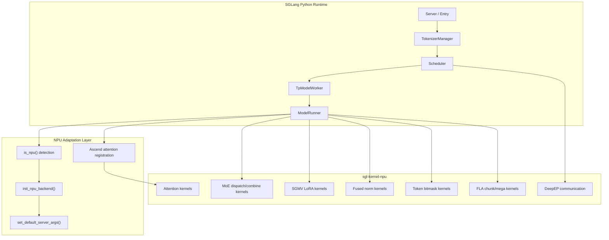

[中文](./01-sglang-npu-component-map.md) | [English](./01-sglang-npu-component-map_EN.md)

# 01. SGLang NPU Component Map

## Complete Component Map: SGLang ↔ sgl-kernel-npu



## Component Registration Flow

```text
1. is_npu() → True
2. init_npu_backend():
   - Initialize torch_npu device
   - Set HCCL environment
   - Initialize ZBAL memory
3. set_default_server_args():
   - attention_backend = "ascend"
   - page_size = 128
   - disable_custom_all_reduce = True
4. ModelRunner.init_attention_backend():
   - Load AscendAttnBackend
   - Register attention kernel
5. ModelRunner.forward():
   - Uses torch.ops.npu or sgl_kernel_npu calls
   - Routes to appropriate kernel based on operation
```

## Kernel Dispatch Decision

```text
Operation needed
  ├─ Standard PyTorch op → torch.ops (may route to torch_npu)
  ├─ NPU-specific op → torch.ops.npu.*
  ├─ SGLang custom op → sgl_kernel_npu.*
  │   ├─ Triton kernel → Triton-Ascend compiled
  │   └─ Ascend C kernel → Ascend C compiled
  └─ Fallback → CPU or generic GPU path
```

## Key Source Files

| Component | Source |
|---|---|
| NPU detection | `srt/utils/common.py` |
| NPU backend init | `srt/hardware_backend/npu/utils.py` |
| Ascend attention | `srt/layers/attention/ascend/` |
| Ascend LoRA | `srt/lora/backend/ascend_backend.py` |
| NPU graph | `srt/compilation/npu_piecewise_backend.py` |
| HCCL communication | `srt/distributed/parallel_state.py` |
| Ascend transfer engine | `srt/disaggregation/ascend/transfer_engine.py` |
