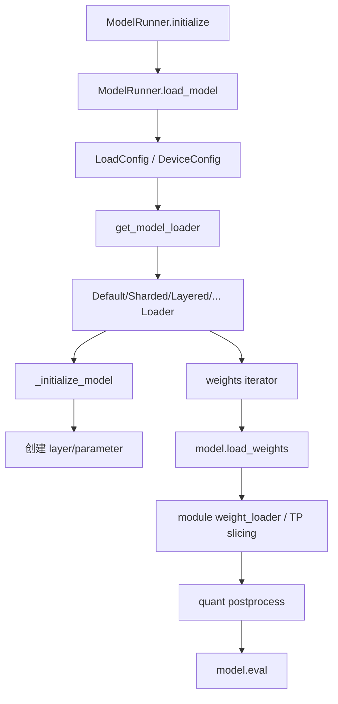
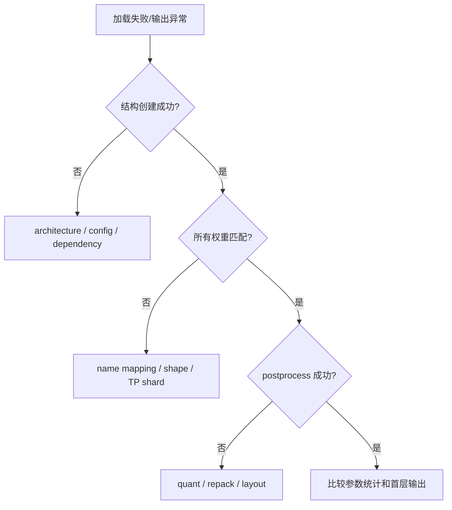

# 04. 模型加载、权重放置与 dtype/layout

本讲追踪模型从本地/Hugging Face/ModelScope checkpoint 进入 NPU 的过程，解释 loader、模型类、weight loader、quant method 和 NPU format cast 的职责边界。

## 本讲目标

- 理解 `ModelRunner.load_model()` 到 `DefaultModelLoader.load_model()` 的调用关系。
- 区分“创建模型结构”和“填充 checkpoint 权重”。
- 说明 TP 权重切分由哪些层负责。
- 理解量化权重加载后的 postprocess。
- 解释 ND/FRACTAL_NZ layout 与 fallback。
- 建立加载错误、精度错误和性能错误的排查顺序。

## 1. 总体加载链



关键文件：

```text
python/sglang/srt/model_executor/model_runner.py
python/sglang/srt/model_loader/loader.py
python/sglang/srt/configs/device_config.py
python/sglang/srt/layers/linear.py
python/sglang/srt/layers/vocab_parallel_embedding.py
python/sglang/srt/hardware_backend/npu/utils.py
python/sglang/srt/hardware_backend/npu/quantization/
```

## 2. ModelRunner 先建立运行环境

ModelRunner 构造阶段在加载权重前已经完成：

- 保存 TP/PP/EP rank。
- 初始化 torch distributed 和设备。
- 创建 forward stream。
- 设置 offloader。
- 创建 sampler。
- 计算模型配置和 attention 架构。

因此 loader 收到的不是一个无上下文路径，而是：

- `ModelConfig`：架构、dtype、量化、层数。
- `LoadConfig`：load format、download dir、额外配置。
- `DeviceConfig`：目标 device type。
- 已初始化的 distributed rank。

## 3. Loader 选择

`get_model_loader()` 根据 `load_format` 等配置选择：

| Loader | 场景 |
|---|---|
| `DefaultModelLoader` | 普通 safetensors/PyTorch checkpoint。 |
| `LayeredModelLoader` | 逐层 materialize，降低峰值内存。 |
| `ShardedStateLoader` | 已按 rank 分片的 checkpoint。 |
| `BitsAndBytesModelLoader` | bitsandbytes 权重。 |
| `GGUFModelLoader` | GGUF。 |
| `DummyModelLoader` | 测试/随机权重。 |
| Remote loaders | 远程实例和权重传输。 |

Ascend NPU 并不一定需要单独的“全模型 NPU loader”。多数流程复用通用 loader，在 layer quant method、weight loader、device context 和 postprocess 中进入 NPU 分支。

## 4. DefaultModelLoader 的两个阶段

### 4.1 创建模型结构

```python
target_device = torch.device(device_config.device)
quant_config = _get_quantization_config(...)

with set_default_torch_dtype(model_config.dtype):
    with target_device:
        model = _initialize_model(...)
```

`_initialize_model()` 根据模型 architecture 找到 SGLang 模型类，并把 quant config 传给各 layer。此时参数对象、TP linear layer 和 quant method 已建立，但 checkpoint 内容还没全部填入。

### 4.2 加载权重并 postprocess

```text
_get_all_weights
  -> _get_weights_iterator
  -> model.load_weights(weights)
  -> 遍历 model.named_modules
  -> quant_method.process_weights_after_loading
```

最后 `model.eval()`。

这两个阶段出错含义不同：

- 结构创建失败：模型 architecture、依赖或 quant config 不兼容。
- load_weights 失败：参数名、shape、TP slice、checkpoint 不匹配。
- postprocess 失败：repack、scale、NPU quant kernel/layout 不满足要求。

## 5. 权重文件迭代器

`_get_weights_iterator()` 负责：

- 准备本地 checkpoint 文件。
- 选择 safetensors、PyTorch、np cache 等 iterator。
- 可选多线程预取。
- 为 MTP/draft 模型过滤层。
- 给 secondary weights 添加 prefix。

iterator 产生：

```text
(checkpoint_parameter_name, CPU tensor)
```

它不负责最终 TP slicing。参数怎样落入本 rank，通常由模型的 `load_weights()` 和具体 parameter 的 `weight_loader` 决定。

## 6. 模型 `load_weights()` 与 layer weight loader

模型类通常维护 stacked parameter mapping，例如：

```text
q_proj + k_proj + v_proj -> qkv_proj
gate_proj + up_proj      -> gate_up_proj
```

模型 `load_weights()` 根据 checkpoint name 找到目标 parameter，再调用其 `weight_loader`。

对于 TP layer，weight loader 会根据：

- tp rank。
- output/input partition dimension。
- shard id（q/k/v 或 gate/up）。
- quant pack factor。

选择本 rank 的切片。

所以“TP1 正确、TP4 权重错误”时，重点不是文件 iterator，而是 model mapping 和 layer weight loader。

## 7. DeviceConfig 的作用

`DeviceConfig` 接受：

```text
cuda / xpu / hpu / cpu / npu / musa / mps
```

对于 NPU：

```python
self.device_type = "npu"
self.device = torch.device("npu")
```

具体 rank 卡号已在进程设备上下文中确定。loader 用 target device 创建/materialize 参数。

## 8. dtype 的来源

模型 dtype 可能来自：

- CLI `--dtype`。
- model config 中的 torch dtype。
- auto 规则。
- 量化配置。

`set_default_torch_dtype(model_config.dtype)` 控制模型结构创建时的默认 dtype。但不是所有参数都必须相同：

- norm 权重可能保持 BF16/FP16。
- quantized weight 可能是 INT8/packed INT4。
- scale 可能是 FP32。
- KV cache dtype 由独立参数决定。

排查时不要只打印 `next(model.parameters()).dtype`，要按 layer 和参数类型检查。

## 9. 量化 postprocess

loader 遍历 module：

```python
quant_method = getattr(module, "quant_method", None)
if quant_method is not None:
    with device_loading_context(module, target_device):
        quant_method.process_weights_after_loading(module)
```

postprocess 可能执行：

- 权重 repack。
- scale/zero point reshape。
- NPU 需要的转置或 layout 转换。
- 动态量化 workspace 初始化。
- fused MoE 权重整理。

CPU offload 场景下，`device_loading_context` 临时把参数放到目标设备处理，再按策略放回。

## 10. NPU format 与 FRACTAL_NZ

`hardware_backend/npu/utils.py` 定义：

```text
ACL_FORMAT_ND = 2
ACL_FORMAT_FRACTAL_NZ = 29
```

`npu_format_cast()` 调用：

```python
torch.ops.npu.npu_format_cast(tensor, acl_format.value)
```

### 10.1 进入 format cast 前的分支

```text
不是 NPU -> 原 tensor
SGLANG_NPU_DISABLE_ACL_FORMAT_WEIGHT -> 原 tensor
tensor 在 CPU -> warning + 原 tensor
shape 不满足 NZ 对齐 -> warning + ND fallback
meta tensor -> 原 tensor
其他 -> npu_format_cast
```

### 10.2 对齐约束

当前 utility 检查最后两维：

| dtype | 对齐要求 |
|---|---|
| BF16/FP16 | K、N 都能被 16 整除。 |
| INT8 | K/16，N/32。 |
| packed INT4 | K/16，N/64。 |

不对齐不会必然导致正确性错误，而是回退 ND，可能降低性能。

## 11. Linear 和 Embedding 的 NPU 分叉

`layers/linear.py` 是通用 TP linear 抽象。NPU 差异常由 `quant_method` 或导入的 Ascend method 实现，例如 GPTQ/AWQ/W8A8。

`vocab_parallel_embedding.py` 则处理：

- vocab range partition。
- masked input。
- 本 rank embedding lookup。
- TP reduce/gather。
- lm_head 权重。

这两处都是 TP 精度问题高发点：权重 shard、padding vocab、量化 scale 任一错误都会改变输出。

## 12. LayeredModelLoader

逐层 loader 先在 meta device 创建模型，再对每个 module：

```text
module.to_empty(target_device)
  -> model.load_weights_to_module
  -> 可选量化
```

优点是降低峰值内存；风险是模型类必须正确实现逐模块加载接口。普通 loader 正确而 layered loader 错误时，应比较 materialize 顺序和 module name mapping。

## 13. 加载问题定位顺序



建议检查：

```python
for name, param in model.named_parameters():
    print(name, tuple(param.shape), param.dtype, param.device)
```

大模型不要打印全部值，记录 shape、dtype、min/max/mean、是否 NaN 即可。

## 14. 精度与性能风险

| 风险 | 现象 |
|---|---|
| checkpoint 名称 mapping 错 | 某层未加载或加载到错误 parameter。 |
| TP slicing 错 | 单卡正确，多卡错误。 |
| dtype 错 | logits 误差扩大或 kernel 不支持。 |
| scale/zero point 错 | 量化模型严重精度下降。 |
| NZ cast 未发生 | 正确但 GEMM 性能低。 |
| CPU offload + format | 频繁搬运和 warning。 |
| meta materialize 漏参数 | 运行时访问未初始化权重。 |

## 15. 最小实践

### 15.1 比较 TP1/TP2 参数摘要

在调试分支临时增加摘要，记录每 rank 同一参数的：

```text
name
global shape / local shape
dtype
sum / abs max
tp rank
```

不要期望不同 rank shard 的 sum 完全相同；目标是验证切分维度和拼接后与 reference 一致。

### 15.2 观察 format fallback

```bash
grep -E "FRACTAL_NZ|format cast|falling back|ND format" \
  /workspace/sglang-npu/logs/server.log
```

### 15.3 关闭 ACL format 做对照

只在单个命令作用域内设置：

```bash
SGLANG_NPU_DISABLE_ACL_FORMAT_WEIGHT=1 \
sglang serve ...
```

比较正确性和性能，结束命令后不会污染其他 shell。

## 16. 检查题

1. checkpoint iterator 是否负责 TP slicing？
2. 为什么模型结构创建时就需要 quant config？
3. `process_weights_after_loading()` 通常做什么？
4. NZ 不对齐时当前实现怎样处理？
5. 单卡正确、TP 多卡错误时应先检查哪一层？

## 本讲小结

模型加载由通用 loader 驱动，但 NPU 差异分散在 target device、quant method、weight postprocess 和 format/layout 中。排查时先分清结构创建、checkpoint mapping、TP slicing、量化 postprocess 和设备 layout 五个阶段，避免把所有加载问题都归因给 checkpoint 文件。
